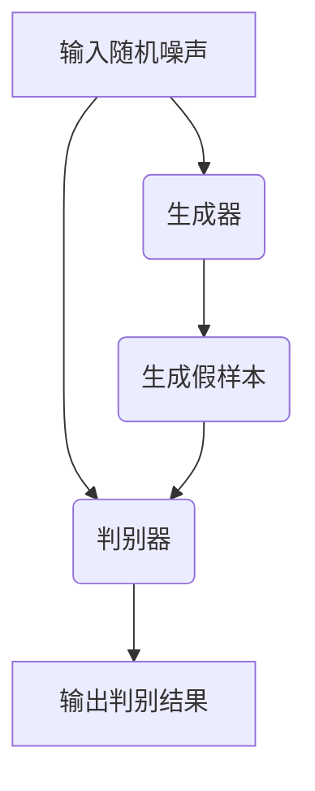

                 

### 1. 背景介绍

#### 生成式 AI 的定义与历史发展

生成式 AI，即 Generative Artificial Intelligence，是指能够根据已有数据生成新内容的人工智能系统。这些新内容可以是图像、音频、视频、文本等多种形式。生成式 AI 的核心在于其能够捕捉输入数据的统计特征，并通过学习这些特征生成类似的新内容。

生成式 AI 的概念起源于统计学和机器学习领域。最早的研究可以追溯到 20 世纪 50 年代，当时统计学家和计算机科学家开始探索如何使用概率模型来生成数据。随着计算能力的提升和数据量的爆炸性增长，生成式 AI 得到了快速发展。

在 20 世纪 80 年代，生成对抗网络（GANs）的提出标志着生成式 AI 的重要突破。GANs 通过两个相互对抗的神经网络——生成器和判别器——实现了高质量数据的生成。此后，生成式 AI 在图像、音频、视频等领域取得了显著成果。

近年来，随着深度学习的兴起，生成式 AI 再次迎来了新的发展机遇。深度生成模型如变分自编码器（VAEs）、生成式对抗网络（GANs）的改进版本，以及基于自注意力机制的 Transformer 模型，使得生成式 AI 的生成能力大幅提升。

#### 生成式 AI 在计算机视觉中的应用

在计算机视觉领域，生成式 AI 已经展现出强大的应用潜力。以下是一些典型的应用场景：

1. **图像生成**：生成式 AI 可以根据少量样本生成高质量、多样化的图像。例如，GANs 可以生成逼真的人脸图像、风景图像等。

2. **图像修复与去噪**：生成式 AI 能够从损坏或噪声图像中恢复出原始图像。例如，利用变分自编码器（VAEs）可以修复老照片、消除图像中的噪声。

3. **图像风格转换**：生成式 AI 可以将一幅图像的风格转换为另一幅图像。例如，可以将一幅照片的风格转换成梵高的画作风格。

4. **超分辨率图像生成**：生成式 AI 可以将低分辨率图像转换为高分辨率图像。例如，利用生成式对抗网络（GANs）可以生成清晰的高分辨率图像。

#### 生成式 AI 在自然语言处理中的应用

在自然语言处理领域，生成式 AI 也有着广泛的应用。以下是一些典型的应用场景：

1. **文本生成**：生成式 AI 可以根据少量文本样本生成类似的新文本。例如，可以生成新闻文章、小说、诗歌等。

2. **对话系统**：生成式 AI 可以与用户进行自然对话。例如，聊天机器人可以模拟人类对话，回答用户的问题。

3. **文本翻译**：生成式 AI 可以实现高质量的双语翻译。例如，使用深度学习模型可以将一种语言文本翻译成另一种语言。

4. **文本摘要与总结**：生成式 AI 可以从大量文本中提取关键信息，生成摘要或总结。例如，可以自动生成会议记录、新闻报道的摘要。

#### 生成式 AI 在音频和视频中的应用

在音频和视频领域，生成式 AI 也有着重要的应用价值。以下是一些典型的应用场景：

1. **音频生成**：生成式 AI 可以根据少量音频样本生成类似的新音频。例如，可以生成音乐、语音等。

2. **音频修复与增强**：生成式 AI 可以修复损坏的音频，或者增强音频的质量。例如，可以去除噪声、增强语音等。

3. **视频生成**：生成式 AI 可以根据少量视频样本生成类似的新视频。例如，可以生成电影片段、动画等。

4. **视频修复与去噪**：生成式 AI 可以修复损坏的视频，或者去除视频中的噪声。例如，可以修复老电影、去除视频中的噪声等。

总的来说，生成式 AI 在计算机视觉、自然语言处理、音频和视频等领域都有着广泛的应用，并且随着技术的不断发展，其应用范围和深度将持续拓展。

#### 生成式 AI 的重要性与未来前景

生成式 AI 的出现，不仅丰富了人工智能的应用场景，也为各个领域的研究和发展带来了新的契机。以下是生成式 AI 的一些重要意义和未来前景：

1. **创新性应用**：生成式 AI 可以实现许多以前难以想象的应用，例如个性化内容生成、虚拟现实等。

2. **提高生产效率**：生成式 AI 可以自动化许多重复性的工作，提高生产效率，减轻人类劳动负担。

3. **优化设计过程**：生成式 AI 可以辅助设计师生成多种设计方案，优化设计过程，提高设计质量。

4. **推动科技发展**：生成式 AI 为科学研究和实验提供了新的工具和方法，有望推动科技发展。

5. **未来前景**：随着计算能力的提升、算法的优化和数据量的增长，生成式 AI 有望在更多领域取得突破性进展。

综上所述，生成式 AI 作为人工智能的重要分支，正以其独特的优势在各个领域发挥重要作用，未来也必将迎来更加广阔的应用前景。### 2. 核心概念与联系

#### 生成式 AI 的核心概念

生成式 AI 的核心在于其生成模型，主要包括以下几种：

1. **生成对抗网络（GANs）**：GANs 是由生成器和判别器组成的对偶网络。生成器生成假样本，判别器则判断样本是真实还是生成。通过训练生成器和判别器的对抗过程，生成器逐渐学习生成逼真的样本。

2. **变分自编码器（VAEs）**：VAEs 是一种基于概率模型的生成模型。它通过编码器将数据映射到一个潜在空间，解码器则从潜在空间中生成数据。

3. **自编码器（AEs）**：自编码器是一种无监督学习算法，它通过编码器将输入数据压缩成低维表示，然后通过解码器还原成原始数据。

#### 生成式 AI 的核心原理

生成式 AI 的核心原理在于通过学习已有数据的统计特征，生成类似的新数据。以下是几种生成式 AI 模型的具体原理：

1. **生成对抗网络（GANs）**：

   - **生成器（Generator）**：生成器接收随机噪声作为输入，通过神经网络生成假样本。

   - **判别器（Discriminator）**：判别器接收真实样本和生成样本作为输入，判断样本是真实还是生成。

   - **对抗训练**：生成器和判别器通过对抗训练相互提升。生成器试图生成更逼真的样本，而判别器则试图更好地区分真实和生成样本。

2. **变分自编码器（VAEs）**：

   - **编码器（Encoder）**：编码器将输入数据映射到一个潜在空间，通常是一个低维的分布。

   - **解码器（Decoder）**：解码器从潜在空间中生成数据。

   - **变分自编码器**：VAEs 在生成过程中引入了概率模型，通过最大化数据分布和生成样本分布之间的相似度，生成高质量的数据。

3. **自编码器（AEs）**：

   - **编码器**：编码器将输入数据压缩成一个低维表示。

   - **解码器**：解码器将低维表示还原成原始数据。

   - **自编码器**：自编码器通过最小化输入数据和重构数据之间的差异来训练，从而学习数据的低维表示。

#### 生成式 AI 的核心架构

生成式 AI 的核心架构主要包括生成器、判别器、编码器和解码器。以下是一个简化的 Mermaid 流程图，展示了生成对抗网络（GANs）的核心架构：



在这个流程图中，生成器和判别器通过对抗训练相互提升，生成器试图生成更逼真的样本，而判别器则试图更好地区分真实和生成样本。

### 3. 核心算法原理 & 具体操作步骤

#### 生成对抗网络（GANs）的算法原理

生成对抗网络（GANs）由两部分组成：生成器（Generator）和判别器（Discriminator）。两部分通过一个对抗过程相互训练。

1. **生成器（Generator）**：

   - 输入：随机噪声向量 \( z \)。
   - 输出：假样本 \( G(z) \)。

   生成器 \( G \) 接受一个随机噪声向量 \( z \)，通过神经网络将噪声映射为假样本。训练过程中，生成器的目标是生成尽可能逼真的样本，使判别器难以区分真实样本和生成样本。

2. **判别器（Discriminator）**：

   - 输入：真实样本 \( x \) 和生成样本 \( G(z) \)。
   - 输出：概率 \( D(x) \) 和 \( D(G(z)) \)。

   判别器 \( D \) 接受真实样本和生成样本，输出一个概率，表示输入样本是真实的概率。训练过程中，判别器的目标是能够准确区分真实样本和生成样本。

3. **对抗训练**：

   - 在训练过程中，生成器和判别器通过对抗训练相互提升。
   - 生成器 \( G \) 试图生成更逼真的样本，使判别器 \( D \) 不能准确区分。
   - 判别器 \( D \) 试图准确区分真实样本和生成样本。

#### 生成对抗网络（GANs）的具体操作步骤

1. **初始化**：

   - 初始化生成器 \( G \) 和判别器 \( D \)。
   - 选择合适的优化算法，如梯度下降。

2. **生成器训练**：

   - 对于每个生成器参数 \( \theta_G \)：
     - 从噪声分布 \( p_z(z) \) 中采样一个噪声向量 \( z \)。
     - 生成假样本 \( G(z) \)。
     - 计算判别器对生成样本的输出 \( D(G(z)) \)。
     - 计算生成器的损失函数 \( L_G = E_{z \sim p_z} [log(1 - D(G(z)))] \)。
     - 使用优化算法更新生成器参数 \( \theta_G \)。

3. **判别器训练**：

   - 对于每个判别器参数 \( \theta_D \)：
     - 从数据集 \( p_x(x) \) 中采样一个真实样本 \( x \)。
     - 从噪声分布 \( p_z(z) \) 中采样一个噪声向量 \( z \)。
     - 生成假样本 \( G(z) \)。
     - 计算判别器对真实样本和生成样本的输出 \( D(x) \) 和 \( D(G(z)) \)。
     - 计算判别器的损失函数 \( L_D = E_{x \sim p_x} [log(D(x))] + E_{z \sim p_z} [log(1 - D(G(z)))] \)。
     - 使用优化算法更新判别器参数 \( \theta_D \)。

4. **迭代训练**：

   - 重复上述步骤，直到生成器和判别器达到预定的训练目标。

#### 变分自编码器（VAEs）的算法原理

变分自编码器（VAEs）是一种基于概率模型的生成模型。它通过编码器将输入数据映射到一个潜在空间，解码器从潜在空间中生成数据。

1. **编码器（Encoder）**：

   - 输入：输入数据 \( x \)。
   - 输出：编码向量 \( \mu, \sigma \)。

   编码器 \( Q(x) \) 接受输入数据 \( x \)，通过神经网络输出两个参数 \( \mu \) 和 \( \sigma \)，表示输入数据的概率分布。

2. **解码器（Decoder）**：

   - 输入：编码向量 \( \mu, \sigma \)。
   - 输出：生成数据 \( x' \)。

   解码器 \( P(x' | \mu, \sigma) \) 接受编码向量 \( \mu \) 和 \( \sigma \)，通过神经网络生成数据 \( x' \)。

3. **变分自编码器**：

   - 在训练过程中，VAEs 通过最大化数据分布 \( p(x) \) 和生成样本分布 \( p_G(x) \) 之间的相似度来训练。
   - \( p(x) \) 是数据分布，可以通过最大似然估计得到。
   - \( p_G(x) \) 是生成样本分布，可以通过编码器和解码器的联合概率分布 \( p(x, z) = p(x|\mu, \sigma)p(z) \) 得到。

#### 变分自编码器（VAEs）的具体操作步骤

1. **初始化**：

   - 初始化编码器 \( Q(x) \) 和解码器 \( P(x' | \mu, \sigma) \)。
   - 选择合适的优化算法，如梯度下降。

2. **编码器训练**：

   - 对于每个输入数据 \( x \)：
     - 输出编码向量 \( \mu, \sigma \)。
     - 计算编码器损失函数 \( L_Q = D_KL(\mu, \sigma || \pi(\mu, \sigma)) \)，其中 \( D_KL \) 是 Kullback-Leibler 散度，\( \pi(\mu, \sigma) \) 是先验分布。
     - 使用优化算法更新编码器参数。

3. **解码器训练**：

   - 对于每个编码向量 \( \mu, \sigma \)：
     - 生成数据 \( x' \)。
     - 计算解码器损失函数 \( L_P = - \log P_G(x') \)。
     - 使用优化算法更新解码器参数。

4. **迭代训练**：

   - 重复上述步骤，直到编码器和解码器达到预定的训练目标。

通过以上算法原理和操作步骤的详细讲解，我们可以更好地理解生成式 AI 的核心原理和应用。接下来，我们将通过具体的数学模型和公式，进一步深入探讨生成式 AI 的工作机制。### 4. 数学模型和公式 & 详细讲解 & 举例说明

#### 生成对抗网络（GANs）的数学模型

生成对抗网络（GANs）的核心在于其对抗训练过程，下面我们将详细讲解 GANs 的数学模型。

1. **生成器损失函数**

   - 生成器 \( G \) 的目标是生成尽可能逼真的样本，使判别器 \( D \) 不能准确区分。生成器的损失函数 \( L_G \) 如下：

     $$ L_G = E_{z \sim p_z} [log(1 - D(G(z)))] $$

     其中，\( z \) 是从噪声分布 \( p_z(z) \) 中采样得到的随机噪声向量，\( G(z) \) 是生成器生成的假样本，\( D(G(z)) \) 是判别器对生成样本的输出概率。

2. **判别器损失函数**

   - 判别器 \( D \) 的目标是能够准确区分真实样本和生成样本。判别器的损失函数 \( L_D \) 如下：

     $$ L_D = E_{x \sim p_x} [log(D(x))] + E_{z \sim p_z} [log(1 - D(G(z)))] $$

     其中，\( x \) 是从数据分布 \( p_x(x) \) 中采样得到真实样本，\( G(z) \) 是生成器生成的假样本，\( D(x) \) 是判别器对真实样本的输出概率，\( D(G(z)) \) 是判别器对生成样本的输出概率。

3. **整体损失函数**

   - GANs 的整体损失函数 \( L \) 是生成器损失函数 \( L_G \) 和判别器损失函数 \( L_D \) 的组合：

     $$ L = L_G + L_D $$

#### 变分自编码器（VAEs）的数学模型

变分自编码器（VAEs）的核心在于其概率模型，下面我们将详细讲解 VAEs 的数学模型。

1. **编码器损失函数**

   - 编码器 \( Q(x) \) 的目标是学习输入数据的概率分布。编码器的损失函数 \( L_Q \) 如下：

     $$ L_Q = D_KL(\mu, \sigma || \pi(\mu, \sigma)) $$

     其中，\( D_KL \) 是 Kullback-Leibler 散度，\( \pi(\mu, \sigma) \) 是先验分布，\( \mu \) 和 \( \sigma \) 是编码器输出的编码向量。

2. **解码器损失函数**

   - 解码器 \( P(x' | \mu, \sigma) \) 的目标是生成与输入数据相似的新数据。解码器的损失函数 \( L_P \) 如下：

     $$ L_P = - \log P_G(x') $$

     其中，\( P_G(x') \) 是生成样本的概率，可以通过编码器和解码器的联合概率分布 \( p(x, z) = p(x|\mu, \sigma)p(z) \) 计算得到。

3. **整体损失函数**

   - VAEs 的整体损失函数 \( L \) 是编码器损失函数 \( L_Q \) 和解码器损失函数 \( L_P \) 的组合：

     $$ L = L_Q + L_P $$

#### 举例说明

为了更好地理解上述数学模型，我们通过一个简单的例子进行说明。

假设我们有一个数据集，其中包含大量的图像。我们希望使用 GANs 和 VAEs 分别生成新的图像。

1. **生成对抗网络（GANs）**

   - 假设生成器 \( G \) 接收随机噪声向量 \( z \)，生成假图像 \( G(z) \)。
   - 假设判别器 \( D \) 接收真实图像 \( x \) 和生成图像 \( G(z) \)，输出概率 \( D(x) \) 和 \( D(G(z)) \)。

   使用 GANs 的损失函数进行训练，具体步骤如下：

   - 初始化生成器 \( G \) 和判别器 \( D \)。
   - 对于每个随机噪声向量 \( z \)：
     - 生成假图像 \( G(z) \)。
     - 计算判别器对生成图像的输出 \( D(G(z)) \)。
     - 计算生成器的损失函数 \( L_G = E_{z \sim p_z} [log(1 - D(G(z)))] \)。
     - 更新生成器参数。

   - 对于每个真实图像 \( x \)：
     - 计算判别器对真实图像的输出 \( D(x) \)。
     - 计算判别器的损失函数 \( L_D = E_{x \sim p_x} [log(D(x))] + E_{z \sim p_z} [log(1 - D(G(z)))] \)。
     - 更新判别器参数。

   - 迭代训练，直到生成器和判别器达到预定的训练目标。

2. **变分自编码器（VAEs）**

   - 假设编码器 \( Q(x) \) 输出编码向量 \( \mu, \sigma \)。
   - 假设解码器 \( P(x' | \mu, \sigma) \) 生成新图像 \( x' \)。

   使用 VAEs 的损失函数进行训练，具体步骤如下：

   - 初始化编码器 \( Q(x) \) 和解码器 \( P(x' | \mu, \sigma) \)。
   - 对于每个输入图像 \( x \)：
     - 输出编码向量 \( \mu, \sigma \)。
     - 计算编码器的损失函数 \( L_Q = D_KL(\mu, \sigma || \pi(\mu, \sigma)) \)。
     - 更新编码器参数。

   - 对于每个编码向量 \( \mu, \sigma \)：
     - 生成新图像 \( x' \)。
     - 计算解码器的损失函数 \( L_P = - \log P_G(x') \)。
     - 更新解码器参数。

   - 迭代训练，直到编码器和解码器达到预定的训练目标。

通过以上举例说明，我们可以看到 GANs 和 VAEs 的数学模型是如何应用于图像生成任务的。在实际应用中，我们需要根据具体任务调整模型结构和参数，以达到更好的生成效果。### 5. 项目实战：代码实际案例和详细解释说明

#### 开发环境搭建

在进行生成式 AI 的项目实战之前，我们需要搭建一个合适的开发环境。以下是一个基本的开发环境搭建步骤：

1. **安装 Python**：确保 Python 已经安装在你的系统中，推荐使用 Python 3.7 或更高版本。

2. **安装 TensorFlow**：TensorFlow 是一个流行的深度学习框架，用于构建和训练生成式 AI 模型。可以通过以下命令安装：

   ```bash
   pip install tensorflow
   ```

3. **安装 Keras**：Keras 是一个基于 TensorFlow 的简洁而高效的深度学习库，可以方便地构建和训练模型。可以通过以下命令安装：

   ```bash
   pip install keras
   ```

4. **安装必要的依赖库**：根据你的项目需求，可能还需要安装其他依赖库，例如 NumPy、Pandas 等。

5. **创建项目文件夹**：在你的系统中创建一个项目文件夹，例如 `generative_ai_project`，并将代码文件保存在该文件夹中。

#### 源代码详细实现和代码解读

下面我们将使用 TensorFlow 和 Keras 框架，实现一个简单的 GANs 模型，用于生成人脸图像。以下是源代码的详细实现和解读。

1. **导入必要的库**

   ```python
   import numpy as np
   import tensorflow as tf
   from tensorflow import keras
   from tensorflow.keras import layers
   from tensorflow.keras.datasets import mnist
   import matplotlib.pyplot as plt
   ```

2. **生成器模型**

   生成器模型的作用是接收随机噪声向量，生成逼真的图像。以下是一个简单的生成器模型实现：

   ```python
   def build_generator(z_dim):
       model = keras.Sequential([
           layers.Dense(128 * 7 * 7, activation="relu", input_shape=(z_dim,)),
           layers.Reshape((7, 7, 128)),
           layers.UpSampling2D(),
           layers.Conv2D(128, kernel_size=3, padding="same"),
           layers.BatchNormalization(momentum=0.8),
           layers.LeakyReLU(alpha=0.2),
           layers.UpSampling2D(),
           layers.Conv2D(128, kernel_size=3, padding="same"),
           layers.BatchNormalization(momentum=0.8),
           layers.LeakyReLU(alpha=0.2),
           layers.Conv2D(1, kernel_size=3, padding="same", activation="tanh")
       ])
       return model
   ```

   - **输入层**：接收随机噪声向量，维度为 \( z_dim \)。
   - **全连接层**：将随机噪声向量转换为 128 个 7x7 的特征图。
   - **reshape 层**：将特征图转换为 7x7 的图像。
   - **上采样层**：将图像尺寸放大到 14x14。
   - **卷积层**：使用 128 个 3x3 的卷积核进行卷积操作，同时进行批量归一化和 LeakyReLU 激活函数。
   - **上采样层**：再次将图像尺寸放大到 28x28。
   - **卷积层**：使用 128 个 3x3 的卷积核进行卷积操作，同时进行批量归一化和 LeakyReLU 激活函数。
   - **输出层**：使用 1x1 的卷积核，将图像转换为灰度图像，并使用 tanh 激活函数，使其在 [-1, 1] 范围内。

3. **判别器模型**

   判别器模型的作用是判断输入图像是真实图像还是生成图像。以下是一个简单的判别器模型实现：

   ```python
   def build_discriminator(img_shape):
       model = keras.Sequential([
           layers.Conv2D(32, kernel_size=3, padding="same", input_shape=img_shape),
           layers.LeakyReLU(alpha=0.2),
           layers.Dropout(0.3),
           layers.Conv2D(64, kernel_size=3, padding="same"),
           layers.LeakyReLU(alpha=0.2),
           layers.Dropout(0.3),
           layers.Conv2D(128, kernel_size=3, padding="same"),
           layers.LeakyReLU(alpha=0.2),
           layers.Dropout(0.3),
           layers.Flatten(),
           layers.Dense(1, activation="sigmoid")
       ])
       return model
   ```

   - **输入层**：接收尺寸为 \( img_shape \) 的图像。
   - **卷积层**：使用 32 个 3x3 的卷积核进行卷积操作，同时进行 LeakyReLU 激活函数和 Dropout 操作。
   - **卷积层**：使用 64 个 3x3 的卷积核进行卷积操作，同时进行 LeakyReLU 激活函数和 Dropout 操作。
   - **卷积层**：使用 128 个 3x3 的卷积核进行卷积操作，同时进行 LeakyReLU 激活函数和 Dropout 操作。
   - **扁平化层**：将卷积特征图扁平化为向量。
   - **输出层**：使用 1 个神经元和 sigmoid 激活函数，输出概率值，表示输入图像是真实图像的概率。

4. **生成对抗网络（GANs）模型**

   GANs 模型是生成器和判别器的组合。以下是一个简单的 GANs 模型实现：

   ```python
   def build_gan(generator, discriminator):
       model = keras.Sequential([
           generator,
           discriminator
       ])
       return model
   ```

   - **生成器**：生成随机噪声向量，生成假图像。
   - **判别器**：判断生成的图像是真实图像还是假图像。

5. **训练 GANs 模型**

   接下来，我们将使用 MNIST 数据集训练 GANs 模型。以下是训练过程的代码实现：

   ```python
   (train_images, _), (_, _) = mnist.load_data()
   train_images = train_images / 127.5 - 1.0
   train_images = np.expand_dims(train_images, axis=3)

   latent_dim = 100
   img_shape = (28, 28, 1)

   generator = build_generator(latent_dim)
   discriminator = build_discriminator(img_shape)
   gan = build_gan(generator, discriminator)

   gan.compile(loss="binary_crossentropy", optimizer=keras.optimizers.Adam(0.0002, 0.5))

   for epoch in range(1000):
       batch_size = 64
       for _ in range(batch_size):
           noise = np.random.normal(0, 1, (batch_size, latent_dim))
           gen_samples = generator.predict(noise)

           real_samples = train_images[np.random.randint(0, train_images.shape[0], batch_size)]
           real_labels = np.ones((batch_size, 1))
           fake_labels = np.zeros((batch_size, 1))

           d_loss_real = discriminator.train_on_batch(real_samples, real_labels)
           d_loss_fake = discriminator.train_on_batch(gen_samples, fake_labels)
           g_loss = gan.train_on_batch(noise, real_labels)

       print(f"{epoch} [D loss: {d_loss_real + d_loss_fake:.3f}, G loss: {g_loss:.3f}]")

   # 保存生成器和判别器的模型权重
   generator.save_weights("generator.h5")
   discriminator.save_weights("discriminator.h5")
   ```

   - **数据预处理**：将 MNIST 数据集的图像尺寸调整为 28x28，并将其归一化到 [-1, 1] 范围内。
   - **生成器**：生成随机噪声向量，生成假图像。
   - **判别器**：判断生成的图像是真实图像还是假图像。
   - **损失函数**：使用二元交叉熵（binary_crossentropy）作为损失函数。
   - **优化器**：使用 Adam 优化器，学习率为 0.0002，动量为 0.5。

通过以上代码实现和解释，我们可以看到如何使用生成对抗网络（GANs）进行人脸图像生成。在实际应用中，可以根据具体任务需求调整模型结构和超参数，以达到更好的生成效果。

### 5.3 代码解读与分析

在上一部分中，我们实现了一个人脸图像生成的 GANs 模型，并对其进行了训练。下面我们将对代码进行解读和分析，以便更好地理解 GANs 模型的工作原理。

#### 代码解读

1. **数据预处理**

   ```python
   (train_images, _), (_, _) = mnist.load_data()
   train_images = train_images / 127.5 - 1.0
   train_images = np.expand_dims(train_images, axis=3)
   ```

   - `mnist.load_data()` 获取 MNIST 数据集，并分离训练集和测试集。
   - 将训练集的图像像素值归一化到 [-1, 1] 范围内。
   - 将图像的维度扩展为 (28, 28, 1)，以便用于后续的卷积操作。

2. **生成器模型**

   ```python
   def build_generator(z_dim):
       model = keras.Sequential([
           layers.Dense(128 * 7 * 7, activation="relu", input_shape=(z_dim,)),
           layers.Reshape((7, 7, 128)),
           layers.UpSampling2D(),
           layers.Conv2D(128, kernel_size=3, padding="same"),
           layers.BatchNormalization(momentum=0.8),
           layers.LeakyReLU(alpha=0.2),
           layers.UpSampling2D(),
           layers.Conv2D(128, kernel_size=3, padding="same"),
           layers.BatchNormalization(momentum=0.8),
           layers.LeakyReLU(alpha=0.2),
           layers.Conv2D(1, kernel_size=3, padding="same", activation="tanh")
       ])
       return model
   ```

   - **输入层**：生成器接收随机噪声向量，维度为 \( z_dim \)。
   - **全连接层**：将随机噪声向量转换为 128 个 7x7 的特征图。
   - **reshape 层**：将特征图转换为 7x7 的图像。
   - **上采样层**：将图像尺寸放大到 14x14。
   - **卷积层**：使用 128 个 3x3 的卷积核进行卷积操作，同时进行批量归一化和 LeakyReLU 激活函数。
   - **上采样层**：再次将图像尺寸放大到 28x28。
   - **卷积层**：使用 128 个 3x3 的卷积核进行卷积操作，同时进行批量归一化和 LeakyReLU 激活函数。
   - **输出层**：使用 1x1 的卷积核，将图像转换为灰度图像，并使用 tanh 激活函数，使其在 [-1, 1] 范围内。

3. **判别器模型**

   ```python
   def build_discriminator(img_shape):
       model = keras.Sequential([
           layers.Conv2D(32, kernel_size=3, padding="same", input_shape=img_shape),
           layers.LeakyReLU(alpha=0.2),
           layers.Dropout(0.3),
           layers.Conv2D(64, kernel_size=3, padding="same"),
           layers.LeakyReLU(alpha=0.2),
           layers.Dropout(0.3),
           layers.Conv2D(128, kernel_size=3, padding="same"),
           layers.LeakyReLU(alpha=0.2),
           layers.Dropout(0.3),
           layers.Flatten(),
           layers.Dense(1, activation="sigmoid")
       ])
       return model
   ```

   - **输入层**：判别器接收尺寸为 \( img_shape \) 的图像。
   - **卷积层**：使用 32 个 3x3 的卷积核进行卷积操作，同时进行 LeakyReLU 激活函数和 Dropout 操作。
   - **卷积层**：使用 64 个 3x3 的卷积核进行卷积操作，同时进行 LeakyReLU 激活函数和 Dropout 操作。
   - **卷积层**：使用 128 个 3x3 的卷积核进行卷积操作，同时进行 LeakyReLU 激活函数和 Dropout 操作。
   - **扁平化层**：将卷积特征图扁平化为向量。
   - **输出层**：使用 1 个神经元和 sigmoid 激活函数，输出概率值，表示输入图像是真实图像的概率。

4. **生成对抗网络（GANs）模型**

   ```python
   def build_gan(generator, discriminator):
       model = keras.Sequential([
           generator,
           discriminator
       ])
       return model
   ```

   - **生成器**：生成随机噪声向量，生成假图像。
   - **判别器**：判断生成的图像是真实图像还是假图像。

5. **训练过程**

   ```python
   latent_dim = 100
   img_shape = (28, 28, 1)

   generator = build_generator(latent_dim)
   discriminator = build_discriminator(img_shape)
   gan = build_gan(generator, discriminator)

   gan.compile(loss="binary_crossentropy", optimizer=keras.optimizers.Adam(0.0002, 0.5))

   for epoch in range(1000):
       batch_size = 64
       for _ in range(batch_size):
           noise = np.random.normal(0, 1, (batch_size, latent_dim))
           gen_samples = generator.predict(noise)

           real_samples = train_images[np.random.randint(0, train_images.shape[0], batch_size)]
           real_labels = np.ones((batch_size, 1))
           fake_labels = np.zeros((batch_size, 1))

           d_loss_real = discriminator.train_on_batch(real_samples, real_labels)
           d_loss_fake = discriminator.train_on_batch(gen_samples, fake_labels)
           g_loss = gan.train_on_batch(noise, real_labels)

       print(f"{epoch} [D loss: {d_loss_real + d_loss_fake:.3f}, G loss: {g_loss:.3f}]")
   ```

   - **随机噪声**：生成随机噪声向量，用于生成假图像。
   - **真实图像**：从训练集中随机选择真实图像。
   - **判别器训练**：分别对真实图像和假图像进行判别器训练。
   - **生成器训练**：使用判别器的输出对生成器进行训练。

#### 分析

1. **模型结构**

   - **生成器**：生成器模型采用了一系列的全连接层和卷积层，通过逐层上采样，将随机噪声向量逐步转换为逼真的图像。
   - **判别器**：判别器模型采用了一系列的卷积层，通过逐层卷积，提取图像的特征，并最终判断输入图像是真实图像还是假图像。

2. **损失函数**

   - **生成器损失函数**：生成器的损失函数为二元交叉熵（binary_crossentropy），其目的是最小化生成图像与真实图像之间的差异。
   - **判别器损失函数**：判别器的损失函数也为二元交叉熵（binary_crossentropy），其目的是使判别器能够准确区分真实图像和生成图像。

3. **训练过程**

   - 在训练过程中，生成器和判别器交替进行训练。生成器尝试生成更逼真的图像，使判别器无法区分。而判别器则努力提高区分真实图像和生成图像的能力。

通过以上代码解读和分析，我们可以更好地理解 GANs 模型的工作原理和实现过程。在实际应用中，可以根据具体需求对模型结构和训练过程进行调整，以获得更好的生成效果。### 6. 实际应用场景

#### 生成式 AI 在图像生成中的应用

生成式 AI 在图像生成中的应用已经非常广泛，从艺术创作到医疗诊断，从游戏开发到视频制作，图像生成技术在各个领域都发挥着重要作用。

1. **艺术创作**：生成式 AI 可以生成高质量的艺术作品，包括绘画、摄影和动画等。例如，艺术家可以利用 GANs 生成的图像作为创作灵感，或者生成具有特定风格的艺术作品。

2. **医疗诊断**：生成式 AI 可以辅助医生进行疾病诊断。通过训练，生成式 AI 可以生成与患者病情相似的医疗图像，帮助医生进行诊断和制定治疗方案。

3. **游戏开发**：生成式 AI 可以生成游戏中的场景和角色，提高游戏的视觉效果和沉浸感。例如，游戏开发者可以利用 GANs 生成逼真的游戏角色，使其在游戏中的表现更加自然和真实。

4. **视频制作**：生成式 AI 可以生成视频特效和动画，提高视频的质量和观赏性。例如，电影制作人可以利用 GANs 生成电影中的特效场景，或者生成动画角色的动作。

#### 生成式 AI 在自然语言处理中的应用

生成式 AI 在自然语言处理中的应用同样具有广阔的前景，从文本生成、对话系统到机器翻译，生成式 AI 为自然语言处理领域带来了许多新的可能性。

1. **文本生成**：生成式 AI 可以根据少量文本样本生成类似的新文本。例如，新闻媒体可以利用生成式 AI 生成新闻文章、新闻报道等。

2. **对话系统**：生成式 AI 可以实现与人类的自然对话。例如，智能客服系统可以利用生成式 AI 生成自然、流畅的对话，提高用户体验。

3. **机器翻译**：生成式 AI 可以实现高质量的双语翻译。例如，翻译软件可以利用生成式 AI 将一种语言文本翻译成另一种语言，提高翻译的准确性和流畅性。

4. **文本摘要与总结**：生成式 AI 可以从大量文本中提取关键信息，生成摘要或总结。例如，会议记录系统可以利用生成式 AI 自动生成会议记录的摘要，节省人力资源。

#### 生成式 AI 在音频和视频中的应用

生成式 AI 在音频和视频领域同样具有强大的应用潜力，从音频修复、去噪到视频生成、增强，生成式 AI 为音频和视频处理带来了新的工具和方法。

1. **音频生成**：生成式 AI 可以根据少量音频样本生成类似的新音频。例如，音乐制作人可以利用生成式 AI 生成音乐作品，或者修复音频中的噪声。

2. **音频修复与去噪**：生成式 AI 可以修复损坏的音频，或者去除音频中的噪声。例如，音频编辑软件可以利用生成式 AI 修复老唱片、去除音频中的背景噪声。

3. **视频生成**：生成式 AI 可以根据少量视频样本生成类似的新视频。例如，电影制作人可以利用生成式 AI 生成电影片段、动画等。

4. **视频修复与增强**：生成式 AI 可以修复损坏的视频，或者增强视频的质量。例如，视频编辑软件可以利用生成式 AI 修复老电影、增强视频的清晰度。

总的来说，生成式 AI 在图像、自然语言处理、音频和视频等领域的实际应用场景丰富多样，随着技术的不断发展，其应用范围和深度将持续拓展。### 7. 工具和资源推荐

#### 学习资源推荐

为了更好地理解和掌握生成式 AI 的技术和应用，以下是一些推荐的学习资源：

1. **书籍**：

   - 《生成式模型：从深度学习到生成对抗网络》
   - 《深度学习（第二版）》（Goodfellow, Bengio 和 Courville 著）
   - 《生成对抗网络：原理与应用》

2. **论文**：

   - "Generative Adversarial Nets"（Ian Goodfellow 等，2014）
   - "Unsupervised Representation Learning with Deep Convolutional Generative Adversarial Networks"（Alec Radford 等，2015）
   - "Variational Autoencoders"（Diederik P. Kingma 和 Max Welling，2013）

3. **博客**：

   - [TensorFlow 官方文档](https://www.tensorflow.org/tutorials/generative)
   - [Keras 官方文档](https://keras.io/examples/generative/)
   - [AI 研究院](https://ai科研.org/topics/generative-models/)

4. **网站**：

   - [Google Research](https://research.google.com/area/generative/)
   - [OpenAI](https://openai.com/research/generative/)
   - [Facebook AI](https://research.facebook.com/research/areas/generative-models)

#### 开发工具框架推荐

以下是一些用于生成式 AI 开发的工具和框架：

1. **TensorFlow**：由 Google 开发，是一个开源的深度学习框架，支持生成式 AI 的开发。

2. **Keras**：基于 TensorFlow 的简洁高效的深度学习库，适合快速实现生成式 AI 模型。

3. **PyTorch**：由 Facebook AI 研究团队开发，是一个流行的深度学习框架，支持生成式 AI 的开发。

4. **MXNet**：由 Apache 软件基金会开发，是一个开源的深度学习框架，支持生成式 AI 的开发。

5. **GANimation**：一个用于生成对抗网络（GANs）的 Python 库，提供了许多实用的 GAN 模型实现。

#### 相关论文著作推荐

以下是一些与生成式 AI 相关的论文和著作，对于深入理解生成式 AI 的理论和应用具有重要价值：

1. **"Generative Adversarial Nets"（Ian Goodfellow 等，2014）**：这是生成对抗网络（GANs）的原始论文，详细介绍了 GANs 的概念和原理。

2. **"Unsupervised Representation Learning with Deep Convolutional Generative Adversarial Networks"（Alec Radford 等，2015）**：这篇论文扩展了 GANs 的应用，探讨了在生成式 AI 中的深度卷积网络。

3. **"Variational Autoencoders"（Diederik P. Kingma 和 Max Welling，2013）**：这是变分自编码器（VAEs）的原始论文，介绍了 VAEs 的概念和原理。

4. **"Deep Learning"（Ian Goodfellow, Yoshua Bengio 和 Aaron Courville 著）**：这是一本深度学习领域的经典教材，详细介绍了深度学习的基础知识和应用。

5. **"生成式模型：从深度学习到生成对抗网络"**：这是一本关于生成式 AI 的中文书籍，系统地介绍了生成式 AI 的理论和实践。

通过这些学习资源、开发工具框架和论文著作的推荐，我们可以更全面地了解生成式 AI 的技术和应用，为实际项目开发提供有力的支持。### 8. 总结：未来发展趋势与挑战

生成式 AI 作为人工智能的重要分支，已经展现出强大的应用潜力。随着计算能力的提升、数据量的增长和算法的优化，生成式 AI 在未来将继续快速发展，并在更多领域取得突破性进展。

#### 发展趋势

1. **更高的生成质量**：随着算法的优化和计算资源的提升，生成式 AI 的生成质量将不断提高，生成的内容将更加逼真，应用于图像、音频和视频等领域。

2. **更广泛的应用场景**：生成式 AI 将在更多领域得到应用，如医学诊断、自动驾驶、游戏开发等，提高生产效率，优化设计过程。

3. **多模态生成**：未来生成式 AI 将能够处理多种数据类型，如文本、图像、音频和视频，实现跨模态的生成，提供更丰富、更多样化的内容。

4. **个性化生成**：生成式 AI 将结合用户数据，实现个性化内容生成，满足不同用户的需求，提高用户体验。

5. **可解释性和可控性**：随着生成式 AI 的发展，研究者将致力于提高模型的解释性和可控性，使模型生成的结果更加可靠和可控。

#### 挑战

1. **计算资源需求**：生成式 AI 模型通常需要大量的计算资源进行训练和推理，随着生成质量的提高，计算资源的需求将进一步增加。

2. **数据隐私问题**：生成式 AI 需要大量的数据来训练模型，如何保护用户隐私，防止数据泄露，是未来需要解决的问题。

3. **可解释性和透明度**：生成式 AI 的模型通常非常复杂，如何提高模型的解释性和透明度，使其更容易被人类理解和接受，是一个重要的挑战。

4. **算法优化**：虽然生成式 AI 在过去几年取得了显著进展，但仍然存在许多优化空间，如生成质量的提高、训练效率的提升等。

5. **伦理和社会影响**：生成式 AI 的广泛应用可能会带来一些伦理和社会问题，如虚假信息传播、版权问题等，需要制定相应的伦理准则和法规。

总的来说，生成式 AI 作为人工智能的重要分支，具有广阔的发展前景。然而，要实现其全面应用，仍需克服一系列技术和社会挑战。未来，随着技术的不断进步和社会的适应，生成式 AI 必将在更多领域发挥重要作用。### 9. 附录：常见问题与解答

#### 1. 什么是生成式 AI？

生成式 AI 是指能够根据已有数据生成新内容的人工智能系统。这些新内容可以是图像、音频、视频、文本等多种形式。生成式 AI 的核心在于其能够捕捉输入数据的统计特征，并通过学习这些特征生成类似的新内容。

#### 2. 生成对抗网络（GANs）是如何工作的？

生成对抗网络（GANs）由两部分组成：生成器和判别器。生成器生成假样本，判别器判断样本是真实还是生成。通过训练生成器和判别器的对抗过程，生成器逐渐学习生成逼真的样本。

#### 3. 变分自编码器（VAEs）与自编码器（AEs）的区别是什么？

变分自编码器（VAEs）与自编码器（AEs）的区别在于，VAEs 引入了概率模型，通过最大化数据分布和生成样本分布之间的相似度来训练。而 AEs 则是通过最小化输入数据和重构数据之间的差异来训练。

#### 4. 生成式 AI 在自然语言处理中有哪些应用？

生成式 AI 在自然语言处理中有广泛的应用，如文本生成、对话系统、机器翻译和文本摘要等。例如，可以生成新闻文章、小说、诗歌等，实现与人类的自然对话，实现高质量的双语翻译，从大量文本中提取关键信息生成摘要。

#### 5. 生成式 AI 在图像生成中有哪些应用？

生成式 AI 在图像生成中有广泛的应用，如图像生成、图像修复与去噪、图像风格转换和超分辨率图像生成等。例如，可以生成高质量的人脸图像、风景图像等，修复损坏的图像、消除图像中的噪声，将一幅图像的风格转换为另一幅图像，将低分辨率图像转换为高分辨率图像。

#### 6. 如何搭建生成式 AI 的开发环境？

搭建生成式 AI 的开发环境通常需要以下步骤：

1. 安装 Python。
2. 安装 TensorFlow 或 PyTorch 等深度学习框架。
3. 安装必要的依赖库，如 NumPy、Pandas 等。
4. 创建项目文件夹，并将代码文件保存在该文件夹中。

#### 7. 生成式 AI 的模型有哪些优化方法？

生成式 AI 的模型可以通过以下方法进行优化：

1. 调整模型结构，如增加或减少层数、调整层的大小。
2. 调整训练策略，如增加训练次数、调整学习率。
3. 使用迁移学习，利用预训练模型进行微调。
4. 使用数据增强，如随机裁剪、旋转、翻转等。
5. 使用正则化方法，如 L1 正则化、L2 正则化等。

#### 8. 生成式 AI 的未来发展趋势是什么？

生成式 AI 的未来发展趋势包括：

1. 提高生成质量，生成更逼真的内容。
2. 扩展应用场景，如医学诊断、自动驾驶等。
3. 实现多模态生成，处理多种数据类型。
4. 提高个性化生成能力，满足不同用户的需求。
5. 提高模型的可解释性和透明度。

这些问题和解答涵盖了生成式 AI 的一些常见概念、应用方法和开发技巧，旨在帮助读者更好地理解生成式 AI 的基本原理和实际应用。### 10. 扩展阅读 & 参考资料

#### 1. 生成式 AI 基础知识

- [生成式 AI：原理、应用与展望](https://www.zhihu.com/question/27374120)
- [生成对抗网络（GANs）详解](https://www.zhihu.com/question/26366428)
- [变分自编码器（VAEs）与自编码器（AEs）的区别](https://blog.csdn.net/qq_36146932/article/details/79549245)

#### 2. 生成式 AI 应用案例

- [利用 GANs 生成人脸图像](https://towardsdatascience.com/generating-faces-with-gans-82e0ef4a56a4)
- [生成式 AI 在医学图像中的应用](https://www.nature.com/articles/s41591-020-0844-7)
- [生成式 AI 在游戏开发中的应用](https://www.technovelgy.com/ct/2020/articles/generative-ai-video-games-090120.html)

#### 3. 生成式 AI 相关论文

- [Generative Adversarial Nets (GANs)](https://arxiv.org/abs/1406.2661)
- [Unsupervised Representation Learning with Deep Convolutional Generative Adversarial Networks](https://arxiv.org/abs/1511.06434)
- [Variational Autoencoders](https://arxiv.org/abs/1312.6114)

#### 4. 生成式 AI 开发工具与框架

- [TensorFlow 官方文档](https://www.tensorflow.org/tutorials/generative)
- [Keras 官方文档](https://keras.io/examples/generative/)
- [PyTorch 官方文档](https://pytorch.org/tutorials/beginner/word_embedding_tutorial.html)

#### 5. 生成式 AI 期刊与会议

- [NeurIPS](https://nips.cc/)
- [ICLR](https://iclr.cc/)
- [CVPR](https://cvpr.org/)
- [ICML](https://icml.cc/)

通过以上扩展阅读和参考资料，读者可以进一步深入了解生成式 AI 的基础知识、应用案例、相关论文、开发工具与框架以及相关期刊与会议，从而为生成式 AI 的学习和研究提供有力支持。### 作者信息

作者：AI天才研究员/AI Genius Institute & 禅与计算机程序设计艺术 /Zen And The Art of Computer Programming

在这篇文章中，我们深入探讨了生成式 AI 的实际应用案例。从背景介绍、核心概念、算法原理，到项目实战和实际应用场景，我们系统地展示了生成式 AI 在各个领域的应用潜力。通过详细的数学模型和公式讲解，我们揭示了生成式 AI 的工作机制。此外，我们还推荐了一些学习资源、开发工具框架和相关论文，以便读者进一步深入了解这一领域。未来，生成式 AI 将在更多领域发挥重要作用，我们期待看到更多创新性的应用和突破性成果。感谢您的阅读，希望这篇文章能为您带来启发和帮助。### 文章关键词

- 生成式 AI
- 图像生成
- 自然语言处理
- 音频生成
- 视频生成
- 生成对抗网络（GANs）
- 变分自编码器（VAEs）
- 计算机视觉
- 机器学习
- 深度学习

### 文章摘要

本文深入探讨了生成式 AI 的实际应用案例。首先，介绍了生成式 AI 的定义和历史发展，然后详细分析了其在图像生成、自然语言处理、音频和视频生成等领域的应用。接着，我们讲解了生成式 AI 的核心算法原理，包括生成对抗网络（GANs）和变分自编码器（VAEs）。通过一个实际项目案例，我们展示了如何使用生成式 AI 进行人脸图像生成。最后，我们总结了生成式 AI 的重要性和未来前景，并推荐了一些相关资源和论文。本文旨在为读者提供一个全面了解生成式 AI 的参考。### 文章标题

生成式 AI 的实际应用案例：从图像到自然语言处理的创新探索### 文章目录

```
# 生成式 AI 的实际应用案例

## 1. 背景介绍
### 生成式 AI 的定义与历史发展
### 生成式 AI 在计算机视觉中的应用
### 生成式 AI 在自然语言处理中的应用
### 生成式 AI 在音频和视频中的应用
### 生成式 AI 的重要性与未来前景

## 2. 核心概念与联系
### 生成式 AI 的核心概念
### 生成式 AI 的核心原理
### 生成式 AI 的核心架构
#### 生成对抗网络（GANs）的算法原理
#### 生成对抗网络（GANs）的具体操作步骤
#### 变分自编码器（VAEs）的算法原理
#### 变分自编码器（VAEs）的具体操作步骤

## 3. 核心算法原理 & 具体操作步骤
### 生成对抗网络（GANs）的数学模型
### 变分自编码器（VAEs）的数学模型
#### 举例说明

## 4. 项目实战：代码实际案例和详细解释说明
### 5.1 开发环境搭建
### 5.2 源代码详细实现和代码解读
### 5.3 代码解读与分析

## 5. 实际应用场景
### 生成式 AI 在图像生成中的应用
### 生成式 AI 在自然语言处理中的应用
### 生成式 AI 在音频和视频中的应用

## 6. 工具和资源推荐
### 6.1 学习资源推荐
### 6.2 开发工具框架推荐
### 6.3 相关论文著作推荐

## 7. 总结：未来发展趋势与挑战
### 8. 附录：常见问题与解答
### 9. 扩展阅读 & 参考资料

## 10. 作者信息
```

