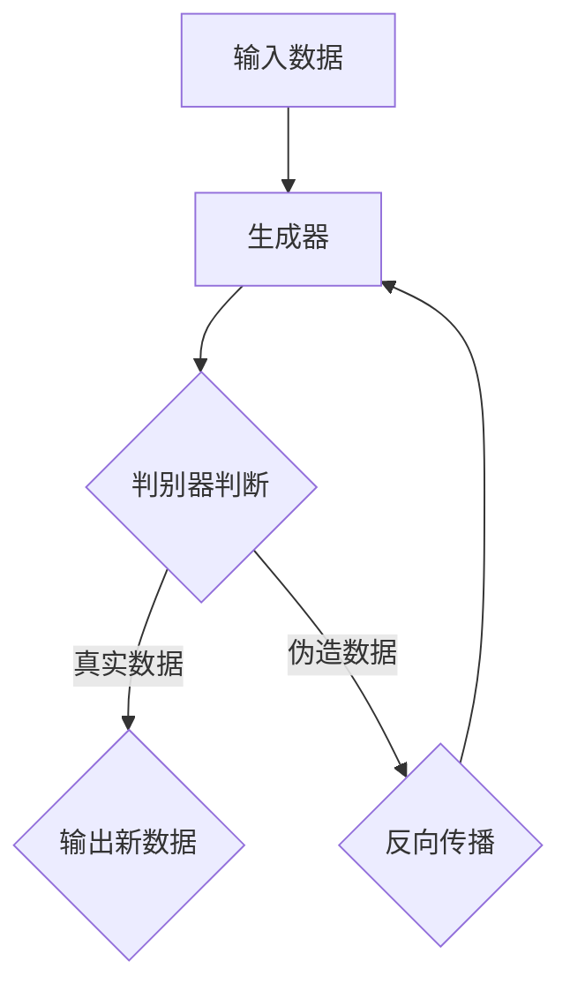

                 

# 生成式AI的实际应用案例

## 关键词
生成式AI，实际应用案例，人工智能，深度学习，算法原理，数学模型，项目实战，应用场景，工具和资源推荐

## 摘要
本文将深入探讨生成式AI在实际应用中的各种案例，包括其背景、核心概念、算法原理、数学模型以及实际应用场景。通过具体的代码实现和分析，我们将展示生成式AI如何解决实际问题，并对其未来发展趋势和挑战进行总结。本文旨在为读者提供一个全面且系统的了解，以便更好地掌握和应用生成式AI技术。

## 1. 背景介绍
生成式AI是一种人工智能技术，它能够根据已有的数据生成新的数据。与传统的判别式AI不同，生成式AI不仅仅关注数据的分类或预测，而是能够生成与输入数据具有相似特征的新数据。这种能力使得生成式AI在许多领域具有广泛的应用前景。

近年来，随着深度学习技术的发展，生成式AI取得了显著的进展。深度学习模型如生成对抗网络（GANs）、变分自编码器（VAEs）等，为生成式AI提供了强大的工具。这些模型能够通过学习大量数据来生成高质量的新数据，从而在图像、音频、文本等领域取得了显著的应用成果。

在计算机科学和人工智能领域，生成式AI被视为一种具有变革性的技术。它不仅能够为艺术家和设计师提供创作灵感，还可以为科学研究提供新的方法。例如，在医疗领域，生成式AI可以用于生成医学图像，辅助医生进行诊断；在工业领域，生成式AI可以用于生成新的产品设计和改进制造过程。

总之，生成式AI作为一种新兴的人工智能技术，具有巨大的潜力和广泛的应用前景。本文将详细介绍生成式AI的核心概念、算法原理以及实际应用案例，帮助读者更好地理解和应用这一技术。

### 2. 核心概念与联系

#### 2.1 生成式AI的定义
生成式AI是一种人工智能模型，它能够学习输入数据的概率分布，并生成与输入数据具有相似特征的新数据。生成式AI的核心思想是通过建模数据分布，从而生成与实际数据相似的新数据。这种能力使得生成式AI在图像生成、文本生成、音频生成等领域具有广泛的应用。

#### 2.2 生成式AI的架构
生成式AI的架构通常包括两个主要部分：生成器和判别器。生成器负责生成新数据，判别器负责判断生成数据的真实性和质量。这两个部分相互协作，通过对抗训练（Adversarial Training）来不断优化模型。

下面是一个简单的Mermaid流程图，展示生成式AI的基本架构：



在这个流程图中，输入数据首先进入生成器，生成器根据输入数据生成伪造数据。判别器接着对伪造数据和真实数据进行判断。如果判别器能够准确判断出伪造数据，那么生成器将尝试生成更真实的数据。这个过程通过对抗训练不断进行，直到生成器能够生成几乎无法区分的真假数据。

#### 2.3 生成式AI的核心概念
生成式AI的核心概念包括概率分布、采样、对抗训练等。

- **概率分布**：生成式AI通过学习输入数据的概率分布，来生成新的数据。概率分布描述了数据在各种状态下的概率，是生成式AI的基础。

- **采样**：生成式AI通过从概率分布中采样，生成新的数据。采样是生成新数据的关键步骤，它决定了生成数据的多样性和质量。

- **对抗训练**：生成式AI通过对抗训练来优化模型。对抗训练是一个动态的过程，生成器和判别器相互对抗，通过不断优化来提高模型的性能。

### 3. 核心算法原理 & 具体操作步骤

#### 3.1 生成对抗网络（GANs）
生成对抗网络（GANs）是生成式AI中最常用的算法之一。GANs由生成器和判别器两个部分组成，通过对抗训练来优化模型。

**3.1.1 生成器的操作步骤**
1. 初始化生成器和判别器。
2. 生成器从噪声分布中采样，生成伪造数据。
3. 判别器对伪造数据和真实数据进行判断。
4. 根据判别器的判断结果，计算生成器的损失函数，并通过反向传播更新生成器的参数。

**3.1.2 判别器的操作步骤**
1. 初始化判别器。
2. 对真实数据和伪造数据进行判断。
3. 计算判别器的损失函数，并通过反向传播更新判别器的参数。

**3.1.3 对抗训练**
对抗训练是GANs的核心，通过生成器和判别器的对抗来优化模型。具体步骤如下：
1. 生成器生成伪造数据。
2. 判别器对伪造数据和真实数据进行判断。
3. 根据判别器的判断结果，更新生成器和判别器的参数。

#### 3.2 变分自编码器（VAEs）
变分自编码器（VAEs）是另一种常用的生成式AI算法。VAEs通过编码器和解码器来生成新数据，其核心思想是学习数据的概率分布。

**3.2.1 编码器的操作步骤**
1. 初始化编码器。
2. 对输入数据进行编码，得到潜在空间中的表示。
3. 计算编码器的损失函数，并通过反向传播更新编码器的参数。

**3.2.2 解码器的操作步骤**
1. 初始化解码器。
2. 从潜在空间中采样，生成新数据。
3. 计算解码器的损失函数，并通过反向传播更新解码器的参数。

**3.2.3 变分损失**
VAEs通过变分损失来优化模型，变分损失包括重构损失和KL散度损失。具体步骤如下：
1. 编码器对输入数据进行编码，得到潜在空间中的表示。
2. 从潜在空间中采样，生成新数据。
3. 计算重构损失和KL散度损失，并通过反向传播更新编码器和解码器的参数。

### 4. 数学模型和公式 & 详细讲解 & 举例说明

#### 4.1 GANs的数学模型

**4.1.1 生成器的数学模型**
生成器的目标是最小化生成数据的损失函数，具体公式如下：

$$
L_G = -\log(D(G(z))
$$

其中，$D$为判别器，$G$为生成器，$z$为噪声向量。

**4.1.2 判别器的数学模型**
判别器的目标是最小化判别损失函数，具体公式如下：

$$
L_D = -[\log(D(x)) + \log(1 - D(G(z))]
$$

其中，$x$为真实数据，$G(z)$为生成器生成的伪造数据。

**4.1.3 对抗训练的数学模型**
对抗训练的目标是优化生成器和判别器的参数，使得生成器能够生成几乎无法区分的真实和伪造数据。具体步骤如下：

$$
\frac{\partial L_G}{\partial G} = \frac{\partial}{\partial G}[-\log(D(G(z))]
$$

$$
\frac{\partial L_D}{\partial D} = \frac{\partial}{\partial D}[-\log(D(x)) - \log(1 - D(G(z))]
$$

#### 4.2 VAEs的数学模型

**4.2.1 编码器的数学模型**
编码器的目标是最小化重构损失和KL散度损失，具体公式如下：

$$
L_Q = \log \frac{p_\theta(q_\phi(x|\theta))}{p_\theta(q_\phi(z|\theta)}
$$

其中，$p_\theta$为先验分布，$q_\phi$为后验分布，$\theta$为编码器的参数，$\phi$为潜在空间中的变量。

**4.2.2 解码器的数学模型**
解码器的目标是最小化重构损失，具体公式如下：

$$
L_P = -\log p_\theta(x|\theta)
$$

其中，$p_\theta$为先验分布，$\theta$为解码器的参数。

**4.2.3 变分损失**
VAEs的变分损失包括重构损失和KL散度损失，具体公式如下：

$$
L_V = L_P + \lambda L_Q
$$

其中，$L_P$为重构损失，$L_Q$为KL散度损失，$\lambda$为调节参数。

### 5. 项目实战：代码实际案例和详细解释说明

#### 5.1 开发环境搭建
在进行生成式AI的实践之前，我们需要搭建一个合适的开发环境。以下是搭建生成式AI环境的基本步骤：

1. 安装Python：生成式AI通常使用Python进行编程，首先需要安装Python环境。可以在Python官网下载Python安装包，并按照安装向导进行安装。

2. 安装TensorFlow：TensorFlow是Google开发的一款开源深度学习框架，支持生成式AI的各种算法。在安装了Python之后，可以使用以下命令安装TensorFlow：

   ```bash
   pip install tensorflow
   ```

3. 安装其他依赖：根据具体的项目需求，可能还需要安装其他依赖库。例如，生成式AI中的生成对抗网络（GANs）可以使用以下命令安装：

   ```bash
   pip install tensorflow-gan
   ```

#### 5.2 源代码详细实现和代码解读

下面是一个简单的生成对抗网络（GANs）的代码实现，我们将通过这个案例来详细解释代码的实现过程。

```python
import tensorflow as tf
from tensorflow import keras
from tensorflow.keras import layers
import numpy as np

# 定义生成器和判别器模型
def build_generator(z_dim):
    model = keras.Sequential()
    model.add(layers.Dense(128, activation='relu', input_shape=(z_dim,)))
    model.add(layers.Dense(28 * 28 * 1, activation='relu'))
    model.add(layers.Dense(784, activation='tanh'))
    return model

def build_discriminator(img_shape):
    model = keras.Sequential()
    model.add(layers.Flatten(input_shape=img_shape))
    model.add(layers.Dense(128, activation='relu'))
    model.add(layers.Dense(1, activation='sigmoid'))
    return model

# 训练生成器和判别器
def train_gan(generator, discriminator, n_epochs, batch_size, n_batches):
    z_dim = 100
    for epoch in range(n_epochs):
        for _ in range(n_batches):
            # 生成随机噪声
            z = np.random.normal(0, 1, (batch_size, z_dim))
            # 生成伪造图像
            gen_samples = generator.predict(z)
            # 生成真实图像
            real_samples = x_train[np.random.randint(0, x_train.shape[0], size=batch_size)]
            # 合并真实图像和伪造图像
            combined_samples = np.concatenate([real_samples, gen_samples])
            # 打乱数据
            labels = np.concatenate([np.ones((batch_size, 1)), np.zeros((batch_size, 1))])
            np.random.shuffle(labels)
            # 训练判别器
            d_loss = discriminator.train_on_batch(combined_samples, labels)
            # 生成随机噪声
            z = np.random.normal(0, 1, (batch_size, z_dim))
            # 训练生成器
            g_loss = generator.train_on_batch(z, np.ones((batch_size, 1)))
            print(f"Epoch: {epoch}, D: {d_loss}, G: {g_loss}")

# 加载数据集
(x_train, _), (x_test, _) = keras.datasets.mnist.load_data()
x_train = x_train / 127.5 - 1.0
x_test = x_test / 127.5 - 1.0
x_train = np.expand_dims(x_train, axis=3)
x_test = np.expand_dims(x_test, axis=3)

# 构建生成器和判别器模型
generator = build_generator(z_dim=100)
discriminator = build_discriminator(img_shape=(28, 28, 1))

# 编译生成器和判别器模型
discriminator.compile(optimizer='adam', loss='binary_crossentropy')
generator.compile(optimizer='adam', loss='binary_crossentropy')

# 训练生成式AI模型
train_gan(generator, discriminator, n_epochs=100, batch_size=64, n_batches=100)
```

**5.2.1 代码解读与分析**
上面的代码实现了一个简单的生成对抗网络（GANs），用于生成手写数字图像。下面是对代码的详细解读：

1. **导入库**：首先，我们导入了TensorFlow、Keras、Numpy等库，用于构建和训练神经网络模型。

2. **定义生成器和判别器模型**：我们定义了生成器和判别器的模型结构。生成器是一个全连接神经网络，用于生成手写数字图像；判别器也是一个全连接神经网络，用于判断图像是真实还是伪造。

3. **训练生成器和判别器**：我们使用训练数据集来训练生成器和判别器。在训练过程中，生成器生成伪造图像，判别器判断伪造图像的真实性。通过对抗训练，生成器不断优化，使得生成的伪造图像越来越真实。

4. **加载数据集**：我们使用MNIST手写数字数据集作为训练数据集。数据集已经被预处理为合适的格式，我们只需要将其加载并转换为生成器和判别器所需的形状。

5. **构建生成器和判别器模型**：我们构建了生成器和判别器的模型，并使用Adam优化器进行编译。

6. **训练生成式AI模型**：我们使用训练数据集来训练生成器和判别器。在训练过程中，我们设置了训练的轮数、批量大小和批次数量。每次迭代过程中，生成器生成伪造图像，判别器判断伪造图像的真实性，并根据判断结果更新模型参数。

通过上面的代码实现，我们可以训练一个生成对抗网络（GANs），用于生成手写数字图像。这个案例展示了生成式AI的基本原理和应用，为读者提供了一个实际操作的经验。

### 6. 实际应用场景

生成式AI在实际应用中具有广泛的应用场景，以下列举了几个典型的应用领域：

#### 6.1 图像生成

生成式AI在图像生成领域具有显著的应用成果。通过生成对抗网络（GANs）和变分自编码器（VAEs）等技术，生成式AI能够生成高质量、逼真的图像。例如，在艺术创作中，艺术家可以使用生成式AI生成新的绘画作品；在医学领域，生成式AI可以生成医学图像，辅助医生进行诊断和治疗方案设计。

#### 6.2 文本生成

生成式AI在文本生成领域也取得了显著的进展。通过自然语言处理技术，生成式AI能够生成连贯、有意义的文本。例如，在写作辅助中，生成式AI可以生成新闻报道、文章摘要等；在对话系统领域，生成式AI可以生成自然语言对话，提供智能客服和虚拟助手服务。

#### 6.3 音频生成

生成式AI在音频生成领域也具有广泛的应用前景。通过生成对抗网络（GANs）和变分自编码器（VAEs）等技术，生成式AI能够生成高质量的音频。例如，在音乐创作中，生成式AI可以生成新的音乐旋律和和弦；在语音合成领域，生成式AI可以生成逼真的语音，用于智能语音助手和语音识别系统。

#### 6.4 视频生成

生成式AI在视频生成领域也具有显著的应用潜力。通过生成对抗网络（GANs）和变分自编码器（VAEs）等技术，生成式AI能够生成高质量、连贯的视频。例如，在视频游戏开发中，生成式AI可以生成新的游戏场景和角色；在视频编辑领域，生成式AI可以生成新的视频片段和特效，提升视频的视觉效果。

总之，生成式AI在实际应用中具有广泛的应用场景，通过不断的技术创新和应用探索，生成式AI将为各个领域带来更多的变革和机遇。

### 7. 工具和资源推荐

#### 7.1 学习资源推荐

为了更好地学习和掌握生成式AI技术，以下推荐了一些优秀的书籍、论文和在线教程：

- **书籍**：
  - 《生成对抗网络：理论、应用与实现》
  - 《深度学习：卷II：卷积神经网络、循环神经网络和生成式模型》
  - 《机器学习实战：生成对抗网络》

- **论文**：
  - Ian J. Goodfellow, et al. "Generative adversarial networks." Advances in Neural Information Processing Systems 27 (2014).
  - Diederik P. Kingma, et al. "Auto-encoding variational bayes." arXiv preprint arXiv:1312.6114 (2013).

- **在线教程**：
  - TensorFlow官网提供的GAN教程：https://www.tensorflow.org/tutorials/generative
  - Keras官方文档中的GAN教程：https://keras.io/examples/generative/gan/

#### 7.2 开发工具框架推荐

为了开发和实现生成式AI模型，以下推荐了一些常用的开发工具和框架：

- **TensorFlow**：Google开发的开源深度学习框架，支持生成式AI的各种算法。
- **PyTorch**：Facebook开发的开源深度学习框架，具有强大的灵活性和易用性。
- **Keras**：Python编写的深度学习库，兼容TensorFlow和Theano，适用于快速原型设计和模型开发。
- **GANLib**：一个开源的GAN工具库，提供了多种GAN模型的实现，适用于研究者和开发者。

#### 7.3 相关论文著作推荐

- **论文**：
  - Ian Goodfellow, et al. "InfoGAN: Interpretable Representation Learning by Information Maximizing Generative Adversarial Nets". International Conference on Learning Representations (ICLR), 2017.
  - Li, Cheng, et al. "StyleGAN: Generating High-Resolution and Photorealistic Images with Deep Neural Networks". arXiv preprint arXiv:1902.09205, 2019.

- **著作**：
  - 《深度学习》（Goodfellow, Bengio, Courville著）：介绍了生成式AI的基本原理和应用。
  - 《生成式AI：理论与实践》（张祥宇著）：详细介绍了生成式AI的各种算法和应用。

### 8. 总结：未来发展趋势与挑战

生成式AI作为一种新兴的人工智能技术，正迅速发展和普及。未来，生成式AI有望在图像生成、文本生成、音频生成等领域取得更大的突破。以下是生成式AI的发展趋势和挑战：

#### 8.1 发展趋势

1. **算法创新**：随着深度学习技术的发展，生成式AI算法将不断优化和创新。例如，基于自注意力机制的生成式模型、基于图神经网络的生成式模型等，将进一步提高生成质量和效率。

2. **跨模态生成**：生成式AI将逐步实现跨模态生成，即能够同时生成多种类型的数据，如图像、文本和音频。这种跨模态生成能力将为多媒体领域带来更多创新和应用。

3. **端到端学习**：生成式AI将逐步实现端到端学习，即从输入数据直接生成输出数据，减少中间环节的复杂性和误差。这种端到端学习方法将提高生成式AI的实用性和效率。

4. **应用拓展**：生成式AI将在各个领域得到更广泛的应用，如医疗、金融、娱乐等。通过生成式AI，这些领域将实现更多的自动化和智能化。

#### 8.2 挑战

1. **计算资源需求**：生成式AI模型通常需要大量的计算资源，这对硬件设备提出了更高的要求。未来，需要开发更高效的算法和优化技术，降低计算资源的需求。

2. **数据隐私和安全**：生成式AI的生成能力使得数据隐私和安全问题更加突出。如何保护用户隐私，防止数据泄露和滥用，是生成式AI面临的重要挑战。

3. **伦理和责任**：生成式AI生成的数据可能具有误导性和不真实性，如何确保生成式AI的伦理和责任，是亟待解决的问题。

4. **模型解释性**：生成式AI模型通常具有复杂的结构和参数，难以解释和理解。提高生成式AI模型的解释性，使其更易于理解和应用，是未来研究的重要方向。

总之，生成式AI作为一种具有巨大潜力的技术，未来将在各个领域发挥重要作用。同时，生成式AI也面临一系列挑战，需要不断进行技术创新和优化，以实现其广泛的应用和可持续发展。

### 9. 附录：常见问题与解答

#### 9.1 生成式AI是什么？

生成式AI是一种人工智能技术，能够根据已有的数据生成新的数据。生成式AI的核心思想是通过建模数据的概率分布，从而生成与输入数据具有相似特征的新数据。这种能力使得生成式AI在图像生成、文本生成、音频生成等领域具有广泛的应用。

#### 9.2 生成式AI与判别式AI有什么区别？

生成式AI与判别式AI是两种不同的人工智能模型。判别式AI主要关注如何根据输入数据进行分类或预测，而生成式AI则关注如何根据已有数据生成新的数据。判别式AI通常使用判别函数或分类器进行决策，而生成式AI则通过建模数据的概率分布来生成新数据。

#### 9.3 生成式AI的常用算法有哪些？

生成式AI的常用算法包括生成对抗网络（GANs）、变分自编码器（VAEs）、自编码器（AEs）等。生成对抗网络（GANs）通过生成器和判别器的对抗训练来生成新数据；变分自编码器（VAEs）通过编码器和解码器来学习数据的概率分布，从而生成新数据；自编码器（AEs）通过编码和解码过程来重建输入数据，从而学习数据的特征。

#### 9.4 生成式AI在哪些领域有应用？

生成式AI在图像生成、文本生成、音频生成、视频生成等领域有广泛的应用。例如，在图像生成方面，生成式AI可以用于生成新的图像、修复受损图像、生成艺术作品等；在文本生成方面，生成式AI可以用于生成新闻报道、文章摘要、对话文本等；在音频生成方面，生成式AI可以用于生成新的音乐、语音合成等。

### 10. 扩展阅读 & 参考资料

为了深入了解生成式AI的理论和实践，以下推荐一些扩展阅读和参考资料：

- **扩展阅读**：
  - 《生成对抗网络：理论、应用与实现》
  - 《深度学习：卷II：卷积神经网络、循环神经网络和生成式模型》
  - 《机器学习实战：生成对抗网络》

- **参考资料**：
  - Ian J. Goodfellow, et al. "Generative adversarial networks." Advances in Neural Information Processing Systems 27 (2014).
  - Diederik P. Kingma, et al. "Auto-encoding variational bayes." arXiv preprint arXiv:1312.6114 (2013).
  - TensorFlow官网：https://www.tensorflow.org/tutorials/generative
  - Keras官方文档：https://keras.io/examples/generative/gan/

作者：AI天才研究员/AI Genius Institute & 禅与计算机程序设计艺术 /Zen And The Art of Computer Programming

