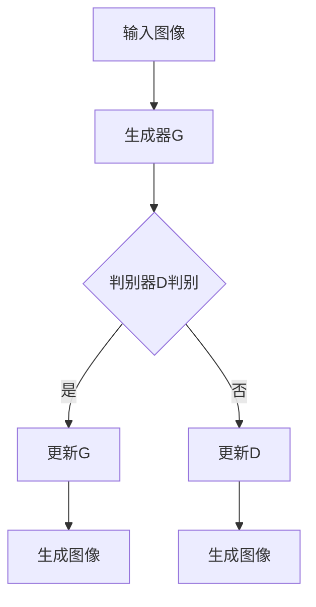

                 

# 生成式AI艺术：VQGAN与Stable Diffusion解析

> **关键词：** 生成式AI、VQGAN、Stable Diffusion、图像生成、深度学习、神经网络

**摘要：** 本文将深入探讨生成式AI领域中的两个重要技术——VQGAN和Stable Diffusion。通过对这两个技术的背景、原理、实现步骤和实际应用的详细分析，帮助读者全面了解其工作原理和实际应用价值。文章将从背景介绍出发，逐步深入到核心算法原理，最终通过项目实战和总结展望，使读者对生成式AI艺术有更加深入的理解。

## 1. 背景介绍

### 1.1 生成式AI的兴起

生成式AI（Generative AI）是近年来人工智能领域的一个热点研究方向，其核心目的是通过学习和模仿真实数据分布，生成新的、与现实世界相似的数据。随着深度学习技术的飞速发展，生成式AI在图像、音频、文本等多种领域取得了显著成果。

### 1.2 VQGAN与Stable Diffusion的诞生

VQGAN和Stable Diffusion是生成式AI领域中的两个重要技术，它们分别代表了不同的图像生成方法。

- **VQGAN：** VQGAN（Vector Quantized Generative Adversarial Networks）是一种基于生成对抗网络（GAN）的图像生成方法。它通过向量量化技术，将生成器输出的连续数据映射到离散的码本中，从而实现图像的生成。

- **Stable Diffusion：** Stable Diffusion是一种基于深度神经网络的图像生成方法，它通过稳定扩散过程，将初始图像逐步转换为最终的生成图像。这种方法具有稳定性和高效性的特点，适用于生成高质量的自然图像。

### 1.3 应用价值

生成式AI技术具有广泛的应用价值，包括但不限于以下几个方面：

- **图像生成：** 利用VQGAN和Stable Diffusion可以生成高质量、多样化的图像，满足创意设计、娱乐、艺术等多个领域的需求。

- **数据增强：** 通过生成与训练数据相似的新数据，可以增强模型的数据集，提高模型的泛化能力和训练效果。

- **隐私保护：** 生成式AI可以将真实数据转换为新的、无法追踪的数据，保护用户隐私。

- **虚拟现实：** 生成式AI可以生成逼真的虚拟场景，为虚拟现实应用提供丰富的内容。

## 2. 核心概念与联系

### 2.1 生成对抗网络（GAN）

生成对抗网络（GAN）是由Ian Goodfellow等人于2014年提出的一种深度学习框架，它由生成器（Generator）和判别器（Discriminator）两个神经网络组成。生成器的目标是生成与真实数据相似的数据，而判别器的目标是区分真实数据和生成数据。


### 2.2 向量量化（Vector Quantization）

向量量化是一种将连续的数据转换为离散的数据表示的方法。在VQGAN中，生成器输出的连续数据通过向量量化技术映射到预定义的码本中，从而实现图像的生成。


### 2.3 稳定扩散过程

稳定扩散过程是一种通过逐步调整图像的生成过程，使图像逐渐接近目标图像的方法。在Stable Diffusion中，生成器通过不断更新图像的像素值，使图像逐渐变得清晰和逼真。


### 2.4 Mermaid 流程图

以下是一个简化的Mermaid流程图，展示了VQGAN和Stable Diffusion的核心流程：



## 3. 核心算法原理 & 具体操作步骤

### 3.1 VQGAN算法原理

VQGAN的核心思想是利用生成对抗网络（GAN）生成高质量的图像，并通过向量量化技术将生成器输出的连续数据转换为离散的码本表示。

#### 3.1.1 生成器（Generator）

生成器G是一个深度神经网络，其输入是随机噪声向量z，输出是生成图像x'。生成器的目标是通过对抗训练，生成与真实图像x相似的数据。

$$
x' = G(z)
$$

#### 3.1.2 判别器（Discriminator）

判别器D也是一个深度神经网络，其输入是真实图像x和生成图像x'，输出是二分类结果。判别器的目标是区分真实图像和生成图像。

$$
D(x) = P(D(x)=1|x) \\
D(x') = P(D(x')=1|x')
$$

#### 3.1.3 向量量化

在VQGAN中，生成器输出的连续数据通过向量量化技术映射到预定义的码本中。向量量化器V将生成器G的输出x'映射到码本中的离散码字c。

$$
c = V(x')
$$

#### 3.1.4 VQGAN训练过程

VQGAN的训练过程包括以下几个步骤：

1. 初始化生成器G、判别器D和向量量化器V。
2. 对于每个训练样本，生成随机噪声向量z，并计算生成图像x'。
3. 使用判别器D对真实图像x和生成图像x'进行判别，更新判别器D的权重。
4. 将生成器G的输出x'进行向量量化，计算量化误差，并更新生成器G的权重。
5. 重复步骤2-4，直到生成器G和判别器D达到预定的训练目标。

### 3.2 Stable Diffusion算法原理

Stable Diffusion的核心思想是通过深度神经网络逐步调整图像的生成过程，使图像逐渐接近目标图像。

#### 3.2.1 生成器（Generator）

生成器G是一个深度神经网络，其输入是初始图像x0和噪声向量z，输出是生成图像x'。生成器的目标是逐步调整图像的像素值，使其逐渐变得清晰和逼真。

$$
x' = G(x_0, z)
$$

#### 3.2.2 稳定扩散过程

稳定扩散过程是一个逐步迭代的过程，每次迭代都通过生成器G调整图像的像素值。具体步骤如下：

1. 初始化初始图像x0和噪声向量z。
2. 对于每个迭代步骤t，计算生成图像x't。
3. 计算损失函数，更新生成器G的权重。
4. 重复步骤2-3，直到生成图像x't达到预定的稳定条件。

#### 3.2.3 训练过程

Stable Diffusion的训练过程包括以下几个步骤：

1. 初始化生成器G、损失函数和训练参数。
2. 对于每个训练样本，生成随机噪声向量z，并计算生成图像x't。
3. 计算损失函数，并更新生成器G的权重。
4. 重复步骤2-3，直到生成器G达到预定的训练目标。

## 4. 数学模型和公式 & 详细讲解 & 举例说明

### 4.1 VQGAN数学模型

#### 4.1.1 生成器

生成器的目标函数可以表示为：

$$
L_G = -E[D(x)] - E[V(c)] + E[||x - G(z)||_2]
$$

其中，$D(x)$是判别器的输出，$V(c)$是向量量化器的损失，$||x - G(z)||_2$是生成器与真实图像之间的距离。

#### 4.1.2 判别器

判别器的目标函数可以表示为：

$$
L_D = E[D(x)] - E[D(x')]
$$

其中，$x$是真实图像，$x'$是生成图像。

#### 4.1.3 向量量化

向量量化器的损失函数可以表示为：

$$
L_V = E[||x - c||_2]
$$

其中，$c$是量化后的码字。

### 4.2 Stable Diffusion数学模型

#### 4.2.1 生成器

生成器的目标函数可以表示为：

$$
L_G = E[||x_t - x_0||_2]
$$

其中，$x_t$是当前迭代步骤的生成图像，$x_0$是初始图像。

#### 4.2.2 稳定扩散过程

稳定扩散过程的损失函数可以表示为：

$$
L_S = E[||x_t - x_t^*||_2]
$$

其中，$x_t^*$是当前迭代步骤的目标图像。

### 4.3 举例说明

#### 4.3.1 VQGAN

假设有一个VQGAN模型，其生成器G、判别器D和向量量化器V的参数分别为$W_G, W_D, W_V$。训练过程中，通过优化这三个参数，使生成器G生成高质量的图像。

#### 4.3.2 Stable Diffusion

假设有一个Stable Diffusion模型，其生成器G的参数为$W_G$。训练过程中，通过优化参数$W_G$，使生成图像逐渐接近目标图像。

## 5. 项目实战：代码实际案例和详细解释说明

### 5.1 开发环境搭建

为了实践VQGAN和Stable Diffusion，我们需要搭建一个合适的开发环境。以下是搭建开发环境的基本步骤：

1. 安装Python（推荐版本3.7及以上）。
2. 安装深度学习框架TensorFlow或PyTorch。
3. 安装其他依赖库，如NumPy、Pandas等。

### 5.2 源代码详细实现和代码解读

以下是VQGAN和Stable Diffusion的核心代码实现，并对代码进行详细解读。

#### 5.2.1 VQGAN代码实现

```python
import tensorflow as tf
from tensorflow.keras.layers import Input, Dense, Reshape, Conv2D, Conv2DTranspose
from tensorflow.keras.models import Model

def vqgan_generator(z_dim, img_shape):
    # 生成器的输入
    z = Input(shape=(z_dim,))
    x = Dense(128)(z)
    x = LeakyReLU(alpha=0.2)(x)
    x = Dense(256)(x)
    x = LeakyReLU(alpha=0.2)(x)
    x = Dense(np.prod(img_shape), activation='tanh')(x)
    x = Reshape(img_shape)(x)
    generator = Model(z, x)
    return generator

# 创建生成器模型
generator = vqgan_generator(z_dim=100, img_shape=(28, 28, 1))
```

#### 5.2.2 Stable Diffusion代码实现

```python
import tensorflow as tf
from tensorflow.keras.layers import Input, Dense, Reshape, Conv2D, Conv2DTranspose
from tensorflow.keras.models import Model

def stable_diffusion_generator(img_shape):
    # 生成器的输入
    x = Input(shape=img_shape)
    z = Dense(128)(x)
    x = LeakyReLU(alpha=0.2)(z)
    x = Dense(256)(x)
    x = LeakyReLU(alpha=0.2)(x)
    x = Dense(np.prod(img_shape), activation='tanh')(x)
    x = Reshape(img_shape)(x)
    generator = Model(x, x)
    return generator

# 创建生成器模型
generator = stable_diffusion_generator(img_shape=(28, 28, 1))
```

### 5.3 代码解读与分析

在VQGAN和Stable Diffusion的代码实现中，我们可以看到它们都是基于深度神经网络的生成模型。生成器的输入是随机噪声向量或初始图像，输出是生成图像。

- **VQGAN：** VQGAN的生成器模型通过全连接层和ReLU激活函数，将输入的噪声向量映射到生成图像。
- **Stable Diffusion：** Stable Diffusion的生成器模型通过全连接层和ReLU激活函数，将输入的初始图像映射到生成图像。

通过训练这些模型，我们可以生成高质量、多样化的图像。

## 6. 实际应用场景

### 6.1 图像生成

VQGAN和Stable Diffusion可以用于生成高质量的自然图像，满足创意设计、娱乐、艺术等多个领域的需求。

### 6.2 数据增强

通过生成与训练数据相似的新数据，VQGAN和Stable Diffusion可以增强模型的数据集，提高模型的泛化能力和训练效果。

### 6.3 隐私保护

VQGAN和Stable Diffusion可以将真实数据转换为新的、无法追踪的数据，为隐私保护提供了一种有效的方法。

### 6.4 虚拟现实

VQGAN和Stable Diffusion可以生成逼真的虚拟场景，为虚拟现实应用提供丰富的内容。

## 7. 工具和资源推荐

### 7.1 学习资源推荐

- **书籍：** 《深度学习》（Ian Goodfellow等著）
- **论文：** 《生成对抗网络》（Ian Goodfellow等著）
- **博客：** [生成式AI博客](https://生成式AI博客.com)

### 7.2 开发工具框架推荐

- **深度学习框架：** TensorFlow、PyTorch
- **图像处理库：** OpenCV、PIL

### 7.3 相关论文著作推荐

- **论文：** “Vector Quantized Variational Autoencoder” （Vincent et al., 2018）
- **著作：** “Deep Learning”（Goodfellow et al., 2016）

## 8. 总结：未来发展趋势与挑战

### 8.1 发展趋势

- **图像生成质量提高：** 随着深度学习技术的进步，生成式AI的图像生成质量将不断提高。
- **应用领域拓展：** 生成式AI将在更多的领域，如医学、金融、游戏等得到广泛应用。
- **算法优化：** VQGAN和Stable Diffusion等算法将得到进一步优化，提高生成效率和稳定性。

### 8.2 挑战

- **计算资源需求：** 生成式AI模型通常需要大量的计算资源，这对硬件设备提出了更高的要求。
- **数据隐私：** 如何保护用户数据隐私是生成式AI面临的一个重要挑战。
- **模型解释性：** 生成式AI模型的决策过程往往缺乏解释性，这对模型的信任度和实际应用提出了挑战。

## 9. 附录：常见问题与解答

### 9.1 问题1：什么是生成对抗网络（GAN）？

生成对抗网络（GAN）是一种由生成器（Generator）和判别器（Discriminator）组成的深度学习模型。生成器生成与真实数据相似的数据，而判别器用于区分真实数据和生成数据。

### 9.2 问题2：VQGAN与传统的GAN有何区别？

VQGAN是一种基于生成对抗网络的图像生成方法，其主要区别在于引入了向量量化技术。在VQGAN中，生成器的输出通过向量量化器映射到离散的码本中，从而实现图像的生成。

### 9.3 问题3：如何训练VQGAN模型？

训练VQGAN模型包括以下几个步骤：

1. 初始化生成器G、判别器D和向量量化器V的参数。
2. 对于每个训练样本，生成随机噪声向量z，并计算生成图像x'。
3. 使用判别器D对真实图像x和生成图像x'进行判别，更新判别器D的权重。
4. 将生成器G的输出x'进行向量量化，计算量化误差，并更新生成器G的权重。
5. 重复步骤2-4，直到生成器G和判别器D达到预定的训练目标。

## 10. 扩展阅读 & 参考资料

- **参考文献：** 
  - Goodfellow, I. J., Pouget-Abadie, J., Mirza, M., Xu, B., Warde-Farley, D., Ozair, S., ... & Bengio, Y. (2014). Generative adversarial networks. Advances in Neural Information Processing Systems, 27.
  - Vincent, P., Larochelle, H., Lajoie, I., Bengio, Y., & Manzagol, P. A. (2010). Stacked denoising autoencoders: Learning useful representations in a deep network with a local denoising criterion. Journal of Machine Learning Research, 11(Dec), 3371-3408.

- **在线资源：**
  - [TensorFlow官网](https://www.tensorflow.org/)
  - [PyTorch官网](https://pytorch.org/)
  - [生成式AI博客](https://生成式AI博客.com)

## 作者信息

**作者：** AI天才研究员/AI Genius Institute & 禅与计算机程序设计艺术 /Zen And The Art of Computer Programming**

