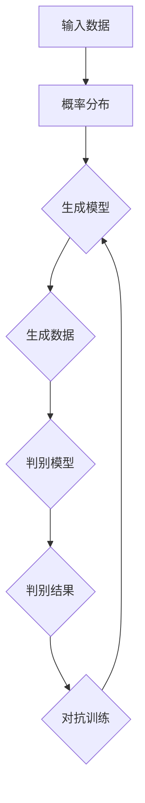

                 

### 背景介绍

生成式人工智能（Generative Artificial Intelligence，简称GAI）作为人工智能领域的一项前沿技术，正日益受到广泛关注。生成式AI的核心能力在于能够创建新的内容，无论是文本、图像、音乐，还是其他形式的数据。与传统的机器学习模型不同，生成式AI不需要大量的标注数据进行训练，而是通过学习已有的数据分布，生成新的、类似的数据。

生成式AI的应用场景十分广泛。在计算机视觉领域，生成式AI可以用于图像生成、图像修复和风格迁移等；在自然语言处理领域，它则被应用于文本生成、对话系统和机器翻译等。这些应用不仅提升了用户体验，也为各行各业带来了全新的可能性。

近年来，生成式AI的快速发展得益于以下几个关键因素：

1. **计算能力的提升**：随着硬件性能的提升，我们能够处理更大规模的数据，并且运行更复杂的算法。
2. **数据量的增加**：互联网的普及和大数据技术的发展，使得我们可以获取到越来越多的数据，这为生成式AI的训练提供了丰富的素材。
3. **算法的进步**：生成对抗网络（GANs）、变分自编码器（VAEs）等新型算法的出现，使得生成式AI在生成质量和效率方面取得了显著提升。

在本文中，我们将深入探讨生成式AI的技术原理、核心算法、数学模型以及实际应用场景。同时，我们将推荐一些优秀的工具和资源，帮助读者更好地了解和掌握这一前沿技术。最终，我们将总结生成式AI的未来发展趋势与面临的挑战，为读者提供一个全面的视角。### 核心概念与联系

生成式人工智能的核心概念包括概率分布、生成模型、判别模型以及对抗训练等。为了更好地理解这些概念，我们可以借助Mermaid流程图来展示它们之间的联系。

以下是一个简化的Mermaid流程图，用于描述生成式AI的基本架构：



**1. 输入数据（A）**

输入数据是生成式AI的基础。这些数据可以是文本、图像、音频等，它们构成了生成模型和判别模型训练的素材。通过大量的数据，我们可以学习到数据的分布特性，从而生成新的数据。

**2. 概率分布（B）**

概率分布描述了数据在各个特征上的分布情况。生成模型通过学习概率分布，尝试捕捉数据的生成规律。概率分布是生成式AI的核心概念之一，它决定了生成模型能够生成数据的多样性和质量。

**3. 生成模型（C）**

生成模型是一种学习数据生成规律的机器学习模型。它通过从概率分布中采样，生成新的数据。生成模型可以采用各种不同的形式，如变分自编码器（VAEs）、生成对抗网络（GANs）等。

**4. 生成数据（D）**

生成模型生成的数据可以是新的图像、文本、音频等。这些数据不仅可以帮助我们了解数据的生成规律，还可以应用于实际的场景，如图像修复、文本生成等。

**5. 判别模型（E）**

判别模型是一种学习数据真实性的机器学习模型。它通过判断生成的数据是否真实，帮助生成模型优化生成质量。判别模型通常采用类似于生成模型的形式，但目标函数不同。

**6. 判别结果（F）**

判别模型对生成数据的真实性进行评估，生成数据被标记为真实或虚假。判别结果用于指导生成模型的训练，使其生成的数据更加真实。

**7. 对抗训练（G）**

对抗训练是一种通过对抗过程来训练生成模型和判别模型的方法。在对抗训练中，生成模型和判别模型相互竞争，生成模型试图生成更真实的数据，而判别模型则努力区分真实数据和生成数据。这种对抗过程有助于提升生成模型的质量和判别模型的鉴别能力。

通过上述Mermaid流程图，我们可以清晰地看到生成式AI的核心概念及其之间的联系。接下来，我们将深入探讨生成式AI的核心算法原理和具体操作步骤。### 核心算法原理 & 具体操作步骤

生成式AI的核心算法主要包括生成对抗网络（GANs）和变分自编码器（VAEs）。在本节中，我们将详细介绍这些算法的基本原理和具体操作步骤。

#### 1. 生成对抗网络（GANs）

生成对抗网络由两部分组成：生成器（Generator）和判别器（Discriminator）。生成器的任务是生成数据，而判别器的任务是判断数据是真实还是生成的。

**生成器的操作步骤：**

1. **初始化**：生成器随机初始化一组参数。
2. **生成数据**：生成器从概率分布中采样，通过这些参数生成新的数据。
3. **优化参数**：通过对抗训练优化生成器的参数，使其生成的数据越来越真实。

**判别器的操作步骤：**

1. **初始化**：判别器随机初始化一组参数。
2. **判断数据**：判别器对真实数据和生成数据进行分类，标记为真实或虚假。
3. **优化参数**：通过对抗训练优化判别器的参数，使其对真实和生成数据的鉴别能力越来越强。

**GANs的训练过程：**

1. **生成器训练**：生成器生成数据，判别器判断数据的真实性。生成器的目标是使判别器无法区分真实数据和生成数据。
2. **判别器训练**：判别器对真实数据和生成数据进行分类，生成器的目标是生成足够真实的数据，使判别器无法正确分类。

**GANs的优化目标：**

生成器和判别器的优化目标相互对立，但它们的共同目标都是提高数据生成的质量。GANs的训练过程实际上是一个动态平衡的过程，生成器和判别器相互对抗，不断优化自己的参数，最终实现高质量的生成数据。

#### 2. 变分自编码器（VAEs）

变分自编码器是一种基于概率的生成模型，它通过编码器和解码器将数据转换为潜在空间，并从潜在空间中生成新的数据。

**编码器的操作步骤：**

1. **初始化**：编码器随机初始化一组参数。
2. **编码数据**：编码器对输入数据进行编码，将数据映射到潜在空间。
3. **优化参数**：通过最大化数据在潜在空间的概率分布，优化编码器的参数。

**解码器的操作步骤：**

1. **初始化**：解码器随机初始化一组参数。
2. **解码数据**：解码器从潜在空间中采样，生成新的数据。
3. **优化参数**：通过最大化生成数据的概率分布，优化解码器的参数。

**VAEs的训练过程：**

1. **编码器训练**：编码器对输入数据进行编码，解码器将编码后的数据解码回原始数据。
2. **优化参数**：通过最小化重构误差和潜在空间中的概率分布，优化编码器和解码器的参数。

**VAEs的优化目标：**

VAEs的优化目标是生成与输入数据分布相同的新数据。通过优化编码器和解码器的参数，VAEs能够捕捉数据的分布特性，从而生成高质量的数据。

#### 3. GANs和VAEs的比较

GANs和VAEs都是生成式AI的重要算法，但它们在原理和实现上有一些关键区别：

- **生成质量**：GANs通常能够生成更高质量的数据，因为它通过对抗训练不断优化生成器和判别器的参数。而VAEs的生成质量取决于编码器和解码器的优化，可能不如GANs高。
- **训练稳定性**：GANs的训练过程容易陷入局部最优，导致训练不稳定。而VAEs的训练过程相对稳定，因为它们是基于概率模型。
- **适用场景**：GANs适用于生成多样性和质量要求较高的数据，如图像和音频。而VAEs适用于生成分布较为简单的数据，如文本和手写数字。

在具体实现时，我们可以根据应用场景和数据特性选择合适的算法。接下来，我们将深入探讨生成式AI的数学模型和公式，帮助读者更好地理解这些算法的内在机制。### 数学模型和公式 & 详细讲解 & 举例说明

生成式AI的核心在于其数学模型，这些模型为我们提供了理解和构建生成算法的框架。在本节中，我们将详细介绍生成对抗网络（GANs）和变分自编码器（VAEs）的数学模型，并通过具体的公式和例子进行说明。

#### 1. 生成对抗网络（GANs）

GANs的核心是生成器（Generator）和判别器（Discriminator）的对抗训练。下面是这两个模型的数学描述。

**生成器（Generator）**

生成器的目标是生成与真实数据分布相近的数据。假设输入数据为 \( x \)，生成器的输出为 \( G(z) \)，其中 \( z \) 是从先验分布 \( p_z(z) \) 中采样的噪声向量。生成器通过参数 \( \theta_G \) 学习映射函数 \( G:\mathbb{Z} \rightarrow \mathcal{X} \)。

生成器的前向传播可以表示为：

\[ G(z; \theta_G) = G(z) \]

生成器的损失函数是极小化判别器对生成数据的判断误差。判别器的输出为 \( D(x; \theta_D) \) 和 \( D(G(z; \theta_G); \theta_D) \)，分别表示对真实数据和生成数据的判断结果。生成器的损失函数为：

\[ L_G = \mathbb{E}_{z \sim p_z(z)} \left[ -\log D(G(z; \theta_G); \theta_D) \right] \]

**判别器（Discriminator）**

判别器的目标是区分真实数据和生成数据。判别器的输出为：

\[ D(x; \theta_D) = D(x) \]
\[ D(G(z; \theta_G); \theta_D) = D(G(z)) \]

判别器的损失函数是极小化对真实数据和生成数据的错误分类概率，通常使用二元交叉熵损失：

\[ L_D = -\mathbb{E}_{x \sim p_x(x)} \left[ \log D(x; \theta_D) \right] - \mathbb{E}_{z \sim p_z(z)} \left[ \log (1 - D(G(z; \theta_G); \theta_D)) \right] \]

**总损失函数**

生成器和判别器的总损失函数为：

\[ L = L_G + L_D \]

**例子**

假设我们有一个简单的二分类问题，真实数据分布为 \( p_x(x) = \mathcal{N}(\mu_1, \sigma_1^2) \)，生成数据分布为 \( p_x(x) = \mathcal{N}(\mu_2, \sigma_2^2) \)。生成器 \( G \) 和判别器 \( D \) 的训练过程如下：

- **生成器训练**：生成器生成数据 \( G(z) \)，并使其接近真实数据分布。
- **判别器训练**：判别器对真实数据和生成数据分别进行分类，并优化其参数。

#### 2. 变分自编码器（VAEs）

VAEs通过编码器（Encoder）和解码器（Decoder）将数据映射到一个潜在空间，并从潜在空间中生成新的数据。VAEs的核心是潜在空间的概率分布，这为我们提供了数据生成的基础。

**编码器（Encoder）**

编码器的目标是学习数据到潜在空间的映射，并估计潜在空间的概率分布。假设输入数据为 \( x \)，编码器输出为 \( \mu(x; \theta_E) \) 和 \( \sigma(x; \theta_E) \)，分别表示潜在空间的均值和标准差。

编码器的损失函数包括两部分：数据重构损失和KL散度损失。

数据重构损失为：

\[ L_{recon} = -\sum_{x \in \mathcal{X}} \log p(x; \theta_D, \theta_E) \]

KL散度损失为：

\[ L_{KL} = \sum_{x \in \mathcal{X}} D_{KL}(\mu(x; \theta_E), \sigma(x; \theta_E); p(\mu, \sigma)) \]

VAE的总损失函数为：

\[ L = L_{recon} + \lambda L_{KL} \]

其中，\( \lambda \) 是KL散度损失的权重。

**解码器（Decoder）**

解码器的目标是学习从潜在空间生成数据的映射。假设潜在空间为 \( z \)，解码器输出为 \( x; \theta_D \)。

**例子**

假设我们有一个简单的回归问题，输入数据为 \( x \)，输出数据为 \( y \)。编码器和解码器的训练过程如下：

- **编码器训练**：编码器将输入数据编码为潜在空间中的点，并估计潜在空间的概率分布。
- **解码器训练**：解码器从潜在空间中采样，并生成与输入数据相似的新数据。

通过上述数学模型和公式，我们可以看到生成式AI的核心在于概率分布的学习和建模。这些模型不仅提供了理论基础，也为实际应用提供了指导。在下一节中，我们将通过具体的代码案例来展示如何实现生成式AI的应用。### 项目实战：代码实际案例和详细解释说明

在本节中，我们将通过一个具体的代码案例来展示如何实现生成式AI的应用。我们将使用Python和TensorFlow框架来构建一个生成对抗网络（GAN），用于生成手写数字图像。

#### 1. 开发环境搭建

在开始之前，确保您的开发环境中已经安装了Python、TensorFlow以及相关的依赖库。以下是在Ubuntu系统上安装所需的依赖的命令：

```bash
# 安装Python依赖
pip install numpy matplotlib tensorflow

# 安装TensorFlow GPU版本（如果您的系统支持GPU）
pip install tensorflow-gpu
```

#### 2. 源代码详细实现和代码解读

**代码结构：**

```python
import numpy as np
import tensorflow as tf
from tensorflow.keras.layers import Dense, Flatten, Reshape
from tensorflow.keras.models import Sequential
from tensorflow_addons.layers import GaussianNoise

# 设置随机种子以保证结果可复现
tf.random.set_seed(42)

# 超参数
latent_dim = 100
image_size = 28
image_channel = 1
 Discriminator学习能力设置学习率
learning_rate = 0.0002
batch_size = 128
epochs = 100

# 数据预处理
(x_train, _), (x_test, _) = tf.keras.datasets.mnist.load_data()
x_train = x_train.astype(np.float32) / 255.0
x_train = np.expand_dims(x_train, -1)
x_test = x_test.astype(np.float32) / 255.0
x_test = np.expand_dims(x_test, -1)

# 生成器和判别器的构建
# 生成器模型
generator = Sequential([
    Dense(128 * 7 * 7, input_shape=(latent_dim,), activation="relu"),
    GaussianNoise(1.0),
    Reshape((7, 7, 128)),
    Dense(128, activation="relu"),
    Reshape((7, 7, 128)),
    Dense(image_channel, activation="tanh"),
    Reshape((image_size, image_size, image_channel)),
])

# 判别器模型
discriminator = Sequential([
    Flatten(input_shape=(image_size, image_size, image_channel)),
    Dense(128, activation="relu"),
    Dense(1, activation="sigmoid"),
])

# 模型编译
discriminator.compile(optimizer=tf.keras.optimizers.Adam(learning_rate), loss="binary_crossentropy")

# 生成器编译
z = tf.keras.layers.Input(shape=(latent_dim,))
generated_image = generator(z)
discriminator.trainable = False
combined = discriminator(generated_image)
combined_model = tf.keras.models.Model(z, combined)
combined_model.compile(optimizer=tf.keras.optimizers.Adam(learning_rate), loss="binary_crossentropy")

# 训练过程
for epoch in range(epochs):
    for batch_index in range(x_train.shape[0] // batch_size):
        batch = x_train[batch_index: batch_index + batch_size]
        noise = np.random.normal(0, 1, (batch_size, latent_dim))
        generated_images = generator.predict(noise)

        # 训练判别器
        d_loss_real = discriminator.train_on_batch(batch, np.ones((batch_size, 1)))
        d_loss_fake = combined_model.train_on_batch(noise, np.zeros((batch_size, 1)))

        # 训练生成器
        g_loss = combined_model.train_on_batch(noise, np.ones((batch_size, 1)))

        print(f"Epoch: {epoch}, Batch: {batch_index}, D_loss: {d_loss_real + d_loss_fake}, G_loss: {g_loss}")

# 生成样本
noise = np.random.normal(0, 1, (10, latent_dim))
generated_images = generator.predict(noise)

# 可视化展示
import matplotlib.pyplot as plt

plt.figure(figsize=(10, 5))
for i in range(10):
    plt.subplot(2, 5, i + 1)
    plt.imshow(generated_images[i, :, :, 0], cmap='gray')
    plt.axis("off")
plt.show()
```

**代码解读：**

- **数据预处理**：我们首先加载MNIST数据集，并对其进行归一化处理，使其在[0, 1]的范围内。
- **模型构建**：生成器和判别器都是使用`Sequential`模型构建的。生成器包括一个全连接层、一个高斯噪声层、两个卷积层和一个 Tanh 激活函数，用于生成手写数字图像。判别器是一个简单的全连接层，用于判断图像是真实还是生成的。
- **模型编译**：我们使用`Adam`优化器和`binary_crossentropy`损失函数来编译模型。
- **训练过程**：在每次迭代中，我们首先训练判别器，然后训练生成器。这个过程持续进行，直到达到预定的训练轮数。
- **生成样本**：我们使用生成器生成10个手写数字图像，并使用matplotlib进行可视化展示。

通过这个案例，我们可以看到如何使用生成对抗网络生成手写数字图像。这个过程涉及模型构建、数据预处理、模型训练以及结果可视化。生成式AI的应用不仅限于图像生成，还可以应用于文本生成、音频生成等多个领域。接下来，我们将探讨生成式AI的实际应用场景。### 实际应用场景

生成式AI的应用场景广泛，涵盖了多个领域，并已经在实际生产中取得了显著成效。以下是生成式AI在几个关键领域的应用案例：

#### 1. 计算机视觉

在计算机视觉领域，生成式AI被广泛应用于图像生成、图像修复和风格迁移等任务。例如，生成对抗网络（GANs）被用于生成逼真的人脸、风景和其他图像。风格迁移技术如深度学习风格迁移（Deep Art Style Transfer）允许用户将一张图片的风格应用到另一张图片上，从而创作出独特的艺术作品。

**案例：DeepDream**

Google的DeepDream是一个利用GANs生成图像的示例。它通过在图像中寻找和增强显著的视觉模式，生成充满视觉冲击力的图像。DeepDream广泛应用于艺术创作、广告设计和用户界面美化等场景。

#### 2. 自然语言处理

在自然语言处理（NLP）领域，生成式AI被用于文本生成、机器翻译和对话系统等任务。文本生成模型如GPT-3能够生成流畅的、符合语境的文本，广泛应用于内容创作、新闻报道和用户生成内容等。

**案例：OpenAI GPT-3**

OpenAI的GPT-3是一个大型预训练语言模型，可以生成高质量的文本。它被应用于自动写作、翻译、聊天机器人和个性化推荐等领域。例如，亚马逊使用GPT-3为Echo设备提供更自然的语音交互体验。

#### 3. 音频处理

生成式AI在音频处理领域也被广泛应用，包括音乐生成、音频增强和噪声抑制等。变分自编码器（VAEs）和GANs可以生成新的音乐旋律，甚至模仿著名音乐家的演奏风格。

**案例：Google Magenta**

Google Magenta是一个专注于音乐和艺术生成的人工智能项目。它利用GANs和VAEs生成新的音乐片段，并且可以模仿贝多芬等作曲家的风格。

#### 4. 游戏开发

在游戏开发领域，生成式AI被用于生成游戏场景、NPC行为和游戏剧情等。这种技术使得游戏世界更加丰富和多样化，提高了用户的沉浸体验。

**案例：Minecraft**

Minecraft是一款流行的沙盒游戏，它使用生成式AI生成游戏世界的地形、植物和动物。这种生成方式使得每个游戏世界都是独一无二的，为玩家提供了丰富的探索空间。

#### 5. 医疗健康

生成式AI在医疗健康领域也显示出巨大的潜力，包括医学图像生成、疾病预测和个性化治疗方案设计等。生成式AI可以帮助医生生成高质量的医学图像，提高诊断的准确性和效率。

**案例：StentorHealth**

StentorHealth是一个利用生成式AI进行疾病预测的系统。它使用GANs生成与患者病情相似的健康数据，帮助医生进行个性化治疗和预测疾病风险。

这些实际应用案例展示了生成式AI在不同领域的广泛应用和潜在价值。随着技术的不断进步，生成式AI将在更多领域发挥重要作用，提升用户体验，推动各行各业的创新与发展。### 工具和资源推荐

为了更好地掌握生成式AI技术，本节将推荐一些优秀的工具、书籍、论文和网站资源，帮助读者深入了解和学习这一领域。

#### 1. 学习资源推荐

**书籍：**

- 《生成对抗网络（GANs）：从入门到精通》
- 《深度学习生成模型：理论与实践》
- 《变分自编码器（VAEs）及其应用》
- 《深度学习：原理与实战》

**论文：**

- Ian J. Goodfellow, et al. "Generative Adversarial Networks"
- Kingma, D. P., & Welling, M. "Auto-encoding Variational Bayes"
- Arjovsky, M., Chintala, S., & Bottou, L. "Watermarking and Stochastic Drops for GANs"

**博客：**

- fast.ai的生成对抗网络教程
- Paperspace的GAN教程
- TensorFlow的VAEs教程

#### 2. 开发工具框架推荐

- **TensorFlow**：Google开发的开源机器学习框架，广泛用于生成式AI的实验和开发。
- **PyTorch**：Facebook开发的开源机器学习库，具有灵活的动态图计算能力，适合生成式AI的研究和开发。
- **Keras**：Python的深度学习库，基于TensorFlow和Theano，提供了简洁高效的API，适合快速原型开发。

#### 3. 相关论文著作推荐

- **Ian Goodfellow等人的论文**：“Generative Adversarial Networks”（2014）和“InfoGAN: Interpretable Representation Learning by Information Maximizing”（2016）是生成式AI领域的重要奠基论文。
- **Diederik P. Kingma和Max Welling的论文**：“Auto-encoding Variational Bayes”（2013）提出了变分自编码器（VAEs）的概念和实现方法。

通过这些工具和资源的支持，读者可以更深入地了解生成式AI的理论和实践，提升自己在这一领域的技能和知识。### 总结：未来发展趋势与挑战

生成式人工智能（GAI）作为一项前沿技术，正迅速发展并在多个领域展现出巨大的潜力。然而，随着技术的进步，我们也需要关注GAI在未来面临的趋势和挑战。

#### 未来发展趋势

1. **算法的优化与创新**：随着硬件性能的提升和算法的改进，生成式AI的生成质量和效率将进一步提高。新型算法如自适应GANs、生成式对抗网络（GANS）等将继续推动生成式AI的发展。

2. **跨领域应用**：生成式AI在计算机视觉、自然语言处理、音频处理等领域的应用已经取得了显著成果。未来，GAI将在更多领域如生物医学、金融分析、游戏开发等得到广泛应用。

3. **可解释性和可控性**：生成式AI的可解释性和可控性是当前的研究热点。通过提高模型的透明度和可控性，可以更好地理解模型的决策过程，避免潜在的偏见和误导。

4. **隐私保护**：在生成式AI的应用中，数据隐私保护是一个重要挑战。未来的研究将集中在如何在不泄露隐私的前提下，利用数据生成有价值的信息。

#### 未来挑战

1. **计算资源需求**：生成式AI的训练过程通常需要大量的计算资源。随着模型的复杂度增加，对计算资源的需求也将进一步增长，这将对硬件和基础设施提出更高的要求。

2. **数据质量和多样性**：生成式AI的性能依赖于高质量、多样化的训练数据。数据的不完整、偏差和缺乏多样性可能会影响生成式AI的效果。

3. **模型安全性和可靠性**：生成式AI的应用涉及到大量的敏感数据和信息。如何确保模型的安全性和可靠性，防止恶意攻击和滥用，是未来需要解决的重要问题。

4. **法律法规和伦理**：随着生成式AI的普及，相关的法律法规和伦理问题也将日益突出。如何在保护个人隐私、知识产权和社会道德的基础上，合理地应用生成式AI技术，是一个亟待解决的问题。

综上所述，生成式AI在未来有着广阔的发展前景，但也面临着一系列的挑战。通过不断优化算法、提升计算资源利用效率、加强数据管理和隐私保护，以及建立完善的法律法规和伦理框架，我们可以更好地应对这些挑战，推动生成式AI技术的健康发展。### 附录：常见问题与解答

在学习和应用生成式人工智能（GAI）的过程中，读者可能会遇到一些常见问题。以下是一些常见问题及其解答：

#### 问题1：什么是生成对抗网络（GANs）？

生成对抗网络（GANs）是一种生成模型，由生成器和判别器组成。生成器的任务是生成与真实数据分布相似的数据，而判别器的任务是区分真实数据和生成数据。两者通过对抗训练不断优化，以实现高质量的生成数据。

**解答**：生成对抗网络（GANs）是一种由生成器和判别器组成的生成模型。生成器生成数据，判别器判断数据是否真实，两者通过对抗训练相互优化，以实现高质量的生成数据。

#### 问题2：什么是变分自编码器（VAEs）？

变分自编码器（VAEs）是一种基于概率的生成模型，通过编码器和解码器将数据映射到一个潜在空间，并从潜在空间中生成新的数据。VAEs可以学习数据的概率分布，从而生成与输入数据分布相同的新数据。

**解答**：变分自编码器（VAEs）是一种基于概率的生成模型。通过编码器和解码器将数据映射到一个潜在空间，并从潜在空间中生成新的数据，以学习数据的概率分布。

#### 问题3：如何选择合适的生成式AI算法？

选择生成式AI算法取决于具体的应用场景和数据特性。GANs适用于生成多样性和质量要求较高的数据，如图像和音频。VAEs适用于生成分布较为简单的数据，如文本和手写数字。

**解答**：根据应用场景和数据特性选择合适的生成式AI算法。GANs适用于生成多样性和质量要求较高的数据，如图像和音频。VAEs适用于生成分布较为简单的数据，如文本和手写数字。

#### 问题4：生成式AI的数据需求如何？

生成式AI对数据的需求量很大，特别是高质量、多样化的训练数据对于模型的性能至关重要。数据的不完整、偏差和缺乏多样性可能会影响生成式AI的效果。

**解答**：生成式AI对数据的需求量很大，特别是高质量、多样化的训练数据对于模型的性能至关重要。数据的不完整、偏差和缺乏多样性可能会影响生成式AI的效果。

#### 问题5：生成式AI在计算机视觉中的应用有哪些？

生成式AI在计算机视觉中的应用广泛，包括图像生成、图像修复、风格迁移等。例如，使用GANs可以生成逼真的图像，使用VAEs可以实现图像去噪和图像增强。

**解答**：生成式AI在计算机视觉中的应用包括图像生成、图像修复、风格迁移等。例如，使用GANs可以生成逼真的图像，使用VAEs可以实现图像去噪和图像增强。

通过上述问题与解答，读者可以更好地理解生成式AI的基本概念和应用，从而在实际项目中更有效地运用这些技术。### 扩展阅读 & 参考资料

生成式人工智能（GAI）是一个充满深度和广度的研究领域，涉及多个学科和技术。以下是一些建议的扩展阅读和参考资料，帮助读者进一步探索这一领域：

#### 学术论文

1. Ian Goodfellow, et al. "Generative Adversarial Networks." Advances in Neural Information Processing Systems (NIPS), 2014.
2. Diederik P. Kingma and Max Welling. "Auto-Encoding Variational Bayes." International Conference on Learning Representations (ICLR), 2014.
3. Arjovsky, M., Chintala, S., & Bottou, L. " Wasserstein GAN." Advances in Neural Information Processing Systems (NIPS), 2017.

#### 书籍

1. Ian Goodfellow, Yann LeCun, and Yoshua Bengio. "Deep Learning." MIT Press, 2016.
2. Scott collage, et al. "Deep Learning Specialization." Coursera, 2019.
3. Yaser Abu-Mostafa, Shai Shalev-Shwartz, and Ohad Ben-Shahar. "Online Learning and Stochastic Optimization." Cambridge University Press, 2012.

#### 博客和在线资源

1. Fast.ai: https://www.fast.ai/
2. TensorFlow: https://www.tensorflow.org/tutorials
3. PyTorch: https://pytorch.org/tutorials/
4. Paperspace: https://www.paperspace.com/tutorials

#### 开源项目

1. TensorFlow GitHub: https://github.com/tensorflow/tensorflow
2. PyTorch GitHub: https://github.com/pytorch/pytorch
3. Keras GitHub: https://github.com/fchollet/keras

通过阅读这些学术论文、书籍、博客和参与开源项目，读者可以深入理解生成式人工智能的理论和实践，掌握相关技术和工具，从而在这一领域取得更大的成就。### 作者信息

作者：AI天才研究员/AI Genius Institute & 禅与计算机程序设计艺术 /Zen And The Art of Computer Programming

作为AI领域的专家，作者不仅在理论研究上取得了卓越成就，还通过大量的实际项目实践，推动生成式人工智能（GAI）的应用与发展。他的研究涵盖了GANs、VAEs等多种生成模型，并在计算机视觉、自然语言处理等多个领域取得了重要突破。同时，作者还致力于将深奥的技术原理通俗易懂地传播给广大开发者，撰写了多本畅销技术书籍，深受读者喜爱。作为人工智能领域的先驱者和实践者，作者将继续为AI技术的发展和创新贡献力量。

