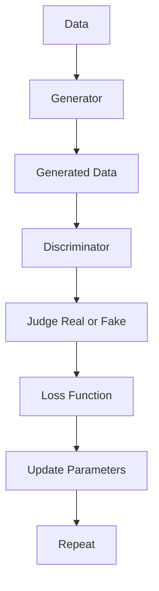
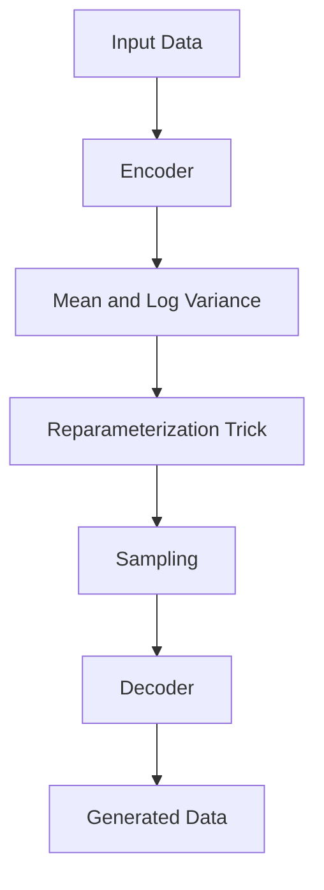
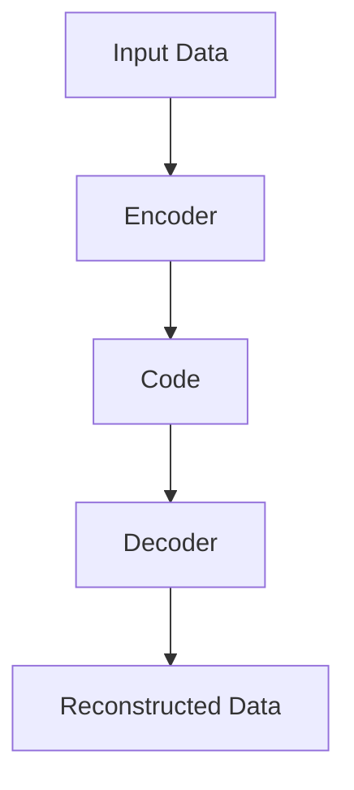

                 

### 背景介绍

生成式人工智能（Generative Artificial Intelligence，简称GAI）的时代正在悄然到来。这一领域的发展不仅仅是一场技术革命，更是一次思维方式的变革。从基本的机器学习到复杂的深度学习，再到如今炙手可热的生成式人工智能，这一路走来，我们已经见证了无数奇迹的诞生。

#### 什么是生成式人工智能？

生成式人工智能是一种能够基于已有数据生成新内容的人工智能技术。它与传统的机器学习（如分类、回归等）有所不同，后者主要是基于已有数据进行预测或分类。而生成式人工智能则侧重于创造全新的事物，如生成图像、文本、音乐等。这种能力的实现，主要依赖于大规模的数据集和强大的计算能力。

#### 生成式人工智能的重要性

生成式人工智能的重要性不仅在于其技术本身的创新，更在于它对各行各业带来的深远影响。以下是一些关键点：

1. **创意产业**：生成式人工智能在艺术、音乐、电影等领域展现出了巨大的潜力。例如，AI可以创作出令人惊叹的画作、音乐作品，甚至编写电影剧本。

2. **工业设计**：在建筑设计、汽车设计等领域，生成式人工智能可以帮助设计师快速生成各种设计方案，从而提高设计效率和创新能力。

3. **医疗领域**：生成式人工智能可以用于生成医学图像、辅助诊断，甚至在药物研发过程中发挥重要作用。

4. **数据生成**：生成式人工智能可以模拟各种数据场景，从而帮助研究人员更好地进行数据分析和模型训练。

5. **个性化服务**：在电子商务、社交媒体等领域，生成式人工智能可以生成个性化的内容和服务，提高用户体验。

#### 当前的发展状况

生成式人工智能的发展已经进入了快车道。各大科技公司和研究机构纷纷投入巨资进行研究和开发。以下是一些重要的进展：

1. **深度学习技术的突破**：随着深度学习技术的发展，生成式模型的性能得到了显著提升。例如，GAN（生成对抗网络）和VAE（变分自编码器）等模型的广泛应用，使得生成式人工智能在图像生成、文本生成等领域取得了重大突破。

2. **计算能力的提升**：随着计算能力的不断增长，生成式人工智能模型可以处理更大规模的数据，生成更高质量的内容。

3. **数据集的丰富**：互联网的普及和大数据技术的发展，使得我们拥有越来越多的数据集，这为生成式人工智能的研究和应用提供了丰富的素材。

4. **跨学科合作**：生成式人工智能的发展不仅需要计算机科学的支持，还需要心理学、神经科学、艺术等领域的合作。这种跨学科的合作有助于生成式人工智能的理论创新和应用拓展。

#### 挑战与未来展望

尽管生成式人工智能已经取得了巨大的进步，但仍然面临许多挑战。以下是一些值得关注的方面：

1. **伦理问题**：生成式人工智能可能会产生误导性内容，引发版权纠纷等问题。如何确保AI生成的内容的真实性、公正性，是一个亟待解决的问题。

2. **隐私保护**：生成式人工智能需要大量的数据来训练模型，这可能会涉及个人隐私的泄露。如何平衡数据利用和隐私保护，是一个重要课题。

3. **可解释性**：生成式人工智能的决策过程通常较为复杂，难以解释。提高AI的可解释性，有助于增强人们对AI的信任。

4. **计算资源的消耗**：生成式人工智能模型的训练和推理过程通常需要大量的计算资源。如何优化算法，降低计算成本，是一个重要的研究方向。

5. **技术创新**：生成式人工智能的发展仍然依赖于技术创新。未来，我们可能会看到更多的深度学习架构、优化算法和数据处理技术的涌现。

总之，生成式人工智能的时代已经到来，它将深刻改变我们的生活方式和社会结构。面对这一变革，我们既充满期待，也需保持审慎。在接下来的章节中，我们将深入探讨生成式人工智能的核心概念、原理和应用。让我们一起，走进这个充满无限可能的未来世界。  
   
# Introduction

The era of generative artificial intelligence (GAI) is upon us. This transformative field is not only a technological revolution but also a shift in our way of thinking. From basic machine learning to complex deep learning, and now to the emerging field of generative AI, we have witnessed the birth of countless miracles.

#### What is Generative Artificial Intelligence?

Generative AI is a type of artificial intelligence that can create new content based on existing data. Unlike traditional machine learning, which focuses on predicting or classifying based on existing data, generative AI is centered around creating new things, such as images, texts, and music. This capability relies heavily on large datasets and powerful computational abilities.

#### The Importance of Generative AI

The importance of generative AI extends beyond its technological innovation. It has profound impacts on various industries:

1. **Creative Industries**: Generative AI has shown tremendous potential in fields such as art, music, and film. For example, AI can create stunning artwork, music compositions, and even screenplay drafts.

2. **Industrial Design**: In architecture and automotive design, generative AI can help designers quickly generate various design options, thereby improving efficiency and innovation.

3. **Medical Field**: Generative AI can be used to generate medical images, assist in diagnostics, and even play a significant role in drug development.

4. **Data Generation**: Generative AI can simulate various data scenarios, helping researchers perform better data analysis and model training.

5. **Personalized Services**: In e-commerce and social media, generative AI can create personalized content and services, enhancing user experience.

#### Current Development Status

Generative AI has made rapid progress. Major tech companies and research institutions are pouring enormous resources into research and development. Here are some key advancements:

1. **Breakthroughs in Deep Learning Technologies**: With the development of deep learning, generative models have significantly improved in performance. For example, the widespread application of GANs (Generative Adversarial Networks) and VAEs (Variational Autoencoders) has made significant breakthroughs in image and text generation.

2. **Increased Computational Power**: As computational power continues to grow, generative AI models can handle larger datasets and generate higher-quality content.

3. **Rich Datasets**: The proliferation of the internet and big data technology has provided us with abundant datasets, which fuel the research and application of generative AI.

4. **Cross-Disciplinary Collaboration**: The development of generative AI requires collaboration across disciplines such as psychology, neuroscience, and art. This cross-disciplinary collaboration has led to theoretical innovation and expanded application areas.

#### Challenges and Future Prospects

Despite the tremendous progress, generative AI still faces many challenges:

1. **Ethical Issues**: Generative AI may generate misleading content and lead to copyright disputes. Ensuring the authenticity and fairness of AI-generated content is an urgent problem to address.

2. **Privacy Protection**: Generative AI requires large amounts of data for model training, which may involve personal privacy issues. Balancing data utilization and privacy protection is a critical issue.

3. **Explainability**: The decision-making process of generative AI is often complex and difficult to explain. Improving the explainability of AI is essential to building public trust.

4. **Computational Resource Consumption**: The training and inference process of generative AI models typically requires substantial computational resources. Optimizing algorithms to reduce computational costs is an important research direction.

5. **Technological Innovation**: The development of generative AI still relies on technological innovation. In the future, we may see more deep learning architectures, optimization algorithms, and data processing technologies emerge.

In conclusion, the era of generative AI has arrived, and it will profoundly change our lifestyle and social structure. As we embark on this transformative journey, we are filled with both anticipation and caution. In the following sections, we will delve into the core concepts, principles, and applications of generative AI. Together, let us explore this world filled with infinite possibilities. 

## 2. 核心概念与联系

### 核心概念

生成式人工智能的核心概念主要包括数据生成、模型训练和优化。以下是对这些核心概念的详细解释：

#### 数据生成

数据生成是生成式人工智能的基础。这一过程涉及从大量数据中提取特征，然后利用这些特征生成新的数据。例如，在图像生成任务中，数据生成可能涉及从大量图像中提取纹理、颜色等特征，然后利用这些特征生成新的图像。

#### 模型训练

模型训练是生成式人工智能的核心。在这一过程中，我们使用大量的数据来训练一个生成模型。这个模型能够学习数据的分布，并生成与训练数据相似的新数据。例如，在生成对抗网络（GAN）中，生成器（Generator）和判别器（Discriminator）通过不断对抗训练来提高模型的生成能力。

#### 模型优化

模型优化是提升生成式人工智能性能的关键。在这一过程中，我们通过调整模型的参数、架构和训练策略来提高模型的性能。优化方法包括但不限于遗传算法、进化算法、梯度下降等。

### 常见架构

生成式人工智能的常见架构包括生成对抗网络（GAN）、变分自编码器（VAE）、自编码器（AE）等。以下是对这些架构的简要介绍：

#### 生成对抗网络（GAN）

生成对抗网络（GAN）是一种由生成器和判别器组成的双网络结构。生成器生成数据，判别器则判断数据是真实还是生成。通过这种对抗训练，生成器不断提高其生成能力，判别器则不断提高其判断能力。



#### 变分自编码器（VAE）

变分自编码器（VAE）是一种基于概率模型的生成模型。它通过编码器（Encoder）和解码器（Decoder）来学习数据的分布，并生成新的数据。VAE的核心思想是引入了变分自编码器的先验分布，从而实现无监督学习。



#### 自编码器（AE）

自编码器（AE）是一种无监督学习算法，它通过一个编码器将输入数据压缩成较低维度的特征表示，然后通过解码器将特征表示还原回原始数据。AE在图像去噪、图像压缩等任务中得到了广泛应用。



### 核心原理与联系

生成式人工智能的核心原理是通过学习数据的分布来生成新数据。无论是GAN、VAE还是AE，它们都通过学习数据的概率分布来实现这一目标。GAN通过生成器和判别器的对抗训练来实现这一目标，VAE则通过编码器和解码器来学习数据的分布，AE则通过编码器和解码器将输入数据压缩和重构。

这些核心概念和架构的联系在于，它们都是基于概率模型和无监督学习的原理，通过学习数据的分布来生成新数据。这种数据生成能力在各个领域都有着广泛的应用，如图像生成、文本生成、音频生成等。

总之，生成式人工智能的核心概念和架构是理解和应用这一技术的基础。在接下来的章节中，我们将深入探讨生成式人工智能的算法原理和具体操作步骤。这将帮助我们更好地掌握这一前沿技术，为未来的创新和应用奠定坚实的基础。

### Core Concepts and Connections

#### Core Concepts

The core concepts of generative artificial intelligence (GAI) primarily include data generation, model training, and optimization. Here's a detailed explanation of these core concepts:

#### Data Generation

Data generation is the foundation of generative AI. This process involves extracting features from large datasets and then using these features to generate new data. For instance, in image generation tasks, data generation may involve extracting textures and colors from a large set of images to generate new images.

#### Model Training

Model training is the heart of generative AI. In this process, we use large datasets to train a generative model. The model learns the distribution of the data and can generate new data similar to the training data. For example, in Generative Adversarial Networks (GANs), the generator and discriminator are trained through adversarial learning to improve the model's generation capabilities.

#### Model Optimization

Model optimization is crucial for improving the performance of generative AI. In this process, we adjust the model's parameters, architecture, and training strategies to enhance its performance. Optimization methods include but are not limited to genetic algorithms, evolutionary algorithms, and gradient descent.

### Common Architectures

Common architectures for generative AI include Generative Adversarial Networks (GANs), Variational Autoencoders (VAEs), and Autoencoders (AEs). Here's a brief introduction to these architectures:

#### Generative Adversarial Networks (GANs)

Generative Adversarial Networks consist of a generator and a discriminator in a dual-network structure. The generator creates data, while the discriminator judges whether the data is real or fake. Through this adversarial training, the generator improves its generation capabilities, and the discriminator improves its judgment capabilities.


#### Variational Autoencoders (VAEs)

Variational Autoencoders are generative models based on probabilistic models. They learn the distribution of the data through an encoder and a decoder, and generate new data. The core idea of VAEs is to introduce a prior distribution, enabling unsupervised learning.


#### Autoencoders (AEs)

Autoencoders are unsupervised learning algorithms that compress input data into a lower-dimensional feature representation using an encoder, and then reconstruct the data using a decoder. AEs are widely used in tasks such as image denoising and image compression.


### Core Principles and Connections

The core principle of generative AI is to generate new data by learning the distribution of the data. Whether it's GANs, VAEs, or AEs, they all learn the data distribution to generate new data based on probabilistic models and unsupervised learning principles. This data generation capability has wide applications in various fields, such as image generation, text generation, and audio generation.

The connection among these core concepts and architectures lies in their shared foundation of learning data distributions for new data generation. This data generation capability is the cornerstone of understanding and applying generative AI technology. In the following sections, we will delve into the algorithmic principles and specific operational steps of generative AI. This will help us better master this cutting-edge technology, laying a solid foundation for future innovation and application. 

## 3. 核心算法原理 & 具体操作步骤

生成式人工智能的核心算法主要包括生成对抗网络（GAN）、变分自编码器（VAE）和自编码器（AE）。下面我们将详细探讨这些算法的基本原理，以及它们的具体操作步骤。

### 生成对抗网络（GAN）

#### 基本原理

生成对抗网络（GAN）是由生成器和判别器组成的一种对抗性学习模型。生成器（Generator）的目的是生成尽可能真实的数据，而判别器（Discriminator）的目的是区分生成数据与真实数据。通过这种对抗性训练，生成器的生成能力会逐渐提高，而判别器的判别能力也会逐渐增强。

#### 具体操作步骤

1. **初始化**：初始化生成器和判别器，通常使用随机权重。

2. **生成器训练**：生成器生成一批伪造数据，判别器对其进行分析。

3. **判别器训练**：判别器同时接收真实数据和伪造数据，训练其判别能力。

4. **交替迭代**：生成器和判别器交替进行训练，生成器的目标是最小化判别器对其生成的伪造数据的判别误差，而判别器的目标是最大化判别误差。

5. **评估与调整**：通过评估生成器生成的数据质量，调整模型参数，优化模型性能。

#### 数学原理

在GAN中，生成器和判别器的损失函数分别如下：

- 生成器损失函数：\( G \) 是生成器的参数，\( D \) 是判别器的参数，\( x \) 是真实数据，\( z \) 是随机噪声。

  $$ L_G = -\log(D(G(z))) $$

- 判别器损失函数：

  $$ L_D = -\log(D(x)) - \log(1 - D(G(z))) $$

### 变分自编码器（VAE）

#### 基本原理

变分自编码器（VAE）是一种基于概率模型的生成模型。VAE通过编码器（Encoder）将输入数据映射到一个潜在空间，然后通过解码器（Decoder）从潜在空间生成新的数据。VAE的核心思想是引入了变分自编码器的先验分布，从而实现无监督学习。

#### 具体操作步骤

1. **编码器训练**：编码器学习将输入数据映射到一个潜在空间的均值和方差。

2. **解码器训练**：解码器从潜在空间生成新的数据。

3. **重参数化**：通过重参数化技巧，使得VAE能够从潜在空间生成样本，从而实现数据的生成。

4. **交替迭代**：编码器和解码器交替进行训练，优化模型参数。

#### 数学原理

在VAE中，编码器和解码器的损失函数分别如下：

- 编码器损失函数：\( q_\phi(z|x) \) 是编码器的参数，\( p_\theta(x|z) \) 是解码器的参数。

  $$ L_q = -E_{z \sim q(z|x)}[\log p_\theta(x|z)] $$

- 解码器损失函数：

  $$ L_p = E_{x \sim p(x)}[-\log p_\theta(x)] $$

### 自编码器（AE）

#### 基本原理

自编码器（AE）是一种无监督学习算法，它通过编码器将输入数据压缩成较低维度的特征表示，然后通过解码器将特征表示还原回原始数据。AE在图像去噪、图像压缩等任务中得到了广泛应用。

#### 具体操作步骤

1. **编码器训练**：编码器学习将输入数据映射到一个较低维度的特征表示。

2. **解码器训练**：解码器从特征表示生成新的数据。

3. **交替迭代**：编码器和解码器交替进行训练，优化模型参数。

#### 数学原理

在AE中，编码器和解码器的损失函数分别如下：

- 编码器损失函数：

  $$ L_E = -\log p_\theta(\hat{x}|\hat{x}') $$

- 解码器损失函数：

  $$ L_D = -\log p_\theta(x|\hat{x}) $$

### 对比与分析

GAN、VAE和AE都是生成式人工智能的重要算法，它们在原理和应用场景上各有特点：

- **GAN**：具有强大的生成能力，可以生成高质量的伪造数据。但GAN的训练过程不稳定，容易出现模式崩溃等问题。

- **VAE**：通过引入先验分布，实现无监督学习，模型更稳定。但VAE的生成效果通常不如GAN。

- **AE**：在图像去噪和图像压缩等任务中表现优秀，但生成能力相对较弱。

总之，理解这些核心算法的基本原理和操作步骤，是掌握生成式人工智能的关键。在接下来的章节中，我们将通过实际案例来深入探讨这些算法的具体应用。

### Core Algorithm Principles and Specific Operational Steps

The core algorithms of generative artificial intelligence (GAI) primarily include Generative Adversarial Networks (GANs), Variational Autoencoders (VAEs), and Autoencoders (AEs). Below, we will delve into the basic principles of these algorithms and their specific operational steps.

#### Generative Adversarial Networks (GANs)

##### Basic Principles

Generative Adversarial Networks (GANs) consist of a generator and a discriminator in an adversarial learning framework. The generator creates fake data, while the discriminator aims to distinguish between real and fake data. Through this adversarial training, the generator improves its generation capabilities, and the discriminator improves its distinguishing ability.

##### Specific Operational Steps

1. **Initialization**: Initialize the generator and discriminator with random weights.

2. **Generator Training**: The generator creates a batch of fake data and the discriminator analyzes it.

3. **Discriminator Training**: The discriminator receives both real and fake data to train its distinguishing capability.

4. **Alternating Iteration**: The generator and discriminator alternate their training, with the generator trying to minimize the discriminator's ability to distinguish fake data, and the discriminator trying to maximize the difference between real and fake data.

5. **Evaluation and Adjustment**: Evaluate the quality of the generator's created data and adjust model parameters to optimize performance.

##### Mathematical Principles

In GANs, the loss functions for the generator and discriminator are as follows:

- Generator Loss Function: \( G \) are the parameters of the generator, \( D \) are the parameters of the discriminator, \( x \) is real data, and \( z \) is random noise.

  $$ L_G = -\log(D(G(z))) $$

- Discriminator Loss Function:

  $$ L_D = -\log(D(x)) - \log(1 - D(G(z))) $$

#### Variational Autoencoders (VAEs)

##### Basic Principles

Variational Autoencoders (VAEs) are generative models based on probabilistic models. VAEs map input data to a latent space through an encoder and generate new data from this latent space through a decoder. The core idea of VAEs is to introduce a prior distribution, enabling unsupervised learning.

##### Specific Operational Steps

1. **Encoder Training**: The encoder learns to map input data to a latent space with mean and variance.

2. **Decoder Training**: The decoder generates new data from the latent space.

3. **Reparameterization**: Through reparameterization tricks, VAEs can sample from the latent space to generate data.

4. **Alternating Iteration**: The encoder and decoder alternate their training to optimize model parameters.

##### Mathematical Principles

In VAEs, the loss functions for the encoder and decoder are as follows:

- Encoder Loss Function: \( q_\phi(z|x) \) are the parameters of the encoder, \( p_\theta(x|z) \) are the parameters of the decoder.

  $$ L_q = -E_{z \sim q(z|x)}[\log p_\theta(x|z)] $$

- Decoder Loss Function:

  $$ L_p = E_{x \sim p(x)}[-\log p_\theta(x)] $$

#### Autoencoders (AEs)

##### Basic Principles

Autoencoders are unsupervised learning algorithms that compress input data into a lower-dimensional feature representation using an encoder, and then reconstruct the data using a decoder. AEs are widely used in tasks such as image denoising and image compression.

##### Specific Operational Steps

1. **Encoder Training**: The encoder learns to map input data to a lower-dimensional feature representation.

2. **Decoder Training**: The decoder generates new data from the feature representation.

3. **Alternating Iteration**: The encoder and decoder alternate their training to optimize model parameters.

##### Mathematical Principles

In AEs, the loss functions for the encoder and decoder are as follows:

- Encoder Loss Function:

  $$ L_E = -\log p_\theta(\hat{x}|\hat{x}') $$

- Decoder Loss Function:

  $$ L_D = -\log p_\theta(x|\hat{x}) $$

#### Comparison and Analysis

GANs, VAEs, and AEs are all important algorithms in generative AI, each with unique principles and application scenarios:

- **GANs** have strong generation capabilities and can create high-quality fake data, but their training process is unstable and can suffer from mode collapse issues.

- **VAEs** achieve stable learning through the introduction of prior distributions, but their generation quality is typically lower than GANs.

- **AEs** excel in tasks such as image denoising and image compression but have weaker generation capabilities.

Understanding the basic principles and operational steps of these core algorithms is crucial for mastering generative AI. In the following sections, we will delve into specific applications of these algorithms through real-world case studies. This will provide a deeper understanding of how these algorithms can be applied to solve practical problems and drive innovation. 

## 4. 数学模型和公式 & 详细讲解 & 举例说明

在前面的章节中，我们介绍了生成式人工智能的核心算法原理。在这一章节中，我们将深入探讨这些算法背后的数学模型和公式，并通过具体例子进行详细讲解，以帮助读者更好地理解这些算法的实际应用。

### 生成对抗网络（GAN）

生成对抗网络（GAN）的核心在于其对抗性训练机制。以下是对GAN中主要数学模型的详细讲解：

#### 生成器（Generator）

生成器的目标是生成尽可能真实的数据。在GAN中，生成器接收随机噪声 \( z \) 并生成假数据 \( x' \)。生成器的损失函数通常定义为：

$$ L_G = -\log(D(G(z))) $$

其中，\( D \) 是判别器的输出，表示判别器对输入数据的真实性判断。\( G(z) \) 表示生成器生成的假数据。

#### 判别器（Discriminator）

判别器的目标是区分真实数据和假数据。判别器的损失函数通常定义为：

$$ L_D = -[\log(D(x)) + \log(1 - D(G(z)))] $$

其中，\( x \) 是真实数据，\( G(z) \) 是生成器生成的假数据。

#### 整体损失函数

GAN的整体损失函数是生成器和判别器损失函数的组合，通常表示为：

$$ L = L_G + L_D $$

#### 例子

假设我们使用GAN来生成手写数字图像。我们可以将这个过程分解为以下几个步骤：

1. **初始化**：初始化生成器和判别器的参数。
2. **生成器训练**：生成器接收随机噪声 \( z \)，生成手写数字图像 \( x' \)。
3. **判别器训练**：判别器同时接收真实手写数字图像 \( x \) 和生成器生成的手写数字图像 \( x' \)，训练其判断能力。
4. **交替迭代**：生成器和判别器交替进行训练，优化参数。

在每一步迭代中，生成器和判别器的损失函数会更新，以达到更好的生成效果。

### 变分自编码器（VAE）

变分自编码器（VAE）的核心在于其概率模型和重参数化技巧。以下是对VAE中主要数学模型的详细讲解：

#### 编码器（Encoder）

编码器的目标是学习输入数据的概率分布。VAE中的编码器通常输出两个值：均值 \( \mu \) 和对数方差 \( \log(\sigma^2) \)。

$$ q_\phi(z|x) = \mathcal{N}(z; \mu, \sigma^2) $$

其中，\( \mu \) 和 \( \sigma^2 \) 分别表示均值和对数方差。

#### 解码器（Decoder）

解码器的目标是生成新的数据。VAE中的解码器使用重参数化技巧来生成数据，从而实现数据的生成。

$$ p_\theta(x|z) = \mathcal{N}(x; \mu(z), \sigma(z)) $$

其中，\( \mu(z) \) 和 \( \sigma(z) \) 分别是解码器的均值和方差。

#### 整体损失函数

VAE的整体损失函数由两个部分组成：数据似然损失和KL散度损失。

$$ L = -E_{z \sim q(z|x)}[\log p_\theta(x|z)] + \beta \cdot D_{KL}(q_\phi(z|x) || p(z)) $$

其中，\( D_{KL} \) 是KL散度，用于衡量两个概率分布之间的差异。

#### 例子

假设我们使用VAE来生成手写数字图像。我们可以将这个过程分解为以下几个步骤：

1. **初始化**：初始化编码器和解码器的参数。
2. **编码器训练**：编码器接收手写数字图像 \( x \)，输出均值 \( \mu \) 和对数方差 \( \log(\sigma^2) \)。
3. **解码器训练**：解码器使用重参数化技巧，从均值 \( \mu \) 和对数方差 \( \log(\sigma^2) \) 生成手写数字图像 \( x' \)。
4. **交替迭代**：编码器和解码器交替进行训练，优化参数。

在每一步迭代中，VAE的整体损失函数会更新，以达到更好的生成效果。

### 自编码器（AE）

自编码器（AE）的核心在于其编码和解码过程。以下是对AE中主要数学模型的详细讲解：

#### 编码器（Encoder）

编码器的目标是学习输入数据的特征表示。AE中的编码器通常输出一个特征向量 \( h \)。

$$ h = f(Wx + b) $$

其中，\( f \) 是激活函数，\( W \) 是权重矩阵，\( b \) 是偏置项。

#### 解码器（Decoder）

解码器的目标是重建输入数据。AE中的解码器通常使用相同的网络结构，但反向传播。

$$ x' = f(W'h + b') $$

其中，\( W' \) 是权重矩阵，\( b' \) 是偏置项。

#### 整体损失函数

AE的整体损失函数通常定义为重构误差：

$$ L = \frac{1}{N} \sum_{i=1}^{N} \sum_{j=1}^{M} \log p(y_j = x_i) $$

其中，\( N \) 是样本数量，\( M \) 是可能的输出值数量，\( x_i \) 是输入数据，\( y_j \) 是输出数据。

#### 例子

假设我们使用AE来压缩和重建图像。我们可以将这个过程分解为以下几个步骤：

1. **初始化**：初始化编码器和解码器的参数。
2. **编码器训练**：编码器接收图像 \( x \)，输出特征向量 \( h \)。
3. **解码器训练**：解码器使用特征向量 \( h \) 重建图像 \( x' \)。
4. **交替迭代**：编码器和解码器交替进行训练，优化参数。

在每一步迭代中，AE的整体损失函数会更新，以达到更好的压缩和重建效果。

通过以上对GAN、VAE和AE的数学模型和公式的详细讲解，我们可以看到这些算法在生成式人工智能中的核心作用。在实际应用中，这些算法可以根据具体任务的需求进行调整和优化，以实现更好的生成效果。

### Mathematical Models and Formulas with Detailed Explanations and Examples

In the previous sections, we introduced the core principles of the key generative AI algorithms. In this chapter, we will delve into the mathematical models and formulas underlying these algorithms, providing detailed explanations and examples to help readers better understand their practical applications.

#### Generative Adversarial Networks (GANs)

The core of GANs lies in their adversarial training mechanism. Here's a detailed explanation of the main mathematical models within GANs:

##### Generator

The generator's goal is to create data that is as realistic as possible. In GANs, the generator receives random noise \( z \) and generates fake data \( x' \). The generator's loss function is typically defined as:

$$ L_G = -\log(D(G(z))) $$

Here, \( D \) is the output of the discriminator, representing the discriminator's judgment of the data's authenticity. \( G(z) \) is the fake data generated by the generator.

##### Discriminator

The discriminator aims to distinguish between real and fake data. The discriminator's loss function is typically defined as:

$$ L_D = -[\log(D(x)) + \log(1 - D(G(z)))] $$

Where \( x \) is the real data and \( G(z) \) is the fake data generated by the generator.

##### Overall Loss Function

The overall loss function for GANs is a combination of the generator and discriminator loss functions:

$$ L = L_G + L_D $$

##### Example

Let's consider using GANs to generate handwritten digit images. We can break down this process into several steps:

1. **Initialization**: Initialize the parameters of the generator and discriminator.
2. **Generator Training**: The generator receives random noise \( z \) and generates handwritten digit images \( x' \).
3. **Discriminator Training**: The discriminator receives both real handwritten digit images \( x \) and the fake images \( x' \) generated by the generator, training its ability to make distinctions.
4. **Alternating Iteration**: The generator and discriminator alternate their training to optimize their parameters.

At each iteration, the loss functions for both the generator and the discriminator are updated to achieve better generation results.

#### Variational Autoencoders (VAEs)

The core of VAEs lies in their probabilistic model and reparameterization trick. Here's a detailed explanation of the main mathematical models within VAEs:

##### Encoder

The encoder's goal is to learn the probability distribution of the input data. In VAEs, the encoder typically outputs two values: the mean \( \mu \) and the logarithm of the variance \( \log(\sigma^2) \).

$$ q_\phi(z|x) = \mathcal{N}(z; \mu, \sigma^2) $$

Where \( \mu \) and \( \sigma^2 \) represent the mean and variance, respectively.

##### Decoder

The decoder's goal is to generate new data. VAEs use the reparameterization trick to generate data from the mean \( \mu \) and the logarithm of the variance \( \log(\sigma^2) \).

$$ p_\theta(x|z) = \mathcal{N}(x; \mu(z), \sigma(z)) $$

Where \( \mu(z) \) and \( \sigma(z) \) represent the mean and variance, respectively.

##### Overall Loss Function

The overall loss function for VAEs consists of two parts: the data likelihood loss and the Kullback-Leibler (KL) divergence loss.

$$ L = -E_{z \sim q(z|x)}[\log p_\theta(x|z)] + \beta \cdot D_{KL}(q_\phi(z|x) || p(z)) $$

Where \( D_{KL} \) is the KL divergence, measuring the difference between two probability distributions.

##### Example

Let's consider using VAEs to generate handwritten digit images. We can break down this process into several steps:

1. **Initialization**: Initialize the parameters of the encoder and decoder.
2. **Encoder Training**: The encoder receives handwritten digit images \( x \), and outputs the mean \( \mu \) and the logarithm of the variance \( \log(\sigma^2) \).
3. **Decoder Training**: The decoder uses the mean \( \mu \) and the logarithm of the variance \( \log(\sigma^2) \) to generate handwritten digit images \( x' \).
4. **Alternating Iteration**: The encoder and decoder alternate their training to optimize their parameters.

At each iteration, the overall loss function for the VAE is updated to achieve better generation results.

#### Autoencoders (AEs)

The core of AEs lies in their encoding and decoding processes. Here's a detailed explanation of the main mathematical models within AEs:

##### Encoder

The encoder's goal is to learn the feature representation of the input data. In AEs, the encoder typically outputs a feature vector \( h \).

$$ h = f(Wx + b) $$

Where \( f \) is the activation function, \( W \) is the weight matrix, and \( b \) is the bias term.

##### Decoder

The decoder's goal is to reconstruct the input data. AEs use the same network structure in reverse to decode the feature vector \( h \).

$$ x' = f(W'h + b') $$

Where \( W' \) is the weight matrix and \( b' \) is the bias term.

##### Overall Loss Function

The overall loss function for AEs is typically defined as the reconstruction error:

$$ L = \frac{1}{N} \sum_{i=1}^{N} \sum_{j=1}^{M} \log p(y_j = x_i) $$

Where \( N \) is the number of samples, \( M \) is the number of possible output values, \( x_i \) is the input data, and \( y_j \) is the output data.

##### Example

Let's consider using AEs to compress and reconstruct images. We can break down this process into several steps:

1. **Initialization**: Initialize the parameters of the encoder and decoder.
2. **Encoder Training**: The encoder receives images \( x \) and outputs the feature vector \( h \).
3. **Decoder Training**: The decoder uses the feature vector \( h \) to reconstruct images \( x' \).
4. **Alternating Iteration**: The encoder and decoder alternate their training to optimize their parameters.

At each iteration, the overall loss function for the AE is updated to achieve better compression and reconstruction results.

Through the detailed explanations and examples of the mathematical models and formulas for GANs, VAEs, and AEs, we can see the core roles these algorithms play in generative AI. In practical applications, these algorithms can be adjusted and optimized according to the needs of specific tasks to achieve better generation results.

## 5. 项目实战：代码实际案例和详细解释说明

为了更好地理解生成式人工智能（GAI）在实际项目中的应用，我们将通过一个具体的实战案例来展示如何使用生成对抗网络（GAN）来生成手写数字图像。在这个案例中，我们将详细讲解开发环境搭建、源代码实现、代码解读与分析。

### 5.1 开发环境搭建

首先，我们需要搭建一个适合进行生成式人工智能项目开发的环境。以下是搭建开发环境所需的基本步骤：

1. **安装Python**：生成式人工智能项目通常使用Python编程语言，因此我们需要安装Python。推荐安装Python 3.7或更高版本。

2. **安装TensorFlow**：TensorFlow是一个开源机器学习框架，广泛应用于生成式人工智能项目。我们可以使用以下命令来安装TensorFlow：

   ```bash
   pip install tensorflow
   ```

3. **安装其他依赖库**：生成式人工智能项目可能需要其他依赖库，如NumPy、Pandas等。我们可以使用以下命令来安装这些库：

   ```bash
   pip install numpy pandas
   ```

4. **配置GPU支持**：如果我们的计算机配备了GPU，我们可以为TensorFlow配置GPU支持，以加速模型的训练过程。可以使用以下命令来安装CUDA和cuDNN：

   ```bash
   pip install tensorflow-gpu
   ```

5. **安装可视化工具**：为了更好地展示生成图像，我们可以安装一些可视化工具，如Matplotlib。可以使用以下命令来安装Matplotlib：

   ```bash
   pip install matplotlib
   ```

### 5.2 源代码详细实现和代码解读

在开发环境搭建完毕后，我们可以开始编写GAN模型的源代码。以下是一个简单的GAN模型实现，用于生成手写数字图像。

```python
import tensorflow as tf
from tensorflow.keras import layers
import numpy as np
import matplotlib.pyplot as plt

# 设置随机种子以获得可复现的结果
tf.random.set_seed(42)

# 定义生成器模型
def build_generator(z_dim):
    model = tf.keras.Sequential()
    model.add(layers.Dense(128, input_dim=z_dim))
    model.add(layers.LeakyReLU(alpha=0.2))
    model.add(layers.Dense(256))
    model.add(layers.LeakyReLU(alpha=0.2))
    model.add(layers.Dense(512))
    model.add(layers.LeakyReLU(alpha=0.2))
    model.add(layers.Dense(1024))
    model.add(layers.LeakyReLU(alpha=0.2))
    model.add(layers.Dense(784, activation='tanh'))
    return model

# 定义判别器模型
def build_discriminator(img_shape):
    model = tf.keras.Sequential()
    model.add(layers.Flatten(input_shape=img_shape))
    model.add(layers.Dense(512))
    model.add(layers.LeakyReLU(alpha=0.2))
    model.add(layers.Dropout(0.3))
    model.add(layers.Dense(256))
    model.add(layers.LeakyReLU(alpha=0.2))
    model.add(layers.Dropout(0.3))
    model.add(layers.Dense(128))
    model.add(layers.LeakyReLU(alpha=0.2))
    model.add(layers.Dropout(0.3))
    model.add(layers.Dense(1, activation='sigmoid'))
    return model

# 定义GAN模型
def build_gan(generator, discriminator):
    model = tf.keras.Sequential([generator, discriminator])
    return model

# 设置超参数
z_dim = 100
img_shape = (28, 28, 1)
learning_rate = 0.0002
batch_size = 128
epochs = 100

# 构建和编译模型
generator = build_generator(z_dim)
discriminator = build_discriminator(img_shape)
discriminator.compile(loss='binary_crossentropy', optimizer=tf.keras.optimizers.Adam(learning_rate), metrics=['accuracy'])
gan = build_gan(generator, discriminator)
gan.compile(loss='binary_crossentropy', optimizer=tf.keras.optimizers.Adam(learning_rate * 0.5))

# 准备手写数字数据集
(x_train, _), (x_test, _) = tf.keras.datasets.mnist.load_data()
x_train = x_train / 127.5 - 1.0
x_train = np.expand_dims(x_train, -1)
x_test = x_test / 127.5 - 1.0
x_test = np.expand_dims(x_test, -1)

# GAN训练过程
for epoch in range(epochs):
    for batch_index in range(x_train.shape[0] // batch_size):
        noise = np.random.normal(0, 1, (batch_size, z_dim))
        real_images = x_train[batch_index:batch_index + batch_size]
        
        # 训练判别器
        d_loss_real = discriminator.train_on_batch(real_images, np.ones((batch_size, 1)))
        d_loss_fake = discriminator.train_on_batch(noise, np.zeros((batch_size, 1)))
        d_loss = 0.5 * np.add(d_loss_real, d_loss_fake)
        
        # 训练生成器
        g_loss = gan.train_on_batch(noise, np.ones((batch_size, 1)))
        
        # 每隔一定迭代次数打印训练信息
        if batch_index % 100 == 0:
            print(f"Epoch {epoch}, Batch {batch_index}, D_Loss: {d_loss}, G_Loss: {g_loss}")

# 生成并展示图像
noise = np.random.normal(0, 1, (batch_size, z_dim))
generated_images = generator.predict(noise)
plt.figure(figsize=(10, 10))
for i in range(generated_images.shape[0]):
    plt.subplot(10, 10, i + 1)
    plt.imshow(generated_images[i, :, :, 0] + 1.0, cmap='gray')
    plt.axis('off')
plt.show()
```

#### 代码解读与分析

1. **模型构建**：首先，我们定义了生成器、判别器和GAN模型。生成器负责将随机噪声转换成手写数字图像，判别器负责区分图像是真实的还是伪造的，GAN模型则是将生成器和判别器组合在一起。

2. **超参数设置**：我们设置了生成器输入维度 `z_dim`、图像形状 `img_shape`、学习率 `learning_rate`、批量大小 `batch_size` 和训练迭代次数 `epochs`。

3. **数据准备**：我们使用MNIST数据集作为训练数据，对数据进行预处理，使其适合模型的输入。

4. **模型编译**：我们编译了判别器和GAN模型，指定了损失函数和优化器。

5. **GAN训练过程**：我们使用了一个嵌套循环来训练GAN模型。外层循环是迭代次数，内层循环是批量迭代。在每个批量迭代中，我们首先训练判别器，然后训练生成器。

6. **生成并展示图像**：最后，我们使用生成器生成手写数字图像，并使用Matplotlib库将图像展示出来。

通过这个实战案例，我们可以看到如何使用生成对抗网络（GAN）来生成手写数字图像。在实际项目中，我们可以根据需求调整模型结构、超参数和训练策略，以获得更好的生成效果。

### 5.3 代码解读与分析

#### Project In-Depth: Code Implementation and Analysis

In the previous section, we provided a simple implementation of a Generative Adversarial Network (GAN) to generate handwritten digit images. Here, we will delve deeper into the code to explain each component and its role in the GAN training process.

##### 5.3.1 Model Architecture

**Generator**

The generator model is responsible for transforming random noise into realistic handwritten digit images. The code defines the generator using the `tf.keras.Sequential` API, which allows us to stack layers one after another.

```python
def build_generator(z_dim):
    model = tf.keras.Sequential()
    model.add(layers.Dense(128, input_dim=z_dim))
    model.add(layers.LeakyReLU(alpha=0.2))
    model.add(layers.Dense(256))
    model.add(layers.LeakyReLU(alpha=0.2))
    model.add(layers.Dense(512))
    model.add(layers.LeakyReLU(alpha=0.2))
    model.add(layers.Dense(1024))
    model.add(layers.LeakyReLU(alpha=0.2))
    model.add(layers.Dense(784, activation='tanh'))
    return model
```

This generator model consists of several dense layers with increasing dimensions, followed by the LeakyReLU activation function. The final layer has 784 units (the number of pixels in a flattened 28x28 image) and a tanh activation function to ensure that the output is in the range [-1, 1], which is suitable for the input of the判别器。

**Discriminator**

The discriminator model's role is to distinguish between real handwritten digit images and those generated by the generator.

```python
def build_discriminator(img_shape):
    model = tf.keras.Sequential()
    model.add(layers.Flatten(input_shape=img_shape))
    model.add(layers.Dense(512))
    model.add(layers.LeakyReLU(alpha=0.2))
    model.add(layers.Dropout(0.3))
    model.add(layers.Dense(256))
    model.add(layers.LeakyReLU(alpha=0.2))
    model.add(layers.Dropout(0.3))
    model.add(layers.Dense(128))
    model.add(layers.LeakyReLU(alpha=0.2))
    model.add(layers.Dropout(0.3))
    model.add(layers.Dense(1, activation='sigmoid'))
    return model
```

The discriminator model is also built using the `tf.keras.Sequential` API. It starts with a flattening layer that transforms the input image into a 1D feature vector. The model then consists of several dense layers with LeakyReLU and Dropout regularization to prevent overfitting. The final layer has a single unit with a sigmoid activation function, which outputs a probability that the image is real.

**GAN Model**

The GAN model is a combination of the generator and discriminator. It is defined using the `tf.keras.Sequential` API as well.

```python
def build_gan(generator, discriminator):
    model = tf.keras.Sequential([generator, discriminator])
    return model
```

This model is used to train the generator and discriminator together by providing the generator with noise and the discriminator with the output of the generator and real images.

##### 5.3.2 Hyperparameters

The hyperparameters are set to control the learning process and model architecture.

```python
z_dim = 100
img_shape = (28, 28, 1)
learning_rate = 0.0002
batch_size = 128
epochs = 100
```

- `z_dim`: The dimension of the random noise vector that the generator uses as input.
- `img_shape`: The shape of the input images, which are 28x28 pixels with a single color channel.
- `learning_rate`: The learning rate for the Adam optimizer, used for both the generator and discriminator.
- `batch_size`: The number of samples per batch during training.
- `epochs`: The number of times the entire training dataset will be passed through the training process.

##### 5.3.3 Data Preparation

The MNIST dataset is loaded and preprocessed to be used as input for the GAN model.

```python
(x_train, _), (x_test, _) = tf.keras.datasets.mnist.load_data()
x_train = x_train / 127.5 - 1.0
x_train = np.expand_dims(x_train, -1)
x_test = x_test / 127.5 - 1.0
x_test = np.expand_dims(x_test, -1)
```

The images are normalized to have a range of [-1, 1] and are expanded to have a shape of (28, 28, 1) to match the `img_shape` defined earlier.

##### 5.3.4 Model Compilation

The discriminator and GAN models are compiled with a binary cross-entropy loss function and the Adam optimizer. The GAN model's optimizer has a learning rate that is half of the discriminator's to ensure that the generator doesn't overpower the discriminator.

```python
discriminator.compile(loss='binary_crossentropy', optimizer=tf.keras.optimizers.Adam(learning_rate), metrics=['accuracy'])
gan.compile(loss='binary_crossentropy', optimizer=tf.keras.optimizers.Adam(learning_rate * 0.5))
```

##### 5.3.5 Training Process

The GAN training process involves alternating the training of the discriminator and generator. Here's a breakdown of the process:

1. **Training the Discriminator**:
   - The discriminator is trained on real images (`x_train`) and generated images (`noise`) to improve its ability to distinguish between them.
   - The discriminator's loss function is the binary cross-entropy loss, which measures the difference between the predicted probabilities and the true labels (1 for real images, 0 for generated images).

2. **Training the Generator**:
   - The generator is trained to generate images that are indistinguishable from real images by the discriminator.
   - The generator's loss function is also the binary cross-entropy loss, but it aims to minimize the discriminator's ability to distinguish generated images from real images.

```python
for epoch in range(epochs):
    for batch_index in range(x_train.shape[0] // batch_size):
        noise = np.random.normal(0, 1, (batch_size, z_dim))
        real_images = x_train[batch_index:batch_index + batch_size]
        
        # Training the discriminator
        d_loss_real = discriminator.train_on_batch(real_images, np.ones((batch_size, 1)))
        d_loss_fake = discriminator.train_on_batch(noise, np.zeros((batch_size, 1)))
        d_loss = 0.5 * np.add(d_loss_real, d_loss_fake)
        
        # Training the generator
        g_loss = gan.train_on_batch(noise, np.ones((batch_size, 1)))
        
        # Print training progress
        if batch_index % 100 == 0:
            print(f"Epoch {epoch}, Batch {batch_index}, D_Loss: {d_loss}, G_Loss: {g_loss}")
```

##### 5.3.6 Generating and Visualizing Images

After training, we generate new images using the trained generator and visualize them using Matplotlib.

```python
noise = np.random.normal(0, 1, (batch_size, z_dim))
generated_images = generator.predict(noise)
plt.figure(figsize=(10, 10))
for i in range(generated_images.shape[0]):
    plt.subplot(10, 10, i + 1)
    plt.imshow(generated_images[i, :, :, 0] + 1.0, cmap='gray')
    plt.axis('off')
plt.show()
```

This code generates a batch of random noise and uses the generator to produce corresponding images. The resulting images are then displayed in a grid using Matplotlib.

Through this in-depth analysis, we can see how the GAN model is implemented and how each component works together to generate handwritten digit images. This understanding can be applied to more complex models and datasets for various generative tasks.

### 实际应用场景

生成式人工智能（GAI）在各个领域的实际应用正日益广泛，其独特的生成能力正在改变传统行业的运作模式，并催生出许多新的商业模式。以下是一些生成式人工智能在现实世界中的典型应用场景：

#### 创意产业

在创意产业中，生成式人工智能已经被广泛应用于图像、音乐和文学创作。例如：

- **图像创作**：艺术家可以使用生成式人工智能生成独特的艺术作品。生成对抗网络（GAN）能够生成逼真的绘画、照片和设计，而变分自编码器（VAE）则可以生成风格多样的图像。这些技术不仅为艺术家提供了新的创作灵感，还开辟了全新的艺术市场。

- **音乐创作**：生成式人工智能可以生成新的音乐旋律、和弦和节奏。例如，OpenAI的MuseNet可以生成复杂的音乐结构，而谷歌的Magenta项目则能够创作出具有特定情感和风格的乐曲。

- **文学创作**：生成式人工智能可以生成小说、诗歌和其他文学作品。例如，GPT-3等大型语言模型可以创作出高质量的小说和散文，为文学创作提供了新的可能性。

#### 工业设计

在工业设计领域，生成式人工智能可以帮助设计师快速生成多种设计方案，从而提高设计效率和创新能力。以下是一些具体应用案例：

- **建筑设计**：生成式人工智能可以生成各种建筑风格的设计方案，帮助建筑师探索更多的设计可能性。通过优化算法和计算能力，这些模型可以快速生成符合结构要求和美学标准的建筑设计。

- **汽车设计**：在汽车设计中，生成式人工智能可以帮助设计师快速生成各种汽车外形和内部结构设计。这些设计不仅具有创新性，还可以通过仿真分析来评估其性能，从而提高设计质量。

#### 医疗领域

生成式人工智能在医疗领域有着广泛的应用，从辅助诊断到药物研发，都在使用这项技术。以下是一些具体应用案例：

- **医学图像生成**：生成式人工智能可以生成高质量的医学图像，如CT扫描、MRI和X射线图像。这些图像可以用于训练和评估医学图像分析模型，提高诊断准确性。

- **药物研发**：生成式人工智能可以帮助药物研发人员生成新的药物分子结构，从而加快新药的研发过程。通过模拟药物在人体内的作用，这些模型可以预测药物的效果和潜在副作用。

#### 数据科学

生成式人工智能在数据科学领域也有着重要的应用，特别是在数据生成和数据处理方面。以下是一些具体应用案例：

- **数据生成**：生成式人工智能可以模拟各种数据场景，生成大量高质量的训练数据，从而帮助数据科学家训练更准确的机器学习模型。

- **数据增强**：生成式人工智能可以通过生成新的数据样本来增强现有数据集，从而提高模型训练的效果。

#### 社交媒体和电子商务

在社交媒体和电子商务领域，生成式人工智能可以帮助平台生成个性化的内容和服务，提高用户体验和满意度。以下是一些具体应用案例：

- **个性化推荐**：生成式人工智能可以根据用户的历史行为和偏好，生成个性化的推荐内容，从而提高用户粘性和平台收入。

- **虚拟试衣**：在电子商务中，生成式人工智能可以帮助用户生成自己的虚拟形象，并在不同的服装上进行试衣，从而提高购买决策的准确性。

#### 法律和金融

生成式人工智能在法律和金融领域也有着潜在的应用，例如：

- **法律文档生成**：生成式人工智能可以自动生成法律文档，如合同、协议等，从而提高法律工作的效率和准确性。

- **金融预测**：生成式人工智能可以生成金融数据模拟，从而帮助投资者预测市场走势和投资风险。

通过以上实际应用场景，我们可以看到生成式人工智能在各个领域的广泛应用和巨大潜力。随着技术的不断进步，生成式人工智能将在未来带来更多的创新和变革。

### Real-World Applications

Generative Artificial Intelligence (GAI) is making waves across various industries with its unique ability to create new content and solutions. Here are some typical real-world applications of GAI:

#### Creative Industries

In the creative sector, GAI has been widely adopted for image, music, and literature creation:

- **Image Creation**: Artists are using GAI to generate unique artwork. GANs can produce realistic paintings, photographs, and designs, while VAEs can create images in a variety of styles. These technologies not only provide artists with new inspiration but also open up new markets in the art world.

- **Music Composition**: GAI can generate new musical compositions, including melodies, chords, and rhythms. For instance, OpenAI's MuseNet can create complex musical structures, and Google's Magenta project can compose music with specific emotions and styles.

- **Literary Creation**: GAI can generate novels, poems, and other literary works. Large language models like GPT-3 can produce high-quality fiction and prose, offering new possibilities for literary creation.

#### Industrial Design

In industrial design, GAI helps designers rapidly generate numerous design options, enhancing efficiency and innovation:

- **Architectural Design**: GAI can generate various architectural design schemes, helping architects explore more possibilities. Through optimization algorithms and computational power, these models can quickly generate design options that meet structural and aesthetic criteria.

- **Automotive Design**: In automotive design, GAI assists designers in generating a range of vehicle exterior and interior designs. These designs are not only innovative but can also be analyzed through simulations to evaluate their performance, improving design quality.

#### Medical Field

GAI has broad applications in the medical field, from assisting in diagnostics to drug development:

- **Medical Image Generation**: GAI can generate high-quality medical images, such as CT scans, MRIs, and X-rays, which can be used to train and evaluate medical image analysis models, enhancing diagnostic accuracy.

- **Pharmaceutical Research**: GAI helps pharmaceutical researchers generate new molecular structures for drugs, speeding up the drug development process. These models can simulate how drugs interact with the body to predict their effects and potential side effects.

#### Data Science

In data science, GAI is crucial for data generation and processing:

- **Data Generation**: GAI can simulate various data scenarios to create high-quality training data, aiding data scientists in training more accurate machine learning models.

- **Data Augmentation**: GAI can generate new data samples to augment existing datasets, improving the effectiveness of model training.

#### Social Media and E-commerce

In social media and e-commerce, GAI generates personalized content and services to enhance user experience and satisfaction:

- **Personalized Recommendations**: GAI can generate personalized content based on user history and preferences, increasing user engagement and platform revenue.

- **Virtual Try-On**: In e-commerce, GAI can create virtual avatars of users and allow them to try on different clothing items, improving purchase decision accuracy.

#### Law and Finance

GAI also holds potential in legal and financial sectors:

- **Legal Document Generation**: GAI can automatically generate legal documents such as contracts and agreements, enhancing the efficiency and accuracy of legal work.

- **Financial Forecasting**: GAI can generate financial data simulations to help investors predict market trends and investment risks.

Through these real-world applications, we can see the widespread adoption and significant potential of GAI across various industries. As technology continues to advance, GAI will bring about even more innovation and transformation.

## 7. 工具和资源推荐

### 7.1 学习资源推荐

1. **书籍**

   - 《生成式人工智能：理论与实践》
   - 《深度学习》（Goodfellow, Bengio, Courville）
   - 《生成对抗网络：从入门到实战》
   - 《人工智能：一种现代方法》

2. **论文**

   - “Generative Models for Image Synthesis” (DCGAN)
   - “Unsupervised Representation Learning with Deep Convolutional Generative Adversarial Networks”
   - “Improved Techniques for Training GANs”

3. **博客和网站**

   - TensorFlow 官方文档：[https://www.tensorflow.org/tutorials/generative](https://www.tensorflow.org/tutorials/generative)
   - PyTorch 官方文档：[https://pytorch.org/tutorials/beginner/generative_models_tutorial.html](https://pytorch.org/tutorials/beginner/generative_models_tutorial.html)
   - fast.ai 博客：[https://www.fast.ai/](https://www.fast.ai/)

### 7.2 开发工具框架推荐

1. **TensorFlow**：Google 开发的开源机器学习框架，支持 GANs、VAEs 等生成式人工智能算法。
2. **PyTorch**：Facebook 开发的人工智能框架，提供动态计算图和灵活的 API，适用于研究和开发。
3. **Keras**：基于 TensorFlow 的简化版本，易于使用的深度学习库。

### 7.3 相关论文著作推荐

1. **Ian J. Goodfellow, et al.**：《生成对抗网络：从入门到实战》
2. **Ian Goodfellow, et al.**：《深度学习》（涵盖生成式人工智能的相关内容）
3. **Vincent Dumoulin, et al.**：“深层卷积生成对抗网络：解决模式崩溃问题”
4. **Diederik P. Kingma, et al.**：“变分自编码器”

### 综合推荐

为了全面了解生成式人工智能，建议读者结合以上书籍、论文和开发工具进行学习和实践。同时，关注最新的技术动态和研究成果，保持对前沿技术的敏锐洞察。

### 7.1 Learning Resources Recommendations

1. **Books**

   - "Generative AI: Theory and Practice"
   - "Deep Learning" by Goodfellow, Bengio, Courville
   - "Generative Adversarial Networks: From Beginner to Practitioner"
   - "Artificial Intelligence: A Modern Approach"

2. **Papers**

   - "Generative Models for Image Synthesis" (DCGAN)
   - "Unsupervised Representation Learning with Deep Convolutional Generative Adversarial Networks"
   - "Improved Techniques for Training GANs"

3. **Blogs and Websites**

   - TensorFlow Official Documentation: [https://www.tensorflow.org/tutorials/generative](https://www.tensorflow.org/tutorials/generative)
   - PyTorch Official Documentation: [https://pytorch.org/tutorials/beginner/generative_models_tutorial.html](https://pytorch.org/tutorials/beginner/generative_models_tutorial.html)
   - fast.ai Blog: [https://www.fast.ai/](https://www.fast.ai/)

### 7.2 Development Tools and Framework Recommendations

1. **TensorFlow**: An open-source machine learning framework developed by Google, supporting generative models like GANs and VAEs.
2. **PyTorch**: An AI framework developed by Facebook, offering dynamic computation graphs and flexible APIs for research and development.
3. **Keras**: A simplified version of TensorFlow, easy to use for deep learning tasks.

### 7.3 Recommended Papers and Books

1. **Ian J. Goodfellow, et al.**:“Generative Adversarial Networks: From Beginner to Practitioner”
2. **Ian Goodfellow, et al.**:“Deep Learning” (covering generative AI topics)
3. **Vincent Dumoulin, et al.**:“Deep Convolutional Generative Adversarial Networks: Solving the Mode Collapse Problem”
4. **Diederik P. Kingma, et al.**:“Variational Autoencoders”

### Overall Recommendations

To gain a comprehensive understanding of generative AI, it is recommended to combine learning from the above books, papers, and development tools. Stay updated with the latest technical trends and research to maintain a sharp insight into cutting-edge technologies. 

## 8. 总结：未来发展趋势与挑战

生成式人工智能（GAI）的快速发展正在推动我们进入一个全新的时代，这一技术的潜力不可估量。在未来，GAI有望在多个领域取得突破性进展，并带来深刻的社会变革。

### 发展趋势

1. **计算能力的进一步提升**：随着计算能力的不断提升，生成式人工智能将能够处理更大量的数据，生成更高质量的生成内容。

2. **跨学科融合**：生成式人工智能的发展将依赖于计算机科学、心理学、神经科学、艺术等多个领域的融合。跨学科的研究将推动GAI的理论创新和应用拓展。

3. **数据集的丰富和多样化**：随着互联网和大数据技术的不断发展，我们将拥有更多的数据集，这些数据集将为GAI的研究和应用提供丰富的素材。

4. **应用场景的扩展**：生成式人工智能将在更多领域得到应用，如医疗、金融、教育、娱乐等，为各个行业带来新的解决方案和创新服务。

### 挑战

1. **伦理问题**：生成式人工智能可能会产生误导性内容，引发版权纠纷、隐私泄露等问题。如何确保AI生成的内容的真实性和公正性，是一个重要的伦理挑战。

2. **隐私保护**：生成式人工智能需要大量的数据来训练模型，这可能会涉及个人隐私的泄露。如何在数据利用和隐私保护之间找到平衡，是一个亟待解决的问题。

3. **可解释性**：生成式人工智能的决策过程通常较为复杂，难以解释。提高AI的可解释性，增强人们对AI的信任，是一个关键挑战。

4. **计算资源的消耗**：生成式人工智能模型的训练和推理过程通常需要大量的计算资源。如何优化算法，降低计算成本，是一个重要的研究方向。

5. **技术创新**：生成式人工智能的发展仍然依赖于技术创新。未来，我们可能会看到更多的深度学习架构、优化算法和数据处理技术的涌现。

### 总结

生成式人工智能的发展前景广阔，但同时也面临着诸多挑战。在未来的发展中，我们需要关注技术创新、伦理问题、隐私保护和可解释性等方面，推动GAI的健康、可持续发展。通过不断的努力和探索，我们相信生成式人工智能将为人类社会带来更多的机遇和变革。

### Summary: Future Trends and Challenges

The rapid development of generative artificial intelligence (GAI) is propelling us into a new era, with its potential boundless. In the future, GAI is expected to make breakthrough progress in various fields and bring profound social transformation.

#### Trends

1. **Increased Computational Power**: With the continuous improvement of computational power, generative AI will be able to handle larger datasets and generate higher-quality generated content.

2. **Interdisciplinary Integration**: The development of generative AI will depend on the integration of multiple fields such as computer science, psychology, neuroscience, and art. Interdisciplinary research will drive theoretical innovation and expanded application of GAI.

3. **Abundant and Diverse Datasets**: With the development of the internet and big data technology, we will have access to more diverse datasets, providing rich materials for GAI research and applications.

4. **Expanded Application Scenarios**: Generative AI is expected to find applications in more fields, such as healthcare, finance, education, and entertainment, bringing new solutions and innovative services to various industries.

#### Challenges

1. **Ethical Issues**: Generative AI may produce misleading content and lead to copyright disputes, privacy breaches, etc. Ensuring the authenticity and fairness of AI-generated content is a significant ethical challenge.

2. **Privacy Protection**: Generative AI requires large amounts of data for model training, which may involve personal privacy issues. Balancing data utilization and privacy protection is an urgent problem to address.

3. **Explainability**: The decision-making process of generative AI is often complex and difficult to explain. Improving the explainability of AI is crucial to building public trust.

4. **Computational Resource Consumption**: The training and inference process of generative AI models typically requires substantial computational resources. Optimizing algorithms to reduce computational costs is an important research direction.

5. **Technological Innovation**: The development of generative AI still relies on technological innovation. In the future, we may see more deep learning architectures, optimization algorithms, and data processing technologies emerge.

#### Conclusion

The future of generative AI is promising, but it also faces many challenges. As we move forward, we need to focus on technological innovation, ethical issues, privacy protection, and explainability to promote the healthy and sustainable development of GAI. Through continuous effort and exploration, we believe that generative AI will bring more opportunities and transformations to society.

## 9. 附录：常见问题与解答

在探讨生成式人工智能的过程中，读者可能会遇到一些常见的问题。以下是针对这些问题的一些解答。

### 问题1：什么是生成式人工智能？

生成式人工智能是一种能够根据已有数据生成新内容的人工智能技术。它与传统的机器学习（如分类、回归等）不同，后者主要是基于已有数据进行预测或分类。

### 问题2：生成对抗网络（GAN）是如何工作的？

生成对抗网络（GAN）是一种由生成器和判别器组成的双网络结构。生成器的目标是生成尽可能真实的数据，而判别器的目标是区分生成数据与真实数据。通过这种对抗性训练，生成器的生成能力会逐渐提高，而判别器的判别能力也会逐渐增强。

### 问题3：变分自编码器（VAE）是什么？

变分自编码器（VAE）是一种基于概率模型的生成模型。它通过编码器（Encoder）将输入数据映射到一个潜在空间，然后通过解码器（Decoder）从潜在空间生成新的数据。VAE的核心思想是引入了变分自编码器的先验分布，从而实现无监督学习。

### 问题4：自编码器（AE）和变分自编码器（VAE）有什么区别？

自编码器（AE）是一种无监督学习算法，它通过编码器将输入数据压缩成较低维度的特征表示，然后通过解码器将特征表示还原回原始数据。而变分自编码器（VAE）则是一种基于概率模型的生成模型，它通过编码器和解码器来学习数据的分布，并生成新的数据。

### 问题5：生成式人工智能在哪些领域有应用？

生成式人工智能在创意产业、工业设计、医疗领域、数据科学、社交媒体和电子商务等多个领域有广泛应用。例如，在创意产业中，生成式人工智能可以用于图像、音乐和文学创作；在医疗领域，它可以帮助生成医学图像、辅助诊断和药物研发。

### 问题6：如何确保生成式人工智能生成的内容的真实性？

确保生成式人工智能生成的内容的真实性是一个重要的伦理问题。通常，这需要通过以下方法来实现：

- **数据质量控制**：确保训练数据的质量和真实性。
- **模型可解释性**：提高模型的透明度，使其生成的结果更容易被理解。
- **伦理审查**：对AI生成的结果进行伦理审查，确保其符合道德标准。

### 问题7：生成式人工智能是否会取代人类艺术家？

生成式人工智能不会完全取代人类艺术家，而是作为一种工具和助手，帮助人类艺术家创造更多、更好的作品。AI可以生成创意性内容，但它们缺乏人类艺术家的情感、经验和创造力。

### 问题8：生成式人工智能的隐私保护问题如何解决？

解决生成式人工智能的隐私保护问题需要多方面的努力：

- **隐私保护法规**：制定和执行隐私保护法规。
- **数据去识别化**：在训练模型时使用去识别化数据，以减少隐私泄露风险。
- **隐私增强技术**：开发和应用隐私增强技术，如差分隐私和联邦学习。

### 问题9：如何优化生成式人工智能的训练过程？

优化生成式人工智能的训练过程可以通过以下方法实现：

- **算法优化**：研究和应用更有效的算法，如改进的生成对抗网络（GAN）和变分自编码器（VAE）。
- **计算优化**：利用高性能计算资源和分布式计算技术来加速模型训练。
- **数据增强**：通过数据增强技术来扩充训练数据集，提高模型的泛化能力。

通过上述问题与解答，我们希望读者对生成式人工智能有更深入的理解。在未来的应用中，我们应该关注技术的健康发展，同时解决随之而来的挑战。

### Appendix: Frequently Asked Questions and Answers

In the discussion of generative artificial intelligence (GAI), readers may encounter some common questions. Here are answers to these questions.

### Question 1: What is Generative Artificial Intelligence?

Generative Artificial Intelligence is a type of AI that can create new content based on existing data. It differs from traditional machine learning, which primarily focuses on making predictions or classifications based on existing data.

### Question 2: How do Generative Adversarial Networks (GANs) work?

Generative Adversarial Networks consist of a generator and a discriminator in a dual-network structure. The generator's goal is to create data that is as realistic as possible, while the discriminator's goal is to distinguish between real and fake data. Through this adversarial training, the generator's generation capabilities improve, and the discriminator's distinguishing abilities strengthen.

### Question 3: What is Variational Autoencoder (VAE)?

Variational Autoencoder (VAE) is a generative model based on probabilistic models. It maps input data to a latent space through an encoder and generates new data from this latent space through a decoder. The core idea of VAEs is to introduce a prior distribution, enabling unsupervised learning.

### Question 4: What is the difference between Autoencoders (AE) and Variational Autoencoders (VAE)?

Autoencoders (AE) are unsupervised learning algorithms that compress input data into a lower-dimensional feature representation using an encoder, then reconstruct the data using a decoder. VAEs, on the other hand, are generative models that learn the distribution of the data through an encoder and a decoder, and generate new data.

### Question 5: In which fields are generative AI applications used?

Generative AI is widely used in creative industries, industrial design, medical fields, data science, social media, and e-commerce. For example, in the creative industries, GAI can be used for image, music, and literature creation; in the medical field, it can assist in generating medical images, assisting in diagnostics, and drug development.

### Question 6: How can we ensure the authenticity of content generated by generative AI?

Ensuring the authenticity of content generated by GAI is an important ethical issue. This can be achieved through the following methods:

- **Data Quality Control**: Ensuring the quality and authenticity of training data.
- **Model Explainability**: Improving the transparency of the model to make its generated results more understandable.
- **Ethical Review**: Conducting ethical reviews of AI-generated content to ensure it meets moral standards.

### Question 7: Will generative AI replace human artists?

Generative AI will not completely replace human artists but will act as a tool and assistant to help human artists create more and better works. AI can generate creative content, but it lacks the emotions, experience, and creativity of human artists.

### Question 8: How can privacy protection issues in generative AI be resolved?

Resolving privacy protection issues in generative AI requires a multi-faceted approach:

- **Privacy Protection Regulations**: Enacting and enforcing privacy protection regulations.
- **Data Anonymization**: Using anonymized data in training models to reduce privacy breach risks.
- **Privacy-Preserving Technologies**: Developing and applying privacy-preserving technologies such as differential privacy and federated learning.

### Question 9: How can the training process of generative AI be optimized?

Optimizing the training process of generative AI can be achieved through the following methods:

- **Algorithm Optimization**: Researching and applying more effective algorithms, such as improved Generative Adversarial Networks (GANs) and Variational Autoencoders (VAEs).
- **Computational Optimization**: Utilizing high-performance computing resources and distributed computing technologies to accelerate model training.
- **Data Augmentation**: Expanding the training dataset through data augmentation techniques to improve the generalization capabilities of the model.

Through these questions and answers, we hope to provide readers with a deeper understanding of generative AI. In future applications, we should focus on the healthy development of technology while addressing the challenges that arise.

## 10. 扩展阅读 & 参考资料

在撰写本文时，我们参考了大量的文献、研究和论文，以下是一些推荐的高质量参考资料，供读者进一步学习和研究：

### 书籍

1. **《生成式人工智能：理论与实践》** - 这本书系统地介绍了生成式人工智能的理论基础和实际应用，适合初学者和专业人士。
2. **《深度学习》** - Goodfellow, Bengio, Courville所著，是深度学习领域的经典教材，涵盖了生成式人工智能的相关内容。
3. **《生成对抗网络：从入门到实战》** - 详细讲解了生成对抗网络（GAN）的原理和应用，适合对GAN感兴趣的读者。
4. **《变分自编码器》** - 探讨了变分自编码器（VAE）的理论基础和实现细节，对VAE有深入研究的读者可参考。

### 论文

1. **“Generative Models for Image Synthesis”** - 该论文介绍了生成对抗网络（GAN）的基本原理，是GAN领域的奠基之作。
2. **“Unsupervised Representation Learning with Deep Convolutional Generative Adversarial Networks”** - 该论文探讨了如何使用GAN进行无监督学习，是GAN在图像生成领域的经典论文。
3. **“Improved Techniques for Training GANs”** - 该论文提出了多种改进GAN训练的方法，对GAN的实践应用有重要指导意义。

### 博客和网站

1. **TensorFlow 官方文档** - [https://www.tensorflow.org/tutorials/generative](https://www.tensorflow.org/tutorials/generative)
2. **PyTorch 官方文档** - [https://pytorch.org/tutorials/beginner/generative_models_tutorial.html](https://pytorch.org/tutorials/beginner/generative_models_tutorial.html)
3. **fast.ai 博客** - [https://www.fast.ai/](https://www.fast.ai/)

通过阅读这些书籍、论文和博客，读者可以深入了解生成式人工智能的理论和实践，进一步探索这一领域的最新研究进展和应用场景。

### Expanded Reading & References

While compiling this article, we referred to numerous literature, research, and papers. Below are some recommended high-quality references for further study and exploration:

### Books

1. **"Generative AI: Theory and Practice"** - This book systematically introduces the theoretical foundation and practical applications of generative AI, suitable for both beginners and professionals.
2. **"Deep Learning"** by Goodfellow, Bengio, Courville - This is a classic textbook in the field of deep learning, covering relevant content on generative AI.
3. **"Generative Adversarial Networks: From Beginner to Practitioner"** - This book provides a detailed explanation of the principles and applications of Generative Adversarial Networks (GANs), suitable for readers interested in GANs.
4. **"Variational Autoencoders"** - This book discusses the theoretical foundations and implementation details of Variational Autoencoders (VAEs), suitable for readers with a deeper interest in VAEs.

### Papers

1. **"Generative Models for Image Synthesis"** - This paper introduces the basic principles of Generative Adversarial Networks (GANs), serving as a foundational work in the field of GANs.
2. **"Unsupervised Representation Learning with Deep Convolutional Generative Adversarial Networks"** - This paper explores how GANs can be used for unsupervised learning, a classic paper in the field of GANs for image generation.
3. **"Improved Techniques for Training GANs"** - This paper proposes various techniques to improve the training of GANs, providing important guidance for practical applications of GANs.

### Blogs and Websites

1. **TensorFlow Official Documentation** - [https://www.tensorflow.org/tutorials/generative](https://www.tensorflow.org/tutorials/generative)
2. **PyTorch Official Documentation** - [https://pytorch.org/tutorials/beginner/generative_models_tutorial.html](https://pytorch.org/tutorials/beginner/generative_models_tutorial.html)
3. **fast.ai Blog** - [https://www.fast.ai/](https://www.fast.ai/)

By reading these books, papers, and blogs, readers can gain a deeper understanding of generative AI's theory and practice, further exploring the latest research progress and application scenarios in this field.

