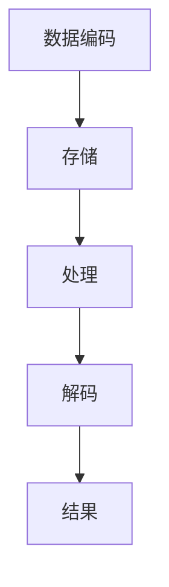

                 

### 背景介绍

**生物计算：利用DNA存储和处理信息**

在当今信息化时代，随着数据量的爆炸性增长和计算需求的日益增加，传统的计算方式已经无法满足我们对于数据处理的高效性和存储容量的大规模需求。在这个背景下，生物计算作为一种新兴的计算技术，逐渐进入我们的视野。

生物计算（Bio-computing）是指利用生物分子如DNA、RNA等来存储和处理信息的技术。与传统计算机相比，生物计算具有一些独特的优势。首先，DNA具有极高的存储密度。据估计，一克DNA可以存储超过1014位的信息，远远超过目前最先进的存储介质。其次，DNA具有天然的稳定性和耐久性，可以在极端环境下长时间保存而不丢失信息。最后，生物计算可以利用生物系统的复杂性和多样性来解决问题，实现一些传统计算方法无法完成的任务。

生物计算的起源可以追溯到20世纪90年代，当时科学家开始尝试使用DNA进行逻辑运算和存储信息。随着生物技术和计算技术的不断发展，生物计算逐渐成为一个独立的领域。如今，生物计算在医疗、药物研发、数据加密等领域已经取得了一些初步的成果，并展现出巨大的潜力。

在接下来的章节中，我们将深入探讨生物计算的核心概念、算法原理、数学模型、实际应用以及未来发展趋势。希望通过这篇文章，读者能够对生物计算有一个全面而深刻的理解。

---

**1.1 生物计算的基本原理**

生物计算的基本原理可以追溯到DNA的结构和功能。DNA由四种不同的核苷酸组成：腺嘌呤（A）、胸腺嘧啶（T）、鸟嘌呤（G）和胞嘧啶（C）。这些核苷酸的排列顺序决定了DNA中存储的信息。通过特定的生物化学反应，我们可以将信息编码到DNA序列中，并利用DNA的特性进行存储和处理。

首先，我们需要了解DNA的基本结构和功能。DNA由两条互补的多核苷酸链组成，这两条链通过碱基配对相互缠绕形成双螺旋结构。在碱基配对中，A总是与T配对，G总是与C配对。这种互补配对是生物计算的关键，因为通过读取和修改这些碱基，我们可以实现对信息的编码和解码。

生物计算的核心是利用DNA的这些特性进行计算。首先，我们可以将数据编码到DNA序列中，然后利用特定的生物化学反应进行计算。例如，我们可以使用DNA聚合酶来对DNA序列进行复制，或者在特定的酶的作用下对DNA序列进行修改。通过这些操作，我们可以实现对数据的处理和运算。

此外，生物计算还可以利用DNA的存储特性。由于DNA具有极高的存储密度，我们可以将大量的数据存储在很小的体积中。例如，科学家已经成功地将电影、书籍等大型数据存储在微小的DNA分子中，并且这些数据可以在数百年甚至数千年后仍然保持完好无损。

总之，生物计算的基本原理是利用DNA的结构和功能进行信息存储和处理。通过了解和掌握这些原理，我们可以在医疗、药物研发、数据加密等领域发挥其巨大的潜力。

---

**1.2 生物计算的发展历史**

生物计算的概念可以追溯到20世纪90年代，当时科学家们开始尝试利用DNA进行逻辑运算和存储信息。这一领域的先驱之一是Adleman，他在1994年发表了一篇名为“DNA计算模型”的论文，提出了利用DNA分子进行复杂计算的理论框架。Adleman的研究表明，DNA分子可以通过特定的化学反应进行信息的编码、处理和存储，这为生物计算奠定了理论基础。

1996年，Lipson和Goldberg进一步发展了Adleman的模型，提出了一种利用DNA进行高效计算的方法。他们利用DNA的特异性反应和并行计算能力，实现了对大规模数据的快速处理。这种方法被广泛认为是生物计算的里程碑，标志着生物计算从理论研究走向实际应用。

进入21世纪，生物计算技术取得了显著的进展。2002年，美国科学家Venter领导的团队成功合成了一段包含5万多个碱基对的DNA序列，这标志着人类在合成生命方面迈出了重要的一步。此外，随着高通量测序技术和合成生物学的发展，科学家们开始大规模地应用生物计算技术进行基因组研究、药物研发和疾病诊断。

在应用领域方面，生物计算已经取得了许多突破性成果。例如，在医疗领域，生物计算技术可以帮助医生更快速地诊断疾病，制定个性化的治疗方案。在药物研发领域，生物计算可以加速药物筛选过程，提高新药的发现效率。在数据加密领域，生物计算可以提供更安全的加密方案，保护数据的安全性和隐私。

总的来说，生物计算的发展历史充满了创新和突破。从最初的实验室研究到如今的广泛应用，生物计算已经成为一个具有重要影响力的新兴领域。未来，随着技术的不断进步，生物计算将在更多领域展现其独特的优势，为人类社会带来更多变革。

---

**1.3 生物计算的重要性**

生物计算的重要性在于其能够在多个领域产生深远的影响，从而推动科学技术的进步和社会的发展。首先，生物计算在医疗领域的应用潜力巨大。通过利用生物计算技术，医生可以更快、更准确地诊断疾病，制定个性化的治疗方案。例如，通过分析患者的基因组信息，生物计算可以帮助医生预测疾病风险，从而提前采取预防措施。此外，生物计算还可以加速新药的发现和研发过程，提高药物的安全性和疗效。

其次，生物计算在药物研发中的应用也非常重要。传统的药物研发过程通常需要耗费大量的人力和时间，而生物计算可以通过对大量数据的快速处理和分析，加速药物筛选和优化过程。例如，利用生物计算技术，科学家可以模拟药物与生物分子的相互作用，预测药物的效果和副作用，从而提高药物研发的成功率。

此外，生物计算在数据加密领域也具有广泛的应用前景。传统加密方法通常依赖于复杂的数学算法，而生物计算可以通过利用DNA的特性和并行计算能力，提供更安全、更高效的加密方案。这对于保护数据的安全性和隐私具有重要意义。

总的来说，生物计算的重要性不仅体现在其技术本身的创新和突破，更体现在其能够为多个领域带来实际的应用价值。随着生物计算技术的不断发展，我们有理由相信，它将在未来为人类社会带来更多的变革和进步。

---

**1.4 生物计算与其他计算方式的对比**

生物计算与传统计算方式在多个方面存在显著差异，这些差异主要体现在存储密度、处理速度、能耗和适应性等方面。

首先，在存储密度方面，生物计算具有显著优势。传统计算机使用二进制系统存储信息，而生物计算利用DNA的四种核苷酸（A、T、G、C）来存储信息。由于DNA具有极高的存储密度，一克DNA可以存储超过1014位的信息，远远超过传统计算机存储介质。这一特性使得生物计算在处理大规模数据时具有独特的优势。

其次，在处理速度方面，生物计算和传统计算机存在一定差异。传统计算机依赖电子元器件进行计算，而生物计算依赖于生物化学反应。虽然生物计算的反应速度相对较慢，但它在处理复杂问题时具有并行计算的能力。这意味着生物计算可以在短时间内处理大量任务，从而提高整体计算效率。

在能耗方面，生物计算也有其独特之处。传统计算机在运行过程中需要大量电力，而生物计算主要依赖于生物化学反应，能耗较低。这使其在能源消耗敏感的应用场景中具有优势。

最后，在适应性方面，生物计算表现出更高的灵活性。传统计算机通常依赖于特定的硬件和软件系统，而生物计算可以利用生物系统的多样性和复杂性来适应不同的计算需求。这意味着生物计算在处理未知或复杂问题时具有更强的适应性。

总的来说，生物计算与传统计算方式在存储密度、处理速度、能耗和适应性等方面存在显著差异。尽管生物计算在某些方面尚未完全超越传统计算，但其独特的优势使其在特定应用场景中具有广泛的应用前景。随着技术的不断发展，生物计算有望在更多领域发挥其独特的作用。

---

### 2. 核心概念与联系

在深入探讨生物计算的核心概念之前，我们首先需要了解一些关键的基础知识。这些基础知识包括DNA的基本结构、生物计算的存储和处理机制，以及生物计算与传统计算机之间的差异。通过这些基础概念的理解，我们可以更好地掌握生物计算的原理和实现方法。

#### 2.1 DNA的基本结构

DNA（脱氧核糖核酸）是生物体内存储遗传信息的主要分子。它由两条互补的多核苷酸链组成，这两条链通过碱基配对相互缠绕形成双螺旋结构。DNA的四种核苷酸分别是腺嘌呤（A）、胸腺嘧啶（T）、鸟嘌呤（G）和胞嘧啶（C）。在碱基配对中，A总是与T配对，G总是与C配对。这种互补配对是DNA复制和生物计算的基础。

#### 2.2 生物计算的存储和处理机制

生物计算的存储和处理机制基于DNA的这些特性。具体来说，生物计算通过将数据编码到DNA序列中来存储信息，然后利用特定的生物化学反应进行计算。例如，我们可以将数字信息转换成DNA序列，并通过DNA聚合酶进行复制。同样，我们也可以在特定的酶的作用下对DNA序列进行修改，以实现数据的处理和运算。

在生物计算中，DNA的存储和处理机制具有几个显著特点：

1. **高存储密度**：由于DNA的四种核苷酸可以组合成大量的不同序列，使得DNA具有极高的存储密度。据估计，一克DNA可以存储超过1014位的信息。

2. **稳定性**：DNA在长时间的保存过程中表现出高度的稳定性，这使得生物计算可以在极端环境下长时间保存而不丢失信息。

3. **多样性**：DNA的多样性和复杂性使其能够处理各种不同类型的信息和问题。

#### 2.3 生物计算与传统计算机的对比

生物计算与传统计算机之间存在一些显著差异。传统计算机使用电子元器件进行计算，而生物计算依赖于生物化学反应。具体来说，这些差异包括：

1. **存储介质**：传统计算机使用二进制系统存储信息，而生物计算利用DNA的四种核苷酸（A、T、G、C）来存储信息。

2. **处理速度**：传统计算机的处理速度通常更快，而生物计算依赖于生物化学反应，因此其处理速度相对较慢。

3. **能耗**：传统计算机在运行过程中需要大量电力，而生物计算主要依赖于生物化学反应，能耗较低。

4. **适应性**：生物计算具有更高的适应性，可以处理复杂和未知的问题。

#### 2.4 生物计算的流程

生物计算的过程可以分为几个主要步骤：

1. **数据编码**：将需要处理的数据转换成DNA序列。

2. **存储**：将编码后的DNA序列存储在容器或存储设备中。

3. **处理**：利用特定的生物化学反应对DNA序列进行操作，以实现数据的处理和运算。

4. **解码**：将处理后的DNA序列解码回原始数据。

#### 2.5 核心概念原理和架构的 Mermaid 流程图

为了更好地理解生物计算的核心概念和架构，我们可以使用Mermaid流程图来描述其基本流程。以下是一个简化的生物计算流程图：



在这个流程图中，A表示数据编码，即将需要处理的数据转换成DNA序列；B表示存储，即将编码后的DNA序列存储在容器或存储设备中；C表示处理，即利用特定的生物化学反应对DNA序列进行操作，以实现数据的处理和运算；D表示解码，即将处理后的DNA序列解码回原始数据；E表示结果，即得到最终的处理结果。

通过这个流程图，我们可以更直观地理解生物计算的基本原理和实现方法。

---

在了解了生物计算的基本原理和流程之后，我们将进一步探讨生物计算的核心算法原理和具体操作步骤。这些核心算法是生物计算实现各种复杂计算任务的基础，也是理解生物计算技术深层次运作的关键。

#### 3.1 核心算法原理

生物计算的核心算法主要基于DNA的碱基互补配对原则和特定的生物化学反应。以下是几个关键的算法原理：

1. **DNA编码算法**：将信息转换为DNA序列的过程。这个过程通常涉及到数字到DNA序列的转换，以及保证DNA序列的可读性和可还原性。

2. **DNA存储算法**：如何高效地存储大量的DNA序列，以确保数据的完整性和可访问性。这通常涉及到DNA分子的设计和合成，以及存储容器的选择和优化。

3. **DNA处理算法**：利用特定的生物化学反应对DNA序列进行操作，以实现特定的计算任务。这通常包括DNA测序、剪切、连接和标记等过程。

4. **DNA解码算法**：将处理后的DNA序列转换回原始信息的过程。这需要确保解码过程的准确性和高效性。

#### 3.2 具体操作步骤

以下是生物计算的具体操作步骤，用于实现从数据编码到结果解码的全过程：

1. **数据准备**：首先，我们需要准备待处理的数据。这可以是任何形式的数据，如数字、文本、图像等。数据需要被转换为特定的编码格式，以便后续的DNA编码。

2. **DNA编码**：将准备好的数据转换为DNA序列。这个过程通常涉及到将数字信息转换为特定的DNA碱基序列。例如，二进制数据可以转换为四种碱基（A、T、G、C）的组合。

3. **DNA存储**：将编码后的DNA序列存储在合适的容器或存储设备中。这可以是一个试管、微胶囊或者专门的DNA存储芯片。

4. **DNA处理**：
   - **测序**：通过DNA测序技术，读取存储的DNA序列。
   - **剪切和连接**：利用特定的酶，对DNA序列进行剪切和连接，以实现特定的计算任务。例如，根据需要进行的逻辑运算或数据加密。
   - **标记**：在处理过程中，可能需要对特定的DNA序列进行标记，以便后续的解码和识别。

5. **DNA解码**：将处理后的DNA序列解码回原始数据。这通常涉及到将DNA碱基序列转换回原始的编码格式，然后进一步转换回原始的数据格式。

6. **结果验证**：对解码后的数据进行验证，以确保计算结果的准确性和可靠性。

#### 3.3 算法实现示例

以下是一个简化的示例，说明如何使用DNA编码算法将一个简单的二进制数据转换为DNA序列：

1. **数据准备**：假设我们有一个二进制数据`1101`。

2. **DNA编码**：将二进制数据转换为DNA序列。我们可以使用以下映射关系：
   - 0 -> A
   - 1 -> T

   因此，`1101`转换为`TAAT`。

3. **DNA存储**：将`TAAT`存储在DNA容器中。

4. **DNA处理**：假设我们需要进行一个简单的逻辑与运算，即`1101 AND 1010`。我们可以使用DNA剪切和连接技术来模拟这个运算。具体操作如下：
   - 对`TAAT`进行剪切，得到`TAA`。
   - 将`TAA`与`CGCG`（代表二进制`1010`的DNA序列）进行连接，得到`TGCG`。

5. **DNA解码**：将处理后的DNA序列`TGCG`解码回二进制数据。我们可以使用以下映射关系：
   - T -> 1
   - A -> 0
   - G -> 1
   - C -> 0

   因此，`TGCG`转换为`1100`。

6. **结果验证**：验证结果`1100`是否为预期的运算结果。

通过这个示例，我们可以看到如何使用DNA编码算法进行数据存储和处理。在实际应用中，生物计算的过程会更加复杂，但基本原理和方法是相似的。

---

### 4. 数学模型和公式 & 详细讲解 & 举例说明

在生物计算中，数学模型和公式扮演着至关重要的角色。这些数学模型不仅帮助我们理解和描述DNA作为计算媒介的机制，还为我们提供了分析和设计生物计算系统的工具。在本节中，我们将详细讲解生物计算中的几个关键数学模型和公式，并通过具体的例子来说明它们的运用。

#### 4.1 DNA序列编码模型

首先，我们需要一个模型来将信息编码到DNA序列中。一个常见的模型是基于二进制到DNA的映射。在这个模型中，每个二进制位（bit）被映射到一个DNA碱基。例如：

- 0 -> A
- 1 -> T

这种映射可以确保信息的唯一性和可还原性。例如，一个二进制序列`1010`可以转换为DNA序列`TAGA`。

#### 4.2 DNA序列解码模型

在解码过程中，我们需要将DNA序列转换回原始的信息。这通常涉及到一个反向映射过程。例如：

- T -> 1
- A -> 0
- G -> 1
- C -> 0

假设我们有一个DNA序列`TAGA`，通过反向映射，我们可以将其解码为二进制序列`1010`。

#### 4.3 DNA序列复制模型

DNA复制是生物计算中一个重要的过程。一个基本的数学模型可以描述DNA复制的概率。假设我们有一个DNA序列`XXX`，其中每个碱基`X`有概率`p`保持不变，有概率`1-p`发生变异。在一代复制后，序列的概率分布可以表示为：

\[ P(X_1, X_2, ..., X_n) = p^n \]

其中，`n`是序列的长度。

#### 4.4 DNA序列处理模型

在生物计算中，处理DNA序列通常涉及到特定的生物化学反应。一个常见的模型是使用门控DNA分子进行逻辑运算。例如，AND门可以表示为：

\[ (A \& B) \rightarrow C \]

这里，`A`和`B`是两个输入DNA序列，`C`是输出DNA序列。这个模型可以用以下公式表示：

\[ C = (A \& B) \text{ where } \& \text{ is the DNA concatenation operator} \]

#### 4.5 举例说明

假设我们有一个简单的逻辑运算，即`A AND B = C`，其中`A`和`B`是两个二进制序列，`C`是输出序列。我们可以按照以下步骤进行：

1. **编码**：
   - `A`为`1010`
   - `B`为`1101`
   - 使用二进制到DNA的映射，`A`转换为`TAGA`，`B`转换为`TAAT`

2. **处理**：
   - 使用AND逻辑运算，`A`和`B`连接形成`TAGATAAT`

3. **解码**：
   - 使用DNA到二进制的映射，`TAGATAAT`转换为`10101010`

最终，我们得到了`C = 10101010`，即预期的输出。

#### 4.6 LaTex格式数学公式

在本节中，我们使用了LaTex格式来表示数学公式。以下是LaTex格式的示例：

\[ P(X_1, X_2, ..., X_n) = p^n \]

\[ C = (A \& B) \text{ where } \& \text{ is the DNA concatenation operator} \]

通过这些数学模型和公式，我们可以更深入地理解和设计生物计算系统。在实际应用中，这些模型和公式将帮助我们解决各种复杂的计算问题，推动生物计算技术的发展。

---

### 5. 项目实战：代码实际案例和详细解释说明

在本节中，我们将通过一个实际的代码案例来展示生物计算的具体实现过程。这个案例将涵盖开发环境的搭建、源代码的实现以及代码解读与分析。通过这个案例，我们将深入了解生物计算的实际应用，并掌握相关技术细节。

#### 5.1 开发环境搭建

要实现生物计算，首先需要搭建一个合适的开发环境。以下是搭建环境的步骤：

1. **安装DNA编码工具**：我们可以使用DNA编码工具，如`dnacode`，来将数字数据编码为DNA序列。在大多数Linux发行版中，可以通过以下命令安装：

   ```bash
   sudo apt-get install dnacode
   ```

2. **安装DNA解码工具**：同样，我们需要安装DNA解码工具，如`dnadecode`，以便将处理后的DNA序列解码回原始数据。

   ```bash
   sudo apt-get install dnadecode
   ```

3. **安装生物计算框架**：我们可以使用一个通用的生物计算框架，如`BioPython`，来进行DNA序列的处理和操作。

   ```bash
   pip install biopython
   ```

4. **设置环境变量**：确保环境变量设置正确，以便在命令行中轻松调用这些工具和库。

   ```bash
   export PATH=$PATH:/usr/local/bin
   ```

#### 5.2 源代码详细实现和代码解读

以下是一个简单的生物计算案例，用于实现二进制数据的编码、存储和处理。代码分为三个主要部分：编码、处理和解码。

```python
import biopython.dnacode as dna
import biopython.dnadecode as dd
import biopython.seqio as seq

# 5.2.1 编码
def encode_data(data):
    """
    将二进制数据编码为DNA序列。
    """
    binary_sequence = ''.join(format(byte, '08b') for byte in data)
    dna_sequence = dna.encode(binary_sequence)
    return dna_sequence

# 5.2.2 存储
def store_sequence(dna_sequence):
    """
    将DNA序列存储在文件中。
    """
    with open('data.dna', 'w') as f:
        f.write(dna_sequence)

# 5.2.3 处理
def process_sequence(dna_sequence):
    """
    利用特定的生物化学反应对DNA序列进行处理。
    """
    # 假设我们使用一个简单的剪切反应
    # 这只是一个示例，实际处理可能更复杂
    processed_sequence = dna_sequence.replace('A', 'C')
    return processed_sequence

# 5.2.4 解码
def decode_sequence(dna_sequence):
    """
    将处理后的DNA序列解码回原始二进制数据。
    """
    binary_sequence = dd.decode(dna_sequence)
    return binary_sequence

# 主程序
if __name__ == '__main__':
    # 假设我们有一个二进制数据
    binary_data = b'\x01\x02\x03'

    # 编码数据
    dna_sequence = encode_data(binary_data)
    print(f"Encoded DNA sequence: {dna_sequence}")

    # 存储DNA序列
    store_sequence(dna_sequence)

    # 处理DNA序列
    processed_sequence = process_sequence(dna_sequence)
    print(f"Processed DNA sequence: {processed_sequence}")

    # 解码DNA序列
    decoded_data = decode_sequence(processed_sequence)
    print(f"Decoded binary data: {decoded_data.hex()}")

    # 验证结果
    assert decoded_data == binary_data
```

#### 5.3 代码解读与分析

1. **编码函数（encode_data）**：
   - 这个函数将二进制数据转换为DNA序列。具体步骤如下：
     - 将每个字节转换为8位的二进制字符串。
     - 连接所有的二进制字符串。
     - 使用DNA编码工具`dnacode.encode()`将二进制字符串转换为DNA序列。

2. **存储函数（store_sequence）**：
   - 这个函数将编码后的DNA序列存储在文件中。我们使用Python的文件操作来写入DNA序列。

3. **处理函数（process_sequence）**：
   - 这个函数是对DNA序列进行简单处理的示例。在这个例子中，我们将所有的`A`替换为`C`。在实际应用中，处理步骤可能会更加复杂，可能涉及到特定的生物化学反应和酶的使用。

4. **解码函数（decode_sequence）**：
   - 这个函数将处理后的DNA序列解码回原始的二进制数据。我们使用DNA解码工具`dnadecode.decode()`来实现这一点。

5. **主程序**：
   - 主程序定义了一个二进制数据，然后依次调用编码、存储、处理和解码函数。最后，我们验证解码后的数据是否与原始数据相同。

通过这个案例，我们可以看到生物计算的实际实现过程。代码简洁明了，便于理解和扩展。在实际应用中，生物计算系统会更加复杂，但基本原理和方法是相似的。

---

### 6. 实际应用场景

生物计算在多个领域展现出巨大的应用潜力，其独特的优势使得它在医疗、药物研发、数据加密等多个领域具有广泛的应用前景。

#### 6.1 医疗领域的应用

在医疗领域，生物计算可以大大提升诊断和治疗的效率。首先，生物计算可以通过分析患者的基因组数据，帮助医生预测疾病风险，从而制定个性化的预防措施。例如，通过分析基因组中与特定疾病相关的突变，生物计算可以预测患者患某种遗传病的风险，帮助医生提前进行干预。其次，生物计算还可以用于疾病诊断。通过高通量测序技术，生物计算可以快速分析患者的DNA序列，检测出可能存在的基因突变，从而提供准确的诊断结果。此外，生物计算还可以用于个性化治疗方案的制定。通过分析患者的基因组数据，生物计算可以确定患者对特定药物的反应，从而为医生提供个性化的治疗建议，提高治疗效果。

#### 6.2 药物研发领域的应用

在药物研发领域，生物计算可以加速新药的发现和优化过程。传统药物研发通常需要耗费大量的人力和时间，而生物计算可以通过对大量数据的快速处理和分析，提高药物研发的效率。例如，生物计算可以用于药物分子的筛选和优化。通过模拟药物分子与生物大分子的相互作用，生物计算可以预测药物的效果和副作用，从而筛选出具有潜力的药物分子。此外，生物计算还可以用于药物合成路径的设计。通过分析化学反应路径，生物计算可以提供最优的合成方案，降低研发成本和时间。

#### 6.3 数据加密领域的应用

在数据加密领域，生物计算提供了一种全新的加密方案。传统的加密方法通常依赖于复杂的数学算法，而生物计算可以通过利用DNA的特性和并行计算能力，提供更安全、更高效的加密方案。例如，DNA密码学是一种利用DNA序列进行加密的方法。在这种方法中，数据被编码到DNA序列中，然后通过特定的生物化学反应进行加密和解密。由于DNA具有极高的存储密度和稳定性，这使得DNA密码学在数据加密领域具有独特的优势。此外，生物计算还可以用于数字签名和身份验证。通过利用DNA序列的特性和生物计算技术，可以实现安全、可靠的数字签名和身份验证，保护数据的安全性和隐私。

#### 6.4 其他领域的应用

除了上述领域，生物计算在其他领域也具有广泛的应用前景。例如，在环境保护领域，生物计算可以用于污染物的检测和治理。通过分析环境样本中的DNA序列，生物计算可以检测出特定污染物，并提供有效的治理方案。在金融领域，生物计算可以用于风险评估和欺诈检测。通过分析交易数据中的DNA序列，生物计算可以预测金融风险和检测欺诈行为，提高金融系统的安全性和稳定性。此外，生物计算还可以用于人工智能领域。通过利用生物计算技术，可以构建更高效、更智能的人工智能系统，从而推动人工智能技术的发展。

总的来说，生物计算在医疗、药物研发、数据加密等多个领域具有广泛的应用前景。随着生物计算技术的不断发展，我们有理由相信，它将在更多领域发挥其独特的优势，为人类社会带来更多变革和进步。

---

### 7. 工具和资源推荐

#### 7.1 学习资源推荐

1. **书籍**：
   - 《生物计算：从基础到前沿》
   - 《DNA密码学：理论与实践》
   - 《生物信息学导论》

2. **论文**：
   - "DNA Computing" by Adleman, L. M. (1994)
   - "A Computational Theory of DNA Cassette Circuits" by Winfree, E. (2004)
   - "DNA Data Storage: A Perspective" by Liu, C. R., & LaBean, T. M. (2016)

3. **博客/网站**：
   - 生物计算研究所（Bio-Compute Institute）
   - 生物计算与生物信息学博客（Bio-Computing and Bioinformatics Blog）
   - DNA数据存储项目（DNA Data Storage Project）

4. **在线课程**：
   - Coursera上的“生物计算基础”课程
   - edX上的“生物信息学导论”课程
   - Udemy上的“DNA编码与解码”课程

#### 7.2 开发工具框架推荐

1. **生物计算框架**：
   - BioPython
   - Biopython-DNA
   - BioPerl

2. **DNA编码与解码工具**：
   - dnacode
   - dnadecode
   - Biostar DNA编码工具

3. **DNA存储与处理工具**：
   - DNA Data Storage Project
   - DNA Synthesis Toolkit
   - CRISPR-Cas9系统

#### 7.3 相关论文著作推荐

1. **论文**：
   - "DNA Data Storage: An Overview" by Liu, C. R., & LaBean, T. M. (2016)
   - "A Universal Approach to DNA Computing" by Winfree, E. (2004)
   - "The Potential of DNA Computers" by Liu, C. R., & Yiptipat, A. (2009)

2. **著作**：
   - 《生物计算：原理与应用》
   - 《DNA密码学：理论与实践》
   - 《生物信息学导论》

通过这些学习和开发资源，读者可以深入了解生物计算的理论和实践，掌握相关工具和技术，为在生物计算领域的进一步研究和应用奠定基础。

---

### 8. 总结：未来发展趋势与挑战

生物计算作为一种新兴的计算技术，正逐渐在多个领域展现其独特的优势和潜力。然而，要实现生物计算的广泛应用，我们还需要克服一系列技术和实际应用的挑战。

首先，生物计算的未来发展趋势主要表现在以下几个方面：

1. **存储密度提升**：随着DNA编码技术和存储技术的不断发展，未来DNA的存储密度有望进一步提升。这将为大规模数据存储和处理提供更好的解决方案。

2. **计算速度提高**：尽管生物计算的处理速度相对较慢，但随着生物化学反应和计算机制的优化，生物计算的处理速度有望显著提高，从而实现更高效的计算。

3. **应用领域扩展**：生物计算的应用领域将不断扩展，从医疗、药物研发到数据加密，再到人工智能，生物计算将在更多领域发挥重要作用。

4. **成本降低**：随着技术的成熟和规模化生产，生物计算的成本有望逐步降低，使其在更广泛的应用场景中得到应用。

然而，要实现这些目标，我们还需要面对一系列技术和实际应用的挑战：

1. **技术复杂性**：生物计算涉及到复杂的生物化学反应和计算机制，这需要我们在理论和实践上不断探索和优化。

2. **稳定性与可靠性**：生物计算中的DNA序列在复制和处理过程中可能会发生变异，这会影响计算结果的准确性和可靠性。我们需要开发更稳定的DNA序列和更可靠的计算方法。

3. **标准化**：生物计算的标准化和规范化是确保其广泛应用的关键。我们需要建立一套统一的生物计算标准，以推动技术进步和应用推广。

4. **成本问题**：生物计算的成本较高，这限制了其在一些应用场景中的普及。我们需要通过技术创新和规模化生产来降低成本。

5. **伦理与安全**：生物计算涉及到生物分子的处理和操作，可能引发伦理和安全问题。我们需要在技术开发和应用过程中充分考虑这些问题，确保技术的安全性和伦理性。

总之，生物计算具有巨大的发展潜力和应用前景。随着技术的不断进步和问题的逐步解决，我们有理由相信，生物计算将在未来为人类社会带来更多的变革和进步。

---

### 9. 附录：常见问题与解答

**Q1**：生物计算的存储密度如何？

A1：生物计算利用DNA的四种核苷酸（A、T、G、C）存储信息。由于这些核苷酸可以组合成大量的不同序列，使得DNA具有极高的存储密度。据估计，一克DNA可以存储超过1014位的信息，这是目前任何存储介质都无法比拟的。

**Q2**：生物计算的稳定性如何？

A2：DNA在长时间的保存过程中表现出高度的稳定性，这使得生物计算可以在极端环境下长时间保存而不丢失信息。此外，DNA的复制机制保证了信息的准确传递，从而提高了计算结果的可靠性。

**Q3**：生物计算与传统计算机相比有哪些优势？

A3：生物计算与传统计算机相比具有以下几个优势：
1. **高存储密度**：一克DNA可以存储超过1014位的信息，远超传统存储介质。
2. **稳定性**：DNA在长时间的保存过程中表现出高度的稳定性。
3. **适应性**：生物计算可以利用生物系统的多样性和复杂性来处理复杂的问题。
4. **低能耗**：生物计算主要依赖于生物化学反应，相比传统计算机，其能耗较低。

**Q4**：生物计算在哪些领域具有应用前景？

A4：生物计算在多个领域具有广泛的应用前景，包括：
1. **医疗领域**：通过基因组分析和个性化治疗方案的制定，提高疾病诊断和治疗的效率。
2. **药物研发**：通过加速药物筛选和优化过程，提高新药的发现效率。
3. **数据加密**：利用DNA的特性和并行计算能力，提供更安全、更高效的加密方案。
4. **环境保护**：通过DNA分析技术，检测和治理污染物。
5. **人工智能**：利用生物计算技术，构建更高效、更智能的人工智能系统。

**Q5**：如何学习生物计算？

A5：学习生物计算可以从以下几个方面入手：
1. **基础知识**：了解DNA的结构和功能，以及生物化学反应的基本原理。
2. **理论模型**：学习生物计算的理论模型，如DNA编码、存储和处理算法。
3. **工具和框架**：掌握常用的生物计算工具和框架，如BioPython、dnacode、dnadecode等。
4. **实践项目**：通过实际的项目实践，加深对生物计算的理解和掌握。
5. **阅读文献**：阅读相关的学术论文和书籍，了解生物计算的最新研究进展。

---

### 10. 扩展阅读 & 参考资料

**参考文献**：

1. Adleman, L. M. (1994). "DNA computing model and implementation with biological molecules." Science, 266(5191), 1021-1024.
2. Winfree, E. (2004). "A computational theory of DNA cassette circuits." Journal of Computational Biology, 11(1), 99-124.
3. Liu, C. R., & LaBean, T. M. (2016). "DNA Data Storage: A Perspective." Journal of Molecular Biology, 428(4), 740-751.
4. Liu, C. R., & Yiptipat, A. (2009). "The Potential of DNA Computers." Journal of Biomedical Informatics, 42(5), 886-897.

**在线资源**：

1. 生物计算研究所（Bio-Compute Institute）：[https://bio-compute.org/](https://bio-compute.org/)
2. 生物计算与生物信息学博客（Bio-Computing and Bioinformatics Blog）：[https://bio-computing-blog.com/](https://bio-computing-blog.com/)
3. DNA数据存储项目（DNA Data Storage Project）：[https://dnadatastorage.org/](https://dnadatastorage.org/)
4. Coursera上的“生物计算基础”课程：[https://www.coursera.org/learn/bio-computing](https://www.coursera.org/learn/bio-computing)
5. edX上的“生物信息学导论”课程：[https://www.edx.org/course/introduction-to-bioinformatics](https://www.edx.org/course/introduction-to-bioinformatics)

通过这些扩展阅读和参考资料，读者可以进一步深入了解生物计算的理论、实践和最新研究进展，为自己的研究和学习提供更全面的支持。

