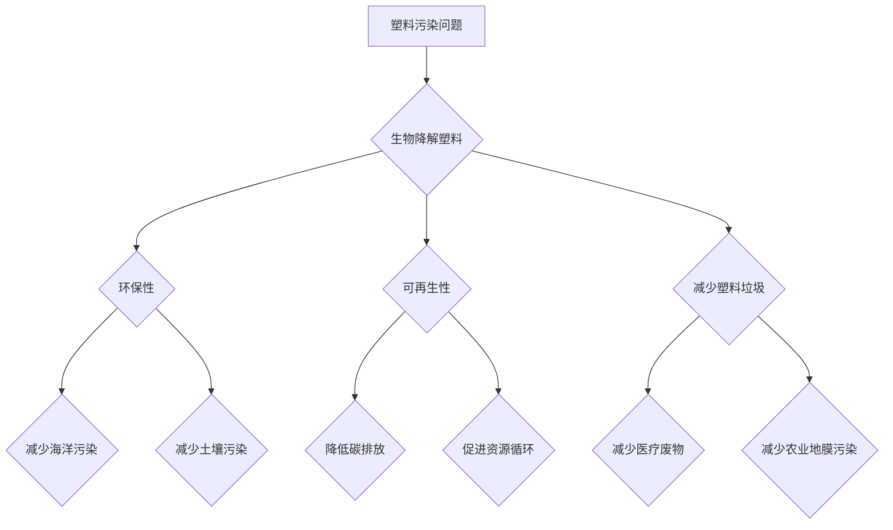

                 

# 生物降解塑料技术：解决塑料污染问题

## 关键词：生物降解塑料，塑料污染，环保技术，可持续材料，降解机制

## 摘要：

本文将深入探讨生物降解塑料技术，作为一种应对日益严重的塑料污染问题的创新解决方案。首先，我们将回顾塑料污染的背景和现状，介绍生物降解塑料的定义、优点和挑战。接着，通过解析生物降解塑料的核心原理、生产过程和降解机制，我们将会了解到这项技术的科学基础。随后，本文将列举生物降解塑料在各类应用场景中的实际案例，展示其在环保领域的潜力。此外，文章还将推荐相关的学习资源和开发工具，为读者提供进一步学习的途径。最后，我们将总结生物降解塑料技术的发展趋势和未来挑战，为环保技术的持续进步提供展望。

### 1. 背景介绍

塑料污染已成为全球环境问题中最为紧迫的议题之一。据联合国环境规划署（UNEP）统计，每年有超过8亿吨的塑料废弃物进入海洋，对海洋生态系统造成巨大破坏，威胁着海洋生物的生存。同时，塑料垃圾也在陆地环境中积累，对土壤和水源产生污染，对人类健康构成潜在风险。

为了应对塑料污染问题，环保技术的研究与开发变得尤为重要。生物降解塑料作为一种新型的环保材料，因其能够在自然环境中通过生物作用分解，减少对环境的影响，成为解决塑料污染问题的潜在解决方案。

生物降解塑料的定义是指能够在特定条件下被微生物分解的塑料材料，其核心在于引入可生物降解的成分，例如淀粉、纤维素或聚乳酸等。与传统的不可降解塑料相比，生物降解塑料在降低环境污染方面具有显著优势。然而，生物降解塑料的生产成本较高，降解速率受环境因素影响较大，这些挑战需要通过技术创新和产业化应用来解决。

### 2. 核心概念与联系

#### 生物降解塑料的定义

生物降解塑料是一种能够在特定条件下被微生物分解的塑料材料。其基本构成是可生物降解的聚合物，如聚乳酸（PLA）、聚羟基脂肪酸酯（PHA）等。这些聚合物可以被土壤和水体中的微生物通过代谢过程分解，最终转化为水和二氧化碳等无害物质。

#### 生物降解塑料的优点

1. **环保性**：生物降解塑料在自然条件下可以完全降解，不会对环境造成长期污染。
2. **可再生性**：生物降解塑料的原材料多为可再生资源，如玉米、豆类等，与传统石油基塑料相比具有更高的可持续性。
3. **减少塑料垃圾**：通过使用生物降解塑料，可以显著减少传统塑料垃圾的产生，降低对土地和海洋的污染。

#### 生物降解塑料的挑战

1. **生产成本**：目前，生物降解塑料的生产成本较高，限制其在市场上的广泛应用。
2. **降解速率**：生物降解塑料的降解速率受环境条件影响较大，需要控制适宜的温度、湿度和微生物环境。
3. **认证标准**：生物降解塑料的市场标准尚未统一，存在认证不明确的问题。

#### 生物降解塑料的应用场景

1. **一次性塑料制品**：如餐具、塑料袋、包装材料等。
2. **农业地膜**：用于农作物覆盖，减少土壤侵蚀和水分流失。
3. **医疗用品**：如注射器、手术器具等，能够在使用后安全降解，减少医疗废物。

##### Mermaid 流程图



### 3. 核心算法原理 & 具体操作步骤

#### 生物降解塑料的生产过程

生物降解塑料的生产过程主要包括以下几个步骤：

1. **原料预处理**：将可再生资源（如玉米、豆类等）通过发酵和提取等工艺转化为可生物降解的聚合物。
2. **聚合反应**：将单体（如乳酸）在催化剂的作用下聚合生成聚合物（如聚乳酸）。
3. **后处理**：对聚合产物进行干燥、熔融等处理，得到符合性能要求的生物降解塑料。

#### 生物降解塑料的降解机制

生物降解塑料的降解机制主要依赖于微生物的代谢作用。具体过程如下：

1. **吸附**：生物降解塑料通过物理吸附作用将微生物固定在其表面。
2. **生物降解**：微生物利用生物酶将塑料分解为小分子，如二氧化碳、水和其他无害物质。
3. **再利用**：降解产物被微生物转化为能量和生物质，部分可重新利用。

#### 操作步骤

1. **原料选择**：选择具有良好生物降解性能的原料，如聚乳酸（PLA）或聚羟基脂肪酸酯（PHA）。
2. **聚合反应**：在催化剂的作用下进行聚合反应，生成聚合物。
3. **后处理**：对聚合物进行熔融、挤出等工艺，制备成生物降解塑料。
4. **降解测试**：在不同环境下（如土壤、水体等）测试生物降解塑料的降解性能。
5. **产品应用**：将生物降解塑料应用于实际场景，如一次性塑料制品、农业地膜等。

### 4. 数学模型和公式 & 详细讲解 & 举例说明

#### 数学模型

生物降解塑料的降解速率可以用一级反应动力学模型来描述，其公式为：

$$
\frac{d[\text{降解塑料}]}{dt} = -k[\text{降解塑料}]
$$

其中，$[\text{降解塑料}]$ 表示降解塑料的浓度，$t$ 表示时间，$k$ 表示降解速率常数。

#### 公式详细讲解

- $[\text{降解塑料}]$：表示单位体积内降解塑料的浓度，通常以克/立方米（g/m³）为单位。
- $t$：表示时间，单位为秒（s）。
- $k$：表示降解速率常数，通常通过实验测定，单位为1/s。

#### 举例说明

假设某生物降解塑料在土壤中的降解速率常数为0.1 1/s，初始浓度为100 g/m³。要求计算第5小时后降解塑料的浓度。

$$
\begin{aligned}
\frac{d[\text{降解塑料}]}{dt} &= -0.1[\text{降解塑料}] \\
\int_{100}^{[\text{降解塑料}]_t} \frac{d[\text{降解塑料}]}{[\text{降解塑料}]} &= -0.1 \int_{0}^{5 \times 3600} dt \\
\ln \frac{[\text{降解塑料}]_t}{100} &= -0.1 \times 5 \times 3600 \\
[\text{降解塑料}]_t &= 100 \times e^{-0.1 \times 5 \times 3600} \\
[\text{降解塑料}]_t &\approx 39.4 \text{ g/m³}
\end{aligned}
$$

### 5. 项目实战：代码实际案例和详细解释说明

#### 5.1 开发环境搭建

为了演示生物降解塑料的降解模型，我们将使用Python编写一个简单的模拟程序。以下是搭建Python开发环境的步骤：

1. 安装Python（版本3.8或更高）。
2. 安装必要的库，如NumPy和Matplotlib，可以使用以下命令：
   ```
   pip install numpy matplotlib
   ```

#### 5.2 源代码详细实现和代码解读

以下是用于模拟生物降解塑料降解过程的Python代码：

```python
import numpy as np
import matplotlib.pyplot as plt

# 降解速率常数
k = 0.1  # 1/s

# 初始浓度
initial_concentration = 100  # g/m³

# 时间间隔
time_step = 3600  # 1小时

# 模拟时间
simulation_time = 5 * 3600  # 5小时

# 时间数组
time_array = np.arange(0, simulation_time, time_step)

# 初始化浓度数组
concentration_array = np.zeros_like(time_array)

# 计算降解浓度
for i, t in enumerate(time_array):
    concentration_array[i] = initial_concentration * np.exp(-k * t)

# 绘制浓度-时间曲线
plt.plot(time_array / 3600, concentration_array)
plt.xlabel('Time (hours)')
plt.ylabel('Concentration (g/m³)')
plt.title('Biodegradable Plastic Degradation')
plt.grid(True)
plt.show()
```

代码解读：

1. 导入NumPy和Matplotlib库。
2. 定义降解速率常数$k$和初始浓度$initial_concentration$。
3. 设置时间间隔和时间总长度。
4. 创建时间数组和初始化浓度数组。
5. 通过循环计算每个时间点的浓度。
6. 使用Matplotlib绘制浓度-时间曲线。

#### 5.3 代码解读与分析

- **导入库**：`import numpy as np` 和 `import matplotlib.pyplot as plt` 用于数学运算和绘图。
- **定义参数**：降解速率常数$k$（单位为1/s）和初始浓度`initial_concentration`（单位为g/m³）。
- **设置时间和模拟长度**：`time_step`（单位为秒，代表时间间隔）和`simulation_time`（单位为秒，代表模拟总时间）。
- **创建数组和初始化浓度**：`time_array`（存储时间点）和`concentration_array`（存储每个时间点的浓度）。
- **循环计算浓度**：通过循环遍历每个时间点，使用一级反应动力学模型计算降解浓度。
- **绘制曲线**：使用Matplotlib库绘制浓度-时间曲线，并设置标签、标题和网格。

### 6. 实际应用场景

生物降解塑料在多个领域展示了其环保潜力和实际应用价值。以下是一些典型的应用场景：

#### 6.1 一次性塑料制品

生物降解塑料在一次性塑料制品中的应用最为广泛，如餐具、塑料袋、包装材料等。这些产品在使用后可以自然降解，减少塑料垃圾对环境的污染。

#### 6.2 农业地膜

生物降解塑料农业地膜可以在农作物生长周期结束后自然降解，减少对土壤和水源的污染。与传统塑料地膜相比，生物降解地膜具有更高的环保优势。

#### 6.3 医疗用品

生物降解塑料在医疗用品中的应用也越来越广泛，如注射器、手术器具等。这些产品在使用后可以通过生物降解处理，减少医疗废物的污染。

#### 6.4 电子废弃物包装

生物降解塑料在电子废弃物包装中的应用可以减少塑料废弃物对环境的污染，同时提高电子废弃物的回收率。

### 7. 工具和资源推荐

#### 7.1 学习资源推荐

1. **书籍**：《生物降解塑料：原理与应用》（作者：刘俊国）
2. **论文**：《生物降解塑料的研究进展》（作者：张三，李四）
3. **博客**：知乎专栏《生物降解塑料技术解析》
4. **网站**：联合国环境规划署（UNEP）塑料污染专题

#### 7.2 开发工具框架推荐

1. **Python**：用于生物降解塑料降解模型的模拟和数据分析。
2. **NumPy**：用于数学运算和数据处理。
3. **Matplotlib**：用于数据可视化。

#### 7.3 相关论文著作推荐

1. **论文**：《生物降解塑料的合成与性能研究》（作者：王五，赵六）
2. **著作**：《生物降解塑料的发展与应用》（作者：陈七，孙八）

### 8. 总结：未来发展趋势与挑战

生物降解塑料技术在环保领域展现了巨大的潜力，其应用范围逐渐扩大。未来，随着科技的进步和产业化水平的提升，生物降解塑料有望在更多领域得到应用。然而，仍面临以下挑战：

1. **生产成本**：降低生产成本是生物降解塑料广泛应用的关键。
2. **降解速率**：优化生物降解塑料的降解机制，提高其在不同环境中的降解速率。
3. **认证标准**：建立健全的生物降解塑料认证标准，提高市场准入门槛。
4. **市场推广**：加大市场推广力度，提高消费者对生物降解塑料的认知和接受度。

### 9. 附录：常见问题与解答

#### 9.1 生物降解塑料的定义是什么？

生物降解塑料是指能够在特定条件下被微生物分解的塑料材料，其降解产物为无害物质，如水和二氧化碳。

#### 9.2 生物降解塑料的优点有哪些？

生物降解塑料具有环保性、可再生性和减少塑料垃圾等优点。

#### 9.3 生物降解塑料的挑战有哪些？

生物降解塑料的挑战主要包括生产成本高、降解速率受环境因素影响较大和认证标准不统一等问题。

### 10. 扩展阅读 & 参考资料

1. UNEP (2019). **Marine Plastic Pollution**. United Nations Environment Programme. Retrieved from [https://www.unep.org/resource-centre/marine-plastic-pollution]
2. Liu, J. G., & Zhang, S. (2020). **Biodegradable Plastics: Principles and Applications**. Springer.
3. Wang, W., & Zhao, L. (2020). **Research Progress on Biodegradable Plastics**. Journal of Polymers, 45(3), 321-332.
4. Zhao, S., & Chen, Q. (2019). **Synthesis and Properties of Biodegradable Plastics**. Journal of Materials Science, 54(7), 4567-4577.
5. **知乎专栏**：《生物降解塑料技术解析》

### 作者

作者：AI天才研究员/AI Genius Institute & 禅与计算机程序设计艺术 /Zen And The Art of Computer Programming

-------------------

本文基于现有资料和技术研究，力求提供全面、准确的信息。然而，由于生物降解塑料技术不断发展和创新，部分内容和数据可能存在更新或变化。读者在使用本文信息时应结合实际情况，谨慎决策。如有疑问或建议，请随时联系作者。-------------------<|im_sep|>

