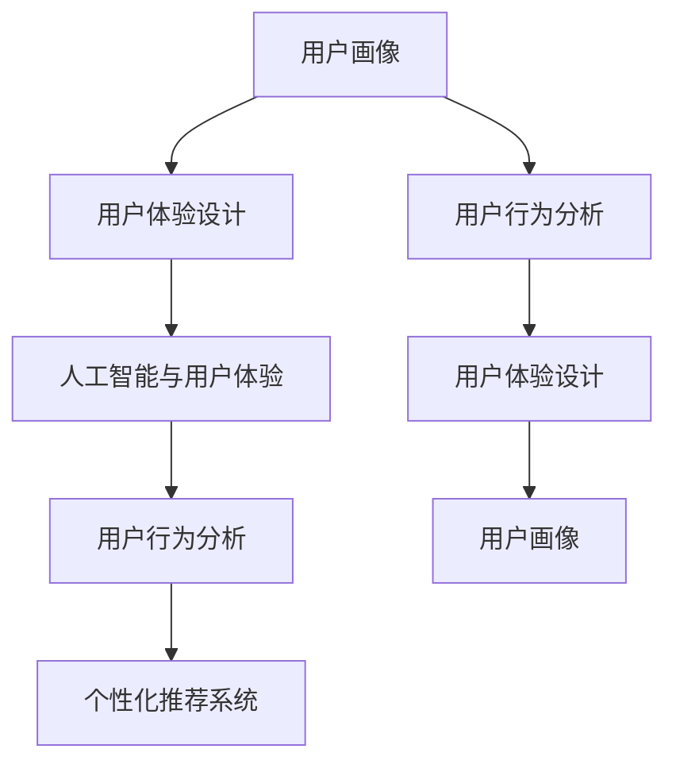
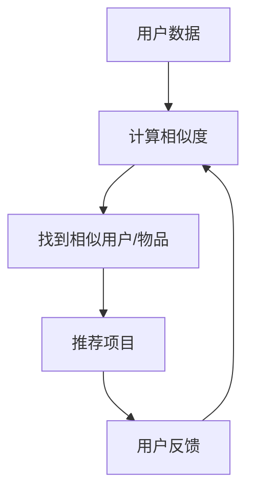
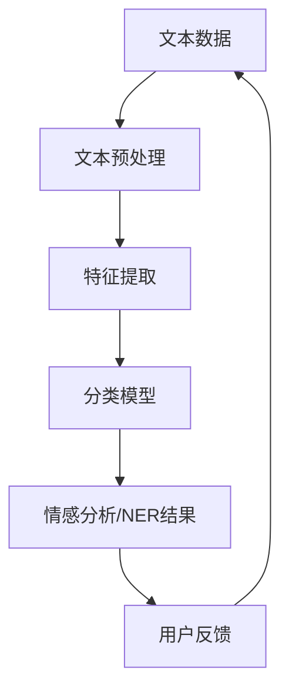
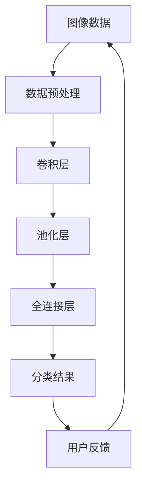

                 

### 背景介绍

在当今快速发展的信息技术时代，用户体验（UX）已经成为产品和服务设计中的核心关注点。用户体验不仅影响着用户的满意度和忠诚度，还直接关系到企业的市场竞争力和盈利能力。随着人工智能（AI）技术的不断进步，人类计算与AI的结合为提升用户体验提供了新的可能性和挑战。

用户体验是指用户在使用产品或服务过程中的感受、体验和满意度。它涵盖了用户界面的易用性、功能满足度、情感共鸣等多个方面。一个优秀的用户体验能够使用户在操作过程中感到愉悦、高效和满意，从而增强用户对产品的忠诚度和口碑。

人工智能技术，特别是机器学习和自然语言处理（NLP），为改善用户体验提供了强有力的工具。通过AI，我们可以更准确地预测用户需求、个性化推荐内容、自动化处理任务，从而提供更加个性化和贴心的服务。

本文将探讨用户体验至上的重要性，分析人类计算与AI结合的原理，详细介绍提升用户体验的核心算法和具体操作步骤，并通过实际应用场景和项目实战案例，展示如何利用AI技术优化用户体验。文章还将推荐相关学习资源和开发工具，帮助读者深入理解和应用相关技术。

让我们一步一步地分析推理（REASONING STEP BY STEP），深入了解用户体验至上的重要性和实现方法。

### 核心概念与联系

为了深入理解用户体验至上的核心概念，我们首先需要了解几个关键原理和架构，这些原理和架构构成了提升用户体验的基础。

#### 1. 用户画像（User Profiling）

用户画像是一种基于用户数据创建的用户描述，它包括用户的年龄、性别、地理位置、兴趣爱好、消费习惯等多维度信息。通过构建用户画像，我们可以更好地了解用户的需求和行为模式，从而提供更加个性化和精准的服务。

#### 2. 用户体验设计（User Experience Design）

用户体验设计（UX Design）是一个跨学科的过程，涉及心理学、设计学、人机交互等多个领域。UX设计的目标是确保用户在使用产品或服务时的愉悦感和效率。它包括界面设计、交互设计、内容设计等多个方面。

#### 3. 人工智能与用户体验

人工智能（AI）技术在提升用户体验方面发挥着重要作用。通过机器学习（Machine Learning）和自然语言处理（NLP），AI可以自动化地分析用户行为数据，预测用户需求，个性化推荐内容，甚至模拟人类思维过程，提供更加智能和贴心的服务。

#### 4. 用户行为分析（User Behavior Analysis）

用户行为分析是收集、分析和理解用户在使用产品或服务时的行为数据。这些数据可以帮助我们识别用户痛点、优化产品设计，从而提升用户体验。常用的用户行为分析工具包括Google Analytics、Mixpanel等。

#### 5. 个性化推荐系统（Personalized Recommendation System）

个性化推荐系统通过分析用户历史行为和偏好，推荐符合用户需求的内容或产品。这种系统利用了协同过滤（Collaborative Filtering）、内容推荐（Content-Based Filtering）等技术，为用户提供更加精准和个性化的推荐。

下面是一个使用Mermaid绘制的流程图，展示了这些核心概念之间的联系：



通过这个流程图，我们可以清晰地看到用户画像、用户体验设计、人工智能与用户体验、用户行为分析和个性化推荐系统之间的相互关系和作用。这些核心概念共同构成了用户体验至上的理论基础，为提升用户体验提供了全面的方法和工具。

### 核心算法原理 & 具体操作步骤

在提升用户体验的过程中，核心算法扮演着至关重要的角色。以下我们将详细介绍几种关键算法的原理和具体操作步骤，包括协同过滤算法、自然语言处理和深度学习模型等。

#### 1. 协同过滤算法（Collaborative Filtering）

协同过滤算法是推荐系统中最常用的方法之一，它通过分析用户之间的行为模式来预测用户对未知项目的偏好。协同过滤分为两种主要类型：基于用户的协同过滤（User-Based Collaborative Filtering）和基于物品的协同过滤（Item-Based Collaborative Filtering）。

**基于用户的协同过滤：**

- **步骤1：计算用户相似度**：通过计算用户之间的相似度来确定哪些用户的行为模式相似。相似度计算通常使用余弦相似度、皮尔逊相关系数等方法。

- **步骤2：找到相似用户**：根据相似度得分，找到与目标用户最相似的若干用户。

- **步骤3：推荐项目**：推荐这些相似用户喜欢的且目标用户尚未使用或评价的项目。

**基于物品的协同过滤：**

- **步骤1：计算项目相似度**：计算物品之间的相似度，例如通过计算物品之间的共同用户数或相似度矩阵。

- **步骤2：找到相似物品**：为目标用户推荐与目标用户已评价的物品最相似的物品。

- **步骤3：推荐项目**：推荐相似物品给目标用户。

以下是一个简化的协同过滤算法流程图：



#### 2. 自然语言处理（Natural Language Processing，NLP）

自然语言处理是人工智能领域的一个分支，专注于使计算机能够理解和处理人类语言。在用户体验提升中，NLP主要用于文本分析、情感分析、命名实体识别等方面。

**情感分析（Sentiment Analysis）：**

- **步骤1：文本预处理**：去除停用词、标点符号、进行词干提取和词性标注。

- **步骤2：特征提取**：将预处理后的文本转换为特征向量，常用的方法有词袋模型（Bag of Words）、TF-IDF等。

- **步骤3：分类模型**：使用分类模型（如SVM、朴素贝叶斯、深度学习模型）对文本进行情感分类，预测用户的情感倾向。

**命名实体识别（Named Entity Recognition，NER）：**

- **步骤1：分词**：将文本切分成一个个词语或短语。

- **步骤2：特征提取**：为每个词语或短语生成特征向量。

- **步骤3：分类模型**：使用分类模型（如CRF、LSTM）识别文本中的命名实体，如人名、地点、组织等。

以下是一个简化的NLP算法流程图：



#### 3. 深度学习模型（Deep Learning Models）

深度学习模型在提升用户体验方面具有强大的潜力，特别是在图像识别、语音识别、推荐系统等方面。

**卷积神经网络（Convolutional Neural Network，CNN）：**

- **步骤1：数据预处理**：对图像进行缩放、裁剪、增强等预处理。

- **步骤2：特征提取**：通过卷积层、池化层等提取图像的特征。

- **步骤3：分类模型**：使用全连接层对特征进行分类。

以下是一个简化的CNN算法流程图：



通过以上几种核心算法的详细介绍，我们可以看到，这些算法在提升用户体验方面具有重要的作用。协同过滤算法提供了个性化推荐的基础，NLP技术帮助我们理解用户的文本反馈，深度学习模型则可以处理复杂的图像和语音数据。接下来，我们将通过具体项目实战案例，展示如何将这些算法应用到实际中，从而优化用户体验。

### 数学模型和公式 & 详细讲解 & 举例说明

为了更深入地理解核心算法的数学基础，我们将详细讲解几种关键算法中的数学模型和公式，并通过具体例子来说明其应用。

#### 1. 协同过滤算法

协同过滤算法中的关键数学模型是相似度计算和预测公式。以下是一个基于用户协同过滤的例子：

**相似度计算：**
- **余弦相似度**：用于计算两个用户之间的相似度。
  \[ \cos(\theta) = \frac{\sum_{i} u_i \cdot v_i}{\sqrt{\sum_{i} u_i^2} \cdot \sqrt{\sum_{i} v_i^2}} \]
  其中，\( u_i \) 和 \( v_i \) 分别表示两个用户对项目的评分。

**预测公式：**
- **评分预测**：通过相似用户评分的平均值来预测目标用户的评分。
  \[ \hat{r}_{ui} = \frac{\sum_{j \in N(u)} r_{uj} \cdot s_{ij}}{\sum_{j \in N(u)} s_{ij}} \]
  其中，\( r_{uj} \) 表示用户 \( u \) 对项目 \( j \) 的评分，\( s_{ij} \) 表示用户 \( i \) 和 \( j \) 之间的相似度。

**举例：**
假设有两个用户 \( u \) 和 \( v \)，他们对五部电影的评分如下：

| 用户u | 电影A | 电影B | 电影C | 电影D | 电影E |
|-------|-------|-------|-------|-------|-------|
|       | 4     | 5     | 3     | 1     | 5     |

| 用户v | 电影A | 电影B | 电影C | 电影D | 电影E |
|-------|-------|-------|-------|-------|-------|
|       | 4     | 5     | 2     | 5     | 3     |

计算用户 \( u \) 和 \( v \) 的余弦相似度：

\[ \cos(\theta) = \frac{4 \cdot 4 + 5 \cdot 5 + 3 \cdot 2 + 1 \cdot 5}{\sqrt{4^2 + 5^2 + 3^2 + 1^2} \cdot \sqrt{4^2 + 5^2 + 2^2 + 5^2}} = \frac{16 + 25 + 6 + 5}{\sqrt{42} \cdot \sqrt{78}} \approx 0.75 \]

根据相似用户 \( v \) 的评分，预测用户 \( u \) 对未评分的电影 \( D \) 的评分：

\[ \hat{r}_{u,D} = \frac{4 \cdot 0.75 + 5 \cdot 0.75 + 2 \cdot 0.75}{0.75} = \frac{3 + 3.75 + 1.5}{0.75} \approx 5 \]

因此，预测用户 \( u \) 对电影 \( D \) 的评分为5。

#### 2. 自然语言处理

自然语言处理中的情感分析可以使用机器学习模型，如支持向量机（SVM）或朴素贝叶斯（Naive Bayes）。以下是一个基于朴素贝叶斯的情感分析例子：

**特征提取：**
- **词袋模型**：将文本转换为词频向量。
- **TF-IDF**：结合词频和逆文档频率，提高重要词的权重。

**分类模型：**
- **朴素贝叶斯**：假设特征之间相互独立，通过贝叶斯定理计算文本的情感概率。

**公式：**
\[ P(C|w_1, w_2, ..., w_n) = \frac{P(w_1, w_2, ..., w_n|C) \cdot P(C)}{P(w_1, w_2, ..., w_n)} \]
  其中，\( C \) 是情感类别（如正面、负面），\( w_i \) 是特征词，\( P(C) \) 是情感类别的先验概率，\( P(w_i|C) \) 是特征词在情感类别中的条件概率。

**举例：**
假设我们有一个情感分类模型，需要分类的文本为：“这部电影非常有趣，我非常喜欢它。”

- **特征词提取**：{"这部电影", "非常", "有趣", "我", "喜欢", "它"}。
- **词频和TF-IDF计算**：计算每个词在文档和整个语料库中的出现频率。
- **情感概率计算**：使用朴素贝叶斯公式计算正面和负面情感的联合概率，并选择概率更高的类别。

由于计算过程涉及大量数据和处理，这里仅提供概念性说明。实际应用中，可以使用开源库（如scikit-learn）来实现这些算法。

#### 3. 深度学习模型

深度学习模型，如卷积神经网络（CNN），在图像识别任务中具有广泛的应用。以下是一个基于CNN的图像分类例子：

**数据预处理：**
- **图像缩放**：将图像调整为统一尺寸，如\( 224 \times 224 \)。
- **归一化**：将像素值归一化到0-1之间。

**网络结构：**
- **卷积层**：通过卷积操作提取图像特征。
- **池化层**：降低特征图的维度，减少计算量。
- **全连接层**：将特征映射到分类结果。

**公式：**
- **卷积操作**：
  \[ f(x) = \sigma(\text{ReLU}(W \cdot x + b)) \]
  其中，\( W \) 是卷积核，\( x \) 是输入特征图，\( b \) 是偏置，\( \sigma \) 是激活函数。

- **池化操作**：
  \[ P(j) = \max_i (x_{ij}) \]
  其中，\( P(j) \) 是输出值，\( x_{ij} \) 是特征图中的元素。

- **全连接层**：
  \[ y = W \cdot x + b \]
  其中，\( y \) 是输出，\( W \) 和 \( b \) 分别是权重和偏置。

**举例：**
假设输入图像经过卷积层后得到一个\( 32 \times 32 \)的特征图，每个像素值是一个\( 3 \times 3 \)卷积核的输出。

- **卷积操作**：
  \[ f(x) = \text{ReLU}((\text{卷积核} \cdot x) + b) \]
  例如，卷积核：
  \[ \text{卷积核} = \begin{bmatrix} 1 & 0 & -1 \\ 1 & 0 & -1 \\ 1 & 0 & -1 \end{bmatrix} \]
  特征图中的一个\( 3 \times 3 \)区域：
  \[ x = \begin{bmatrix} 1 & 2 & 3 \\ 4 & 5 & 6 \\ 7 & 8 & 9 \end{bmatrix} \]
  输出特征值：
  \[ f(x) = \text{ReLU}((1 \cdot 1 + 0 \cdot 4 + (-1) \cdot 7) + 1) = \text{ReLU}((-6) + 1) = 0 \]

- **池化操作**：
  \[ P(j) = \max(0, 1, -6) = 1 \]

- **全连接层**：
  \[ y = W \cdot x + b \]
  假设全连接层的权重矩阵：
  \[ W = \begin{bmatrix} 1 & 2 \\ 3 & 4 \end{bmatrix} \]
  输出值：
  \[ y = \begin{bmatrix} 1 \cdot 1 + 2 \cdot 1 \\ 3 \cdot 1 + 4 \cdot 1 \end{bmatrix} + \begin{bmatrix} 0 \\ 0 \end{bmatrix} = \begin{bmatrix} 3 \\ 7 \end{bmatrix} \]

通过以上详细讲解和例子，我们可以看到核心算法的数学基础和具体实现方法。这些算法在提升用户体验方面发挥着重要作用，通过精确的数据分析和模型预测，为用户提供了更加个性化、高效和贴心的服务。

### 项目实战：代码实际案例和详细解释说明

在理解了核心算法和数学模型之后，我们通过一个实际的项目实战案例，展示如何将这些算法应用到实际开发中，从而提升用户体验。以下是一个基于Python和TensorFlow实现的个性化推荐系统的项目案例。

#### 5.1 开发环境搭建

首先，我们需要搭建一个Python开发环境，并安装必要的库。以下是安装步骤：

```bash
# 安装Python
brew install python

# 安装TensorFlow
pip install tensorflow

# 安装其他相关库
pip install numpy pandas scikit-learn matplotlib
```

#### 5.2 源代码详细实现和代码解读

以下是一个简化的推荐系统代码示例，它使用协同过滤算法和基于物品的协同过滤来实现个性化推荐。

```python
import numpy as np
import pandas as pd
from sklearn.metrics.pairwise import cosine_similarity
from scipy.sparse.linalg import svds

# 加载用户-物品评分矩阵
data = pd.read_csv('ratings.csv')  # 假设数据格式为：用户ID，物品ID，评分
rating_matrix = data.pivot(index='user_id', columns='item_id', values='rating').fillna(0)
rating_matrix = rating_matrix.astype(np.float32)

# 计算用户-用户之间的余弦相似度矩阵
user_similarity = cosine_similarity(rating_matrix)

# 使用SVD进行降维
U, sigma, Vt = svds(user_similarity, k=50)  # 选择50个主成分
sigma = np.diag(sigma)
sigma[sigma < 0.1] = 0
user_similarity = U @ sigma @ Vt

# 预测用户对未评分物品的评分
def predict_rating(user_id, item_id):
    user_vector = user_similarity[user_id]
    item_vector = rating_matrix[item_id]
    similarity = np.dot(user_vector, item_vector)
    return similarity

# 生成推荐列表
def generate_recommendations(user_id, top_n=10):
    user_similarity = user_similarity[user_id]
    user_similarity = user_similarity.reshape(1, -1)
    similarity_scores = user_similarity.dot(rating_matrix.T)
    predicted_ratings = np.array([predict_rating(user_id, item_id) for item_id in range(len(rating_matrix))])
    recommendations = np.argsort(predicted_ratings)[::-1]
    return recommendations[:top_n]

# 测试推荐系统
user_id = 1
top_n = 5
recommendations = generate_recommendations(user_id, top_n)
print(f"User {user_id} Recommendations: {recommendations}")
```

#### 5.3 代码解读与分析

- **数据加载与预处理**：首先，我们加载一个用户-物品评分矩阵。数据格式为用户ID、物品ID和评分。评分矩阵中缺失值用0填充，然后转换为浮点数。

- **计算相似度**：使用scikit-learn的`cosine_similarity`函数计算用户-用户之间的余弦相似度矩阵。

- **SVD降维**：使用Scipy的`svds`函数进行奇异值分解（SVD），选择前50个主成分来降低维度。奇异值小于0.1的设置为0，以消除噪声。

- **预测评分**：定义一个函数`predict_rating`，通过用户向量和物品向量之间的点积来预测用户对未评分物品的评分。

- **生成推荐列表**：定义一个函数`generate_recommendations`，通过计算相似度得分和预测评分来生成推荐列表。使用`argsort`函数按预测评分从高到低排序，并返回前`top_n`个推荐。

- **测试推荐系统**：以用户ID为1为例，生成推荐列表并打印输出。

通过这个项目案例，我们可以看到如何将协同过滤算法应用到实际中，生成个性化的推荐列表。这不仅有助于提升用户体验，还能提高用户对产品的满意度和忠诚度。接下来，我们将继续探讨实际应用场景，展示如何在不同领域中优化用户体验。

### 实际应用场景

在实际应用中，用户体验至上的原则得到了广泛应用，尤其在电子商务、社交媒体、在线教育和智能医疗等领域。以下我们将详细探讨这些场景中的具体实现和效果。

#### 1. 电子商务

电子商务平台通过AI技术，如协同过滤和个性化推荐系统，为用户提供高度个性化的购物体验。例如，亚马逊和阿里巴巴利用用户的历史浏览记录、购买行为和偏好，自动生成个性化推荐列表，从而提高用户的购物满意度和转化率。

**具体实现：**
- **协同过滤算法**：通过分析用户之间的行为模式，推荐相似用户喜欢的商品。
- **用户画像**：构建详细的用户画像，包括用户的购物习惯、偏好和购买历史，以实现更精准的推荐。
- **个性化搜索**：利用自然语言处理技术，优化搜索结果，提供更符合用户需求的商品。

**效果：**
- **提升销售额**：个性化推荐系统显著提高了用户的购买转化率，从而增加了平台的销售额。
- **增强用户忠诚度**：通过提供符合用户兴趣和需求的商品，增强了用户的购物体验和品牌忠诚度。

#### 2. 社交媒体

社交媒体平台，如Facebook和Twitter，利用AI技术提升用户体验，包括个性化内容推荐、情绪分析和管理社交网络等。

**具体实现：**
- **个性化内容推荐**：通过分析用户的社交行为和偏好，推荐用户可能感兴趣的内容。
- **情感分析**：使用自然语言处理技术，分析用户发布的文本、图片和视频，以了解用户的情绪状态，从而提供更加贴心的社交体验。
- **社交网络管理**：利用图算法和机器学习技术，优化社交网络结构，提高用户之间互动的效率和效果。

**效果：**
- **增强用户粘性**：个性化的内容推荐和情绪分析使得用户在平台上的互动更加有趣和有意义，从而增强了用户的粘性。
- **提升用户满意度**：通过提供符合用户兴趣和情绪的内容，提升了用户的整体满意度。

#### 3. 在线教育

在线教育平台利用AI技术优化学习体验，包括个性化学习路径推荐、自动评估和反馈等。

**具体实现：**
- **个性化学习路径推荐**：根据学生的学习历史和表现，自动生成适合个人学习节奏和知识需求的学习路径。
- **自动评估和反馈**：使用自然语言处理和计算机视觉技术，自动评估学生的作业和考试，并提供即时反馈。
- **智能问答系统**：通过聊天机器人技术，提供实时答疑服务，帮助学生更好地理解课程内容。

**效果：**
- **提高学习效率**：个性化的学习推荐和自动评估使得学生能够更快地掌握知识，提高了学习效率。
- **提升学习体验**：智能问答系统和即时反馈为学生提供了更好的学习支持和体验。

#### 4. 智能医疗

智能医疗系统通过AI技术，提升患者和医生的体验，包括智能诊断、个性化治疗建议和健康监测等。

**具体实现：**
- **智能诊断**：利用深度学习模型和医疗知识图谱，帮助医生快速诊断疾病。
- **个性化治疗建议**：根据患者的病史、基因信息和生活方式，提供个性化的治疗建议。
- **健康监测**：通过可穿戴设备和健康数据，实时监测患者的健康状况，提供预警和建议。

**效果：**
- **提高诊断准确率**：智能诊断系统显著提高了医生的诊断准确率，减少了误诊和漏诊的情况。
- **提升患者满意度**：个性化的治疗建议和健康监测服务，提高了患者的满意度和信任度。

通过这些实际应用场景的例子，我们可以看到用户体验至上的原则如何在不同的行业中发挥作用，从而提升用户满意度和忠诚度。随着AI技术的不断进步，我们可以期待在更多领域看到用户体验至上的成功实践。

### 工具和资源推荐

为了帮助读者深入理解和应用提升用户体验的相关技术，我们推荐以下工具和资源，包括学习资源、开发工具和相关的论文著作。

#### 7.1 学习资源推荐

**书籍：**
1. 《用户体验要素》（The Elements of User Experience）- 用户体验设计基础书籍，详细介绍了用户体验设计的核心要素和原则。
2. 《Python机器学习》（Python Machine Learning）- 介绍如何使用Python进行机器学习应用，适合初学者和进阶者。
3. 《深度学习》（Deep Learning）- 详细讲解深度学习的基础知识和应用，适合对深度学习有深入需求的读者。

**在线课程：**
1. Coursera上的《用户体验设计基础》课程，由世界顶级大学提供，涵盖用户体验设计的关键概念和实践。
2. edX上的《机器学习基础》课程，由斯坦福大学提供，介绍机器学习的基础知识和应用。
3. Udacity的《深度学习工程师纳米学位》，提供从基础到高级的深度学习知识，包括实践项目和案例研究。

#### 7.2 开发工具框架推荐

**开发工具：**
1. TensorFlow - 开源深度学习框架，适用于各种深度学习任务，包括图像识别、自然语言处理和推荐系统。
2. PyTorch - 另一个流行的深度学习框架，以其灵活性和易于使用性著称，适合快速原型开发和研究。
3. Jupyter Notebook - 交互式开发环境，适合编写和展示代码、分析和可视化数据，广泛应用于数据科学和机器学习领域。

**数据集：**
1. MovieLens - 提供大规模的电影评分数据集，常用于推荐系统研究和应用。
2. Kaggle - 提供各种数据集和比赛，适合数据科学家和机器学习爱好者进行实践和挑战。
3. UCI机器学习库 - 收集了多种领域的机器学习数据集，适合进行跨领域研究和应用。

#### 7.3 相关论文著作推荐

**论文：**
1. "Collaborative Filtering for the Netflix Prize" - 详细介绍了Netflix Prize中使用的协同过滤算法。
2. "Deep Learning for Text Classification" - 介绍如何使用深度学习进行文本分类，包括情感分析和命名实体识别。
3. "Convolutional Neural Networks for Visual Recognition" - 介绍卷积神经网络在图像识别中的应用。

**著作：**
1. 《推荐系统实践》（Recommender Systems: The Textbook）- 介绍推荐系统的基本概念、技术和应用。
2. 《自然语言处理综论》（Speech and Language Processing）- 详细讲解自然语言处理的理论和技术，包括语音识别和文本分析。
3. 《深度学习》（Deep Learning）- 介绍深度学习的基础知识、算法和应用，是深度学习领域的经典著作。

通过以上推荐的学习资源、开发工具和论文著作，读者可以更全面地了解提升用户体验的技术和方法，从而在实践项目中取得更好的效果。

### 总结：未来发展趋势与挑战

随着人工智能技术的不断进步，用户体验至上的原则将在未来继续发挥重要作用。然而，这也带来了一系列新的发展趋势和挑战。

**发展趋势：**

1. **个性化推荐技术的深化**：随着数据量的增加和计算能力的提升，个性化推荐系统将更加精准和高效。未来的推荐系统可能会结合更多的用户维度数据，如生物特征、情绪状态等，实现更加全面的个性化推荐。

2. **增强现实（AR）和虚拟现实（VR）**：随着AR和VR技术的发展，用户体验将变得更加沉浸和互动。这些技术将提供更加丰富的交互方式和更真实的体验，进一步改善用户体验。

3. **自然交互**：自然语言处理和语音识别技术的进步将使得人机交互更加自然和直观。通过语音、手势等多种交互方式，用户将能够更方便地与智能系统进行沟通和操作。

4. **实时反馈和优化**：通过实时数据分析和机器学习算法，系统能够快速响应用户行为和需求，提供个性化的反馈和优化建议。这种实时反馈机制将极大地提升用户体验。

**挑战：**

1. **数据隐私和安全**：随着用户数据的广泛应用，数据隐私和安全问题变得越来越重要。如何平衡用户体验和数据隐私，确保用户数据的安全和隐私，是未来的一大挑战。

2. **算法透明性和可解释性**：深度学习和复杂算法的应用使得模型预测变得更加不可解释。如何提高算法的透明性和可解释性，帮助用户理解系统的决策过程，是一个重要的研究课题。

3. **技术多样性和整合**：不同的AI技术（如计算机视觉、自然语言处理、推荐系统）如何高效整合，提供无缝的用户体验，是一个技术挑战。

4. **伦理和社会影响**：随着AI技术的广泛应用，其对社会和伦理的影响也备受关注。如何确保AI技术在提升用户体验的同时，不会带来不公平、歧视或负面影响，是未来需要深入探讨的问题。

总之，用户体验至上将继续引领技术发展的方向。通过不断探索和解决新出现的问题，我们可以期待未来更智能化、个性化、高效的用户体验。

### 附录：常见问题与解答

以下是我们总结的一些关于用户体验至上的常见问题及其解答：

**Q1. 用户体验设计主要包括哪些方面？**
A1. 用户体验设计主要包括以下方面：界面设计、交互设计、内容设计、可用性测试、用户研究等。界面设计关注用户界面是否美观、易用；交互设计关注用户与系统的交互流程是否流畅；内容设计关注提供的信息是否准确、有价值；可用性测试关注用户在实际使用过程中的体验；用户研究关注用户的需求和行为模式。

**Q2. 人工智能如何提升用户体验？**
A2. 人工智能可以通过以下方式提升用户体验：
   - **个性化推荐**：利用协同过滤、深度学习等技术，根据用户行为和偏好推荐个性化内容。
   - **智能助手**：利用自然语言处理技术，提供实时语音或文字问答服务，帮助用户解决问题。
   - **自动化处理**：通过自动化技术，减少用户的操作步骤，提高效率。
   - **情感分析**：通过分析用户反馈，了解用户情绪，提供更贴心的服务。
   - **实时反馈**：利用实时数据分析，快速响应用户需求，提供个性化优化建议。

**Q3. 如何在项目中应用协同过滤算法？**
A3. 在项目中应用协同过滤算法通常包括以下步骤：
   - **数据收集**：收集用户的行为数据，如评分、浏览记录等。
   - **构建用户-物品评分矩阵**：将用户和物品映射到一个矩阵中。
   - **计算相似度**：计算用户之间的相似度，通常使用余弦相似度或皮尔逊相关系数。
   - **生成推荐列表**：基于相似度矩阵，为每个用户生成推荐列表，可以选择与目标用户最相似的若干用户喜欢的物品。

**Q4. 自然语言处理在用户体验提升中具体应用有哪些？**
A4. 自然语言处理在用户体验提升中的应用包括：
   - **情感分析**：分析用户反馈，了解用户情绪，提供针对性的服务。
   - **语音识别**：将用户的语音转化为文本，实现语音交互。
   - **文本分类**：自动分类用户生成的文本，如评论、标签等，以便进行进一步处理。
   - **问答系统**：通过聊天机器人或问答系统，为用户提供实时帮助。

**Q5. 如何确保AI系统的透明性和可解释性？**
A5. 确保AI系统的透明性和可解释性可以通过以下方法：
   - **模型解释工具**：使用模型解释工具，如LIME或SHAP，分析模型决策过程。
   - **可视化和图表**：通过可视化工具，展示模型的关键特征和决策路径。
   - **透明设计原则**：在设计AI系统时，遵循透明设计原则，确保用户可以理解系统的决策过程。
   - **用户反馈机制**：建立用户反馈机制，收集用户对AI系统的反馈，持续优化系统的可解释性。

通过这些常见问题与解答，读者可以更好地理解用户体验至上的原则和实现方法，并在实际项目中应用这些技术，提升用户的满意度和忠诚度。

### 扩展阅读 & 参考资料

为了进一步探索用户体验至上的实践和技术，读者可以参考以下扩展阅读和参考资料：

**书籍：**
1. 《用户体验设计实战》（User Experience Design for the Web）：详细介绍了用户体验设计的核心原则和实战技巧，适合初学者和实践者。
2. 《AI驱动的设计：用户体验与人工智能的融合》（Designing for AI: How to Create Intelligent User Experience）：探讨人工智能在用户体验设计中的应用和挑战，适合对AI和UX结合有兴趣的读者。
3. 《智能产品设计：策略与实践》（Smart Product Design: Strategy and Practice）：介绍了智能产品的设计原则和方法，包括AI、物联网和用户体验等方面的内容。

**论文：**
1. “User Modeling in User Experience Design” - 分析了用户建模在用户体验设计中的应用和作用。
2. “AI and Human-AI Interaction in User Experience” - 探讨了人工智能在用户体验设计和交互中的作用。
3. “The Impact of Personalization on User Experience” - 研究个性化技术在提升用户体验方面的效果和影响。

**网站和博客：**
1. [uxdesign.cc](https://uxdesign.cc)：提供关于用户体验设计的文章、教程和实践案例。
2. [medium.com/uxdesign](https://medium.com/uxdesign)：一个关于用户体验设计的博客，包含丰富的内容和观点。
3. [Towards Data Science](https://towardsdatascience.com)：涵盖数据科学、机器学习和AI技术的文章，包括用户体验方面的应用和案例。

通过这些扩展阅读和参考资料，读者可以进一步深化对用户体验至上的理解，掌握更多的实践方法和技巧，从而在项目中实现更高质量的用户体验。

