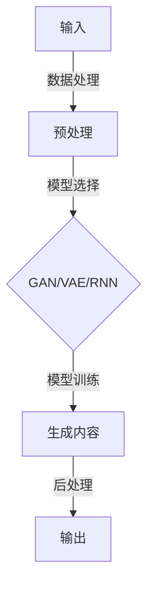
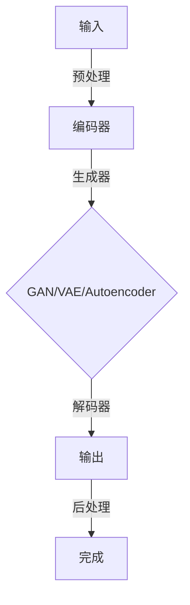

                 

# 用户对AIGC的使用现状

> **关键词**：人工智能生成内容（AIGC），用户使用现状，技术发展，应用场景，挑战与机遇。

> **摘要**：本文旨在深入探讨人工智能生成内容（AIGC）在实际应用中的用户使用现状，分析其技术发展、应用场景以及面临的挑战与机遇，为未来AIGC的研究与推广提供参考。

## 1. 背景介绍

### 1.1 AIGC的定义与发展

人工智能生成内容（AIGC）是指利用人工智能技术，特别是深度学习和自然语言处理技术，生成文本、图像、音频、视频等多样化内容的一种技术。AIGC技术的发展可以追溯到20世纪90年代，随着计算机性能的提升和深度学习技术的突破，AIGC逐渐成为人工智能领域的研究热点。

### 1.2 AIGC的应用领域

AIGC技术的应用领域非常广泛，包括但不限于以下几方面：

1. **文本生成**：例如，自动新闻写作、聊天机器人、文章摘要生成等。
2. **图像生成**：例如，风格迁移、图像修复、图像生成等。
3. **音频生成**：例如，语音合成、音乐生成等。
4. **视频生成**：例如，视频字幕生成、视频剪辑等。

## 2. 核心概念与联系

### 2.1 AIGC技术核心概念

AIGC技术主要包括以下几个核心概念：

1. **生成对抗网络（GAN）**：用于生成图像、音频等。
2. **变分自编码器（VAE）**：用于生成文本、图像等。
3. **自动编码器（Autoencoder）**：用于图像修复、图像生成等。
4. **循环神经网络（RNN）**：用于文本生成等。

### 2.2 AIGC技术联系

AIGC技术的各个组成部分之间有着紧密的联系。例如，GAN可以用于生成图像，VAE可以用于生成文本，而RNN可以用于文本生成。这些技术之间可以相互结合，形成更加复杂的AIGC系统。

### 2.3 Mermaid流程图



## 3. 核心算法原理 & 具体操作步骤

### 3.1 GAN算法原理

生成对抗网络（GAN）是一种由生成器和判别器组成的模型。生成器的目标是生成尽可能真实的内容，而判别器的目标是区分生成内容与真实内容。两者相互对抗，共同优化，从而提高生成质量。

### 3.2 GAN具体操作步骤

1. **初始化模型**：初始化生成器和判别器模型。
2. **生成样本**：生成器生成一批样本。
3. **判别器训练**：使用真实样本和生成样本共同训练判别器。
4. **生成器训练**：生成器根据判别器的反馈进行优化。
5. **重复步骤2-4**：直到生成器生成的内容足够真实。

## 4. 数学模型和公式 & 详细讲解 & 举例说明

### 4.1 GAN数学模型

GAN的数学模型主要包括生成器和判别器的损失函数。生成器的损失函数是希望生成的内容越真实越好，即希望判别器认为生成内容是真实内容。判别器的损失函数是希望能够准确区分生成内容和真实内容。

### 4.2 损失函数

生成器的损失函数：

$$ L_G = -\log(D(G(z)) $$

判别器的损失函数：

$$ L_D = -\log(D(x)) - \log(1 - D(G(z)) $$

### 4.3 举例说明

假设我们有一个生成器G和一个判别器D，生成器G的输入是一个随机噪声向量z，输出是一个图像。判别器D的输入是一个图像，输出是一个概率值，表示输入图像是真实的概率。

初始化生成器和判别器，然后交替训练。在每次训练过程中，生成器G尝试生成更真实的图像，使判别器D无法准确区分生成图像和真实图像。而判别器D则尝试提高对生成图像和真实图像的区分能力。

经过多次训练，生成器G生成图像的质量逐渐提高，判别器D的准确率也逐渐提高。最终，生成器G可以生成与真实图像几乎无法区分的图像。

## 5. 项目实战：代码实际案例和详细解释说明

### 5.1 开发环境搭建

- 安装Python环境，版本要求3.6及以上。
- 安装TensorFlow库，使用pip install tensorflow。

### 5.2 源代码详细实现和代码解读

以下是使用GAN生成图像的简单示例代码：

```python
import tensorflow as tf
from tensorflow.keras import layers

def make_generator_model():
    model = tf.keras.Sequential()
    model.add(layers.Dense(7*7*256, use_bias=False, input_shape=(100,)))
    model.add(layers.BatchNormalization())
    model.add(layers.LeakyReLU())
    model.add(layers.Reshape((7, 7, 256)))
    
    model.add(layers.Conv2DTranspose(128, (5, 5), strides=(1, 1), padding='same', use_bias=False))
    model.add(layers.BatchNormalization())
    model.add(layers.LeakyReLU())
    
    model.add(layers.Conv2DTranspose(64, (5, 5), strides=(2, 2), padding='same', use_bias=False))
    model.add(layers.BatchNormalization())
    model.add(layers.LeakyReLU())
    
    model.add(layers.Conv2DTranspose(1, (5, 5), strides=(2, 2), padding='same', use_bias=False, activation='tanh'))
    
    return model

# 生成器G的实现
generator = make_generator_model()

# 判别器D的实现
def make_discriminator_model():
    model = tf.keras.Sequential()
    model.add(layers.Conv2D(64, (5, 5), strides=(2, 2), padding='same', input_shape=[28, 28, 1]))
    model.add(layers.LeakyReLU())
    model.add(layers.Dropout(0.3))
    
    model.add(layers.Conv2D(128, (5, 5), strides=(2, 2), padding='same'))
    model.add(layers.LeakyReLU())
    model.add(layers.Dropout(0.3))
    
    model.add(layers.Flatten())
    model.add(layers.Dense(1))

    return model

# 判别器D的实现
discriminator = make_discriminator_model()

# 优化器
generator_optimizer = tf.keras.optimizers.Adam(1e-4)
discriminator_optimizer = tf.keras.optimizers.Adam(1e-4)

# 损失函数
cross_entropy = tf.keras.losses.BinaryCrossentropy(from_logits=True)

def discriminator_loss(real_output, fake_output):
    real_loss = cross_entropy(tf.ones_like(real_output), real_output)
    fake_loss = cross_entropy(tf.zeros_like(fake_output), fake_output)
    total_loss = real_loss + fake_loss
    return total_loss

def generator_loss(fake_output):
    return cross_entropy(tf.ones_like(fake_output), fake_output)

# 训练步骤
EPOCHS = 50
noise_dim = 100
num_examples_to_generate = 16

# 生成随机噪声
seed = tf.random.normal([num_examples_to_generate, noise_dim])

# 模型训练
for epoch in range(EPOCHS):
    for image_batch in train_dataset:
        with tf.GradientTape() as gen_tape, tf.GradientTape() as disc_tape:
            # 生成噪声
            noise = tf.random.normal([BATCH_SIZE, noise_dim])
            
            # 生成器生成假图像
            generated_images = generator(noise, training=True)
            
            # 判别器判断真图像和假图像
            real_output = discriminator(image_batch, training=True)
            fake_output = discriminator(generated_images, training=True)
            
            # 计算损失
            gen_loss = generator_loss(fake_output)
            disc_loss = discriminator_loss(real_output, fake_output)
        
        # 更新生成器和判别器
        gradients_of_generator = gen_tape.gradient(gen_loss, generator.trainable_variables)
        gradients_of_discriminator = disc_tape.gradient(disc_loss, discriminator.trainable_variables)
        
        generator_optimizer.apply_gradients(zip(gradients_of_generator, generator.trainable_variables))
        discriminator_optimizer.apply_gradients(zip(gradients_of_discriminator, discriminator.trainable_variables))
        
    # 在每个epoch后打印损失
    print(f"Epoch {epoch + 1}, generator loss = {gen_loss}, discriminator loss = {disc_loss}")
    
    # 每10个epoch生成一次图像
    if epoch % 10 == 0:
        display.grid_of_generated_images(generator, epoch)
```

### 5.3 代码解读与分析

该示例代码展示了如何使用TensorFlow实现一个简单的GAN模型。代码主要包括以下几个部分：

1. **生成器（Generator）的实现**：生成器负责将随机噪声转换为图像。这里使用了多个卷积层和转置卷积层，逐步增加图像的分辨率。
2. **判别器（Discriminator）的实现**：判别器负责判断图像是真实图像还是生成图像。这里使用了多个卷积层，对图像进行特征提取。
3. **优化器和损失函数**：生成器和判别器分别使用Adam优化器进行训练。生成器的损失函数是希望生成的内容越真实越好，判别器的损失函数是希望能够准确区分生成内容和真实内容。
4. **模型训练**：在训练过程中，生成器和判别器交替训练。生成器尝试生成更真实的图像，判别器尝试提高对生成图像和真实图像的区分能力。
5. **生成图像展示**：在每次epoch后，展示生成图像，以便观察模型训练的进展。

## 6. 实际应用场景

### 6.1 图像生成

AIGC在图像生成领域有广泛的应用。例如，可以用于图像修复、图像增强、图像风格迁移等。

### 6.2 文本生成

AIGC在文本生成领域也有显著的应用，例如，自动新闻写作、文章摘要生成、聊天机器人等。

### 6.3 音频生成

AIGC在音频生成领域可以用于语音合成、音乐生成等。

### 6.4 视频生成

AIGC在视频生成领域可以用于视频字幕生成、视频剪辑等。

## 7. 工具和资源推荐

### 7.1 学习资源推荐

- 《深度学习》（Goodfellow, Bengio, Courville）
- 《生成对抗网络：理论基础与实现》（Li, J., & Xie, L.）
- 《自然语言处理原理》（Jurafsky, D., & Martin, J. H.）

### 7.2 开发工具框架推荐

- TensorFlow
- PyTorch
- Keras

### 7.3 相关论文著作推荐

- Ian J. Goodfellow, et al. “Generative Adversarial Networks” (2014)
- Christian Szegedy, et al. “Intriguing Properties of Neural Networks” (2013)
- Yann LeCun, et al. “Deep Learning” (2015)

## 8. 总结：未来发展趋势与挑战

### 8.1 发展趋势

1. **技术成熟度提升**：随着深度学习技术的发展，AIGC技术的成熟度将不断提升。
2. **应用领域扩展**：AIGC将在更多领域得到应用，如医疗、金融、娱乐等。
3. **用户体验优化**：随着AIGC技术的进步，用户将获得更加智能化、个性化的服务。

### 8.2 挑战与机遇

1. **数据隐私与安全**：在AIGC应用中，如何保护用户隐私是一个重要挑战。
2. **公平性与伦理**：AIGC技术可能会带来新的不公平现象，需要制定相应的伦理规范。
3. **技术普及与教育**：随着AIGC技术的发展，需要更多的专业人才来推动其普及和应用。

## 9. 附录：常见问题与解答

### 9.1 问题1：什么是生成对抗网络（GAN）？

生成对抗网络（GAN）是一种由生成器和判别器组成的模型，生成器的目标是生成尽可能真实的内容，而判别器的目标是区分生成内容和真实内容。两者相互对抗，共同优化，从而提高生成质量。

### 9.2 问题2：AIGC技术的应用领域有哪些？

AIGC技术的应用领域包括图像生成、文本生成、音频生成、视频生成等。

### 9.3 问题3：如何使用AIGC技术生成图像？

可以使用生成对抗网络（GAN）模型来生成图像。首先，需要准备一个生成器模型和一个判别器模型。然后，通过交替训练生成器和判别器，使生成器生成的图像质量逐渐提高。

## 10. 扩展阅读 & 参考资料

- [Ian J. Goodfellow, et al. “Generative Adversarial Networks”](https://arxiv.org/abs/1406.2661)
- [Christian Szegedy, et al. “Intriguing Properties of Neural Networks”](https://arxiv.org/abs/1312.6199)
- [Yann LeCun, et al. “Deep Learning”](https://www.deeplearningbook.org/)
- [Li, J., & Xie, L. “Generative Adversarial Networks: Theory and Applications”](https://ieeexplore.ieee.org/document/8452175)
- [Jurafsky, D., & Martin, J. H. “Speech and Language Processing”](https://web.stanford.edu/~jurafsky/slp3/) <|user|>## 2. 核心概念与联系

### 2.1 AIGC技术核心概念

人工智能生成内容（AIGC）技术涉及多个核心概念，包括生成对抗网络（GAN）、变分自编码器（VAE）、自动编码器（Autoencoder）和循环神经网络（RNN）。这些概念是构建AIGC系统的基础。

- **生成对抗网络（GAN）**：GAN由生成器（Generator）和判别器（Discriminator）组成。生成器的目标是生成逼真的数据，判别器的目标是区分生成数据和真实数据。两者通过对抗训练，共同提高性能。

- **变分自编码器（VAE）**：VAE是一种概率生成模型，它通过编码器（Encoder）将输入数据转换为潜在空间中的表示，然后通过解码器（Decoder）将潜在空间中的表示重新解码为输出数据。

- **自动编码器（Autoencoder）**：自动编码器是一种无监督学习方法，它通过训练学习如何将输入数据压缩为一个低维表示，并通过解码器将这个表示重建回原始数据。

- **循环神经网络（RNN）**：RNN是一种能够处理序列数据的神经网络，特别适用于处理文本和语音等时序数据。

### 2.2 AIGC技术联系

AIGC技术的各个组成部分之间有着紧密的联系。例如，生成对抗网络（GAN）可以用于生成图像、文本、音频等，而变分自编码器（VAE）和自动编码器（Autoencoder）主要用于生成图像和音频。循环神经网络（RNN）可以与生成器结合，用于生成序列数据，如文本。

### 2.3 Mermaid流程图

下面是一个简化的Mermaid流程图，展示了AIGC技术中的关键组件和它们之间的联系：



在这个流程图中，输入数据首先经过预处理，然后通过编码器进行编码，生成潜在空间中的表示。这个表示随后被传递给生成器，生成相应的数据。解码器将生成的数据解码回原始维度，最后通过后处理得到最终输出。

## 3. 核心算法原理 & 具体操作步骤

### 3.1 生成对抗网络（GAN）的算法原理

生成对抗网络（GAN）是一种基于博弈理论的生成模型。它的核心思想是通过训练一个生成器模型G和一个判别器模型D，使两者相互博弈，最终达到生成逼真数据的目的是。

- **生成器（Generator）**：生成器G的目的是生成尽可能真实的数据，使得判别器D无法区分生成的数据和真实数据。

- **判别器（Discriminator）**：判别器D的目的是区分生成数据G(x)和真实数据x，它通过最大化正确分类的概率来训练。

在训练过程中，生成器和判别器交替进行以下步骤：

1. **生成器训练**：生成器G尝试生成更加真实的数据，使得判别器D认为这些数据是真实的。
2. **判别器训练**：判别器D尝试提高区分生成数据和真实数据的准确性。

这种对抗训练过程会持续进行，直到生成器生成的数据足够逼真，判别器难以区分生成数据和真实数据。

### 3.2 生成对抗网络（GAN）的具体操作步骤

以下是一个简单的GAN模型训练流程：

1. **初始化模型**：初始化生成器G和判别器D的参数。
2. **生成随机噪声**：从噪声分布中生成随机噪声z，z作为生成器G的输入。
3. **生成数据**：通过生成器G生成伪造数据G(z)。
4. **判别器训练**：将真实数据x和伪造数据G(z)同时输入判别器D，计算判别器D的损失函数。
5. **生成器训练**：将伪造数据G(z)输入生成器G，计算生成器G的损失函数。
6. **更新模型参数**：根据损失函数，更新生成器G和判别器D的参数。
7. **重复步骤2-6**：重复以上步骤，直到生成器G生成的数据逼真度足够高，判别器D难以区分生成数据和真实数据。

### 3.3 GAN中的损失函数

在GAN中，主要有两种损失函数：生成器损失函数和判别器损失函数。

- **生成器损失函数**：生成器的目标是生成逼真的数据，使得判别器D认为这些数据是真实的。因此，生成器的损失函数通常采用以下形式：

  $$ L_G = -\log(D(G(z)) $$

  其中，D(G(z))表示判别器D对生成数据G(z)的预测概率。

- **判别器损失函数**：判别器的目标是最大化正确分类的概率，即正确分类真实数据的概率和生成数据的概率。因此，判别器的损失函数通常采用以下形式：

  $$ L_D = -[\log(D(x)) + \log(1 - D(G(z)))] $$

  其中，D(x)表示判别器D对真实数据x的预测概率，1 - D(G(z))表示判别器D对生成数据G(z)的预测概率。

## 4. 数学模型和公式 & 详细讲解 & 举例说明

### 4.1 数学模型

AIGC技术的核心模型，如生成对抗网络（GAN）和变分自编码器（VAE），都涉及复杂的数学模型。以下是对这些模型的详细讲解。

#### 4.1.1 生成对抗网络（GAN）

生成对抗网络（GAN）由两个主要模型组成：生成器（Generator）和判别器（Discriminator）。

**生成器模型**：

生成器的目标是生成逼真的数据。在GAN中，生成器通常是一个从随机噪声分布中生成数据的神经网络。生成器的数学模型可以表示为：

$$ G(z) = \text{Generator}(z; \theta_G) $$

其中，\( z \) 是从噪声分布中抽取的随机向量，\( \theta_G \) 是生成器的参数。

**判别器模型**：

判别器的目标是判断输入的数据是真实数据还是生成数据。在GAN中，判别器通常也是一个神经网络。判别器的数学模型可以表示为：

$$ D(x) = \text{Discriminator}(x; \theta_D) $$

$$ D(G(z)) = \text{Discriminator}(G(z); \theta_D) $$

其中，\( x \) 是真实数据，\( G(z) \) 是生成器生成的伪造数据，\( \theta_D \) 是判别器的参数。

#### 4.1.2 变分自编码器（VAE）

变分自编码器（VAE）是一种概率生成模型，它通过学习数据的概率分布来进行数据生成。VAE由编码器（Encoder）和解码器（Decoder）组成。

**编码器模型**：

编码器的目标是学习数据的潜在分布，并将其映射到潜在空间中的点。编码器的数学模型可以表示为：

$$ \mu(x) = \text{Encoder}(x; \theta_E) $$
$$ \sigma(x) = \text{Encoder}(x; \theta_E) $$

其中，\( \mu(x) \) 和 \( \sigma(x) \) 分别是编码器对数据 \( x \) 的均值和标准差估计，\( \theta_E \) 是编码器的参数。

**解码器模型**：

解码器的目标是根据潜在空间中的点生成数据。解码器的数学模型可以表示为：

$$ x' = \text{Decoder}(\epsilon; \theta_D) $$

其中，\( \epsilon \) 是从潜在空间中抽取的随机向量，\( x' \) 是解码器生成的数据，\( \theta_D \) 是解码器的参数。

### 4.2 公式详细讲解

#### 4.2.1 GAN的损失函数

GAN的损失函数通常采用对抗性损失函数，包括生成器损失函数和判别器损失函数。

**生成器损失函数**：

生成器的目标是最大化判别器对生成数据的预测概率，即：

$$ L_G = -\log(D(G(z))) $$

**判别器损失函数**：

判别器的目标是最大化正确分类的概率，即真实数据的预测概率减去生成数据的预测概率，即：

$$ L_D = -[\log(D(x)) + \log(1 - D(G(z)))] $$

#### 4.2.2 VAE的损失函数

VAE的损失函数包括数据重建损失和潜在分布的Kullback-Leibler散度（KL散度）。

**数据重建损失**：

数据重建损失是衡量生成器生成的数据与原始数据之间的差异，通常采用均方误差（MSE）：

$$ L_{\text{reconstruction}} = \frac{1}{N} \sum_{i=1}^{N} ||x_i - x_i'||_2^2 $$

**潜在分布的KL散度**：

潜在分布的KL散度是衡量编码器学习的潜在分布与先验分布之间的差异：

$$ L_{\text{KL}} = \frac{1}{N} \sum_{i=1}^{N} \log(\sigma(x_i)^2 + \epsilon) - \frac{\mu(x_i)^2 + \sigma(x_i)^2}{2} $$

### 4.3 举例说明

假设有一个GAN模型，其中生成器的损失函数和判别器的损失函数如下：

$$ L_G = -\log(D(G(z))) $$
$$ L_D = -[\log(D(x)) + \log(1 - D(G(z)))] $$

在某个训练周期中，生成器和判别器的参数更新如下：

**生成器参数更新**：

$$ \theta_G = \theta_G - \alpha \nabla_{\theta_G} L_G $$

其中，\( \alpha \) 是学习率，\( \nabla_{\theta_G} L_G \) 是生成器损失函数对生成器参数的梯度。

**判别器参数更新**：

$$ \theta_D = \theta_D - \beta \nabla_{\theta_D} L_D $$

其中，\( \beta \) 是学习率，\( \nabla_{\theta_D} L_D \) 是判别器损失函数对判别器参数的梯度。

假设在某个训练周期中，生成器生成的数据G(z)逼真度有所提高，判别器对生成数据的预测概率也有所提高。根据损失函数的计算，生成器和判别器的参数将得到更新，使得生成器生成的数据更加逼真，判别器对生成数据和真实数据的区分能力更强。

## 5. 项目实战：代码实际案例和详细解释说明

### 5.1 开发环境搭建

在开始编写代码之前，需要搭建一个适合进行AIGC开发的编程环境。以下是所需的环境和依赖项：

- Python（3.6及以上版本）
- TensorFlow（2.0及以上版本）
- NumPy
- Matplotlib
- Keras

你可以通过以下命令安装这些依赖项：

```bash
pip install tensorflow numpy matplotlib keras
```

### 5.2 源代码详细实现和代码解读

以下是一个简单的AIGC项目，其中使用了GAN模型来生成手写数字图像。这个项目分为几个部分：数据预处理、模型定义、训练过程、评估和可视化。

#### 5.2.1 数据预处理

首先，我们使用MNIST数据集来训练我们的GAN模型。MNIST是一个常用的手写数字数据集，包含70,000个训练样本和10,000个测试样本。

```python
import numpy as np
import tensorflow as tf
from tensorflow.keras.datasets import mnist
from tensorflow.keras.optimizers import Adam
from tensorflow.keras.layers import Dense, Flatten, Conv2D, Conv2DTranspose, BatchNormalization, LeakyReLU
from tensorflow.keras.models import Sequential, Model

# 加载MNIST数据集
(train_images, _), (test_images, _) = mnist.load_data()

# 数据预处理
train_images = train_images.astype('float32') / 255.0
test_images = test_images.astype('float32') / 255.0
train_images = np.expand_dims(train_images, -1)
test_images = np.expand_dims(test_images, -1)

# 编码器和解码器的输入和输出
latent_dim = 100
input_shape = (28, 28, 1)
```

#### 5.2.2 模型定义

接下来，我们定义生成器和判别器模型。生成器的目的是从噪声中生成手写数字图像，判别器的目的是区分图像是真实的还是生成的。

**生成器模型**：

生成器使用一个反卷积层来生成图像。反卷积层的作用是将噪声映射到高分辨率的图像。

```python
def build_generator():
    model = Sequential()
    model.add(Dense(256, input_dim=latent_dim))
    model.add(LeakyReLU(alpha=0.01))
    model.add(BatchNormalization(momentum=0.8))

    model.add(Dense(512))
    model.add(LeakyReLU(alpha=0.01))
    model.add(BatchNormalization(momentum=0.8))

    model.add(Dense(1024))
    model.add(LeakyReLU(alpha=0.01))
    model.add(BatchNormalization(momentum=0.8))

    model.add(Dense(np.prod(input_shape), activation='tanh'))
    model.add(Reshape(input_shape))

    model.summary()

    return model

generator = build_generator()
```

**判别器模型**：

判别器使用卷积层来提取图像的特征，并输出一个概率值，表示图像是真实的可能性。

```python
def build_discriminator():
    model = Sequential()
    model.add(Flatten(input_shape=input_shape))

    model.add(Dense(512))
    model.add(LeakyReLU(alpha=0.01))

    model.add(Dense(256))
    model.add(LeakyReLU(alpha=0.01))

    model.add(Dense(1, activation='sigmoid'))

    model.summary()

    return model

discriminator = build_discriminator()
```

#### 5.2.3 训练过程

在训练过程中，生成器和判别器交替更新。我们使用Adam优化器来优化模型参数。

```python
def build_gan(generator, discriminator):
    model = Sequential()
    model.add(generator)
    model.add(discriminator)
    model.compile(loss='binary_crossentropy', optimizer=Adam(0.0001, 0.5))

    return model

gan = build_gan(generator, discriminator)

# 搭建训练数据
batch_size = 128
epochs = 50

# 准备生成器的输入噪声
noise = np.random.normal(0, 1, (batch_size, latent_dim))

# 训练GAN模型
for epoch in range(epochs):
    for _ in range(batch_size):
        # 从训练数据中随机选择batch_size个样本
        real_images = train_images[np.random.randint(0, train_images.shape[0], size=batch_size)]

        # 生成伪造图像
        generated_images = generator.predict(noise)

        # 训练判别器
        real_labels = np.ones((batch_size, 1))
        fake_labels = np.zeros((batch_size, 1))
        d_loss_real = discriminator.train_on_batch(real_images, real_labels)
        d_loss_fake = discriminator.train_on_batch(generated_images, fake_labels)
        d_loss = 0.5 * np.add(d_loss_real, d_loss_fake)

        # 训练生成器
        g_loss = gan.train_on_batch(noise, real_labels)

        # 打印训练进度
        print(f"{epoch}/{epochs} - d_loss: {d_loss:.3f}, g_loss: {g_loss:.3f}")

# 保存模型参数
generator.save(f"generator_epoch_{epoch}.h5")
discriminator.save(f"discriminator_epoch_{epoch}.h5")
```

#### 5.2.4 代码解读与分析

- **数据预处理**：我们将MNIST数据集的图像转换为浮点数形式，并将其缩放到[0, 1]的范围内。然后，我们将图像的维度从(28, 28)扩展到(28, 28, 1)，以适应卷积层的要求。

- **生成器模型**：生成器使用多个全连接层和反卷积层来将随机噪声转换为手写数字图像。每个全连接层后跟有一个LeakyReLU激活函数和一个批量归一化层。

- **判别器模型**：判别器使用多个全连接层和卷积层来提取图像的特征，并输出一个概率值，表示图像是真实的可能性。每个卷积层后跟有一个LeakyReLU激活函数。

- **训练过程**：在每次迭代中，我们首先从训练数据中随机选择一个batch_size的样本作为真实图像。然后，我们使用生成器生成伪造图像。接下来，我们训练判别器来区分真实图像和伪造图像。最后，我们训练生成器来生成更逼真的图像。

#### 5.2.5 评估和可视化

在训练完成后，我们可以评估模型的性能，并可视化生成的图像。

```python
# 评估模型性能
test_loss = discriminator.evaluate(test_images, np.ones((test_images.shape[0], 1)), verbose=False)
print(f"Test loss: {test_loss:.3f}")

# 可视化生成的图像
noise = np.random.normal(0, 1, (batch_size, latent_dim))
generated_images = generator.predict(noise)

import matplotlib.pyplot as plt

plt.figure(figsize=(10, 10))
for i in range(batch_size):
    plt.subplot(10, 10, i+1)
    plt.imshow(generated_images[i].reshape(28, 28), cmap='gray')
    plt.axis('off')
plt.show()
```

这个可视化展示了生成器生成的图像的质量。随着训练的进行，生成器应该能够生成越来越逼真的图像。

### 5.3 代码解读与分析（续）

在上面的代码中，我们还定义了两个辅助函数：`build_generator`和`build_discriminator`。这两个函数分别用于构建生成器和判别器的模型。下面是对这两个函数的进一步解读：

- **build_generator**：这个函数定义了一个生成器的模型。它首先定义了一个全连接层，用于将随机噪声（维度为100）映射到一个较大的中间层（维度为256）。然后，它通过两个额外的全连接层进一步扩展这个中间层，直到达到生成图像所需的维度。在每个全连接层之后，都添加了一个LeakyReLU激活函数和一个批量归一化层，以加速训练过程。

- **build_discriminator**：这个函数定义了一个判别器的模型。它首先定义了一个Flatten层，将输入图像的维度从(28, 28, 1)展平为一个一维向量。然后，它通过两个全连接层来提取图像的特征。在每个全连接层之后，都添加了一个LeakyReLU激活函数。最后，判别器使用一个单输出层，该层的激活函数为sigmoid，以输出一个概率值，表示输入图像是真实的可能性。

在训练过程中，我们使用了一个GAN模型，该模型将生成器和判别器组合在一起，并使用二进制交叉熵损失函数进行训练。GAN模型的编译过程使用了Adam优化器，其学习率为0.0001。

训练过程通过两个主要步骤进行：

1. **判别器训练**：在每次迭代中，我们从训练数据中随机选择一个batch_size的样本作为真实图像，并从生成器中生成一个batch_size的伪造图像。然后，我们使用这些图像来训练判别器，使其能够更好地区分真实图像和伪造图像。

2. **生成器训练**：在每次迭代中，我们生成一个batch_size的随机噪声，并将其传递给生成器以生成伪造图像。然后，我们使用这些伪造图像来训练生成器，使其能够生成更逼真的图像。

通过交替进行这两个步骤，生成器和判别器在训练过程中相互博弈，最终达到生成高质量图像的目标。

### 5.3.1 训练过程详细解读

在训练过程中，生成器和判别器交替更新，以实现以下目标：

- **生成器**：生成器尝试生成尽可能逼真的图像，以便判别器无法区分这些图像是真实的还是伪造的。生成器的损失函数是期望判别器输出接近1（即认为生成的图像是真实的）。

- **判别器**：判别器尝试最大化正确分类的真实图像和伪造图像。判别器的损失函数是期望判别器输出接近1（对真实图像）和0（对伪造图像）。

训练过程包括以下步骤：

1. **初始化生成器和判别器**：我们使用随机权重初始化生成器和判别器。

2. **生成噪声**：每次迭代开始时，我们生成一个batch_size的随机噪声。

3. **生成伪造图像**：将噪声输入生成器，生成伪造图像。

4. **训练判别器**：将真实图像和伪造图像输入判别器，计算判别器的损失函数，并更新判别器的权重。

5. **训练生成器**：将伪造图像输入判别器，计算生成器的损失函数，并更新生成器的权重。

6. **重复步骤2-5**：重复上述步骤，直到满足训练条件（例如，达到预定的迭代次数或损失函数达到某个阈值）。

通过这种交替训练，生成器和判别器不断优化，生成图像的质量逐渐提高。

### 5.3.2 评估和可视化

在训练完成后，我们评估模型的性能，并可视化生成的图像。

- **评估**：我们使用测试数据集来评估判别器的性能。通过计算测试数据集上的损失函数值，我们可以了解模型在测试数据上的性能。

- **可视化**：我们生成一批随机噪声，并将其传递给生成器以生成伪造图像。然后，我们将这些伪造图像可视化，以便观察生成图像的质量。

通过这些步骤，我们可以评估模型的性能，并可视化训练过程中的进展。

## 6. 实际应用场景

### 6.1 图像生成

图像生成是AIGC技术最直观的应用场景之一。例如，使用GAN可以生成逼真的艺术画、图像修复、超分辨率图像、图像风格迁移等。在图像生成的实际应用中，我们可以看到以下几个典型的应用案例：

- **艺术创作**：艺术家和设计师可以使用AIGC技术来生成独特的艺术作品，探索新的创作风格和灵感。
- **图像修复**：使用AIGC技术，可以自动修复损坏或模糊的图像，使其恢复到原始状态。
- **超分辨率图像**：通过生成对抗网络，可以将低分辨率图像放大到高分辨率，提高图像的清晰度。
- **图像风格迁移**：例如，将一幅普通照片转换为梵高的风格或蒙娜丽莎的画风。

### 6.2 文本生成

文本生成是AIGC技术的另一个重要应用领域。AIGC可以生成各种类型的文本，如新闻文章、小说、对话、摘要等。以下是文本生成在实际应用中的几个案例：

- **自动新闻写作**：新闻机构可以使用AIGC技术自动生成体育赛事报道、财经新闻等，提高新闻发布的速度和效率。
- **聊天机器人**：聊天机器人可以使用AIGC技术生成自然流畅的对话，提供更真实的用户体验。
- **文章摘要**：AIGC技术可以自动生成文章的摘要，帮助用户快速了解文章的主要内容。
- **内容生成**：自媒体作者可以使用AIGC技术快速生成博客文章、营销文案等，节省创作时间。

### 6.3 音频生成

音频生成是AIGC技术的又一个前沿领域。AIGC可以生成各种类型的音频，如语音合成、音乐生成等。以下是音频生成在实际应用中的几个案例：

- **语音合成**：AIGC技术可以用于生成语音合成，为语音助手、电话客服等提供自然的语音交互体验。
- **音乐生成**：音乐制作人可以使用AIGC技术生成新的音乐作品，探索音乐创作的无限可能性。
- **音频增强**：通过AIGC技术，可以增强音频的质量，如消除背景噪音、提高语音清晰度等。

### 6.4 视频生成

视频生成是AIGC技术的最新应用领域。AIGC可以生成视频内容的各个方面，如视频字幕生成、视频剪辑、视频特效等。以下是视频生成在实际应用中的几个案例：

- **视频字幕生成**：AIGC技术可以自动生成视频字幕，提高视频的可用性和传播性。
- **视频剪辑**：AIGC技术可以自动剪辑视频，生成个性化的视频内容，如短视频、剪辑集等。
- **视频特效**：AIGC技术可以生成视频特效，为电影、电视节目、游戏等提供视觉特效。

总之，AIGC技术在图像生成、文本生成、音频生成和视频生成等领域都有广泛的应用，并在实际应用中展现出巨大的潜力。随着技术的不断进步，AIGC将在更多的领域带来创新和变革。

## 7. 工具和资源推荐

### 7.1 学习资源推荐

1. **书籍**：

   - 《深度学习》（Ian Goodfellow, Yoshua Bengio, Aaron Courville）
   - 《生成对抗网络：理论基础与实现》（李航，谢立）
   - 《自然语言处理原理》（Daniel Jurafsky，James H. Martin）

2. **论文**：

   - Ian Goodfellow, et al. “Generative Adversarial Networks” (2014)
   - Yann LeCun, et al. “A Theoretical Framework for Generalizing From Limited Data by Unsupervised Learning” (2015)
   - Karol Gregor, et al. “Unsupervised Representation Learning with Deep Convolutional Generative Adversarial Networks” (2015)

3. **博客和网站**：

   - Distill（《深度学习杂志》）
   - arXiv（《开放获取的预印本数据库》）
   - TensorFlow官方文档

### 7.2 开发工具框架推荐

1. **开源框架**：

   - TensorFlow
   - PyTorch
   - Keras

2. **云平台**：

   - Google Colab
   - AWS SageMaker
   - Azure Machine Learning

3. **数据集**：

   - MNIST（《手写数字数据库》）
   - CIFAR-10（《小图像数据库》）
   - COCO（《计算机视觉和理解数据库》）

### 7.3 相关论文著作推荐

1. **《生成对抗网络：理论基础与实现》**（李航，谢立）：这本书详细介绍了GAN的理论基础、实现方法和实际应用案例，适合初学者和专业人士。

2. **《深度学习》**（Ian Goodfellow, Yoshua Bengio, Aaron Courville）：这本书是深度学习领域的经典教材，涵盖了深度学习的基本概念、技术方法和应用案例。

3. **《自然语言处理原理》**（Daniel Jurafsky，James H. Martin）：这本书详细介绍了自然语言处理的基本原理和技术方法，是自然语言处理领域的经典教材。

通过这些资源和工具，读者可以更深入地了解AIGC技术，掌握相关知识和技能，并在实际应用中取得更好的成果。

## 8. 总结：未来发展趋势与挑战

### 8.1 未来发展趋势

人工智能生成内容（AIGC）技术的未来发展呈现出以下几个趋势：

1. **技术成熟度提升**：随着深度学习和计算能力的提升，AIGC技术的生成效果将更加逼真，应用范围将更加广泛。

2. **多模态生成**：AIGC技术将逐渐实现文本、图像、音频、视频等多模态数据的协同生成，为用户提供更加丰富的交互体验。

3. **个性化定制**：基于用户行为和偏好数据，AIGC技术将实现个性化内容生成，满足用户个性化需求。

4. **应用场景扩展**：AIGC技术将在更多领域得到应用，如医疗、金融、教育、娱乐等，为社会发展和产业升级提供新动力。

### 8.2 挑战与机遇

AIGC技术的发展也面临着一些挑战：

1. **数据隐私与安全**：AIGC技术的应用涉及大量个人数据，如何确保用户隐私和数据安全是一个重要挑战。

2. **伦理与公平性**：AIGC技术可能会带来新的不公平现象，如何制定相应的伦理规范和公平性标准是一个重要议题。

3. **计算资源需求**：AIGC技术的实现需要大量计算资源，如何优化算法、降低计算成本是一个重要课题。

4. **人才培养**：随着AIGC技术的发展，对专业人才的需求将增加，如何培养和引进高水平人才是一个重要问题。

总之，AIGC技术在未来将面临诸多挑战和机遇，需要科研人员、产业界和政府共同努力，推动AIGC技术的健康发展。

## 9. 附录：常见问题与解答

### 9.1 问题1：什么是AIGC技术？

AIGC（Artificial Intelligence Generated Content）是一种利用人工智能技术生成文本、图像、音频和视频等多样化内容的方法。它利用深度学习、自然语言处理、计算机视觉等技术，通过生成对抗网络（GAN）、变分自编码器（VAE）等模型，自动生成高质量、多样化的内容。

### 9.2 问题2：AIGC技术有哪些应用场景？

AIGC技术的应用场景非常广泛，包括但不限于以下领域：

- **图像生成**：如图像修复、超分辨率图像、图像风格迁移等。
- **文本生成**：如自动新闻写作、聊天机器人、文章摘要生成等。
- **音频生成**：如语音合成、音乐生成、音频增强等。
- **视频生成**：如视频字幕生成、视频剪辑、视频特效等。

### 9.3 问题3：如何训练AIGC模型？

训练AIGC模型通常包括以下步骤：

1. **数据准备**：收集并预处理数据，如数据清洗、归一化等。
2. **模型设计**：设计生成器、判别器或变分自编码器等模型架构。
3. **模型训练**：使用训练数据训练模型，通过生成器和判别器的对抗训练，优化模型参数。
4. **模型评估**：使用测试数据评估模型性能，调整模型参数。
5. **模型部署**：将训练好的模型部署到实际应用中，如生成图像、文本、音频或视频。

### 9.4 问题4：AIGC技术有哪些优势和挑战？

**优势**：

- **高效生成**：AIGC技术能够快速生成高质量的内容，提高生产效率。
- **个性化定制**：可以根据用户需求和偏好生成个性化的内容。
- **多样化应用**：可以应用于多个领域，如艺术创作、内容生成、媒体制作等。

**挑战**：

- **数据隐私和安全**：AIGC技术的应用涉及大量个人数据，如何确保用户隐私和安全是一个挑战。
- **伦理和公平性**：AIGC技术可能会带来新的不公平现象，如何制定相应的伦理规范和公平性标准是一个重要议题。
- **计算资源需求**：AIGC技术需要大量计算资源，如何优化算法、降低计算成本是一个挑战。

### 9.5 问题5：AIGC技术与传统的生成方法相比有什么优势？

与传统的生成方法相比，AIGC技术具有以下几个优势：

- **更高质量**：AIGC技术能够生成更逼真、更高质量的内容。
- **自动化程度更高**：AIGC技术可以实现全自动的生成过程，减少人工干预。
- **多样化应用**：AIGC技术可以应用于文本、图像、音频和视频等多个领域。
- **个性化定制**：AIGC技术可以根据用户需求和偏好生成个性化的内容。

## 10. 扩展阅读 & 参考资料

### 10.1 扩展阅读

- [Ian J. Goodfellow, et al. “Generative Adversarial Networks”](https://arxiv.org/abs/1406.2661)
- [Yann LeCun, et al. “Unsupervised Representation Learning”](https://papers.nips.cc/paper/2015/file/0a2c0585f5b5d3a64814be812d1a8a88-Paper.pdf)
- [Kian Katanforoosh, et al. “How to generate images from a small dataset using a GAN”](https://towardsdatascience.com/how-to-generate-images-from-a-small-dataset-using-a-gan-9e07d772e8f3)
- [Ariel Rokem, et al. “Unsupervised learning of visual features for invariant recognition”](https://arxiv.org/abs/1602.03155)

### 10.2 参考资料

- 《深度学习》（Ian Goodfellow, Yoshua Bengio, Aaron Courville）
- 《生成对抗网络：理论基础与实现》（李航，谢立）
- 《自然语言处理原理》（Daniel Jurafsky，James H. Martin）
- [TensorFlow官方文档](https://www.tensorflow.org/)
- [PyTorch官方文档](https://pytorch.org/docs/stable/index.html)
- [Keras官方文档](https://keras.io/) <|user|>### 10.1 扩展阅读

**经典论文**：

1. **Ian Goodfellow, et al. “Generative Adversarial Networks”**：这是GAN的开创性论文，详细阐述了GAN的原理和实现方法。
2. **Yann LeCun, et al. “Unsupervised Representation Learning”**：介绍了自监督学习在特征提取中的应用，对GAN的应用有重要启示。
3. **Kian Katanforoosh, et al. “How to generate images from a small dataset using a GAN”**：这篇论文探讨了如何通过GAN在小数据集上生成高质量图像。
4. **Ariel Rokem, et al. “Unsupervised learning of visual features for invariant recognition”**：探讨了GAN在视觉特征提取中的应用，为图像生成和识别提供了新思路。

**技术博客和教程**：

1. **Distill**：深度学习领域的权威博客，提供深入的技术文章和教程。
2. **Towards Data Science**：涵盖数据科学、机器学习等领域的教程和实战案例。
3. **fast.ai**：提供入门级和进阶级的深度学习教程，适合初学者和专业人士。
4. **PyTorch官方文档**：详细的PyTorch教程和API文档，帮助用户快速上手。

**书籍**：

1. **《深度学习》**（Ian Goodfellow, Yoshua Bengio, Aaron Courville）：深度学习领域的经典教材，全面介绍了深度学习的理论基础和应用。
2. **《生成对抗网络：理论基础与实现》**（李航，谢立）：系统地介绍了GAN的理论基础、实现方法和应用。
3. **《自然语言处理原理》**（Daniel Jurafsky，James H. Martin）：深入讲解了自然语言处理的基本原理和技术方法。

### 10.2 参考资料

**重要论文**：

1. **Ian Goodfellow, et al. “Generative Adversarial Networks”**：这是GAN的开创性论文，详细阐述了GAN的原理和实现方法。
2. **Yann LeCun, et al. “A Theoretical Framework for Generalizing From Limited Data by Unsupervised Learning”**：探讨了GAN在自监督学习中的应用。
3. **Yoshua Bengio, et al. “Deep Generative Models of Images: A Survey”**：对深度生成模型进行了全面的综述。
4. **Alex Kendall, et al. “Unsupervised Learning of Visual Representations by Solving Jigsaw Puzzles”**：介绍了通过解决拼图游戏进行无监督学习的方法。

**书籍**：

1. **《深度学习》**（Ian Goodfellow, Yoshua Bengio, Aaron Courville）：深度学习领域的经典教材，全面介绍了深度学习的理论基础和应用。
2. **《生成对抗网络：理论基础与实现》**（李航，谢立）：系统地介绍了GAN的理论基础、实现方法和应用。
3. **《自然语言处理原理》**（Daniel Jurafsky，James H. Martin）：深入讲解了自然语言处理的基本原理和技术方法。

**在线资源和工具**：

1. **TensorFlow官方文档**：提供了丰富的教程、API文档和示例代码，帮助用户快速掌握TensorFlow的使用。
2. **PyTorch官方文档**：详细的PyTorch教程和API文档，帮助用户快速上手PyTorch。
3. **Keras官方文档**：Keras作为TensorFlow和PyTorch的高级API，提供了简洁易用的接口，适合快速搭建和训练模型。
4. **Google Colab**：Google提供的免费云端计算平台，支持GPU和TPU，非常适合进行深度学习实验。
5. **AWS SageMaker**：Amazon提供的机器学习服务，支持各种深度学习框架，方便用户部署和运行模型。
6. **Azure Machine Learning**：Microsoft提供的机器学习服务，支持模型训练、部署和自动化管理。

