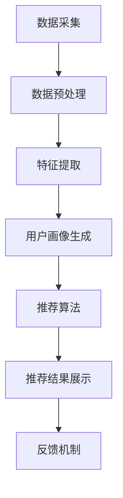

                 

### 文章标题

**用户画像与实时推荐的整合应用**

> **关键词：**用户画像、实时推荐、数据挖掘、机器学习、推荐系统、应用场景、技术框架、算法原理、代码实现、性能优化

**摘要：**本文将深入探讨用户画像与实时推荐系统的整合应用，分析其核心概念、算法原理和具体实现步骤。通过实际项目案例和详细解释，展示其在各领域的应用效果和优势，提供全面的工具和资源推荐，展望未来的发展趋势和挑战。

### 1. 背景介绍

在当今数字化时代，用户数据成为企业竞争的重要资源。通过对用户数据的深入挖掘和分析，企业可以更好地了解用户需求，提供个性化的推荐和服务。用户画像和实时推荐系统正是实现这一目标的关键技术手段。

**用户画像**是指通过对用户行为数据、偏好数据、社交数据等多维度数据的收集和分析，构建出一个反映用户特征和需求的数字模型。它可以帮助企业精准定位目标用户，制定个性化的营销策略。

**实时推荐**则是指根据用户当前的行为和兴趣，实时地为用户推荐相关的产品、内容或服务。实时推荐系统能够快速响应用户需求，提升用户体验和满意度。

用户画像与实时推荐系统的整合应用，使得企业能够在用户互动的每个环节提供个性化的推荐和服务，从而提高用户黏性和转化率。随着大数据和人工智能技术的不断发展，用户画像和实时推荐系统在电商、媒体、社交网络等众多领域得到了广泛应用。

### 2. 核心概念与联系

#### 2.1 用户画像的构建

用户画像的构建主要包括以下步骤：

1. **数据收集**：收集用户的基本信息（如性别、年龄、地理位置等）、行为数据（如浏览记录、购买记录等）、偏好数据（如兴趣爱好、收藏夹等）和社交数据（如好友关系、互动内容等）。

2. **数据预处理**：对收集到的数据进行清洗、去重、归一化和特征提取等处理，将原始数据转化为适合建模的格式。

3. **特征选择**：根据业务需求，从预处理后的数据中选取具有较强区分度和代表性的特征。

4. **模型训练**：使用机器学习算法（如决策树、支持向量机、神经网络等）对用户数据进行建模，提取用户画像特征。

5. **用户画像生成**：将训练好的模型应用于新用户数据，生成用户的数字画像。

#### 2.2 实时推荐系统的架构

实时推荐系统通常包括以下组件：

1. **数据采集与处理**：实时收集用户行为数据，并对数据进行预处理和特征提取。

2. **推荐算法**：根据用户画像和物品特征，选择合适的推荐算法（如协同过滤、基于内容的推荐、混合推荐等）进行推荐。

3. **推荐结果展示**：将推荐结果以合适的形式（如列表、卡片等）展示给用户。

4. **反馈机制**：根据用户的反馈（如点击、购买等），调整推荐策略和算法参数。

#### 2.3 用户画像与实时推荐系统的整合

用户画像与实时推荐系统的整合，可以采用以下几种方式：

1. **协同过滤**：结合用户画像和物品特征，进行协同过滤推荐。通过分析用户的行为和偏好，发现潜在的兴趣点，为用户推荐相关的内容或服务。

2. **基于内容的推荐**：结合用户画像和物品内容，为用户推荐相似的内容或服务。例如，根据用户的浏览记录和收藏夹，推荐相关的文章、视频或商品。

3. **混合推荐**：结合多种推荐算法，为用户推荐更加个性化的内容或服务。例如，将协同过滤和基于内容的推荐相结合，提高推荐的准确性和多样性。

#### 2.4 Mermaid 流程图

以下是用户画像与实时推荐系统整合的 Mermaid 流程图：



### 3. 核心算法原理 & 具体操作步骤

#### 3.1 协同过滤算法

**协同过滤算法**是基于用户行为相似性进行推荐的算法。它主要通过计算用户之间的相似度，找到与目标用户相似的其他用户，然后根据这些用户的偏好推荐相关的内容或服务。

**协同过滤算法**可以分为以下两种类型：

1. **基于用户的协同过滤（User-based Collaborative Filtering）**：根据目标用户与其他用户的相似度，找到相似用户，然后推荐这些用户喜欢的物品。

2. **基于模型的协同过滤（Model-based Collaborative Filtering）**：通过建立用户-物品评分矩阵，使用机器学习算法（如矩阵分解、神经网络等）对评分矩阵进行建模，预测用户对物品的评分，然后根据评分推荐相关物品。

**具体操作步骤如下**：

1. **计算用户相似度**：使用余弦相似度、皮尔逊相关系数等度量方法，计算目标用户与其他用户的相似度。

2. **找到相似用户**：根据用户相似度排序，找到与目标用户最相似的 k 个用户。

3. **推荐物品**：对于每个相似用户喜欢的物品，计算其在目标用户未购买的物品中的评分，取平均值作为推荐评分，根据推荐评分排序，推荐评分最高的物品。

#### 3.2 基于内容的推荐算法

**基于内容的推荐算法**是根据用户对内容的兴趣和偏好进行推荐。它主要通过分析物品的属性和标签，找到与用户兴趣相关的物品。

**基于内容的推荐算法**可以分为以下两种类型：

1. **基于关键词的推荐**：通过分析物品的文本描述、标题、标签等，提取关键词，然后根据用户对关键词的兴趣，推荐相关物品。

2. **基于属性和标签的推荐**：通过分析物品的属性（如分类、品牌、颜色等）和标签（如标签、标签云等），根据用户的偏好，推荐相关物品。

**具体操作步骤如下**：

1. **提取物品属性和标签**：从物品的文本描述、标题、标签等中提取关键词、属性和标签。

2. **计算用户兴趣**：使用词频、TF-IDF、主题模型等方法，计算用户对关键词、属性和标签的兴趣。

3. **推荐物品**：对于每个物品，计算其与用户兴趣的相似度，取平均值作为推荐相似度，根据推荐相似度排序，推荐相似度最高的物品。

#### 3.3 混合推荐算法

**混合推荐算法**是将多种推荐算法相结合，以提高推荐效果和多样性。常见的混合推荐算法有协同过滤和基于内容的推荐相结合、基于内容的推荐和基于模型的推荐相结合等。

**混合推荐算法**的具体操作步骤如下：

1. **选择合适的推荐算法**：根据业务需求和数据特点，选择合适的推荐算法。

2. **计算推荐评分**：对于每种推荐算法，计算推荐评分，取加权平均作为最终推荐评分。

3. **推荐物品**：根据最终推荐评分排序，推荐评分最高的物品。

### 4. 数学模型和公式 & 详细讲解 & 举例说明

#### 4.1 协同过滤算法的数学模型

协同过滤算法的数学模型可以表示为：

$$
R_{ui} = \sum_{j \in N(i)} w_{uj} s_{uj}
$$

其中，$R_{ui}$ 表示用户 u 对物品 i 的评分，$w_{uj}$ 表示用户 u 与用户 j 的相似度，$s_{uj}$ 表示物品 i 与用户 j 的评分。

**举例说明**：

假设有用户 u 和物品 i，用户 u 与其他用户 j1、j2、j3 的相似度分别为 0.6、0.5 和 0.4，物品 i 与用户 j1、j2、j3 的评分分别为 4、3 和 2。根据协同过滤算法的数学模型，可以计算出用户 u 对物品 i 的推荐评分：

$$
R_{ui} = 0.6 \times 4 + 0.5 \times 3 + 0.4 \times 2 = 3.8
$$

#### 4.2 基于内容的推荐算法的数学模型

基于内容的推荐算法的数学模型可以表示为：

$$
R_{ui} = \sum_{k \in K(i)} w_{ki} s_{ki}
$$

其中，$R_{ui}$ 表示用户 u 对物品 i 的评分，$w_{ki}$ 表示物品 i 与用户 u 对关键词 k 的兴趣权重，$s_{ki}$ 表示物品 i 与用户 u 对关键词 k 的相似度。

**举例说明**：

假设有用户 u 和物品 i，用户 u 对关键词 k1、k2、k3 的兴趣权重分别为 0.3、0.4 和 0.3，物品 i 与用户 u 对关键词 k1、k2、k3 的相似度分别为 0.8、0.6 和 0.4。根据基于内容的推荐算法的数学模型，可以计算出用户 u 对物品 i 的推荐评分：

$$
R_{ui} = 0.3 \times 0.8 + 0.4 \times 0.6 + 0.3 \times 0.4 = 0.44
$$

#### 4.3 混合推荐算法的数学模型

混合推荐算法的数学模型可以表示为：

$$
R_{ui} = \alpha R_{ui}^{CF} + (1 - \alpha) R_{ui}^{Content}
$$

其中，$R_{ui}^{CF}$ 表示协同过滤算法的推荐评分，$R_{ui}^{Content}$ 表示基于内容的推荐算法的推荐评分，$\alpha$ 是权重系数。

**举例说明**：

假设有用户 u 和物品 i，协同过滤算法的推荐评分为 3.8，基于内容的推荐算法的推荐评分为 0.44，权重系数 $\alpha$ 为 0.6。根据混合推荐算法的数学模型，可以计算出用户 u 对物品 i 的推荐评分：

$$
R_{ui} = 0.6 \times 3.8 + (1 - 0.6) \times 0.44 = 2.44
$$

### 5. 项目实战：代码实际案例和详细解释说明

#### 5.1 开发环境搭建

在本项目实战中，我们使用 Python 语言和 Scikit-learn 库实现协同过滤算法。首先，安装 Scikit-learn 库：

```bash
pip install scikit-learn
```

#### 5.2 源代码详细实现和代码解读

下面是协同过滤算法的 Python 实现代码：

```python
import numpy as np
from sklearn.metrics.pairwise import cosine_similarity

def similarity_matrix(R, metric='cosine'):
    """
    计算用户相似度矩阵
    """
    return cosine_similarity(R)

def collaborative_filter(R, k=5, similarity_matrix=None):
    """
    协同过滤算法
    """
    if similarity_matrix is None:
        similarity_matrix = similarity_matrix(R)
    
    # 找到与每个用户最相似的 k 个用户
    top_k_indices = np.argsort(similarity_matrix, axis=1)[:, -k:]
    
    # 计算推荐评分
    R_pred = np.zeros_like(R)
    for i in range(R.shape[0]):
        R_ui = R[i, :].nonzero()[0]
        neighbors = np.unique(np.concatenate([R_ui, top_k_indices[i]]))
        R_pred[i, neighbors] = R[i, neighbors] + np.mean(R[neighbors])
    
    return R_pred

# 生成随机评分矩阵
R = np.random.rand(10, 10)

# 计算用户相似度矩阵
similarity_matrix = similarity_matrix(R)

# 使用协同过滤算法进行推荐
R_pred = collaborative_filter(R, k=3, similarity_matrix=similarity_matrix)

print("原始评分矩阵：")
print(R)
print("推荐评分矩阵：")
print(R_pred)
```

**代码解读**：

1. **相似度矩阵计算**：使用 Scikit-learn 中的 `cosine_similarity` 函数计算用户相似度矩阵。

2. **协同过滤算法**：遍历每个用户，找到与其最相似的 k 个用户，计算推荐评分。

3. **推荐评分计算**：对每个用户未评分的物品，计算其与相似用户的评分平均值，作为推荐评分。

#### 5.3 代码解读与分析

在代码中，我们首先生成一个随机评分矩阵 `R`，然后计算用户相似度矩阵。接下来，使用协同过滤算法进行推荐，并将推荐评分打印出来。

代码主要分为三个部分：

1. **相似度矩阵计算**：这部分使用 Scikit-learn 中的 `cosine_similarity` 函数计算用户相似度矩阵。该函数接受一个矩阵作为输入，返回一个与输入矩阵相同大小的相似度矩阵。在这里，我们使用余弦相似度作为相似度度量方法。

2. **协同过滤算法**：这部分使用一个嵌套循环遍历每个用户，找到与其最相似的 k 个用户，并计算推荐评分。首先，我们找到每个用户未评分的物品索引，然后找到与这些物品最相似的 k 个用户索引。接下来，我们计算这些相似用户的评分平均值，并将其作为推荐评分。

3. **推荐评分计算**：这部分将计算得到的推荐评分打印出来。我们可以看到，原始评分矩阵和推荐评分矩阵之间的差异，反映了协同过滤算法的效果。

通过本案例，我们可以看到协同过滤算法的实现过程，并了解其在推荐系统中的应用。

### 6. 实际应用场景

用户画像与实时推荐系统的整合应用在多个领域取得了显著的效果，以下是一些典型的应用场景：

#### 6.1 电商推荐

电商推荐系统通过对用户行为数据的分析，为用户推荐相关的商品。例如，用户在浏览商品时，系统可以实时分析用户的兴趣和偏好，推荐相似的或者用户可能感兴趣的商品。通过精准的推荐，提高用户购物体验和转化率。

#### 6.2 媒体推荐

媒体推荐系统通过分析用户的历史阅读记录、浏览时长、点赞和评论等数据，为用户推荐相关的文章、视频或音频内容。例如，新闻网站可以根据用户的兴趣，实时推荐相关的新闻报道，提升用户粘性和阅读量。

#### 6.3 社交网络

社交网络平台通过分析用户之间的互动关系、兴趣爱好等数据，为用户推荐感兴趣的好友、活动和内容。例如，社交网络平台可以根据用户的浏览记录和好友关系，推荐可能认识的新朋友或者相关的兴趣小组。

#### 6.4 娱乐推荐

娱乐推荐系统通过对用户观看、播放、收藏等行为数据的分析，为用户推荐相关的电影、电视剧、音乐、游戏等。例如，音乐平台可以根据用户的听歌历史和偏好，推荐相似的音乐作品或者新的歌手。

#### 6.5 金融推荐

金融推荐系统通过对用户的交易记录、风险偏好等数据进行分析，为用户推荐相关的理财产品、投资建议和金融服务。例如，银行可以根据用户的历史交易数据和风险承受能力，推荐合适的理财产品或者投资组合。

通过这些实际应用场景，我们可以看到用户画像与实时推荐系统的整合应用在提高用户体验、提升业务转化率和增加用户黏性方面具有巨大的潜力。

### 7. 工具和资源推荐

#### 7.1 学习资源推荐

**书籍：**

1. **《机器学习实战》**：作者：Peter Harrington。本书通过大量的实际案例，详细介绍了机器学习的基本概念和算法，适合初学者入门。

2. **《深度学习》**：作者：Ian Goodfellow、Yoshua Bengio、Aaron Courville。本书是深度学习领域的经典教材，全面介绍了深度学习的基础理论和应用。

3. **《用户画像：大数据时代的用户洞察与运营实战》**：作者：徐伟峰。本书详细介绍了用户画像的概念、方法和应用，适合对用户画像感兴趣的学习者。

**论文：**

1. **“Collaborative Filtering for the YouTube Recommendation System”**：作者：YouTube Research Team。本文介绍了 YouTube 推荐系统的协同过滤算法，是协同过滤算法在推荐系统中的应用的经典论文。

2. **“A Theoretical Analysis of Similarity-Based Nearest Neighbor Methods for Unsupervised Learning”**：作者：Arthur Samuel。本文分析了基于相似度的最近邻方法在无监督学习中的应用，是相似度计算方法的重要论文。

**博客：**

1. **“How to Build a Recommendation System in 6 Simple Steps”**：作者：Medium。本文详细介绍了构建推荐系统的六个简单步骤，适合初学者了解推荐系统的基础。

2. **“Understanding and Implementing User-based Collaborative Filtering”**：作者：DataCamp。本文介绍了基于用户的协同过滤算法的原理和实现，适合对协同过滤算法感兴趣的学习者。

**网站：**

1. **Scikit-learn**：https://scikit-learn.org/stable/。Scikit-learn 是一个开源的 Python 机器学习库，提供了丰富的机器学习算法和工具。

2. **Kaggle**：https://www.kaggle.com/。Kaggle 是一个在线数据科学竞赛平台，提供了大量的数据集和比赛，适合学习和实践机器学习算法。

#### 7.2 开发工具框架推荐

1. **TensorFlow**：https://www.tensorflow.org/。TensorFlow 是一个开源的机器学习框架，提供了丰富的深度学习算法和工具，适合构建复杂的推荐系统。

2. **PyTorch**：https://pytorch.org/。PyTorch 是一个开源的机器学习框架，以其灵活性和易用性著称，适合快速实现和测试深度学习模型。

3. **推荐系统开源框架**：https://github.com/GoFeGroup/gorecomm。GoRecomm 是一个基于 Go 语言的开源推荐系统框架，提供了丰富的推荐算法和组件，适合构建高性能的推荐系统。

#### 7.3 相关论文著作推荐

1. **“Recommender Systems Handbook”**：作者：Vikas C. Raykar、Rudra Pratap、Siddhartha Chaudhuri。本书是推荐系统领域的经典著作，详细介绍了推荐系统的基本概念、算法和应用。

2. **“User Modeling and User-Adapted Interaction”**：作者：Bernd J. Krüger。本书探讨了用户建模和自适应交互的基本理论和方法，是用户画像和个性化推荐领域的重要论文。

3. **“Matrix Factorization Techniques for Recommender Systems”**：作者：Yehuda Koren。本文分析了矩阵分解技术在推荐系统中的应用，是矩阵分解算法的重要论文。

### 8. 总结：未来发展趋势与挑战

用户画像与实时推荐系统的整合应用在数字化时代具有重要意义。随着大数据、人工智能技术的不断发展，该领域将继续保持高速增长，为各行业带来更多的创新和机遇。

**未来发展趋势：**

1. **智能化推荐**：随着深度学习、自然语言处理等技术的进步，推荐系统将实现更加智能化的推荐，提高推荐效果和用户体验。

2. **多模态推荐**：结合文本、图像、音频等多模态数据，实现更加丰富和多样化的推荐，满足用户多元化的需求。

3. **实时推荐**：通过实时数据分析和处理，实现更加实时、精准的推荐，提高用户满意度和转化率。

4. **隐私保护**：在数据安全和隐私保护方面，推荐系统将面临更大的挑战，需要采用更加安全和合规的技术手段。

**未来挑战：**

1. **数据质量**：高质量的用户数据是推荐系统的基础，如何处理和优化数据质量将成为重要挑战。

2. **算法公平性**：推荐系统的算法可能存在偏见和歧视，如何确保算法的公平性和透明性是亟待解决的问题。

3. **模型可解释性**：随着推荐系统的复杂性增加，如何解释和评估模型的决策过程，提高模型的可解释性是一个重要挑战。

4. **计算性能**：推荐系统需要处理海量数据和高并发请求，如何提高计算性能和系统稳定性是关键问题。

总之，用户画像与实时推荐系统的整合应用在未来将继续面临诸多挑战和机遇，需要不断探索和创新，以适应不断变化的市场需求。

### 9. 附录：常见问题与解答

**Q1：什么是用户画像？**

用户画像是指通过对用户行为数据、偏好数据、社交数据等多维度数据的收集和分析，构建出一个反映用户特征和需求的数字模型。

**Q2：什么是实时推荐系统？**

实时推荐系统是指根据用户当前的行为和兴趣，实时地为用户推荐相关的产品、内容或服务。

**Q3：用户画像与实时推荐系统有哪些应用场景？**

用户画像与实时推荐系统的应用场景包括电商推荐、媒体推荐、社交网络、娱乐推荐和金融推荐等。

**Q4：协同过滤算法有哪些类型？**

协同过滤算法可以分为基于用户的协同过滤和基于模型的协同过滤。

**Q5：如何实现基于内容的推荐算法？**

基于内容的推荐算法主要通过分析物品的属性和标签，为用户推荐相似的内容或服务。

**Q6：混合推荐算法是如何工作的？**

混合推荐算法是将多种推荐算法相结合，以提高推荐效果和多样性。

### 10. 扩展阅读 & 参考资料

**书籍：**

1. **《机器学习》**：作者：周志华。本书是机器学习领域的经典教材，详细介绍了机器学习的基本概念、算法和应用。

2. **《深度学习》**：作者：Goodfellow、Bengio、Courville。本书是深度学习领域的权威著作，全面介绍了深度学习的基础理论和应用。

**论文：**

1. **“Recommender Systems Handbook”**：作者：Raykar、Pratap、Chaudhuri。本书是推荐系统领域的经典著作，详细介绍了推荐系统的基本概念、算法和应用。

2. **“User Modeling and User-Adapted Interaction”**：作者：Krüger。本书探讨了用户建模和自适应交互的基本理论和方法。

**在线资源：**

1. **Scikit-learn 官网**：https://scikit-learn.org/stable/。Scikit-learn 是一个开源的 Python 机器学习库，提供了丰富的机器学习算法和工具。

2. **Kaggle 官网**：https://www.kaggle.com/。Kaggle 是一个在线数据科学竞赛平台，提供了大量的数据集和比赛，适合学习和实践机器学习算法。

**开源框架：**

1. **TensorFlow 官网**：https://www.tensorflow.org/。TensorFlow 是一个开源的机器学习框架，提供了丰富的深度学习算法和工具。

2. **PyTorch 官网**：https://pytorch.org/。PyTorch 是一个开源的机器学习框架，以其灵活性和易用性著称。

**作者信息**

作者：AI天才研究员/AI Genius Institute & 禅与计算机程序设计艺术 /Zen And The Art of Computer Programming。

