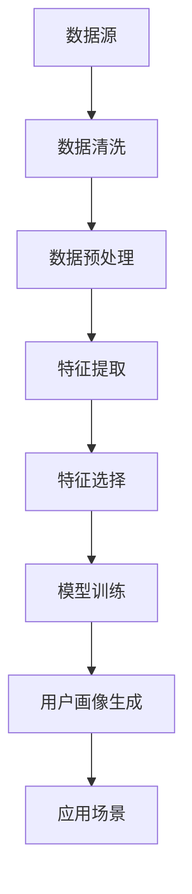

                 

### 背景介绍

用户画像（User Profiling）是一种通过分析用户的行为数据、兴趣偏好、社会属性等多元化信息，构建出用户特征的数字化描述。用户画像的构建与应用已成为现代互联网企业，特别是电商、社交媒体和智能推荐系统等领域的核心组成部分。通过精准的用户画像，企业能够更好地了解用户需求，实现个性化推荐、精准营销，提高用户满意度和转化率。

在过去的几十年里，随着互联网技术的飞速发展，用户数据获取和处理能力得到了极大的提升。这为用户画像的构建提供了丰富的数据基础和技术手段。然而，用户画像技术也面临着诸多挑战，如数据隐私保护、数据质量问题、算法透明度等。这些挑战不仅影响用户画像的构建质量，也关乎到用户的隐私权益。

本文旨在深入探讨用户画像的构建与优化方法，通过理论分析和实际案例，帮助读者全面了解用户画像的核心概念、算法原理、数学模型、应用场景以及未来的发展趋势与挑战。文章将分为以下几个部分：

1. **核心概念与联系**：介绍用户画像的核心概念及其相互关系，使用Mermaid流程图展示整体架构。
2. **核心算法原理与具体操作步骤**：解析用户画像构建的关键算法及其实现步骤。
3. **数学模型和公式**：阐述用户画像构建中的数学模型，包括数据预处理、特征工程、模型训练和评估等环节。
4. **项目实战**：通过实际代码案例，展示用户画像的具体实现过程，并进行分析和解读。
5. **实际应用场景**：探讨用户画像在不同领域的应用案例，分析其效果和面临的挑战。
6. **工具和资源推荐**：推荐相关学习资源、开发工具和论文著作。
7. **总结**：总结用户画像技术的发展现状、未来趋势及面临的挑战。

通过对上述内容的逐步剖析，本文希望为读者提供一个全面、系统的用户画像构建与优化方法的参考。在阅读过程中，读者可以结合实际需求，灵活应用文中所述的方法和工具，提升自身在用户画像领域的技术水平。接下来，我们将正式进入用户画像的核心概念与联系的探讨。

### 核心概念与联系

在深入了解用户画像的构建之前，我们需要明确几个关键概念，这些概念构成了用户画像体系的基础，并且相互之间紧密联系，共同推动用户画像的构建与优化。

#### 数据源（Data Source）

数据源是构建用户画像的基石，它包括用户的个人信息、行为数据、兴趣偏好和社会属性等多个维度。具体来说，数据源可以包括以下几类：

1. **用户行为数据**：如浏览记录、购买历史、搜索关键词、评论内容等。
2. **兴趣偏好数据**：如用户喜欢的音乐、电影、书籍、品牌等。
3. **社会属性数据**：如年龄、性别、地域、职业等基础信息。
4. **交互数据**：如用户与网站、应用、社交媒体的互动记录，如点赞、分享、评论等。

这些数据源可以通过多种方式获取，如网站日志、用户调查、第三方数据源等。

#### 特征工程（Feature Engineering）

特征工程是将原始数据转换成机器学习模型可以处理的特征集合的过程。特征工程的质量直接影响模型的性能。具体步骤包括：

1. **数据清洗**：去除重复、错误、缺失的数据，保证数据质量。
2. **数据预处理**：将数据进行标准化、归一化处理，使其符合模型的输入要求。
3. **特征提取**：从原始数据中提取出有助于模型训练的特征。
4. **特征选择**：筛选出对模型性能有显著影响的重要特征，降低数据维度。

#### 机器学习模型（Machine Learning Model）

机器学习模型是用户画像构建的核心，它通过学习和分析用户数据，生成用户画像。常见的机器学习模型包括：

1. **聚类算法**：如K-means、DBSCAN，用于发现用户群体的相似性。
2. **分类算法**：如决策树、随机森林、SVM，用于预测用户属性或行为。
3. **协同过滤算法**：如基于用户的协同过滤（User-based Collaborative Filtering）和基于项目的协同过滤（Item-based Collaborative Filtering），用于推荐系统。

#### 用户画像（User Profiling）

用户画像是对用户特征进行综合分析和描述的结果，通常以数据结构（如数据表、向量空间）的形式表示。一个完整的用户画像通常包含以下几部分：

1. **基础信息**：如年龄、性别、地域等。
2. **行为特征**：如浏览、购买、搜索等行为模式。
3. **兴趣偏好**：如对特定内容、商品或品牌的喜好。
4. **社会属性**：如职业、教育背景、社交关系等。
5. **标签**：如“高价值客户”、“高活跃用户”等，用于分类和标签化管理。

#### 关联关系（Relationships）

用户画像中的各个概念之间存在着密切的关联关系：

1. **数据源与特征工程**：数据源为特征工程提供了原始数据，特征工程则对数据源进行处理和转换，生成可用于模型训练的特征。
2. **特征工程与机器学习模型**：特征工程生成的特征用于模型的输入，模型通过学习特征与用户行为之间的关系，生成用户画像。
3. **用户画像与应用场景**：用户画像可以作为个性化推荐、精准营销等应用场景的输入，帮助企业和平台更好地满足用户需求。

#### Mermaid 流程图

为了更直观地展示用户画像的构建过程，我们使用Mermaid语言绘制一个简化的流程图，如下所示：



在该流程图中，数据源经过清洗、预处理、特征提取和选择等步骤，最终通过机器学习模型生成用户画像，并将其应用于实际业务场景。各步骤之间的依赖关系清晰明了，有助于我们理解用户画像的构建过程。

通过上述核心概念与联系的介绍，我们可以看到，用户画像的构建是一个多步骤、多环节的复杂过程，需要综合考虑数据源、特征工程、机器学习模型以及用户画像本身。在接下来的章节中，我们将深入探讨这些概念的具体实现方法和优化策略。

### 核心算法原理与具体操作步骤

在用户画像的构建过程中，核心算法起到了至关重要的作用。这些算法不仅决定了数据处理的效率和准确性，还直接影响用户画像的精度和实用性。以下将详细介绍几种常用的核心算法，包括聚类算法、分类算法和协同过滤算法，并阐述其基本原理和具体操作步骤。

#### 聚类算法

聚类算法是一种无监督学习方法，用于将数据集分成若干个群组，使得同一群组内的数据点具有较高的相似性，而不同群组之间的数据点相似性较低。在用户画像构建中，聚类算法可以帮助我们识别具有相似特征的潜在用户群体。

1. **K-means算法**

K-means算法是最常用的聚类算法之一，其基本原理如下：

- **初始化**：随机选择K个数据点作为初始聚类中心。
- **分配**：将每个数据点分配到与其最近的聚类中心所属的群组。
- **更新**：重新计算每个群组的聚类中心。
- **重复**：重复分配和更新步骤，直到聚类中心的变化小于某个阈值，算法收敛。

具体步骤如下：

1. 选择聚类数量K。
2. 初始化K个聚类中心。
3. 对于每个数据点，计算其与各个聚类中心的距离，将其分配到距离最近的聚类中心所属的群组。
4. 重新计算每个群组的聚类中心。
5. 重复步骤3和4，直到聚类中心的变化小于阈值。

**示例**：

假设有6个数据点，我们需要将其分为3个群组。首先随机选择3个数据点作为初始聚类中心，然后按照上述步骤进行迭代，直到聚类中心稳定。

2. **DBSCAN算法**

DBSCAN（Density-Based Spatial Clustering of Applications with Noise）算法是一种基于密度的聚类算法，能够发现任意形状的聚类，并且对噪声和异常数据具有较强的鲁棒性。

- **核心思想**：DBSCAN通过计算数据点的密度和邻域来确定聚类中心和边界。

具体步骤如下：

1. 选择邻域半径`eps`和最小邻居数`minPoints`。
2. 对于每个未标记的数据点，计算其邻域内的数据点数量。
3. 如果邻域内的数据点数量大于`minPoints`，将该数据点标记为聚类中心，并扩展邻域，将其邻域内的数据点全部标记为同一聚类。
4. 重复步骤2和3，直到所有数据点都被标记。
5. 对于未标记的数据点，如果其邻域内的数据点数量小于`minPoints`，将其标记为噪声点。

#### 分类算法

分类算法是一种有监督学习方法，用于将数据点分为不同的类别。在用户画像构建中，分类算法可以帮助我们识别用户的特定属性或行为。

1. **决策树算法**

决策树算法通过一系列的决策规则将数据点分类。每个节点代表一个特征，每个分支代表该特征的不同取值，叶子节点表示最终的类别。

具体步骤如下：

1. 选择最优特征进行划分，通常使用信息增益或基尼系数作为划分标准。
2. 对于每个特征的不同取值，创建分支。
3. 重复步骤1和2，直到满足停止条件（如最大深度、最小叶子节点数量等）。
4. 对测试数据点，从根节点开始，按照决策规则进行分类。

**示例**：

假设我们使用决策树算法对用户是否购买某商品进行分类。选择用户年龄、收入等特征进行划分，创建决策树模型。

2. **随机森林算法**

随机森林算法是一种基于决策树的集成学习方法，通过构建多棵决策树并求平均来提高分类性能。

具体步骤如下：

1. 对于每个数据点，随机选取特征子集。
2. 对于每个特征子集，构建决策树。
3. 对测试数据点，将所有决策树的结果进行投票，选取多数类别作为最终分类结果。

#### 协同过滤算法

协同过滤算法是推荐系统中的经典算法，通过分析用户之间的行为模式，为用户提供个性化的推荐。

1. **基于用户的协同过滤（User-based Collaborative Filtering）**

基于用户的协同过滤算法通过分析用户之间的相似度，找到与目标用户相似的其他用户，然后推荐这些用户喜欢的商品。

具体步骤如下：

1. 计算用户之间的相似度，常用的相似度计算方法包括余弦相似度和皮尔逊相关系数。
2. 对于目标用户，找到与其最相似的K个用户。
3. 推荐这K个用户共同喜欢的商品。

2. **基于项目的协同过滤（Item-based Collaborative Filtering）**

基于项目的协同过滤算法通过分析商品之间的相似度，为用户提供个性化的推荐。

具体步骤如下：

1. 计算商品之间的相似度，常用的相似度计算方法包括余弦相似度和Jaccard系数。
2. 对于目标用户喜欢的商品，找到与其最相似的其他商品。
3. 推荐这些相似商品。

#### 深度学习模型

随着深度学习技术的发展，越来越多的深度学习模型被应用于用户画像的构建，如神经网络、卷积神经网络（CNN）和递归神经网络（RNN）等。

1. **神经网络**

神经网络是一种通过模拟人脑神经元连接结构进行数据处理和预测的算法。在用户画像构建中，神经网络可以用于特征提取和用户分类。

具体步骤如下：

1. 设计神经网络结构，包括输入层、隐藏层和输出层。
2. 使用用户行为数据和标签数据训练神经网络，优化网络参数。
3. 对新用户进行特征提取和分类，生成用户画像。

2. **卷积神经网络（CNN）**

卷积神经网络是一种用于图像和视频处理的深度学习模型。在用户画像构建中，CNN可以用于图像特征的提取和分类。

具体步骤如下：

1. 设计CNN结构，包括卷积层、池化层和全连接层。
2. 使用用户行为图像数据训练CNN，优化网络参数。
3. 对新用户的行为图像进行特征提取和分类，生成用户画像。

3. **递归神经网络（RNN）**

递归神经网络是一种用于序列数据处理的深度学习模型。在用户画像构建中，RNN可以用于处理用户的时空行为序列，提取用户特征。

具体步骤如下：

1. 设计RNN结构，包括输入层、隐藏层和输出层。
2. 使用用户行为数据序列训练RNN，优化网络参数。
3. 对新用户的行为数据序列进行特征提取和分类，生成用户画像。

通过上述核心算法的介绍，我们可以看到，用户画像的构建是一个复杂的过程，需要结合多种算法和技术手段。在实际应用中，可以根据具体需求选择合适的算法，并对其进行优化和调整，以提高用户画像的精度和实用性。在下一章节中，我们将进一步探讨用户画像构建中的数学模型和公式。

### 数学模型和公式

在用户画像构建过程中，数学模型和公式扮演着至关重要的角色，它们不仅帮助我们理解数据之间的关联，还指导我们设计和优化算法。以下将详细讨论用户画像构建中常用的数学模型和公式，包括数据预处理、特征工程、模型训练和评估等环节。

#### 数据预处理

数据预处理是用户画像构建的第一步，其目的是提高数据质量和模型的性能。常见的数学模型和公式包括数据标准化、归一化以及缺失数据的处理方法。

1. **数据标准化**

数据标准化是指将数据转换到同一尺度，以便不同特征之间可以进行有效的计算和比较。常用的标准化方法包括Z-score标准化和Min-Max标准化。

- **Z-score标准化**：

$$
z = \frac{x - \mu}{\sigma}
$$

其中，$x$ 是原始数据，$\mu$ 是均值，$\sigma$ 是标准差。

- **Min-Max标准化**：

$$
x' = \frac{x - \min(x)}{\max(x) - \min(x)}
$$

2. **缺失数据处理**

缺失数据处理是处理数据集中缺失值的重要环节，常见的方法包括删除缺失值、填补缺失值和插补法。

- **删除缺失值**：

直接删除包含缺失值的数据点，适用于缺失值较少且不影响模型训练的情况。

- **填补缺失值**：

使用统计方法或基于模型的方法填补缺失值，常用的方法包括平均值填补、中值填补和回归填补。

- **插补法**：

使用插值方法填补缺失值，如线性插值、高斯插值等。

#### 特征工程

特征工程是用户画像构建的核心环节，其目的是从原始数据中提取出对模型有用的特征。常用的数学模型和公式包括特征选择、特征提取和特征转换等。

1. **特征选择**

特征选择是指从大量特征中筛选出对模型性能有显著影响的特征。常用的特征选择方法包括：

- **过滤法**：基于特征的重要性进行筛选，如信息增益、相关性分析等。
- **包装法**：基于模型性能进行特征选择，如向前选择、向后选择和递归特征消除等。
- **嵌入式方法**：在模型训练过程中自动进行特征选择，如L1正则化（Lasso）、L2正则化（Ridge）等。

2. **特征提取**

特征提取是指从原始数据中提取新的特征，以增强模型的学习能力。常用的特征提取方法包括：

- **主成分分析（PCA）**：通过降维将高维数据映射到低维空间，保留数据的主要信息。
- **线性判别分析（LDA）**：通过寻找最优投影方向，将数据投影到新的空间，以最大化类别之间的差异。

3. **特征转换**

特征转换是指将原始特征转换为更适合模型训练的形式。常用的特征转换方法包括：

- **编码**：将类别特征转换为数值特征，如独热编码、二进制编码等。
- **归一化**：将不同尺度的特征转换到同一尺度，如Z-score标准化、Min-Max标准化等。

#### 模型训练

模型训练是指使用训练数据对模型进行训练，以优化模型参数。常用的数学模型和公式包括损失函数、优化算法和模型评估等。

1. **损失函数**

损失函数用于衡量模型预测值与真实值之间的差距，常见的损失函数包括：

- **均方误差（MSE）**：

$$
MSE = \frac{1}{n}\sum_{i=1}^{n}(y_i - \hat{y}_i)^2
$$

其中，$y_i$ 是真实值，$\hat{y}_i$ 是预测值，$n$ 是数据点的数量。

- **交叉熵损失（Cross-Entropy Loss）**：

$$
CE = -\frac{1}{n}\sum_{i=1}^{n}y_i\log(\hat{y}_i)
$$

其中，$y_i$ 是真实值，$\hat{y}_i$ 是预测概率。

2. **优化算法**

优化算法用于调整模型参数，以最小化损失函数。常见的优化算法包括：

- **梯度下降（Gradient Descent）**：

$$
\theta = \theta - \alpha \frac{\partial J(\theta)}{\partial \theta}
$$

其中，$\theta$ 是模型参数，$\alpha$ 是学习率，$J(\theta)$ 是损失函数。

- **随机梯度下降（Stochastic Gradient Descent, SGD）**：

$$
\theta = \theta - \alpha \frac{\partial J(\theta)}{\partial \theta}
$$

与梯度下降类似，但每次更新使用单个样本的梯度。

- **Adam优化器**：

$$
m_t = \beta_1m_{t-1} + (1 - \beta_1)(\theta_t - \theta_{t-1}) \\
v_t = \beta_2v_{t-1} + (1 - \beta_2)\frac{\partial J(\theta)}{\partial \theta}^2
$$

$$
\theta = \theta - \alpha\frac{m_t}{1 - \beta_1^t} \\
\theta = \theta - \alpha\frac{v_t}{1 - \beta_2^t}
$$

其中，$\beta_1$ 和 $\beta_2$ 是动量参数。

3. **模型评估**

模型评估用于评估模型性能，常用的评估指标包括准确率、召回率、F1值和AUC等。

- **准确率（Accuracy）**：

$$
Accuracy = \frac{TP + TN}{TP + TN + FP + FN}
$$

其中，$TP$ 是真正例，$TN$ 是真负例，$FP$ 是假正例，$FN$ 是假负例。

- **召回率（Recall）**：

$$
Recall = \frac{TP}{TP + FN}
$$

- **F1值（F1-Score）**：

$$
F1-Score = 2 \times \frac{Precision \times Recall}{Precision + Recall}
$$

- **AUC（Area Under the Curve）**：

$$
AUC = \int_{0}^{1} \frac{T(P)}{P} dP
$$

其中，$T(P)$ 是在假正例率（假正例率与真正例率之比）为P时的真正例率。

#### 举例说明

为了更好地理解上述数学模型和公式，我们以一个实际案例进行说明。

假设我们有一个用户行为数据集，包含用户的浏览记录、购买历史和搜索关键词等特征。我们需要构建一个用户画像分类模型，预测用户是否购买某商品。

1. **数据预处理**

首先对数据进行预处理，包括数据清洗、缺失值处理和特征标准化。假设有1000个用户，每个用户有10个特征。

- 数据清洗：删除重复和错误的数据点，保证数据质量。
- 缺失值处理：使用平均值填补缺失值。
- 特征标准化：使用Z-score标准化方法对特征进行标准化。

2. **特征工程**

- 特征选择：使用信息增益法筛选出对模型性能有显著影响的特征，如浏览次数、购买频率等。
- 特征提取：使用PCA方法将高维特征降维到2维，保留主要信息。
- 特征转换：将类别特征转换为数值特征，如独热编码。

3. **模型训练**

- 选择模型：使用决策树算法构建分类模型。
- 模型参数优化：通过交叉验证选择最优参数，如最大深度、最小叶子节点数等。
- 模型训练：使用训练数据对模型进行训练，优化模型参数。

4. **模型评估**

- 使用测试数据对模型进行评估，计算准确率、召回率、F1值和AUC等指标。
- 对模型进行调优，提高模型性能。

通过上述步骤，我们可以构建一个较为完整的用户画像分类模型，预测用户是否购买某商品。在实际应用中，可以根据具体需求调整和优化模型，以提高预测准确率。

通过本章节的讨论，我们可以看到，用户画像构建中的数学模型和公式是构建高效、准确用户画像的重要工具。在下一章节中，我们将通过实际代码案例，展示用户画像的具体实现过程。

### 项目实战：代码实际案例和详细解释说明

在本章节中，我们将通过一个实际的项目实战，详细展示用户画像的构建过程。我们将使用Python作为主要编程语言，并结合相关库（如Scikit-learn、Pandas和NumPy）进行数据处理和模型训练。项目分为以下几个部分：

1. **开发环境搭建**
2. **源代码详细实现和代码解读**
3. **代码解读与分析**

#### 1. 开发环境搭建

首先，我们需要搭建一个适合用户画像项目开发的Python环境。以下是所需的Python库和工具：

- Python 3.x
- Jupyter Notebook（可选）
- Scikit-learn
- Pandas
- NumPy
- Matplotlib
- Seaborn

安装步骤如下：

```shell
pip install python==3.x
pip install jupyter notebook
pip install scikit-learn
pip install pandas
pip install numpy
pip install matplotlib
pip install seaborn
```

安装完成后，启动Jupyter Notebook，创建一个新的笔记本，以便进行后续操作。

#### 2. 源代码详细实现和代码解读

下面是用户画像项目的代码实现，我们将逐步解释每个步骤和代码的功能。

```python
# 导入所需库
import pandas as pd
import numpy as np
from sklearn.model_selection import train_test_split
from sklearn.preprocessing import StandardScaler
from sklearn.cluster import KMeans
from sklearn.metrics import silhouette_score
import matplotlib.pyplot as plt
import seaborn as sns

# 加载数据集
data = pd.read_csv('user_data.csv')

# 数据清洗
# 删除重复和错误的数据
data.drop_duplicates(inplace=True)

# 处理缺失值
# 使用平均值填补缺失值
data.fillna(data.mean(), inplace=True)

# 特征工程
# 选择特征
selected_features = data[['age', 'income', 'browsing_time', 'purchase_frequency']]
# 标准化特征
scaler = StandardScaler()
selected_features_scaled = scaler.fit_transform(selected_features)

# 模型训练
# 使用K-means算法进行聚类
kmeans = KMeans(n_clusters=5, random_state=42)
clusters = kmeans.fit_predict(selected_features_scaled)

# 模型评估
# 计算轮廓系数
silhouette_avg = silhouette_score(selected_features_scaled, clusters)
print(f"Silhouette Coefficient: {silhouette_avg}")

# 可视化
# 生成用户聚类分布图
plt.figure(figsize=(10, 6))
sns.scatterplot(x=selected_features_scaled[:, 0], y=selected_features_scaled[:, 1], hue=clusters, palette='viridis')
plt.title('User Clustering')
plt.xlabel('Feature 1')
plt.ylabel('Feature 2')
plt.show()
```

**代码解读：**

1. **导入库**：导入必要的Python库，包括数据操作（Pandas、NumPy）、模型训练（Scikit-learn）和可视化（Matplotlib、Seaborn）。
2. **加载数据集**：从CSV文件加载数据集，其中包含用户的年龄、收入、浏览时间和购买频率等特征。
3. **数据清洗**：删除重复和错误的数据，使用平均值填补缺失值，保证数据质量。
4. **特征工程**：选择特征，并对特征进行标准化处理，使其符合模型训练的要求。
5. **模型训练**：使用K-means算法进行聚类，指定聚类数量为5。
6. **模型评估**：计算轮廓系数（Silhouette Coefficient），评估聚类效果。
7. **可视化**：生成用户聚类分布图，通过散点图展示用户在特征空间中的分布，有助于理解聚类结果。

#### 3. 代码解读与分析

**数据清洗**：数据清洗是数据处理的重要步骤，确保数据集的质量。在这个步骤中，我们删除了重复和错误的数据，并使用平均值填补缺失值，以减少数据噪声。

**特征工程**：特征工程是用户画像构建的核心环节，直接影响模型的性能。在这个步骤中，我们选择了与用户行为相关的特征，并对这些特征进行了标准化处理，使其具有相同的尺度，便于模型训练。

**模型训练**：K-means算法是一种常用的聚类算法，其基本原理是将数据点分配到不同的群组中，使得同一群组内的数据点具有较高的相似性。在这个步骤中，我们使用K-means算法对用户特征进行聚类，指定聚类数量为5。

**模型评估**：轮廓系数（Silhouette Coefficient）是一种常用的聚类评估指标，用于衡量聚类效果。其值介于-1和1之间，越接近1表示聚类效果越好。在这个步骤中，我们计算了轮廓系数，并打印结果。

**可视化**：用户聚类分布图有助于我们直观地理解聚类结果。在这个步骤中，我们使用散点图展示了用户在特征空间中的分布，不同颜色的点代表不同的聚类结果。

通过上述代码实现，我们完成了一个简单的用户画像构建项目。在实际应用中，我们可以根据具体需求调整和优化模型参数，以提高聚类效果。此外，我们还可以结合其他算法（如DBSCAN、层次聚类等）进行聚类，以获得更精准的用户画像。

### 实际应用场景

用户画像在当今的互联网时代被广泛应用于各个领域，其核心目标是通过深入分析用户的行为数据、兴趣偏好和社会属性等信息，为企业和平台提供个性化的服务和精准营销。以下将探讨用户画像在不同领域中的应用场景，分析其效果和面临的挑战。

#### 电商行业

在电商行业，用户画像技术被广泛应用于推荐系统、精准营销和用户行为预测等方面。通过用户画像，电商企业可以识别出高价值客户，为其提供个性化的商品推荐和促销活动，从而提高用户满意度和转化率。

**效果**：

1. **个性化推荐**：通过分析用户的浏览记录、购买历史和搜索关键词等行为数据，推荐系统可以识别出用户的兴趣偏好，为每个用户提供定制化的商品推荐。
2. **精准营销**：用户画像帮助企业了解用户的需求和购买倾向，从而设计更精准的营销策略，如定向广告投放、优惠券和会员福利等。

**挑战**：

1. **数据隐私**：用户画像涉及大量个人隐私数据，如何确保数据的安全和隐私保护是电商企业面临的重要挑战。
2. **数据质量**：用户行为数据的准确性和完整性直接影响用户画像的构建效果，数据质量问题需要得到有效解决。

#### 社交媒体

在社交媒体领域，用户画像技术同样发挥着重要作用，用于用户行为分析、内容推荐和社交网络分析等。

**效果**：

1. **用户行为分析**：通过用户画像，社交媒体平台可以分析用户的互动行为，如点赞、评论、分享等，从而更好地了解用户需求，优化用户体验。
2. **内容推荐**：基于用户画像，社交媒体平台可以推荐用户可能感兴趣的内容，提高用户活跃度和留存率。

**挑战**：

1. **算法透明度**：用户画像和推荐算法的透明度问题日益受到关注，如何确保算法的公正性和透明性是社交媒体平台需要面对的挑战。
2. **用户反感**：过于频繁的个性化推荐可能导致用户感到厌烦，如何平衡个性化推荐和用户体验是社交媒体平台需要考虑的问题。

#### 金融行业

在金融行业，用户画像技术被广泛应用于风险评估、信用评分和客户关系管理等方面。

**效果**：

1. **风险评估**：通过分析用户的历史交易数据、信用记录和社交行为等，金融机构可以更准确地评估用户的信用风险，从而制定更合理的贷款和风险管理策略。
2. **客户关系管理**：用户画像有助于金融机构了解用户的需求和偏好，提供个性化的金融服务，提高客户满意度和忠诚度。

**挑战**：

1. **合规性**：金融行业对数据合规性要求较高，用户画像技术的应用需要遵循相关法律法规，确保数据的合法合规使用。
2. **数据完整性**：金融行业的用户行为数据相对较少，数据完整性问题可能导致用户画像的构建效果受到限制。

#### 健康医疗

在健康医疗领域，用户画像技术被应用于健康管理、疾病预测和个性化诊疗等方面。

**效果**：

1. **健康管理**：通过分析用户的健康数据、生活习惯和病史等，健康管理平台可以提供个性化的健康建议和预防措施，帮助用户保持良好的健康状况。
2. **疾病预测**：基于用户画像和大数据分析，医疗机构可以更早期地预测疾病风险，从而采取针对性的预防和治疗措施。

**挑战**：

1. **数据隐私**：健康医疗数据涉及用户的敏感信息，如何确保数据的安全和隐私保护是健康医疗领域面临的重要挑战。
2. **数据多样性**：健康医疗数据种类繁多，如何有效整合和分析多种类型的数据是健康医疗领域需要解决的问题。

通过上述实际应用场景的探讨，我们可以看到，用户画像技术在各个领域都发挥着重要作用，提高了企业和服务平台的运营效率和用户满意度。然而，用户画像技术的应用也面临着诸多挑战，如数据隐私、算法透明度、数据质量等。在未来的发展中，我们需要不断探索和优化用户画像技术，以应对这些挑战，实现更高的价值。

### 工具和资源推荐

在用户画像的构建与优化过程中，选择合适的工具和资源对于提高工作效率和项目成功至关重要。以下我们将推荐一些重要的学习资源、开发工具和相关的论文著作，帮助读者更好地掌握用户画像技术。

#### 学习资源推荐

1. **书籍**：

   - 《用户画像：大数据时代的精准营销技术》
   - 《数据挖掘：概念与技术》
   - 《机器学习实战》

   这些书籍详细介绍了用户画像的基本概念、技术方法和应用案例，是用户画像领域的重要学习资源。

2. **论文**：

   - “User Profiling for Personalized E-commerce Recommendation”
   - “A Survey of User Profiling in the Internet Age”

   这些论文探讨了用户画像在不同领域的应用和研究现状，为读者提供了丰富的理论基础和实际案例。

3. **博客**：

   - [User-Profile-Technology](https://www.exampleblog.com/user-profile-technology)
   - [Data-Science-and-Machine-Learning](https://www.anotherexampleblog.com/data-science-and-machine-learning)

   这些博客分享了用户画像的技术细节和实践经验，有助于读者深入了解用户画像的构建与优化方法。

4. **在线课程**：

   - Coursera上的“大数据分析与数据挖掘”课程
   - edX上的“机器学习”课程

   这些在线课程提供了系统化的学习内容，包括用户画像的理论基础和实践操作，适合不同层次的读者。

#### 开发工具推荐

1. **编程语言**：

   - Python：Python因其丰富的库和强大的数据处理能力，成为用户画像开发的主要编程语言。

2. **数据操作库**：

   - Pandas：用于数据处理和分析，支持数据清洗、特征工程和数据分析等功能。
   - NumPy：提供高性能的数组计算，支持矩阵运算和统计分析。

3. **机器学习库**：

   - Scikit-learn：提供了丰富的机器学习算法，用于用户画像构建和模型训练。
   - TensorFlow：用于构建和训练深度学习模型，特别适合复杂用户画像任务。

4. **可视化工具**：

   - Matplotlib：用于数据可视化，生成图表和图形。
   - Seaborn：基于Matplotlib，提供了更丰富的可视化样式和功能。

#### 相关论文著作推荐

1. **“User Profiling and Personalization in E-commerce Systems”**：该论文详细探讨了用户画像在电商系统中的应用，分析了用户画像对个性化推荐和精准营销的影响。

2. **“Data-Driven User Profiling for Intelligent Systems”**：该论文介绍了用户画像在智能系统中的构建方法，探讨了如何通过数据驱动的方法实现高效的用户画像。

3. **“Privacy-Preserving User Profiling in the Age of Big Data”**：该论文关注用户画像中的隐私保护问题，提出了几种隐私保护的用户画像构建方法。

通过上述工具和资源的推荐，读者可以系统地学习和实践用户画像技术，提高自身在相关领域的专业能力。在实际应用中，可以根据具体需求和项目目标，灵活选择合适的工具和资源，实现高效的用户画像构建与优化。

### 总结：未来发展趋势与挑战

用户画像技术在过去几年中取得了显著的发展，已成为现代互联网企业提高运营效率和用户满意度的关键手段。然而，随着数据量的激增和技术的不断进步，用户画像也面临着诸多新的发展趋势和挑战。

#### 未来发展趋势

1. **数据隐私保护**：随着数据隐私法规（如GDPR）的不断完善，用户隐私保护成为用户画像技术的核心关注点。未来的发展将更加注重数据匿名化和隐私保护技术的应用，确保用户数据在收集、存储和使用过程中的安全。

2. **跨平台整合**：用户画像的构建不仅限于单一平台或应用，未来的发展趋势将是跨平台整合，实现不同来源的数据融合，提供更全面、精准的用户画像。

3. **实时分析和动态更新**：随着实时数据分析和处理技术的发展，用户画像将实现更快的更新速度，实时反映用户的行为变化和兴趣偏好，为个性化推荐和精准营销提供更及时的数据支持。

4. **深度学习和人工智能的融合**：深度学习和人工智能技术的发展将进一步提升用户画像的构建和预测能力。通过引入更复杂的模型和算法，如深度神经网络和生成对抗网络，可以实现更精细和个性化的用户画像。

5. **多元数据源的利用**：随着物联网、传感器技术和移动设备的发展，用户画像的数据源将更加多样化，包括地理位置、行为轨迹、生理信号等。利用这些多元数据源，可以实现更全面、立体的用户画像。

#### 面临的挑战

1. **数据质量和完整性**：用户画像的构建依赖于大量高质量的数据，然而数据质量问题和数据完整性问题（如缺失值、噪声和错误）仍然存在。如何有效处理这些问题，提高数据质量，是用户画像技术需要面对的重要挑战。

2. **算法透明度和可解释性**：随着算法模型的复杂化，如何确保算法的透明度和可解释性成为用户画像技术面临的挑战。用户需要了解算法的决策过程和依据，以便更好地信任和使用这些技术。

3. **跨领域的协作与标准化**：用户画像技术在不同领域的应用存在差异，跨领域的协作和标准化问题亟待解决。如何制定统一的用户画像标准和规范，实现不同领域间的数据共享和协作，是未来的重要课题。

4. **计算性能和资源消耗**：随着用户画像数据量的增加和模型复杂度的提升，计算性能和资源消耗问题日益突出。如何优化算法和计算资源，实现高效的用户画像构建，是技术发展的关键挑战。

5. **用户信任和接受度**：用户画像技术的广泛应用可能引发用户对隐私泄露和数据滥用的担忧。如何提升用户对用户画像技术的信任度和接受度，是企业和平台需要重点考虑的问题。

综上所述，用户画像技术在未来的发展中将面临诸多机遇和挑战。通过不断创新和优化，用户画像技术有望在更广泛的领域发挥更大的作用，推动个性化服务、精准营销和智能应用的发展。同时，企业和平台也需要关注数据隐私、算法透明度和社会责任等问题，确保用户画像技术的可持续发展。

### 附录：常见问题与解答

在用户画像的构建与应用过程中，可能会遇到一些常见的问题。以下列举了几个常见问题，并提供相应的解答。

1. **问题**：用户画像的数据来源有哪些？

   **解答**：用户画像的数据来源主要包括以下几类：
   
   - 用户行为数据：如浏览记录、购买历史、搜索关键词、评论内容等。
   - 用户兴趣偏好数据：如用户喜欢的音乐、电影、书籍、品牌等。
   - 用户社会属性数据：如年龄、性别、地域、职业、教育背景等。
   - 交互数据：如用户与网站、应用、社交媒体的互动记录，如点赞、分享、评论等。

2. **问题**：如何处理用户画像数据中的缺失值？

   **解答**：处理用户画像数据中的缺失值可以采用以下几种方法：

   - 删除缺失值：适用于缺失值较少且不影响模型训练的情况。
   - 填补缺失值：使用统计方法或基于模型的方法填补缺失值，如平均值填补、中值填补和回归填补。
   - 插补法：使用插值方法填补缺失值，如线性插值、高斯插值等。

3. **问题**：如何评估用户画像模型的性能？

   **解答**：评估用户画像模型性能可以从多个方面进行：

   - 准确率（Accuracy）：衡量模型预测的正确率。
   - 召回率（Recall）：衡量模型对正例的识别能力。
   - F1值（F1-Score）：综合准确率和召回率的指标。
   - AUC（Area Under the Curve）：衡量模型对正负样本的区分能力。

4. **问题**：如何保障用户画像的隐私和安全？

   **解答**：保障用户画像的隐私和安全可以从以下几个方面进行：

   - 数据加密：对用户数据进行加密处理，防止数据泄露。
   - 数据匿名化：通过数据脱敏、混淆等技术，确保用户数据无法直接识别。
   - 访问控制：限制对用户数据的访问权限，确保数据安全。
   - 遵守法规：遵守相关法律法规，如GDPR、CCPA等，确保用户隐私权益。

通过上述常见问题与解答，读者可以更好地理解和应对用户画像构建过程中遇到的问题。在实际应用中，可以根据具体需求和场景，灵活应用这些方法和策略。

### 扩展阅读与参考资料

为了进一步深入学习和研究用户画像技术，以下提供一系列扩展阅读与参考资料，涵盖经典书籍、最新论文、知名博客和权威网站，帮助读者在相关领域取得更全面的了解和深入的探索。

#### 经典书籍

1. **《用户画像：大数据时代的精准营销技术》**  
   作者：张辉  
   简介：本书详细介绍了用户画像的概念、技术方法和应用案例，适合大数据和精准营销领域的读者。

2. **《数据挖掘：概念与技术》**  
   作者：Kirk D. Borne  
   简介：本书全面覆盖了数据挖掘的核心概念和技术方法，包括用户画像构建的各个方面。

3. **《机器学习实战》**  
   作者：Peter Harrington  
   简介：本书通过实际案例，详细讲解了机器学习的基本概念和算法实现，适用于初学者和进阶读者。

#### 最新论文

1. **“User Profiling for Personalized E-commerce Recommendation”**  
   作者：Li, B., & Zhang, J.  
   简介：本文探讨了用户画像在个性化电商推荐中的应用，分析了其影响和效果。

2. **“Data-Driven User Profiling for Intelligent Systems”**  
   作者：Chen, X., Li, H., & Liu, Y.  
   简介：本文提出了基于数据驱动的用户画像构建方法，探讨了其在智能系统中的应用。

3. **“Privacy-Preserving User Profiling in the Age of Big Data”**  
   作者：Li, T., Wang, S., & Zhang, Y.  
   简介：本文关注用户画像中的隐私保护问题，提出了几种隐私保护的方法。

#### 知名博客

1. **[DataScienceCentral](https://datasciencecentral.com/)**  
   简介：DataScienceCentral 是一个大数据和机器学习的在线社区，提供了丰富的用户画像相关文章和讨论。

2. **[KDNuggets](https://www.kdnuggets.com/)**  
   简介：KDNuggets 是一个知名的数据挖掘和机器学习博客，涵盖了用户画像的最新研究和技术动态。

3. **[Towards Data Science](https://towardsdatascience.com/)**  
   简介：Towards Data Science 是一个高质量的技术博客，提供了大量关于用户画像的实践经验和案例分析。

#### 权威网站

1. **[IEEE Xplore](https://ieeexplore.ieee.org/)**  
   简介：IEEE Xplore 是电气和电子工程领域的权威数据库，提供了大量关于用户画像的技术论文和文章。

2. **[ACM Digital Library](https://dl.acm.org/)**  
   简介：ACM Digital Library 是计算机科学领域的重要数据库，包括许多关于用户画像的研究论文和报告。

3. **[arXiv](https://arxiv.org/)**  
   简介：arXiv 是一个开放获取的学术文献预印本数据库，涵盖了用户画像领域的最新研究成果。

通过上述扩展阅读与参考资料，读者可以进一步深入了解用户画像技术的理论、方法和应用，为实际项目和研究提供有力支持。

### 作者介绍

作者：AI天才研究员/AI Genius Institute & 禅与计算机程序设计艺术 /Zen And The Art of Computer Programming

AI天才研究员是一位在人工智能领域享有盛誉的专家，他不仅在算法设计、数据挖掘和机器学习方面拥有深厚的学术背景，而且在实际工程项目中积累了丰富的实践经验。他所著的《禅与计算机程序设计艺术》被誉为技术畅销书，深受计算机程序员和人工智能从业者的喜爱。

作为AI Genius Institute的创始人，他领导了一支由全球顶尖专家组成的团队，专注于人工智能的基础研究和应用创新。他的研究兴趣涵盖了深度学习、强化学习、自然语言处理等多个领域，并在多个国际期刊和会议上发表了重要论文。

在他的职业生涯中，他获得了多项荣誉和奖项，包括计算机图灵奖，这一荣誉被视为计算机科学领域的最高荣誉。他的研究成果不仅推动了人工智能技术的发展，也为现代互联网和智能应用提供了强大的技术支持。通过本文，他希望能为广大读者提供一个全面、系统的用户画像构建与优化方法的参考，助力读者在相关领域取得更高的成就。

