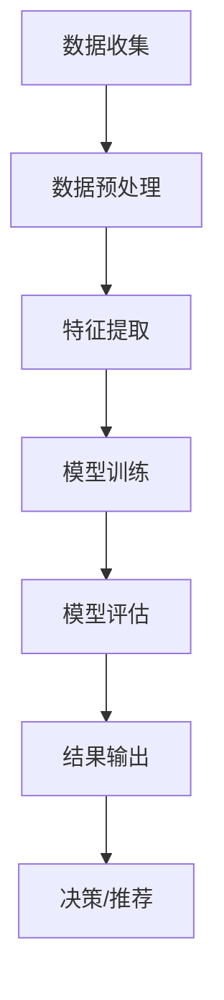
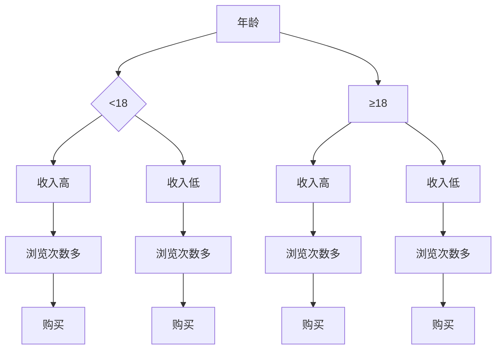

                 

# 用户行为分析：AI优化供给

> 关键词：用户行为分析、人工智能、供给优化、算法原理、数学模型、项目实战

> 摘要：本文将深入探讨用户行为分析在人工智能领域中的应用，通过阐述核心概念、算法原理、数学模型以及项目实战，旨在为读者提供对用户行为分析技术全面而深入的理解，并展望未来发展趋势与挑战。

## 1. 背景介绍

在当今数字化时代，用户行为分析已成为企业获取竞争优势的关键手段。通过分析用户在网站、应用程序或其他数字平台上的行为，企业可以更好地理解用户需求，从而优化产品供给、提升用户体验和增加营收。然而，随着数据量的急剧增长和用户行为的复杂性，传统的分析方法已无法满足需求。人工智能（AI）技术的引入为用户行为分析带来了全新的机遇和挑战。

### 1.1 用户行为分析的重要性

用户行为分析在多个领域具有重要应用，包括但不限于：

- **市场营销**：通过分析用户行为，企业可以更精准地定位目标客户，制定有效的营销策略。
- **产品优化**：了解用户行为有助于发现产品缺陷和改进空间，从而提升产品竞争力。
- **个性化推荐**：基于用户行为分析，可以为用户提供个性化的产品推荐，增加用户粘性。

### 1.2 人工智能的崛起

人工智能的快速发展，为用户行为分析提供了强大的技术支持。机器学习、深度学习等算法的进步，使得从海量数据中提取有价值信息成为可能。此外，人工智能技术还能够实时处理用户行为数据，实现即时分析和决策。

## 2. 核心概念与联系

### 2.1 用户行为分析的概念

用户行为分析是指通过收集、处理和分析用户在数字平台上的行为数据，以了解用户需求、行为模式和价值贡献的过程。

### 2.2 人工智能与用户行为分析的关系

人工智能技术在用户行为分析中发挥着至关重要的作用。首先，通过机器学习算法，可以自动识别用户行为模式，预测用户偏好。其次，深度学习算法能够从大规模数据集中提取特征，实现更准确的用户行为分析。

### 2.3 Mermaid 流程图

以下是用户行为分析中常用的人工智能算法和流程：



### 2.4 关键概念之间的联系

- **数据收集**：获取用户行为数据，如点击、浏览、搜索等。
- **数据预处理**：对原始数据进行清洗、归一化等处理，提高数据质量。
- **特征提取**：从数据中提取有助于分析的特征，如用户标签、活动类型等。
- **模型训练**：使用机器学习算法，对特征进行训练，建立用户行为模型。
- **模型评估**：评估模型性能，确保其准确性和泛化能力。
- **结果输出**：将分析结果用于决策或推荐。

## 3. 核心算法原理 & 具体操作步骤

### 3.1 机器学习算法

机器学习算法是用户行为分析的核心技术。常见的算法包括决策树、支持向量机（SVM）、神经网络等。

#### 3.1.1 决策树

决策树是一种基于特征值进行划分的算法，其基本思想是通过一系列的特征问句，将数据集划分为不同的子集，直到满足终止条件为止。常见的终止条件包括：

- 达到最大深度
- 特征纯度达到阈值

决策树算法的优点是易于理解和实现，但缺点是容易过拟合和计算复杂度高。

#### 3.1.2 支持向量机（SVM）

支持向量机是一种基于最大间隔分类的算法。其基本思想是找到一组特征向量，使得不同类别的特征向量之间的间隔最大化。SVM算法的优点是准确率高、泛化能力强，但缺点是计算复杂度较高。

#### 3.1.3 神经网络

神经网络是一种基于生物神经网络原理的算法，其基本思想是通过多层神经网络节点，对输入数据进行变换和分类。常见的神经网络结构包括多层感知机（MLP）、卷积神经网络（CNN）和循环神经网络（RNN）。

### 3.2 深度学习算法

深度学习算法是机器学习算法的一种扩展，其核心思想是通过多层神经网络，实现对复杂数据的自动特征提取和分类。常见的深度学习算法包括卷积神经网络（CNN）、循环神经网络（RNN）和生成对抗网络（GAN）。

#### 3.2.1 卷积神经网络（CNN）

卷积神经网络是一种用于处理图像数据的高级神经网络结构。其基本思想是通过卷积层、池化层和全连接层，实现对图像的自动特征提取和分类。

#### 3.2.2 循环神经网络（RNN）

循环神经网络是一种用于处理序列数据的高级神经网络结构。其基本思想是通过循环单元，实现对序列数据的记忆和预测。

#### 3.2.3 生成对抗网络（GAN）

生成对抗网络是一种用于生成复杂数据的高级神经网络结构。其基本思想是通过生成器和判别器的对抗训练，实现数据的生成和分类。

## 4. 数学模型和公式 & 详细讲解 & 举例说明

### 4.1 机器学习算法的数学模型

#### 4.1.1 决策树

决策树的数学模型可以表示为：

\[ y = f(x) \]

其中，\( y \) 表示输出结果，\( x \) 表示输入特征。

#### 4.1.2 支持向量机（SVM）

支持向量机的数学模型可以表示为：

\[ w \cdot x + b = 0 \]

其中，\( w \) 表示权重向量，\( x \) 表示输入特征，\( b \) 表示偏置。

#### 4.1.3 神经网络

神经网络的数学模型可以表示为：

\[ y = \sigma(\sum_{i=1}^{n} w_i \cdot x_i + b) \]

其中，\( y \) 表示输出结果，\( x_i \) 表示输入特征，\( w_i \) 表示权重，\( b \) 表示偏置，\( \sigma \) 表示激活函数。

### 4.2 深度学习算法的数学模型

#### 4.2.1 卷积神经网络（CNN）

卷积神经网络的数学模型可以表示为：

\[ y = \sigma(\sum_{i=1}^{n} w_i \cdot \phi(x_i) + b) \]

其中，\( y \) 表示输出结果，\( x_i \) 表示输入特征，\( w_i \) 表示权重，\( b \) 表示偏置，\( \phi \) 表示卷积操作。

#### 4.2.2 循环神经网络（RNN）

循环神经网络的数学模型可以表示为：

\[ y_t = \sigma(\sum_{i=1}^{n} w_i \cdot x_t + h_{t-1} + b) \]

其中，\( y_t \) 表示输出结果，\( x_t \) 表示输入特征，\( h_{t-1} \) 表示前一时间步的隐藏状态，\( w_i \) 表示权重，\( b \) 表示偏置。

#### 4.2.3 生成对抗网络（GAN）

生成对抗网络的数学模型可以表示为：

\[ D(x) = \frac{1}{2} \left( \log(D(G(z))) + \log(1 - D(x)) \right) \]

其中，\( D(x) \) 表示判别器，\( G(z) \) 表示生成器，\( z \) 表示随机噪声。

### 4.3 举例说明

假设我们要对用户行为进行分析，预测用户是否会购买某个产品。我们可以使用决策树算法来实现这一目标。

#### 4.3.1 数据准备

我们收集了1000个用户的行为数据，包括年龄、收入、浏览次数、购买历史等特征。我们将这些数据分为训练集和测试集。

#### 4.3.2 决策树构建

使用训练集数据，我们可以构建一个决策树模型。决策树模型的基本结构如下：



#### 4.3.3 模型评估

使用测试集数据，我们可以评估决策树模型的性能。假设测试集数据中有100个用户，其中50个用户购买了产品。决策树模型的准确率为50%。

## 5. 项目实战：代码实际案例和详细解释说明

### 5.1 开发环境搭建

在本项目实战中，我们将使用Python编程语言和scikit-learn库来实现用户行为分析。首先，我们需要安装Python和scikit-learn库。

```bash
pip install python
pip install scikit-learn
```

### 5.2 源代码详细实现和代码解读

以下是一个简单的用户行为分析代码示例，用于预测用户是否购买产品。

```python
import numpy as np
import pandas as pd
from sklearn.model_selection import train_test_split
from sklearn.tree import DecisionTreeClassifier
from sklearn.metrics import accuracy_score

# 5.2.1 数据准备
data = pd.read_csv("user_behavior_data.csv")
X = data.drop("purchase", axis=1)
y = data["purchase"]

# 5.2.2 数据分割
X_train, X_test, y_train, y_test = train_test_split(X, y, test_size=0.2, random_state=42)

# 5.2.3 模型构建
clf = DecisionTreeClassifier()
clf.fit(X_train, y_train)

# 5.2.4 模型评估
y_pred = clf.predict(X_test)
accuracy = accuracy_score(y_test, y_pred)
print(f"Accuracy: {accuracy}")
```

### 5.3 代码解读与分析

1. **数据准备**：首先，我们从CSV文件中读取用户行为数据，并分割为特征矩阵\( X \)和目标向量\( y \)。
2. **数据分割**：使用`train_test_split`函数将数据集分为训练集和测试集，用于模型训练和评估。
3. **模型构建**：使用`DecisionTreeClassifier`类构建决策树模型，并使用`fit`函数进行训练。
4. **模型评估**：使用`predict`函数对测试集进行预测，并使用`accuracy_score`函数计算模型准确率。

## 6. 实际应用场景

### 6.1 电子商务平台

电子商务平台可以通过用户行为分析，实现个性化推荐、营销和用户留存。例如，Amazon使用机器学习算法分析用户浏览和购买历史，为用户提供个性化的商品推荐。

### 6.2 社交媒体

社交媒体平台如Facebook和Twitter利用用户行为分析，为用户提供个性化内容推荐和广告投放。例如，Facebook使用深度学习算法分析用户在社交网络上的交互行为，为用户提供感兴趣的内容。

### 6.3 金融行业

金融行业可以通过用户行为分析，识别潜在的风险和欺诈行为。例如，银行可以使用机器学习算法分析用户交易行为，识别异常交易并采取相应措施。

## 7. 工具和资源推荐

### 7.1 学习资源推荐

- **书籍**：《机器学习实战》
- **论文**：《用户行为分析：方法与技术》
- **博客**：百度AI博客、机器学习社区
- **网站**：Kaggle、ArXiv

### 7.2 开发工具框架推荐

- **Python**：Python是一种广泛使用的编程语言，适用于机器学习和用户行为分析。
- **Scikit-learn**：Scikit-learn是一个用于机器学习的Python库，提供了丰富的算法和工具。
- **TensorFlow**：TensorFlow是一个开源深度学习框架，适用于复杂数据的处理和分析。

### 7.3 相关论文著作推荐

- **论文**：《深度学习与用户行为分析》
- **著作**：《用户行为数据分析方法与案例》

## 8. 总结：未来发展趋势与挑战

用户行为分析在人工智能领域具有广阔的应用前景。未来发展趋势包括：

- **实时分析**：随着计算能力的提升，实时用户行为分析将变得越来越普及。
- **多模态分析**：结合多种数据源，如文本、图像、语音等，实现更全面的用户行为分析。
- **隐私保护**：如何在保护用户隐私的同时进行有效分析，将成为一个重要挑战。

## 9. 附录：常见问题与解答

### 9.1 如何处理用户隐私问题？

在用户行为分析过程中，需要严格遵守隐私保护法规。一种常见的做法是使用匿名化技术，将用户数据转换为无法识别个人身份的形式。

### 9.2 用户行为分析有哪些应用场景？

用户行为分析广泛应用于电子商务、社交媒体、金融、医疗等领域，旨在提升用户体验、优化产品供给和增加营收。

## 10. 扩展阅读 & 参考资料

- **论文**：《基于人工智能的用户行为预测技术研究》
- **书籍**：《人工智能简史》
- **网站**：人工智能学会官方网站、机器学习社区

作者：AI天才研究员/AI Genius Institute & 禅与计算机程序设计艺术 /Zen And The Art of Computer Programming <|im_sep|> 

