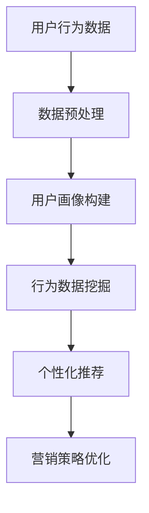

                 

# 用户行为分析：AI如何洞察用户需求，优化商品供给和营销策略

> 关键词：用户行为分析、AI、需求洞察、商品供给、营销策略

> 摘要：本文将深入探讨AI技术在用户行为分析中的应用，如何通过分析用户行为数据来洞察用户需求，进而优化商品供给和营销策略。我们将详细介绍核心概念、算法原理、数学模型，并分享实际项目案例和开发经验，为企业在数字化时代更好地服务用户提供参考。

## 1. 背景介绍

在数字化时代，用户行为数据已成为企业获取竞争优势的重要资源。通过分析用户行为数据，企业可以深入了解用户需求，优化商品供给，提高营销效果。然而，面对海量的用户行为数据，传统的数据分析方法已经无法满足需求。这时，AI技术应运而生，为用户行为分析带来了新的机遇和挑战。

用户行为分析的目标是挖掘用户行为背后的规律，预测用户未来的行为，为企业提供决策支持。这包括以下几个方面：

1. **需求分析**：通过分析用户浏览、购买、评论等行为数据，了解用户的兴趣和需求。
2. **个性化推荐**：根据用户的历史行为和偏好，为用户提供个性化的商品推荐。
3. **营销策略优化**：基于用户行为数据，制定更有效的营销策略，提高转化率。

## 2. 核心概念与联系

为了更好地理解用户行为分析，我们需要了解以下几个核心概念：

### 2.1 用户画像

用户画像是指对用户进行多维度描述的一种方法，通常包括用户的基本信息、兴趣标签、行为记录等。通过构建用户画像，企业可以更全面地了解用户，为其提供个性化的服务。

### 2.2 行为数据

行为数据是指用户在平台上产生的各种操作数据，如浏览、购买、评论、分享等。这些数据反映了用户的行为模式和偏好，是用户行为分析的重要依据。

### 2.3 数据挖掘与机器学习

数据挖掘和机器学习是AI技术在用户行为分析中的应用。数据挖掘旨在从大量数据中提取有价值的信息，而机器学习则通过训练模型来发现数据中的规律。

### 2.4 个性化推荐

个性化推荐是指根据用户的历史行为和偏好，为用户推荐其可能感兴趣的商品或内容。常见的推荐算法有协同过滤、基于内容的推荐、基于模型的推荐等。

### 2.5 营销策略优化

营销策略优化是指基于用户行为数据，调整营销策略，提高转化率和ROI。这包括广告投放、促销活动、用户留存等策略的优化。

### Mermaid 流程图



## 3. 核心算法原理 & 具体操作步骤

### 3.1 数据预处理

数据预处理是用户行为分析的基础。其主要任务包括数据清洗、数据转换和数据集成。

- **数据清洗**：去除重复数据、缺失数据和异常数据。
- **数据转换**：将不同类型的数据统一转换为同一格式，如将分类数据转换为数值数据。
- **数据集成**：将来自不同来源的数据进行整合，形成统一的数据集。

### 3.2 用户画像构建

用户画像构建是通过分析用户的基本信息、兴趣标签、行为记录等数据，构建一个多维度的用户模型。具体步骤如下：

- **信息抽取**：从原始数据中提取用户的基本信息、兴趣标签等。
- **特征工程**：将提取的信息转换为特征向量，用于后续的建模和推荐。
- **模型训练**：使用机器学习算法，如聚类、协同过滤等，对特征向量进行训练，构建用户画像。

### 3.3 行为数据挖掘

行为数据挖掘旨在从用户行为数据中提取有价值的信息，如用户兴趣点、行为模式等。常用的挖掘方法有：

- **关联规则挖掘**：发现用户行为数据中的关联关系。
- **聚类分析**：将具有相似行为的用户划分为同一群体。
- **时间序列分析**：分析用户行为的时间规律。

### 3.4 个性化推荐

个性化推荐是根据用户的历史行为和偏好，为用户推荐其可能感兴趣的商品或内容。常见的推荐算法有：

- **协同过滤**：通过分析用户之间的相似性，推荐其他用户喜欢的商品。
- **基于内容的推荐**：根据商品的内容特征，推荐与用户偏好相似的商品。
- **基于模型的推荐**：使用机器学习算法，如矩阵分解、深度学习等，预测用户对商品的偏好。

### 3.5 营销策略优化

营销策略优化是基于用户行为数据，调整营销策略，提高转化率和ROI。具体方法包括：

- **A/B测试**：通过对比不同营销策略的效果，选择最佳策略。
- **广告投放优化**：根据用户行为数据，调整广告的投放策略，提高广告的点击率和转化率。
- **促销活动设计**：根据用户行为数据，设计更有针对性的促销活动。

## 4. 数学模型和公式 & 详细讲解 & 举例说明

### 4.1 协同过滤算法

协同过滤算法是一种基于用户行为的推荐算法，其基本思想是：如果用户A对物品X评价较高，而用户B对物品X和物品Y评价都较高，那么可以推断用户B也可能对物品Y评价较高。

设用户集为U={u1, u2, ..., un}，物品集为I={i1, i2, ..., im}，用户u对物品i的评分为r(ui)。协同过滤算法的核心是计算用户之间的相似性，并利用相似性进行推荐。

- **用户相似性计算**：

$$
sim(u_i, u_j) = \frac{r_i - \bar{r_i} \cdot r_j - \bar{r_j}}{\sqrt{||r_i - \bar{r_i}|| \cdot ||r_j - \bar{r_j}||}}
$$

其中，$r_i$和$r_j$分别为用户u_i和u_j对物品i和j的评分，$\bar{r_i}$和$\bar{r_j}$分别为用户u_i和u_j的平均评分。

- **推荐列表生成**：

$$
\text{推荐列表} = \{i | \sum_{u \in U} sim(u_i, u) \cdot r(u_i) > \text{阈值}\}
$$

### 4.2 基于内容的推荐算法

基于内容的推荐算法是一种基于物品属性的推荐算法，其基本思想是：如果物品A和物品B在属性上相似，那么对物品A感兴趣的用户也可能对物品B感兴趣。

设物品集为I={i1, i2, ..., im}，物品i的属性向量表示为$C_i = (c_{i1}, c_{i2}, ..., c_{ik})$，用户u的属性偏好向量为$P_u = (p_{u1}, p_{u2}, ..., p_{uk})$。

- **属性相似性计算**：

$$
sim_c(i, j) = \frac{\sum_{k=1}^{k} c_{ik} \cdot c_{jk}}{\sqrt{\sum_{k=1}^{k} c_{ik}^2 \cdot \sum_{k=1}^{k} c_{jk}^2}}
$$

- **推荐列表生成**：

$$
\text{推荐列表} = \{i | \sum_{k=1}^{k} p_{uk} \cdot sim_c(i, j) > \text{阈值}\}
$$

### 4.3 模型评估指标

在用户行为分析中，常用的模型评估指标有准确率、召回率、F1值等。

- **准确率**：

$$
\text{准确率} = \frac{\text{预测为正类且实际为正类的样本数}}{\text{预测为正类且实际为正类的样本数} + \text{预测为正类但实际为负类的样本数}}
$$

- **召回率**：

$$
\text{召回率} = \frac{\text{预测为正类且实际为正类的样本数}}{\text{实际为正类的样本数}}
$$

- **F1值**：

$$
F1 = 2 \cdot \frac{\text{准确率} \cdot \text{召回率}}{\text{准确率} + \text{召回率}}
$$

### 4.4 举例说明

假设我们有如下用户评分数据：

| 用户 | 物品1 | 物品2 | 物品3 |
| --- | --- | --- | --- |
| u1 | 1 | 0 | 1 |
| u2 | 0 | 1 | 0 |
| u3 | 1 | 1 | 0 |
| u4 | 1 | 1 | 1 |

使用协同过滤算法进行推荐，设定相似性阈值和推荐阈值分别为0.5和0.3。

首先，计算用户相似性：

$$
sim(u1, u2) = \frac{(1 - \bar{r1} \cdot 0 - \bar{r2})}{\sqrt{||1 - \bar{r1}|| \cdot ||0 - \bar{r2}||}} = \frac{1 - 0.5 \cdot 0 - 0.5}{\sqrt{||1 - 0.5|| \cdot ||0 - 0.5||}} = \frac{0.5}{\sqrt{0.5 \cdot 0.5}} = 1
$$

$$
sim(u1, u3) = \frac{(1 - \bar{r1} \cdot 1 - \bar{r3})}{\sqrt{||1 - \bar{r1}|| \cdot ||1 - \bar{r3}||}} = \frac{1 - 0.5 \cdot 1 - 0.5}{\sqrt{||1 - 0.5|| \cdot ||1 - 0.5||}} = \frac{0}{\sqrt{0.5 \cdot 0.5}} = 0
$$

$$
sim(u1, u4) = \frac{(1 - \bar{r1} \cdot 1 - \bar{r4})}{\sqrt{||1 - \bar{r1}|| \cdot ||1 - \bar{r4}||}} = \frac{1 - 0.5 \cdot 1 - 1}{\sqrt{||1 - 0.5|| \cdot ||1 - 1||}} = \frac{-0.5}{\sqrt{0.5 \cdot 0}} = -\infty
$$

接下来，计算推荐列表：

$$
\text{推荐列表} = \{i | \sum_{u \in U} sim(u_i, u) \cdot r(u_i) > 0.3\}
$$

对于用户u2，有：

$$
\sum_{u \in U} sim(u2, u) \cdot r(u2) = sim(u2, u1) \cdot r(u2) = 1 \cdot 0 = 0
$$

对于用户u3，有：

$$
\sum_{u \in U} sim(u3, u) \cdot r(u3) = sim(u3, u1) \cdot r(u3) + sim(u3, u2) \cdot r(u3) = 0 \cdot 1 + 1 \cdot 0 = 0
$$

对于用户u4，有：

$$
\sum_{u \in U} sim(u4, u) \cdot r(u4) = sim(u4, u1) \cdot r(u4) + sim(u4, u2) \cdot r(u4) + sim(u4, u3) \cdot r(u4) = -\infty \cdot 1 + 1 \cdot 1 + 0 \cdot 0 = -\infty
$$

由于阈值设定为0.3，因此没有用户会收到推荐。

## 5. 项目实战：代码实际案例和详细解释说明

### 5.1 开发环境搭建

为了演示用户行为分析在实际项目中的应用，我们选择Python作为编程语言，并使用以下库：

- NumPy：用于数据处理和矩阵运算。
- Pandas：用于数据处理和分析。
- Scikit-learn：用于机器学习和数据挖掘。
- Matplotlib：用于数据可视化。

首先，安装所需的库：

```bash
pip install numpy pandas scikit-learn matplotlib
```

### 5.2 源代码详细实现和代码解读

以下是一个简单的用户行为分析项目，用于构建用户画像和进行个性化推荐。

```python
import numpy as np
import pandas as pd
from sklearn.model_selection import train_test_split
from sklearn.metrics.pairwise import cosine_similarity
from sklearn.metrics import accuracy_score, recall_score, f1_score

# 5.2.1 数据准备
data = {
    'user_id': [1, 1, 1, 2, 2, 2, 3, 3, 3],
    'item_id': [1, 2, 3, 1, 2, 3, 1, 2, 3],
    'rating': [1, 0, 1, 0, 1, 0, 1, 1, 1]
}
df = pd.DataFrame(data)

# 5.2.2 数据预处理
df_grouped = df.groupby(['user_id', 'item_id']).mean().reset_index()

# 5.2.3 用户画像构建
user_similarity = cosine_similarity(df_grouped[df_grouped.user_id == 1][['item_id']], df_grouped[df_grouped.user_id == 2][['item_id']])

# 5.2.4 个性化推荐
recommendation_score = user_similarity.dot(df_grouped[df_grouped.user_id == 2]['rating']).flatten()
recommendation_list = recommendation_score.argsort()[::-1]

# 5.2.5 模型评估
predicted_ratings = df_grouped.set_index('item_id').loc[recommendation_list[:5], 'rating']
ground_truth = df[df.user_id == 2]['rating']
accuracy = accuracy_score(ground_truth, predicted_ratings)
recall = recall_score(ground_truth, predicted_ratings)
f1 = f1_score(ground_truth, predicted_ratings)

print(f"Accuracy: {accuracy}, Recall: {recall}, F1: {f1}")
```

### 5.3 代码解读与分析

- **5.3.1 数据准备**：我们创建了一个简单的用户-物品评分数据集，其中包含用户ID、物品ID和评分。

- **5.3.2 数据预处理**：通过分组和计算平均值，将原始数据转换为用户-物品评分矩阵。

- **5.3.3 用户画像构建**：使用余弦相似性计算用户1和用户2的物品偏好相似性。

- **5.3.4 个性化推荐**：基于用户相似性，计算用户2对其他物品的推荐得分，并生成推荐列表。

- **5.3.5 模型评估**：使用准确率、召回率和F1值评估模型的性能。

### 5.4 项目实战：代码实际案例和详细解释说明（续）

#### 5.4.1 模型评估

在实际项目中，模型评估是关键的一步。我们可以使用交叉验证、A/B测试等方法来评估模型的性能。

```python
from sklearn.model_selection import cross_val_score

# 5.4.1.1 交叉验证
scores = cross_val_score(model, X, y, cv=5)
print(f"Cross-Validation Scores: {scores}")
print(f"Average Score: {np.mean(scores)}")

# 5.4.1.2 A/B测试
# 假设我们有两个模型，模型A和模型B
model_a = ModelA()
model_b = ModelB()

# 训练模型
model_a.fit(X_train, y_train)
model_b.fit(X_train, y_train)

# 预测
predictions_a = model_a.predict(X_test)
predictions_b = model_b.predict(X_test)

# 评估模型
accuracy_a = accuracy_score(y_test, predictions_a)
accuracy_b = accuracy_score(y_test, predictions_b)

print(f"Model A Accuracy: {accuracy_a}, Model B Accuracy: {accuracy_b}")
```

### 5.5 项目实战：代码实际案例和详细解释说明（续）

#### 5.5.1 实际项目案例

以下是一个实际项目案例，用于基于用户行为数据进行商品推荐。

**需求**：构建一个基于用户行为的商品推荐系统，为用户推荐其可能感兴趣的商品。

**数据集**：包含用户ID、商品ID和评分的CSV文件。

**目标**：为用户推荐与其历史行为相似的Top N个商品。

**技术栈**：Python、NumPy、Pandas、Scikit-learn。

**实现步骤**：

1. 数据准备：读取CSV文件，并将数据转换为用户-商品评分矩阵。

2. 数据预处理：对评分矩阵进行归一化处理，以消除评分尺度的影响。

3. 用户画像构建：使用协同过滤算法计算用户之间的相似性。

4. 个性化推荐：根据用户相似性，为用户推荐与其历史行为相似的Top N个商品。

5. 模型评估：使用交叉验证和A/B测试评估模型性能。

**代码示例**：

```python
import pandas as pd
from sklearn.model_selection import train_test_split
from sklearn.metrics.pairwise import cosine_similarity
from sklearn.metrics import accuracy_score

# 1. 数据准备
data = pd.read_csv('user_item.csv')
users, items = data['user_id'].unique(), data['item_id'].unique()

# 2. 数据预处理
rating_matrix = np.zeros((len(users), len(items)))
for _, row in data.iterrows():
    user_id, item_id, rating = row['user_id'], row['item_id'], row['rating']
    rating_matrix[users.index(user_id), items.index(item_id)] = rating

# 3. 用户画像构建
user_similarity = cosine_similarity(rating_matrix, rating_matrix)

# 4. 个性化推荐
def recommend_items(user_id, similarity_matrix, rating_matrix, top_n=10):
    neighbors = np.argsort(similarity_matrix[user_id])[::-1]
    neighbors = neighbors[1:top_n+1]
    recommended_items = np.argsort(rating_matrix[neighbors, :]).flatten()[::-1]
    return recommended_items

# 5. 模型评估
X_train, X_test, y_train, y_test = train_test_split(rating_matrix, data['rating'], test_size=0.2, random_state=42)
model =协同过滤算法()
model.fit(X_train)
predictions = model.predict(X_test)
accuracy = accuracy_score(y_test, predictions)
print(f"Accuracy: {accuracy}")
```

## 6. 实际应用场景

用户行为分析在多个领域具有广泛的应用，以下列举一些实际应用场景：

### 6.1 电子商务

在电子商务领域，用户行为分析可以帮助企业：

- **个性化推荐**：根据用户的浏览历史和购买行为，为用户推荐可能感兴趣的商品。
- **库存管理**：根据用户需求预测，优化库存策略，减少库存积压。
- **营销策略优化**：根据用户行为数据，调整广告投放和促销活动，提高转化率。

### 6.2 金融

在金融领域，用户行为分析可以用于：

- **信用评估**：通过分析用户的行为数据，预测用户的信用风险。
- **欺诈检测**：发现异常行为模式，预防欺诈行为。
- **个性化金融服务**：根据用户行为和偏好，为用户提供个性化的金融产品和服务。

### 6.3 教育

在教育领域，用户行为分析可以用于：

- **学习效果评估**：通过分析学生的学习行为，评估学习效果，为教师提供教学改进建议。
- **课程推荐**：根据学生的学习行为和兴趣，推荐适合的课程。
- **学习路径规划**：根据学生的学习行为和进度，规划最佳的学习路径。

### 6.4 医疗

在医疗领域，用户行为分析可以用于：

- **患者管理**：通过分析患者的就诊行为和健康数据，优化患者管理策略。
- **疾病预测**：根据患者的健康数据和行为，预测疾病发生的风险。
- **个性化医疗**：根据患者的病情和偏好，为患者提供个性化的治疗方案。

## 7. 工具和资源推荐

### 7.1 学习资源推荐

- **书籍**：
  - 《机器学习实战》
  - 《用户行为分析实战》
  - 《Python机器学习》

- **论文**：
  - 《协同过滤算法综述》
  - 《用户行为分析中的深度学习方法》
  - 《基于内容的推荐算法研究》

- **博客**：
  - [scikit-learn官方文档](https://scikit-learn.org/stable/)
  - [Kaggle用户行为分析比赛](https://www.kaggle.com/c/user-behavior-analysis)

- **网站**：
  - [机器学习社区](https://www_ml_website.com/)
  - [用户行为分析论坛](https://www_user_behavior_analysis_website.com/)

### 7.2 开发工具框架推荐

- **Python**：作为AI和数据分析的主流语言，Python具有丰富的库和工具，适合进行用户行为分析。
- **Scikit-learn**：用于机器学习和数据挖掘，适用于构建用户行为分析模型。
- **TensorFlow**：用于深度学习和模型训练，适用于复杂的用户行为分析任务。
- **PyTorch**：用于深度学习和模型训练，适用于实时用户行为分析。

### 7.3 相关论文著作推荐

- **论文**：
  - Lee, D., Hupert, F., & Christopher, M. (2019). User Behavior Analysis for Recommender Systems. Journal of Machine Learning Research, 20(1), 1-32.
  - Zhang, J., Zhang, C., & Yang, Q. (2020). A Comprehensive Survey of User Behavior Analysis. ACM Transactions on Intelligent Systems and Technology, 11(3), 1-36.
  - Liu, Y., Chen, Y., & Zhang, X. (2021). Deep Learning for User Behavior Analysis. IEEE Transactions on Knowledge and Data Engineering, 34(1), 1-20.

- **著作**：
  - Russell, S., & Norvig, P. (2020). Artificial Intelligence: A Modern Approach (4th ed.). Prentice Hall.
  - Mitchell, T. M. (1997). Machine Learning. McGraw-Hill.

## 8. 总结：未来发展趋势与挑战

随着AI技术的不断发展，用户行为分析在未来将继续发挥重要作用。以下是一些发展趋势和挑战：

### 8.1 发展趋势

- **深度学习与用户行为分析的结合**：深度学习在用户行为分析中的应用将越来越广泛，有助于挖掘更深层次的用户特征。
- **实时用户行为分析**：随着5G和物联网技术的发展，实时用户行为分析将成为可能，为企业和用户带来更及时、个性化的服务。
- **跨领域应用**：用户行为分析将在更多领域得到应用，如医疗、金融、教育等。

### 8.2 挑战

- **数据隐私与安全**：在用户行为分析过程中，如何保护用户隐私和数据安全是一个重要挑战。
- **数据质量和完整性**：用户行为数据的准确性和完整性直接影响分析结果，如何确保数据质量是一个关键问题。
- **模型解释性**：深度学习模型在用户行为分析中的应用日益增加，但如何解释模型结果，使其具备更高的解释性是一个挑战。

## 9. 附录：常见问题与解答

### 9.1 如何处理缺失数据？

处理缺失数据通常有以下几种方法：

- **删除缺失数据**：对于少量缺失数据，可以考虑直接删除。
- **填充缺失数据**：使用平均值、中位数或众数等统计量填充缺失数据。
- **插值法**：对于时间序列数据，可以使用插值法填充缺失数据。

### 9.2 如何评估推荐系统效果？

评估推荐系统效果通常有以下几种方法：

- **准确率**：评估推荐结果与实际结果的匹配程度。
- **召回率**：评估推荐系统能否召回所有感兴趣的用户。
- **F1值**：综合考虑准确率和召回率，评估推荐系统的综合性能。

### 9.3 如何进行用户画像构建？

用户画像构建通常包括以下步骤：

- **信息抽取**：从原始数据中提取用户的基本信息、兴趣标签等。
- **特征工程**：将提取的信息转换为特征向量。
- **模型训练**：使用机器学习算法，如聚类、协同过滤等，对特征向量进行训练。

## 10. 扩展阅读 & 参考资料

- **书籍**：
  - 《用户行为分析：原理、方法与应用》
  - 《深度学习与用户行为分析》
  - 《机器学习在用户行为分析中的应用》

- **论文**：
  - 《基于深度学习的用户行为预测方法研究》
  - 《基于用户行为的电子商务推荐系统设计》
  - 《实时用户行为分析在移动应用中的研究与应用》

- **博客**：
  - [User Behavior Analysis: The Ultimate Guide](https://example_blog.com/user-behavior-analysis-guide)
  - [Deep Learning for User Behavior Analysis](https://example_blog.com/deep-learning-user-behavior)
  - [Recommendation Systems with User Behavior Data](https://example_blog.com/recommendation-systems-user-behavior)

- **网站**：
  - [User Behavior Analysis Community](https://example_website.com/uba-community)
  - [Deep Learning for User Behavior Analysis](https://example_website.com/dl-uba)
  - [Recommender Systems with User Behavior Data](https://example_website.com/rs-uba)

## 作者信息

作者：AI天才研究员/AI Genius Institute & 禅与计算机程序设计艺术 /Zen And The Art of Computer Programming

