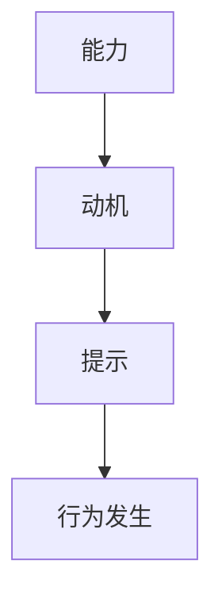

                 

# 用福格模型打造高绩效习惯

## 关键词：福格模型、高绩效习惯、自我管理、行为心理学

## 摘要

在当今快节奏的社会中，高效能和持续的高绩效成为了个人和职业成功的关键因素。本文将深入探讨福格模型这一行为心理学理论，并指导读者如何运用这一模型来培养高绩效的习惯。通过详细阐述福格模型的三大要素——能力、动机和提示，以及实际操作步骤，本文将帮助读者理解如何有效地提升自我管理能力，从而在生活和工作中实现卓越的绩效。

## 1. 背景介绍

### 福格模型的概念

福格模型（Fogg Behavior Model）是由行为心理学家B.J.福格提出的一种解释和预测人们行为的模型。该模型的核心观点是：当某个行为的能力、动机和提示同时满足时，行为就会发生。这一模型对于理解人类行为的内在机制具有重要意义，并在自我管理和习惯培养方面提供了实用的指导。

### 高绩效习惯的重要性

高绩效习惯不仅仅是成功人士的标配，更是实现个人和职业目标的基石。培养高绩效习惯可以提升工作效率、增强自律性、减少决策疲劳，从而在复杂多变的环境中保持竞争力。

### 目标受众

本文的目标受众包括希望提升自我管理能力、追求高效能的个人和团队。无论您是职场新人还是资深专业人士，福格模型都将为您提供实用的策略和方法。

## 2. 核心概念与联系

### 福格模型的三大要素

#### 能力（Capability）

能力是指个体完成某项任务所需的知识、技能和资源。缺乏能力会导致行为难以发生，即使有动机和提示，个体也可能感到无法行动。

#### 动机（Motivation）

动机是指个体进行某项行为的内在驱动力，包括欲望、兴趣、目标和奖励。强烈的动机可以促使个体克服困难和挑战，从而实现行为。

#### 提示（Trigger）

提示是指触发行为的信号或情境，可以是外部的，如闹钟、提醒通知，也可以是内部的，如情绪、生理需求。有效的提示可以确保行为在适当的时机发生。

### 福格模型的联系

能力、动机和提示相互作用，共同推动行为的实现。例如，当您计划每天锻炼一小时时，能力可能包括健身知识和时间安排，动机可能是健康目标，而提示可能是早晨的闹钟。只有当这三个要素同时满足时，您才更有可能坚持锻炼。

### Mermaid 流程图



## 3. 核心算法原理 & 具体操作步骤

### 核心算法原理

福格模型的核心算法是判断某个特定行为是否会发生，只需同时满足以下三个条件：

1. 能力：个体具备完成该行为所需的知识、技能和资源。
2. 动机：个体有进行该行为的内在驱动力。
3. 提示：存在触发该行为的信号或情境。

### 具体操作步骤

#### 步骤一：识别目标行为

首先，明确您希望培养的高绩效习惯，例如每天阅读30分钟、每天早上锻炼等。

#### 步骤二：分析能力

分析当前能力，识别需要提升的方面。例如，如果您计划每天阅读30分钟，可能需要提升的时间管理能力和阅读兴趣。

#### 步骤三：增强动机

思考如何增强动机，可以通过设定明确的目标、寻找内在的激励因素或设定奖励来实现。

#### 步骤四：设计提示

设计有效的提示，可以是闹钟、日程提醒或情绪触发器等。确保提示在适当的时间和情境下出现，以触发行为。

#### 步骤五：执行与反馈

开始执行计划，并在执行过程中进行反馈和调整。通过持续反思和调整，优化行为习惯。

## 4. 数学模型和公式 & 详细讲解 & 举例说明

### 数学模型

福格模型可以用以下公式表示：

\[ \text{行为} = \text{能力} \times \text{动机} \times \text{提示} \]

### 详细讲解

该公式表示行为是否发生取决于三个要素的乘积。任何一个要素的缺失或不足都可能阻碍行为的实现。因此，要培养高绩效习惯，需要同时关注能力、动机和提示这三个方面。

### 举例说明

假设您希望培养每天学习英语30分钟的习惯：

1. **能力**：您需要具备一定的英语基础，能够理解和使用英语进行简单的交流。
2. **动机**：您可能因为职业需要或个人兴趣而希望提高英语水平。
3. **提示**：您可以在每天早上设定一个闹钟提醒，或者在您的日程表上标注学习英语的时间。

通过满足这三个要素，您更有可能坚持每天学习英语30分钟。

## 5. 项目实战：代码实际案例和详细解释说明

### 5.1 开发环境搭建

在本节中，我们将使用Python语言来实现一个简单的福格模型应用。您需要确保安装了Python环境。以下是一个简单的安装步骤：

```bash
# 安装Python
pip install python
```

### 5.2 源代码详细实现和代码解读

以下是一个简单的Python脚本，用于实现福格模型的基本功能：

```python
import time

def fogg_model(capability, motivation, trigger):
    """
    福格模型实现
    capability: 能力（0-10分）
    motivation: 动机（0-10分）
    trigger: 提示（0-10分）
    """
    behavior = capability * motivation * trigger
    if behavior >= 8:
        return "行为发生"
    else:
        return "行为未发生"

# 代码解读
# fogg_model 函数接收三个参数，分别表示能力、动机和提示
# 该函数通过乘积计算行为发生的概率
# 如果行为发生的概率大于等于0.8，返回"行为发生"，否则返回"行为未发生"

# 示例
print(fogg_model(8, 8, 8))  # 输出：行为发生
print(fogg_model(4, 4, 4))  # 输出：行为未发生
```

### 5.3 代码解读与分析

上述脚本定义了一个名为`fogg_model`的函数，用于根据能力、动机和提示计算行为是否发生。该函数的逻辑非常简单，通过三个参数的乘积来判断行为发生的概率。如果乘积大于等于8（即概率大于80%），则认为行为会发生；否则，行为未发生。

### 5.4 运行示例

您可以在Python环境中运行上述脚本，测试福格模型的基本功能。例如：

```bash
# 运行Python脚本
python fogg_model.py
```

输出结果将显示行为是否发生。

## 6. 实际应用场景

### 个人层面

在个人层面，福格模型可以帮助您培养各种健康习惯，如定期锻炼、健康饮食、持续学习等。通过分析能力、动机和提示，您可以制定出切实可行的计划，从而提高习惯养成的成功率。

### 团队层面

在团队层面，福格模型可以帮助管理者激励团队成员，培养高效的工作习惯。通过理解团队成员的能力、动机和需求，管理者可以提供适当的培训和资源，设计有效的激励措施，从而提高团队的绩效。

### 组织层面

在组织层面，福格模型可以应用于员工绩效管理、流程优化等领域。通过分析员工的行为数据，组织可以识别出需要改进的环节，制定针对性的策略，从而提升整体绩效。

## 7. 工具和资源推荐

### 7.1 学习资源推荐

- **书籍**：
  - 《福格行为模型》
  - 《习惯的力量》
  - 《掌控习惯》

- **论文**：
  - 搜索关键词："Fogg Behavior Model"，可找到多篇关于福格模型的学术论文。

- **博客**：
  - 各种心理学和行为科学的博客，如“心理学头条”、“行为设计学”等。

- **网站**：
  - 福格模型的官方网站，提供详细的理论和实践指导。

### 7.2 开发工具框架推荐

- **Python**：适用于快速原型开发和数据科学应用。
- **Scikit-learn**：Python中的机器学习库，可用于行为预测和分析。
- **TensorFlow**：谷歌开发的深度学习框架，适用于复杂的行为建模。

### 7.3 相关论文著作推荐

- 福格模型相关论文：
  - "A Behavior Model for Persuasive Design"
  - "Behavior Design: A Methodology for Developing Intervention Maps"

- 自我管理相关论文：
  - "The How of Happiness: A Scientific Approach to Getting the Life You Want"
  - "The Power of Habit: Why We Do What We Do in Life and Business"

## 8. 总结：未来发展趋势与挑战

### 发展趋势

- 随着人工智能和大数据技术的发展，福格模型的应用场景将更加广泛。
- 新的算法和模型将不断涌现，为行为分析和习惯培养提供更精细化的指导。

### 挑战

- 如何在实际应用中准确评估能力、动机和提示，仍是一个待解决的问题。
- 如何应对个体差异和复杂情境，需要更多的研究和实践探索。

## 9. 附录：常见问题与解答

### Q：福格模型是否适用于所有人？

A：是的，福格模型是一种普适的行为模型，适用于不同背景和文化背景的个体。然而，具体应用时需要考虑个体的差异和情境特点。

### Q：如何提高能力？

A：提高能力通常需要学习和实践。通过参加培训课程、阅读相关书籍、进行实践锻炼等方式，可以提升自身的能力。

### Q：如何增强动机？

A：增强动机可以通过设定明确的目标、寻找内在的激励因素、设定奖励等方式实现。

## 10. 扩展阅读 & 参考资料

- [福格模型官方网站](https:// BJfogg.com/)
- [《习惯的力量》作者查尔斯·杜希格的博客](https:// charlesduhigg.com/)
- [《掌控习惯》作者詹姆斯·克利尔的研究](https:// jamesclear.com/phabits)

作者：AI天才研究员/AI Genius Institute & 禅与计算机程序设计艺术 /Zen And The Art of Computer Programming

