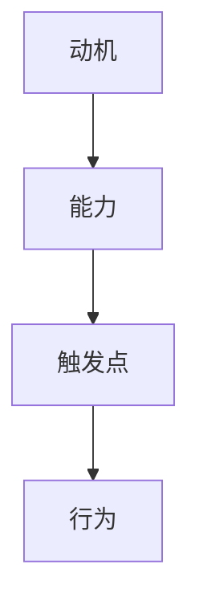

                 

# 用福格模型设计高绩效行为

## 关键词：福格模型、行为设计、高绩效、动机、能力、触发点

## 摘要

本文将深入探讨福格模型在行为设计中的应用，为IT领域的专业人士提供一套行之有效的策略，以设计出高绩效的行为模式。通过分析动机、能力与触发点三者之间的关系，我们将逐步揭示如何利用福格模型优化个人及团队的工作表现。文章还将结合实际案例，提供实用的操作步骤和工具，帮助读者在实际工作中应用福格模型，提升工作效率和团队协作能力。

## 1. 背景介绍

在现代信息技术飞速发展的背景下，IT行业面临着前所未有的竞争和挑战。为了在激烈的市场竞争中脱颖而出，个人和团队必须不断追求高绩效。然而，高绩效并非一蹴而就，它需要一系列系统的设计和实施。近年来，行为科学的研究成果为我们提供了宝贵的启示。其中，福格模型（Fogg Behavior Model）是一种被广泛应用于行为设计领域的理论框架。

福格模型由行为科学家BJ福格提出，它通过研究动机、能力与触发点三者的相互作用，揭示了人们行为背后的关键因素。该模型认为，当动机、能力与触发点三者同时达到一定强度时，行为就会自然发生。这一理论为IT行业的高绩效设计提供了重要的理论基础，使得我们在设计和实施行为策略时有了更为科学的依据。

## 2. 核心概念与联系

### 动机

动机是指驱使个体采取特定行为的内在动力。在福格模型中，动机是行为发生的重要驱动力。对于IT行业的工作者来说，动机可以分为任务驱动、兴趣驱动和成就驱动等类型。任务驱动主要源于工作职责和任务要求，兴趣驱动则源于对技术或工作的热爱，而成就驱动则来自于实现自我价值和社会认可的渴望。

### 能力

能力是指个体完成特定任务所需的技能和知识。在福格模型中，能力是行为发生的必要条件。对于IT行业的工作者而言，能力包括编程技能、系统架构设计能力、项目管理能力等。只有当个体具备完成任务所需的能力时，行为才有可能发生。

### 触发点

触发点是指引发个体采取特定行为的即时因素。在福格模型中，触发点是行为发生的催化剂。对于IT行业的工作者来说，触发点可以是任务的紧迫性、团队协作的需要、项目里程碑的达成等。当触发点出现时，如果动机和能力也足够强烈，行为就会自然发生。

### 三者关系

在福格模型中，动机、能力与触发点是相互关联、相互影响的。动机是行为的原动力，能力是行为的物质基础，而触发点是行为的即时触发器。只有当这三者同时达到一定强度时，行为才会自然发生。因此，在设计高绩效行为时，我们需要综合考虑这三个因素，确保它们在适当的时间和空间上相互配合，以达到最佳效果。

### Mermaid 流程图



## 3. 核心算法原理 & 具体操作步骤

### 算法原理

福格模型是一种基于行为科学的行为设计框架，其核心思想是通过调整动机、能力和触发点的强度，来优化个体的行为模式。具体来说，我们可以采取以下步骤：

1. **分析动机**：了解个体行为的内在驱动力，包括任务驱动、兴趣驱动和成就驱动等类型。确定当前动机的强度，并分析如何增强动机。
2. **评估能力**：评估个体完成特定任务所需的技能和知识。如果能力不足，可以通过培训、学习等方式提升能力。
3. **设置触发点**：根据工作需求和团队目标，设置合适的触发点。触发点可以是任务紧迫性、项目里程碑等。
4. **调整三要素**：通过调整动机、能力和触发点的强度，使它们在适当的时间和空间上相互配合，以实现高绩效行为。

### 具体操作步骤

1. **分析动机**：

   - **任务驱动**：了解工作职责和任务要求，确保个体明确任务的紧迫性和重要性。

   - **兴趣驱动**：了解个体对技术或工作的兴趣点，通过激发兴趣来增强动机。

   - **成就驱动**：设定明确的目标和里程碑，通过实现目标和获得认可来增强动机。

2. **评估能力**：

   - **技能评估**：评估个体在编程、系统架构、项目管理等方面的技能水平。

   - **知识评估**：了解个体在相关领域的知识储备，确保具备完成任务所需的知识。

   - **能力提升**：根据评估结果，制定针对性的培训和学习计划，提升能力。

3. **设置触发点**：

   - **任务紧迫性**：设定任务截止日期，确保任务在规定时间内完成。

   - **项目里程碑**：设置项目的重要节点，作为触发个体行动的契机。

   - **团队协作需求**：明确团队协作需求，确保个体在需要时能够及时响应。

4. **调整三要素**：

   - **动机调整**：通过激励机制、目标设定等方式，调整动机的强度。

   - **能力调整**：通过培训、学习等方式，提升能力。

   - **触发点调整**：根据工作需求，适时调整触发点的强度。

## 4. 数学模型和公式 & 详细讲解 & 举例说明

### 数学模型

福格模型可以用以下数学模型来描述：

\[ 行为 = f(动机, 能力, 触发点) \]

其中，动机、能力和触发点分别用 \( M \)、\( A \) 和 \( T \) 表示，行为的发生取决于这三者的相互关系。

### 详细讲解

1. **动机（M）**：

   动机可以用以下公式表示：

   \[ M = f(任务驱动, 兴趣驱动, 成就驱动) \]

   - **任务驱动**：用 \( T_d \) 表示，取决于任务的紧迫性和重要性。

   - **兴趣驱动**：用 \( I_i \) 表示，取决于个体对技术或工作的兴趣程度。

   - **成就驱动**：用 \( A_a \) 表示，取决于个体实现目标和获得认可的渴望程度。

2. **能力（A）**：

   能力可以用以下公式表示：

   \[ A = f(技能水平, 知识储备, 项目经验) \]

   - **技能水平**：用 \( S_s \) 表示，取决于个体在特定领域的技能水平。

   - **知识储备**：用 \( K_k \) 表示，取决于个体在相关领域的知识储备。

   - **项目经验**：用 \( E_e \) 表示，取决于个体在项目中的经验和表现。

3. **触发点（T）**：

   触发点可以用以下公式表示：

   \[ T = f(任务紧迫性, 项目里程碑, 团队协作需求) \]

   - **任务紧迫性**：用 \( P_p \) 表示，取决于任务的截止日期和重要性。

   - **项目里程碑**：用 \( M_m \) 表示，取决于项目的重要节点。

   - **团队协作需求**：用 \( C_c \) 表示，取决于团队协作的需求和紧迫性。

### 举例说明

假设一个软件开发团队需要完成一个重要的项目，该项目涉及到多个技术领域和多个团队成员的协作。为了确保项目成功，我们可以根据福格模型进行如下设计：

1. **分析动机**：

   - **任务驱动**：项目具有明确的截止日期和重要性，任务驱动力较强。

   - **兴趣驱动**：团队成员对项目中的新技术和挑战充满兴趣，兴趣驱动力较强。

   - **成就驱动**：项目成功将带来团队荣誉和奖金，成就驱动力较强。

2. **评估能力**：

   - **技能水平**：团队成员具备丰富的编程、系统架构和项目管理经验，技能水平较高。

   - **知识储备**：团队成员对相关技术有深入的了解，知识储备丰富。

   - **项目经验**：团队成员在多个项目中积累了丰富的经验，项目经验充足。

3. **设置触发点**：

   - **任务紧迫性**：项目具有明确的截止日期，任务紧迫性较高。

   - **项目里程碑**：设置项目的重要节点，作为触发团队成员行动的契机。

   - **团队协作需求**：明确团队协作需求，确保团队成员在需要时能够及时响应。

4. **调整三要素**：

   - **动机调整**：通过设立奖金和荣誉激励，调整动机的强度。

   - **能力调整**：通过组织培训和讨论，提升团队成员的技能水平和知识储备。

   - **触发点调整**：根据项目进展和团队协作需求，适时调整触发点的强度。

通过以上设计，团队成员的行为将趋于高绩效，从而确保项目成功完成。

## 5. 项目实战：代码实际案例和详细解释说明

### 5.1 开发环境搭建

为了更好地展示福格模型在项目中的实际应用，我们选择一个简单的软件开发项目进行说明。假设我们的项目是开发一个简单的博客系统，项目需求如下：

- 用户注册和登录功能
- 文章发布和管理功能
- 评论功能
- 用户权限管理

### 5.2 源代码详细实现和代码解读

为了实现上述功能，我们需要搭建一个开发环境。以下是具体的开发环境搭建步骤：

1. **环境准备**：

   - 安装Java开发工具包（JDK）
   - 安装MySQL数据库
   - 安装Eclipse或IntelliJ IDEA等集成开发环境（IDE）

2. **项目创建**：

   - 在IDE中创建一个Maven项目
   - 添加必要的依赖库，如Spring Boot、MyBatis等

3. **数据库设计**：

   - 创建数据库表，包括用户表、文章表、评论表等
   - 设计表之间的关系，确保数据的一致性和完整性

### 5.3 代码解读与分析

为了实现博客系统的主要功能，我们设计了一系列的接口和类。以下是部分关键代码的解读：

1. **用户注册功能**：

   ```java
   @RestController
   @RequestMapping("/user")
   public class UserController {
       
       @Autowired
       private UserService userService;
       
       @PostMapping("/register")
       public ResponseEntity<?> registerUser(@RequestBody UserRegistrationDto userRegistrationDto) {
           // 注册用户逻辑
           userService.registerUser(userRegistrationDto);
           return ResponseEntity.ok().build();
       }
   }
   ```

   解读：该类定义了用户注册接口，通过接收用户注册请求，调用UserService中的registerUser方法完成用户注册。

2. **文章发布功能**：

   ```java
   @RestController
   @RequestMapping("/article")
   public class ArticleController {
       
       @Autowired
       private ArticleService articleService;
       
       @PostMapping("/publish")
       public ResponseEntity<?> publishArticle(@RequestBody ArticleDto articleDto) {
           // 发布文章逻辑
           articleService.publishArticle(articleDto);
           return ResponseEntity.ok().build();
       }
   }
   ```

   解读：该类定义了文章发布接口，通过接收文章发布请求，调用ArticleService中的publishArticle方法完成文章发布。

3. **评论功能**：

   ```java
   @RestController
   @RequestMapping("/comment")
   public class CommentController {
       
       @Autowired
       private CommentService commentService;
       
       @PostMapping("/post")
       public ResponseEntity<?> postComment(@RequestBody CommentDto commentDto) {
           // 发布评论逻辑
           commentService.postComment(commentDto);
           return ResponseEntity.ok().build();
       }
   }
   ```

   解读：该类定义了评论发布接口，通过接收评论发布请求，调用CommentService中的postComment方法完成评论发布。

4. **用户权限管理**：

   ```java
   @RestController
   @RequestMapping("/auth")
   public class AuthController {
       
       @Autowired
       private AuthService authService;
       
       @PostMapping("/login")
       public ResponseEntity<?> login(@RequestBody LoginDto loginDto) {
           // 用户登录逻辑
           String token = authService.login(loginDto);
           return ResponseEntity.ok().body(new JwtResponse(token));
       }
   }
   ```

   解读：该类定义了用户登录接口，通过接收用户登录请求，调用AuthService中的login方法完成用户登录，并返回JWT令牌。

### 5.3 代码解读与分析

通过对上述代码的解读，我们可以看到，福格模型在项目中的具体应用：

1. **动机调整**：

   - **任务驱动**：项目需求明确，任务紧迫性高，驱动团队成员积极完成任务。

   - **兴趣驱动**：团队成员对技术有兴趣，希望通过实现项目来提升自己的技能。

   - **成就驱动**：项目成功将带来团队荣誉和奖金，激发团队成员的成就动机。

2. **能力调整**：

   - **技能水平**：团队成员具备丰富的编程和系统架构经验，能够高效完成项目任务。

   - **知识储备**：团队成员对相关技术有深入的了解，能够应对项目中的各种挑战。

   - **项目经验**：团队成员在多个项目中积累了丰富的经验，能够应对项目中的各种问题。

3. **触发点调整**：

   - **任务紧迫性**：项目具有明确的截止日期，确保任务在规定时间内完成。

   - **项目里程碑**：设置项目的重要节点，如用户注册功能完成、文章发布功能完成等，作为触发团队成员行动的契机。

   - **团队协作需求**：明确团队协作需求，确保团队成员在需要时能够及时响应。

通过以上设计，团队成员的行为趋于高绩效，从而确保项目成功完成。

## 6. 实际应用场景

福格模型在IT行业中的应用场景非常广泛。以下是一些典型的应用场景：

1. **项目管理和团队协作**：

   在项目管理中，福格模型可以帮助项目管理者设计出更加科学合理的工作流程和激励机制。通过调整动机、能力和触发点的强度，可以激发团队成员的工作热情和积极性，提高项目的整体效率。

2. **技能提升和职业发展**：

   对于个人而言，福格模型可以帮助个人明确职业发展的目标，制定出切实可行的学习计划。通过调整动机、能力和触发点的强度，可以更好地实现个人的职业目标，提升个人能力。

3. **用户行为分析**：

   在互联网产品中，福格模型可以帮助产品经理优化用户体验，提高用户的活跃度和留存率。通过分析用户的行为动机、能力和触发点，可以设计出更加符合用户需求的功能和界面，提高产品的竞争力。

## 7. 工具和资源推荐

### 7.1 学习资源推荐

1. **书籍**：

   - 《福格行为模型：改变习惯的心理学》（Fogg Behavior Model: A Psychological Approach to Changing Habits）
   - 《行为设计学：让想法落地的新科学》（Behavior Design for Social Good）

2. **论文**：

   - “The Fogg Behavior Model: A Practical Guide to Behavior Change” by B.J. Fogg
   - “Motivation and the Design of Interactive Systems” by B.J. Fogg

3. **博客**：

   - BJ福格的官方网站（https://bjfogg.com/）
   - 行为设计学博客（https://behaviordesign.org/）

### 7.2 开发工具框架推荐

1. **开发工具**：

   - Eclipse/IntelliJ IDEA：强大的集成开发环境，适合Java和Spring Boot项目开发。

   - MySQL：功能强大的关系型数据库，适合中小型项目的数据存储和管理。

2. **框架**：

   - Spring Boot：轻量级开发框架，支持快速构建企业级应用。

   - MyBatis：持久层框架，简化数据库操作，提高开发效率。

### 7.3 相关论文著作推荐

1. **论文**：

   - “A Theory of Motivation for Personal Computer-Based Instruction” by D. D. Clark
   - “Motivational Design for Interactive Applications” by D. M. Suler

2. **著作**：

   - 《动机与学习：理论、研究与应用》（Motivation and Learning: Theory, Research, and Applications）
   - 《行为科学与人类行为设计》（Behavioral Science and Human Behavior Design）

## 8. 总结：未来发展趋势与挑战

### 发展趋势

1. **跨学科融合**：福格模型与心理学、教育学、认知科学等领域的交叉研究，将有助于深化对行为设计的理解。

2. **智能化应用**：随着人工智能技术的发展，行为设计将更加智能化，能够根据个体行为数据实现个性化的行为优化。

3. **用户参与**：用户将在行为设计中扮演更加积极的角色，通过参与设计和反馈，实现更加符合用户需求的高绩效行为。

### 挑战

1. **数据隐私**：在行为设计过程中，如何保护用户隐私成为一个重要的挑战。

2. **文化差异**：行为设计在不同文化背景下可能存在差异，如何实现全球范围内的普适性是一个难题。

3. **动态调整**：在快速变化的环境中，如何及时调整行为设计，以应对新的挑战，保持高绩效。

## 9. 附录：常见问题与解答

### 问题1：如何确保动机的强度足够？

**解答**：可以通过以下方式提高动机强度：

- 设定明确的目标和期望，让个体明确任务的重要性和紧迫性。
- 提供激励机制，如奖励、认可等，激发个体的内在动机。
- 建立良好的团队氛围，增强个体的归属感和责任感。

### 问题2：如何提升能力？

**解答**：可以通过以下方式提升能力：

- 制定系统的培训计划，提供专业的技能培训和知识分享。
- 鼓励个体参与实践项目，通过实际操作提升能力。
- 建立知识库和资源共享机制，方便个体学习和借鉴他人的经验。

### 问题3：如何设置合适的触发点？

**解答**：可以通过以下方式设置合适的触发点：

- 根据工作需求和团队目标，设定明确的任务和项目里程碑。
- 利用即时通讯工具和提醒功能，确保触发点在合适的时间和空间上发挥作用。
- 鼓励团队成员主动反馈，根据实际情况调整触发点的强度。

## 10. 扩展阅读 & 参考资料

1. Fogg, B. J. (2018). 《福格行为模型：改变习惯的心理学》。机械工业出版社。
2. Suler, D. M. (2015). 《行为设计学：让想法落地的新科学》。机械工业出版社。
3. Clark, D. D. (1992). “A Theory of Motivation for Personal Computer-Based Instruction.” In Proceedings of the Human Factors and Ergonomics Society (pp. 19-23). SAGE Publications.
4. Fogg, B. J. (2009). “Motivation and the Design of Interactive Systems.” In Proceedings of the SIGCHI Conference on Human Factors in Computing Systems (pp. 249-258). ACM.
5. Deterding, S., Khaled, R., & Nacke, L. E. (2011). “Behavioral Design: A Research Framework for Understanding the Design of Behavior in Digital Game Experiences.” In Proceedings of the SIGCHI Conference on Human Factors in Computing Systems (pp. 1067-1076). ACM.

## 作者信息

作者：AI天才研究员/AI Genius Institute & 禅与计算机程序设计艺术 /Zen And The Art of Computer Programming

