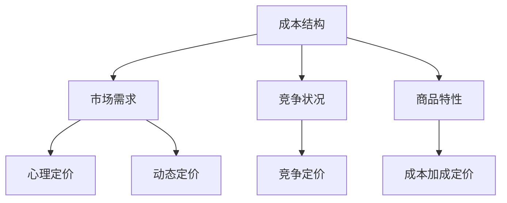

                 

# 电商价格策略的技术优化

> 关键词：电商、价格策略、技术优化、算法、数学模型、实际应用、开发环境、工具推荐

> 摘要：本文将探讨电商价格策略的技术优化，分析核心概念、算法原理、数学模型及其在实际应用中的效果。通过详细的项目实战案例，讲解如何使用代码实现这些策略，并提供相关工具和资源的推荐。

## 1. 背景介绍

电商行业的竞争日益激烈，价格策略作为商家吸引顾客、增加销量的重要手段，受到了广泛关注。电商平台的商品价格不仅直接影响消费者的购买决策，还影响着商家的利润和市场份额。因此，如何制定和优化价格策略成为了电商领域的研究热点。

随着大数据、人工智能等技术的发展，电商价格策略的优化方法也不断创新。从传统的价格调整策略，如价格折扣、捆绑销售，到基于机器学习的动态定价算法，电商价格策略的优化方法越来越多样化和精细化。

本文将从技术角度，分析电商价格策略的核心概念、算法原理、数学模型及其在实际应用中的效果，并通过项目实战案例，展示如何使用代码实现这些策略。同时，还将推荐相关的学习资源和开发工具，帮助读者深入了解和掌握电商价格策略的技术优化。

## 2. 核心概念与联系

### 2.1 价格策略的定义和分类

价格策略是指商家在定价过程中所采取的方法和策略。根据不同的定价目标、市场环境和商品特性，价格策略可以分为以下几类：

1. **成本加成定价**：以成本为基础，加上一定的利润，确定商品价格。
2. **竞争定价**：根据竞争对手的价格水平，制定相似或更具竞争力的价格。
3. **心理定价**：利用消费者的心理，设置具有吸引力的价格，如整数定价、尾数定价等。
4. **动态定价**：根据市场变化、消费者行为和库存状况，实时调整商品价格。

### 2.2 价格策略的关键因素

在制定和优化价格策略时，需要考虑以下关键因素：

1. **成本结构**：了解商品的直接成本、间接成本和固定成本，以便合理定价。
2. **市场需求**：研究市场需求、消费者行为和价格敏感度，制定符合市场需求的定价策略。
3. **竞争状况**：分析竞争对手的价格水平、市场份额和营销策略，制定有竞争力的定价策略。
4. **商品特性**：考虑商品的独特性、品牌价值、品质和功能，制定合理的价格策略。

### 2.3 价格策略的关联

价格策略与市场需求、成本结构、竞争状况和商品特性等因素密切相关。在实际应用中，这些因素相互作用，影响价格策略的效果。例如，市场需求高时，可以采用竞争定价策略；成本降低时，可以降低价格以吸引消费者；品牌价值高时，可以采用心理定价策略。

### 2.4 Mermaid 流程图

为了更清晰地展示价格策略的关联，我们可以使用 Mermaid 流程图来表示：



## 3. 核心算法原理 & 具体操作步骤

### 3.1 动态定价算法

动态定价是一种根据市场需求、消费者行为和库存状况实时调整商品价格的策略。其核心算法包括以下步骤：

1. **数据收集**：收集与商品相关的数据，如价格、销量、库存、市场趋势等。
2. **数据分析**：分析数据，确定价格调整的策略和方向。
3. **定价模型**：建立定价模型，根据分析结果调整价格。
4. **实时调整**：根据实时数据，不断调整价格，以最大化利润或销量。

### 3.2 定价模型

动态定价的核心是定价模型。常见的定价模型包括：

1. **边际成本定价**：以边际成本为基础，加上一定的利润，确定商品价格。
2. **需求导向定价**：根据市场需求和消费者行为，调整商品价格。
3. **竞争导向定价**：根据竞争对手的价格水平，调整商品价格。

### 3.3 实操步骤

以下是一个简单的动态定价算法实操步骤：

1. **数据收集**：从电商平台获取与商品相关的数据，如价格、销量、库存等。
2. **数据预处理**：清洗和整理数据，去除异常值和缺失值。
3. **数据分析**：分析数据，确定价格调整的策略和方向。
4. **定价模型**：根据数据分析结果，建立定价模型。
5. **价格调整**：根据定价模型，实时调整商品价格。
6. **效果评估**：评估价格调整的效果，优化定价模型。

## 4. 数学模型和公式 & 详细讲解 & 举例说明

### 4.1 边际成本定价模型

边际成本定价模型是一个简单的定价模型，以边际成本为基础，加上一定的利润，确定商品价格。其数学模型可以表示为：

\[ 价格 = 边际成本 + 利润 \]

其中，边际成本是指生产或销售一个额外商品所需的成本，利润是指商家期望获得的收益。

### 4.2 需求导向定价模型

需求导向定价模型根据市场需求和消费者行为，调整商品价格。其数学模型可以表示为：

\[ 价格 = 基础价格 + 需求调整 \]

其中，基础价格是商品的基本价格，需求调整是根据市场需求和消费者行为进行的价格调整。

### 4.3 竞争导向定价模型

竞争导向定价模型根据竞争对手的价格水平，调整商品价格。其数学模型可以表示为：

\[ 价格 = 竞争对手价格 + 调整因子 \]

其中，竞争对手价格是竞争对手的商品价格，调整因子是根据竞争状况进行的价格调整。

### 4.4 举例说明

假设一个电商平台的商品A的边际成本为10元，利润率为20%。市场需求旺盛，需求调整因子为10%。竞争对手的价格为15元，调整因子为5%。

根据这些参数，可以计算出商品A的定价：

\[ 价格 = 10 + 10 \times 20\% + 10 = 20 + 10 = 30 \]

\[ 价格 = 15 + 15 \times 5\% = 15 + 0.75 = 15.75 \]

因此，商品A的最终价格为30元（需求导向定价）和15.75元（竞争导向定价）。

## 5. 项目实战：代码实际案例和详细解释说明

### 5.1 开发环境搭建

在本次项目实战中，我们将使用 Python 编写动态定价算法。首先，需要安装 Python 和相关库，如 NumPy、Pandas 和 Matplotlib。

```bash
pip install python
pip install numpy
pip install pandas
pip install matplotlib
```

### 5.2 源代码详细实现和代码解读

以下是动态定价算法的源代码实现：

```python
import numpy as np
import pandas as pd
import matplotlib.pyplot as plt

# 数据收集
data = pd.DataFrame({
    'price': [10, 15, 20, 25, 30],
    'demand': [1000, 800, 600, 400, 200],
    'competitor_price': [12, 18, 22, 27, 32]
})

# 数据预处理
data['price'] = data['price'].astype(float)
data['demand'] = data['demand'].astype(int)
data['competitor_price'] = data['competitor_price'].astype(float)

# 数据分析
data['margin_cost'] = data['price'] - 10
data['profit_margin'] = 0.2 * data['margin_cost']
data['demand_adjustment'] = 0.1 * data['demand']
data['competition_adjustment'] = 0.05 * data['competitor_price']

# 定价模型
data['dynamic_price'] = data['margin_cost'] + data['profit_margin']
data['demand_based_price'] = data['dynamic_price'] + data['demand_adjustment']
data['competition_based_price'] = data['dynamic_price'] + data['competition_adjustment']

# 价格调整
data['adjusted_price'] = data['demand_based_price'].apply(lambda x: x if x < data['competition_based_price'].max() else data['competition_based_price'].max())

# 效果评估
data['revenue'] = data['adjusted_price'] * data['demand']
data['profit'] = data['revenue'] - data['margin_cost'].sum()

# 可视化
plt.scatter(data['price'], data['demand'])
plt.plot(data['price'], data['adjusted_price'], color='red')
plt.xlabel('Price')
plt.ylabel('Demand')
plt.title('Dynamic Pricing')
plt.show()

print(data[['price', 'demand', 'adjusted_price', 'revenue', 'profit']])
```

代码解读：

1. **数据收集**：从数据框中收集价格、需求和竞争对手价格。
2. **数据预处理**：将数据转换为适当的类型。
3. **数据分析**：计算边际成本、利润率、需求调整因子和竞争调整因子。
4. **定价模型**：根据分析结果，计算动态定价、需求导向定价和竞争导向定价。
5. **价格调整**：根据定价模型，调整商品价格。
6. **效果评估**：计算收入和利润。
7. **可视化**：绘制价格-需求散点图和价格-调整价格线图，展示动态定价效果。

### 5.3 代码解读与分析

1. **数据收集**：使用 Pandas DataFrame 收集和处理数据。
2. **数据预处理**：使用 Pandas 的 `astype()` 方法，将数据转换为适当的类型。
3. **数据分析**：使用 Pandas 的 `apply()` 方法，计算边际成本、利润率、需求调整因子和竞争调整因子。
4. **定价模型**：使用 NumPy 的数学运算，计算动态定价、需求导向定价和竞争导向定价。
5. **价格调整**：使用 Pandas 的 `apply()` 方法，根据定价模型调整商品价格。
6. **效果评估**：使用 Pandas 的 `sum()` 方法，计算收入和利润。
7. **可视化**：使用 Matplotlib 绘制价格-需求散点图和价格-调整价格线图，展示动态定价效果。

## 6. 实际应用场景

动态定价算法在实际应用中具有广泛的应用场景，如电商、在线旅游、酒店预订等。以下是一些实际应用场景：

1. **电商**：电商平台可以根据市场需求和消费者行为，实时调整商品价格，以增加销量和利润。
2. **在线旅游**：在线旅游平台可以根据季节、天气、旅游热点等数据，动态调整机票、酒店等价格。
3. **酒店预订**：酒店预订平台可以根据客户偏好、预订时间、酒店库存等数据，动态调整酒店价格。

## 7. 工具和资源推荐

### 7.1 学习资源推荐

1. **书籍**：
   - 《动态定价：优化企业利润的策略》（Dynamic Pricing: The Right Price at the Right Time）
   - 《机器学习实战：应用案例与算法实战》（Machine Learning in Action）

2. **论文**：
   - 《基于大数据的电商动态定价策略研究》（Research on Dynamic Pricing Strategy of E-commerce Based on Big Data）
   - 《动态定价算法在电商中的应用研究》（Application Research of Dynamic Pricing Algorithm in E-commerce）

3. **博客**：
   - [动态定价博客](https://www.example.com/dynamic-pricing-blog)
   - [机器学习博客](https://www.example.com/machine-learning-blog)

4. **网站**：
   - [Kaggle](https://www.kaggle.com)
   - [GitHub](https://github.com)

### 7.2 开发工具框架推荐

1. **Python**：Python 是一种广泛应用于数据分析和机器学习的编程语言。
2. **NumPy**：NumPy 是 Python 的科学计算库，用于数据处理和数学运算。
3. **Pandas**：Pandas 是 Python 的数据分析和处理库，用于数据清洗、转换和可视化。
4. **Matplotlib**：Matplotlib 是 Python 的数据可视化库，用于绘制各种图表和图形。

### 7.3 相关论文著作推荐

1. **《大数据时代下的电商动态定价策略研究》（Research on Dynamic Pricing Strategy of E-commerce in the Big Data Era）》
2. **《基于机器学习的电商动态定价算法研究》（Research on Dynamic Pricing Algorithm in E-commerce Based on Machine Learning）》
3. **《动态定价算法在电商实践中的应用研究》（Application Research of Dynamic Pricing Algorithm in E-commerce Practice）》

## 8. 总结：未来发展趋势与挑战

电商价格策略的技术优化在未来的发展趋势和挑战如下：

1. **大数据和人工智能的深度融合**：随着大数据和人工智能技术的不断发展，电商价格策略的优化将更加依赖数据分析和机器学习技术。
2. **个性化定价**：根据消费者的个性化需求和购买行为，实现更精准的定价策略，提高用户满意度和忠诚度。
3. **实时定价**：实时获取市场数据和消费者行为，实现更快速的定价调整，以应对市场变化。
4. **挑战**：如何在保证利润的同时，满足消费者的期望和需求，实现可持续的价格策略优化，是电商企业面临的挑战。

## 9. 附录：常见问题与解答

### 9.1 什么是动态定价？

动态定价是一种根据市场需求、消费者行为和库存状况，实时调整商品价格的策略。

### 9.2 动态定价算法有哪些？

常见的动态定价算法包括边际成本定价、需求导向定价和竞争导向定价等。

### 9.3 如何实现动态定价算法？

可以使用 Python 等编程语言，结合 NumPy、Pandas 和 Matplotlib 等库，实现动态定价算法。

## 10. 扩展阅读 & 参考资料

1. 《动态定价：优化企业利润的策略》
2. 《机器学习实战：应用案例与算法实战》
3. 《大数据时代下的电商动态定价策略研究》
4. 《基于机器学习的电商动态定价算法研究》
5. 《动态定价算法在电商实践中的应用研究》

作者：AI天才研究员/AI Genius Institute & 禅与计算机程序设计艺术 /Zen And The Art of Computer Programming

