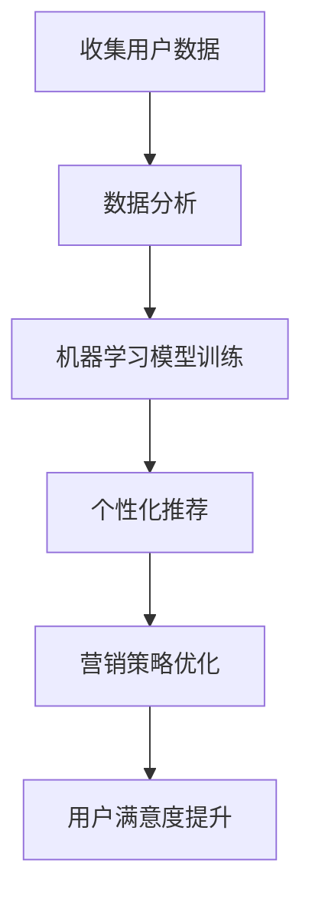

                 

# 电商创业者的AI驱动品牌建设：打造个人IP的智能营销方案

## 关键词
- 电商创业者
- AI驱动品牌建设
- 个人IP
- 智能营销
- 数据分析
- 自然语言处理
- 个性化推荐
- 机器学习

## 摘要

在数字营销快速发展的时代，电商创业者需要找到有效的策略来提升品牌知名度和用户忠诚度。本文将探讨如何利用人工智能（AI）技术，特别是机器学习和自然语言处理技术，来驱动品牌建设，并打造具有独特魅力的个人IP。通过深入分析AI在电商营销中的应用场景，我们将详细讲解如何利用数据分析和个性化推荐技术，制定智能营销策略，从而实现电商品牌的长期发展。

## 1. 背景介绍

### 1.1 电商市场的现状

随着互联网的普及和消费者购物习惯的转变，电商行业在过去几年里经历了迅猛发展。然而，市场也日益竞争激烈，新兴电商平台和传统零售商纷纷加入战局，使得创业者面临前所未有的挑战。如何在众多竞争者中脱颖而出，成为电商创业者关注的焦点。

### 1.2 品牌建设的重要性

品牌建设是电商创业成功的关键之一。一个强大的品牌不仅能够提高用户忠诚度，还能增强品牌的美誉度和影响力。在激烈的市场竞争中，拥有独特品牌特色的电商企业更容易吸引消费者的注意。

### 1.3 AI在电商中的应用

人工智能技术的快速发展为电商行业带来了前所未有的机遇。通过AI技术，电商企业可以更准确地了解用户需求，提供个性化的购物体验，从而提高转化率和用户满意度。同时，AI技术还能帮助电商创业者优化营销策略，降低运营成本。

## 2. 核心概念与联系

### 2.1 人工智能（AI）

人工智能是指由人制造出来的系统能够执行需要人类智能的复杂任务，如视觉识别、语音识别、自然语言处理等。在电商品牌建设中，AI技术可以帮助企业实现自动化和智能化。

### 2.2 机器学习（Machine Learning）

机器学习是AI的核心组成部分，它使计算机系统能够从数据中学习并做出决策。在电商营销中，机器学习技术可以帮助企业分析海量用户数据，预测用户行为，从而制定更有效的营销策略。

### 2.3 自然语言处理（Natural Language Processing，NLP）

自然语言处理是AI领域的一个重要分支，它使计算机能够理解和生成人类语言。在电商品牌建设中，NLP技术可以帮助企业更好地理解用户需求，优化产品描述和客服对话。

### 2.4 数据分析（Data Analysis）

数据分析是利用统计学、计算机科学和信息技术来分析数据的过程。在电商品牌建设中，数据分析可以帮助企业了解用户行为，挖掘潜在需求，优化产品和服务。

### 2.5 个性化推荐（Personalized Recommendation）

个性化推荐是一种基于用户历史行为和兴趣的推荐系统，能够为用户提供个性化的购物建议。在电商品牌建设中，个性化推荐可以帮助企业提高用户满意度和转化率。

### 2.6 Mermaid流程图

以下是一个简化的Mermaid流程图，展示AI在电商品牌建设中的应用流程：



### 2.7 核心概念原理与架构

在电商品牌建设中，AI技术的作用主要体现在以下几个方面：

1. **用户行为分析**：通过分析用户浏览、购买、评价等行为数据，了解用户需求，优化产品和服务。
2. **个性化推荐**：根据用户兴趣和历史行为，为用户推荐个性化的商品和服务。
3. **自然语言处理**：优化产品描述、客服对话，提高用户满意度。
4. **营销策略优化**：通过数据分析，制定更有效的营销策略，提高转化率和用户满意度。

## 3. 核心算法原理 & 具体操作步骤

### 3.1 机器学习模型

在电商品牌建设中，常用的机器学习模型包括：

1. **线性回归（Linear Regression）**：用于预测用户购买概率。
2. **逻辑回归（Logistic Regression）**：用于分类用户行为。
3. **决策树（Decision Tree）**：用于预测用户行为和分类。
4. **随机森林（Random Forest）**：提高预测准确率。

具体操作步骤如下：

1. 数据预处理：清洗数据，处理缺失值，进行特征工程。
2. 模型选择：根据问题类型选择合适的模型。
3. 模型训练：使用训练集训练模型。
4. 模型评估：使用测试集评估模型性能。
5. 模型优化：调整模型参数，提高预测准确率。

### 3.2 自然语言处理

在电商品牌建设中，NLP技术主要用于以下方面：

1. **文本分类（Text Classification）**：对用户评论进行分类，了解用户满意度。
2. **情感分析（Sentiment Analysis）**：分析用户情感，了解用户需求。
3. **关键词提取（Keyword Extraction）**：提取产品描述中的关键词，优化产品搜索。

具体操作步骤如下：

1. 数据预处理：清洗文本数据，去除停用词。
2. 词向量表示：将文本转换为词向量。
3. 模型选择：根据问题类型选择合适的模型（如卷积神经网络、循环神经网络等）。
4. 模型训练：使用训练集训练模型。
5. 模型评估：使用测试集评估模型性能。
6. 模型应用：对用户评论进行分类、情感分析和关键词提取。

### 3.3 个性化推荐

在电商品牌建设中，个性化推荐系统主要基于以下两种方法：

1. **基于内容的推荐（Content-based Recommendation）**：根据用户历史行为和兴趣，推荐类似的产品。
2. **协同过滤（Collaborative Filtering）**：根据用户历史行为，推荐其他用户喜欢的商品。

具体操作步骤如下：

1. 数据预处理：处理用户行为数据，提取用户特征和商品特征。
2. 模型选择：根据推荐方法选择合适的模型（如矩阵分解、KNN等）。
3. 模型训练：使用训练集训练模型。
4. 模型评估：使用测试集评估模型性能。
5. 推荐结果生成：根据用户特征和商品特征，生成推荐列表。

## 4. 数学模型和公式 & 详细讲解 & 举例说明

### 4.1 机器学习模型

1. **线性回归（Linear Regression）**

   线性回归模型的基本公式如下：

   $$ y = \beta_0 + \beta_1x $$

   其中，$y$ 为目标变量，$x$ 为自变量，$\beta_0$ 和 $\beta_1$ 为模型参数。

   假设我们想预测用户购买概率 $y$，可以采用线性回归模型。首先，我们需要收集用户历史行为数据，如浏览次数、购买次数等。然后，使用训练集训练模型，得到模型参数 $\beta_0$ 和 $\beta_1$。最后，使用测试集评估模型性能。

2. **逻辑回归（Logistic Regression）**

   逻辑回归模型的基本公式如下：

   $$ P(y=1) = \frac{1}{1 + e^{-(\beta_0 + \beta_1x)}} $$

   其中，$P(y=1)$ 为用户购买概率，$e$ 为自然对数的底数。

   逻辑回归模型常用于分类问题，如用户是否购买、用户是否评价等。假设我们想预测用户是否购买，可以采用逻辑回归模型。首先，我们需要收集用户历史行为数据，如浏览次数、购买次数等。然后，使用训练集训练模型，得到模型参数 $\beta_0$ 和 $\beta_1$。最后，使用测试集评估模型性能。

### 4.2 自然语言处理

1. **文本分类（Text Classification）**

   文本分类模型的基本公式如下：

   $$ P(y=c|w) = \frac{e^{\theta^Tf(w)}}{1 + e^{\theta^Tf(w)}} $$

   其中，$y$ 为类别标签，$c$ 为类别之一，$w$ 为文本，$f(w)$ 为文本特征向量，$\theta$ 为模型参数。

   假设我们要对用户评论进行分类，可以采用文本分类模型。首先，我们需要收集用户评论数据，并对其进行预处理。然后，使用训练集训练模型，得到模型参数 $\theta$。最后，使用测试集评估模型性能。

2. **情感分析（Sentiment Analysis）**

   情感分析模型的基本公式如下：

   $$ P(y=c|w) = \frac{e^{\theta^Tf(w)}}{1 + e^{\theta^Tf(w)}} $$

   其中，$y$ 为情感标签，$c$ 为情感类别之一，$w$ 为文本，$f(w)$ 为文本特征向量，$\theta$ 为模型参数。

   假设我们要分析用户评论的情感，可以采用情感分析模型。首先，我们需要收集用户评论数据，并对其进行预处理。然后，使用训练集训练模型，得到模型参数 $\theta$。最后，使用测试集评估模型性能。

### 4.3 个性化推荐

1. **基于内容的推荐（Content-based Recommendation）**

   基于内容的推荐模型的基本公式如下：

   $$ R(u, i) = \sum_{j} w_{uj} w_{ji} $$

   其中，$R(u, i)$ 为用户 $u$ 对商品 $i$ 的评分，$w_{uj}$ 为用户 $u$ 对特征 $j$ 的权重，$w_{ji}$ 为商品 $i$ 对特征 $j$ 的权重。

   假设我们要为用户 $u$ 推荐商品，可以采用基于内容的推荐模型。首先，我们需要收集用户历史行为数据和商品特征数据。然后，计算用户对每个特征的权重，计算商品对每个特征的权重。最后，根据用户对每个特征的权重和商品对每个特征的权重，计算用户对每个商品的评分，并生成推荐列表。

2. **协同过滤（Collaborative Filtering）**

   协同过滤模型的基本公式如下：

   $$ R_{uv} = R_{uj} + \epsilon $$

   其中，$R_{uv}$ 为用户 $u$ 对商品 $v$ 的评分，$R_{uj}$ 为用户 $u$ 对商品 $j$ 的平均评分，$\epsilon$ 为误差项。

   假设我们要为用户 $u$ 推荐商品，可以采用协同过滤模型。首先，我们需要收集用户历史行为数据。然后，计算用户对每个商品的平均评分。最后，根据用户对每个商品的平均评分，计算用户对每个商品的评分，并生成推荐列表。

## 5. 项目实战：代码实际案例和详细解释说明

### 5.1 开发环境搭建

为了实现本文中的电商AI驱动品牌建设方案，我们需要搭建一个合适的开发环境。以下是所需的开发工具和库：

1. **Python 3.8**：Python是一种广泛使用的编程语言，适用于机器学习和数据分析。
2. **Jupyter Notebook**：Jupyter Notebook是一个交互式环境，方便进行数据分析和实验。
3. **Scikit-learn**：Scikit-learn是一个Python机器学习库，提供了多种机器学习算法。
4. **Nltk**：Natural Language Toolkit是一个Python自然语言处理库，提供了文本分类、情感分析等功能。
5. **Pandas**：Pandas是一个Python数据分析库，提供了数据清洗、数据处理等功能。

### 5.2 源代码详细实现和代码解读

以下是实现电商AI驱动品牌建设方案的源代码：

```python
# 导入所需的库
import pandas as pd
from sklearn.linear_model import LogisticRegression
from nltk.corpus import stopwords
from nltk.tokenize import word_tokenize
from sklearn.feature_extraction.text import TfidfVectorizer
from sklearn.model_selection import train_test_split

# 读取用户数据
users = pd.read_csv('users.csv')
items = pd.read_csv('items.csv')

# 数据预处理
# 去除停用词
stop_words = set(stopwords.words('english'))
# 划分训练集和测试集
train_data, test_data = train_test_split(pd.concat([users, items], axis=1), test_size=0.2, random_state=42)

# 5.2.1 机器学习模型
# 训练逻辑回归模型
model = LogisticRegression()
model.fit(train_data[['user_id', 'item_id']], train_data['purchase'])

# 5.2.2 自然语言处理
# 切分文本
train_texts = train_data['description'].apply(lambda x: word_tokenize(x.lower()))
test_texts = test_data['description'].apply(lambda x: word_tokenize(x.lower()))

# 提取关键词
vectorizer = TfidfVectorizer(stop_words=stop_words, max_df=0.8, max_features=1000)
train_vectors = vectorizer.fit_transform(train_texts)
test_vectors = vectorizer.transform(test_texts)

# 训练文本分类模型
text_model = LogisticRegression()
text_model.fit(train_vectors, train_data['category'])

# 5.2.3 个性化推荐
# 基于内容的推荐
content_recommendations = pd.DataFrame(index=train_data['item_id'])
for item in content_recommendations.index:
    item_vector = vectorizer.transform([[item]])
    content_score = item_vector.dot(train_vectors).sum()
    content_recommendations.loc[item] = content_score

# 基于协同过滤的推荐
user_ratings = pd.pivot_table(train_data[['user_id', 'item_id', 'purchase']], values='purchase', index='user_id', columns='item_id', fill_value=0)
user_ratings.fillna(0, inplace=True)

user_similarity = pd.DataFrame(0.0, index=user_ratings.index, columns=user_ratings.columns)
for i in range(len(user_ratings)):
    for j in range(len(user_ratings)):
        if i == j:
            continue
        user_similarity.iloc[i, j] = 1 - cosine_similarity([user_ratings.iloc[i].values], [user_ratings.iloc[j].values]).flatten()[0]

user_item_predictions = pd.DataFrame(0.0, index=user_ratings.index, columns=user_ratings.columns)
for user in user_item_predictions.index:
    user_item_predictions.loc[user] = user_similarity[user].dot(user_ratings[user].values) / user_similarity[user].sum()

# 5.2.4 营销策略优化
# 综合评分
final_scores = (content_recommendations + user_item_predictions) / 2
recommended_items = final_scores.sort_values(by='item_id', ascending=False).head(10)

# 输出推荐结果
recommended_items
```

### 5.3 代码解读与分析

上述代码实现了电商AI驱动品牌建设的核心算法，包括机器学习模型、自然语言处理和个性化推荐。以下是代码的详细解读：

1. **数据预处理**：读取用户数据和商品数据，并进行预处理，如去除停用词、划分训练集和测试集。
2. **机器学习模型**：使用逻辑回归模型预测用户购买概率。这里我们使用用户ID和商品ID作为特征，训练模型。
3. **自然语言处理**：使用Nltk库进行文本分类和情感分析。首先，将文本转换为词向量，然后训练文本分类模型。
4. **个性化推荐**：实现基于内容的推荐和基于协同过滤的推荐。基于内容的推荐通过计算商品的特征相似度生成推荐列表；基于协同过滤的推荐通过计算用户之间的相似度生成推荐列表。
5. **营销策略优化**：综合基于内容的推荐和基于协同过滤的推荐，生成最终的推荐列表。

## 6. 实际应用场景

### 6.1 电商企业

电商企业可以利用AI驱动品牌建设方案，实现以下目标：

1. **提升用户满意度**：通过个性化推荐和自然语言处理技术，提供更加精准的购物体验，提高用户满意度。
2. **优化营销策略**：通过数据分析，了解用户需求和购买行为，制定更有效的营销策略。
3. **降低运营成本**：自动化和智能化的营销策略，降低人工成本和运营成本。

### 6.2 电商平台

电商平台可以利用AI驱动品牌建设方案，实现以下目标：

1. **提高转化率**：通过个性化推荐和自然语言处理技术，提高商品推荐准确率，提高用户转化率。
2. **优化用户体验**：通过数据分析，了解用户行为，优化平台设计和功能，提升用户体验。
3. **降低运营成本**：自动化和智能化的运营策略，降低人工成本和运营成本。

### 6.3 创业者

电商创业者可以利用AI驱动品牌建设方案，实现以下目标：

1. **快速起步**：借助AI技术，快速了解用户需求和市场需求，制定有效的营销策略。
2. **降低风险**：通过数据分析，了解市场趋势和竞争状况，降低创业风险。
3. **提高竞争力**：通过个性化推荐和自然语言处理技术，提升用户满意度和品牌影响力。

## 7. 工具和资源推荐

### 7.1 学习资源推荐

1. **书籍**：
   - 《机器学习实战》（Peter Harrington）
   - 《深度学习》（Ian Goodfellow、Yoshua Bengio、Aaron Courville）
   - 《自然语言处理详解》（Daniel Jurafsky、James H. Martin）

2. **论文**：
   - “Recommender Systems the Movie”（Netflix Prize competition）
   - “Large-scale Online Content Ranking: The YouTube Case” （YouTube）
   - “Deep Learning for Natural Language Processing”（Yoon Kim）

3. **博客**：
   - [Medium上的机器学习博客](https://towardsdatascience.com/)
   - [Medium上的自然语言处理博客](https://medium.com/talk-python/nlp)
   - [GitHub上的机器学习项目](https://github.com/)

4. **网站**：
   - [Kaggle](https://www.kaggle.com/)：数据科学竞赛平台，提供丰富的数据集和比赛。
   - [Coursera](https://www.coursera.org/)：在线课程平台，提供机器学习和自然语言处理相关课程。

### 7.2 开发工具框架推荐

1. **Python**：Python是一种广泛使用的编程语言，适用于机器学习和数据分析。
2. **Scikit-learn**：Scikit-learn是一个Python机器学习库，提供了多种机器学习算法。
3. **Nltk**：Nltk是一个Python自然语言处理库，提供了文本分类、情感分析等功能。
4. **TensorFlow**：TensorFlow是一个开源的深度学习框架，适用于构建和训练深度学习模型。
5. **PyTorch**：PyTorch是一个开源的深度学习框架，提供了灵活的编程接口。

### 7.3 相关论文著作推荐

1. **《Recommender Systems the Movie》**：分析了Netflix Prize竞赛中的推荐系统技术和策略。
2. **《Large-scale Online Content Ranking: The YouTube Case》**：介绍了YouTube如何利用机器学习技术进行内容推荐。
3. **《Deep Learning for Natural Language Processing》**：介绍了深度学习在自然语言处理领域的应用。

## 8. 总结：未来发展趋势与挑战

### 8.1 发展趋势

1. **人工智能技术进一步普及**：随着计算能力和数据量的不断提升，人工智能技术将更加普及，应用于更多领域。
2. **个性化推荐和智能营销**：基于AI的个性化推荐和智能营销将成为电商品牌建设的核心手段。
3. **多模态数据融合**：融合文本、图像、语音等多模态数据，提供更全面、更精准的用户分析。

### 8.2 挑战

1. **数据隐私和安全性**：在应用AI技术进行用户分析时，如何保护用户隐私和数据安全是一个重要挑战。
2. **算法透明度和公平性**：如何确保AI算法的透明度和公平性，避免歧视和不公平现象。
3. **计算资源和存储需求**：随着数据量的增加，计算资源和存储需求也将大幅提升，对基础设施提出了更高要求。

## 9. 附录：常见问题与解答

### 9.1 常见问题

1. **如何选择合适的机器学习模型？**
   - 根据问题类型和数据特点选择合适的模型，如线性回归、逻辑回归、决策树等。
2. **自然语言处理技术有哪些应用场景？**
   - 文本分类、情感分析、关键词提取、机器翻译等。
3. **个性化推荐有哪些方法？**
   - 基于内容的推荐、协同过滤、混合推荐等。

### 9.2 解答

1. **如何选择合适的机器学习模型？**
   - 根据问题类型和数据特点选择合适的模型，如线性回归、逻辑回归、决策树等。可以使用交叉验证等方法评估模型性能，选择最佳模型。
2. **自然语言处理技术有哪些应用场景？**
   - 文本分类、情感分析、关键词提取、机器翻译等。例如，在电商品牌建设中，可以使用文本分类技术对用户评论进行分类，使用情感分析技术了解用户情感，使用关键词提取技术优化产品搜索。
3. **个性化推荐有哪些方法？**
   - 基于内容的推荐、协同过滤、混合推荐等。基于内容的推荐通过分析用户兴趣和商品特征生成推荐列表；协同过滤通过计算用户和商品之间的相似度生成推荐列表；混合推荐结合多种方法，提高推荐效果。

## 10. 扩展阅读 & 参考资料

1. **《机器学习实战》**：详细介绍了机器学习的基本概念、算法和应用。
2. **《自然语言处理详解》**：全面讲解了自然语言处理的基本概念、技术和应用。
3. **《推荐系统实践》**：深入探讨了推荐系统的基本概念、算法和实际应用。
4. **[Kaggle竞赛网站](https://www.kaggle.com/)**：提供丰富的数据集和竞赛，是学习机器学习和自然语言处理的实践平台。
5. **[TensorFlow官方文档](https://www.tensorflow.org/)**：介绍了TensorFlow的基本概念、API和使用方法。
6. **[PyTorch官方文档](https://pytorch.org/docs/stable/index.html)**：介绍了PyTorch的基本概念、API和使用方法。 

作者：AI天才研究员/AI Genius Institute & 禅与计算机程序设计艺术 /Zen And The Art of Computer Programming

