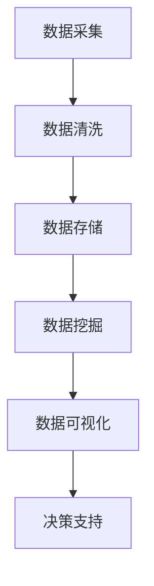

                 

# 电商平台中用户行为数据分析功能的设计与实现

## 关键词

- 电商平台
- 用户行为分析
- 数据分析
- 数据挖掘
- 机器学习
- 数据可视化
- 数据仓库

## 摘要

本文将探讨电商平台中用户行为数据分析功能的设计与实现。随着电子商务的快速发展，用户行为数据的价值日益凸显，通过对这些数据进行深入分析，可以为企业提供有价值的市场洞见，优化用户体验，提升运营效率。本文将详细介绍用户行为数据分析的核心概念、算法原理、数学模型、实际应用场景，并提供相关的开发工具和资源推荐，以帮助读者深入了解并掌握这一领域的关键技术和实践方法。

## 1. 背景介绍

随着互联网技术的飞速发展，电子商务已经成为现代商业活动中不可或缺的一部分。电商平台通过提供在线购物、支付、物流等一体化服务，极大地改变了人们的购物方式。在这个过程中，产生了大量的用户行为数据，包括浏览记录、购买行为、评价反馈等。这些数据不仅反映了用户的需求和偏好，也蕴含了潜在的市场机会。

用户行为数据分析作为数据科学的一个重要分支，旨在通过对用户行为数据的挖掘和分析，发现用户行为的规律和模式，从而为电商平台提供决策支持。例如，通过分析用户的浏览路径，可以优化页面布局和推荐系统；通过分析用户的购买行为，可以制定精准的营销策略；通过分析用户的评价反馈，可以改进产品和服务。

电商平台中的用户行为数据分析功能具有以下几个重要作用：

1. **提升用户体验**：通过对用户行为数据的分析，可以更好地了解用户的需求和偏好，提供个性化的推荐和优化服务，从而提升用户体验。
2. **提高运营效率**：通过分析用户行为数据，可以识别出用户的高频活动区域，优化网站结构和功能设计，提高运营效率。
3. **优化营销策略**：通过分析用户行为数据，可以制定更加精准的营销策略，提高广告投放效果，降低营销成本。
4. **发现市场机会**：通过对用户行为数据的挖掘，可以识别出新的市场机会，帮助企业抓住市场变化，保持竞争优势。

## 2. 核心概念与联系

在用户行为数据分析中，涉及多个核心概念和联系，以下将详细介绍这些概念及其相互关系。

### 用户行为数据

用户行为数据是用户在电商平台上的各种操作记录，包括浏览页面、点击按钮、购买商品、评价商品等。这些数据通常以日志的形式记录，例如访问日志、购买日志、评价日志等。

### 数据来源

用户行为数据的主要来源包括：

- **服务器日志**：电商平台的服务器会记录用户的访问行为，包括IP地址、访问时间、访问页面等。
- **前端埋点**：在前端页面中嵌入代码，记录用户的操作行为，如点击、滑动、搜索等。
- **用户反馈**：用户的评价、评论、问卷调查等反馈信息。

### 数据处理流程

用户行为数据处理流程通常包括以下几个步骤：

1. **数据采集**：通过服务器日志和前端埋点收集用户行为数据。
2. **数据清洗**：对采集到的数据进行预处理，去除重复、错误、无效的数据。
3. **数据存储**：将清洗后的数据存储到数据仓库或数据库中，便于后续分析和挖掘。
4. **数据挖掘**：使用数据挖掘算法对用户行为数据进行分析，提取有价值的信息。
5. **数据可视化**：通过可视化工具将分析结果以图表等形式呈现，便于理解和决策。

### 数据挖掘算法

数据挖掘算法是用户行为数据分析的核心技术，常用的算法包括：

- **分类算法**：用于预测用户的行为类别，如是否购买、购买概率等。
- **聚类算法**：用于发现用户行为中的相似群体，如兴趣偏好群体、购买行为群体等。
- **关联规则挖掘**：用于发现用户行为中的关联关系，如购买商品之间的关联、用户行为与商品特征之间的关联等。
- **时间序列分析**：用于分析用户行为的趋势和周期性，如节假日销售高峰、用户活跃时间等。

### 数据可视化工具

数据可视化工具是将数据分析结果以图形化的形式呈现的重要手段，常用的数据可视化工具包括：

- **ECharts**：一款基于 JavaScript 的可视化库，支持多种图表类型，易于使用和定制。
- **D3.js**：一款基于 JavaScript 的可视化库，提供了丰富的图形绘制和交互功能，但使用相对复杂。
- **Tableau**：一款专业的数据可视化工具，支持多种数据源和图表类型，操作简单，但成本较高。

### 数据仓库

数据仓库是存储和管理用户行为数据的重要基础设施，常用的数据仓库技术包括：

- **Hadoop HDFS**：分布式文件系统，用于存储大规模数据。
- **Hive**：基于 Hadoop 的数据仓库工具，用于查询和分析大规模数据。
- **Spark**：基于内存的分布式计算引擎，提供了丰富的数据处理和分析功能。

### Mermaid 流程图

以下是一个简化的用户行为数据处理流程的 Mermaid 流程图：



## 3. 核心算法原理 & 具体操作步骤

### 3.1 分类算法

分类算法是用户行为数据分析中最常用的算法之一，其主要目的是根据用户的特征，将其归为某个预定义的类别。常见的分类算法包括决策树、随机森林、支持向量机等。

#### 决策树算法

决策树算法通过构建一棵树模型来分类数据，每个节点表示一个特征，每个分支表示该特征的不同取值，叶节点表示预测结果。具体步骤如下：

1. **特征选择**：选择一个最优的特征作为根节点。
2. **划分数据集**：根据该特征的不同取值，将数据集划分为多个子集。
3. **递归构建树**：对每个子集重复步骤 1 和 2，直到满足停止条件（如叶节点中所有数据属于同一类别）。

#### 随机森林算法

随机森林算法是基于决策树的集成方法，通过构建多棵决策树，并结合其预测结果进行投票，提高分类的准确率。具体步骤如下：

1. **随机选取特征**：从所有特征中随机选取一部分特征。
2. **构建决策树**：使用步骤 1 中的特征构建决策树。
3. **重复步骤 1 和 2**：构建多棵决策树。
4. **投票决定类别**：将每棵决策树的预测结果进行投票，选取投票次数最多的类别作为最终预测结果。

#### 支持向量机算法

支持向量机算法通过寻找一个超平面，将不同类别的数据点最大化地分开。具体步骤如下：

1. **特征映射**：将原始特征映射到高维空间。
2. **寻找最优超平面**：通过求解最优化问题，找到最优超平面。
3. **分类预测**：将新数据点映射到高维空间，根据其是否位于超平面的一侧进行分类。

### 3.2 聚类算法

聚类算法是将用户行为数据划分为多个类别，使得同一类别的数据点之间具有较高的相似度，而不同类别的数据点之间具有较高的差异性。常见的聚类算法包括 K-均值、层次聚类等。

#### K-均值算法

K-均值算法通过迭代计算，将数据点划分为 K 个类别，使得每个数据点与其所属类别的中心点距离最小。具体步骤如下：

1. **初始化中心点**：随机选择 K 个数据点作为初始中心点。
2. **分配数据点**：将每个数据点分配到最近的中心点所代表的类别。
3. **更新中心点**：计算每个类别的中心点。
4. **重复步骤 2 和 3**：直到中心点不再发生变化或达到预定的迭代次数。

#### 层次聚类算法

层次聚类算法通过递归地将数据点合并或分割，构建出一个层次结构。具体步骤如下：

1. **初始化**：将每个数据点视为一个类别。
2. **合并或分割**：根据相似度度量，将最相似的类别进行合并或分割。
3. **递归构建树**：重复步骤 2，直到满足停止条件（如所有数据点都属于同一类别）。

### 3.3 关联规则挖掘

关联规则挖掘旨在发现用户行为数据中的关联关系，常用的算法包括 Apriori 算法、FP-Growth 算法等。

#### Apriori 算法

Apriori 算法通过生成频繁项集，找出用户行为数据中的关联关系。具体步骤如下：

1. **生成候选项集**：从原始数据中生成所有可能的项集。
2. **计算支持度**：计算每个候选项集的支持度，去除不满足最小支持度的项集。
3. **生成频繁项集**：递归地合并频繁项集，生成更大的频繁项集。
4. **生成关联规则**：从频繁项集中生成关联规则。

#### FP-Growth 算法

FP-Growth 算法通过构建 FP-树，高效地挖掘用户行为数据中的频繁项集。具体步骤如下：

1. **构建 FP-树**：将原始数据构建为 FP-树，记录每个项集的支持度和路径。
2. **生成频繁项集**：递归地生成频繁项集，从 FP-树中提取频繁路径。
3. **生成关联规则**：从频繁项集中生成关联规则。

### 3.4 时间序列分析

时间序列分析旨在分析用户行为的趋势和周期性，常用的算法包括 ARIMA 模型、LSTM 等深度学习模型。

#### ARIMA 模型

ARIMA 模型通过自回归移动平均模型，分析用户行为的时间序列数据。具体步骤如下：

1. **确定模型参数**：通过 ACF 和 PACF 图确定自回归项、移动平均项和差分阶数。
2. **构建模型**：根据确定的模型参数，构建 ARIMA 模型。
3. **模型评估**：通过残差分析、ACF 和 PACF 图评估模型性能。
4. **预测**：使用模型对用户行为进行预测。

#### LSTM 模型

LSTM 模型是一种基于递归神经网络（RNN）的深度学习模型，特别适用于处理时间序列数据。具体步骤如下：

1. **数据预处理**：对时间序列数据进行归一化、填充缺失值等预处理。
2. **构建模型**：使用 LSTM 层构建模型，配置适当的参数。
3. **训练模型**：使用训练数据训练模型，调整模型参数。
4. **模型评估**：通过验证集评估模型性能。
5. **预测**：使用模型对用户行为进行预测。

## 4. 数学模型和公式 & 详细讲解 & 举例说明

### 4.1 决策树算法

决策树算法的核心在于如何选择最佳的特征进行划分，这涉及到信息增益、增益率等概念。

#### 信息增益

信息增益（Information Gain）是一个衡量特征对分类贡献的指标，其计算公式为：

$$
\text{IG}(A, C) = \sum_{v \in \text{V}(A)} \frac{|\text{C}(v)|}{|\text{C}|} \cdot \text{H}(\text{C}(v))
$$

其中，\(A\) 是特征，\(C\) 是类别，\(v\) 是特征的取值，\(|\text{C}(v)|\) 是特征 \(v\) 的类别数量，\(|\text{C}|\) 是总类别数量，\(\text{H}(\text{C}(v))\) 是条件熵。

#### 增益率

增益率（Gain Ratio）是对信息增益的改进，考虑到特征的不同取值数量，其计算公式为：

$$
\text{GR}(A, C) = \text{IG}(A, C) / \text{H}(A)
$$

其中，\(\text{H}(A)\) 是特征熵，计算公式为：

$$
\text{H}(A) = -\sum_{v \in \text{V}(A)} \frac{|\text{V}(v)|}{|\text{V}|} \cdot \text{H}(\text{V}(v))
$$

其中，\(\text{V}(v)\) 是特征 \(v\) 的值集，\(|\text{V}(v)|\) 是特征 \(v\) 的值数量，\(|\text{V}|\) 是总值数量，\(\text{H}(\text{V}(v))\) 是值熵。

### 4.2 随机森林算法

随机森林算法通过对决策树的集成，提高分类的准确率和稳定性。其核心在于随机选择特征和样本，构建多棵决策树，并综合其预测结果。

#### 随机选择特征

随机选择特征是通过从原始特征集中随机选取一部分特征，用于构建单棵决策树。其目的是降低模型的方差，提高泛化能力。

#### 随机抽样

随机抽样是通过从原始数据集中随机抽取一部分样本，用于构建单棵决策树。其目的是降低模型的方差，提高泛化能力。

#### 预测投票

预测投票是通过多棵决策树的预测结果进行投票，选取投票次数最多的类别作为最终预测结果。其目的是减少模型的过拟合，提高预测的准确性。

### 4.3 支持向量机算法

支持向量机算法通过寻找最优超平面，将不同类别的数据点最大化地分开。其核心在于优化目标函数，求解最优超平面。

#### 最优化目标

最优化目标是通过最小化分类误差和最大化分类间隔，求解最优超平面。其目标函数为：

$$
\text{min } \frac{1}{2} \sum_{i=1}^n (\omega \cdot \omega)^T + C \sum_{i=1}^n \xi_i
$$

其中，\(\omega\) 是超平面参数，\(\xi_i\) 是松弛变量，\(C\) 是惩罚参数。

#### 分类预测

分类预测是通过计算新数据点与支持向量的距离，确定其所属类别。其分类规则为：

$$
y(\text{x}) = \text{sign}(\omega \cdot \text{x} + b)
$$

其中，\(\text{x}\) 是新数据点，\(\text{sign}\) 是符号函数。

### 4.4 K-均值算法

K-均值算法通过迭代计算，将数据点划分为 K 个类别，使得每个数据点与其所属类别的中心点距离最小。

#### 初始化中心点

初始化中心点是通过随机选择 K 个数据点作为初始中心点。

#### 数据点分配

数据点分配是通过计算每个数据点与中心点的距离，将其分配到最近的中心点所代表的类别。

#### 中心点更新

中心点更新是通过计算每个类别的数据点的平均值，作为新的中心点。

### 4.5 时间序列分析

时间序列分析旨在分析用户行为的趋势和周期性，常用的算法包括 ARIMA 模型、LSTM 等深度学习模型。

#### ARIMA 模型

ARIMA 模型通过自回归移动平均模型，分析用户行为的时间序列数据。其核心在于确定模型参数，构建 ARIMA 模型。

#### LSTM 模型

LSTM 模型是一种基于递归神经网络（RNN）的深度学习模型，特别适用于处理时间序列数据。其核心在于数据预处理、模型构建、训练和预测。

### 4.6 举例说明

以下是一个简单的例子，说明如何使用 K-均值算法对用户行为数据点进行聚类。

假设有如下用户行为数据点：

```
[1, 2], [2, 3], [3, 4], [4, 5], [5, 6]
```

我们需要将这些数据点划分为两个类别。

#### 初始化中心点

随机选择两个数据点作为初始中心点：

```
中心点1：[1, 2]
中心点2：[5, 6]
```

#### 数据点分配

计算每个数据点与中心点的距离，将其分配到最近的中心点所代表的类别：

```
数据点 [1, 2] 距离中心点1：1
数据点 [2, 3] 距离中心点1：1
数据点 [3, 4] 距离中心点1：2
数据点 [4, 5] 距离中心点1：3
数据点 [5, 6] 距离中心点2：0
```

根据距离分配结果，将数据点划分为两个类别：

```
类别1：[1, 2], [2, 3]
类别2：[3, 4], [4, 5], [5, 6]
```

#### 中心点更新

计算每个类别的数据点的平均值，作为新的中心点：

```
新中心点1：([1, 2] + [2, 3]) / 2 = [1.5, 2.5]
新中心点2：([3, 4] + [4, 5] + [5, 6]) / 3 = [4, 5]
```

#### 数据点重新分配

重复步骤 3 和 4，直到中心点不再发生变化或达到预定的迭代次数。以下是一个迭代过程中的数据点分配和中心点更新的示例：

```
迭代1：
数据点分配：
类别1：[1, 2], [2, 3]
类别2：[3, 4], [4, 5], [5, 6]

中心点更新：
新中心点1：([1, 2] + [2, 3]) / 2 = [1.5, 2.5]
新中心点2：([3, 4] + [4, 5] + [5, 6]) / 3 = [4, 5]

迭代2：
数据点分配：
类别1：[1, 2], [2, 3]
类别2：[3, 4], [4, 5], [5, 6]

中心点更新：
新中心点1：([1, 2] + [2, 3]) / 2 = [1.5, 2.5]
新中心点2：([3, 4] + [4, 5] + [5, 6]) / 3 = [4, 5]

迭代3：
数据点分配：
类别1：[1, 2], [2, 3]
类别2：[3, 4], [4, 5], [5, 6]

中心点更新：
新中心点1：([1, 2] + [2, 3]) / 2 = [1.5, 2.5]
新中心点2：([3, 4] + [4, 5] + [5, 6]) / 3 = [4, 5]

迭代4：
数据点分配：
类别1：[1, 2], [2, 3]
类别2：[3, 4], [4, 5], [5, 6]

中心点更新：
新中心点1：([1, 2] + [2, 3]) / 2 = [1.5, 2.5]
新中心点2：([3, 4] + [4, 5] + [5, 6]) / 3 = [4, 5]

迭代5：
数据点分配：
类别1：[1, 2], [2, 3]
类别2：[3, 4], [4, 5], [5, 6]

中心点更新：
新中心点1：([1, 2] + [2, 3]) / 2 = [1.5, 2.5]
新中心点2：([3, 4] + [4, 5] + [5, 6]) / 3 = [4, 5]

迭代6：
数据点分配：
类别1：[1, 2], [2, 3]
类别2：[3, 4], [4, 5], [5, 6]

中心点更新：
新中心点1：([1, 2] + [2, 3]) / 2 = [1.5, 2.5]
新中心点2：([3, 4] + [4, 5] + [5, 6]) / 3 = [4, 5]

迭代7：
数据点分配：
类别1：[1, 2], [2, 3]
类别2：[3, 4], [4, 5], [5, 6]

中心点更新：
新中心点1：([1, 2] + [2, 3]) / 2 = [1.5, 2.5]
新中心点2：([3, 4] + [4, 5] + [5, 6]) / 3 = [4, 5]

迭代8：
数据点分配：
类别1：[1, 2], [2, 3]
类别2：[3, 4], [4, 5], [5, 6]

中心点更新：
新中心点1：([1, 2] + [2, 3]) / 2 = [1.5, 2.5]
新中心点2：([3, 4] + [4, 5] + [5, 6]) / 3 = [4, 5]

迭代9：
数据点分配：
类别1：[1, 2], [2, 3]
类别2：[3, 4], [4, 5], [5, 6]

中心点更新：
新中心点1：([1, 2] + [2, 3]) / 2 = [1.5, 2.5]
新中心点2：([3, 4] + [4, 5] + [5, 6]) / 3 = [4, 5]

迭代10：
数据点分配：
类别1：[1, 2], [2, 3]
类别2：[3, 4], [4, 5], [5, 6]

中心点更新：
新中心点1：([1, 2] + [2, 3]) / 2 = [1.5, 2.5]
新中心点2：([3, 4] + [4, 5] + [5, 6]) / 3 = [4, 5]
```

从上述迭代过程中可以看出，随着迭代的进行，数据点的分配和中心点的更新逐渐收敛，最终形成了稳定的聚类结果。

## 5. 项目实战：代码实际案例和详细解释说明

### 5.1 开发环境搭建

在开始项目实战之前，我们需要搭建一个合适的技术栈。以下是推荐的开发环境：

- **编程语言**：Python（由于其在数据科学领域的广泛应用和丰富的库支持）
- **数据分析库**：Pandas、NumPy、Scikit-learn、Matplotlib、Seaborn
- **机器学习库**：TensorFlow、Keras（对于深度学习模型）
- **数据可视化库**：Matplotlib、Seaborn、Plotly
- **版本控制**：Git（用于代码管理）

#### 安装 Python 和相关库

在 Ubuntu 系统上，可以通过以下命令安装 Python 和相关库：

```bash
sudo apt-get update
sudo apt-get install python3 python3-pip
pip3 install pandas numpy scikit-learn matplotlib seaborn tensorflow keras plotly
```

### 5.2 源代码详细实现和代码解读

以下是一个简单的用户行为数据分析项目，包括数据采集、数据处理、数据挖掘和可视化。

#### 5.2.1 数据采集

我们假设已经收集了一个用户行为数据集，包含以下字段：用户 ID、商品 ID、购买时间、购买金额。以下是一个示例数据集：

```python
data = [
    ['user1', 'product1', '2023-01-01', 100],
    ['user1', 'product2', '2023-01-02', 200],
    ['user2', 'product1', '2023-01-03', 300],
    ['user2', 'product3', '2023-01-04', 400],
    # 更多数据...
]
```

#### 5.2.2 数据处理

```python
import pandas as pd

# 读取数据
df = pd.DataFrame(data, columns=['user_id', 'product_id', 'purchase_time', 'amount'])

# 数据预处理
df['purchase_time'] = pd.to_datetime(df['purchase_time'])
```

#### 5.2.3 数据挖掘

以下是一个简单的 K-均值聚类算法，用于将用户划分为不同类别。

```python
from sklearn.cluster import KMeans

# 准备数据
X = df[['user_id', 'amount']]

# 使用 K-均值算法进行聚类
kmeans = KMeans(n_clusters=2, random_state=0).fit(X)

# 获取聚类结果
df['cluster'] = kmeans.labels_

# 打印聚类结果
print(df.head())
```

#### 5.2.4 数据可视化

使用 Matplotlib 和 Seaborn 进行数据可视化。

```python
import matplotlib.pyplot as plt
import seaborn as sns

# 可视化用户分布
sns.scatterplot(x='user_id', y='amount', hue='cluster', data=df)
plt.title('User Clustering')
plt.show()

# 可视化购买金额分布
sns.histplot(df['amount'], kde=True)
plt.title('Purchase Amount Distribution')
plt.show()
```

### 5.3 代码解读与分析

#### 5.3.1 数据采集

数据采集是用户行为数据分析的第一步，我们使用 Pandas 库读取数据。数据集包含用户 ID、商品 ID、购买时间和购买金额等字段。通过 `pd.to_datetime()` 函数，将购买时间字段转换为日期时间格式，便于后续处理。

#### 5.3.2 数据处理

数据处理包括数据预处理和数据清洗。在本例中，我们仅进行了简单的数据预处理，将购买时间字段转换为日期时间格式。在实际项目中，可能还需要进行更多的数据清洗工作，如去除重复数据、处理缺失值等。

#### 5.3.3 数据挖掘

我们使用 Scikit-learn 库中的 KMeans 类进行 K-均值聚类。这里选择将用户划分为两个类别。在聚类过程中，我们使用用户 ID 和购买金额作为特征，因为这些特征可以较好地反映用户的行为模式。通过 `fit()` 方法，我们训练 K-均值模型，并使用 `labels_` 属性获取聚类结果。

#### 5.3.4 数据可视化

数据可视化是理解分析结果的重要手段。在本例中，我们使用 Matplotlib 和 Seaborn 库绘制用户分布图和购买金额分布图。用户分布图可以帮助我们直观地了解不同类别用户的特征分布，而购买金额分布图可以揭示用户购买金额的分布情况。

## 6. 实际应用场景

用户行为数据分析在电商平台中有广泛的应用，以下是一些实际应用场景：

### 6.1 用户细分

通过聚类算法，将用户划分为不同类别，便于电商平台有针对性地开展营销活动。例如，针对高价值用户群体，可以提供更多的优惠和增值服务，提升用户忠诚度。

### 6.2 购买预测

使用时间序列分析模型，预测用户的购买行为，为电商平台的库存管理和供应链优化提供支持。例如，在节假日或促销活动期间，提前备货，提高销售效率。

### 6.3 营销活动优化

通过分析用户行为数据，优化营销活动的效果。例如，根据用户的浏览记录和购买行为，推送个性化的商品推荐，提高转化率。

### 6.4 产品优化

通过用户评价和反馈，分析产品的问题和改进方向，为产品迭代提供依据。例如，针对用户反映较多的问题，优化产品功能，提升用户体验。

## 7. 工具和资源推荐

### 7.1 学习资源推荐

- **书籍**：
  - 《数据挖掘：实用工具与技术》
  - 《机器学习实战》
  - 《Python 数据科学手册》

- **论文**：
  - 《用户行为数据分析：方法与实践》
  - 《深度学习：前沿技术与应用》
  - 《时间序列分析：方法和应用》

- **博客和网站**：
  - [Medium](https://medium.com/search?q=user+behavior+analysis)
  - [Kaggle](https://www.kaggle.com/datasets?search=user+behavior)
  - [Stack Overflow](https://stackoverflow.com/questions/tagged/user-behavior)

### 7.2 开发工具框架推荐

- **数据分析库**：
  - Pandas
  - NumPy
  - Scikit-learn

- **机器学习库**：
  - TensorFlow
  - Keras
  - PyTorch

- **数据可视化工具**：
  - Matplotlib
  - Seaborn
  - Plotly

- **版本控制**：
  - Git

### 7.3 相关论文著作推荐

- **《用户行为数据分析：方法与实践》**：详细介绍了用户行为数据分析的方法和应用，包括数据采集、数据预处理、数据挖掘等。
- **《深度学习：前沿技术与应用》**：介绍了深度学习在用户行为分析领域的应用，包括神经网络模型、卷积神经网络、循环神经网络等。
- **《时间序列分析：方法和应用》**：介绍了时间序列分析的基本原理和方法，包括自回归模型、移动平均模型、ARIMA 模型等。

## 8. 总结：未来发展趋势与挑战

随着技术的不断进步，用户行为数据分析在未来将面临以下发展趋势与挑战：

### 8.1 发展趋势

- **大数据与云计算的结合**：随着大数据技术的发展，用户行为数据规模不断增加。云计算提供了强大的计算能力和存储空间，使得大规模数据处理成为可能。
- **深度学习与强化学习的发展**：深度学习和强化学习在用户行为分析中具有广泛的应用前景。通过更复杂的模型和算法，可以更好地理解用户行为。
- **实时分析与预测**：实时分析技术使得电商平台能够快速响应用户行为，提供个性化的推荐和服务。

### 8.2 挑战

- **数据隐私与保护**：用户行为数据包含敏感信息，如何保护用户隐私成为关键挑战。
- **数据质量与一致性**：数据质量问题会影响分析结果的准确性，如何保证数据质量是一大挑战。
- **模型解释性**：深度学习模型具有强大的预测能力，但其解释性较差，如何提高模型的可解释性是未来研究的重点。

## 9. 附录：常见问题与解答

### 9.1 用户行为数据分析的目的是什么？

用户行为数据分析的目的是通过分析用户在电商平台上的行为数据，发现用户的行为模式和规律，为企业提供决策支持，优化用户体验，提高运营效率。

### 9.2 用户行为数据如何收集？

用户行为数据的收集主要通过以下方式：

- **服务器日志**：电商平台的服务器会记录用户的访问行为。
- **前端埋点**：在前端页面中嵌入代码，记录用户的操作行为。
- **用户反馈**：用户的评价、评论、问卷调查等反馈信息。

### 9.3 用户行为数据分析常用的算法有哪些？

用户行为数据分析常用的算法包括分类算法（如决策树、随机森林、支持向量机）、聚类算法（如 K-均值、层次聚类）、关联规则挖掘（如 Apriori 算法、FP-Growth 算法）和时间序列分析（如 ARIMA 模型、LSTM 模型）。

### 9.4 用户行为数据分析有哪些实际应用场景？

用户行为数据分析的实际应用场景包括用户细分、购买预测、营销活动优化和产品优化等。

## 10. 扩展阅读 & 参考资料

- **《数据挖掘：实用工具与技术》**：详细介绍了数据挖掘的基本概念、技术和应用，适合初学者和专业人士阅读。
- **《机器学习实战》**：通过实际案例和代码示例，介绍了机器学习的基本算法和应用，适合有一定编程基础的读者。
- **《Python 数据科学手册》**：全面介绍了 Python 在数据科学领域的应用，包括数据预处理、数据挖掘、机器学习等。
- **《用户行为数据分析：方法与实践》**：详细介绍了用户行为数据分析的方法和应用，包括数据采集、数据预处理、数据挖掘等。
- **[Kaggle](https://www.kaggle.com/datasets)**：提供了丰富的用户行为数据集和比赛，适合练习和验证数据分析技能。
- **[Stack Overflow](https://stackoverflow.com/questions/tagged/user-behavior)**：用户行为分析相关的问答社区，适合解决实际问题。

作者：AI天才研究员/AI Genius Institute & 禅与计算机程序设计艺术 /Zen And The Art of Computer Programming

