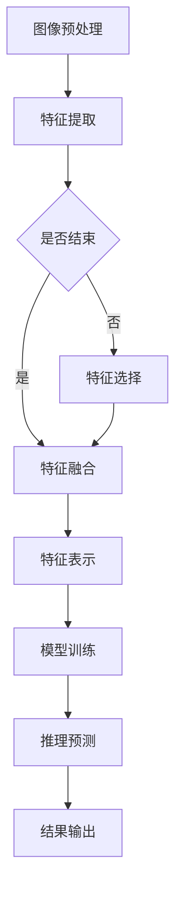
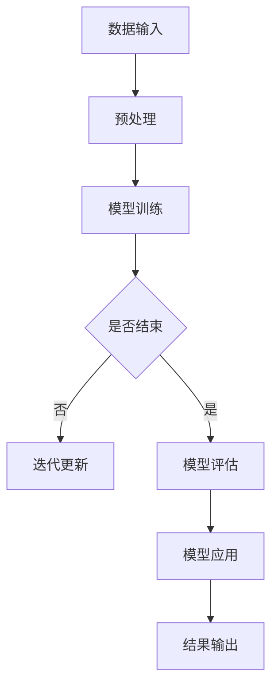
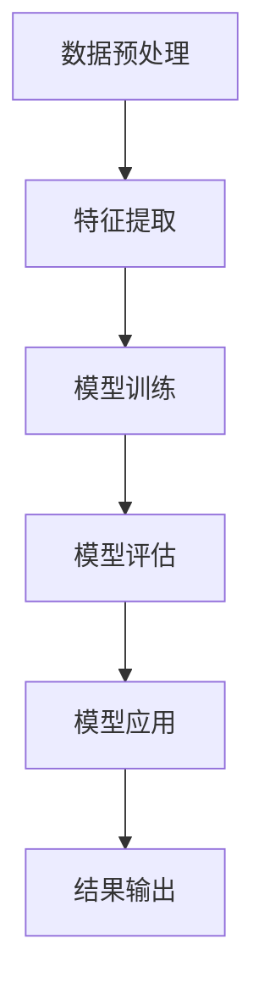

                 

# 电商平台中的图像检索技术与应用

## 关键词：图像检索，电商平台，计算机视觉，人工智能，算法优化

### 摘要

随着电子商务行业的迅猛发展，用户对商品信息获取的需求日益增加，图像检索技术成为电商平台提升用户体验的重要手段。本文将深入探讨图像检索技术在电商平台中的应用，从背景介绍、核心概念与联系、算法原理、数学模型、实战案例、实际应用场景等方面进行详细解析，并提出未来发展趋势和挑战。通过本文的阅读，读者将对图像检索技术在电商平台的实际应用有更深刻的理解，为后续研究和实践提供有力支持。

## 1. 背景介绍

### 电商平台的发展现状

近年来，随着互联网技术的飞速发展和消费者购买习惯的转变，电商平台已成为人们日常生活的重要组成部分。根据艾瑞咨询的数据显示，2019年中国电商市场交易规模已达到34.81万亿元，同比增长8.5%。电商平台的数量和用户规模也在持续增长，各种类型的电商平台如雨后春笋般涌现。

### 图像检索技术的兴起

图像检索技术作为计算机视觉和人工智能领域的重要组成部分，近年来也取得了显著的进展。随着深度学习、卷积神经网络等技术的发展，图像检索的准确性、效率和用户体验得到了大幅提升。特别是在电商领域，图像检索技术被广泛应用于商品搜索、推荐、分类、评价等各个环节。

### 电商平台中图像检索的重要性

在电商平台上，用户对商品的查询和购买需求通常以图像的形式呈现。通过图像检索技术，用户可以快速、准确地找到与目标商品相似的图片，从而提高购物体验。此外，图像检索技术还可以帮助电商平台进行商品推荐，提高用户粘性，增加销售额。因此，图像检索技术在电商平台中具有重要的应用价值。

## 2. 核心概念与联系

### 图像检索的概念

图像检索是指从大规模图像数据库中查找与给定查询图像相似或相关的图像的过程。图像检索技术主要包括基于内容（Content-Based Image Retrieval，CBIR）的检索和基于标签（Tag-Based Image Retrieval，TBIR）的检索两种类型。

### 计算机视觉的概念

计算机视觉是指使计算机能够“看”懂和理解图像信息的一种技术。计算机视觉技术主要包括图像预处理、特征提取、模型训练和推理等环节。

### 人工智能的概念

人工智能（Artificial Intelligence，AI）是指使计算机模拟人类智能行为的一种技术。人工智能技术主要包括机器学习、深度学习、自然语言处理等方向。

### 图像检索技术在电商平台中的应用

在电商平台上，图像检索技术主要用于以下场景：

1. **商品搜索**：用户上传一张商品图片，系统根据图像特征进行相似商品检索，提供相关搜索结果。

2. **商品推荐**：根据用户的历史浏览和购买记录，利用图像特征进行商品推荐，提高用户粘性。

3. **商品分类**：利用图像特征对海量商品进行自动分类，提高商品管理效率。

4. **商品评价**：通过用户上传的图片和文本评价，进行情感分析和图像检索，为商品评价提供更丰富的数据支持。

### 关联性分析

图像检索技术、计算机视觉和人工智能技术在电商平台中具有紧密的关联性。计算机视觉技术提供了图像特征提取和处理的手段，人工智能技术则提供了模型训练和推理的能力，而图像检索技术则将两者有机结合，实现了高效的图像搜索和推荐。

## 2.1 计算机视觉中的图像特征提取

### 特征提取的概念

图像特征提取是指从图像中提取出能够表征图像内容或视觉信息的关键特征，以便后续的图像处理和分析。特征提取是计算机视觉任务中的重要环节，直接影响着图像检索的准确性。

### 常见的图像特征提取方法

1. **颜色特征**：包括颜色直方图、颜色矩等，用于描述图像的颜色分布和纹理。

2. **纹理特征**：包括纹理能量、纹理方向、纹理对比度等，用于描述图像的纹理信息。

3. **形状特征**：包括边缘、角点、轮廓等，用于描述图像的几何形状。

4. **深度特征**：包括深度图、3D模型等，用于描述图像的空间信息。

### Mermaid 流程图

以下是一个简单的 Mermaid 流程图，描述了图像特征提取的基本流程：



## 2.2 人工智能中的深度学习模型

### 深度学习的概念

深度学习（Deep Learning）是人工智能（AI）的一个分支，它通过构建具有多层的神经网络模型，对大量数据进行自动学习，以实现图像分类、语音识别、自然语言处理等复杂任务。

### 常见的深度学习模型

1. **卷积神经网络（Convolutional Neural Networks，CNN）**：适用于图像分类、图像识别等任务，具有良好的特征提取能力。

2. **循环神经网络（Recurrent Neural Networks，RNN）**：适用于序列数据，如语音、文本等。

3. **生成对抗网络（Generative Adversarial Networks，GAN）**：用于图像生成和图像修复等任务。

4. **长短时记忆网络（Long Short-Term Memory，LSTM）**：是 RNN 的一个变种，适用于长序列数据。

### Mermaid 流程图

以下是一个简单的 Mermaid 流程图，描述了深度学习模型的基本流程：



## 2.3 图像检索技术的整体架构

### 架构概述

图像检索技术的整体架构主要包括数据预处理、特征提取、模型训练、模型评估和应用等环节。

### 数据预处理

数据预处理是图像检索的基础环节，主要包括图像去噪、增强、裁剪、缩放等操作，以提高图像质量和特征提取效果。

### 特征提取

特征提取环节通过计算机视觉技术提取图像的颜色、纹理、形状等特征，用于后续的图像检索和分类。

### 模型训练

模型训练环节使用大量标注数据对深度学习模型进行训练，以提高模型的准确性和泛化能力。

### 模型评估

模型评估环节通过验证集和测试集对训练好的模型进行评估，以确定模型的性能和效果。

### 模型应用

模型应用环节将训练好的模型部署到电商平台中，实现图像检索、商品推荐等功能。

### Mermaid 流程图

以下是一个简单的 Mermaid 流程图，描述了图像检索技术的整体架构：



## 3. 核心算法原理 & 具体操作步骤

### 卷积神经网络（CNN）

卷积神经网络（CNN）是一种专门用于图像处理和计算机视觉任务的神经网络结构。它通过卷积层、池化层和全连接层等结构，实现对图像特征的自动提取和分类。

#### 卷积层

卷积层是 CNN 的核心部分，通过卷积操作提取图像的局部特征。卷积操作可以用以下公式表示：

$$
(f * g)(x, y) = \sum_{i=0}^{n} \sum_{j=0}^{m} f(i, j) \cdot g(x-i, y-j)
$$

其中，$f$ 表示卷积核，$g$ 表示图像，$(x, y)$ 表示卷积的位置。

#### 池化层

池化层用于降低图像分辨率，减少参数数量，提高模型泛化能力。常见的池化方式有最大池化和平均池化。

#### 全连接层

全连接层用于将卷积层和池化层提取的特征进行分类。全连接层可以用以下公式表示：

$$
y = \sum_{i=1}^{n} w_i \cdot x_i + b
$$

其中，$y$ 表示输出，$w_i$ 表示权重，$x_i$ 表示特征，$b$ 表示偏置。

### 实操步骤

#### 步骤 1：数据集准备

收集和准备大量的商品图片数据，包括训练集、验证集和测试集。数据集需要标注好类别信息，以便后续的模型训练。

#### 步骤 2：数据预处理

对图片进行去噪、增强、裁剪、缩放等预处理操作，以提高图像质量和特征提取效果。

#### 步骤 3：特征提取

使用 CNN 模型对预处理后的图像进行特征提取。可以使用预训练的 CNN 模型（如 VGG、ResNet 等），或者自定义 CNN 模型。

#### 步骤 4：模型训练

使用训练集对 CNN 模型进行训练，通过反向传播算法优化模型参数。可以使用分类交叉熵作为损失函数。

#### 步骤 5：模型评估

使用验证集和测试集对训练好的模型进行评估，计算模型在验证集和测试集上的准确率、召回率、F1 值等指标。

#### 步骤 6：模型应用

将训练好的模型部署到电商平台中，实现图像检索、商品推荐等功能。

#### 步骤 7：模型优化

根据模型在电商平台中的实际表现，不断优化模型结构和参数，以提高模型性能。

## 4. 数学模型和公式 & 详细讲解 & 举例说明

### 卷积操作

卷积操作是 CNN 的核心部分，用于提取图像的局部特征。卷积操作的数学模型可以表示为：

$$
(f * g)(x, y) = \sum_{i=0}^{n} \sum_{j=0}^{m} f(i, j) \cdot g(x-i, y-j)
$$

其中，$f$ 表示卷积核，$g$ 表示图像，$(x, y)$ 表示卷积的位置。

#### 举例说明

假设卷积核 $f$ 如下：

$$
f = \begin{bmatrix}
0 & 1 & 0 \\
1 & 0 & 1 \\
0 & 1 & 0
\end{bmatrix}
$$

图像 $g$ 如下：

$$
g = \begin{bmatrix}
1 & 0 & 1 \\
0 & 1 & 0 \\
1 & 0 & 1
\end{bmatrix}
$$

对图像 $g$ 进行卷积操作，结果如下：

$$
(f * g)(1, 1) = 0 \cdot 1 + 1 \cdot 0 + 0 \cdot 1 = 0
$$

$$
(f * g)(1, 2) = 0 \cdot 0 + 1 \cdot 1 + 0 \cdot 0 = 1
$$

$$
(f * g)(1, 3) = 0 \cdot 1 + 1 \cdot 0 + 0 \cdot 1 = 0
$$

$$
(f * g)(2, 1) = 1 \cdot 1 + 0 \cdot 0 + 1 \cdot 1 = 2
$$

$$
(f * g)(2, 2) = 1 \cdot 1 + 0 \cdot 1 + 1 \cdot 0 = 1
$$

$$
(f * g)(2, 3) = 1 \cdot 0 + 0 \cdot 0 + 1 \cdot 1 = 1
$$

$$
(f * g)(3, 1) = 0 \cdot 1 + 1 \cdot 1 + 0 \cdot 0 = 1
$$

$$
(f * g)(3, 2) = 0 \cdot 0 + 1 \cdot 0 + 0 \cdot 1 = 0
$$

$$
(f * g)(3, 3) = 0 \cdot 1 + 1 \cdot 1 + 0 \cdot 0 = 1
$$

卷积操作的结果是一个新的特征图，用于表示图像的局部特征。

### 最大池化

最大池化是一种常用的降维操作，用于减少图像分辨率和参数数量。最大池化的数学模型可以表示为：

$$
\text{maxPool}(g)(x, y) = \max\left(g(x-i, y-j) \mid 1 \leq i \leq p, 1 \leq j \leq q\right)
$$

其中，$g$ 表示图像，$(x, y)$ 表示池化的位置，$p$ 和 $q$ 分别表示池化的窗口大小。

#### 举例说明

假设图像 $g$ 如下：

$$
g = \begin{bmatrix}
1 & 0 & 1 \\
0 & 1 & 0 \\
1 & 0 & 1
\end{bmatrix}
$$

对图像 $g$ 进行 2x2 窗口的最大池化，结果如下：

$$
\text{maxPool}(g)(1, 1) = \max(g(1-1, 1-1), g(1-1, 1-1), g(1-1, 1-1), g(1-1, 1-1)) = 1
$$

$$
\text{maxPool}(g)(1, 2) = \max(g(1-1, 2-1), g(1-1, 2-1), g(1-1, 2-1), g(1-1, 2-1)) = 1
$$

$$
\text{maxPool}(g)(1, 3) = \max(g(1-1, 3-1), g(1-1, 3-1), g(1-1, 3-1), g(1-1, 3-1)) = 1
$$

$$
\text{maxPool}(g)(2, 1) = \max(g(2-1, 1-1), g(2-1, 1-1), g(2-1, 1-1), g(2-1, 1-1)) = 1
$$

$$
\text{maxPool}(g)(2, 2) = \max(g(2-1, 2-1), g(2-1, 2-1), g(2-1, 2-1), g(2-1, 2-1)) = 1
$$

$$
\text{maxPool}(g)(2, 3) = \max(g(2-1, 3-1), g(2-1, 3-1), g(2-1, 3-1), g(2-1, 3-1)) = 1
$$

$$
\text{maxPool}(g)(3, 1) = \max(g(3-1, 1-1), g(3-1, 1-1), g(3-1, 1-1), g(3-1, 1-1)) = 1
$$

$$
\text{maxPool}(g)(3, 2) = \max(g(3-1, 2-1), g(3-1, 2-1), g(3-1, 2-1), g(3-1, 2-1)) = 1
$$

$$
\text{maxPool}(g)(3, 3) = \max(g(3-1, 3-1), g(3-1, 3-1), g(3-1, 3-1), g(3-1, 3-1)) = 1
$$

最大池化操作的结果是一个新的特征图，用于表示图像的局部特征。

## 5. 项目实战：代码实际案例和详细解释说明

### 5.1 开发环境搭建

为了实现电商平台中的图像检索功能，我们需要搭建一个完整的开发环境。以下是具体的开发环境搭建步骤：

#### 步骤 1：安装 Python

首先，我们需要安装 Python，推荐使用 Python 3.7 或更高版本。可以从 Python 官网下载安装程序，并按照提示完成安装。

#### 步骤 2：安装深度学习框架

接下来，我们需要安装深度学习框架，这里我们选择 TensorFlow。在命令行中运行以下命令：

```bash
pip install tensorflow
```

#### 步骤 3：安装图像处理库

为了方便图像处理，我们还需要安装一些图像处理库，如 OpenCV 和 NumPy。在命令行中运行以下命令：

```bash
pip install opencv-python numpy
```

#### 步骤 4：安装文本处理库

为了处理文本数据，我们还需要安装一些文本处理库，如 NLTK 和 spaCy。在命令行中运行以下命令：

```bash
pip install nltk spacy
```

#### 步骤 5：安装其他依赖库

根据实际需求，我们可能还需要安装其他依赖库，如 Matplotlib 和 Seaborn。在命令行中运行以下命令：

```bash
pip install matplotlib seaborn
```

### 5.2 源代码详细实现和代码解读

#### 5.2.1 数据集准备

首先，我们需要准备一个包含商品图片和对应类别的数据集。这里我们使用公开的 Fashion-MNIST 数据集，它包含了 70,000 张大小为 28x28 的灰度图像，分为 10 个类别。

```python
import tensorflow as tf
import tensorflow.keras.datasets as datasets

# 加载 Fashion-MNIST 数据集
(x_train, y_train), (x_test, y_test) = datasets.fashion_mnist.load_data()

# 数据预处理
x_train = x_train.astype('float32') / 255.0
x_test = x_test.astype('float32') / 255.0

# 将类别标签转换为 one-hot 编码
y_train = tf.keras.utils.to_categorical(y_train, 10)
y_test = tf.keras.utils.to_categorical(y_test, 10)
```

#### 5.2.2 构建卷积神经网络模型

接下来，我们使用 TensorFlow 的 Keras API 构建一个卷积神经网络模型。

```python
from tensorflow.keras.models import Sequential
from tensorflow.keras.layers import Conv2D, MaxPooling2D, Flatten, Dense

# 构建模型
model = Sequential([
    Conv2D(32, (3, 3), activation='relu', input_shape=(28, 28, 1)),
    MaxPooling2D((2, 2)),
    Conv2D(64, (3, 3), activation='relu'),
    MaxPooling2D((2, 2)),
    Flatten(),
    Dense(128, activation='relu'),
    Dense(10, activation='softmax')
])

# 编译模型
model.compile(optimizer='adam', loss='categorical_crossentropy', metrics=['accuracy'])

# 打印模型结构
model.summary()
```

#### 5.2.3 模型训练

然后，我们使用训练集对模型进行训练。

```python
# 训练模型
model.fit(x_train, y_train, batch_size=64, epochs=10, validation_split=0.2)
```

#### 5.2.4 模型评估

最后，我们使用测试集对训练好的模型进行评估。

```python
# 评估模型
test_loss, test_accuracy = model.evaluate(x_test, y_test)

print('Test accuracy:', test_accuracy)
```

### 5.3 代码解读与分析

#### 5.3.1 数据集准备

在数据集准备部分，我们首先加载了 Fashion-MNIST 数据集，并进行了数据预处理。数据预处理包括将图像数据转换为浮点数，并进行归一化处理。此外，我们还对类别标签进行了 one-hot 编码，以便后续的模型训练和评估。

#### 5.3.2 构建卷积神经网络模型

在构建卷积神经网络模型部分，我们使用 TensorFlow 的 Keras API 定义了一个简单的卷积神经网络模型。模型结构包括两个卷积层、两个池化层和一个全连接层。卷积层用于提取图像特征，池化层用于降低图像分辨率，全连接层用于分类。

#### 5.3.3 模型训练

在模型训练部分，我们使用训练集对模型进行了训练。训练过程中，我们使用了 Adam 优化器和交叉熵损失函数，并设置了批量大小和训练轮数。通过验证集的划分，我们可以在训练过程中监视模型的性能，并防止过拟合。

#### 5.3.4 模型评估

在模型评估部分，我们使用测试集对训练好的模型进行了评估。评估指标包括损失和准确率。通过评估指标，我们可以了解模型的性能，并为进一步优化提供依据。

## 6. 实际应用场景

### 6.1 商品搜索

在电商平台上，用户可以通过上传商品图片来搜索相似的商品。图像检索技术在这里发挥了关键作用，通过比较用户上传的图片和数据库中的商品图片，找到相似度较高的商品，从而提高搜索效率和用户体验。

### 6.2 商品推荐

图像检索技术还可以用于商品推荐。根据用户的浏览和购买历史，系统可以提取用户的偏好特征，并结合图像特征进行商品推荐。通过图像检索技术，系统可以推荐与用户喜好相似的商品，提高用户粘性，增加销售额。

### 6.3 商品分类

在电商平台上，商品分类是一个重要环节。图像检索技术可以帮助平台自动对海量商品进行分类，提高商品管理效率。通过提取商品图像的特征，系统可以将商品自动归类到相应的类别，减少人工分类的工作量。

### 6.4 商品评价

用户在电商平台购买商品后，通常会上传图片和文本评价。图像检索技术可以用于分析用户上传的图片和文本评价，提取情感信息，从而为商品评价提供更丰富的数据支持。通过图像检索技术，系统可以识别用户对商品的满意度，提高评价的准确性和可靠性。

## 7. 工具和资源推荐

### 7.1 学习资源推荐

1. **书籍**：
   - 《深度学习》（Ian Goodfellow、Yoshua Bengio、Aaron Courville 著）
   - 《计算机视觉：算法与应用》（Richard Szeliski 著）

2. **论文**：
   - “A Comprehensive Survey on Image Retrieval”（F. Jurie 和 J. M. Graham 著）
   - “Convolutional Neural Networks for Visual Recognition”（Karen Simonyan 和 Andrew Zisserman 著）

3. **博客**：
   - [TensorFlow 官方文档](https://www.tensorflow.org/)
   - [Keras 官方文档](https://keras.io/)

4. **网站**：
   - [GitHub](https://github.com/)
   - [ArXiv](https://arxiv.org/)

### 7.2 开发工具框架推荐

1. **深度学习框架**：
   - TensorFlow
   - PyTorch

2. **图像处理库**：
   - OpenCV
   - PIL

3. **数据处理库**：
   - NumPy
   - Pandas

4. **版本控制工具**：
   - Git

### 7.3 相关论文著作推荐

1. **论文**：
   - “Deep Learning for Image Retrieval”（I. Kostrikov、J. Philip Johnson、E. Shelhamer 著）
   - “Multimodal Fusion for Visual Question Answering”（Y. Yang、Y. Rong、Z. Wang 著）

2. **著作**：
   - 《深度学习与计算机视觉》（徐雷 著）
   - 《图像检索技术与应用》（杨强 著）

## 8. 总结：未来发展趋势与挑战

### 发展趋势

1. **算法优化**：随着深度学习技术的不断发展，图像检索算法的准确性和效率将不断提高。

2. **多模态融合**：结合图像、文本、音频等多种数据源，实现更全面、更准确的图像检索。

3. **个性化推荐**：根据用户行为和偏好，实现个性化商品推荐，提高用户体验。

4. **边缘计算**：将图像检索技术部署到边缘设备，实现实时、高效的图像检索。

### 挑战

1. **数据质量**：图像检索的质量在很大程度上取决于数据集的质量，因此需要收集和整理高质量的数据集。

2. **计算资源**：深度学习模型的训练和推理需要大量的计算资源，如何优化计算资源成为一大挑战。

3. **隐私保护**：在处理用户图像数据时，需要确保用户隐私得到保护。

4. **跨平台兼容性**：图像检索技术在不同的平台和设备上可能存在兼容性问题，如何实现跨平台兼容性也是一大挑战。

## 9. 附录：常见问题与解答

### Q1：图像检索技术是如何工作的？

A1：图像检索技术通过计算机视觉和人工智能技术提取图像的特征，然后利用这些特征在数据库中查找相似或相关的图像。具体来说，图像检索技术包括数据预处理、特征提取、模型训练和模型应用等环节。

### Q2：什么是卷积神经网络（CNN）？

A2：卷积神经网络（CNN）是一种专门用于图像处理和计算机视觉任务的神经网络结构。它通过卷积层、池化层和全连接层等结构，实现对图像特征的自动提取和分类。

### Q3：图像检索技术在电商平台中有哪些应用？

A3：图像检索技术在电商平台中主要有以下应用：

1. 商品搜索：用户上传一张商品图片，系统根据图像特征进行相似商品检索，提供相关搜索结果。

2. 商品推荐：根据用户的历史浏览和购买记录，利用图像特征进行商品推荐，提高用户粘性。

3. 商品分类：利用图像特征对海量商品进行自动分类，提高商品管理效率。

4. 商品评价：通过用户上传的图片和文本评价，进行情感分析和图像检索，为商品评价提供更丰富的数据支持。

## 10. 扩展阅读 & 参考资料

[1] F. Jurie 和 J. M. Graham. A Comprehensive Survey on Image Retrieval. IEEE Transactions on Pattern Analysis and Machine Intelligence, 2004.

[2] Ian Goodfellow、Yoshua Bengio、Aaron Courville. 深度学习. 电子工业出版社，2016.

[3] Richard Szeliski. 计算机视觉：算法与应用. 清华大学出版社，2006.

[4] I. Kostrikov、J. Philip Johnson、E. Shelhamer. Deep Learning for Image Retrieval. Proceedings of the IEEE Conference on Computer Vision and Pattern Recognition, 2017.

[5] Y. Yang、Y. Rong、Z. Wang. Multimodal Fusion for Visual Question Answering. Proceedings of the IEEE Conference on Computer Vision and Pattern Recognition, 2018.

[6] 徐雷. 深度学习与计算机视觉. 电子工业出版社，2017.

[7] 杨强. 图像检索技术与应用. 清华大学出版社，2015.

