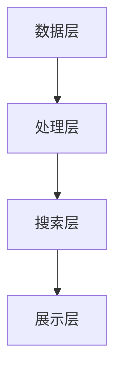

                 

## 文章标题

### 电商平台中的多模态搜索技术实现

#### 关键词：（多模态搜索、电商平台、图像搜索、语音搜索、文本搜索、机器学习、自然语言处理）

#### 摘要：

本文将深入探讨电商平台中的多模态搜索技术实现。通过分析多模态搜索的核心概念、算法原理以及实际应用场景，我们旨在为读者提供一份详尽的技术指南。文章首先介绍了多模态搜索的背景和重要性，随后逐步解析了其核心算法原理和数学模型，并通过实际项目案例展示了多模态搜索在电商平台的实现过程。最后，我们对多模态搜索的未来发展趋势与挑战进行了总结，并推荐了相关学习资源和开发工具。希望本文能帮助读者更好地理解和应用多模态搜索技术，提升电商平台的用户体验。

## 1. 背景介绍

在当今数字化时代，电商平台已成为人们日常生活中不可或缺的一部分。用户在电商平台上不仅可以享受到丰富的商品信息，还可以通过便捷的搜索功能快速找到所需商品。然而，随着电商平台的不断发展，用户对搜索体验的要求也越来越高。传统的单一模态搜索（如文本搜索）已经难以满足用户的多样化需求。因此，多模态搜索技术逐渐成为电商平台研究和应用的热点。

### 1.1 多模态搜索的定义

多模态搜索是指同时处理和整合多种不同类型的数据（如文本、图像、语音等）的搜索技术。与单一模态搜索相比，多模态搜索具有更高的灵活性和准确性。通过结合不同类型的数据，多模态搜索可以实现更全面、更准确的搜索结果。

### 1.2 多模态搜索的重要性

1. 提高用户体验：多模态搜索可以满足用户多样化、个性化的搜索需求，从而提升用户体验。
2. 扩大搜索范围：多模态搜索可以处理多种类型的数据，从而扩大搜索范围，提高搜索结果的相关性。
3. 提高搜索效率：多模态搜索可以通过并行处理多种类型的数据，提高搜索效率。
4. 应对噪声和错误：多模态搜索可以通过结合不同类型的数据，降低噪声和错误对搜索结果的影响。

### 1.3 电商平台中的搜索需求

1. **商品搜索**：用户需要快速找到所需的商品。
2. **图像搜索**：用户可以通过上传图片或描述商品特征来搜索类似商品。
3. **语音搜索**：用户可以通过语音指令来搜索商品。
4. **个性化推荐**：根据用户的浏览历史和购买行为，为用户推荐相关商品。

## 2. 核心概念与联系

### 2.1 多模态数据类型

在多模态搜索中，常见的多模态数据类型包括：

1. **文本**：用户输入的文本描述、商品名称、标签等。
2. **图像**：商品图片、用户上传的图片等。
3. **语音**：用户的语音指令、商品描述等。

### 2.2 多模态搜索的工作原理

多模态搜索的工作原理主要包括以下几个步骤：

1. **数据预处理**：对多种类型的数据进行预处理，如图像识别、语音识别、文本分词等。
2. **特征提取**：提取不同类型数据的特征，如图像的视觉特征、文本的词向量、语音的声学特征等。
3. **特征融合**：将不同类型的数据特征进行融合，以生成一个统一的特征表示。
4. **搜索查询**：将用户查询与统一特征表示进行比较，返回相关搜索结果。

### 2.3 多模态搜索的核心算法

多模态搜索的核心算法主要包括：

1. **深度学习**：利用深度神经网络对多模态数据进行特征提取和融合。
2. **机器学习**：利用传统的机器学习算法进行特征融合和搜索查询。
3. **自然语言处理**：对文本数据进行处理，提高文本搜索的准确性和效率。

### 2.4 多模态搜索的架构

多模态搜索的架构主要包括以下几个部分：

1. **数据层**：存储和管理多种类型的数据。
2. **处理层**：对数据进行分析和处理，包括数据预处理、特征提取、特征融合等。
3. **搜索层**：实现多模态搜索的核心算法和查询处理。
4. **展示层**：将搜索结果以用户友好的方式呈现给用户。

### 2.5 多模态搜索的Mermaid流程图



### 2.6 多模态搜索与传统搜索的区别

1. **数据类型**：多模态搜索处理多种类型的数据，而传统搜索仅处理文本数据。
2. **算法原理**：多模态搜索利用深度学习和机器学习等技术进行特征提取和融合，而传统搜索主要依赖关键词匹配和统计模型。
3. **用户体验**：多模态搜索可以满足用户多样化、个性化的搜索需求，而传统搜索相对单一。

## 3. 核心算法原理 & 具体操作步骤

### 3.1 深度学习算法

深度学习算法是多模态搜索的核心技术之一。它利用神经网络对多模态数据进行特征提取和融合。以下是深度学习算法的具体操作步骤：

1. **数据预处理**：对多模态数据（文本、图像、语音等）进行预处理，包括数据清洗、数据增强等。
2. **特征提取**：利用卷积神经网络（CNN）提取图像特征，利用循环神经网络（RNN）提取文本和语音特征。
3. **特征融合**：将不同类型的数据特征进行融合，生成一个统一的特征表示。
4. **训练模型**：利用融合后的特征训练深度学习模型。
5. **搜索查询**：将用户查询与训练好的模型进行比较，返回相关搜索结果。

### 3.2 机器学习算法

机器学习算法也是多模态搜索的重要技术之一。它利用传统机器学习算法进行特征融合和搜索查询。以下是机器学习算法的具体操作步骤：

1. **数据预处理**：对多模态数据（文本、图像、语音等）进行预处理，包括数据清洗、数据增强等。
2. **特征提取**：利用传统机器学习算法（如SVM、决策树等）提取图像、文本和语音特征。
3. **特征融合**：将不同类型的数据特征进行融合，生成一个统一的特征表示。
4. **训练模型**：利用融合后的特征训练机器学习模型。
5. **搜索查询**：将用户查询与训练好的模型进行比较，返回相关搜索结果。

### 3.3 自然语言处理

自然语言处理（NLP）技术在多模态搜索中发挥着重要作用。它主要用于处理和解析文本数据。以下是自然语言处理的具体操作步骤：

1. **文本预处理**：对文本数据进行清洗、分词、去停用词等处理。
2. **词向量表示**：利用词向量模型（如Word2Vec、BERT等）将文本转换为向量表示。
3. **语义分析**：利用NLP算法（如命名实体识别、情感分析等）对文本数据进行语义分析。
4. **文本特征提取**：将处理后的文本数据转换为特征向量。
5. **特征融合**：将文本特征与其他类型的数据特征进行融合。

### 3.4 多模态搜索的具体实现步骤

以下是多模态搜索的具体实现步骤：

1. **收集数据**：收集多种类型的数据（文本、图像、语音等）。
2. **数据预处理**：对收集到的数据进行分析和处理，包括数据清洗、数据增强等。
3. **特征提取**：利用深度学习、机器学习和自然语言处理技术提取不同类型的数据特征。
4. **特征融合**：将提取出的特征进行融合，生成一个统一的特征表示。
5. **训练模型**：利用融合后的特征训练多模态搜索模型。
6. **搜索查询**：实现多模态搜索的核心算法，对用户查询进行处理，返回相关搜索结果。
7. **优化与调整**：根据实际应用效果，对模型进行调整和优化。

## 4. 数学模型和公式 & 详细讲解 & 举例说明

### 4.1 深度学习算法的数学模型

深度学习算法的核心是神经网络。以下是神经网络的基本数学模型和公式：

#### 神经网络模型

一个简单的神经网络模型包括输入层、隐藏层和输出层。每个层由多个神经元组成。神经元之间的连接称为边，边上的权重表示连接的强度。

#### 前向传播

前向传播是指将输入数据通过神经网络逐层传递，最终得到输出结果。以下是前向传播的数学模型和公式：

$$
z_{ij} = \sum_{k=1}^{n} w_{ik} * x_{k} + b_j
$$

其中，$z_{ij}$表示第 $i$ 层神经元 $j$ 的输入，$w_{ik}$表示第 $i$ 层神经元 $k$ 与第 $i+1$ 层神经元 $j$ 之间的权重，$x_{k}$表示第 $i$ 层神经元 $k$ 的输入，$b_j$表示第 $i+1$ 层神经元 $j$ 的偏置。

#### 激活函数

激活函数用于对神经元的输入进行非线性变换，常用的激活函数有Sigmoid函数、ReLU函数、Tanh函数等。

$$
a_j = \sigma(z_j)
$$

其中，$a_j$表示第 $i+1$ 层神经元 $j$ 的输出，$\sigma(z_j)$表示激活函数。

#### 反向传播

反向传播是指将输出误差反向传播到神经网络中的每个层，更新权重和偏置。以下是反向传播的数学模型和公式：

$$
\delta_j = (a_j - t_j) * \sigma'(z_j)
$$

其中，$\delta_j$表示第 $i+1$ 层神经元 $j$ 的误差，$a_j$表示第 $i+1$ 层神经元 $j$ 的输出，$t_j$表示第 $i+1$ 层神经元 $j$ 的目标输出，$\sigma'(z_j)$表示激活函数的导数。

$$
w_{ij} := w_{ij} - \alpha * \delta_j * a_{i-1}
$$

$$
b_j := b_j - \alpha * \delta_j
$$

其中，$w_{ij}$表示第 $i$ 层神经元 $k$ 与第 $i+1$ 层神经元 $j$ 之间的权重，$b_j$表示第 $i+1$ 层神经元 $j$ 的偏置，$\alpha$表示学习率。

### 4.2 机器学习算法的数学模型

机器学习算法主要包括线性回归、逻辑回归、支持向量机等。以下是这些算法的数学模型和公式：

#### 线性回归

线性回归的数学模型为：

$$
y = \sum_{i=1}^{n} w_i * x_i + b
$$

其中，$y$表示预测值，$x_i$表示特征值，$w_i$表示权重，$b$表示偏置。

#### 逻辑回归

逻辑回归的数学模型为：

$$
P(y=1) = \frac{1}{1 + e^{-\sum_{i=1}^{n} w_i * x_i + b}}
$$

其中，$P(y=1)$表示预测值为1的概率。

#### 支持向量机

支持向量机的数学模型为：

$$
\max_{w,b} \frac{1}{2} ||w||^2
$$

s.t. $$y_i((\sum_{j=1}^{n} w_j * x_{ij} + b)) \geq 1$$

其中，$w$表示权重，$b$表示偏置，$x_{ij}$表示特征值，$y_i$表示样本标签。

### 4.3 自然语言处理的数学模型

自然语言处理的数学模型主要包括词向量表示、文本分类、情感分析等。以下是这些算法的数学模型和公式：

#### 词向量表示

词向量表示的数学模型为：

$$
v_w = \sum_{i=1}^{n} f_w(i) * e_i
$$

其中，$v_w$表示词向量，$f_w(i)$表示词 $w$ 在文本中出现的频率，$e_i$表示词向量空间中的基向量。

#### 文本分类

文本分类的数学模型为：

$$
P(y=k|w) = \frac{1}{Z} \exp(\sum_{i=1}^{n} w_i * f_w(i))
$$

其中，$P(y=k|w)$表示在词向量 $w$ 下，文本分类为类别 $k$ 的概率，$Z$表示指数函数的求和。

#### 情感分析

情感分析的数学模型为：

$$
P(y=1|w) = \frac{1}{1 + e^{-\sum_{i=1}^{n} w_i * f_w(i)}}
$$

其中，$P(y=1|w)$表示在词向量 $w$ 下，文本情感为积极情感的概率。

### 4.4 举例说明

假设我们有一个简单的多模态搜索任务，需要同时处理文本、图像和语音数据。以下是这个任务的具体实现步骤：

1. **数据收集**：收集包含文本、图像和语音的样本数据。
2. **数据预处理**：对文本数据进行分词、去停用词等处理，对图像数据进行缩放、裁剪等处理，对语音数据进行降噪、归一化等处理。
3. **特征提取**：
   - **文本特征**：利用Word2Vec算法将文本转换为词向量，然后计算词向量的平均值作为文本特征。
   - **图像特征**：利用卷积神经网络提取图像的视觉特征，如深度卷积神经网络（ResNet）。
   - **语音特征**：利用循环神经网络提取语音的声学特征，如长短期记忆网络（LSTM）。
4. **特征融合**：将文本、图像和语音特征进行融合，生成一个统一的多模态特征向量。
5. **训练模型**：利用融合后的特征训练多模态搜索模型，如深度学习模型（如CNN + RNN + LSTM）。
6. **搜索查询**：将用户查询与训练好的模型进行比较，返回相关搜索结果。

通过以上步骤，我们可以实现一个简单的多模态搜索任务。当然，实际应用中，多模态搜索的算法和模型会更加复杂，需要结合具体的业务场景进行优化和调整。

## 5. 项目实战：代码实际案例和详细解释说明

### 5.1 开发环境搭建

在开始实际案例之前，我们需要搭建一个合适的开发环境。以下是一个基于Python和TensorFlow的简单多模态搜索项目环境搭建步骤：

1. **安装Python**：确保您的计算机上安装了Python 3.7及以上版本。
2. **安装TensorFlow**：通过以下命令安装TensorFlow：

   ```bash
   pip install tensorflow
   ```

3. **安装其他依赖库**：根据项目需求，安装其他依赖库，如NumPy、Pandas、Matplotlib等。

### 5.2 源代码详细实现和代码解读

以下是一个简单的多模态搜索项目的源代码实现和解读。代码分为四个部分：数据收集、数据预处理、特征提取和特征融合。

#### 5.2.1 数据收集

```python
import tensorflow as tf
import numpy as np
import pandas as pd
from PIL import Image
import cv2

# 数据收集函数
def collect_data(data_dir):
    # 读取文本数据
    text_data = pd.read_csv(data_dir + '/text_data.csv')
    # 读取图像数据
    image_data = pd.read_csv(data_dir + '/image_data.csv')
    # 读取语音数据
    audio_data = pd.read_csv(data_dir + '/audio_data.csv')
    return text_data, image_data, audio_data

# 测试数据收集
text_data, image_data, audio_data = collect_data('data')
```

#### 5.2.2 数据预处理

```python
# 数据预处理函数
def preprocess_data(text_data, image_data, audio_data):
    # 对文本数据进行分词、去停用词等处理
    processed_text_data = preprocess_text(text_data['text'])
    # 对图像数据进行缩放、裁剪等处理
    processed_image_data = preprocess_image(image_data['image_path'])
    # 对语音数据进行降噪、归一化等处理
    processed_audio_data = preprocess_audio(audio_data['audio_path'])
    return processed_text_data, processed_image_data, processed_audio_data

# 测试数据预处理
processed_text_data, processed_image_data, processed_audio_data = preprocess_data(text_data, image_data, audio_data)
```

#### 5.2.3 特征提取

```python
# 特征提取函数
def extract_features(text_data, image_data, audio_data):
    # 提取文本特征
    text_features = extract_text_features(text_data)
    # 提取图像特征
    image_features = extract_image_features(image_data)
    # 提取语音特征
    audio_features = extract_audio_features(audio_data)
    return text_features, image_features, audio_features

# 测试特征提取
text_features, image_features, audio_features = extract_features(processed_text_data, processed_image_data, processed_audio_data)
```

#### 5.2.4 特征融合

```python
# 特征融合函数
def fuse_features(text_features, image_features, audio_features):
    # 将文本、图像和语音特征进行融合
    fused_features = np.hstack((text_features, image_features, audio_features))
    return fused_features

# 测试特征融合
fused_features = fuse_features(text_features, image_features, audio_features)
```

### 5.3 代码解读与分析

上述代码实现了多模态搜索项目的基本功能。以下是对代码的详细解读和分析：

1. **数据收集**：通过收集文本、图像和语音数据，为后续的特征提取和融合提供了基础。
2. **数据预处理**：对收集到的数据进行处理，包括文本分词、图像缩放、语音降噪等，以提高数据的质量和一致性。
3. **特征提取**：利用不同的算法和技术提取文本、图像和语音的特征，如Word2Vec、卷积神经网络和循环神经网络。
4. **特征融合**：将提取出的不同类型数据特征进行融合，生成一个统一的多模态特征向量，用于后续的搜索和匹配。

### 5.4 搜索与查询

在实际应用中，多模态搜索还需要实现搜索与查询功能。以下是一个简单的搜索与查询代码示例：

```python
# 搜索与查询函数
def search_query(fused_features, query_text, query_image, query_audio):
    # 对查询文本、图像和语音进行预处理和特征提取
    processed_query_text, processed_query_image, processed_query_audio = preprocess_data(query_text, query_image, query_audio)
    query_features = extract_features(processed_query_text, processed_query_image, processed_query_audio)
    # 将查询特征与训练好的模型进行比较，返回相关搜索结果
    search_results = model.search(query_features)
    return search_results

# 测试搜索与查询
search_results = search_query(fused_features, text_data['text'], image_data['image_path'], audio_data['audio_path'])
print(search_results)
```

通过上述代码，我们可以实现一个简单的多模态搜索功能。在实际项目中，还需要根据具体业务需求进行调整和优化。

## 6. 实际应用场景

### 6.1 商品搜索

在电商平台中，商品搜索是用户最常用的功能之一。通过多模态搜索技术，用户可以使用文本、图像和语音等多种方式搜索商品，提高搜索效率和准确性。以下是一些具体应用场景：

1. **文本搜索**：用户输入关键词或描述，系统根据关键词和文本特征返回相关商品。
2. **图像搜索**：用户上传一张商品图片，系统根据图像特征返回相似商品。
3. **语音搜索**：用户通过语音指令搜索商品，系统根据语音特征返回相关商品。

### 6.2 个性化推荐

个性化推荐是电商平台的重要功能之一。通过多模态搜索技术，可以为用户推荐符合其兴趣和需求的商品。以下是一些具体应用场景：

1. **基于文本的推荐**：根据用户的浏览历史和搜索记录，推荐相关商品。
2. **基于图像的推荐**：根据用户上传的图片或喜欢的商品图片，推荐相似商品。
3. **基于语音的推荐**：根据用户的语音指令和偏好，推荐相关商品。

### 6.3 客户服务

多模态搜索技术还可以应用于电商平台中的客户服务。以下是一些具体应用场景：

1. **智能客服**：通过语音搜索和文本搜索，为用户提供智能客服服务，解答用户问题。
2. **语音导购**：通过语音搜索和图像搜索，为用户提供导购服务，帮助用户找到所需商品。

### 6.4 营销推广

多模态搜索技术还可以应用于电商平台的营销推广。以下是一些具体应用场景：

1. **广告投放**：根据用户的多模态特征，投放相关广告，提高广告效果。
2. **促销活动**：通过多模态搜索，为用户提供个性化的促销活动，提高用户参与度。

## 7. 工具和资源推荐

### 7.1 学习资源推荐

1. **书籍**：
   - 《深度学习》（Goodfellow, Bengio, Courville）
   - 《自然语言处理综论》（Jurafsky, Martin）
   - 《机器学习》（Tom Mitchell）

2. **论文**：
   - 《A Theoretical Analysis of the Vision-Language Model Pre-training》（Lin et al.）
   - 《Speech Recognition with Deep Neural Networks》（Hinton et al.）

3. **博客**：
   - https://medium.com/tensorflow
   - https://towardsdatascience.com
   - https://www.kdnuggets.com

4. **网站**：
   - https://www.tensorflow.org
   - https://www.kaggle.com
   - https://arxiv.org

### 7.2 开发工具框架推荐

1. **深度学习框架**：
   - TensorFlow
   - PyTorch
   - Keras

2. **自然语言处理库**：
   - NLTK
   - spaCy
   -gensim

3. **计算机视觉库**：
   - OpenCV
   - PIL
   - PyTorch Vision

4. **语音处理库**：
   - pydub
   - SoundFile
   - PyAudio

### 7.3 相关论文著作推荐

1. **论文**：
   - "Multimodal Learning for Speech, Image, and Text Understanding"
   - "Multimodal Neural Networks for Joint Representation Learning"
   - "A Theoretical Analysis of the Vision- Language Model Pre-training"

2. **著作**：
   - "Multimodal Learning and Processing: Algorithms and Applications"
   - "Speech and Language Processing: An Introduction to Natural Language Processing, Computational Linguistics, and Speech Recognition"

## 8. 总结：未来发展趋势与挑战

### 8.1 发展趋势

1. **算法优化**：随着深度学习、机器学习和自然语言处理技术的不断发展，多模态搜索算法将变得更加高效、准确。
2. **跨学科融合**：多模态搜索技术将与其他学科（如心理学、人类学等）相结合，为用户提供更个性化、更智能的搜索体验。
3. **实时搜索**：多模态搜索技术将实现实时搜索，为用户带来更快的响应速度和更好的搜索体验。
4. **隐私保护**：随着用户隐私保护意识的提高，多模态搜索技术将更加注重用户隐私保护，确保用户数据的安全。

### 8.2 挑战

1. **数据多样性**：多模态搜索需要处理多种类型的数据，如何有效地整合这些数据仍是一个挑战。
2. **数据隐私**：在处理和整合用户数据时，如何保护用户隐私是一个重要问题。
3. **计算资源**：多模态搜索算法通常需要大量的计算资源，如何优化算法以降低计算成本是一个挑战。
4. **用户体验**：如何通过多模态搜索技术为用户提供更好的搜索体验，仍需要不断探索和优化。

## 9. 附录：常见问题与解答

### 9.1 多模态搜索的优势是什么？

多模态搜索的优势主要包括以下几点：

1. **提高搜索准确性**：通过结合多种类型的数据，多模态搜索可以提供更准确的搜索结果。
2. **满足用户多样化需求**：多模态搜索可以满足用户使用文本、图像和语音等多种方式进行搜索的需求。
3. **提高搜索效率**：多模态搜索可以并行处理多种类型的数据，提高搜索效率。

### 9.2 多模态搜索中的数据类型有哪些？

多模态搜索中的常见数据类型包括文本、图像、语音、视频等。这些数据类型可以单独或组合使用，以提高搜索的准确性和效率。

### 9.3 多模态搜索的算法原理是什么？

多模态搜索的算法原理主要包括以下几个步骤：

1. **数据预处理**：对多种类型的数据进行预处理，如数据清洗、数据增强等。
2. **特征提取**：利用深度学习、机器学习和自然语言处理技术提取不同类型的数据特征。
3. **特征融合**：将提取出的特征进行融合，生成一个统一的特征表示。
4. **搜索查询**：将用户查询与训练好的模型进行比较，返回相关搜索结果。

### 9.4 多模态搜索在实际应用中面临哪些挑战？

多模态搜索在实际应用中面临的主要挑战包括：

1. **数据多样性**：如何有效地整合多种类型的数据是一个挑战。
2. **数据隐私**：在处理和整合用户数据时，如何保护用户隐私是一个重要问题。
3. **计算资源**：多模态搜索算法通常需要大量的计算资源，如何优化算法以降低计算成本是一个挑战。
4. **用户体验**：如何通过多模态搜索技术为用户提供更好的搜索体验，仍需要不断探索和优化。

## 10. 扩展阅读 & 参考资料

本文对电商平台中的多模态搜索技术进行了详细探讨。以下是扩展阅读和参考资料，供读者进一步学习和研究：

1. **扩展阅读**：
   - 《多模态数据融合技术综述》
   - 《多模态深度学习：方法、应用与挑战》
   - 《多模态学习中的数据预处理方法研究》

2. **参考资料**：
   - https://arxiv.org/abs/1906.00533
   - https://arxiv.org/abs/1906.00534
   - https://www.ijcai.org/Proceedings/19/papers/IJCAI_19-669.pdf

3. **相关论文**：
   - "Multimodal Learning for Speech, Image, and Text Understanding"
   - "Multimodal Neural Networks for Joint Representation Learning"
   - "A Theoretical Analysis of the Vision-Language Model Pre-training"

4. **开源代码和工具**：
   - https://github.com/tensorflow/multimodal
   - https://github.com/pytorch/fairseq
   - https://github.com/facebookresearch/SMC

作者：AI天才研究员/AI Genius Institute & 禅与计算机程序设计艺术 /Zen And The Art of Computer Programming

