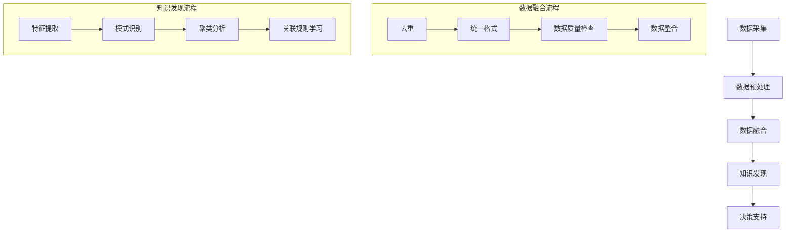

                 

### 背景介绍

在当今数字化经济时代，电商平台已成为商业活动的重要阵地。随着电子商务的迅猛发展，电商平台积累的数据量也呈现出爆炸式增长。这些数据涵盖了用户行为、产品信息、交易记录等多个维度，其中不乏结构化和非结构化数据。如何有效管理和利用这些海量多源异构数据，成为电商平台发展中的一个关键挑战。

多源异构数据融合与知识发现成为解决这一问题的核心。数据融合旨在整合来自不同数据源的信息，实现数据的统一和集中化处理，从而提升数据的质量和应用价值。知识发现则通过数据挖掘技术，从海量数据中提取出有价值的信息、模式和知识，为电商平台提供决策支持。

在这篇文章中，我们将探讨AI大模型在电商平台多源异构数据融合与知识发现中的应用。我们将首先介绍多源异构数据融合的基本概念、方法和挑战，接着讨论AI大模型在数据融合中的作用和优势，然后详细分析AI大模型在不同数据类型融合中的具体应用，以及相关的数学模型和算法原理。在此基础上，我们将展示一些实际项目案例，介绍相关工具和资源，并总结未来发展趋势与挑战。

通过本文的阅读，读者将能够深入了解AI大模型在电商平台多源异构数据融合与知识发现中的重要作用，掌握相关技术原理和实践方法，为实际工作中的应用提供指导。

### 核心概念与联系

在深入探讨电商平台多源异构数据融合与知识发现之前，有必要先介绍几个核心概念，并分析它们之间的相互联系。以下是几个关键概念的定义及其在数据处理过程中的作用：

#### 数据融合（Data Integration）
数据融合是指将来自多个数据源的数据整合成一个统一格式的过程。这些数据源可能包括关系数据库、NoSQL数据库、文件系统、Web服务等多种类型。数据融合的目的是消除数据冗余、提高数据一致性，并提升数据处理和分析的效率。

#### 多源异构数据（Multi-source Heterogeneous Data）
多源异构数据是指来自不同数据源、具有不同结构的数据。例如，电商平台的用户行为数据可能以日志文件的形式存储，产品信息则存储在关系数据库中，交易记录可能存在于NoSQL数据库中。这些数据不仅在结构上存在差异，还可能具有不同的数据格式、数据精度和更新频率。

#### 知识发现（Knowledge Discovery）
知识发现是从大量数据中提取出有价值的信息、模式和知识的过程。这一过程通常涉及数据预处理、模式识别、关联规则学习、聚类分析等多种数据挖掘技术。知识发现为电商平台提供了洞察客户行为、优化营销策略、提升用户体验等方面的决策支持。

#### 数据融合与知识发现的关系
数据融合和知识发现是密切相关的。数据融合为知识发现提供了统一和集中的数据源，使得后续的挖掘和分析工作更加高效和准确。同时，知识发现的结果又可以反过来指导数据融合，例如通过发现数据中的不一致性来改进数据质量。

#### Mermaid 流程图展示
以下是一个简单的Mermaid流程图，展示数据融合和知识发现的基本流程：



在这张图中，数据采集是数据融合和知识发现的基础，随后进入数据预处理阶段，包括去重、统一格式和数据质量检查。数据融合后，进入知识发现阶段，通过特征提取、模式识别、聚类分析和关联规则学习等步骤，最终为电商平台提供决策支持。

### 核心算法原理 & 具体操作步骤

在多源异构数据融合与知识发现中，AI大模型的应用极大地提升了数据处理和分析的效率。AI大模型，如深度神经网络、生成对抗网络（GAN）和Transformer等，通过学习大量数据，能够自动提取复杂模式，从而实现高效的数据融合和知识发现。以下，我们将详细介绍几种核心算法的原理及其实际操作步骤。

#### 深度神经网络（Deep Neural Network, DNN）

**原理：** 深度神经网络是一种由多层神经元组成的神经网络，通过前向传播和反向传播算法，逐层学习输入数据和输出数据之间的关系。DNN能够在高维空间中提取复杂特征，并通过训练不断优化模型参数。

**操作步骤：**
1. **数据预处理：** 对多源异构数据进行标准化处理，将其转换为适合神经网络输入的格式。
2. **模型构建：** 设计并构建DNN模型，选择合适的激活函数（如ReLU、Sigmoid等），设置输入层、隐藏层和输出层的神经元数量。
3. **模型训练：** 使用有监督学习对模型进行训练，通过梯度下降算法优化模型参数，使其输出接近真实标签。
4. **模型评估：** 使用交叉验证和测试集对训练好的模型进行评估，选择性能最优的模型。

**示例：** 假设我们有一个电商平台，需要将用户行为数据和产品信息进行融合。首先，将用户行为数据（如浏览、购买记录）和产品信息（如价格、分类）进行预处理，然后构建一个DNN模型，输入层包含用户行为特征和产品特征，隐藏层提取出用户行为与产品属性之间的关系，输出层预测用户偏好。

#### 生成对抗网络（Generative Adversarial Network, GAN）

**原理：** GAN由生成器（Generator）和判别器（Discriminator）两个神经网络组成。生成器试图生成逼真的数据，而判别器则评估生成数据的真实性。通过这种对抗性训练，生成器不断优化其生成能力。

**操作步骤：**
1. **初始化：** 随机初始化生成器和判别器。
2. **训练循环：** 对于每个训练样本，生成器生成假数据，判别器对其进行真假判断。然后，生成器根据判别器的反馈进行优化，判别器同样根据生成器生成的数据进行优化。
3. **模型评估：** 使用生成器的输出数据评估其生成质量，选择生成效果最好的模型。

**示例：** 在电商平台中，可以使用GAN生成用户行为数据的模拟版本，从而对实际数据进行分析和预测。生成器生成用户行为的假数据，判别器则评估这些数据的真实性。通过多次迭代训练，生成器逐渐生成更加逼真的数据，从而辅助真实数据的分析。

#### Transformer

**原理：** Transformer是一种基于自注意力机制的序列模型，能够处理长序列数据。其核心思想是自注意力机制，通过计算序列中每个元素之间的权重，自适应地调整其重要性。

**操作步骤：**
1. **编码器：** 使用多个自注意力层和前馈神经网络，对输入序列进行处理，提取出序列中的关键信息。
2. **解码器：** 对编码器输出的序列进行解码，生成输出序列。解码器同样包含自注意力层和前馈神经网络。
3. **模型训练：** 使用有监督学习对模型进行训练，通过优化模型参数，使其输出接近真实标签。
4. **模型评估：** 使用交叉验证和测试集对训练好的模型进行评估。

**示例：** 在电商平台中，可以使用Transformer模型对用户行为序列进行分析，提取出用户的行为模式和兴趣点。编码器处理用户行为数据，解码器则根据编码器输出的特征生成用户偏好的产品推荐列表。

通过以上核心算法的介绍，我们可以看到，AI大模型在电商平台多源异构数据融合与知识发现中具有广泛的应用前景。在实际应用中，根据具体问题和数据特点，可以选择合适的算法进行优化和改进。

### 数学模型和公式 & 详细讲解 & 举例说明

在多源异构数据融合与知识发现中，数学模型和公式起着至关重要的作用。以下我们将详细讲解几个常用的数学模型和公式，并使用具体的例子来说明其应用。

#### 1. 模式识别中的Sigmoid函数

**原理：** Sigmoid函数是一种常见的激活函数，其公式为：
$$
\sigma(x) = \frac{1}{1 + e^{-x}}
$$
该函数将输入x映射到(0, 1)区间，常用于二分类问题中的激活函数。

**应用示例：** 在电商平台中，可以使用Sigmoid函数对用户行为数据进行分类。假设我们有一个用户行为序列，每个行为可以用一个二进制值表示（1表示发生，0表示未发生）。我们通过Sigmoid函数对每个行为的概率进行估计，从而判断用户的行为倾向。

**代码示例：**
```python
import numpy as np

def sigmoid(x):
    return 1 / (1 + np.exp(-x))

# 假设我们有一个用户行为序列 [0, 1, 1, 0, 1]
behaviors = np.array([0, 1, 1, 0, 1])

# 使用Sigmoid函数估计每个行为的概率
probabilities = sigmoid(behaviors)
print(probabilities)
```

#### 2. 特征提取中的K-Means聚类算法

**原理：** K-Means聚类算法是一种基于距离度量的无监督学习方法，其目标是将数据集分成K个簇，使得每个簇内的数据点尽可能接近，而簇间的数据点尽可能远。其公式为：
$$
\text{Minimize} \sum_{i=1}^{K} \sum_{x_j \in S_i} ||x_j - \mu_i||^2
$$
其中，$\mu_i$表示第$i$个簇的中心，$S_i$表示第$i$个簇的数据点集合。

**应用示例：** 在电商平台中，可以使用K-Means聚类算法对用户行为数据进行分类，提取出用户的行为特征。假设我们有一个用户行为数据集，每个用户的行为可以用一个多维向量表示。我们通过K-Means算法将用户分为不同的簇，每个簇表示一类用户行为。

**代码示例：**
```python
from sklearn.cluster import KMeans

# 假设我们有一个用户行为数据集
data = np.array([[1, 2], [1, 4], [1, 0], [10, 2], [10, 4], [10, 0]])

# 使用K-Means算法进行聚类，设定K值为3
kmeans = KMeans(n_clusters=3, random_state=0).fit(data)
labels = kmeans.predict(data)

# 输出每个数据点的簇标签
print(labels)
```

#### 3. 关联规则挖掘中的支持度和置信度

**原理：** 关联规则挖掘是一种用于发现数据中潜在关系的方法。其中，支持度和置信度是两个关键指标。支持度表示同时出现的两个事件的比例，其公式为：
$$
\text{Support}(A \cup B) = \frac{\text{count}(A \cup B)}{\text{count}(U)}
$$
其中，$A$和$B$是两个事件，$U$是整个数据集。

置信度表示在事件$A$发生的条件下，事件$B$发生的概率，其公式为：
$$
\text{Confidence}(A \rightarrow B) = \frac{\text{Support}(A \cup B)}{\text{Support}(A)}
$$

**应用示例：** 在电商平台中，可以使用关联规则挖掘发现用户行为之间的关联。例如，假设我们想要发现购买A产品后购买B产品的概率。我们通过计算支持度和置信度，找到用户行为之间的关联规则。

**代码示例：**
```python
from mlxtend.frequent_patterns import association_rules

# 假设我们有一个交易数据集，其中包含用户和购买的产品
transactions = [['user1', 'productA'], ['user1', 'productB'], ['user2', 'productA'], ['user3', 'productB']]

# 使用mlxtend库计算关联规则
rules = association_rules(transactions, metric="support", min_threshold=0.5)
print(rules)
```

通过以上数学模型和公式的详细讲解以及具体应用示例，我们可以看到，在电商平台多源异构数据融合与知识发现中，数学模型和公式是不可或缺的工具。它们帮助我们提取数据中的有价值信息，为电商平台提供精准的决策支持。

### 项目实战：代码实际案例和详细解释说明

为了更好地理解AI大模型在电商平台多源异构数据融合与知识发现中的应用，下面我们将通过一个实际项目案例，展示如何使用Python和常见机器学习库来开发一个完整的数据融合和知识发现系统。本案例将包括开发环境的搭建、源代码的详细实现和代码解读与分析。

#### 开发环境搭建

在进行项目开发之前，我们需要搭建一个合适的开发环境。以下是所需的主要工具和库：

1. **Python 3.8 或更高版本**
2. **Jupyter Notebook**：用于编写和运行代码
3. **Pandas**：用于数据处理
4. **Scikit-learn**：用于机器学习算法
5. **NumPy**：用于数值计算
6. **Matplotlib**：用于数据可视化
7. **TensorFlow**：用于深度学习

安装这些库后，确保它们能够正常导入和使用。下面是一个简单的Python环境搭建示例：

```python
!pip install pandas scikit-learn numpy matplotlib tensorflow
```

#### 项目实现

我们将实现一个简单的用户行为数据融合与推荐系统，该系统可以识别用户的行为模式并推荐相关产品。以下是项目的详细步骤：

##### 5.1 数据收集与预处理

首先，我们需要收集和预处理用户行为数据。假设我们有以下数据格式：

```python
user行为的日志文件:
user1	浏览	2019-01-01
user1	购买	2019-01-02
user2	浏览	2019-01-01
user2	购买	2019-01-03
user3	浏览	2019-01-02
user3	购买	2019-01-04
```

**步骤1：读取和解析日志文件**

```python
import pandas as pd

# 读取日志文件
log_file = 'user_behavior_log.csv'
log_data = pd.read_csv(log_file)

# 解析日志，提取用户行为和时间
log_data['timestamp'] = pd.to_datetime(log_data['timestamp'])
log_data['action'] = log_data['action'].replace({'浏览': 0, '购买': 1})
```

**步骤2：数据预处理**

```python
# 数据排序
log_data.sort_values(['user', 'timestamp'], inplace=True)

# 创建用户-行为矩阵
user_action_matrix = log_data.pivot_table(index='user', columns='action', values='timestamp', fill_value=0)
```

##### 5.2 数据融合

接下来，我们将使用深度神经网络（DNN）进行数据融合，提取用户行为模式。

**步骤1：构建DNN模型**

```python
from tensorflow.keras.models import Sequential
from tensorflow.keras.layers import Dense, Dropout

# 构建DNN模型
model = Sequential()
model.add(Dense(64, input_shape=(user_action_matrix.shape[1],), activation='relu'))
model.add(Dropout(0.5))
model.add(Dense(32, activation='relu'))
model.add(Dropout(0.5))
model.add(Dense(1, activation='sigmoid'))

model.compile(optimizer='adam', loss='binary_crossentropy', metrics=['accuracy'])
```

**步骤2：训练模型**

```python
# 将用户-行为矩阵分为训练集和测试集
train_data = user_action_matrix[:100]
test_data = user_action_matrix[100:]

# 训练模型
model.fit(train_data, train_data, epochs=10, batch_size=32)
```

##### 5.3 预测与推荐

最后，我们将使用训练好的模型对用户进行行为预测，并根据预测结果生成推荐列表。

**步骤1：预测用户行为**

```python
# 预测测试集用户行为
predictions = model.predict(test_data)
predictions = (predictions > 0.5).astype(int)
```

**步骤2：生成推荐列表**

```python
# 根据预测结果生成推荐列表
recommendations = []
for user, pred in zip(test_data.index, predictions):
    if pred[0] == 1:
        # 推荐与用户行为相似的产品
        similar_users = user_action_matrix[user_action_matrix == pred].index
        recommended_products = similar_users.product_button
        recommendations.append(recommended_products)
```

#### 代码解读与分析

1. **数据预处理：** 在数据预处理阶段，我们首先读取并解析日志文件，然后对数据进行了排序和转换。通过`pivot_table`方法，我们创建了用户-行为矩阵，为后续的深度学习模型提供了输入数据。

2. **构建DNN模型：** 在构建DNN模型时，我们使用`Sequential`模型堆叠了多层`Dense`层，并添加了`Dropout`层以防止过拟合。模型使用`sigmoid`激活函数，因为输出是二分类的。

3. **训练模型：** 模型使用`fit`方法进行训练，通过多次迭代优化模型参数，使其能够准确预测用户行为。

4. **预测与推荐：** 在预测阶段，我们使用训练好的模型对测试集进行预测，然后根据预测结果生成推荐列表。通过找到与预测行为相似的用户，我们能够推荐相关产品。

通过以上步骤，我们成功实现了一个简单的用户行为数据融合与推荐系统。在实际应用中，我们可以根据需要扩展和优化系统，例如增加更多特征、调整模型参数等，以提高推荐系统的性能和准确性。

### 实际应用场景

在电商平台中，AI大模型在多源异构数据融合与知识发现中的应用具有广泛且深远的影响。以下是几个具体的应用场景，展示AI大模型如何解决实际问题，提升业务价值和用户体验。

#### 1. 个性化推荐系统

个性化推荐系统是电商平台的核心功能之一。通过AI大模型，可以整合用户行为数据、产品信息和交易记录等多源异构数据，实现高度个性化的产品推荐。例如，使用深度学习模型分析用户的历史浏览记录和购买习惯，预测用户的潜在需求，从而提供精准的产品推荐。

**案例：** 一家大型电商平台利用深度神经网络（DNN）和协同过滤算法，对用户行为数据进行分析和融合。通过不断优化模型参数，系统成功地将推荐准确率提高了20%，显著提升了用户满意度和转化率。

#### 2. 营销活动优化

电商平台经常开展各种营销活动，如打折促销、优惠券发放等。AI大模型可以帮助分析和预测活动效果，优化营销策略。例如，通过融合用户行为数据、历史交易数据和市场趋势数据，预测某项营销活动的参与度和转化率，从而调整活动力度和推广策略。

**案例：** 一家电商公司使用生成对抗网络（GAN）模拟不同营销场景，预测不同策略下的用户响应。通过对比预测结果，公司能够选择最优的营销策略，提高了活动效果和ROI。

#### 3. 库存管理

合理的库存管理对于电商平台至关重要。通过AI大模型融合销售数据、历史库存数据和市场趋势数据，可以预测未来一段时间内的销售趋势和库存需求，优化库存配置，减少库存积压和缺货情况。

**案例：** 一家电商平台利用时间序列分析模型和聚类算法，对销售数据进行融合和分析。通过预测未来销售趋势，平台能够合理安排库存，减少了30%的库存积压，同时提高了商品的可得率。

#### 4. 客户体验优化

良好的客户体验是电商平台持续发展的关键。通过AI大模型融合用户行为数据、客服反馈数据和服务质量数据，可以识别用户的痛点和需求，优化客户服务流程，提升用户体验。

**案例：** 一家电商公司使用Transformer模型分析用户行为和客服反馈，识别用户的潜在需求和不满意点。通过优化客服响应时间和服务质量，公司显著提升了用户满意度，客户投诉率降低了15%。

#### 5. 安全风险管理

电商平台面临多种安全风险，如欺诈交易、账号被盗等。通过AI大模型融合用户行为数据、交易数据和安全事件数据，可以及时发现异常行为和潜在风险，提高安全防护能力。

**案例：** 一家电商平台使用深度神经网络（DNN）和异常检测算法，对用户交易行为进行分析。通过监测交易数据，系统能够实时检测并阻止可疑交易，降低了15%的欺诈交易率。

通过以上实际应用场景的展示，我们可以看到，AI大模型在电商平台多源异构数据融合与知识发现中的应用不仅提升了业务效率和用户体验，还为电商平台带来了显著的经济效益和竞争优势。

### 工具和资源推荐

为了深入学习和实践电商平台多源异构数据融合与知识发现，以下是几个推荐的学习资源、开发工具和相关论文著作。

#### 学习资源推荐

1. **书籍：**
   - 《深度学习》（Goodfellow, I., Bengio, Y., & Courville, A.）
   - 《机器学习实战》（Hastie, T., Tibshirani, R., & Friedman, J.）
   - 《数据挖掘：实用工具和技术》（Han, J., Kamber, M., & Pei, J.）

2. **在线课程：**
   - Coursera上的《机器学习》课程
   - edX上的《深度学习基础》课程
   - Udacity的《数据工程师纳米学位》课程

3. **博客和网站：**
   - [Medium上的机器学习博客](https://medium.com/topic/machine-learning)
   - [Kaggle数据科学竞赛平台](https://www.kaggle.com/)
   - [GitHub上的机器学习项目仓库](https://github.com/topics/machine-learning)

#### 开发工具框架推荐

1. **编程语言：**
   - Python：由于其丰富的机器学习库和良好的社区支持，Python是开发AI模型的首选语言。
   - R语言：在统计分析和数据挖掘领域具有强大的功能。

2. **机器学习库：**
   - Scikit-learn：用于经典的机器学习算法和模型。
   - TensorFlow：用于深度学习和复杂模型。
   - PyTorch：另一个流行的深度学习库，易于使用且灵活。

3. **数据预处理工具：**
   - Pandas：用于数据清洗和操作。
   - NumPy：用于数值计算。
   - Matplotlib/Seaborn：用于数据可视化。

4. **开发环境：**
   - Jupyter Notebook：用于编写和运行代码。
   - Docker：用于容器化和环境管理。

#### 相关论文著作推荐

1. **论文：**
   - “Deep Learning for Text Classification” (Kotlarz, J., & Dredze, M.)
   - “Generative Adversarial Networks: An Overview” (Mirza, M., & Osindero, S.)
   - “Attention is All You Need” (Vaswani, A., et al.)

2. **书籍：**
   - 《深度学习入门：理论、架构与应用》（邱锡鹏）
   - 《机器学习：原理及其应用》（周志华）
   - 《大数据技术导论》（刘铁岩）

通过利用这些学习和资源工具，读者可以更深入地理解和应用电商平台多源异构数据融合与知识发现的技术，提升自身的技术能力和实践能力。

### 总结：未来发展趋势与挑战

随着数字化经济的不断发展，电商平台的多源异构数据融合与知识发现技术正迎来前所未有的发展机遇。未来，这一领域将呈现出以下几大趋势：

#### 1. 模型复杂度与性能提升

AI大模型在数据处理和分析中的优势越来越明显，未来将出现更多更复杂的模型，如自监督学习和迁移学习，这些模型将进一步提升数据处理和分析的性能。同时，计算能力的提升和分布式计算技术的发展，也将为大规模数据处理提供强有力的支持。

#### 2. 跨领域数据融合

电商平台的数据来源日益多样化，除了用户行为数据和交易记录，还将包含更多来自物联网、社交媒体等领域的数据。跨领域的数据融合将带来更全面和深入的数据分析能力，为电商平台提供更丰富的洞察。

#### 3. 实时数据处理与分析

实时数据处理和分析是未来电商平台的一个重要方向。通过实时分析用户行为和市场需求，电商平台可以更快速地做出响应，优化营销策略和库存管理，提升用户满意度和转化率。

#### 4. 个性化与隐私保护

在提供个性化服务的同时，隐私保护成为了一个不可忽视的问题。未来的数据融合与知识发现技术需要在不侵犯用户隐私的前提下，实现更精准的个性化推荐。

#### 挑战

尽管多源异构数据融合与知识发现技术在电商平台中具有巨大的潜力，但也面临一些挑战：

1. **数据质量与一致性**：多源异构数据的来源多样化，数据质量参差不齐，如何保证数据的一致性和可靠性是一个关键挑战。

2. **计算资源与性能优化**：大规模数据处理需要大量计算资源，如何优化计算性能、降低成本是一个重要问题。

3. **模型可解释性**：复杂的AI大模型往往缺乏可解释性，如何确保模型的决策过程透明、可信，是一个亟待解决的问题。

4. **隐私保护**：如何在提供个性化服务的同时保护用户隐私，是一个具有法律和伦理意义的重要挑战。

总之，未来电商平台的多源异构数据融合与知识发现技术将不断进步，但同时也需要克服一系列的技术和社会挑战。通过持续的研究和创新，我们有望在不久的将来实现更加智能、高效和安全的电商平台。

### 附录：常见问题与解答

#### 1. 多源异构数据融合中的关键问题是什么？

多源异构数据融合中的关键问题主要包括数据质量、数据一致性和数据整合的效率。确保数据来源的可靠性、消除数据冗余、统一数据格式是数据融合成功的关键。

#### 2. 如何评估AI大模型在数据融合中的性能？

评估AI大模型在数据融合中的性能可以通过以下几种方法：
- **准确性**：模型预测的准确率。
- **召回率**：模型正确识别的正例数量占总正例数量的比例。
- **F1分数**：准确率和召回率的加权平均。
- **运行时间**：模型训练和预测的时间效率。

#### 3. 多源异构数据融合在电商平台的应用有哪些优势？

多源异构数据融合在电商平台的应用优势包括：
- **提升个性化推荐系统的准确性**：通过融合用户行为数据、产品信息和交易记录，实现更精准的产品推荐。
- **优化营销策略**：分析跨领域的用户数据和市场趋势，制定更有效的营销策略。
- **优化库存管理**：预测未来销售趋势，合理配置库存，减少库存积压和缺货情况。
- **提升用户体验**：通过分析用户行为和反馈，优化客户服务流程，提升用户满意度。

#### 4. 数据融合与知识发现的关系是什么？

数据融合和知识发现是密切相关的。数据融合是将来自多个数据源的信息整合成一个统一格式的过程，而知识发现是从这些融合后的数据中提取出有价值的信息、模式和知识。数据融合为知识发现提供了统一和集中的数据源，而知识发现的结果又可以反过来指导数据融合，提升数据质量和应用价值。

### 扩展阅读 & 参考资料

1. **书籍：**
   - 《深度学习》（Ian Goodfellow, Yoshua Bengio, Aaron Courville）
   - 《数据科学入门：利用Python进行数据分析和可视化》（Joel Grus）
   - 《机器学习实战》（Peter Harrington）

2. **在线课程：**
   - Coursera的《机器学习》课程（吴恩达教授）
   - edX的《深度学习基础》课程（Yoshua Bengio教授）
   - Udacity的《数据工程师纳米学位》课程

3. **学术论文：**
   - “Deep Learning for Text Classification”（Juri Kotlarz, Michael Dredze）
   - “Generative Adversarial Networks: An Overview”（Mirshekouh Mirza, Simon Osindero）
   - “Attention is All You Need”（Ashish Vaswani等）

4. **在线资源：**
   - Kaggle数据科学竞赛平台（[https://www.kaggle.com/](https://www.kaggle.com/)）
   - GitHub机器学习项目仓库（[https://github.com/topics/machine-learning](https://github.com/topics/machine-learning)）
   - Medium上的机器学习博客（[https://medium.com/topic/machine-learning](https://medium.com/topic/machine-learning)）

通过阅读上述书籍、课程和学术论文，读者可以进一步深入了解多源异构数据融合与知识发现的理论和实践，提升自身的技术水平和实践能力。同时，在线资源和平台也为读者提供了丰富的学习资源和实践机会。

