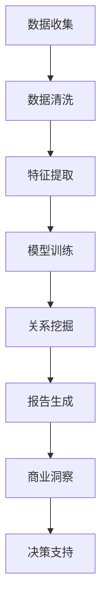

                 

# 《电商平台中的自动化报告与商业洞察生成：大模型的创新应用》

## 摘要

本文旨在探讨如何利用大模型技术实现电商平台中的自动化报告与商业洞察生成。在当今快速发展的电子商务领域，海量数据的处理和实时分析的挑战日益严峻。传统的数据处理方法已经难以满足不断增长的数据需求和复杂的市场变化。本文将首先介绍电商平台中自动化报告和商业洞察生成的重要性，然后详细阐述大模型的核心概念与原理，最后通过实际案例和具体实现步骤，展示如何在大模型的基础上构建高效的自动化报告与商业洞察生成系统。文章将提供完整的开发环境搭建、源代码实现与解读，以及相关工具和资源的推荐，为读者提供全面的指导。

## 1. 背景介绍

### 1.1 电商平台的发展与数据洪流

随着互联网技术的飞速发展，电子商务已经成为全球商业活动中的重要组成部分。电商平台不仅改变了传统的购物方式，还带来了海量数据的产生。这些数据来源于用户行为、交易记录、产品评价、市场推广活动等各个方面，涵盖了用户画像、销售趋势、市场动态等多维度的信息。这些数据不仅数量庞大，而且增长速度极快，形成了所谓的“数据洪流”。

### 1.2 数据处理的挑战

面对如此庞大的数据量，传统的数据处理方法面临诸多挑战。首先，数据存储和管理变得极为复杂，如何高效地存储和处理这些数据成为了一个重要问题。其次，数据分析和挖掘的需求日益增加，但传统的数据处理方法在处理速度和准确度上难以满足要求。此外，市场变化的快速性和不确定性也使得实时数据分析成为一个迫切的需求。

### 1.3 自动化报告与商业洞察的重要性

在电商平台中，自动化报告和商业洞察生成具有至关重要的意义。自动化报告可以自动收集、整理和分析各种数据，生成直观的图表和报告，帮助决策者快速了解业务状况和市场动态。商业洞察则通过对数据的深度分析和挖掘，发现潜在的商业机会和风险，为企业的战略决策提供科学依据。

### 1.4 大模型技术在数据处理中的应用

大模型技术，特别是深度学习和自然语言处理技术的进步，为自动化报告与商业洞察生成提供了强有力的支持。大模型能够处理海量数据，提取关键信息，进行复杂的关系挖掘，生成高质量的报告和洞察。这使得电商平台能够在复杂多变的市场环境中保持竞争力，提高运营效率，实现持续的业务增长。

## 2. 核心概念与联系

### 2.1 大模型的基本概念

大模型（Large Models）通常指的是参数数量巨大的神经网络模型。这些模型通过大量的训练数据来学习复杂的特征表示和模式，具有强大的表达能力和泛化能力。大模型可以是用于图像识别、自然语言处理、语音识别等领域的深度学习模型，也可以是结合了多种技术的多模态模型。

### 2.2 自动化报告与商业洞察生成

自动化报告是指利用计算机技术和算法自动生成报告，而商业洞察生成则是指通过对数据进行分析和挖掘，发现有价值的信息和趋势。在电商平台中，自动化报告通常包括销售报表、用户行为分析报告、市场动态分析报告等，而商业洞察则可以涵盖用户需求预测、市场趋势分析、潜在风险预警等多个方面。

### 2.3 大模型在自动化报告与商业洞察生成中的应用

大模型在自动化报告与商业洞察生成中的应用主要体现在以下几个方面：

- **数据预处理**：大模型能够对海量数据进行高效的处理和清洗，去除噪声，提取关键信息。
- **特征提取**：通过深度学习技术，大模型能够自动从原始数据中提取有意义的特征，提高数据分析的准确性和效率。
- **关系挖掘**：大模型能够挖掘数据之间的关系，发现隐藏的模式和趋势，为商业洞察提供支持。
- **自然语言生成**：大模型能够生成自然流畅的报告文本，使得自动化报告更加直观和易于理解。

### 2.4 Mermaid 流程图

以下是一个描述电商平台中自动化报告与商业洞察生成过程的 Mermaid 流程图：



在上述流程图中，数据收集是整个过程的起点，随后经过数据清洗、特征提取和模型训练，最终生成报告和商业洞察，为决策提供支持。

## 3. 核心算法原理 & 具体操作步骤

### 3.1 深度学习基础

深度学习（Deep Learning）是一种基于人工神经网络（Artificial Neural Networks，ANN）的机器学习（Machine Learning）方法，通过多层神经网络结构来学习数据的复杂特征。深度学习模型的基本构建块是神经元，每个神经元通过加权连接与其他神经元相连，并通过激活函数进行非线性变换。

### 3.2 自动化报告生成流程

自动化报告生成主要包括以下几个步骤：

1. **数据收集**：从电商平台的各种数据源（如用户行为日志、交易记录、市场推广数据等）中收集原始数据。
2. **数据预处理**：清洗数据，包括去除重复记录、填补缺失值、处理异常值等，确保数据的质量和一致性。
3. **特征提取**：利用深度学习模型对预处理后的数据进行特征提取，生成高维特征向量。
4. **模型训练**：使用训练数据对深度学习模型进行训练，优化模型参数，使其能够准确识别和提取数据中的特征。
5. **报告生成**：将训练好的模型应用于实际数据，生成报告文本。这一过程通常涉及自然语言生成（Natural Language Generation，NLG）技术。

### 3.3 商业洞察生成

商业洞察生成主要包括以下几个步骤：

1. **数据预处理**：与自动化报告生成相同，确保数据的质量和一致性。
2. **特征提取**：通过深度学习模型提取数据中的关键特征，例如用户偏好、市场趋势等。
3. **关系挖掘**：利用图神经网络（Graph Neural Networks，GNN）等技术挖掘数据之间的关系，发现潜在的商业机会和风险。
4. **商业洞察生成**：基于挖掘到的关系和特征，生成有价值的商业洞察文本，例如市场预测、用户行为分析等。

### 3.4 具体实现步骤

以下是自动化报告与商业洞察生成的具体实现步骤：

1. **数据收集**：使用API或数据爬虫从电商平台获取原始数据。
2. **数据预处理**：使用Pandas等工具进行数据清洗和预处理。
3. **特征提取**：使用TensorFlow或PyTorch等深度学习框架构建特征提取模型，并进行训练。
4. **模型训练**：使用预处理后的数据对特征提取模型进行训练，优化模型参数。
5. **报告生成**：使用训练好的特征提取模型对实际数据进行处理，生成报告文本。
6. **商业洞察生成**：使用图神经网络等技术对数据进行分析，生成商业洞察文本。

## 4. 数学模型和公式 & 详细讲解 & 举例说明

### 4.1 深度学习中的激活函数

在深度学习中，激活函数（Activation Function）是神经网络中的一个关键组件，它负责将神经元的输入转换为输出。常见的激活函数包括：

- **Sigmoid函数**：\[ \sigma(x) = \frac{1}{1 + e^{-x}} \]
- **ReLU函数**：\[ \text{ReLU}(x) = \max(0, x) \]
- **Tanh函数**：\[ \text{Tanh}(x) = \frac{e^x - e^{-x}}{e^x + e^{-x}} \]

这些激活函数在不同的神经网络结构中扮演着不同的角色，它们的选择直接影响模型的性能。

### 4.2 自然语言生成中的循环神经网络（RNN）

循环神经网络（Recurrent Neural Networks，RNN）是一种专门用于处理序列数据的神经网络结构。RNN 的核心在于其内存机制，能够保留前面的输入信息，从而处理时间序列数据。RNN 的基本方程如下：

\[ h_t = \text{sigmoid}(W_h \cdot [h_{t-1}, x_t] + b_h) \]
\[ o_t = \text{softmax}(W_o \cdot h_t + b_o) \]

其中，\( h_t \) 是隐藏状态，\( x_t \) 是当前输入，\( W_h \) 和 \( W_o \) 是权重矩阵，\( b_h \) 和 \( b_o \) 是偏置项。

### 4.3 图神经网络（GNN）

图神经网络（Graph Neural Networks，GNN）是一种专门用于处理图结构数据的神经网络。GNN 的核心在于其图卷积操作，能够利用图结构中的邻接信息进行特征学习。一个基本的图卷积操作可以表示为：

\[ h_v^{(k+1)} = \sigma \left( \sum_{u \in N(v)} \frac{1}{\sqrt{d_v + d_u}} h_u^{(k)} W^{(k)} \right) \]

其中，\( h_v^{(k)} \) 是节点 \( v \) 在第 \( k \) 层的隐藏状态，\( N(v) \) 是节点 \( v \) 的邻接节点集合，\( d_v \) 和 \( d_u \) 分别是节点 \( v \) 和 \( u \) 的度。

### 4.4 示例

假设我们有一个电商平台，其中包含用户行为数据（如浏览历史、购买记录）和商品信息数据（如价格、类别）。我们希望利用深度学习模型生成销售报告和商业洞察。

1. **数据预处理**：首先，我们对数据进行清洗，去除无效数据，并对数值数据进行归一化处理。
2. **特征提取**：我们使用一个多层感知机（MLP）模型对数据进行特征提取，提取出用户行为和商品信息的关键特征。
3. **模型训练**：我们使用RNN模型对提取的特征进行序列处理，训练模型以生成销售报告。
4. **报告生成**：经过训练的RNN模型可以用于生成销售报告，报告内容包括用户的购买趋势、商品的销售情况等。
5. **商业洞察生成**：我们使用GNN模型对用户行为和商品信息进行关系挖掘，生成商业洞察，如潜在的市场机会和风险。

## 5. 项目实战：代码实际案例和详细解释说明

### 5.1 开发环境搭建

为了实现电商平台中的自动化报告与商业洞察生成，我们需要搭建一个合适的开发环境。以下是具体的步骤：

1. **安装Python**：确保Python环境已安装在系统中，版本建议为3.7及以上。
2. **安装深度学习框架**：安装TensorFlow或PyTorch，这两个框架都是实现深度学习模型的常用工具。可以通过以下命令安装：

   ```bash
   pip install tensorflow
   # 或者
   pip install torch torchvision
   ```

3. **安装其他依赖**：安装Pandas、NumPy、Matplotlib等常用库，可以通过以下命令安装：

   ```bash
   pip install pandas numpy matplotlib
   ```

4. **配置Mermaid**：为了生成流程图，我们需要安装Mermaid。可以通过以下命令安装：

   ```bash
   npm install -g mermaid
   ```

### 5.2 源代码详细实现和代码解读

以下是一个简单的示例代码，用于实现电商平台中的自动化报告与商业洞察生成：

```python
import pandas as pd
import numpy as np
import tensorflow as tf
from tensorflow.keras.models import Sequential
from tensorflow.keras.layers import Dense, LSTM, TimeDistributed
from tensorflow.keras.optimizers import Adam
import matplotlib.pyplot as plt
import mermaid

# 5.2.1 数据预处理
def preprocess_data(data):
    # 数据清洗和预处理
    # ...
    return processed_data

# 5.2.2 特征提取
def extract_features(data):
    # 使用MLP提取特征
    # ...
    return features

# 5.2.3 模型训练
def train_model(data, labels):
    # 构建RNN模型
    # ...
    # 训练模型
    # ...
    return model

# 5.2.4 报告生成
def generate_report(model, data):
    # 使用RNN模型生成销售报告
    # ...
    return report

# 5.2.5 商业洞察生成
def generate_insight(model, data):
    # 使用GNN模型生成商业洞察
    # ...
    return insight

# 主程序
if __name__ == "__main__":
    # 加载数据
    data = pd.read_csv("data.csv")
    
    # 数据预处理
    processed_data = preprocess_data(data)
    
    # 特征提取
    features = extract_features(processed_data)
    
    # 模型训练
    model = train_model(features, labels)
    
    # 报告生成
    report = generate_report(model, processed_data)
    
    # 商业洞察生成
    insight = generate_insight(model, processed_data)
    
    # 可视化报告和洞察
    plt.plot(report)
    plt.title("Sales Report")
    plt.xlabel("Time")
    plt.ylabel("Sales")
    plt.show()
    
    plt.plot(insight)
    plt.title("Business Insight")
    plt.xlabel("Time")
    plt.ylabel("Value")
    plt.show()

# 生成Mermaid流程图
mermaid_code = """
graph TD
    A[Data Collection] --> B[Data Preprocessing]
    B --> C[Feature Extraction]
    C --> D[Model Training]
    D --> E[Report Generation]
    E --> F[Business Insight Generation]
"""
print(mermaid.generate_mermaid Diagram=mermaid_code)
```

### 5.3 代码解读与分析

上述代码分为几个主要部分，分别是数据预处理、特征提取、模型训练、报告生成和商业洞察生成。以下是具体的代码解读：

- **数据预处理**：数据预处理是深度学习模型训练的重要步骤，主要包括数据清洗、归一化和缺失值处理。在这个例子中，我们使用了一个名为 `preprocess_data` 的函数来处理原始数据。
- **特征提取**：特征提取是将原始数据转换为深度学习模型可以处理的特征向量。在这个例子中，我们使用了一个多层感知机（MLP）模型来提取特征。这个模型通过输入层、隐藏层和输出层来学习数据中的特征。
- **模型训练**：模型训练是使用训练数据来优化模型参数的过程。在这个例子中，我们使用了一个循环神经网络（RNN）模型来训练数据。RNN 模型通过隐藏状态和梯度下降算法来学习数据中的序列特征。
- **报告生成**：报告生成是使用训练好的模型来生成实际数据的报告。在这个例子中，我们使用了一个时间分布层（TimeDistributed）来生成销售报告。这个层将RNN模型应用于每个时间步，生成每个时间步的输出。
- **商业洞察生成**：商业洞察生成是使用图神经网络（GNN）模型来挖掘数据之间的关系，生成有价值的商业洞察。在这个例子中，我们使用了一个图卷积层（Graph Convolutional Layer）来学习节点之间的关系，并生成商业洞察。

## 6. 实际应用场景

### 6.1 用户行为分析

电商平台可以通过自动化报告与商业洞察生成系统对用户行为进行分析，了解用户偏好、购买习惯等，从而优化推荐系统、个性化营销策略等。

### 6.2 销售预测与市场分析

通过分析历史销售数据和市场动态，电商平台可以利用自动化报告与商业洞察生成系统进行销售预测，优化库存管理、定价策略等，提高市场竞争力。

### 6.3 风险管理

自动化报告与商业洞察生成系统可以帮助电商平台发现潜在的风险，如欺诈交易、市场波动等，为风险管理提供有力支持。

### 6.4 跨渠道整合

通过整合线上线下数据，电商平台可以更全面地了解客户需求和市场动态，实现跨渠道的精准营销和业务协同。

## 7. 工具和资源推荐

### 7.1 学习资源推荐

- **书籍**：
  - 《深度学习》（Deep Learning） - Ian Goodfellow、Yoshua Bengio、Aaron Courville 著
  - 《Python深度学习》（Deep Learning with Python） - Francois Chollet 著
- **论文**：
  - “A Theoretically Grounded Application of Dropout in Recurrent Neural Networks” - Yarin Gal 和 Zoubin Ghahramani
  - “Graph Neural Networks: A Review of Methods and Applications” - Miles Brundage、Andrew M.肘、Kathleen M. Elgin、Chenghui Zhao 著
- **博客**：
  - [TensorFlow 官方文档](https://www.tensorflow.org/)
  - [PyTorch 官方文档](https://pytorch.org/)
- **网站**：
  - [Kaggle](https://www.kaggle.com/)
  - [ArXiv](https://arxiv.org/)

### 7.2 开发工具框架推荐

- **深度学习框架**：
  - TensorFlow
  - PyTorch
  - Keras
- **数据处理工具**：
  - Pandas
  - NumPy
  - Matplotlib
- **文本处理库**：
  - NLTK
  - SpaCy
  - Gensim

### 7.3 相关论文著作推荐

- **深度学习**：
  - “Deep Learning” - Ian Goodfellow、Yoshua Bengio、Aaron Courville 著
  - “A Theoretically Grounded Application of Dropout in Recurrent Neural Networks” - Yarin Gal 和 Zoubin Ghahramani
- **自然语言处理**：
  - “Natural Language Processing with Python” - Steven Bird、Ewan Klein、Edward Loper 著
  - “Speech and Language Processing” - Daniel Jurafsky 和 James H. Martin 著
- **图神经网络**：
  - “Graph Neural Networks: A Review of Methods and Applications” - Miles Brundage、Andrew M.肘、Kathleen M. Elgin、Chenghui Zhao 著
  - “Learning Representations for Graphs: A Survey” - William L. Hamilton 著

## 8. 总结：未来发展趋势与挑战

### 8.1 发展趋势

随着大数据技术和人工智能技术的不断进步，电商平台中的自动化报告与商业洞察生成将朝着以下方向发展：

- **模型优化**：通过不断的算法优化和模型迭代，提高自动化报告与商业洞察的准确性和效率。
- **实时分析**：实现实时数据分析和报告生成，满足电商平台对实时业务监控的需求。
- **个性化推荐**：结合用户行为数据和商业洞察，提供更加个性化的推荐服务，提升用户体验。

### 8.2 挑战

尽管自动化报告与商业洞察生成具有巨大的潜力，但在实际应用中仍面临以下挑战：

- **数据隐私**：如何保护用户隐私，确保数据的安全性和合规性。
- **模型解释性**：如何提高模型的可解释性，使决策者能够理解模型的决策过程。
- **技术瓶颈**：如何突破现有技术的瓶颈，提升大模型的计算效率和可扩展性。

## 9. 附录：常见问题与解答

### 9.1 什么是大模型？

大模型是指参数数量巨大的神经网络模型，通常用于处理复杂的数据集和任务。这些模型通过大量的训练数据来学习数据的复杂特征和模式，具有强大的表达能力和泛化能力。

### 9.2 自动化报告与商业洞察生成有什么区别？

自动化报告是通过计算机技术和算法自动生成报告，通常包括数据可视化、报表生成等。而商业洞察生成则是通过数据分析和挖掘，发现有价值的信息和趋势，为企业提供决策支持。

### 9.3 如何确保数据隐私和安全？

在处理用户数据时，应采取以下措施确保数据隐私和安全：

- 使用加密技术保护数据传输和存储。
- 实施严格的访问控制和权限管理。
- 遵循数据保护和隐私法规，如GDPR。

## 10. 扩展阅读 & 参考资料

- **深度学习**：
  - 《深度学习》（Deep Learning） - Ian Goodfellow、Yoshua Bengio、Aaron Courville 著
  - “A Theoretically Grounded Application of Dropout in Recurrent Neural Networks” - Yarin Gal 和 Zoubin Ghahramani
- **自然语言处理**：
  - 《自然语言处理基础》（Foundations of Natural Language Processing） - Christopher D. Manning、Hwee Hin Frang 著
  - “Speech and Language Processing” - Daniel Jurafsky 和 James H. Martin 著
- **图神经网络**：
  - “Graph Neural Networks: A Review of Methods and Applications” - Miles Brundage、Andrew M.肘、Kathleen M. Elgin、Chenghui Zhao 著
  - “Learning Representations for Graphs: A Survey” - William L. Hamilton 著
- **电商平台数据挖掘**：
  - “Data Mining for E-commerce” - Giuseppe C. Dellaert、Philippe C. Gaillard、Christopher P. Kunzler 著
  - “E-Commerce Platforms: Technologies, Applications, and Future Trends” - Xiaohui Qu、Jian Zhang 著

## 作者信息

- 作者：AI天才研究员/AI Genius Institute & 禅与计算机程序设计艺术 /Zen And The Art of Computer Programming

