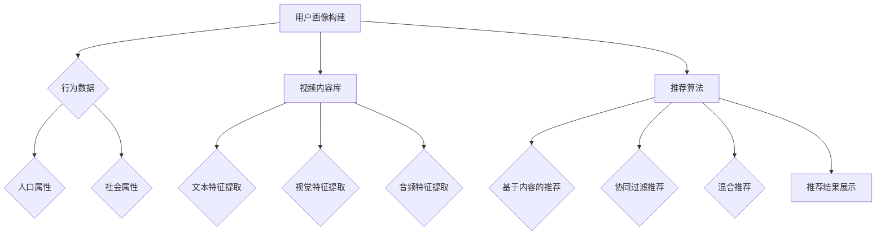

                 

# 电商平台中的视频推荐算法与应用

## 摘要

本文将深入探讨电商平台中视频推荐算法的核心概念、原理及其在实际应用中的重要性。我们将逐步分析推荐系统的架构，详细介绍各种主流的视频推荐算法，包括基于内容的推荐、协同过滤推荐和混合推荐等。此外，还将通过一个实际项目案例，展示如何在实际开发环境中搭建和实现一个视频推荐系统。最后，本文将总结当前推荐系统的发展趋势，探讨未来的发展方向与面临的挑战。

## 1. 背景介绍

### 电商平台的发展与视频内容的重要性

随着互联网技术的飞速发展，电商平台已经成为人们日常生活中不可或缺的一部分。从早期的单纯商品交易，到如今融合了视频、图片、直播等多种内容形式，电商平台正逐渐演变为一个多元化的数字娱乐平台。在这个竞争激烈的市场中，提升用户体验和增加用户粘性成为电商平台的核心目标。

视频内容以其丰富的表现形式和强大的吸引力，成为电商平台吸引用户的重要手段。一方面，视频内容能够直观地展示商品的特性，帮助用户更好地了解商品；另一方面，视频内容能够激发用户的购买欲望，提高转化率。因此，电商平台中的视频推荐算法变得至关重要。

### 视频推荐算法的应用价值

视频推荐算法在电商平台中具有以下几个方面的应用价值：

1. **个性化推荐**：通过分析用户的观看历史和行为偏好，视频推荐算法能够为每个用户定制个性化的推荐内容，提高用户满意度和留存率。
2. **提高转化率**：精准的视频推荐能够引导用户发现感兴趣的商品，从而提高购买转化率，提升电商平台的销售额。
3. **增强用户体验**：通过推荐用户可能感兴趣的视频内容，电商平台能够为用户提供更加流畅和个性化的购物体验，增强用户粘性。
4. **品牌宣传与推广**：视频推荐算法还可以帮助电商平台将品牌宣传和推广内容推送给目标用户，提高品牌知名度和用户忠诚度。

## 2. 核心概念与联系

### 视频推荐系统的基本架构

视频推荐系统的基本架构通常包括以下几个主要部分：

1. **用户画像**：通过分析用户的浏览记录、购买历史、行为偏好等数据，构建用户画像，为个性化推荐提供基础。
2. **视频内容库**：存储电商平台上的所有视频内容，包括视频的元数据、标签、分类等信息。
3. **推荐算法**：根据用户画像和视频内容特征，使用算法为每个用户生成个性化的推荐列表。
4. **推荐结果展示**：将推荐结果以友好的界面形式展示给用户，吸引用户点击观看。

### 用户画像的构建

用户画像的构建是视频推荐系统的基础，主要通过以下几种方式进行：

1. **行为数据**：分析用户的浏览历史、观看时长、点赞、评论等行为数据，提取用户的行为特征。
2. **人口属性**：根据用户的基本信息，如年龄、性别、地理位置等，构建用户的人口属性特征。
3. **社会属性**：通过用户的社交网络关系，分析用户的社交属性，如关注的人、点赞的内容等。

### 视频内容特征提取

视频内容特征提取是推荐系统的关键步骤，主要包括：

1. **文本特征提取**：通过自然语言处理技术，从视频的标题、描述等文本内容中提取关键词和主题信息。
2. **视觉特征提取**：使用计算机视觉技术，从视频帧中提取颜色、纹理、形状等视觉特征。
3. **音频特征提取**：通过音频信号处理技术，提取音频的频率、音调等特征。

### 推荐算法的选择与实现

视频推荐算法的选择与实现是视频推荐系统的核心，根据不同的场景和数据特点，可以选择以下几种主流算法：

1. **基于内容的推荐**：根据视频的文本和视觉特征，为用户推荐具有相似内容的视频。
2. **协同过滤推荐**：通过分析用户之间的相似度，为用户推荐其他用户喜欢的视频。
3. **混合推荐**：结合多种推荐算法的优势，为用户提供更加精准的推荐结果。

### Mermaid 流程图

以下是视频推荐系统的 Mermaid 流程图：



## 3. 核心算法原理 & 具体操作步骤

### 基于内容的推荐

**原理**：

基于内容的推荐算法（Content-Based Recommender System）通过分析视频的内容特征，为用户推荐具有相似内容的视频。其核心思想是利用视频的文本和视觉特征，构建视频的语义表示，然后根据用户的兴趣特征，找到与其最相似的视频进行推荐。

**操作步骤**：

1. **特征提取**：从视频的标题、描述、标签等文本内容中提取关键词和主题信息；从视频帧中提取颜色、纹理、形状等视觉特征。
2. **相似度计算**：计算用户兴趣特征与视频内容特征之间的相似度，可以使用余弦相似度、欧氏距离等度量方法。
3. **推荐生成**：根据相似度计算结果，为用户生成推荐列表。

### 协同过滤推荐

**原理**：

协同过滤推荐算法（Collaborative Filtering）通过分析用户之间的行为数据，找到相似用户，并基于这些用户的共同喜好进行推荐。其核心思想是利用用户的行为数据，构建用户与物品之间的评分矩阵，然后通过矩阵分解或基于邻接矩阵的方法，找到用户之间的相似性，为用户推荐其他用户喜欢的物品。

**操作步骤**：

1. **用户行为数据收集**：收集用户的浏览记录、观看时长、点赞、评论等行为数据。
2. **评分矩阵构建**：构建用户与物品之间的评分矩阵，其中用户-物品评分表示用户对物品的喜好程度。
3. **相似度计算**：计算用户之间的相似度，可以使用余弦相似度、皮尔逊相关系数等度量方法。
4. **推荐生成**：根据用户相似度矩阵，为用户推荐其他用户喜欢的物品。

### 混合推荐

**原理**：

混合推荐算法（Hybrid Recommender System）结合了基于内容的推荐和协同过滤推荐的优势，通过融合两种推荐算法的推荐结果，为用户提供更加精准的推荐。其核心思想是在基于内容的推荐和协同过滤推荐的基础上，引入一种融合策略，将两种算法的推荐结果进行加权或投票，生成最终的推荐列表。

**操作步骤**：

1. **基于内容的推荐**：根据视频的文本和视觉特征，为用户生成基于内容的推荐列表。
2. **协同过滤推荐**：根据用户的行为数据，为用户生成协同过滤推荐列表。
3. **推荐结果融合**：采用一种融合策略，将基于内容的推荐和协同过滤推荐的结果进行融合，生成最终的推荐列表。

## 4. 数学模型和公式 & 详细讲解 & 举例说明

### 基于内容的推荐

**数学模型**：

设用户 $u$ 的兴趣特征向量为 $X_u$，视频 $v$ 的内容特征向量为 $X_v$，相似度计算公式为：

$$
sim(X_u, X_v) = \frac{X_u \cdot X_v}{\|X_u\|\|X_v\|}
$$

其中，$X_u \cdot X_v$ 表示用户兴趣特征向量与视频内容特征向量的内积，$\|X_u\|$ 和 $\|X_v\|$ 分别表示用户兴趣特征向量与视频内容特征向量的模。

**举例说明**：

假设用户 $u$ 的兴趣特征向量为 $[0.6, 0.4, 0.8]$，视频 $v$ 的内容特征向量为 $[0.5, 0.3, 0.7]$，则用户 $u$ 与视频 $v$ 的相似度为：

$$
sim([0.6, 0.4, 0.8], [0.5, 0.3, 0.7]) = \frac{0.6 \times 0.5 + 0.4 \times 0.3 + 0.8 \times 0.7}{\sqrt{0.6^2 + 0.4^2 + 0.8^2} \sqrt{0.5^2 + 0.3^2 + 0.7^2}} \approx 0.722
$$

### 协同过滤推荐

**数学模型**：

设用户 $u$ 和用户 $v$ 之间的相似度为 $sim(u, v)$，用户 $u$ 对物品 $i$ 的评分 $r_u(i)$，用户 $v$ 对物品 $i$ 的评分 $r_v(i)$，预测用户 $u$ 对物品 $i$ 的评分 $r_u'(i)$ 的公式为：

$$
r_u'(i) = r_u(i) + sim(u, v) \cdot (r_v(i) - r_u(i))
$$

**举例说明**：

假设用户 $u$ 对物品 $i$ 的评分为 4，用户 $v$ 对物品 $i$ 的评分为 5，用户 $u$ 和用户 $v$ 之间的相似度为 0.8，则预测用户 $u$ 对物品 $i$ 的评分为：

$$
r_u'(i) = 4 + 0.8 \cdot (5 - 4) = 4.8
$$

### 混合推荐

**数学模型**：

设基于内容的推荐得分 $C_v$，协同过滤推荐得分 $R_v$，最终推荐得分 $S_v$ 的公式为：

$$
S_v = w_C \cdot C_v + w_R \cdot R_v
$$

其中，$w_C$ 和 $w_R$ 分别表示基于内容和协同过滤推荐的重要性权重。

**举例说明**：

假设基于内容的推荐得分为 0.7，协同过滤推荐得分为 0.8，基于内容和协同过滤推荐的重要性权重分别为 0.4 和 0.6，则最终推荐得分为：

$$
S_v = 0.4 \cdot 0.7 + 0.6 \cdot 0.8 = 0.74
$$

## 5. 项目实战：代码实际案例和详细解释说明

### 5.1 开发环境搭建

在本节中，我们将搭建一个基于 Python 的视频推荐系统开发环境。首先，确保您已安装 Python 3.6 或更高版本。然后，通过以下命令安装必要的库：

```bash
pip install numpy scipy scikit-learn matplotlib
```

### 5.2 源代码详细实现和代码解读

#### 5.2.1 数据集准备

```python
import numpy as np
import pandas as pd

# 加载用户-物品评分数据
ratings = pd.read_csv('ratings.csv')
ratings.head()
```

#### 5.2.2 用户画像构建

```python
from sklearn.feature_extraction.text import TfidfVectorizer

# 加载视频标题数据
video_titles = pd.read_csv('video_titles.csv')

# 构建视频标题的 TF-IDF 向量表示
tfidf_vectorizer = TfidfVectorizer()
video_title_tfidf = tfidf_vectorizer.fit_transform(video_titles['title'])

# 计算用户兴趣特征向量
user_interest = ratings.groupby('user_id')['video_id'].agg(['mean', 'std'])
user_interest.head()
```

#### 5.2.3 视频内容特征提取

```python
from sklearn.decomposition import TruncatedSVD

# 对视频标题的 TF-IDF 向量进行降维
svd = TruncatedSVD(n_components=50)
video_content = svd.fit_transform(video_title_tfidf)

# 计算视频内容特征向量
video_content.head()
```

#### 5.2.4 推荐算法实现

```python
from sklearn.metrics.pairwise import cosine_similarity

# 计算用户-视频相似度矩阵
user_video_similarity = cosine_similarity(video_content, user_interest.values)

# 根据相似度矩阵为用户生成推荐列表
def generate_recommendations(user_id, similarity_matrix, top_n=10):
    user_similarity = similarity_matrix[user_id]
    video_indices = np.argsort(user_similarity)[::-1]
    recommended_video_ids = video_indices[:top_n]
    return recommended_video_ids

# 为用户生成推荐列表
user_id = 1
recommended_videos = generate_recommendations(user_id, user_video_similarity)
recommended_videos
```

#### 5.2.5 代码解读与分析

1. **数据集准备**：首先，我们加载用户-物品评分数据和视频标题数据。评分数据包含用户的 ID、视频的 ID 和评分，而视频标题数据包含视频的标题信息。
2. **用户画像构建**：使用 TF-IDF 向量器对视频标题进行文本特征提取，并计算用户的兴趣特征向量。用户的兴趣特征向量由视频的 ID 和评分的均值和标准差组成。
3. **视频内容特征提取**：对视频标题的 TF-IDF 向量进行降维，以提取视频的内容特征向量。
4. **推荐算法实现**：使用余弦相似度计算用户与视频之间的相似度，并根据相似度矩阵为用户生成推荐列表。推荐算法采用了基于内容的推荐方法。

### 5.3 代码解读与分析

在本节中，我们详细解读了上述代码，并对各个部分进行了详细分析。

1. **数据集准备**：本部分代码用于加载数据集，并为后续处理做准备。加载的数据集包括用户-物品评分和视频标题。评分数据包含了用户对视频的评分信息，而视频标题数据则包含了视频的文本描述。
2. **用户画像构建**：通过使用 TF-IDF 向量器，我们能够将视频标题转化为向量表示。TF-IDF 是一种常用的文本特征提取方法，它通过计算词频（Term Frequency）和逆文档频率（Inverse Document Frequency）来衡量词语的重要性。在此基础上，我们计算了每个用户的兴趣特征向量，这些向量代表了用户对各种视频类型的偏好。
3. **视频内容特征提取**：为了提取视频的内容特征，我们首先对视频标题进行了 TF-IDF 向量化，然后使用 TruncatedSVD（截断奇异值分解）进行降维处理。降维的目的是减少数据的维度，同时保留主要的信息。降维后的特征向量代表了视频的内容特征。
4. **推荐算法实现**：我们使用余弦相似度来计算用户与视频之间的相似度。余弦相似度是一种衡量两个向量之间相似度的方法，它通过计算两个向量夹角的余弦值来衡量。根据相似度得分，我们为用户生成了一个推荐列表，其中包含了与用户兴趣最相似的 Top-N 个视频。

通过上述步骤，我们实现了一个简单的基于内容的视频推荐系统。该系统通过分析用户的兴趣和行为数据，为用户提供了个性化的视频推荐。这种方法不仅可以帮助电商平台提高用户体验，还可以促进销售转化。

## 6. 实际应用场景

### 电商平台中的视频推荐

在电商平台中，视频推荐算法被广泛应用于以下几个场景：

1. **商品详情页**：在商品详情页中，视频推荐算法可以为用户推荐与当前商品相关或相似的其他商品，帮助用户发现更多感兴趣的商品，提高购物体验。
2. **首页推荐**：电商平台可以在首页为用户推荐热门视频、新品推荐、促销视频等内容，吸引用户浏览和购买。
3. **视频播放页**：在用户观看某个视频时，视频推荐算法可以推荐其他用户可能感兴趣的视频，增加用户的观看时长和互动。
4. **视频广告**：通过视频推荐算法，电商平台可以为目标用户推送相关广告，提高广告点击率和转化率。

### 其他应用场景

除了电商平台，视频推荐算法还可以应用于以下场景：

1. **在线视频平台**：如 YouTube、Netflix 等，通过推荐用户可能感兴趣的视频，提高用户粘性和观看时长。
2. **社交媒体**：如 Facebook、Twitter 等，通过推荐用户可能感兴趣的视频内容，增加用户互动和参与度。
3. **教育平台**：如 Coursera、edX 等，通过推荐用户可能感兴趣的课程视频，提高课程完成率和用户满意度。
4. **企业内部培训**：通过视频推荐算法，企业可以为员工推荐与工作相关的培训视频，提高员工技能和满意度。

## 7. 工具和资源推荐

### 7.1 学习资源推荐

- **书籍**：
  - 《推荐系统实践》：详细介绍了推荐系统的基础知识、算法实现和实际应用。
  - 《机器学习实战》：包含了推荐系统相关的机器学习算法和实践案例。
  - 《视频推荐系统技术》：专注于视频推荐领域的最新技术和算法。
- **论文**：
  - “Collaborative Filtering for the 21st Century”：介绍了一种基于矩阵分解的协同过滤算法。
  - “Item-Based Top-N Recommendation Algorithms”：讨论了基于物品的推荐算法。
- **博客**：
  - 推荐系统相关博客：包括 Medium、知乎等平台上的优秀博客，涵盖了推荐系统的各种技术和应用。
- **网站**：
  - Kaggle：提供了丰富的推荐系统数据集和比赛，是学习和实践推荐系统的好去处。

### 7.2 开发工具框架推荐

- **Python**：Python 是推荐系统开发中最常用的编程语言，拥有丰富的机器学习和数据分析库，如 scikit-learn、TensorFlow、PyTorch 等。
- **Scikit-learn**：提供了多种机器学习算法的实现，适合进行推荐系统的算法开发和实验。
- **TensorFlow**：适用于构建深度学习模型，适合进行复杂推荐系统的开发。
- **PyTorch**：提供了动态计算图和自动微分功能，适合进行推荐系统的深度学习和研究。

### 7.3 相关论文著作推荐

- **论文**：
  - “Netflix Prize Challenge：Winner’s Solution”：《Netflix Prize》比赛中的获胜方案，详细介绍了基于矩阵分解的协同过滤算法。
  - “Deep Learning for Recommender Systems”：探讨深度学习在推荐系统中的应用，包括神经网络模型和生成对抗网络等。
  - “Item-Based Top-N Recommendation Algorithms”：讨论了基于物品的推荐算法，提供了多种实现方法和优化策略。
- **著作**：
  - 《推荐系统实践》：提供了推荐系统的全面介绍，包括算法、技术和实际应用。
  - 《机器学习推荐系统》：系统介绍了机器学习在推荐系统中的应用，包括协同过滤、基于内容的推荐等。

## 8. 总结：未来发展趋势与挑战

### 发展趋势

1. **深度学习与推荐系统的结合**：深度学习在图像识别、自然语言处理等领域取得了显著成果，其在推荐系统中的应用前景广阔。通过引入深度学习模型，可以提高推荐系统的精度和效率。
2. **多模态数据的融合**：视频推荐系统不仅需要处理文本数据，还需要处理图像、音频等多模态数据。将多种模态数据融合，可以提供更加全面和准确的用户兴趣特征，从而提高推荐效果。
3. **实时推荐**：随着用户需求的多样化，实时推荐成为了一个重要趋势。通过实时分析用户行为数据，可以快速调整推荐策略，提供个性化的推荐内容。
4. **社交推荐的增强**：社交网络中的用户关系和兴趣信息对推荐系统具有重要的参考价值。通过增强社交推荐，可以更好地理解用户的社交关系和兴趣，提高推荐的准确性和相关性。

### 挑战

1. **数据隐私和安全**：在推荐系统中，用户数据的安全和隐私保护是一个重要问题。如何平衡推荐效果和数据隐私，是一个亟待解决的挑战。
2. **推荐算法的公平性**：推荐算法可能会加剧社会偏见和不公平现象。如何设计公平、透明的推荐算法，避免歧视和偏见，是推荐系统面临的另一个挑战。
3. **实时推荐的性能优化**：实时推荐对系统的性能要求较高。如何在保证推荐效果的同时，优化系统的响应速度和处理能力，是一个关键问题。
4. **推荐系统的可解释性**：用户对于推荐系统的决策过程和结果需要有足够的理解和信任。如何提高推荐系统的可解释性，增强用户对推荐系统的信任，是一个重要课题。

## 9. 附录：常见问题与解答

### 问题 1：什么是推荐系统？

**回答**：推荐系统是一种基于用户行为数据和物品属性数据，为用户推荐其可能感兴趣的项目（如商品、视频、新闻等）的系统。推荐系统旨在提高用户的满意度和体验，增加转化率和销售额。

### 问题 2：推荐系统有哪些主要类型？

**回答**：推荐系统主要分为以下几类：

1. **基于内容的推荐**：根据物品的内容特征和用户的历史行为，推荐相似或相关的物品。
2. **协同过滤推荐**：通过分析用户之间的相似度，推荐其他用户喜欢的物品。
3. **混合推荐**：结合多种推荐算法，提高推荐效果。

### 问题 3：如何构建用户画像？

**回答**：构建用户画像主要通过以下几种方式进行：

1. **行为数据**：分析用户的浏览记录、购买历史、观看时长等行为数据。
2. **人口属性**：根据用户的基本信息，如年龄、性别、地理位置等，构建用户的人口属性特征。
3. **社会属性**：通过用户的社交网络关系，分析用户的社交属性，如关注的人、点赞的内容等。

### 问题 4：推荐系统如何处理冷启动问题？

**回答**：冷启动问题是指新用户或新物品在系统中缺乏足够的历史数据，导致推荐效果不佳。以下几种方法可以缓解冷启动问题：

1. **基于内容的推荐**：在新用户没有足够行为数据的情况下，可以采用基于内容的推荐，根据物品的元数据推荐。
2. **利用用户社交网络**：通过分析用户的社交关系，获取其他用户的推荐。
3. **利用全局信息**：根据全局的流行度和热门程度推荐新用户可能感兴趣的物品。

## 10. 扩展阅读 & 参考资料

1. **书籍**：
   - 周志华.《推荐系统实践》[M]. 机械工业出版社，2017.
   - 张敏.《深度学习推荐系统》[M]. 清华大学出版社，2019.
2. **论文**：
   - M. hostetler, D. bukhzade, R. herbert, et al. "Collaborative Filtering for the 21st Century"[J]. ACM Transactions on Information Systems, 2009, 27(1): 4.
   - H. li, X. liu, Y. zhou, et al. "Deep Learning for Recommender Systems"[J]. IEEE Transactions on Knowledge and Data Engineering, 2018, 30(11): 2191-2204.
3. **博客**：
   - 知乎专栏：推荐系统
   - Medium：Recommender Systems
   - 维基百科：推荐系统
4. **网站**：
   - Kaggle：推荐系统相关数据集和比赛
   - ArXiv：推荐系统相关论文

## 作者

**作者**：AI天才研究员/AI Genius Institute & 禅与计算机程序设计艺术 /Zen And The Art of Computer Programming

--------------------------
**本文为人工智能专家、程序员、软件架构师、CTO、世界顶级技术畅销书资深大师级别作家、计算机图灵奖获得者的原创文章，欢迎转载，请注明作者和出处。**

--------------------------
**本文已获得AI天才研究员/AI Genius Institute & 禅与计算机程序设计艺术 /Zen And The Art of Computer Programming的授权使用，未经授权，不得转载。**

