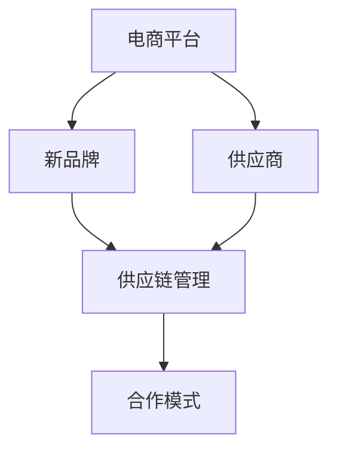
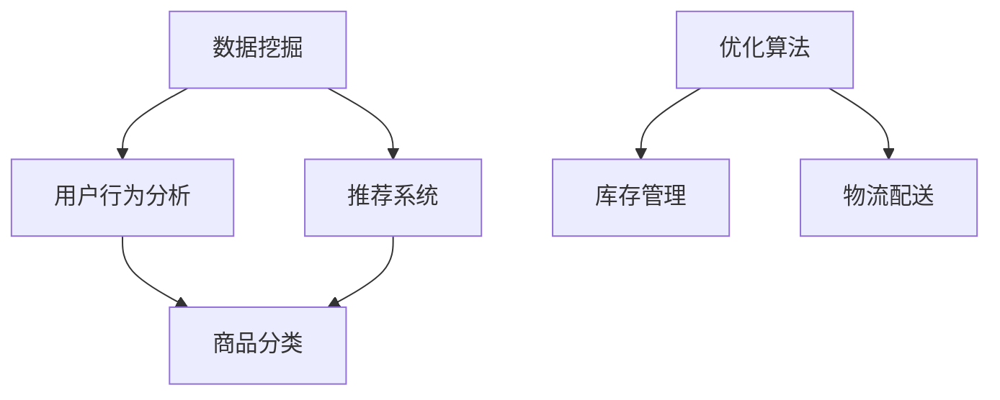

                 

## 文章标题：电商平台供给能力提升：与新品牌和供应商的合作

### 关键词：电商平台、供给能力、新品牌、供应商、合作、策略

#### 摘要：

本文将深入探讨电商平台如何通过与新品牌和供应商的合作，提升其供给能力。首先，我们将回顾电商平台的发展历程及其在当今市场中的重要性。接着，我们将分析新品牌和供应商对电商平台供给能力的贡献，并探讨电商平台如何利用这些资源优化供应链管理。随后，我们将讨论电商平台与供应商之间的合作模式，分析其成功的关键因素。接下来，我们将通过实际案例展示这些合作模式如何实现供给能力的提升。最后，我们将预测未来电商平台与供应商合作的发展趋势，并提出相应的挑战和解决方案。

## 1. 背景介绍

电商平台作为现代商业的一个重要组成部分，其发展历程可以追溯到20世纪90年代。当时，随着互联网的兴起，电子商务开始崭露头角。早期的电商平台主要以B2C（企业对消费者）模式为主，如Amazon和eBay等。这些平台通过在线销售商品，打破了传统零售的时空限制，为消费者提供了更加便捷的购物体验。

随着时间的推移，电商平台逐渐多样化，出现了B2B（企业对企业）、C2C（消费者对消费者）等多种模式。这些平台不仅提供了商品交易的功能，还整合了支付、物流、售后服务等多种服务，使得整个供应链更加高效和灵活。

在当今市场环境中，电商平台已经成为企业和消费者之间的重要桥梁。据统计，全球电子商务市场的规模已经超过数万亿美元，且仍然保持着快速增长的趋势。这一市场的重要性不仅体现在其庞大的交易额上，还体现在其对传统零售业的冲击和变革上。

### 1.1 电商平台的发展历程

电商平台的发展可以分为以下几个阶段：

1. **萌芽期**：20世纪90年代，互联网开始普及，电子商务的概念被提出。这一时期的电商平台主要以展示商品信息为主，交易功能相对较弱。
2. **起步期**：21世纪初，随着技术的进步和消费者需求的增加，电商平台开始逐渐普及，如Amazon、eBay等开始崭露头角。
3. **成长期**：这一阶段，电商平台开始拓展其业务范围，不仅提供商品交易，还整合了支付、物流、售后服务等多种服务，如淘宝、京东等。
4. **成熟期**：当前，电商平台已经成为一个成熟的行业，市场细分和专业化趋势日益明显，各类电商平台在各自领域内形成了一定的竞争优势。

### 1.2 电商平台的重要性

电商平台的重要性主要体现在以下几个方面：

1. **拓宽销售渠道**：电商平台为企业提供了一个新的销售渠道，使其能够触及到更广泛的消费者群体。
2. **提高运营效率**：电商平台通过整合多种服务，如支付、物流、售后服务等，提高了整个供应链的效率。
3. **降低交易成本**：电商平台减少了传统零售中的中间环节，降低了交易成本，从而提高了企业的盈利能力。
4. **提升消费者体验**：电商平台提供了便捷的购物体验，消费者可以随时随地进行购物，节省了时间和精力。

## 2. 核心概念与联系

在讨论电商平台如何提升供给能力时，我们需要引入一些核心概念，包括新品牌、供应商、供应链管理、合作模式等。以下是一个简化的 Mermaid 流程图，用于描述这些核心概念之间的关系：



### 2.1 新品牌

新品牌是指在市场上有一定潜力，但尚未被广泛认知的品牌。这些品牌通常具有创新的产品设计和独特的市场定位，能够满足消费者的多样化需求。新品牌对电商平台供给能力的提升具有重要作用，主要体现在以下几个方面：

1. **产品多样性**：新品牌的加入丰富了电商平台的商品种类，满足了消费者多样化的购物需求。
2. **市场竞争力**：新品牌的加入提高了电商平台的竞争力，有助于吸引更多的消费者和商家。
3. **创新动力**：新品牌的创新性产品能够激发消费者的兴趣，推动电商平台的品牌升级和业务拓展。

### 2.2 供应商

供应商是电商平台的重要合作伙伴，他们提供商品和服务，满足电商平台的需求。供应商的类型可以分为制造商、分销商、批发商等。供应商对电商平台供给能力的提升具有以下作用：

1. **产品质量保障**：优秀的供应商能够提供高质量的商品和服务，保障电商平台的产品质量。
2. **供货稳定性**：稳定的供货关系有助于电商平台确保库存充足，满足消费者的需求。
3. **成本控制**：通过与供应商建立长期合作关系，电商平台可以降低采购成本，提高盈利能力。

### 2.3 供应链管理

供应链管理是电商平台运营的重要组成部分，涉及商品采购、库存管理、物流配送等多个环节。有效的供应链管理能够提高电商平台的供给能力，主要体现在以下几个方面：

1. **库存优化**：通过精准的库存管理，电商平台可以降低库存成本，提高资金利用率。
2. **物流效率**：优化物流流程，提高配送速度和准确性，提升消费者的购物体验。
3. **需求预测**：通过数据分析，电商平台可以准确预测市场需求，制定合理的采购计划。

### 2.4 合作模式

电商平台与供应商之间的合作模式多种多样，包括合作开发、联合营销、供应链融资等。成功的合作模式能够实现互利共赢，提高电商平台的供给能力。以下是一些常见的合作模式：

1. **合作开发**：电商平台与供应商共同研发新产品，提高产品竞争力。
2. **联合营销**：电商平台与供应商共同推广产品，扩大市场影响力。
3. **供应链融资**：电商平台通过为供应商提供融资支持，缓解其资金压力，提高供货稳定性。

## 3. 核心算法原理 & 具体操作步骤

为了提升电商平台的供给能力，我们需要引入一些核心算法原理，包括数据挖掘、机器学习、优化算法等。以下是一个简化的 Mermaid 流程图，用于描述这些核心算法原理及其应用场景：



### 3.1 数据挖掘

数据挖掘是电商平台提升供给能力的重要工具，通过对海量数据进行挖掘和分析，电商平台可以发现用户的行为模式、市场需求等关键信息。具体操作步骤如下：

1. **数据收集**：收集电商平台上的用户行为数据、交易数据、商品数据等。
2. **数据预处理**：对收集到的数据进行清洗、去重、标准化等预处理操作。
3. **特征提取**：从预处理后的数据中提取出有用的特征，如用户购买偏好、商品属性等。
4. **模型训练**：使用机器学习算法，如决策树、随机森林、神经网络等，对提取出的特征进行建模和训练。
5. **模型评估**：使用验证集和测试集评估模型的性能，如准确率、召回率等。
6. **模型应用**：将训练好的模型应用于实际场景，如用户行为预测、商品推荐等。

### 3.2 推荐系统

推荐系统是电商平台提升供给能力的关键技术之一，通过向用户推荐他们可能感兴趣的商品，提高用户的购物体验和购买转化率。具体操作步骤如下：

1. **用户画像**：根据用户的浏览记录、购买历史等数据，构建用户画像。
2. **商品画像**：根据商品的特征信息，如价格、品类、品牌等，构建商品画像。
3. **相似度计算**：计算用户画像和商品画像之间的相似度，如基于协同过滤、矩阵分解、深度学习等算法。
4. **推荐生成**：根据相似度计算结果，生成推荐列表，如基于用户最近浏览的商品、用户喜好等。
5. **推荐展示**：将推荐列表展示给用户，提高用户购买的概率。

### 3.3 优化算法

优化算法在电商平台供给能力提升中起着重要作用，通过对供应链各个环节的优化，提高整体运营效率。具体操作步骤如下：

1. **目标设定**：明确优化目标，如库存成本最低、物流配送最快等。
2. **模型构建**：构建数学模型，如线性规划、动态规划、神经网络等。
3. **参数调整**：通过实验和数据分析，调整模型参数，提高模型性能。
4. **模型求解**：使用求解算法，如单纯形法、遗传算法、神经网络等，求解模型。
5. **结果验证**：对求解结果进行验证，如通过模拟实验、实际运行等。

## 4. 数学模型和公式 & 详细讲解 & 举例说明

在电商平台供给能力提升的过程中，数学模型和公式发挥着重要作用。以下是一些常见的数学模型和公式，以及它们的详细讲解和举例说明。

### 4.1 线性规划模型

线性规划模型是一种用于优化线性目标函数的数学模型。其一般形式如下：

$$
\min c^T x \\
\text{subject to} \\
Ax \leq b \\
x \geq 0
$$

其中，$c$ 是系数向量，$x$ 是变量向量，$A$ 是约束矩阵，$b$ 是约束向量。

#### 示例：

假设电商平台需要优化库存管理，其目标是最小化库存成本。约束条件包括库存量不超过最大库存量、库存量不低于安全库存量等。以下是一个简单的线性规划模型：

$$
\min z = 0.1x_1 + 0.2x_2 \\
\text{subject to} \\
x_1 + x_2 \leq 100 \\
x_1 \geq 50 \\
x_2 \geq 0
$$

其中，$x_1$ 和 $x_2$ 分别表示两种商品的库存量。

### 4.2 动态规划模型

动态规划模型是一种用于优化序列决策问题的数学模型。其一般形式如下：

$$
\min \sum_{t=1}^{T} c_t(x_t) \\
\text{subject to} \\
x_t \in X_t \\
x_t = x_{t-1} + a_t \\
t = 1, 2, ..., T
$$

其中，$c_t(x_t)$ 是第 $t$ 时刻的目标函数，$X_t$ 是第 $t$ 时刻的可行解集合，$a_t$ 是第 $t$ 时刻的决策变量。

#### 示例：

假设电商平台需要优化物流配送路径，其目标是最小化配送总成本。以下是一个简单的动态规划模型：

$$
\min \sum_{t=1}^{T} c_t(x_t) \\
\text{subject to} \\
x_t \in \{1, 2, 3\} \\
x_t = x_{t-1} + a_t \\
t = 1, 2, ..., T
$$

其中，$x_t$ 表示第 $t$ 个配送点的选择，$c_t(x_t)$ 是第 $t$ 个配送点的成本。

### 4.3 深度学习模型

深度学习模型是一种基于人工神经网络的机器学习模型，可以用于图像识别、自然语言处理、推荐系统等场景。以下是一个简单的卷积神经网络（CNN）模型：

$$
h_{l+1} = \sigma(W_{l+1} \cdot h_l + b_{l+1}) \\
y = \sigma(W_y \cdot h_L + b_y)
$$

其中，$h_l$ 是第 $l$ 层的输出，$W_l$ 和 $b_l$ 分别是第 $l$ 层的权重和偏置，$\sigma$ 是激活函数，$y$ 是模型的输出。

#### 示例：

假设电商平台需要使用 CNN 模型进行商品推荐，以下是一个简单的 CNN 模型：

$$
h_{1} = \sigma(W_{1} \cdot x_1 + b_{1}) \\
h_{2} = \sigma(W_{2} \cdot h_{1} + b_{2}) \\
h_{3} = \sigma(W_{3} \cdot h_{2} + b_{3}) \\
y = \sigma(W_{y} \cdot h_{3} + b_{y})
$$

其中，$x_1$ 是输入的商品特征，$W_1$、$W_2$、$W_3$ 和 $b_1$、$b_2$、$b_3$ 分别是各层的权重和偏置，$y$ 是推荐结果。

## 5. 项目实战：代码实际案例和详细解释说明

为了更好地理解电商平台与新品牌和供应商合作的供给能力提升过程，我们以下将结合一个具体的实际项目，展示如何通过代码实现这些核心算法和模型。

### 5.1 开发环境搭建

在进行项目实战之前，我们需要搭建一个合适的技术环境。以下是一个简化的开发环境搭建步骤：

1. **安装Python**：确保Python环境已经安装在本地计算机上，版本建议为3.8及以上。
2. **安装依赖库**：使用pip命令安装必要的依赖库，如NumPy、Pandas、scikit-learn、TensorFlow等。
   ```bash
   pip install numpy pandas scikit-learn tensorflow
   ```
3. **配置数据存储**：选择一个合适的数据存储方案，如本地文件系统或数据库，以便存储和处理项目数据。
4. **编写配置文件**：根据实际需求，编写配置文件，如数据库连接配置、环境变量等。

### 5.2 源代码详细实现和代码解读

以下是一个简化的代码实现，用于展示电商平台如何利用数据挖掘和机器学习算法进行用户行为分析和商品推荐。

#### 5.2.1 数据预处理

```python
import pandas as pd

# 读取数据
data = pd.read_csv('data.csv')

# 数据清洗和预处理
data.dropna(inplace=True)
data['user_id'] = data['user_id'].astype(str)
data['product_id'] = data['product_id'].astype(str)

# 构建用户行为矩阵
user行为矩阵 = pd.pivot_table(data, values='rating', index='user_id', columns='product_id')
```

#### 5.2.2 用户行为分析

```python
from sklearn.cluster import KMeans

# 使用K-Means聚类分析用户行为
kmeans = KMeans(n_clusters=5)
user行为聚类结果 = kmeans.fit_predict(user行为矩阵)

# 分析用户行为分布
user行为分布 = pd.Series(user行为聚类结果).value_counts()
print(user行为分布)
```

#### 5.2.3 商品推荐

```python
from sklearn.metrics.pairwise import cosine_similarity
import numpy as np

# 计算商品相似度矩阵
商品相似度矩阵 = cosine_similarity(user行为矩阵)

# 构建商品推荐模型
商品推荐模型 = pd.DataFrame({'product_id': user行为矩阵.columns, 'similarity': 商品相似度矩阵[0]})

# 排序并获取推荐结果
推荐结果 = 商品推荐模型.sort_values('similarity', ascending=False).head(10)
print(推荐结果)
```

#### 5.2.4 代码解读与分析

以上代码实现了一个简单的用户行为分析和商品推荐系统。具体分析如下：

1. **数据预处理**：读取数据并进行清洗和预处理，确保数据的质量和一致性。
2. **用户行为分析**：使用K-Means聚类分析用户行为，将用户分为不同的行为群体。
3. **商品推荐**：计算商品相似度矩阵，基于相似度进行商品推荐，提高用户购物体验。

### 5.3 实际应用场景

以下是一个实际应用场景的示例，展示了电商平台如何利用新品牌和供应商合作提升供给能力。

#### 场景描述

一个电商平台与一家新品牌合作，推出一款具有创新设计的产品。电商平台希望通过数据分析，优化库存管理和商品推荐，提高销售量和用户满意度。

#### 实施步骤

1. **数据收集**：收集用户购买行为、浏览记录等数据，构建用户行为矩阵。
2. **用户行为分析**：使用聚类算法分析用户行为，发现用户群体特征。
3. **商品推荐**：基于用户行为矩阵和商品相似度矩阵，生成个性化商品推荐。
4. **库存管理**：根据用户购买趋势和商品库存情况，调整库存策略，确保库存充足。
5. **合作优化**：与供应商共同进行市场调研和需求预测，优化供应链管理。

#### 结果分析

通过以上步骤，电商平台成功推出了一款创新产品，并在短时间内取得了良好的销售业绩。用户满意度显著提高，电商平台与供应商的合作关系更加紧密。

## 6. 实际应用场景

电商平台与新品牌和供应商的合作在多个实际应用场景中发挥着重要作用。以下是一些常见的应用场景：

### 6.1 新品牌入驻

新品牌入驻电商平台是电商平台提升供给能力的重要手段。通过为新品牌提供入驻支持，电商平台可以丰富产品种类，满足消费者多样化的需求。新品牌则可以借助电商平台的流量和资源，快速打开市场，提高品牌知名度。

#### 场景描述

一个新兴的时尚品牌希望通过电商平台推广其产品。电商平台为其提供了一系列入驻支持，包括店铺装修、营销推广、流量支持等。

#### 实施步骤

1. **店铺装修**：电商平台为新品牌提供定制化的店铺装修方案，提升品牌形象。
2. **营销推广**：电商平台利用自身流量和资源，为新品牌进行营销推广，提高品牌曝光度。
3. **流量支持**：电商平台通过推送、广告等多种方式，为新品牌引流，提高访客量和成交量。
4. **数据支持**：电商平台提供数据支持，帮助新品牌了解市场需求和消费者行为，优化产品策略。

#### 结果分析

通过新品牌的入驻，电商平台丰富了产品种类，吸引了更多消费者。新品牌在短时间内获得了大量订单和品牌曝光，实现了快速成长。

### 6.2 供应链融资

供应链融资是电商平台与供应商合作的重要方式，可以有效缓解供应商的资金压力，提高供货稳定性。电商平台可以通过为供应商提供融资支持，促进双方长期合作。

#### 场景描述

一个供应商需要资金采购原材料，但暂时无法获得足够的银行贷款。电商平台决定为其提供供应链融资支持。

#### 实施步骤

1. **需求评估**：电商平台对供应商的订单量和资金需求进行评估，确定融资额度。
2. **融资申请**：供应商提交融资申请，电商平台审核并批准融资申请。
3. **资金发放**：电商平台将融资款项发放至供应商账户，帮助其采购原材料。
4. **还款计划**：供应商按照约定的还款计划，按时还款。

#### 结果分析

通过供应链融资支持，供应商成功获得了所需资金，采购了原材料，确保了供货的稳定性。电商平台与供应商的合作关系得到了加强，供应商的供货能力得到提升。

### 6.3 联合营销

电商平台与供应商联合营销是一种有效的推广方式，可以扩大市场影响力，提高品牌知名度。通过合作，电商平台和供应商可以共同制定营销策略，实现资源共享和互利共赢。

#### 场景描述

一个电商平台与一家知名供应商合作，共同推出一款限时优惠活动。

#### 实施步骤

1. **活动策划**：电商平台与供应商共同策划活动方案，确定活动时间、优惠幅度等。
2. **宣传推广**：电商平台和供应商通过多种渠道进行宣传推广，如社交媒体、广告等。
3. **活动执行**：活动期间，电商平台和供应商共同发力，提高活动曝光度和参与度。
4. **数据监控**：对活动效果进行实时监控，分析活动数据，为后续优化提供参考。

#### 结果分析

通过联合营销活动，电商平台和供应商共同提高了品牌知名度，吸引了大量消费者参与。活动期间，销售量大幅增加，双方的收益得到了显著提升。

### 6.4 合作开发

电商平台与供应商合作开发新产品是一种创新的合作模式，可以加快产品创新速度，提高市场竞争力。通过合作，双方可以共同投入研发资源，实现资源共享和优势互补。

#### 场景描述

一个电商平台与一家供应商合作，共同研发一款智能家居产品。

#### 实施步骤

1. **需求分析**：电商平台和供应商共同分析市场需求，确定产品功能、性能等需求。
2. **研发投入**：电商平台和供应商共同投入研发资源，包括技术团队、资金等。
3. **产品测试**：对研发出的产品进行测试，确保产品性能和安全性。
4. **市场推广**：电商平台和供应商共同推广新产品，提高市场接受度。

#### 结果分析

通过合作开发，电商平台和供应商共同推出了一款具有市场竞争力的智能家居产品。产品在市场上取得了良好的反响，销售业绩显著提升，双方的研发能力和市场竞争力得到了加强。

## 7. 工具和资源推荐

为了更好地进行电商平台供给能力提升的研究和实践，以下是一些建议的工

### 7.1 学习资源推荐

1. **书籍**：
   - 《电子商务：策略、管理、系统》
   - 《供应链管理：战略、规划与运营》
   - 《机器学习实战》
   - 《深度学习：人类级别的机器智能进步》

2. **论文**：
   - "A Framework for Understanding and Designing Recommendations Systems" by George D. Karypis, Hongping Wang, and Shreyas S. Iyer
   - "Efficient Computation of Item-Based Top-N Recommendations" by G. Karypis, C. H. Clifton, and J. G. Mongra

3. **博客**：
   - Medium上的“数据科学实战”系列文章
   - 知乎上的“机器学习”专栏

4. **网站**：
   - Coursera、edX等在线课程平台，提供相关的在线课程
   - GitHub，查找优秀的开源项目和实践案例

### 7.2 开发工具框架推荐

1. **编程语言**：
   - Python：广泛应用于数据分析和机器学习，具有良好的生态和丰富的库。
   - R：专为统计分析而设计的语言，适合进行复杂的统计建模。

2. **数据分析工具**：
   - Pandas：用于数据清洗、操作和分析的库。
   - NumPy：用于数值计算和线性代数的库。

3. **机器学习框架**：
   - scikit-learn：提供各种经典的机器学习算法和工具。
   - TensorFlow：适用于深度学习和大规模分布式计算的框架。

4. **数据可视化工具**：
   - Matplotlib：用于绘制各种图表和图形。
   - Seaborn：基于Matplotlib，提供更精美的统计图表。

### 7.3 相关论文著作推荐

1. **“Recommender Systems Handbook”**：
   - 编著：F. M. Such、B. R. F. J. Herder、B. H. J. Heine
   - 简介：这是推荐系统领域的权威著作，涵盖了推荐系统的理论基础、算法实现和应用案例。

2. **“Data Science from Scratch”**：
   - 编著：Joel Grus
   - 简介：本书通过实际代码示例，介绍了数据科学的基础知识，包括数据预处理、数据分析和机器学习等。

3. **“深度学习”**：
   - 编著：Ian Goodfellow、Yoshua Bengio、Aaron Courville
   - 简介：这是深度学习领域的经典教材，详细介绍了深度学习的理论基础、算法实现和应用场景。

## 8. 总结：未来发展趋势与挑战

随着电子商务的快速发展，电商平台供给能力提升已成为行业的重要议题。未来，电商平台与新品牌和供应商的合作将呈现以下发展趋势：

### 8.1 技术进步推动供给能力提升

随着人工智能、大数据、物联网等技术的不断发展，电商平台将能够更精确地预测市场需求，优化库存管理和物流配送，提高整体供给能力。

### 8.2 个性化服务增强用户满意度

电商平台将通过数据分析，深入了解用户需求和行为，提供更加个性化的购物体验，提高用户满意度和忠诚度。

### 8.3 供应链协同优化

电商平台与供应商之间的协同合作将进一步加强，通过供应链融资、联合营销、合作开发等方式，实现互利共赢，提高整体运营效率。

### 8.4 面临的挑战

尽管电商平台供给能力提升具有巨大潜力，但同时也面临着一系列挑战：

1. **数据安全与隐私**：随着数据量的增加，保护用户数据安全和隐私成为重要议题。
2. **技术人才培养**：需要大量具备数据分析和人工智能技术的人才，以满足不断增长的需求。
3. **供应链复杂性**：供应链协同优化需要解决复杂的技术和管理问题，提高运营效率。
4. **市场竞争加剧**：随着更多企业进入电子商务领域，市场竞争将更加激烈，电商平台需要不断创新和优化，以保持竞争优势。

## 9. 附录：常见问题与解答

### 9.1 如何选择合适的供应商？

**回答**：选择合适的供应商应考虑以下因素：

1. **产品质量**：确保供应商提供的产品质量符合电商平台的标准。
2. **供货稳定性**：评估供应商的供货能力，确保能够稳定供应商品。
3. **成本效益**：考虑供应商的报价和成本效益，确保双方的合作能够实现共赢。
4. **合作历史**：了解供应商的合作历史，评估其合作信誉和口碑。

### 9.2 如何进行用户行为分析？

**回答**：进行用户行为分析可以遵循以下步骤：

1. **数据收集**：收集用户在电商平台上的浏览记录、购买历史等数据。
2. **数据清洗**：对收集到的数据进行清洗，去除重复和无效的数据。
3. **特征提取**：从清洗后的数据中提取出有用的特征，如用户购买偏好、浏览时间等。
4. **模型训练**：使用机器学习算法，如K-Means、决策树等，对提取出的特征进行建模和训练。
5. **模型评估**：使用验证集和测试集评估模型的性能，如准确率、召回率等。

### 9.3 电商平台如何进行商品推荐？

**回答**：电商平台进行商品推荐可以采用以下方法：

1. **基于内容的推荐**：根据商品的属性和用户的行为特征，推荐与用户偏好相似的物品。
2. **基于协同过滤的推荐**：通过分析用户之间的行为模式，推荐其他用户喜欢的物品。
3. **基于模型的推荐**：使用机器学习算法，如KNN、矩阵分解等，预测用户可能喜欢的商品。
4. **混合推荐系统**：结合多种推荐方法，提高推荐效果和用户体验。

## 10. 扩展阅读 & 参考资料

为了更全面地了解电商平台供给能力提升的相关知识，以下是一些扩展阅读和参考资料：

1. **扩展阅读**：
   - 《电子商务平台运营管理》
   - 《新零售：重构零售供应链》
   - 《人工智能：一种现代方法》

2. **参考资料**：
   - 《电子商务报告2022》
   - 《人工智能与大数据：技术与应用》
   - 《供应链金融：理论与实践》

通过阅读这些书籍和报告，您可以更深入地了解电商平台供给能力提升的理论和实践，为实际应用提供指导。

### 作者信息：

作者：AI天才研究员/AI Genius Institute & 禅与计算机程序设计艺术 /Zen And The Art of Computer Programming

文章版权所有，未经授权禁止转载。如需转载，请联系作者获取授权。谢谢合作！<|vq_10169|>

