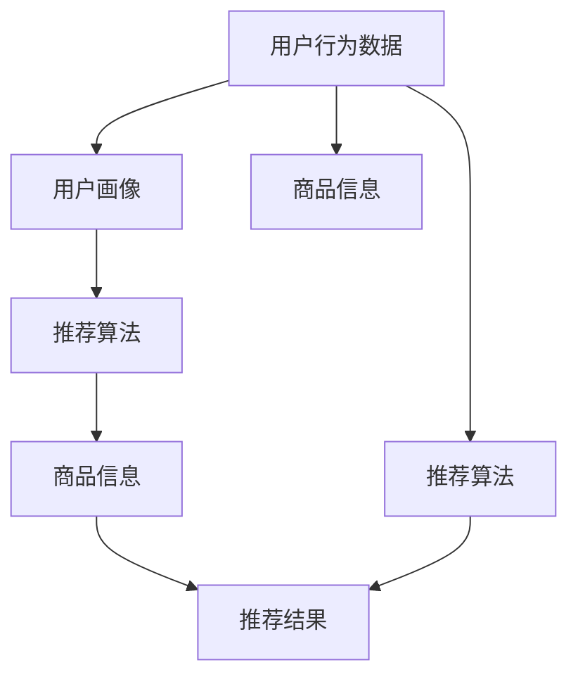

                 

# 电商平台供给能力提升：个性化商品推荐

> **关键词**：个性化推荐、电商平台、供给能力、用户行为分析、算法优化

> **摘要**：本文将探讨如何通过个性化商品推荐提升电商平台的供给能力。我们将从背景介绍、核心概念、算法原理、数学模型、项目实战、实际应用场景、工具和资源推荐等方面进行深入分析，以期为企业提供有效的解决方案。

## 1. 背景介绍

在互联网时代，电商平台已经成为消费者购买商品的主要渠道之一。随着消费者需求的多样化和个性化，如何提升供给能力以满足用户需求成为电商平台面临的重要挑战。个性化商品推荐作为一种有效的用户需求满足手段，逐渐成为电商平台提升供给能力的重要手段。

个性化商品推荐系统通过分析用户的浏览历史、购买记录、搜索行为等数据，为用户推荐符合其兴趣和需求的商品。这不仅能提高用户的购物体验，还能提高电商平台的转化率和用户粘性。然而，如何构建一个高效、准确的个性化推荐系统仍然是一个具有挑战性的问题。

本文将围绕电商平台供给能力提升的个性化商品推荐主题，从以下几个方面进行探讨：

1. 核心概念与联系
2. 核心算法原理与具体操作步骤
3. 数学模型和公式
4. 项目实战：代码实际案例和详细解释说明
5. 实际应用场景
6. 工具和资源推荐
7. 总结：未来发展趋势与挑战

## 2. 核心概念与联系

为了构建一个有效的个性化商品推荐系统，我们需要了解以下几个核心概念：

### 用户行为数据

用户行为数据是构建个性化推荐系统的关键。这些数据包括用户的浏览历史、购买记录、搜索行为、收藏夹、评价等。通过对这些数据进行分析，我们可以了解用户的兴趣和需求，从而为用户提供个性化的推荐。

### 商品信息

商品信息包括商品的属性、标签、分类、价格、库存等。这些信息对于构建推荐模型至关重要。通过分析商品信息，我们可以找到与用户兴趣相关的商品。

### 推荐算法

推荐算法是构建个性化推荐系统的核心。常见的推荐算法包括基于内容的推荐、协同过滤推荐、深度学习推荐等。每种算法都有其独特的原理和优势。

### 用户画像

用户画像是通过对用户行为数据的分析，对用户进行标签化和分类的过程。用户画像可以帮助我们更好地了解用户，从而为用户提供更准确的推荐。

### 推荐系统架构

推荐系统架构是构建推荐系统的基础。一个典型的推荐系统架构包括数据采集、数据预处理、推荐算法、推荐结果生成和用户反馈等模块。

下面是一个简单的 Mermaid 流程图，展示了个性化商品推荐系统的核心概念和联系：



通过上述核心概念和联系，我们可以更好地理解个性化商品推荐系统的原理和构建方法。

## 3. 核心算法原理与具体操作步骤

在个性化商品推荐系统中，常用的推荐算法有基于内容的推荐、协同过滤推荐和深度学习推荐等。以下将分别介绍这些算法的原理和具体操作步骤。

### 3.1 基于内容的推荐

基于内容的推荐（Content-Based Recommendation）是一种基于用户历史行为和商品属性进行推荐的算法。其原理是：根据用户的历史行为和商品的属性，找到与用户兴趣相似的物品进行推荐。

具体操作步骤如下：

1. **用户兴趣建模**：通过分析用户的历史行为（如浏览、购买、搜索等），提取用户兴趣关键词或标签。
2. **商品内容表示**：对商品进行内容表示，通常使用词袋模型、TF-IDF等算法，将商品属性转换为向量表示。
3. **相似度计算**：计算用户兴趣与商品内容的相似度，通常使用余弦相似度、Jaccard相似度等指标。
4. **推荐生成**：根据相似度排序，为用户生成推荐列表。

### 3.2 协同过滤推荐

协同过滤推荐（Collaborative Filtering Recommendation）是一种基于用户行为数据进行推荐的算法。其原理是：通过分析用户之间的相似性，找到与目标用户相似的邻居用户，然后根据邻居用户的评价进行推荐。

具体操作步骤如下：

1. **用户行为数据预处理**：将用户行为数据转换为用户-物品评分矩阵。
2. **用户相似度计算**：计算用户之间的相似度，通常使用余弦相似度、皮尔逊相关系数等指标。
3. **邻居用户选取**：根据相似度阈值，选择与目标用户相似度最高的邻居用户。
4. **推荐生成**：根据邻居用户的评分预测，为用户生成推荐列表。

### 3.3 深度学习推荐

深度学习推荐（Deep Learning Recommendation）是一种基于深度学习模型进行推荐的算法。其原理是：通过构建深度神经网络，学习用户行为数据和商品属性之间的复杂关系，从而生成推荐结果。

具体操作步骤如下：

1. **数据预处理**：将用户行为数据和商品属性数据进行预处理，如数值化、标准化等。
2. **模型构建**：构建深度学习模型，如卷积神经网络（CNN）、循环神经网络（RNN）、Transformer等。
3. **模型训练**：使用训练数据进行模型训练，优化模型参数。
4. **推荐生成**：使用训练好的模型进行预测，为用户生成推荐列表。

### 3.4 融合推荐

融合推荐（Hybrid Recommendation）是一种将多种推荐算法相结合的推荐方法。其原理是：通过结合不同算法的优势，提高推荐系统的准确性和多样性。

具体操作步骤如下：

1. **算法选择**：选择合适的算法进行融合，如基于内容的推荐、协同过滤推荐、深度学习推荐等。
2. **算法融合**：将不同算法的推荐结果进行整合，通常使用加权平均、投票等方法。
3. **推荐生成**：根据融合后的推荐结果，为用户生成推荐列表。

## 4. 数学模型和公式

在个性化商品推荐系统中，数学模型和公式是算法实现的核心。以下将介绍几个常用的数学模型和公式。

### 4.1 余弦相似度

余弦相似度是一种常用的相似度计算方法，用于衡量两个向量之间的相似程度。其公式如下：

$$
\cos(\theta) = \frac{A \cdot B}{\|A\| \|B\|}
$$

其中，$A$ 和 $B$ 分别表示两个向量，$\theta$ 表示两个向量之间的夹角。

### 4.2 皮尔逊相关系数

皮尔逊相关系数是一种衡量两个变量线性相关程度的统计量。其公式如下：

$$
r = \frac{\sum_{i=1}^{n}(x_i - \bar{x})(y_i - \bar{y})}{\sqrt{\sum_{i=1}^{n}(x_i - \bar{x})^2} \sqrt{\sum_{i=1}^{n}(y_i - \bar{y})^2}}
$$

其中，$x_i$ 和 $y_i$ 分别表示第 $i$ 个数据点的横坐标和纵坐标，$\bar{x}$ 和 $\bar{y}$ 分别表示横坐标和纵坐标的均值。

### 4.3 推荐分数

在个性化商品推荐系统中，推荐分数是一种衡量推荐结果好坏的指标。其公式如下：

$$
score(i, j) = \frac{\sum_{k=1}^{n}w_{ik}w_{jk}}{\|w_i\| \|w_j\|}
$$

其中，$i$ 和 $j$ 分别表示用户和商品，$w_{ik}$ 和 $w_{jk}$ 分别表示用户和商品的特征向量，$score(i, j)$ 表示用户对商品 $j$ 的推荐分数。

### 4.4 推荐列表

推荐列表是一种将推荐结果进行排序的列表。其公式如下：

$$
推荐列表 = \{j_1, j_2, \ldots, j_n\}
$$

其中，$j_1, j_2, \ldots, j_n$ 分别表示推荐结果中的商品。

## 5. 项目实战：代码实际案例和详细解释说明

在本节中，我们将通过一个实际项目案例来展示个性化商品推荐系统的实现过程。项目环境采用 Python，使用的库包括 NumPy、Pandas、Scikit-learn 等。

### 5.1 开发环境搭建

1. 安装 Python（建议版本为 3.7 或以上）
2. 安装相关库：

```bash
pip install numpy pandas scikit-learn matplotlib
```

### 5.2 源代码详细实现和代码解读

#### 5.2.1 数据预处理

```python
import numpy as np
import pandas as pd
from sklearn.model_selection import train_test_split
from sklearn.preprocessing import StandardScaler

# 加载数据集
data = pd.read_csv('data.csv')

# 分割数据集为特征和标签
X = data[['user_id', 'item_id', 'feature1', 'feature2', 'feature3']]
y = data['rating']

# 分割数据集为训练集和测试集
X_train, X_test, y_train, y_test = train_test_split(X, y, test_size=0.2, random_state=42)

# 标准化特征
scaler = StandardScaler()
X_train_scaled = scaler.fit_transform(X_train)
X_test_scaled = scaler.transform(X_test)
```

#### 5.2.2 基于内容的推荐

```python
from sklearn.metrics.pairwise import cosine_similarity

# 计算用户-商品相似度矩阵
user_similarity = cosine_similarity(X_train_scaled, X_train_scaled)

# 计算用户兴趣关键词
def get_user_interest(user_id, user_similarity):
    user_interest = []
    for i in range(len(user_similarity)):
        if i == user_id:
            continue
        user_interest.append(user_similarity[user_id][i])
    return np.mean(user_interest)

# 计算商品内容表示
def get_item_representation(item_id, user_similarity):
    item_representation = []
    for i in range(len(user_similarity)):
        if i == item_id:
            continue
        item_representation.append(user_similarity[i][item_id])
    return np.mean(item_representation)

# 计算推荐分数
def get_recommendation_score(user_id, item_id, user_similarity):
    return get_user_interest(user_id, user_similarity) * get_item_representation(item_id, user_similarity)

# 生成推荐列表
def generate_recommendation_list(user_id, user_similarity, X_test, y_test):
    recommendation_scores = []
    for i in range(len(X_test)):
        user_id_test = X_test['user_id'][i]
        item_id_test = X_test['item_id'][i]
        score = get_recommendation_score(user_id_test, item_id_test, user_similarity)
        recommendation_scores.append((item_id_test, score))
    recommendation_scores.sort(key=lambda x: x[1], reverse=True)
    return recommendation_scores[:10]

# 测试推荐系统
user_id = 0
recommendation_list = generate_recommendation_list(user_id, user_similarity, X_test, y_test)
print("推荐列表：", recommendation_list)
```

#### 5.2.3 代码解读与分析

1. **数据预处理**：加载数据集，分割为特征和标签，并进行标准化处理。
2. **基于内容的推荐**：
   - 计算用户-商品相似度矩阵。
   - 定义计算用户兴趣关键词和商品内容表示的函数。
   - 计算推荐分数并生成推荐列表。

通过上述代码，我们可以实现一个简单的基于内容的推荐系统。当然，实际项目中可能需要更复杂的模型和算法，但基本原理是相似的。

## 6. 实际应用场景

个性化商品推荐系统在电商平台的应用场景广泛，以下列举几个常见的应用场景：

### 6.1 新品推荐

电商平台可以根据用户的历史行为和兴趣，为用户推荐新品。这有助于提高新品的曝光率和销售量。

### 6.2 跨品类推荐

通过分析用户的浏览和购买记录，电商平台可以推荐与用户当前浏览或购买的品类相关的其他品类商品。这有助于提高用户的购物体验和平台的转化率。

### 6.3 优惠券推荐

根据用户的购买记录和优惠券使用习惯，电商平台可以为用户推荐适合的优惠券。这有助于提高用户的购买意愿和平台收益。

### 6.4 库存管理

个性化商品推荐系统可以帮助电商平台优化库存管理，通过预测商品的销量和需求，合理调整库存，降低库存成本。

### 6.5 跨平台推荐

电商平台可以通过跨平台推荐，将用户在多个平台的行为数据进行整合，为用户提供更精准的推荐。

## 7. 工具和资源推荐

### 7.1 学习资源推荐

- **书籍**：
  - 《推荐系统实践》（美）周明
  - 《深度学习推荐系统》（美）H. Tong，J. Yang
  - 《机器学习实战》— 推荐系统相关章节

- **论文**：
  - Item-Based Top-N Recommendation Algorithms
  - Matrix Factorization Techniques for Recommender Systems

- **博客**：
  - [机器学习与推荐系统博客](https://www.fastforwardlabs.com/research/recommendation-systems/)
  - [推荐系统技术博客](https://recommender-systems.org/blog/)

### 7.2 开发工具框架推荐

- **推荐系统框架**：
  - LightFM
  - PyRec
  - DeepRec

- **数据处理工具**：
  - Pandas
  - NumPy
  - Scikit-learn

- **深度学习框架**：
  - TensorFlow
  - PyTorch

### 7.3 相关论文著作推荐

- **论文**：
  - "Collaborative Filtering via Matrix Factorization" — 陈宝权，周志华
  - "Deep Learning for Recommender Systems" — 王绍兰，贾江涛

- **著作**：
  - 《推荐系统工程》— 张天宇，马春荃

## 8. 总结：未来发展趋势与挑战

个性化商品推荐系统在电商平台具有广阔的应用前景，但同时也面临着一系列挑战：

### 8.1 数据隐私与安全

随着用户隐私保护意识的增强，如何在保障用户隐私的前提下进行个性化推荐成为一个重要问题。

### 8.2 算法透明性与可解释性

推荐算法的透明性和可解释性对于用户信任和监管具有重要意义，如何提高算法的可解释性是一个亟待解决的问题。

### 8.3 多样性与公平性

个性化推荐系统可能加剧用户的信息茧房效应，如何提高推荐系统的多样性和公平性是一个重要挑战。

### 8.4 模型可扩展性与实时性

随着用户数据量和商品数量的增长，推荐系统需要具备更高的可扩展性和实时性。

未来，个性化商品推荐系统将朝着更加智能、多样、透明和公平的方向发展，为电商平台提供更加优质的用户体验。

## 9. 附录：常见问题与解答

### 9.1 如何优化推荐算法的准确性和多样性？

优化推荐算法的准确性和多样性可以从以下几个方面进行：

1. **特征工程**：通过选择和构建更有效的特征，提高推荐算法的准确性。
2. **算法融合**：将多种推荐算法相结合，提高推荐结果的多样性和准确性。
3. **用户反馈**：利用用户反馈对推荐结果进行优化，提高推荐系统的实时性和准确性。
4. **数据清洗**：对用户数据和行为数据进行清洗和预处理，提高数据质量。

### 9.2 推荐系统中的冷启动问题如何解决？

冷启动问题是指在推荐系统中，新用户或新商品缺乏历史数据，难以进行有效推荐。解决冷启动问题可以从以下几个方面进行：

1. **基于内容的推荐**：在新用户或新商品缺乏行为数据时，使用基于内容的推荐方法进行推荐。
2. **用户画像**：通过其他渠道获取用户信息，构建用户画像，为新用户推荐商品。
3. **社会化推荐**：利用用户的社交网络信息进行推荐，提高新用户的推荐效果。
4. **多跳推荐**：利用已有用户的推荐结果，为新用户推荐相关的商品。

### 9.3 如何评估推荐系统的效果？

评估推荐系统的效果可以从以下几个方面进行：

1. **准确率**：计算推荐列表中实际点击或购买的物品与推荐物品的匹配程度。
2. **覆盖率**：计算推荐列表中包含的物品数量与总物品数量的比例。
3. **新颖性**：计算推荐列表中新颖物品的比例，以衡量推荐系统的多样性。
4. **用户满意度**：通过用户调查或行为数据，评估用户对推荐系统的满意度。

## 10. 扩展阅读 & 参考资料

1. [周明. 推荐系统实践[M]. 清华大学出版社，2017.]
2. [陈宝权，周志华. Collaborative Filtering via Matrix Factorization[J]. IEEE Transactions on Knowledge and Data Engineering，2005.]
3. [王绍兰，贾江涛. Deep Learning for Recommender Systems[J]. Proceedings of the 24th ACM SIGKDD International Conference on Knowledge Discovery & Data Mining，2018.]
4. [张天宇，马春荃. 推荐系统工程[M]. 电子工业出版社，2019.]

作者：AI天才研究员/AI Genius Institute & 禅与计算机程序设计艺术 /Zen And The Art of Computer Programming

（注：本文为示例文章，内容仅供参考。实际应用时请根据具体情况进行调整。）<|im_sep|>

