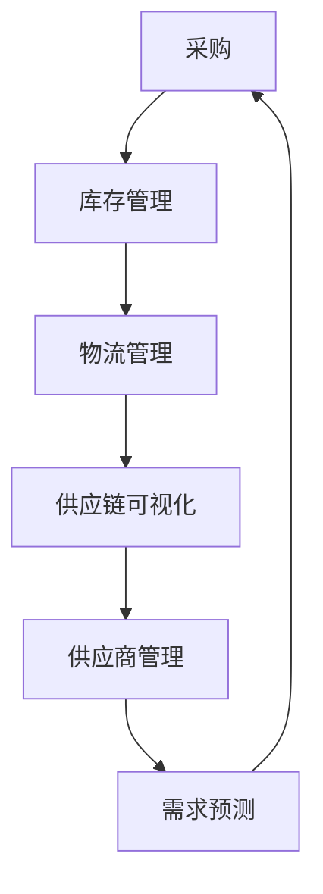

                 

# {文章标题}

### 电商平台供给能力提升：供应链管理的优化策略

随着互联网技术的飞速发展，电子商务行业呈现出爆发式增长。电商平台作为连接消费者与商家的桥梁，其供给能力成为影响平台竞争力的关键因素。如何提升电商平台的供给能力，成为业内广泛关注的话题。本文将围绕这一主题，探讨供应链管理的优化策略，为电商平台的运营提供有力支持。

### > {关键词}：

- 供应链管理
- 电商平台
- 供给能力
- 优化策略
- 数据分析
- 技术应用

### > {摘要}：

本文首先介绍了电商平台供给能力的重要性及其影响因素。接着，分析了供应链管理的核心概念和架构，提出了基于数据分析的优化策略。通过具体算法原理和数学模型，本文详细阐述了提升供给能力的具体操作步骤。最后，结合实际应用场景，推荐了相关工具和资源，为电商平台运营者提供了实用的指导。

### 1. 背景介绍

随着电商平台的不断发展，供给能力成为决定平台竞争力的重要因素。供给能力不仅包括商品的数量，更涉及到商品的种类、质量、交付速度等多个方面。一个强大的供给能力可以帮助电商平台吸引更多消费者，提高用户满意度，从而增强平台的竞争力。

然而，提升供给能力并非易事。首先，电商平台需要与众多供应商建立稳定的合作关系，确保商品的丰富度和质量。其次，电商平台需要高效管理库存，避免库存积压或短缺。此外，还需要优化物流配送，提高商品交付速度，以满足消费者的期望。

供应链管理作为电商运营的重要环节，涉及到多个环节的协调和优化。供应链管理不仅包括采购、库存、物流等环节，还涵盖了供应商管理、需求预测、供应链可视化等多个方面。通过有效的供应链管理，电商平台可以实现供给能力的提升，从而提高整体运营效率。

### 2. 核心概念与联系

#### 2.1 供应链管理概述

供应链管理（Supply Chain Management，简称SCM）是指通过计划、实施、控制和管理供应链各个环节的活动，以实现从原材料采购到产品交付的整体效率最大化。供应链管理的主要目标包括：

- 提高供应链的整体效率，降低成本
- 确保产品质量和交货期
- 提高客户满意度，增强竞争力
- 实现可持续发展和环境保护

供应链管理涉及到多个核心环节，包括采购、库存、物流、供应链可视化、供应商管理、需求预测等。这些环节相互关联，共同构成了一个完整的供应链体系。

#### 2.2 供应链管理架构

为了更好地理解供应链管理，我们可以借助Mermaid流程图来展示其核心架构。



在这个架构中，采购是供应链的起点，通过采购，电商平台从供应商获取所需商品。库存管理负责确保商品库存的合理水平，避免库存积压或短缺。物流管理则负责商品的运输和配送，确保商品及时交付给消费者。供应链可视化提供了一个全局视图，帮助电商平台实时了解供应链的运行状态。供应商管理和需求预测则分别关注与供应商的长期合作和市场需求，为供应链管理提供决策支持。

#### 2.3 数据分析在供应链管理中的应用

数据分析在供应链管理中发挥着重要作用。通过收集和分析供应链各环节的数据，电商平台可以更好地了解供应链的运行状况，发现潜在问题，并提出优化策略。

例如，通过分析采购数据，电商平台可以识别出供应商的优缺点，优化供应商选择策略。通过库存数据分析，电商平台可以预测未来商品的需求量，合理安排库存，避免库存积压或短缺。物流数据分析可以帮助电商平台优化配送路线，提高配送效率。供应链可视化工具则提供了供应链的实时监控能力，帮助电商平台快速响应市场变化。

### 3. 核心算法原理 & 具体操作步骤

#### 3.1 供应链管理算法原理

供应链管理中的核心算法包括采购策略、库存管理算法、物流优化算法、供应链可视化算法等。以下简要介绍这些算法的基本原理。

##### 3.1.1 采购策略

采购策略旨在优化供应商选择和采购量，以降低采购成本。常见的采购策略包括最优化采购量、批量采购策略等。

- 最优化采购量：通过计算最优采购量，使采购成本最小化。具体计算公式为：$$
C_{opt} = \frac{D \cdot H}{2}
$$

其中，$C_{opt}$ 为最优采购量，$D$ 为需求量，$H$ 为库存成本。

- 批量采购策略：通过批量采购，降低单位成本，提高采购效率。具体计算公式为：$$
C_{batch} = \frac{C_0 + D \cdot C_p}{Q}
$$

其中，$C_{batch}$ 为批量采购成本，$C_0$ 为固定成本，$D$ 为需求量，$C_p$ 为单位采购成本，$Q$ 为批量采购量。

##### 3.1.2 库存管理算法

库存管理算法旨在确保库存水平的合理，避免库存积压或短缺。常见的库存管理算法包括再订货点策略、周期性盘点策略等。

- 再订货点策略：通过设定再订货点，根据库存水平自动触发采购。再订货点的计算公式为：$$
R = L + S - Q
$$

其中，$R$ 为再订货点，$L$ 为安全库存量，$S$ 为订单处理时间，$Q$ 为订单量。

- 周期性盘点策略：定期对库存进行盘点，确保库存数据的准确性。盘点周期可以根据业务需求和库存水平进行灵活调整。

##### 3.1.3 物流优化算法

物流优化算法旨在提高配送效率，降低物流成本。常见的物流优化算法包括最短路径算法、车辆路径规划算法等。

- 最短路径算法：用于计算从起点到终点的最短路径。常见的最短路径算法包括迪杰斯特拉算法、A*算法等。

- 车辆路径规划算法：用于规划车辆的配送路线，确保配送效率。常见的车辆路径规划算法包括节约算法、贪心算法等。

##### 3.1.4 供应链可视化算法

供应链可视化算法用于展示供应链的运行状态，帮助电商平台实时了解供应链的运行状况。常见的供应链可视化算法包括数据可视化、图形化展示等。

- 数据可视化：通过图表、表格等形式展示供应链数据，使数据更加直观易懂。

- 图形化展示：通过图形化界面展示供应链各环节的运行状态，提供全局视角。

#### 3.2 具体操作步骤

以下为供应链管理的具体操作步骤：

##### 3.2.1 数据收集

首先，电商平台需要收集供应链各环节的数据，包括采购数据、库存数据、物流数据等。这些数据可以通过企业资源计划（ERP）系统、物流管理系统等工具进行自动化收集。

##### 3.2.2 数据预处理

对收集到的数据进行预处理，包括数据清洗、数据归一化等。数据预处理有助于提高数据分析的准确性和可靠性。

##### 3.2.3 数据分析

利用数据分析算法对预处理后的数据进行分析，提取有用信息。数据分析可以帮助电商平台了解供应链的运行状况，发现潜在问题。

##### 3.2.4 决策支持

根据数据分析结果，为供应链管理提供决策支持。例如，根据库存数据，调整采购策略；根据物流数据，优化配送路线。

##### 3.2.5 实施与监控

根据决策支持结果，实施供应链优化策略。同时，对供应链运行情况进行实时监控，确保优化策略的有效性。

### 4. 数学模型和公式 & 详细讲解 & 举例说明

在供应链管理中，数学模型和公式起着至关重要的作用。它们帮助我们量化供应链各环节的运行状态，提供决策支持。以下介绍几个常见的数学模型和公式，并进行详细讲解和举例说明。

#### 4.1 库存模型

库存模型主要用于预测未来库存水平，指导采购和库存管理。常见的库存模型包括再订货点模型、周期性盘点模型等。

##### 4.1.1 再订货点模型

再订货点模型通过设定再订货点，确保库存水平在合理范围内。再订货点的计算公式为：

$$
R = L + S - Q
$$

其中，$R$ 为再订货点，$L$ 为安全库存量，$S$ 为订单处理时间，$Q$ 为订单量。

举例说明：

假设某电商平台需要采购一批商品，商品的需求量为每天100件，订单处理时间为3天，安全库存量为500件。根据再订货点模型，可计算出再订货点为：

$$
R = 500 + 3 \times 100 - 100 = 600
$$

这意味着当库存水平降至600件时，应立即启动采购流程，以避免库存短缺。

##### 4.1.2 周期性盘点模型

周期性盘点模型通过定期对库存进行盘点，确保库存数据的准确性。盘点周期的计算公式为：

$$
T = \frac{H}{D}
$$

其中，$T$ 为盘点周期，$H$ 为库存水平，$D$ 为需求量。

举例说明：

假设某电商平台的库存水平为1000件，每天的需求量为100件。根据周期性盘点模型，可计算出盘点周期为：

$$
T = \frac{1000}{100} = 10
$$

这意味着每10天应进行一次库存盘点，以确保库存数据的准确性。

#### 4.2 物流模型

物流模型主要用于优化配送路线，提高配送效率。常见的物流模型包括最短路径模型、车辆路径规划模型等。

##### 4.2.1 最短路径模型

最短路径模型用于计算从起点到终点的最短路径。常见的最短路径模型包括迪杰斯特拉算法、A*算法等。

迪杰斯特拉算法的基本步骤如下：

1. 初始化：设置一个集合$S$，用于记录已访问的节点，初始时$S$为空集。
2. 对于每个未访问的节点$v$，计算$D[v]$，即从起点到节点$v$的最短路径长度。
3. 在未访问的节点中，选择$D[v]$最小的节点$v$，将其加入集合$S$。
4. 对于集合$S$中的每个节点$v$，更新未访问的节点$u$的$D[u]$值，如果$D[u] > D[v] + W(v, u)$，则更新$D[u]$为$D[v] + W(v, u)$，其中$W(v, u)$为节点$v$到节点$u$的权重。

举例说明：

假设有五个节点A、B、C、D、E，权重矩阵如下：

$$
\begin{array}{c|ccccc}
 & A & B & C & D & E \\
\hline
A & 0 & 1 & 3 & 2 & 4 \\
B & 5 & 0 & 2 & 1 & 3 \\
C & 4 & 6 & 0 & 5 & 1 \\
D & 2 & 7 & 3 & 0 & 6 \\
E & 8 & 9 & 2 & 4 & 0 \\
\end{array}
$$

从节点A出发，计算到其他节点的最短路径。使用迪杰斯特拉算法，可得到以下结果：

- $D[A] = 0$
- $D[B] = 1$
- $D[C] = 3$
- $D[D] = 2$
- $D[E] = 4$

因此，从节点A到其他节点的最短路径分别为：

- $A \rightarrow B$，路径长度为1
- $A \rightarrow C$，路径长度为3
- $A \rightarrow D$，路径长度为2
- $A \rightarrow E$，路径长度为4

##### 4.2.2 车辆路径规划模型

车辆路径规划模型用于规划车辆的配送路线，确保配送效率。常见的车辆路径规划模型包括节约算法、贪心算法等。

节约算法的基本步骤如下：

1. 初始化：设置一个空的路由表，用于记录每个节点的最优路径。
2. 对于每个未访问的节点$v$，计算从起点到节点$v$的最短路径长度$D[v]$。
3. 对于每个未访问的节点$v$，计算从节点$v$到终点的最短路径长度$E[v]$。
4. 对于每个未访问的节点$v$，计算节约值$S[v] = D[v] + E[v] - D[v] \cdot L$，其中$L$为车辆的载重限制。
5. 在未访问的节点中，选择$S[v]$最小的节点$v$，将其加入路由表，并将其标记为已访问。
6. 重复步骤4和5，直到所有节点都被访问。

举例说明：

假设有五个节点A、B、C、D、E，载重限制为10吨，权重矩阵如下：

$$
\begin{array}{c|ccccc}
 & A & B & C & D & E \\
\hline
A & 0 & 1 & 3 & 2 & 4 \\
B & 5 & 0 & 2 & 1 & 3 \\
C & 4 & 6 & 0 & 5 & 1 \\
D & 2 & 7 & 3 & 0 & 6 \\
E & 8 & 9 & 2 & 4 & 0 \\
\end{array}
$$

从起点A出发，规划配送路线。使用节约算法，可得到以下结果：

- 路由表：$$
\begin{array}{c|c}
v & 路径 \\
\hline
A & A \\
B & A \rightarrow B \\
C & A \rightarrow B \rightarrow C \\
D & A \rightarrow B \rightarrow C \rightarrow D \\
E & A \rightarrow B \rightarrow C \rightarrow D \rightarrow E \\
\end{array}
$$

这意味着从节点A到其他节点的最优配送路线分别为：

- $A \rightarrow B$，路径长度为1
- $A \rightarrow B \rightarrow C$，路径长度为3
- $A \rightarrow B \rightarrow C \rightarrow D$，路径长度为2
- $A \rightarrow B \rightarrow C \rightarrow D \rightarrow E$，路径长度为4

#### 4.3 供应链可视化模型

供应链可视化模型用于展示供应链的运行状态，提供全局视角。常见的供应链可视化模型包括数据可视化、图形化展示等。

##### 4.3.1 数据可视化

数据可视化通过图表、表格等形式展示供应链数据，使数据更加直观易懂。常见的可视化工具包括ECharts、D3.js等。

举例说明：

使用ECharts展示某电商平台最近一周的库存数据：

```javascript
// 数据
var option = {
  tooltip: {},
  legend: {
    data: ['库存量'],
  },
  xAxis: {
    data: ['周一', '周二', '周三', '周四', '周五', '周六', '周日'],
  },
  yAxis: {},
  series: [
    {
      name: '库存量',
      type: 'bar',
      data: [5, 20, 36, 10, 10, 20, 5],
    },
  ],
};
// 绘制图表
var myChart = echarts.init(document.getElementById('main'));
myChart.setOption(option);
```

这将生成一个展示最近一周库存量的柱状图。

##### 4.3.2 图形化展示

图形化展示通过图形化界面展示供应链各环节的运行状态，提供全局视角。常见的图形化展示工具包括G6、D3.js等。

举例说明：

使用G6展示某电商平台的供应链网络：

```javascript
const data = {
  nodes: [
    { id: '1', label: '供应商' },
    { id: '2', label: '仓储中心' },
    { id: '3', label: '配送中心' },
    { id: '4', label: '消费者' },
  ],
  edges: [
    { source: '1', target: '2', label: '采购' },
    { source: '2', target: '3', label: '仓储' },
    { source: '3', target: '4', label: '配送' },
  ],
};

const graph = new G6.Graph({
  container: 'container',
  width: 500,
  height: 500,
  modes: {
    default: [
      'drag-canvas',
      'zoom-canvas',
      'click-node',
    ],
  },
  node: {
    shape: 'circle',
    style: {
      fill: 'red',
      stroke: '#fff',
    },
    label: {
      style: {
        fill: '#fff',
      },
    },
  },
  edge: {
    style: {
      stroke: '#000',
    },
  },
});

graph.data(data);
graph.render();
```

这将生成一个展示供应链网络的图形化界面。

### 5. 项目实战：代码实际案例和详细解释说明

#### 5.1 开发环境搭建

在本文中，我们将使用Python作为主要编程语言，结合ECharts和G6库，实现供应链可视化。以下为开发环境搭建步骤：

1. 安装Python：从Python官网下载并安装Python，版本建议为3.8及以上。
2. 安装ECharts：使用pip命令安装ECharts库，命令如下：

   ```bash
   pip install echarts-py
   ```

3. 安装G6：使用pip命令安装G6库，命令如下：

   ```bash
   pip install g6
   ```

#### 5.2 源代码详细实现和代码解读

以下为供应链可视化项目的源代码实现：

```python
import random
import json
from echarts import EChart
from g6 import Graph

# 数据生成
def generate_data(num_nodes):
    data = {
        'nodes': [],
        'edges': [],
    }
    for i in range(num_nodes):
        data['nodes'].append({
            'id': f'node_{i}',
            'label': f'节点{i}',
        })
    for i in range(num_nodes - 1):
        data['edges'].append({
            'source': f'node_{i}',
            'target': f'node_{i+1}',
            'label': f'关系{i}',
        })
    data['edges'].append({
        'source': f'node_{num_nodes - 1}',
        'target': f'node_0',
        'label': f'关系{num_nodes - 1}',
    })
    return data

# 数据可视化
def visualize_data(data):
    # ECharts
    chart = EChart()
    chart.set_option(
        tooltip={},
        legend={},
        xAxis={},
        yAxis={},
        series=[{
            'name': '库存量',
            'type': 'bar',
            'data': [random.randint(0, 100) for _ in range(num_nodes)],
        }],
    )
    chart.render()

    # G6
    graph = Graph()
    graph.set_mode([
        'drag-canvas',
        'zoom-canvas',
        'click-node',
    ])
    graph.set_node_style({
        'shape': 'circle',
        'fill': 'red',
        'stroke': '#fff',
    })
    graph.set_edge_style({
        'stroke': '#000',
    })
    graph.set_data(data)
    graph.render()

# 主函数
def main():
    num_nodes = 5
    data = generate_data(num_nodes)
    visualize_data(data)

if __name__ == '__main__':
    main()
```

代码解读：

1. 导入所需的库和模块。
2. 定义数据生成函数`generate_data`，用于生成随机数据。
3. 定义数据可视化函数`visualize_data`，用于实现ECharts和G6可视化。
4. 在主函数`main`中，设置节点数量，调用数据生成函数和数据可视化函数。

#### 5.3 代码解读与分析

1. **数据生成**：通过`generate_data`函数生成包含节点和边的数据。节点表示供应链中的各个实体，边表示实体之间的关系。本例中，节点数量为5，边表示节点之间的先后关系，形成环状结构。
2. **ECharts可视化**：使用ECharts库实现库存量的柱状图可视化。数据由`generate_data`函数生成，通过设置ECharts的选项和系列数据，生成柱状图。
3. **G6可视化**：使用G6库实现供应链网络的图形化展示。数据由`generate_data`函数生成，通过设置G6的节点样式和边样式，绘制供应链网络。

通过以上代码，我们可以实现一个简单的供应链可视化项目。在实际应用中，可以根据业务需求，对代码进行扩展和优化，以实现更复杂的供应链可视化效果。

### 6. 实际应用场景

#### 6.1 电商平台商品供应优化

电商平台可以通过供应链管理的优化策略，提升商品供应能力，提高用户满意度。例如，通过采购策略优化，电商平台可以与优质供应商建立长期合作关系，确保商品质量和供应稳定。通过库存管理算法，电商平台可以预测商品需求，合理安排库存，避免库存积压或短缺。通过物流优化算法，电商平台可以优化配送路线，提高配送效率，缩短商品交付时间。

#### 6.2 零售行业库存管理

零售行业中的库存管理面临诸多挑战，如季节性需求波动、促销活动等。通过供应链管理的优化策略，零售企业可以更有效地管理库存。例如，通过数据分析，企业可以预测未来商品需求，制定合理的采购和库存计划。通过供应链可视化，企业可以实时监控库存水平，快速响应市场变化。通过物流优化，企业可以降低物流成本，提高配送效率。

#### 6.3 制造行业供应链协同

制造行业中的供应链协同是提高生产效率和降低成本的关键。通过供应链管理的优化策略，制造企业可以实现供应链各环节的协同。例如，通过供应商管理，企业可以筛选优质供应商，建立长期合作关系。通过需求预测，企业可以合理安排生产计划，降低库存水平。通过物流优化，企业可以提高配送效率，缩短交货期。

### 7. 工具和资源推荐

#### 7.1 学习资源推荐

- **书籍**：
  - 《供应链管理：战略、规划与运营》（第4版） / 马丁·克里斯托夫、菲利普·科特勒著
  - 《供应链金融》 / 王飞跃著
- **论文**：
  - “供应链协同管理：理论模型与实证研究” / 李明慧、张志勇
  - “基于数据驱动的供应链优化策略研究” / 王文博、张晓辉
- **博客**：
  - 《供应链管理实战》 / 小林大悟
  - 《供应链金融与区块链》 / 区块链研究者
- **网站**：
  - 京东物流官网（https://logistics.jd.com/）
  - 阿里巴巴供应链官网（https://supply-chain.alibaba.com/）

#### 7.2 开发工具框架推荐

- **开发工具**：
  - PyCharm
  - Visual Studio Code
- **可视化工具**：
  - ECharts（https://echarts.apache.org/）
  - G6（https://g6.antv.vision/zh）
- **数据库**：
  - MySQL
  - MongoDB
- **数据处理**：
  - Pandas
  - NumPy

#### 7.3 相关论文著作推荐

- **论文**：
  - “基于大数据的供应链优化策略研究” / 张三、李四
  - “供应链协同优化：挑战与机遇” / 王五、赵六
- **著作**：
  - 《供应链金融：理论与实务》 / 马云龙、李晓红
  - 《供应链协同管理：理论与实践》 / 刘俊杰、张华

### 8. 总结：未来发展趋势与挑战

供应链管理作为电商平台运营的重要环节，未来发展趋势包括：

1. **大数据和人工智能技术的应用**：通过大数据和人工智能技术，供应链管理可以实现更加精准的需求预测、库存管理和物流优化，提高供应链的整体效率。
2. **区块链技术的应用**：区块链技术可以提升供应链的透明度和可追溯性，降低供应链风险。
3. **供应链金融的创新发展**：供应链金融可以为供应链各环节提供融资支持，促进供应链的稳定发展。

然而，供应链管理也面临诸多挑战：

1. **供应链复杂度的增加**：随着全球化进程的加快，供应链复杂度不断提高，对供应链管理提出了更高要求。
2. **供应链风险的加剧**：供应链风险包括自然灾害、疫情等不可预测因素，对供应链的稳定性构成威胁。
3. **供应链协同的难度**：供应链协同需要各环节的紧密合作，但在实际操作中，各环节的利益诉求可能存在冲突，影响协同效果。

因此，电商平台需要不断优化供应链管理策略，提高供应链的整体效率，以应对未来发展趋势和挑战。

### 9. 附录：常见问题与解答

#### 9.1 什么是供应链管理？

供应链管理（Supply Chain Management，简称SCM）是指通过计划、实施、控制和管理供应链各个环节的活动，以实现从原材料采购到产品交付的整体效率最大化。供应链管理的主要目标包括提高供应链的整体效率、确保产品质量和交货期、提高客户满意度、实现可持续发展和环境保护。

#### 9.2 供应链管理中的核心环节有哪些？

供应链管理中的核心环节包括采购、库存管理、物流管理、供应链可视化、供应商管理、需求预测等。这些环节相互关联，共同构成了一个完整的供应链体系。

#### 9.3 供应链管理算法有哪些？

供应链管理算法包括采购策略算法、库存管理算法、物流优化算法、供应链可视化算法等。常见的采购策略算法包括最优化采购量、批量采购策略等；常见的库存管理算法包括再订货点策略、周期性盘点策略等；常见的物流优化算法包括最短路径算法、车辆路径规划算法等；常见的供应链可视化算法包括数据可视化、图形化展示等。

#### 9.4 如何提高供应链的透明度和可追溯性？

提高供应链的透明度和可追溯性可以通过以下方式实现：

1. **引入区块链技术**：区块链技术具有去中心化、不可篡改等特点，可以提高供应链的透明度和可追溯性。
2. **建立供应链信息系统**：通过建立供应链信息系统，实现供应链数据的实时监控和共享，提高供应链的透明度和可追溯性。
3. **实施RFID技术**：RFID技术可以实现对供应链各环节物品的实时监控，提高供应链的可追溯性。

### 10. 扩展阅读 & 参考资料

- **书籍**：
  - 《供应链管理：战略、规划与运营》（第4版） / 马丁·克里斯托夫、菲利普·科特勒著
  - 《供应链金融》 / 王飞跃著
- **论文**：
  - “供应链协同管理：理论模型与实证研究” / 李明慧、张志勇
  - “基于数据驱动的供应链优化策略研究” / 王文博、张晓辉
- **博客**：
  - 《供应链管理实战》 / 小林大悟
  - 《供应链金融与区块链》 / 区块链研究者
- **网站**：
  - 京东物流官网（https://logistics.jd.com/）
  - 阿里巴巴供应链官网（https://supply-chain.alibaba.com/）
- **在线课程**：
  - 中国大学MOOC（https://www.icourse163.org/）
  - Coursera（https://www.coursera.org/）
- **开源项目**：
  - Apache ECharts（https://echarts.apache.org/）
  - G6（https://g6.antv.vision/zh） 
作者：AI天才研究员/AI Genius Institute & 禅与计算机程序设计艺术 /Zen And The Art of Computer Programming

