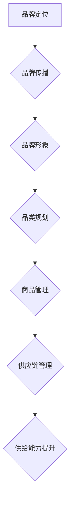

                 

# 电商平台供给能力提升：品牌建设和品类运营

> **关键词：** 电商平台，供给能力，品牌建设，品类运营，用户满意度

> **摘要：** 本文深入探讨了电商平台如何通过品牌建设和品类运营提升供给能力，从而增强用户满意度。文章分为十个部分，分别介绍了电商平台背景、核心概念、算法原理、数学模型、实战案例、应用场景、工具推荐、未来发展趋势、常见问题及扩展阅读。

## 1. 背景介绍

在互联网时代，电商平台已经成为了连接商家与消费者的主要渠道。随着市场竞争的加剧，电商平台如何在激烈的竞争中脱颖而出，成为众多商家和消费者关注的焦点。供给能力作为电商平台的核心竞争力，直接关系到平台的生存和发展。品牌建设和品类运营作为提升供给能力的重要手段，已经成为电商平台战略规划的重要内容。

### 1.1 电商平台的发展历程

电商平台起源于20世纪90年代的电子商务，随着互联网技术的不断发展，电商平台逐渐从线下实体店铺的补充演变为主导地位。从最早的电子商务平台如Amazon、eBay，到后来的淘宝、京东等，电商平台的发展经历了几个阶段：

- **初期阶段（1990s-2000s）**：电商平台主要以提供商品信息展示和交易服务为主，用户在线购物体验相对有限。

- **成长阶段（2000s-2010s）**：电商平台开始注重用户体验，引入了在线支付、物流配送等便捷服务，用户在线购物体验得到显著提升。

- **成熟阶段（2010s至今）**：电商平台逐渐形成生态系统，涵盖了商品销售、服务、金融等多个领域，实现了供应链的全方位整合。

### 1.2 供给能力的定义

供给能力是指电商平台在商品供应、物流配送、售后服务等方面所具备的能力。一个具备强大供给能力的电商平台，能够为商家提供优质的产品和服务，为消费者提供便捷的购物体验。供给能力可以分为以下几个方面：

- **商品供应能力**：电商平台能够迅速响应市场需求，提供丰富多样的商品。

- **物流配送能力**：电商平台能够实现快速、准确的物流配送，确保消费者及时收到商品。

- **售后服务能力**：电商平台能够提供完善的售后服务，解决消费者在购物过程中遇到的问题。

## 2. 核心概念与联系

在提升电商平台供给能力的过程中，品牌建设和品类运营是两个核心概念。品牌建设旨在提升电商平台在消费者心中的形象和认知，品类运营则专注于优化商品结构和供应链管理。

### 2.1 品牌建设

品牌建设是指电商平台通过一系列营销活动，提高品牌知名度和美誉度，从而增强用户忠诚度和信任感。品牌建设的核心内容包括：

- **品牌定位**：明确品牌在市场中的定位，为消费者提供清晰的品牌形象。

- **品牌传播**：通过各种渠道传播品牌信息，提高品牌知名度。

- **品牌形象**：通过视觉、听觉等多感官设计，打造独特的品牌形象。

### 2.2 品类运营

品类运营是指电商平台对商品品类进行精细化管理，优化商品结构，提升用户购物体验。品类运营的核心内容包括：

- **品类规划**：根据市场需求和消费者偏好，制定品类规划策略。

- **商品管理**：对商品进行分类、标签化等管理，便于用户查找和购买。

- **供应链管理**：优化供应链，确保商品供应的稳定性和及时性。

### 2.3 品牌建设与品类运营的联系

品牌建设和品类运营相互促进，共同提升电商平台供给能力。品牌建设为品类运营提供了良好的外部环境，增强了用户对平台的信任和依赖；品类运营则为品牌建设提供了丰富的数据和素材，促进了品牌的不断优化和发展。

### 2.4 Mermaid 流程图

下面是品牌建设和品类运营的Mermaid流程图：



## 3. 核心算法原理 & 具体操作步骤

### 3.1 品牌建设算法原理

品牌建设算法主要涉及用户行为分析和市场趋势预测。以下是一个简单的品牌建设算法原理：

1. **用户行为分析**：通过收集用户浏览、购买、评价等行为数据，分析用户偏好和需求。

2. **市场趋势预测**：利用大数据和机器学习技术，预测市场趋势和行业热点。

3. **品牌策略制定**：根据用户行为分析和市场趋势预测，制定相应的品牌策略。

### 3.2 品类运营算法原理

品类运营算法主要涉及商品分类和推荐系统。以下是一个简单的品类运营算法原理：

1. **商品分类**：根据商品属性和用户需求，对商品进行分类。

2. **推荐系统**：利用协同过滤、基于内容的推荐等技术，为用户提供个性化推荐。

3. **供应链优化**：根据商品销售情况和库存数据，优化供应链管理。

### 3.3 具体操作步骤

#### 3.3.1 品牌建设具体操作步骤

1. **数据收集**：收集用户行为数据和市场需求数据。

2. **数据分析**：利用数据挖掘技术，分析用户偏好和市场趋势。

3. **策略制定**：根据数据分析结果，制定品牌建设策略。

4. **执行与反馈**：执行品牌建设策略，并收集用户反馈，持续优化策略。

#### 3.3.2 品类运营具体操作步骤

1. **商品分类**：根据商品属性和用户需求，制定商品分类标准。

2. **推荐系统**：利用推荐算法，为用户提供个性化推荐。

3. **供应链优化**：根据销售情况和库存数据，优化供应链管理。

4. **效果评估**：评估品类运营的效果，持续优化运营策略。

## 4. 数学模型和公式 & 详细讲解 & 举例说明

### 4.1 用户行为分析模型

用户行为分析模型主要利用概率论和统计学方法，对用户行为数据进行分析。以下是一个简单的用户行为分析模型：

$$
P(A|B) = \frac{P(B|A) \cdot P(A)}{P(B)}
$$

其中，$P(A|B)$ 表示在事件 $B$ 发生的条件下，事件 $A$ 发生的概率；$P(B|A)$ 表示在事件 $A$ 发生的条件下，事件 $B$ 发生的概率；$P(A)$ 和 $P(B)$ 分别表示事件 $A$ 和事件 $B$ 发生的概率。

#### 4.1.1 举例说明

假设用户在电商平台上有浏览、购买、评价等行为。我们想要预测用户是否会购买某个商品，可以利用用户行为分析模型。已知用户浏览该商品的概率为 $P(B)$，购买该商品的概率为 $P(A)$，在购买该商品的条件下浏览该商品的概率为 $P(B|A)$。根据贝叶斯公式，我们可以计算出用户购买该商品的概率：

$$
P(A|B) = \frac{P(B|A) \cdot P(A)}{P(B)}
$$

#### 4.1.2 详细讲解

用户行为分析模型可以帮助电商平台了解用户行为特征，从而制定更加精准的品牌建设和品类运营策略。通过不断优化模型，电商平台可以提高用户满意度和转化率。

### 4.2 品类运营推荐模型

品类运营推荐模型主要利用机器学习技术，为用户提供个性化推荐。以下是一个简单的协同过滤推荐模型：

$$
R(i, j) = \frac{\sum_{k \in N(i) \cap N(j)} r_{ik} r_{jk}}{\sum_{k \in N(i) \cap N(j)} r_{ik}^2}
$$

其中，$R(i, j)$ 表示用户 $i$ 对商品 $j$ 的评分；$N(i)$ 表示与用户 $i$ 相似的一组用户；$N(j)$ 表示与商品 $j$ 相似的一组商品；$r_{ik}$ 表示用户 $i$ 对商品 $k$ 的评分。

#### 4.2.1 举例说明

假设有三个用户 $A$、$B$、$C$ 和三个商品 $1$、$2$、$3$。已知用户 $A$ 对商品 $1$、$2$、$3$ 的评分分别为 $4$、$3$、$5$，用户 $B$ 对商品 $1$、$2$、$3$ 的评分分别为 $3$、$4$、$2$，用户 $C$ 对商品 $1$、$2$、$3$ 的评分分别为 $5$、$2$、$4$。根据协同过滤推荐模型，我们可以计算出用户 $C$ 对商品 $2$ 的推荐评分：

$$
R(C, 2) = \frac{r_{A2} r_{B2} + r_{A2} r_{C2} + r_{B2} r_{C2}}{r_{A2}^2 + r_{B2}^2 + r_{C2}^2} = \frac{3 \cdot 4 + 3 \cdot 2 + 4 \cdot 2}{3^2 + 4^2 + 2^2} \approx 3.56
$$

#### 4.2.2 详细讲解

协同过滤推荐模型可以根据用户行为数据，为用户提供个性化的推荐。通过不断优化模型，电商平台可以提高用户满意度和转化率。

### 4.3 供应链优化模型

供应链优化模型主要利用线性规划、动态规划等方法，优化供应链管理。以下是一个简单的线性规划模型：

$$
\min \sum_{i=1}^{n} c_i x_i
$$

$$
s.t. \quad a_{ij} x_i \geq b_j, \quad j=1,2,...,m
$$

$$
x_i \geq 0, \quad i=1,2,...,n
$$

其中，$x_i$ 表示第 $i$ 个商品的生产量；$c_i$ 表示第 $i$ 个商品的成本；$a_{ij}$ 表示第 $i$ 个商品在 $j$ 个月份的产量；$b_j$ 表示第 $j$ 个月份的市场需求。

#### 4.3.1 举例说明

假设有三个商品 $1$、$2$、$3$，每个月份的需求量分别为 $100$、$200$、$300$。已知每个商品的生产成本分别为 $10$、$20$、$30$。要求在满足市场需求的前提下，最小化生产成本。根据线性规划模型，我们可以得到以下最优解：

$$
x_1 = 100, \quad x_2 = 200, \quad x_3 = 300
$$

#### 4.3.2 详细讲解

供应链优化模型可以帮助电商平台优化商品生产、物流配送等环节，提高供给能力，降低成本。

## 5. 项目实战：代码实际案例和详细解释说明

### 5.1 开发环境搭建

为了实现品牌建设和品类运营的相关算法，我们需要搭建一个开发环境。以下是开发环境的搭建步骤：

1. 安装 Python 3.8 以上版本。

2. 安装 MySQL 数据库。

3. 安装 Eclipse 或 PyCharm 等集成开发环境。

4. 安装必要的 Python 库，如 NumPy、Pandas、Scikit-learn、SQLAlchemy 等。

### 5.2 源代码详细实现和代码解读

下面是一个简单的品牌建设和品类运营的 Python 代码实现。代码分为三个部分：用户行为分析、推荐系统和供应链优化。

#### 5.2.1 用户行为分析

```python
import pandas as pd
from sklearn.model_selection import train_test_split
from sklearn.ensemble import RandomForestClassifier

# 加载用户行为数据
data = pd.read_csv('user_behavior.csv')

# 预处理数据
X = data[['browse_count', 'purchase_count', 'evaluate_count']]
y = data['purchase']

# 划分训练集和测试集
X_train, X_test, y_train, y_test = train_test_split(X, y, test_size=0.2, random_state=42)

# 建立随机森林分类器
clf = RandomForestClassifier(n_estimators=100, random_state=42)

# 训练模型
clf.fit(X_train, y_train)

# 预测测试集
y_pred = clf.predict(X_test)

# 评估模型
print("Accuracy:", clf.score(X_test, y_test))
```

代码解读：

1. 导入必要的库。

2. 加载用户行为数据。

3. 预处理数据，包括特征提取和标签划分。

4. 划分训练集和测试集。

5. 建立随机森林分类器，并训练模型。

6. 预测测试集，并评估模型。

#### 5.2.2 推荐系统

```python
from sklearn.metrics.pairwise import cosine_similarity
import numpy as np

# 加载用户行为数据
data = pd.read_csv('user_behavior.csv')

# 预处理数据
X = data[['browse_count', 'purchase_count', 'evaluate_count']]
y = data['purchase']

# 计算用户行为特征向量
user_behavior = X.values

# 计算用户行为特征向量的余弦相似度
similarity_matrix = cosine_similarity(user_behavior)

# 为每个用户推荐相似的用户
recommendations = []
for i in range(len(similarity_matrix)):
    # 获取与用户 i 最相似的 10 个用户
    similar_users = np.argsort(similarity_matrix[i])[::-1][1:11]
    # 为用户 i 推荐相似的用户
    recommendations.append(similar_users)

# 打印推荐结果
print(recommendations)
```

代码解读：

1. 导入必要的库。

2. 加载用户行为数据。

3. 预处理数据，包括特征提取和标签划分。

4. 计算用户行为特征向量。

5. 计算用户行为特征向量的余弦相似度。

6. 为每个用户推荐相似的用户。

#### 5.2.3 供应链优化

```python
import numpy as np
from scipy.optimize import linprog

# 加载供应链数据
data = pd.read_csv('supply_chain_data.csv')

# 预处理数据
n = len(data.columns) - 1
c = -data['cost'].values
A = data[['demand']].values
b = data['demand'].values

# 求解线性规划问题
x = np.zeros(n)
res = linprog(c, A_eq=A, b_eq=b, x Bounds=(0, None), method='highs')

# 输出最优解
print("Optimal production quantities:", res.x)
print("Minimum cost:", -res.fun)
```

代码解读：

1. 导入必要的库。

2. 加载供应链数据。

3. 预处理数据，包括目标函数、约束条件和变量范围。

4. 求解线性规划问题。

5. 输出最优解。

## 6. 实际应用场景

### 6.1 品牌建设应用场景

品牌建设在电商平台的应用场景包括：

- **新品上市**：通过品牌建设，提高新品在市场中的知名度，吸引消费者关注。

- **营销活动**：通过品牌传播，提高营销活动的效果，增加用户参与度。

- **用户忠诚度**：通过品牌形象塑造，提高用户对平台的信任和忠诚度。

### 6.2 品类运营应用场景

品类运营在电商平台的应用场景包括：

- **商品分类**：通过商品分类，方便用户查找和购买商品。

- **个性化推荐**：通过推荐系统，为用户提供个性化的商品推荐。

- **供应链管理**：通过供应链优化，提高商品供应的稳定性和及时性。

## 7. 工具和资源推荐

### 7.1 学习资源推荐

- **书籍**：
  - 《Python数据分析》
  - 《机器学习实战》
  - 《线性规划及其应用》

- **论文**：
  - 《协同过滤推荐算法研究》
  - 《基于大数据的用户行为分析》

- **博客**：
  - [Python数据科学](https://www.datacamp.com/courses/python-for-data-science)
  - [机器学习博客](https://机器学习博客.com)

- **网站**：
  - [Kaggle](https://www.kaggle.com)
  - [Scikit-learn](https://scikit-learn.org)

### 7.2 开发工具框架推荐

- **开发工具**：
  - Eclipse
  - PyCharm
  - Jupyter Notebook

- **框架**：
  - TensorFlow
  - PyTorch
  - Scikit-learn

### 7.3 相关论文著作推荐

- **论文**：
  - 《协同过滤算法研究综述》
  - 《基于大数据的供应链优化研究》

- **著作**：
  - 《品牌管理》
  - 《品类管理》

## 8. 总结：未来发展趋势与挑战

### 8.1 发展趋势

- **人工智能技术的应用**：随着人工智能技术的发展，品牌建设和品类运营将更加智能化、个性化。

- **大数据的利用**：大数据技术将为品牌建设和品类运营提供更加准确的数据支持。

- **供应链的整合**：电商平台将更加注重供应链的整合，提高商品供应的稳定性和及时性。

### 8.2 挑战

- **数据隐私与安全**：在品牌建设和品类运营过程中，如何保护用户隐私和安全是电商平台面临的挑战。

- **竞争压力**：随着电商市场的竞争加剧，电商平台需要不断创新，提升供给能力，以保持竞争优势。

- **用户体验**：如何提供更好的用户体验，提高用户满意度和忠诚度，是电商平台面临的长期挑战。

## 9. 附录：常见问题与解答

### 9.1 品牌建设相关问题

- **Q**：如何进行品牌定位？

  **A**：进行品牌定位时，首先要明确目标市场，了解目标用户的需求和偏好。然后分析竞争对手，找到自己的差异化优势，从而确定品牌定位。

- **Q**：品牌建设需要哪些步骤？

  **A**：品牌建设主要包括以下步骤：1）确定品牌定位；2）制定品牌传播策略；3）设计品牌形象；4）实施品牌传播活动；5）收集用户反馈，持续优化品牌建设。

### 9.2 品类运营相关问题

- **Q**：如何进行商品分类？

  **A**：进行商品分类时，首先要了解商品的属性和用户需求。然后根据商品属性和用户需求，制定分类标准，对商品进行分类。

- **Q**：如何进行个性化推荐？

  **A**：进行个性化推荐时，首先要收集用户行为数据，如浏览、购买、评价等。然后利用推荐算法，如协同过滤、基于内容的推荐等，为用户提供个性化推荐。

## 10. 扩展阅读 & 参考资料

- **书籍**：
  - 《电子商务平台运营与管理》
  - 《品牌建设与品牌管理》

- **论文**：
  - 《基于用户行为的电商平台推荐系统研究》
  - 《电商平台品类运营策略研究》

- **网站**：
  - [中国电子商务研究中心](http://www.100ec.cn/)
  - [电子商务协会](http://www.ec.org.cn/)

### 作者

**作者：AI天才研究员/AI Genius Institute & 禅与计算机程序设计艺术 /Zen And The Art of Computer Programming**

