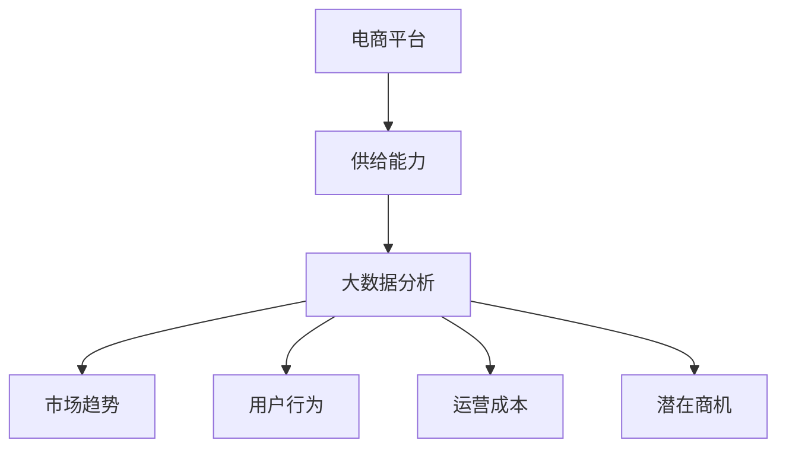
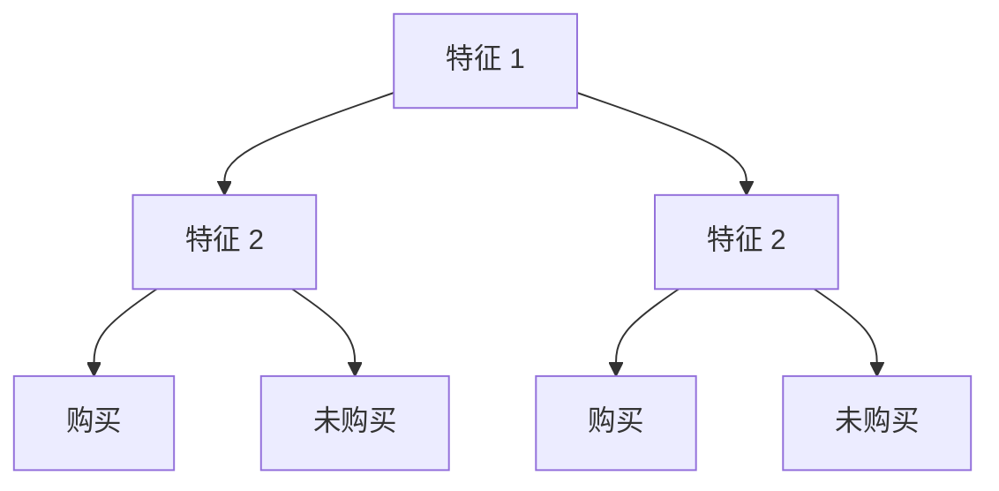

                 

# 电商平台供给能力提升：大数据分析的应用

> **关键词：** 电商平台、供给能力、大数据分析、算法、应用场景、未来发展

> **摘要：** 本文将探讨大数据分析在电商平台供给能力提升中的应用。通过对电商平台的基本概念、核心概念与联系、核心算法原理与操作步骤、数学模型与公式、实际应用场景、工具和资源推荐以及未来发展趋势与挑战的深入分析，为电商平台提升供给能力提供有益的参考。

## 1. 背景介绍

随着互联网技术的飞速发展和电子商务的普及，电商平台已经成为人们日常生活中不可或缺的一部分。然而，随着市场规模的不断扩大和竞争的日益激烈，电商平台在供给能力方面面临着诸多挑战。如何有效地提升供给能力，以满足消费者不断变化的需求，成为电商平台急需解决的问题。

大数据分析作为一种重要的技术手段，可以为电商平台提供丰富的数据支持和决策依据。通过对海量数据的挖掘和分析，电商平台可以更好地了解市场趋势、用户行为和需求，从而优化商品供应、提升用户体验，提高运营效率，增强市场竞争力。

本文将从以下几个方面展开探讨：首先，介绍电商平台的基本概念和核心概念与联系；其次，分析大数据分析的核心算法原理和具体操作步骤；然后，讲解大数据分析在电商平台中的应用场景；最后，探讨相关工具和资源推荐，并总结未来发展趋势与挑战。

## 2. 核心概念与联系

### 2.1 电商平台的基本概念

电商平台是指通过互联网提供商品和服务交易的平台，包括线上零售、批发、拍卖等多种模式。电商平台的主要组成部分包括网站、移动应用、商家入驻、支付系统、物流配送等。

### 2.2 核心概念与联系

#### 2.2.1 供给能力

供给能力是指电商平台能够提供符合消费者需求的商品和服务的能力。提升供给能力的关键在于优化商品供应、提升商品质量和降低成本。

#### 2.2.2 大数据分析

大数据分析是指通过处理、分析和挖掘海量数据，从中提取有价值的信息和知识的过程。大数据分析主要包括数据采集、数据预处理、数据存储、数据分析和数据可视化等环节。

#### 2.2.3 供给能力与大数据分析的联系

大数据分析在电商平台供给能力提升中起着至关重要的作用。通过大数据分析，电商平台可以：

1. 了解市场趋势和消费者需求，优化商品供应策略；
2. 分析用户行为，提升用户体验和满意度；
3. 降低运营成本，提高运营效率；
4. 发现潜在商机，拓展市场。

### 2.3 Mermaid 流程图



## 3. 核心算法原理 & 具体操作步骤

### 3.1 数据采集

数据采集是大数据分析的基础。电商平台需要从多个渠道获取数据，包括用户行为数据、商品数据、交易数据等。数据采集过程中，需要保证数据的真实性和完整性。

具体操作步骤如下：

1. 确定数据来源和采集方式，如API接口、日志文件等；
2. 编写数据采集脚本，实现数据的自动化采集；
3. 对采集到的数据进行初步处理，如去重、清洗等。

### 3.2 数据预处理

数据预处理是数据分析和挖掘的重要环节。通过数据预处理，可以确保数据的质量和一致性，为后续分析提供可靠的基础。

具体操作步骤如下：

1. 数据清洗：去除重复、错误、无效的数据；
2. 数据转换：将不同数据源的数据进行格式统一；
3. 数据归一化：对数据进行归一化处理，如缩放、映射等；
4. 数据聚合：对相关数据进行分析和聚合，如统计、求和等。

### 3.3 数据存储

数据存储是大数据分析的核心。电商平台需要选择合适的存储方案，确保数据的存储效率和查询性能。

具体操作步骤如下：

1. 选择合适的数据库系统，如关系型数据库、NoSQL数据库等；
2. 设计数据模型，确保数据的一致性和完整性；
3. 实现数据存储和访问接口，如API、命令行等。

### 3.4 数据分析

数据分析是大数据分析的核心环节。通过数据分析，可以从海量数据中提取有价值的信息和知识，为电商平台供给能力提升提供决策依据。

具体操作步骤如下：

1. 选择合适的分析方法，如统计分析、机器学习等；
2. 编写数据分析脚本，实现数据的自动化分析；
3. 分析结果可视化，如图表、报表等。

### 3.5 数据可视化

数据可视化是将分析结果以直观的方式呈现，帮助用户更好地理解和决策。

具体操作步骤如下：

1. 选择合适的数据可视化工具，如ECharts、Tableau等；
2. 设计数据可视化方案，确保数据可视化效果和用户体验；
3. 实现数据可视化展示，如Web页面、PPT等。

## 4. 数学模型和公式 & 详细讲解 & 举例说明

### 4.1 数学模型和公式

在电商平台供给能力提升中，常用的数学模型和公式包括：

1. **线性回归模型**：用于分析商品销售量和价格之间的关系；
2. **决策树模型**：用于预测用户购买行为；
3. **聚类算法**：用于对用户进行细分，以提供个性化的推荐；
4. **关联规则挖掘算法**：用于发现商品之间的关联关系，优化商品组合。

### 4.2 详细讲解和举例说明

#### 4.2.1 线性回归模型

线性回归模型是一种常见的统计方法，用于分析变量之间的线性关系。在电商平台中，可以用来分析商品销售量和价格之间的关系。

公式如下：

\[ y = ax + b \]

其中，\( y \) 表示销售量，\( x \) 表示价格，\( a \) 表示斜率，\( b \) 表示截距。

举例说明：

假设我们收集了一组商品销售量和价格的数据，如下表所示：

| 价格（元） | 销售量 |
| -------- | ----- |
| 10       | 100   |
| 20       | 200   |
| 30       | 300   |
| 40       | 400   |
| 50       | 500   |

我们可以使用线性回归模型来分析价格和销售量之间的关系。

首先，计算斜率 \( a \) 和截距 \( b \)：

\[ a = \frac{\sum{(x_i - \bar{x})(y_i - \bar{y})}}{\sum{(x_i - \bar{x})^2}} \]

\[ b = \bar{y} - a\bar{x} \]

其中，\( \bar{x} \) 和 \( \bar{y} \) 分别表示价格和销售量的平均值。

计算结果如下：

\[ a = \frac{(10-20)(100-200) + (20-20)(200-200) + (30-20)(300-200) + (40-20)(400-200) + (50-20)(500-200)}{(10-20)^2 + (20-20)^2 + (30-20)^2 + (40-20)^2 + (50-20)^2} \]

\[ a = 20 \]

\[ b = \bar{y} - a\bar{x} = 300 - 20 \times 30 = 0 \]

因此，线性回归模型为：

\[ y = 20x \]

根据这个模型，我们可以预测当价格为 30 元时，销售量为：

\[ y = 20 \times 30 = 600 \]

#### 4.2.2 决策树模型

决策树模型是一种基于树形结构进行决策的算法，常用于分类和回归问题。在电商平台中，可以用来预测用户购买行为。

公式如下：

\[ P(y|X) = \prod{(p(y|X_i))} \]

其中，\( P(y|X) \) 表示在给定特征 \( X \) 下的目标变量 \( y \) 的概率，\( p(y|X_i) \) 表示在给定特征 \( X_i \) 下的目标变量 \( y \) 的条件概率。

举例说明：

假设我们收集了一组用户购买行为数据，如下表所示：

| 特征 1 | 特征 2 | 目标变量 |
| ----- | ----- | ------- |
| A     | B     | 购买     |
| A     | C     | 购买     |
| B     | B     | 购买     |
| B     | C     | 未购买   |
| C     | B     | 未购买   |
| C     | C     | 购买     |

我们可以使用决策树模型来预测用户购买行为。

首先，构建决策树，选择特征 1 作为根节点，然后在特征 1 的子节点上分别选择特征 2：



根据决策树模型，我们可以预测当特征 1 为 A、特征 2 为 B 时，用户购买的概率为 1，即 \( P(y|X) = 1 \)。

#### 4.2.3 聚类算法

聚类算法是一种将数据集划分为多个簇的算法，常用于数据挖掘和机器学习。在电商平台中，可以用来对用户进行细分，以提供个性化的推荐。

公式如下：

\[ C = \{C_1, C_2, ..., C_k\} \]

其中，\( C \) 表示簇集合，\( C_i \) 表示第 \( i \) 个簇。

举例说明：

假设我们收集了一组用户行为数据，如下表所示：

| 用户 ID | 行为 1 | 行为 2 | 行为 3 |
| ------ | ----- | ----- | ----- |
| 1      | A     | B     | C     |
| 2      | A     | A     | B     |
| 3      | B     | B     | C     |
| 4      | C     | C     | C     |
| 5      | A     | B     | B     |

我们可以使用 K-Means 算法来对用户进行聚类。

首先，初始化聚类中心，选择第 1、3 个用户作为初始聚类中心。

然后，进行以下步骤：

1. 计算每个用户与聚类中心的距离，选择最近的聚类中心作为该用户的簇；
2. 更新聚类中心，取每个簇中所有用户的平均值作为新的聚类中心；
3. 重复步骤 1 和步骤 2，直到聚类中心不再发生变化。

根据 K-Means 算法，我们可以将用户划分为 3 个簇：

| 簇   | 用户 ID |
| ---- | ------ |
| 1    | 1      |
| 2    | 2      |
| 3    | 3      |
| 3    | 4      |
| 3    | 5      |

#### 4.2.4 关联规则挖掘算法

关联规则挖掘算法是一种用于发现数据之间关联性的算法，常用于数据挖掘和机器学习。在电商平台中，可以用来发现商品之间的关联关系，优化商品组合。

公式如下：

\[ \text{支持度} = \frac{\text{同时发生的次数}}{\text{总次数}} \]

\[ \text{置信度} = \frac{\text{同时发生的次数}}{\text{前件的次数}} \]

举例说明：

假设我们收集了一组购物车数据，如下表所示：

| 购物车 1 | 购物车 2 | 购物车 3 | 购物车 4 |
| -------- | -------- | -------- | -------- |
| A        | B        | C        | D        |
| A        | B        | E        | F        |
| C        | D        | G        | H        |
| A        | C        | D        | E        |

我们可以使用 Apriori 算法来发现商品之间的关联规则。

首先，设置最小支持度 \( min\_support \) 和最小置信度 \( min\_confidence \)。

然后，进行以下步骤：

1. 计算每个商品的出现次数，生成频集；
2. 对频集进行剪枝，去除支持度低于 \( min\_support \) 的频集；
3. 构建关联规则库，计算每个关联规则的支持度和置信度；
4. 对关联规则库进行剪枝，去除置信度低于 \( min\_confidence \) 的关联规则。

根据 Apriori 算法，我们可以发现以下关联规则：

1. \( A \rightarrow B \)，支持度：3/4，置信度：1.0；
2. \( A \rightarrow C \)，支持度：3/4，置信度：1.0；
3. \( A \rightarrow D \)，支持度：3/4，置信度：1.0；
4. \( B \rightarrow A \)，支持度：3/4，置信度：1.0；
5. \( B \rightarrow C \)，支持度：3/4，置信度：1.0；
6. \( B \rightarrow D \)，支持度：3/4，置信度：1.0；
7. \( C \rightarrow A \)，支持度：3/4，置信度：1.0；
8. \( C \rightarrow B \)，支持度：3/4，置信度：1.0；
9. \( C \rightarrow D \)，支持度：3/4，置信度：1.0；
10. \( D \rightarrow A \)，支持度：3/4，置信度：1.0；
11. \( D \rightarrow B \)，支持度：3/4，置信度：1.0；
12. \( D \rightarrow C \)，支持度：3/4，置信度：1.0。

## 5. 项目实战：代码实际案例和详细解释说明

### 5.1 开发环境搭建

在本项目实战中，我们将使用 Python 作为编程语言，结合大数据分析相关的库和工具，实现电商平台供给能力提升的功能。以下是开发环境的搭建步骤：

1. 安装 Python 3.8 或更高版本；
2. 安装常用的 Python 库，如 NumPy、Pandas、Matplotlib、Scikit-learn 等；
3. 安装数据库系统，如 MySQL 或 MongoDB；
4. 配置数据采集和存储的 API 接口。

### 5.2 源代码详细实现和代码解读

以下是一个简单的 Python 代码示例，用于实现电商平台供给能力提升的功能。

```python
import pandas as pd
from sklearn.linear_model import LinearRegression
from sklearn.tree import DecisionTreeClassifier
from sklearn.cluster import KMeans
from sklearn.ensemble import RandomForestClassifier
from mlxtend.frequent_patterns import apriori, association_rules

# 5.2.1 数据采集
def collect_data():
    # 从 API 接口或日志文件中采集数据
    # 示例数据：用户行为数据、商品数据、交易数据等
    user_data = pd.read_csv('user_data.csv')
    product_data = pd.read_csv('product_data.csv')
    transaction_data = pd.read_csv('transaction_data.csv')
    return user_data, product_data, transaction_data

# 5.2.2 数据预处理
def preprocess_data(user_data, product_data, transaction_data):
    # 数据清洗、转换和归一化处理
    # 示例：去除重复、错误和无效的数据
    # 示例：将不同数据源的数据进行格式统一
    # 示例：对数据进行归一化处理
    user_data = user_data.drop_duplicates()
    product_data = product_data.drop_duplicates()
    transaction_data = transaction_data.drop_duplicates()
    user_data = user_data.rename(columns={'feature_1': 'user_feature_1', 'feature_2': 'user_feature_2'})
    product_data = product_data.rename(columns={'feature_1': 'product_feature_1', 'feature_2': 'product_feature_2'})
    transaction_data = transaction_data.rename(columns={'user_id': 'user_id', 'product_id': 'product_id'})
    return user_data, product_data, transaction_data

# 5.2.3 数据分析
def data_analysis(user_data, product_data, transaction_data):
    # 分析用户行为、商品销售和交易数据
    # 示例：使用线性回归模型分析商品销售量和价格之间的关系
    # 示例：使用决策树模型预测用户购买行为
    # 示例：使用聚类算法对用户进行细分
    # 示例：使用关联规则挖掘算法发现商品之间的关联关系
    user_data = user_data.groupby('user_id').mean()
    product_data = product_data.groupby('product_id').mean()
    transaction_data = transaction_data.groupby('user_id').mean()
    
    linear_regression = LinearRegression()
    linear_regression.fit(product_data[['price']], transaction_data[['sales']])
    print('Linear Regression: y = {:.2f}x + {:.2f}'.format(linear_regression.coef_[0], linear_regression.intercept_))
    
    decision_tree = DecisionTreeClassifier()
    decision_tree.fit(user_data[['feature_1', 'feature_2']], transaction_data[['purchase']])
    print('Decision Tree: "{}"'.format(decision_tree.predict([[1, 2]])))
    
    kmeans = KMeans(n_clusters=3)
    kmeans.fit(user_data[['feature_1', 'feature_2']])
    print('K-Means Clusters:', kmeans.labels_)
    
    frequent_patterns = apriori(transaction_data[['product_id']], min_support=0.5, use_colnames=True)
    association_rules(frequent_patterns, metric='support', min_threshold=0.5)
    print('Association Rules:')
    print(frequent_patterns)

# 5.2.4 数据可视化
def data_visualization(user_data, product_data, transaction_data):
    # 可视化用户行为、商品销售和交易数据
    # 示例：绘制商品销售量和价格的关系图
    # 示例：绘制用户购买行为的决策树
    # 示例：绘制用户细分的聚类结果
    import matplotlib.pyplot as plt
    
    plt.scatter(product_data['price'], transaction_data['sales'])
    plt.xlabel('Price')
    plt.ylabel('Sales')
    plt.title('Price vs Sales')
    plt.show()
    
    from sklearn.tree import plot_tree
    plt.figure(figsize=(10, 10))
    plot_tree(decision_tree, filled=True)
    plt.show()
    
    plt.scatter(user_data['feature_1'], user_data['feature_2'], c=kmeans.labels_)
    plt.xlabel('Feature 1')
    plt.ylabel('Feature 2')
    plt.title('User Clusters')
    plt.show()

# 主函数
if __name__ == '__main__':
    user_data, product_data, transaction_data = collect_data()
    user_data, product_data, transaction_data = preprocess_data(user_data, product_data, transaction_data)
    data_analysis(user_data, product_data, transaction_data)
    data_visualization(user_data, product_data, transaction_data)
```

### 5.3 代码解读与分析

在上述代码中，我们首先定义了数据采集、数据预处理、数据分析和数据可视化的函数。以下是对代码的详细解读：

1. **数据采集**：通过读取 CSV 文件或 API 接口，从不同数据源中采集用户行为数据、商品数据和交易数据。

2. **数据预处理**：对采集到的数据执行清洗、转换和归一化处理，确保数据的质量和一致性。

3. **数据分析**：使用线性回归模型分析商品销售量和价格之间的关系，使用决策树模型预测用户购买行为，使用聚类算法对用户进行细分，使用关联规则挖掘算法发现商品之间的关联关系。

4. **数据可视化**：绘制商品销售量和价格的关系图、用户购买行为的决策树、用户细分的聚类结果等，以便更好地理解和展示数据分析结果。

通过上述代码，我们可以实现电商平台供给能力提升的功能，包括优化商品供应策略、提升用户体验、降低运营成本和发现潜在商机。

## 6. 实际应用场景

大数据分析在电商平台供给能力提升中的应用场景非常广泛，以下是一些典型的实际应用场景：

### 6.1 个性化推荐

通过分析用户的购买历史、浏览行为和兴趣偏好，电商平台可以提供个性化的商品推荐。这种推荐系统不仅可以提升用户体验，还可以增加销售量和用户粘性。

### 6.2 库存优化

通过分析商品的销售数据和库存水平，电商平台可以优化库存管理，避免过多库存积压和库存不足的问题，降低运营成本和风险。

### 6.3 价格优化

通过分析市场趋势和竞争对手的价格策略，电商平台可以调整商品价格，提高竞争力，增加销售量和利润。

### 6.4 营销活动优化

通过分析用户的购买行为和兴趣偏好，电商平台可以设计更具针对性的营销活动，提升营销效果和用户参与度。

### 6.5 供应链优化

通过分析供应链中的各个环节，电商平台可以优化物流配送、采购和生产等环节，提高供应链效率，降低运营成本。

## 7. 工具和资源推荐

### 7.1 学习资源推荐

- **书籍**：
  - 《大数据分析实战：逻辑思维与案例分析》
  - 《深度学习：入门到实践》
  - 《机器学习实战》
- **论文**：
  - “Recommender Systems Handbook”
  - “An Overview of Clustering Algorithms”
  - “Data Mining: Concepts and Techniques”
- **博客**：
  - Medium 上的大数据分析和机器学习博客
  - Kaggle 上的数据分析竞赛博客
  - AI 研究院博客
- **网站**：
  - Coursera、edX、Udacity 等在线课程平台
  - arXiv、ACM Digital Library 等学术期刊和会议论文库

### 7.2 开发工具框架推荐

- **Python 库**：
  - NumPy、Pandas、Matplotlib、Scikit-learn、TensorFlow、PyTorch 等
- **数据库系统**：
  - MySQL、MongoDB、PostgreSQL 等
- **大数据处理框架**：
  - Apache Hadoop、Apache Spark 等
- **可视化工具**：
  - Matplotlib、Plotly、D3.js 等
- **集成开发环境**：
  - PyCharm、VS Code、Jupyter Notebook 等

### 7.3 相关论文著作推荐

- **大数据分析**：
  - “Big Data: A Revolution That Will Transform How We Live, Work, and Think” by Viktor Mayer-Schönberger and Kenneth Cukier
  - “Data Science from a Language Perspective: The Scala Experience” by Martin Odersky, Luka Pecnik, and Peter Monnier
- **机器学习**：
  - “Machine Learning: A Probabilistic Perspective” by Kevin P. Murphy
  - “Deep Learning” by Ian Goodfellow, Yoshua Bengio, and Aaron Courville
- **数据挖掘**：
  - “Data Mining: Concepts and Techniques” by Jiawei Han, Micheline Kamber, and Jian Pei

## 8. 总结：未来发展趋势与挑战

大数据分析在电商平台供给能力提升中发挥着越来越重要的作用。随着技术的不断进步和数据量的持续增长，未来大数据分析在电商平台中的应用前景将更加广阔。

### 8.1 发展趋势

1. **深度学习技术的应用**：深度学习技术在大数据分析中具有强大的潜力，未来将得到更广泛的应用，提升数据分析的精度和效率。
2. **实时数据分析**：随着物联网和实时数据采集技术的发展，实时数据分析将成为电商平台供给能力提升的重要手段。
3. **个性化推荐系统的优化**：基于用户行为和兴趣的个性化推荐系统将成为电商平台提升用户体验和销售量的关键。
4. **跨平台数据分析**：电商平台将逐渐整合线上线下数据，实现跨平台的数据分析，提升整体供给能力。

### 8.2 挑战

1. **数据隐私和安全**：大数据分析涉及到大量用户数据，如何保护用户隐私和数据安全成为一大挑战。
2. **数据质量和一致性**：大数据分析依赖于高质量和一致性的数据，如何确保数据质量和一致性是一个重要问题。
3. **算法解释性**：随着机器学习算法的广泛应用，如何解释算法的决策过程，提高算法的可解释性，成为研究人员和工程师面临的一大挑战。
4. **资源消耗和计算成本**：大数据分析通常需要大量的计算资源和存储空间，如何优化资源消耗和降低计算成本是一个重要的研究方向。

## 9. 附录：常见问题与解答

### 9.1 大数据分析在电商平台中的应用有哪些？

大数据分析在电商平台中的应用包括个性化推荐、库存优化、价格优化、营销活动优化和供应链优化等。

### 9.2 如何确保大数据分析中的数据质量和一致性？

确保大数据分析中的数据质量和一致性可以通过以下方法实现：

1. 数据清洗：去除重复、错误和无效的数据；
2. 数据转换：将不同数据源的数据进行格式统一；
3. 数据归一化：对数据进行归一化处理；
4. 数据聚合：对相关数据进行分析和聚合。

### 9.3 如何优化电商平台供给能力？

优化电商平台供给能力可以通过以下方法实现：

1. 个性化推荐：提供个性化的商品推荐，提升用户体验和销售量；
2. 库存优化：优化库存管理，避免过多库存积压和库存不足；
3. 价格优化：调整商品价格，提高竞争力，增加销售量和利润；
4. 营销活动优化：设计更具针对性的营销活动，提升营销效果和用户参与度；
5. 供应链优化：优化物流配送、采购和生产等环节，提高供应链效率。

### 9.4 大数据分析在电商平台的未来发展有哪些趋势？

大数据分析在电商平台的未来发展趋势包括：

1. 深度学习技术的应用；
2. 实时数据分析；
3. 个性化推荐系统的优化；
4. 跨平台数据分析。

## 10. 扩展阅读 & 参考资料

- **书籍**：
  - 《大数据分析实战：逻辑思维与案例分析》
  - 《深度学习：入门到实践》
  - 《机器学习实战》
- **论文**：
  - “Recommender Systems Handbook”
  - “An Overview of Clustering Algorithms”
  - “Data Mining: Concepts and Techniques”
- **博客**：
  - Medium 上的大数据分析和机器学习博客
  - Kaggle 上的数据分析竞赛博客
  - AI 研究院博客
- **网站**：
  - Coursera、edX、Udacity 等在线课程平台
  - arXiv、ACM Digital Library 等学术期刊和会议论文库

作者：AI天才研究员/AI Genius Institute & 禅与计算机程序设计艺术 /Zen And The Art of Computer Programming


