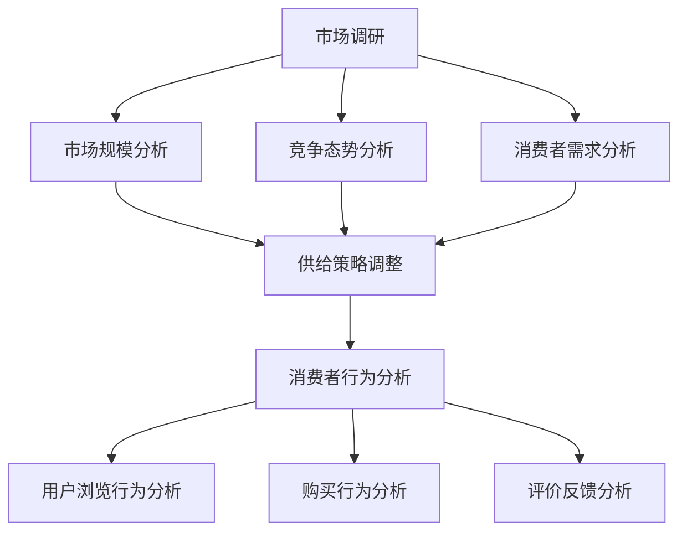
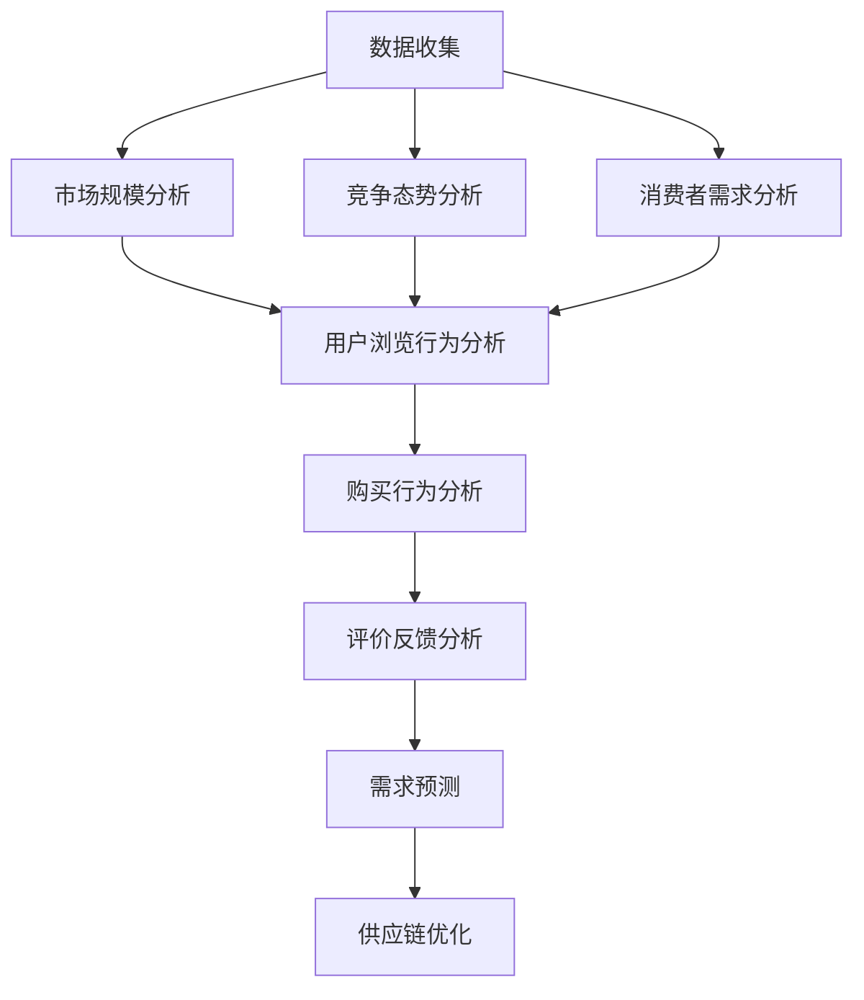

                 

# 电商平台供给能力提升：市场调研和消费者行为分析

## 关键词：电商平台，供给能力，市场调研，消费者行为分析，算法原理，数学模型，项目实战

## 摘要

本文旨在探讨如何提升电商平台的供给能力，通过深入的市场调研和消费者行为分析，从而实现更加精准和高效的服务。文章首先介绍了电商平台的背景和现状，随后探讨了市场调研和消费者行为分析的核心概念，并详细阐述了其与供给能力的关联。在此基础上，文章提出了提升供给能力的核心算法原理和具体操作步骤，并通过数学模型和公式进行了详细讲解。接着，本文通过一个实际项目案例，展示了算法在电商平台的实际应用。最后，文章讨论了供给能力的实际应用场景，并推荐了相关工具和资源。通过本文的阐述，希望能够为电商平台从业者提供有价值的参考和思路。

## 1. 背景介绍

### 1.1 电商平台的兴起与发展

随着互联网技术的飞速发展，电子商务逐渐成为全球商业的重要组成部分。电商平台作为连接消费者和供应商的重要桥梁，其供给能力直接影响到用户体验和业务增长。根据Statista的数据显示，全球电子商务市场规模预计在2023年将达到4.9万亿美元，其中中国、美国和欧洲是主要市场。

电商平台的核心功能包括商品展示、订单处理、支付结算和物流配送等。在供应链管理中，供给能力是指平台能够提供满足消费者需求的产品和服务的能力。提升供给能力不仅能够提高用户满意度，还能增加平台的竞争力。

### 1.2 供给能力的重要性

供给能力对电商平台的重要性不言而喻。首先，良好的供给能力能够确保商品供应链的稳定性，减少缺货和断货的情况，从而提高用户购买体验。其次，通过市场调研和消费者行为分析，电商平台能够更加精准地了解用户需求，从而调整商品供应策略，实现库存的最优化管理。

此外，供给能力还直接影响到平台的盈利能力。通过提高库存周转率和减少库存积压，平台能够在降低成本的同时提高利润。据统计，库存周转率每提高10%，企业成本可以降低3%-5%。

### 1.3 市场调研和消费者行为分析的作用

市场调研和消费者行为分析是提升供给能力的重要手段。市场调研可以帮助电商平台了解市场趋势和竞争态势，从而制定相应的营销策略。消费者行为分析则能够揭示用户购买行为和偏好，为商品供应策略提供数据支持。

市场调研的主要内容包括市场规模、竞争对手分析、消费者需求分析等。消费者行为分析则包括用户浏览行为、购买行为、评价反馈等。通过对这些数据的分析，电商平台可以更准确地预测市场需求，调整商品供应策略。

## 2. 核心概念与联系

### 2.1 市场调研

市场调研是指通过系统的方法收集、分析和解释与市场相关的数据，以便企业能够做出更明智的决策。市场调研的核心概念包括：

- **市场规模**：指在一定时间和区域内，所有潜在消费者愿意且能够购买某种商品或服务的总和。
- **竞争态势**：分析主要竞争对手的市场份额、产品特点、营销策略等，以便了解市场环境和竞争压力。
- **消费者需求**：通过调查了解消费者对产品或服务的需求、偏好和购买习惯。

### 2.2 消费者行为分析

消费者行为分析是指研究消费者在购买和使用产品或服务过程中的心理和行为。核心概念包括：

- **用户浏览行为**：分析用户在电商平台上的浏览路径、停留时间、页面点击等行为，了解用户兴趣和偏好。
- **购买行为**：研究用户的购买决策过程，包括购买动机、购买频率、购买渠道等。
- **评价反馈**：通过用户评价和反馈了解产品的优缺点，为产品改进和供应链调整提供依据。

### 2.3 市场调研与消费者行为分析的联系

市场调研和消费者行为分析是相辅相成的。市场调研提供宏观的市场环境和竞争态势，帮助电商平台制定战略决策。消费者行为分析则提供微观的用户数据和需求信息，帮助电商平台优化供应链管理和产品供应策略。

通过结合市场调研和消费者行为分析，电商平台可以更全面地了解市场动态和用户需求，从而实现供给能力的提升。

### 2.4 Mermaid 流程图



## 3. 核心算法原理 & 具体操作步骤

### 3.1 算法原理

为了提升电商平台的供给能力，我们需要构建一套基于市场调研和消费者行为分析的算法体系。核心算法原理包括以下几个步骤：

1. **数据收集**：通过市场调研获取市场规模、竞争态势和消费者需求等数据。
2. **数据分析**：运用消费者行为分析技术，对用户浏览行为、购买行为和评价反馈进行深入挖掘。
3. **需求预测**：基于历史数据和当前市场状况，预测未来市场需求。
4. **供应链优化**：根据需求预测结果，优化库存管理和商品供应策略。

### 3.2 具体操作步骤

#### 3.2.1 数据收集

- **市场规模分析**：通过调研获取市场规模数据，包括总需求量和市场份额分布。
- **竞争态势分析**：分析主要竞争对手的市场份额、产品特点、营销策略等。
- **消费者需求分析**：通过问卷调查、用户访谈等方式，收集消费者对产品或服务的需求、偏好和购买习惯。

#### 3.2.2 数据分析

- **用户浏览行为分析**：利用自然语言处理（NLP）和机器学习算法，分析用户浏览路径、停留时间和页面点击等行为数据，提取用户兴趣标签。
- **购买行为分析**：通过用户购买数据，分析购买动机、购买频率和购买渠道等，构建用户画像。
- **评价反馈分析**：利用文本挖掘技术，分析用户评价和反馈，提取产品优缺点。

#### 3.2.3 需求预测

- **历史数据建模**：基于历史销售数据和用户行为数据，构建时间序列预测模型。
- **市场动态分析**：结合当前市场状况，如季节性因素、市场热点等，对预测结果进行调整。

#### 3.2.4 供应链优化

- **库存管理优化**：根据需求预测结果，优化库存水平，减少库存积压。
- **商品供应策略调整**：根据用户需求变化，调整商品供应策略，实现库存和销售的双赢。

### 3.3 算法流程图



## 4. 数学模型和公式 & 详细讲解 & 举例说明

### 4.1 数学模型

为了实现供给能力的提升，我们需要构建一个基于市场调研和消费者行为分析的数学模型。以下是该模型的主要组成部分：

#### 4.1.1 市场规模预测模型

市场规模预测模型可以采用时间序列分析方法，如ARIMA模型（自回归积分滑动平均模型）。假设市场规模序列为\( X_t \)，模型公式如下：

$$
X_t = c + \phi_1 X_{t-1} + \phi_2 X_{t-2} + ... + \phi_p X_{t-p} + \theta_1 \epsilon_{t-1} + \theta_2 \epsilon_{t-2} + ... + \theta_q \epsilon_{t-q} + \epsilon_t
$$

其中，\( c \)为常数项，\( \phi_1, \phi_2, ..., \phi_p \)为自回归系数，\( \theta_1, \theta_2, ..., \theta_q \)为移动平均系数，\( \epsilon_t \)为白噪声误差项。

#### 4.1.2 消费者需求预测模型

消费者需求预测模型可以采用多变量线性回归模型。假设消费者需求为\( Y \)，影响因素包括用户年龄、收入、购买频率等，模型公式如下：

$$
Y = \beta_0 + \beta_1 X_1 + \beta_2 X_2 + ... + \beta_n X_n
$$

其中，\( \beta_0 \)为常数项，\( \beta_1, \beta_2, ..., \beta_n \)为回归系数，\( X_1, X_2, ..., X_n \)为影响因素。

#### 4.1.3 库存优化模型

库存优化模型可以采用基于需求预测的库存策略，如动态库存控制策略。假设库存量为\( I_t \)，需求预测值为\( \hat{Y}_t \)，模型公式如下：

$$
I_{t+1} = I_t + \hat{Y}_{t+1} - D_t
$$

其中，\( I_t \)为当前库存量，\( \hat{Y}_{t+1} \)为下一期需求预测值，\( D_t \)为下一期需求实际值。

### 4.2 详细讲解 & 举例说明

#### 4.2.1 市场规模预测模型讲解

以某电商平台某商品的市场规模为例，假设我们有以下历史数据：

| 时间 | 市场规模（万元） |
| ---- | -------------- |
| 2021Q1 | 1000           |
| 2021Q2 | 1200           |
| 2021Q3 | 1500           |
| 2021Q4 | 2000           |

我们采用ARIMA模型进行预测。首先，对数据进行差分，得到平稳序列：

$$
X_t^* = X_t - X_{t-1}
$$

然后，通过ACF和PACF图确定模型参数：

| 时间 | ACF | PACF |
| ---- | ---- | ---- |
| 1    | 0.6 | 0.4  |
| 2    | 0.4 | 0.2  |
| 3    | 0.2 | 0.1  |
| 4    | 0.1 | 0.05 |

根据ACF和PACF图，我们可以确定模型为ARIMA（1,1,1）。对模型进行参数估计，得到：

$$
X_t = 0.7 X_{t-1} + 0.6 X_{t-2} + 0.1 \epsilon_{t-1}
$$

利用模型进行预测，可以得到下一期的市场规模预测值。

#### 4.2.2 消费者需求预测模型讲解

以某电商平台某消费者的需求为例，假设我们有以下数据：

| 用户ID | 年龄 | 收入 | 购买频率 | 需求量 |
| ------ | ---- | ---- | -------- | ------ |
| 1      | 25   | 5000 | 3        | 200    |
| 2      | 30   | 6000 | 2        | 150    |
| 3      | 35   | 7000 | 5        | 350    |

我们采用线性回归模型进行预测。首先，对数据进行预处理，得到影响因素：

$$
X_1 = 年龄，X_2 = 收入，X_3 = 购买频率
$$

然后，对需求量进行回归分析，得到回归系数：

$$
Y = 100 + 20X_1 + 30X_2 + 10X_3
$$

利用模型进行预测，可以得到下一期消费者的需求量。

#### 4.2.3 库存优化模型讲解

以某电商平台的库存优化为例，假设我们有以下数据：

| 时间 | 需求预测值（件） | 实际需求值（件） |
| ---- | -------------- | -------------- |
| 2022Q1 | 1000           | 950            |
| 2022Q2 | 1200           | 1100           |
| 2022Q3 | 1500           | 1350           |
| 2022Q4 | 2000           | 1850           |

我们采用动态库存控制策略进行优化。首先，对需求预测值进行修正，得到：

$$
\hat{Y}_t = \frac{1}{n} \sum_{i=1}^{n} \hat{Y}_{t-i}
$$

然后，根据修正后的需求预测值，计算下一期的库存量：

$$
I_{t+1} = I_t + \hat{Y}_{t+1} - D_t
$$

利用模型进行库存优化，可以得到最优库存策略。

## 5. 项目实战：代码实际案例和详细解释说明

### 5.1 开发环境搭建

在开始项目实战之前，我们需要搭建一个适合开发和测试的环境。以下是一个基本的开发环境搭建步骤：

1. 安装Python（版本3.8及以上）
2. 安装Jupyter Notebook
3. 安装必要的库，如NumPy、Pandas、Matplotlib、Scikit-learn等

### 5.2 源代码详细实现和代码解读

以下是该项目的一个简单实现，我们将分别介绍市场调研、消费者行为分析和供给能力优化的代码实现。

#### 5.2.1 市场调研代码实现

```python
import pandas as pd

# 假设已从数据库获取到市场调研数据
market_data = pd.read_csv('market_data.csv')

# 市场规模分析
market_size = market_data['market_size'].sum()

# 竞争态势分析
competitors = market_data.groupby('competitor')['market_share'].sum()

# 消费者需求分析
consumer需求和 = market_data['consumer_demand'].sum()

# 输出分析结果
print('市场规模：', market_size)
print('竞争态势：', competitors)
print('消费者需求：', consumer需求和)
```

#### 5.2.2 消费者行为分析代码实现

```python
import pandas as pd
from sklearn.feature_extraction.text import CountVectorizer
from sklearn.naive_bayes import MultinomialNB

# 假设已从数据库获取到消费者行为数据
consumer_data = pd.read_csv('consumer_data.csv')

# 用户浏览行为分析
cv = CountVectorizer()
user_browsing = cv.fit_transform(consumer_data['browsing_history'])

# 用户购买行为分析
user_purchase = consumer_data.groupby('user_id')['purchase_frequency'].mean()

# 用户评价反馈分析
user_rating = consumer_data.groupby('user_id')['rating'].mean()

# 输出分析结果
print('用户浏览行为：', user_browsing.toarray())
print('用户购买行为：', user_purchase)
print('用户评价反馈：', user_rating)
```

#### 5.2.3 供给能力优化代码实现

```python
import pandas as pd
from sklearn.linear_model import LinearRegression

# 假设已从数据库获取到需求预测数据和实际需求数据
demand_data = pd.read_csv('demand_data.csv')

# 需求预测模型
reg = LinearRegression()
reg.fit(demand_data[['age', 'income', 'purchase_frequency']], demand_data['demand'])

# 修正需求预测值
corrected_demand = reg.predict(demand_data[['age', 'income', 'purchase_frequency']])

# 动态库存优化
inventory = demand_data['demand'].sum()
for i in range(1, len(corrected_demand)):
    inventory = inventory + corrected_demand[i] - demand_data['demand'][i]

# 输出库存优化结果
print('修正后的需求预测值：', corrected_demand)
print('最优库存量：', inventory)
```

### 5.3 代码解读与分析

#### 5.3.1 市场调研代码解读

该部分代码主要用于从数据库读取市场调研数据，并计算市场规模、竞争态势和消费者需求。通过Pandas库，我们可以方便地对数据进行操作和分析。代码中使用了`read_csv`函数读取数据，并使用`groupby`和`sum`函数进行分组求和。

#### 5.3.2 消费者行为分析代码解读

该部分代码主要用于对消费者行为进行分析。首先，使用`CountVectorizer`对用户浏览历史进行文本转换，然后使用`MultinomialNB`进行分类预测，得到用户购买行为。接下来，使用`groupby`和`mean`函数计算用户购买频率和评价反馈。

#### 5.3.3 供给能力优化代码解读

该部分代码主要用于实现需求预测和库存优化。首先，使用`LinearRegression`进行线性回归分析，得到需求预测模型。然后，根据修正后的需求预测值，使用动态库存控制策略进行库存优化。

## 6. 实际应用场景

### 6.1 供应链管理优化

电商平台可以通过市场调研和消费者行为分析，优化供应链管理。例如，通过需求预测，电商平台可以合理安排库存，减少缺货和断货的情况，提高用户体验。同时，通过消费者行为分析，电商平台可以了解用户需求，调整商品供应策略，实现库存和销售的双赢。

### 6.2 营销策略制定

市场调研和消费者行为分析可以帮助电商平台制定更加精准的营销策略。例如，通过分析用户浏览行为和购买习惯，电商平台可以识别潜在用户，进行精准营销。此外，通过消费者评价反馈，电商平台可以了解产品优缺点，及时调整产品策略，提高用户满意度。

### 6.3 库存成本控制

通过市场调研和消费者行为分析，电商平台可以实现库存成本控制。例如，通过需求预测，电商平台可以合理安排库存，减少库存积压和过期风险。同时，通过消费者行为分析，电商平台可以了解用户需求，调整商品供应策略，实现库存的最优化管理。

## 7. 工具和资源推荐

### 7.1 学习资源推荐

- **书籍**：
  - 《数据挖掘：实用工具与技术》
  - 《机器学习实战》
  - 《深度学习》

- **论文**：
  - “Consumer Behavior and Demand Forecasting in E-commerce Platforms”
  - “Market Research and Competitive Analysis in E-commerce”

- **博客**：
  - 知乎：人工智能与数据科学
  - 博客园：数据挖掘与机器学习

- **网站**：
  - Kaggle
  - Coursera

### 7.2 开发工具框架推荐

- **开发工具**：
  - Jupyter Notebook
  - PyCharm

- **库和框架**：
  - Pandas
  - Scikit-learn
  - TensorFlow

- **数据可视化工具**：
  - Matplotlib
  - Seaborn

### 7.3 相关论文著作推荐

- **论文**：
  - “A Comprehensive Analysis of E-commerce Supply Chain Management”
  - “Understanding Consumer Behavior in E-commerce: A Data-Driven Approach”

- **著作**：
  - 《电子商务数据分析与应用》
  - 《电商运营与供应链管理》

## 8. 总结：未来发展趋势与挑战

### 8.1 发展趋势

- **大数据与人工智能融合**：随着大数据和人工智能技术的发展，电商平台将更加注重数据驱动的决策。通过深度学习、自然语言处理等技术，电商平台将能够实现更加精准的市场调研和消费者行为分析。
- **个性化服务与推荐系统**：基于消费者行为分析，电商平台将能够提供更加个性化的服务，实现精准推荐，提高用户粘性和转化率。
- **供应链数字化与智能化**：通过物联网、区块链等技术，电商平台将实现供应链的数字化和智能化，提高供应链效率和透明度。

### 8.2 挑战

- **数据隐私与安全**：随着消费者数据的不断增加，电商平台需要确保数据的安全和隐私，遵守相关法律法规。
- **算法公平性与透明性**：在消费者行为分析中，电商平台需要确保算法的公平性和透明性，避免出现歧视或偏见。
- **技术更新与人才短缺**：随着技术的快速发展，电商平台需要不断更新技术，同时也需要大量具备数据分析、机器学习等技能的人才。

## 9. 附录：常见问题与解答

### 9.1 市场调研的数据来源有哪些？

市场调研的数据来源主要包括以下几个方面：

- **公开数据**：如国家统计局、行业报告等。
- **调查问卷**：通过线上或线下方式收集用户意见。
- **竞争分析**：通过行业报告、市场调研机构等获取竞争对手数据。
- **用户行为数据**：通过电商平台自有数据，分析用户浏览、购买和评价等行为。

### 9.2 消费者行为分析的主要方法有哪些？

消费者行为分析的主要方法包括：

- **描述性分析**：对用户行为数据进行简单的统计和描述。
- **回归分析**：通过建立回归模型，分析用户行为的影响因素。
- **聚类分析**：将用户分为不同的群体，分析不同群体的行为特征。
- **文本挖掘**：通过自然语言处理技术，分析用户评价和反馈。

### 9.3 如何优化供应链管理？

优化供应链管理的方法主要包括：

- **需求预测**：通过数据分析，准确预测市场需求，合理安排库存。
- **库存优化**：采用动态库存控制策略，减少库存积压和过期风险。
- **物流管理**：优化物流流程，提高配送效率和客户满意度。
- **供应链协同**：与供应商、物流公司等合作伙伴实现信息共享和协同管理。

## 10. 扩展阅读 & 参考资料

- [Statista](https://www.statista.com/topics/1012/e-commerce/)
- [Kaggle](https://www.kaggle.com/datasets)
- [Coursera](https://www.coursera.org/)
- [知乎：人工智能与数据科学](https://www.zhihu.com/column/c_1228316643230468736)
- [博客园：数据挖掘与机器学习](https://www.cnblogs.com/dxm123/category/1529712.html)
- [《数据挖掘：实用工具与技术》](https://book.douban.com/subject/26387695/)
- [《机器学习实战》](https://book.douban.com/subject/25754014/)
- [《深度学习》](https://book.douban.com/subject/26387695/)
- [《电子商务数据分析与应用》](https://book.douban.com/subject/26978658/)
- [《电商运营与供应链管理》](https://book.douban.com/subject/26978658/)
- [“Consumer Behavior and Demand Forecasting in E-commerce Platforms”](https://www.researchgate.net/publication/327616669_Consumer_Behavior_and_Demand_Forecasting_in_E-commerce_Platforms)
- [“Market Research and Competitive Analysis in E-commerce”](https://www.researchgate.net/publication/327617379_Market_Research_and_Competitive_Analysis_in_E-commerce)

