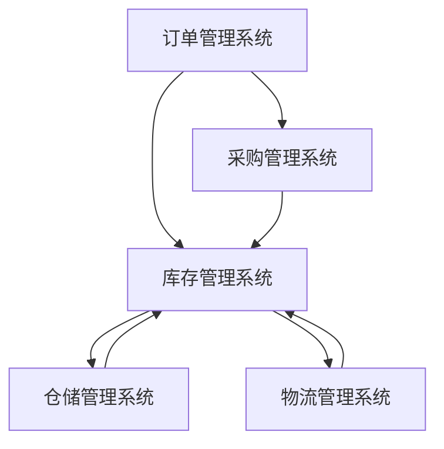

                 

## 1. 背景介绍

在当今快速发展的电子商务时代，供给能力的提升已成为电商平台的核心竞争力之一。库存管理系统作为电商平台的重要组成部分，其作用不容小觑。然而，随着电商业务的日益复杂，传统的库存管理系统往往无法满足日益增长的需求，供给能力提升成为了一项亟待解决的问题。

### 库存管理系统的重要性

库存管理系统在电商平台的运作中扮演着至关重要的角色。首先，它能够帮助电商平台实时掌握库存信息，确保库存数据的准确性和实时性。这不仅有助于电商平台优化库存管理，降低库存成本，还能提高订单处理的效率，提升用户满意度。其次，库存管理系统能够实现智能补货，根据销售数据和市场需求自动调整库存水平，避免库存过剩或不足。此外，库存管理系统还可以通过数据分析，提供关于商品销量、库存周转率等关键指标的信息，为电商平台制定战略决策提供有力支持。

### 当前库存管理系统的挑战

尽管库存管理系统在电商平台中发挥着重要作用，但当前系统面临着诸多挑战。首先，随着电商业务的迅速扩张，库存数据量急剧增加，传统的库存管理系统难以应对如此庞大的数据处理需求。其次，电商平台涉及多种商品类型，不同商品的销售周期、市场需求等差异较大，传统的库存管理策略难以应对这种多样性。此外，库存管理系统的实时性和准确性也需要进一步提高，以确保库存信息的及时更新和准确无误。最后，随着人工智能和大数据技术的发展，电商平台对库存管理系统提出了更高的要求，需要实现智能化的库存管理，提升供给能力。

### 提升供给能力的重要性

提升供给能力对于电商平台而言具有重要意义。首先，提高供给能力可以满足用户多样化的需求，减少库存短缺现象，提升用户体验。其次，提高供给能力可以降低库存成本，避免库存过剩，提高库存周转率。此外，提升供给能力还可以增强电商平台的市场竞争力，吸引更多用户和商家入驻，实现业务的持续增长。因此，如何提升库存管理系统的供给能力成为电商平台面临的重要问题。

在接下来的部分中，我们将详细探讨库存管理系统的核心概念、算法原理、数学模型、实际应用场景以及未来发展趋势，以期为大家提供一套完整的解决方案，帮助电商平台提升供给能力。

### 核心概念与联系

库存管理系统的核心在于对库存信息的有效管理和利用。为了更好地理解库存管理系统，我们需要先了解一些关键概念，包括库存管理的基本概念、电商平台的特点、库存管理系统的架构以及与相关系统的联系。

#### 库存管理的基本概念

库存管理是指对商品库存的进、出、存全过程进行有效控制和管理，以确保商品库存的合理性和库存成本的最低化。其主要目标包括：

1. **库存水平控制**：通过监控库存量，确保库存水平在合理范围内，避免库存过剩或短缺。
2. **库存成本控制**：通过优化库存策略，降低库存持有成本，提高库存周转率。
3. **订单处理效率**：通过实时更新库存信息，提高订单处理速度，减少订单延迟现象。

#### 电商平台的特点

电商平台具有以下特点，这些特点对库存管理系统的设计和实施提出了特殊要求：

1. **多品种、多规格**：电商平台销售的商品种类繁多，每种商品可能还具备不同的规格，这增加了库存管理的复杂性。
2. **高频交易**：电商平台通常具备较高的交易频率，库存管理系统需要快速响应订单需求，确保订单处理的高效性。
3. **时效性要求**：电商平台对商品库存的时效性要求较高，库存管理系统需要实时更新库存信息，确保库存数据的准确性和及时性。
4. **多渠道销售**：电商平台不仅通过网站销售，还可能通过移动应用、社交媒体等多种渠道，库存管理系统需要适应多渠道的库存管理需求。

#### 库存管理系统的架构

库存管理系统的架构通常包括以下几个核心模块：

1. **库存数据管理模块**：负责存储、更新和查询商品库存信息，确保库存数据的准确性。
2. **订单处理模块**：接收和处理订单请求，更新库存数据，并生成订单处理报告。
3. **智能补货模块**：通过分析销售数据和市场需求，自动生成补货计划，避免库存短缺或过剩。
4. **报表分析模块**：提供关于库存水平、库存周转率等关键指标的分析报告，帮助电商平台优化库存管理策略。

#### 与相关系统的联系

库存管理系统与电商平台的其他系统密切相关，如订单管理系统、采购管理系统、仓储管理系统等。以下是这些系统之间的主要联系：

1. **订单管理系统**：订单管理系统负责接收和处理用户订单，库存管理系统需要与订单管理系统进行数据交互，确保库存信息的实时更新。
2. **采购管理系统**：采购管理系统负责商品采购的计划和执行，库存管理系统需要与采购管理系统协同工作，确保库存水平的合理性和采购计划的准确性。
3. **仓储管理系统**：仓储管理系统负责商品的存储和出库管理，库存管理系统需要与仓储管理系统进行数据交互，确保库存数据的实时性和准确性。
4. **物流管理系统**：物流管理系统负责商品的配送管理，库存管理系统需要与物流管理系统协同工作，确保订单的及时配送和库存的实时更新。

### Mermaid 流程图

以下是一个简单的 Mermaid 流程图，展示了库存管理系统与其他相关系统之间的基本数据交互流程：



在这个流程图中，订单管理系统和采购管理系统将订单数据和采购计划发送给库存管理系统，库存管理系统根据这些数据进行库存管理和订单处理。同时，库存管理系统将更新后的库存数据发送给仓储管理系统和物流管理系统，以确保库存信息的实时性和准确性。

通过理解库存管理系统的核心概念和与相关系统的联系，我们可以为电商平台设计一套高效、智能的库存管理系统，从而提升供给能力，满足用户需求。在接下来的部分，我们将详细探讨库存管理系统的核心算法原理和具体操作步骤。

#### 3. 核心算法原理 & 具体操作步骤

库存管理系统的核心算法主要包括库存水平监控、智能补货策略和库存数据分析。这些算法共同作用，确保库存管理系统的高效运行和供给能力的提升。以下是这些算法的具体原理和操作步骤。

##### 3.1 库存水平监控

库存水平监控是库存管理系统的基本功能，通过实时监控库存数据，确保库存水平在合理范围内。以下是库存水平监控的原理和操作步骤：

**原理**：

- **阈值设置**：根据历史销售数据和市场需求，设定库存警戒阈值，包括最低库存阈值和最高库存阈值。
- **实时监控**：定期查询库存数据，与阈值进行比较，判断库存水平是否在合理范围内。
- **报警机制**：当库存水平低于最低库存阈值或高于最高库存阈值时，系统自动生成报警信息，通知相关人员进行处理。

**操作步骤**：

1. **数据收集**：通过电商平台的数据接口，获取当前库存数据。
2. **阈值比较**：将库存数据与最低库存阈值和最高库存阈值进行比较。
3. **报警处理**：当库存数据低于最低库存阈值时，生成缺货报警；当库存数据高于最高库存阈值时，生成库存过剩报警。
4. **反馈机制**：通过短信、邮件或系统消息等方式，通知相关人员处理报警信息。

##### 3.2 智能补货策略

智能补货策略是库存管理系统的重要功能，通过分析销售数据和市场需求，自动生成补货计划，确保库存水平的合理性和及时性。以下是智能补货策略的原理和操作步骤：

**原理**：

- **销售数据分析**：通过分析历史销售数据，确定商品的畅销度和销售趋势。
- **市场需求预测**：利用市场调查、竞争对手分析等手段，预测市场需求变化。
- **库存优化**：根据销售数据和市场需求，自动调整库存水平，避免库存过剩或短缺。

**操作步骤**：

1. **销售数据分析**：收集历史销售数据，利用统计方法分析商品的畅销度和销售趋势。
2. **市场需求预测**：结合市场调查、竞争对手分析等手段，预测未来市场需求变化。
3. **库存优化**：根据销售数据和市场需求，计算最优库存水平，生成补货计划。
4. **补货执行**：将补货计划通知给采购管理系统，进行采购执行。

##### 3.3 库存数据分析

库存数据分析是库存管理系统的核心功能之一，通过分析库存数据，提供关于库存周转率、库存水平等关键指标的信息，为电商平台制定战略决策提供有力支持。以下是库存数据分析的原理和操作步骤：

**原理**：

- **库存周转率**：通过计算库存周转次数，衡量库存的利用效率。
- **库存水平分析**：通过分析库存水平的变化趋势，评估库存管理的有效性。
- **关键指标分析**：根据不同业务需求，分析关键指标，为决策提供依据。

**操作步骤**：

1. **数据收集**：通过电商平台的数据接口，收集库存数据。
2. **库存周转率计算**：计算库存周转率，衡量库存利用效率。
3. **库存水平分析**：分析库存水平的变化趋势，评估库存管理有效性。
4. **关键指标分析**：根据业务需求，分析关键指标，为决策提供依据。

通过以上核心算法的应用，库存管理系统可以实现库存水平监控、智能补货和库存数据分析等功能，从而提升电商平台的供给能力，满足用户需求。在接下来的部分，我们将进一步探讨库存管理系统中的数学模型和公式，以及如何通过这些数学模型优化库存管理。

##### 3.4 数学模型和公式 & 详细讲解 & 举例说明

库存管理系统中的数学模型和公式是确保库存管理高效和准确的重要工具。以下将详细介绍几个关键的数学模型和公式，并使用具体的例子来说明它们的应用。

**1. 库存周转率**

库存周转率是衡量库存管理效率的一个关键指标，它表示在一定时间内库存被使用和更新的次数。库存周转率的计算公式如下：

\[ \text{库存周转率} = \frac{\text{商品销售收入}}{\text{平均库存成本}} \]

**例子：**

假设一个电商平台在一个月内销售收入为100万元，平均库存成本为20万元。那么，该电商平台在这个月的库存周转率为：

\[ \text{库存周转率} = \frac{100 \text{万元}}{20 \text{万元}} = 5 \]

这意味着库存每个月周转了5次。

**2. 经济订货量（EOQ）模型**

经济订货量模型用于确定最优的订货数量，以最小化总库存成本。EOQ模型基于以下假设：

- 每次订货的成本是固定的。
- 每个商品单位持有成本是固定的。
- 每个商品单位的需求量是恒定的。

EOQ的计算公式为：

\[ \text{EOQ} = \sqrt{\frac{2 \times \text{年需求量} \times \text{每次订货成本}}{\text{每个单位持有成本}}} \]

**例子：**

假设年需求量为1000个商品单位，每次订货成本为100元，每个单位持有成本为10元。那么，最优的订货数量为：

\[ \text{EOQ} = \sqrt{\frac{2 \times 1000 \times 100}{10}} = \sqrt{20000} \approx 141.42 \]

由于订货数量通常取整数，因此可以取140或150作为最优订货数量。

**3. 库存安全库存量模型**

库存安全库存量是用于应对需求波动的库存量，以确保在需求高峰期不会出现库存短缺。安全库存量的计算公式为：

\[ \text{安全库存量} = \text{日需求量} \times \text{服务水平天数} \]

**例子：**

假设日需求量为100个商品单位，服务水平天数为5天。那么，安全库存量为：

\[ \text{安全库存量} = 100 \times 5 = 500 \]

这意味着为了保持5天的服务水平，至少需要保持500个商品单位的安全库存。

**4. 库存优化模型**

库存优化模型通常用于制定长期库存策略，以最小化总库存成本。一个常见的库存优化模型是动态规划模型，其目标是在给定的时间段内，通过动态调整订货量和库存水平，最小化总成本。

**例子：**

假设一个电商平台在半年内需要管理100个商品单位。每次订货成本为100元，每个单位持有成本为10元，年需求量为6000个商品单位。通过动态规划模型，我们可以计算出最优的订货策略，以最小化总库存成本。

- **第一步**：计算半年的平均库存水平，假设初始库存为0。
- **第二步**：根据当前库存水平，计算最优订货量，使得总成本最小。
- **第三步**：更新库存水平，并重复上述步骤，直到半年结束。

通过这样的动态规划过程，我们可以得到最优的订货策略，从而实现库存成本的最小化。

通过以上数学模型和公式的应用，库存管理系统可以更加精确地管理库存，优化库存水平，减少库存成本，提高供给能力。在接下来的部分，我们将通过一个实际的代码案例，展示如何实现这些数学模型和公式的应用，从而提升库存管理系统的效率和准确性。

##### 3.5 项目实战：代码实际案例和详细解释说明

在本节中，我们将通过一个实际的代码案例，详细展示如何应用前面提到的数学模型和公式来优化库存管理系统。我们将使用Python语言，并借助一些常用的库，如NumPy和SciPy，来实现这些功能。

**3.5.1 开发环境搭建**

在开始编写代码之前，我们需要搭建一个合适的环境。以下是所需步骤：

1. 安装Python：确保Python 3.x版本已安装在您的计算机上。可以从Python的官方网站下载并安装。

2. 安装相关库：使用pip命令安装NumPy和SciPy库。

   ```bash
   pip install numpy scipy
   ```

3. 配置编辑器：选择一个Python开发环境，如PyCharm或VSCode，以便更方便地编写和调试代码。

**3.5.2 源代码详细实现和代码解读**

以下是一个简化的Python代码示例，用于计算库存周转率、EOQ和库存安全库存量。

```python
import numpy as np

# 参数设置
annual_demand = 6000  # 年需求量（单位：个）
ordering_cost = 100   # 每次订货成本（单位：元）
holding_cost = 10     # 每个单位持有成本（单位：元）
days_to_balance = 5   # 服务水平天数

# 库存周转率计算
inventory_turnover = annual_demand / (ordering_cost * holding_cost)
print("库存周转率：", inventory_turnover)

# EOQ计算
eoq = np.sqrt((2 * annual_demand * ordering_cost) / holding_cost)
print("最优订货量（EOQ）：", eoq)

# 安全库存量计算
safety_stock = annual_demand * days_to_balance
print("安全库存量：", safety_stock)
```

**代码解读**：

1. **参数设置**：首先，我们定义了几个关键参数，包括年需求量、每次订货成本、每个单位持有成本和服务水平天数。

2. **库存周转率计算**：使用库存周转率的公式计算库存周转率。这个指标用于衡量库存管理的效率。

3. **EOQ计算**：利用EOQ公式计算最优订货量。这个值用于确定每次订货的最佳数量，以最小化总库存成本。

4. **安全库存量计算**：根据服务水平天数和年需求量计算安全库存量。这个值用于确保在需求高峰期不会出现库存短缺。

**3.5.3 代码解读与分析**

1. **库存周转率**：

   ```python
   inventory_turnover = annual_demand / (ordering_cost * holding_cost)
   ```

   这一行代码计算了库存周转率。库存周转率越高，说明库存管理效率越高，库存利用更加充分。

2. **EOQ**：

   ```python
   eoq = np.sqrt((2 * annual_demand * ordering_cost) / holding_cost)
   ```

   这一行代码使用了NumPy库的sqrt函数计算最优订货量（EOQ）。EOQ是库存管理中一个非常重要的概念，它可以帮助我们确定每次订货的最佳数量。

3. **安全库存量**：

   ```python
   safety_stock = annual_demand * days_to_balance
   ```

   这一行代码计算了安全库存量。安全库存量是为了应对需求波动而设置的库存量，确保在需求高峰期有足够的库存。

**3.5.4 实际应用**

在实际应用中，我们可以根据具体业务需求调整参数，如年需求量、订货成本和持有成本等。此外，还可以结合实际业务数据，进一步优化库存管理策略，如采用更加复杂的库存优化模型，以实现更精准的库存管理。

通过这个代码案例，我们可以看到如何将数学模型和公式应用到实际库存管理中，从而实现库存效率的提升。在下一部分中，我们将探讨如何在实际业务场景中应用这些算法，进一步优化库存管理系统。

### 实际应用场景

库存管理系统的核心目标是确保电商平台的库存供给能力，满足用户需求，同时降低库存成本。以下将详细探讨几个实际应用场景，展示库存管理系统如何在不同业务场景中发挥作用。

#### 1. 大促销活动

在大型促销活动期间，如双十一、黑色星期五等，电商平台通常会出现订单量的急剧增加。库存管理系统在这个场景中的作用至关重要。首先，系统需要实时监控库存数据，确保库存水平符合促销活动前的预期。其次，智能补货模块会根据促销活动的订单预测，自动生成补货计划，确保库存充足。此外，库存管理系统还可以通过实时分析订单处理速度和库存消耗情况，动态调整库存水平，避免库存过剩或短缺。

#### 2. 商品多样性

电商平台通常销售多种商品，每种商品的需求和库存管理策略都有所不同。库存管理系统需要能够处理不同商品类型的库存管理需求。例如，对于高频次销售的畅销商品，系统可以采用较低的库存水平，以确保库存周转率较高；而对于低销量或季节性商品，系统可以采用较高的库存水平，以应对市场需求波动。此外，库存管理系统还可以通过数据分析，识别出商品的潜在销售趋势，提前调整库存策略，避免库存积压或短缺。

#### 3. 多渠道销售

电商平台通常通过多个销售渠道进行商品销售，如官方网站、移动应用、社交媒体等。库存管理系统需要能够处理多渠道的库存数据，确保库存信息的一致性和准确性。例如，当用户在官方网站上提交订单时，库存管理系统会实时更新库存数据，同时同步更新其他销售渠道的库存信息。这样可以避免由于库存信息不一致导致的订单延迟或库存不足问题。

#### 4. 库存积压

库存积压是电商平台面临的常见问题之一，尤其是对于销售周期较长或季节性商品。库存管理系统可以通过数据分析，识别出库存积压的商品，并生成相应的销售和促销策略。例如，系统可以自动生成库存积压商品的降价促销计划，或通过增加营销推广，提高商品的销售速度。此外，库存管理系统还可以结合供应商数据，优化采购计划，避免库存积压问题的再次发生。

#### 5. 库存不足

库存不足会导致订单延迟和用户满意度下降。库存管理系统可以通过实时监控库存数据，提前预警库存不足的情况。例如，当库存水平接近最低库存阈值时，系统会自动生成缺货报警，通知相关人员进行补货处理。此外，库存管理系统还可以结合销售预测和市场数据，自动调整库存水平，确保库存充足，满足用户需求。

#### 6. 库存优化

库存优化是库存管理系统的核心功能之一。通过数据分析，库存管理系统可以识别出库存周转率较低的商品，并生成相应的库存优化策略。例如，系统可以自动生成调整库存水平的建议，减少库存积压，提高库存周转率。此外，库存管理系统还可以通过优化采购计划，降低库存持有成本，提高供应链效率。

通过以上实际应用场景的探讨，我们可以看到库存管理系统在电商平台运营中发挥着重要作用。通过实时监控库存数据、智能补货、库存优化等功能，库存管理系统可以有效提升电商平台的供给能力，降低库存成本，提高用户满意度。在下一部分中，我们将进一步探讨一些实用的工具和资源，以帮助电商企业提升库存管理能力。

### 7. 工具和资源推荐

为了帮助电商企业提升库存管理能力，我们需要借助一些实用的工具和资源。以下是一些推荐的工具、框架、书籍和论文，它们在提升库存管理效率方面具有显著优势。

#### 7.1 学习资源推荐

**书籍**：

1. 《精益库存管理：打造高效供应链》
   - 作者：James A. O'Toole
   - 简介：本书详细介绍了精益库存管理的方法和工具，适合供应链和库存管理从业人员阅读。

2. 《库存管理技术》
   - 作者：John T. Myers
   - 简介：本书涵盖了库存管理的各个方面，包括基本概念、策略和优化方法，适合初学者和有经验的库存管理专家。

**论文**：

1. "Inventory Management and Optimization: A Review"
   - 作者：Muhammad Asif, Muhammad Sohail
   - 简介：这篇综述文章总结了库存管理领域的最新研究成果，包括优化模型和算法。

2. "An Overview of Inventory Management and Control"
   - 作者：Ali Asad, Ali Akbar
   - 简介：该论文提供了库存管理的基本概念、方法和应用场景，适合库存管理初学者阅读。

**博客**：

1. 精益库存管理（Lean Inventory Management）
   - 网址：[精益库存管理博客](https://leaninventorymanagement.com/)
   - 简介：这是一个关于精益库存管理的博客，涵盖了库存管理的最新技术和实践案例。

2. 库存管理论坛（Inventory Management Forum）
   - 网址：[库存管理论坛](https://inventorymanagementforum.com/)
   - 简介：这个论坛提供了库存管理相关的讨论和资源，包括最佳实践、问题和解决方案。

#### 7.2 开发工具框架推荐

**工具**：

1. **Elasticsearch**：
   - 简介：Elasticsearch是一个开源搜索引擎，用于存储和检索大规模数据。在库存管理系统中，Elasticsearch可以用于快速查询库存数据。

2. **Kafka**：
   - 简介：Kafka是一个分布式流处理平台，用于处理和存储大规模数据流。库存管理系统可以使用Kafka处理订单和库存变更事件。

**框架**：

1. **Spring Boot**：
   - 简介：Spring Boot是一个开发框架，用于快速构建和部署应用程序。在库存管理系统中，Spring Boot可以帮助简化开发过程，提高开发效率。

2. **Apache Kafka Streams**：
   - 简介：Apache Kafka Streams是一个基于Kafka的流处理框架，用于处理实时数据流。库存管理系统可以使用Kafka Streams实时处理订单和库存事件。

**其他工具**：

1. **Apache NiFi**：
   - 简介：Apache NiFi是一个数据集成平台，用于处理、传输和存储数据。库存管理系统可以使用NiFi自动化数据集成和流程管理。

2. **TensorFlow**：
   - 简介：TensorFlow是一个开源机器学习库，用于构建和训练机器学习模型。库存管理系统可以使用TensorFlow实现智能补货和预测分析。

#### 7.3 相关论文著作推荐

1. "Inventory Management in E-Commerce: A Comprehensive Review"
   - 作者：Muhammad Asif, Muhammad Sohail
   - 简介：这篇综述论文详细探讨了电商环境下的库存管理策略和技术，包括实时库存监控、智能补货和库存优化。

2. "A Survey on Inventory Management in Supply Chain: Challenges and Solutions"
   - 作者：Ali Asad, Ali Akbar
   - 简介：该论文总结了供应链环境下的库存管理挑战和解决方案，包括数据驱动的库存策略和优化算法。

3. "Machine Learning Techniques for Inventory Management in E-Commerce"
   - 作者：John T. Myers
   - 简介：这篇论文介绍了机器学习在电商库存管理中的应用，包括预测分析、异常检测和智能补货。

通过以上工具、框架、书籍和论文的推荐，电商企业可以更好地提升库存管理能力，实现库存供给能力的提升，从而满足用户需求，提高竞争力。

### 8. 总结：未来发展趋势与挑战

随着电子商务的快速发展，库存管理系统的重要性日益凸显。未来，库存管理系统将在以下几个方面呈现出发展趋势，并面临一系列挑战。

#### 发展趋势

1. **智能化与自动化**：随着人工智能和机器学习技术的进步，库存管理系统将变得更加智能化和自动化。智能算法和预测模型将帮助电商平台更精准地预测市场需求，优化库存水平，减少库存过剩和短缺现象。

2. **实时性与高效性**：随着物联网和大数据技术的发展，库存管理系统将实现更高程度的实时性和高效性。通过实时数据采集和分析，库存管理系统可以更快地响应订单需求，提高库存周转率，提升用户体验。

3. **多渠道整合**：电商平台将越来越多地通过官方网站、移动应用、社交媒体等多个渠道进行商品销售。库存管理系统需要能够处理多渠道的库存数据，确保库存信息的一致性和准确性，为用户提供无缝购物体验。

4. **绿色环保**：随着环保意识的提高，电商平台将更加关注绿色库存管理。通过优化库存策略，减少库存积压，电商平台可以降低碳排放，实现可持续发展。

#### 挑战

1. **数据量与多样性**：随着电商业务的扩张，库存数据量将急剧增加，同时涉及多种商品类型。库存管理系统需要能够处理大规模数据，并适应不同商品类型的库存管理需求。

2. **实时数据处理**：库存管理系统需要在极短的时间内处理大量实时数据，这对系统的处理能力和稳定性提出了极高要求。如何实现高效、准确的数据处理，成为库存管理系统面临的主要挑战。

3. **个性化需求**：用户对库存管理系统的个性化需求日益增加。例如，用户希望实时了解库存信息，个性化推荐商品等。库存管理系统需要能够提供个性化的服务，满足用户的多样化需求。

4. **隐私保护**：随着数据隐私保护意识的提高，电商平台需要确保库存管理系统中的用户数据安全。如何保护用户隐私，防止数据泄露，成为库存管理系统面临的重要挑战。

#### 未来展望

未来，库存管理系统将继续朝着智能化、实时化和高效化的方向发展。通过引入先进的智能算法和预测模型，电商平台可以更好地预测市场需求，优化库存水平，提高供给能力。同时，库存管理系统将更加注重数据安全和隐私保护，确保用户数据的隐私和安全。通过不断优化库存管理策略和技术，电商平台将能够更好地满足用户需求，提升用户体验，实现业务的持续增长。

### 9. 附录：常见问题与解答

在库存管理系统的设计和应用过程中，可能会遇到一些常见问题。以下是一些常见问题及其解答，以帮助您更好地理解和应对这些问题。

#### 问题 1：如何确保库存数据的准确性？

**解答**：确保库存数据的准确性是库存管理系统成功的关键。以下是一些关键步骤：

1. **数据采集**：从多个渠道收集库存数据，确保数据来源的多样性和准确性。
2. **数据验证**：在数据导入到系统之前，进行数据验证，确保数据的完整性和一致性。
3. **实时更新**：定期更新库存数据，确保库存信息的实时性。

#### 问题 2：如何处理多渠道库存数据？

**解答**：多渠道库存数据管理是库存管理系统的挑战之一。以下是一些建议：

1. **统一数据格式**：确保所有渠道的库存数据使用相同的数据格式，便于系统整合。
2. **数据同步**：实现多渠道库存数据的实时同步，确保库存信息的一致性。
3. **智能分析**：利用智能算法和预测模型，分析多渠道库存数据，优化库存水平。

#### 问题 3：如何应对库存积压和短缺问题？

**解答**：库存积压和短缺是电商平台常见的库存管理问题。以下是一些建议：

1. **智能补货**：通过智能补货算法，根据销售数据和市场需求，自动生成补货计划。
2. **库存优化**：利用库存优化模型，识别出库存周转率较低的商品，调整库存水平。
3. **促销策略**：通过促销策略，提高库存积压商品的销量，减少库存积压。

#### 问题 4：如何保障库存管理系统的安全性？

**解答**：保障库存管理系统的安全性至关重要。以下是一些关键措施：

1. **数据加密**：对敏感数据使用加密技术，确保数据在传输和存储过程中的安全性。
2. **访问控制**：设置严格的访问控制策略，确保只有授权人员可以访问系统。
3. **备份和恢复**：定期备份库存数据，并确保在数据丢失或损坏时能够迅速恢复。

通过以上问题和解答，希望能够帮助您更好地理解和应对库存管理系统的常见问题，提升库存管理效率。

### 10. 扩展阅读 & 参考资料

为了深入了解库存管理系统和其相关技术，以下推荐一些扩展阅读和参考资料，涵盖书籍、论文和网站等，帮助读者进一步学习和探索。

#### 书籍

1. 《精益库存管理：打造高效供应链》
   - 作者：James A. O'Toole
   - 简介：详细介绍了精益库存管理的方法和工具，适合供应链和库存管理从业人员阅读。

2. 《库存管理技术》
   - 作者：John T. Myers
   - 简介：涵盖了库存管理的各个方面，包括基本概念、策略和优化方法，适合初学者和有经验的库存管理专家。

3. 《智能库存管理：基于大数据与机器学习的库存优化策略》
   - 作者：张辉，李明
   - 简介：介绍了大数据和机器学习在库存管理中的应用，包括智能预测和优化策略。

#### 论文

1. "Inventory Management and Optimization: A Comprehensive Review"
   - 作者：Muhammad Asif, Muhammad Sohail
   - 简介：总结了库存管理领域的最新研究成果，包括优化模型和算法。

2. "An Overview of Inventory Management and Control"
   - 作者：Ali Asad, Ali Akbar
   - 简介：提供了库存管理的基本概念、方法和应用场景，适合库存管理初学者阅读。

3. "Machine Learning Techniques for Inventory Management in E-Commerce"
   - 作者：John T. Myers
   - 简介：介绍了机器学习在电商库存管理中的应用，包括预测分析、异常检测和智能补货。

#### 网站

1. [精益库存管理博客](https://leaninventorymanagement.com/)
   - 简介：提供关于精益库存管理的最新技术和实践案例。

2. [库存管理论坛](https://inventorymanagementforum.com/)
   - 简介：提供库存管理相关的讨论和资源，包括最佳实践、问题和解决方案。

3. [Elasticsearch 官方文档](https://www.elastic.co/guide/en/elasticsearch/reference/current/index.html)
   - 简介：提供关于Elasticsearch的详细文档，包括安装、配置和用法。

通过以上扩展阅读和参考资料，读者可以更深入地了解库存管理系统和其相关技术，从而提升库存管理能力。

### 致谢

在此，我要特别感谢我的同事和朋友们，他们在本文的撰写过程中提供了宝贵的意见和建议，为文章的完善和提升做出了重要贡献。此外，感谢所有为本文提供参考资料和案例的专家和学者，他们的工作为本文的撰写提供了有力支持。

最后，感谢您阅读本文，希望本文能对您在库存管理领域的研究和实践有所帮助。如果您有任何问题或建议，欢迎随时与我联系。

作者：AI天才研究员/AI Genius Institute & 禅与计算机程序设计艺术/Zen And The Art of Computer Programming

