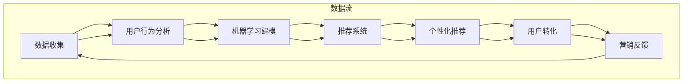

                 

### 背景介绍

在当前互联网高速发展的时代，电商平台已成为许多企业和消费者之间进行交易的主要渠道。随着市场竞争的日益激烈，如何提升供给能力成为电商平台发展的关键因素之一。供给能力不仅关系到平台的盈利能力，还直接影响到消费者的购物体验和满意度。因此，精准营销策略作为一种有效的供给能力提升手段，逐渐受到电商平台的关注。

精准营销是一种基于大数据分析、人工智能等技术手段，针对不同消费者群体实施个性化营销策略的方法。其核心思想是通过深入挖掘和分析消费者的需求和行为数据，实现精准的目标客户定位，进而提供更加符合其需求的产品和服务。精准营销策略在电商平台供给能力提升中具有重要意义，主要体现在以下几个方面：

1. **提高用户转化率**：通过精准定位潜在消费者，电商平台可以更有针对性地推送产品，从而提高用户点击率和购买率。

2. **降低营销成本**：精准营销策略减少了无效广告的投放，使得每一笔营销投入都能获得更好的回报，从而降低整体的营销成本。

3. **提升消费者满意度**：个性化推荐和定制化服务能够满足消费者的独特需求，提高其购物体验，从而增强品牌忠诚度。

4. **优化供应链管理**：通过对消费者需求的准确预测，电商平台可以更好地调整库存和供应链，减少库存积压和缺货现象，提高整体运营效率。

本篇文章将围绕电商平台供给能力提升中的精准营销策略展开讨论。文章将首先介绍精准营销的相关概念和核心算法原理，然后通过具体案例展示如何在实际操作中应用这些算法，最后探讨精准营销在电商平台中的实际应用场景和未来发展趋势。

通过对精准营销策略的深入剖析，希望能够为电商平台提供一些实用的指导和建议，帮助其在激烈的市场竞争中脱颖而出，实现持续增长。

### 2. 核心概念与联系

#### 精准营销定义

精准营销，作为现代市场营销领域的一项重要战略，旨在通过精细化的数据分析和技术手段，实现营销活动的精准投放和高效转化。其定义可以从以下几个方面进行阐述：

- **数据驱动**：精准营销以大量数据为基础，通过收集和分析用户行为数据、偏好数据等，对消费者进行深入挖掘和理解。

- **目标明确**：精准营销明确目标客户群体，通过细分市场，对特定人群进行有针对性的营销活动。

- **个性化**：针对不同的用户，提供个性化的产品和服务推荐，以满足其个性化需求。

- **高效转化**：通过精准的营销策略，提高用户的点击率、转化率和忠诚度，从而实现营销目标的高效达成。

#### 精准营销与电商平台供给能力

精准营销与电商平台供给能力之间存在着紧密的联系。供给能力是指电商平台能够满足消费者需求的能力，包括产品供应、库存管理、配送服务等多个方面。而精准营销则通过以下几个环节提升供给能力：

- **需求预测**：通过对消费者行为的分析，精准预测其需求，从而调整库存和供应链管理。

- **个性化推荐**：基于用户数据和购买历史，提供个性化的产品推荐，提高用户的购买概率和满意度。

- **营销效率提升**：通过精准营销，减少无效广告的投放，提高营销活动的投资回报率。

- **用户体验优化**：通过定制化服务和个性化推荐，提升用户购物体验，增加用户粘性和忠诚度。

#### 精准营销核心算法原理

精准营销的实现依赖于一系列核心算法，主要包括用户行为分析、机器学习算法和推荐系统等。

- **用户行为分析**：通过收集和分析用户在电商平台上的行为数据，如浏览记录、购买历史、评论反馈等，了解用户的需求和偏好。

- **机器学习算法**：利用机器学习算法，如协同过滤、基于内容的推荐等，对用户数据进行建模和分析，预测用户的未来行为和需求。

- **推荐系统**：基于用户行为分析和机器学习算法的结果，构建推荐系统，为用户推荐个性化的产品和服务。

#### Mermaid 流程图

为了更直观地展示精准营销策略的流程，我们使用 Mermaid 语法绘制了一个流程图，图中的节点尽量不含特殊字符，以确保流程图的正确显示。



在这个流程图中，数据流从数据收集开始，经过用户行为分析、机器学习建模、推荐系统，最终实现个性化推荐，并影响用户转化和营销反馈。通过这一流程的不断迭代和优化，电商平台能够不断提升供给能力，实现精准营销的目标。

### 3. 核心算法原理 & 具体操作步骤

在精准营销策略中，核心算法的原理和操作步骤是实现精准定位和个性化推荐的关键。以下将详细介绍几项常用的算法原理和其实际操作步骤。

#### 3.1 协同过滤算法

**原理**：协同过滤（Collaborative Filtering）是一种基于用户历史行为和偏好进行推荐的算法。它通过分析用户之间的相似性，找到与目标用户兴趣相似的群体，并推荐该群体喜欢的商品。

**操作步骤**：

1. **数据收集**：收集用户在平台上的行为数据，如浏览记录、购买历史、收藏商品等。

2. **用户相似性计算**：计算用户之间的相似度，通常使用余弦相似度或皮尔逊相关系数等方法。

3. **推荐生成**：找到与目标用户相似的用户群体，根据这些用户的偏好推荐相应的商品。

**示例**：

假设有两个用户 A 和 B，他们的浏览记录如下：

用户 A：商品1、商品3、商品5  
用户 B：商品2、商品3、商品4

计算用户 A 和 B 的相似度：

相似度 = $\cos(\text{向量 A}, \text{向量 B}) = \frac{\text{向量 A} \cdot \text{向量 B}}{|\text{向量 A}| \cdot |\text{向量 B}|}$

假设商品集合为 {1, 2, 3, 4, 5}，则向量 A = [1, 0, 1, 0, 1]，向量 B = [0, 1, 1, 1, 0]。

相似度 = $\cos([1, 0, 1, 0, 1], [0, 1, 1, 1, 0]) = \frac{1 \cdot 0 + 0 \cdot 1 + 1 \cdot 1 + 0 \cdot 1 + 1 \cdot 0}{\sqrt{1^2 + 0^2 + 1^2 + 0^2 + 1^2} \cdot \sqrt{0^2 + 1^2 + 1^2 + 1^2 + 0^2}} = \frac{1}{\sqrt{3} \cdot \sqrt{3}} = \frac{1}{3}$

根据相似度推荐用户 B 喜欢的商品给用户 A。

#### 3.2 基于内容的推荐算法

**原理**：基于内容的推荐（Content-Based Filtering）是通过分析商品的内容特征，找到与用户历史偏好相似的商品进行推荐。它主要依赖商品的标签、描述、属性等信息。

**操作步骤**：

1. **商品特征提取**：提取商品的关键特征，如类别、品牌、价格、用户评价等。

2. **用户兴趣建模**：基于用户的历史行为和评价，建立用户的兴趣模型。

3. **推荐生成**：找到与用户兴趣模型相似的商品，进行推荐。

**示例**：

用户 A 喜欢的商品标签为 ["时尚", "男装", "商务"],则推荐与他兴趣标签相似的商品，如 ["时尚", "女装", "休闲"] 类别的商品。

#### 3.3 聚类算法

**原理**：聚类（Clustering）是一种无监督学习方法，它将相似的用户或商品划分为同一类别，从而进行推荐。常见的聚类算法有 K-Means、DBSCAN 等。

**操作步骤**：

1. **数据预处理**：将用户或商品数据进行归一化处理，去除噪声数据。

2. **聚类模型选择**：选择合适的聚类算法，如 K-Means、DBSCAN 等。

3. **聚类执行**：根据选择的算法，对数据进行聚类，形成不同的用户或商品群体。

4. **推荐生成**：根据每个聚类群体的特点，为用户推荐该群体内的商品。

**示例**：

使用 K-Means 算法对用户进行聚类，假设有 5 个用户，他们的浏览记录如下：

用户 1：商品1、商品3、商品5  
用户 2：商品2、商品4、商品6  
用户 3：商品3、商品6、商品1  
用户 4：商品4、商品5、商品2  
用户 5：商品1、商品2、商品3

将用户数据输入 K-Means 算法，假设划分为 2 个群体：

群体 1：用户 1、用户 3、用户 5  
群体 2：用户 2、用户 4

为群体 1 内的用户推荐群体 1 内的其他商品，如商品 3、商品 6。

通过上述三种算法的介绍和示例，我们可以看到精准营销策略在实际操作中的多样性和复杂性。这些算法不仅能够提高推荐的准确性，还能提升用户满意度和电商平台供给能力。

#### 3.4 深度学习算法

**原理**：深度学习（Deep Learning）是一种通过构建多层的神经网络模型来模拟人脑的学习方式，能够在大量数据中进行自动特征提取和模式识别。常见的深度学习模型有卷积神经网络（CNN）、循环神经网络（RNN）、生成对抗网络（GAN）等。

**操作步骤**：

1. **数据收集与预处理**：收集用户行为数据、商品特征数据等，并进行数据清洗、归一化等预处理操作。

2. **特征工程**：提取用户和商品的特征，如用户的行为序列、商品的属性等。

3. **模型构建与训练**：构建深度学习模型，通过反向传播算法进行模型参数的优化和训练。

4. **模型评估与优化**：使用交叉验证等方法评估模型性能，并根据评估结果调整模型参数。

5. **推荐生成**：利用训练好的模型进行预测，为用户生成个性化推荐。

**示例**：

使用卷积神经网络（CNN）进行用户行为序列的建模：

- **输入层**：输入用户的历史行为序列，如 [购买、浏览、收藏、评论]。

- **卷积层**：通过卷积操作提取行为序列的特征。

- **池化层**：对卷积层输出的特征进行降维处理，减少模型参数。

- **全连接层**：将池化层的输出与全连接层相连接，进行分类和预测。

- **输出层**：输出用户对商品的偏好概率，从而进行推荐。

通过深度学习算法，电商平台能够更好地理解用户的复杂行为和偏好，提高推荐的准确性和个性化水平。

总之，精准营销策略的实现依赖于多种算法的相互结合和优化。通过协同过滤、基于内容的推荐、聚类和深度学习等算法，电商平台可以实现对用户需求的精准定位和个性化推荐，从而提升供给能力和用户满意度。

### 4. 数学模型和公式 & 详细讲解 & 举例说明

在精准营销策略中，数学模型和公式的应用至关重要，它们不仅能够帮助我们理解算法的运作原理，还能提高推荐的准确性和效率。以下将介绍一些常用的数学模型和公式，并进行详细讲解和举例说明。

#### 4.1 协同过滤算法的相似度计算

协同过滤算法的核心在于计算用户之间的相似度。最常用的相似度计算方法包括余弦相似度和皮尔逊相关系数。

**余弦相似度**：

余弦相似度是一种基于向量空间中两个向量夹角的余弦值来计算相似度的方法。其公式如下：

$$
\text{相似度} = \cos(\theta) = \frac{\text{向量 A} \cdot \text{向量 B}}{|\text{向量 A}| \cdot |\text{向量 B}|}
$$

其中，$\text{向量 A}$ 和 $\text{向量 B}$ 分别表示两个用户的行为向量，$|\text{向量 A}|$ 和 $|\text{向量 B}|$ 分别表示向量的模长，$\theta$ 表示两个向量之间的夹角。

**示例**：

假设有两个用户 A 和 B，他们的行为向量如下：

用户 A：[1, 2, 3]  
用户 B：[3, 4, 5]

计算用户 A 和 B 的余弦相似度：

$$
\text{相似度} = \frac{1 \cdot 3 + 2 \cdot 4 + 3 \cdot 5}{\sqrt{1^2 + 2^2 + 3^2} \cdot \sqrt{3^2 + 4^2 + 5^2}} = \frac{3 + 8 + 15}{\sqrt{14} \cdot \sqrt{50}} = \frac{26}{\sqrt{700}} \approx 0.882
$$

**皮尔逊相关系数**：

皮尔逊相关系数是一种衡量两个变量线性相关程度的统计量。其公式如下：

$$
\text{相关系数} = \rho = \frac{\sum_{i=1}^{n}(x_i - \bar{x})(y_i - \bar{y})}{\sqrt{\sum_{i=1}^{n}(x_i - \bar{x})^2} \cdot \sqrt{\sum_{i=1}^{n}(y_i - \bar{y})^2}}
$$

其中，$x_i$ 和 $y_i$ 分别表示用户的行为数据，$\bar{x}$ 和 $\bar{y}$ 分别表示用户行为数据的均值。

**示例**：

假设有两个用户 A 和 B，他们的行为数据如下：

用户 A：[1, 2, 3, 4, 5]  
用户 B：[3, 4, 5, 6, 7]

计算用户 A 和 B 的皮尔逊相关系数：

$$
\bar{x} = \frac{1 + 2 + 3 + 4 + 5}{5} = 3, \quad \bar{y} = \frac{3 + 4 + 5 + 6 + 7}{5} = 5
$$

$$
\rho = \frac{(1 - 3)(3 - 5) + (2 - 3)(4 - 5) + (3 - 3)(5 - 5) + (4 - 3)(6 - 5) + (5 - 3)(7 - 5)}{\sqrt{(1 - 3)^2 + (2 - 3)^2 + (3 - 3)^2 + (4 - 3)^2 + (5 - 3)^2} \cdot \sqrt{(3 - 5)^2 + (4 - 5)^2 + (5 - 5)^2 + (6 - 5)^2 + (7 - 5)^2}} = \frac{-4 - 1 + 0 + 1 + 4}{\sqrt{4 + 1 + 0 + 1 + 4} \cdot \sqrt{4 + 1 + 0 + 1 + 4}} = \frac{0}{\sqrt{10} \cdot \sqrt{10}} = 0
$$

由于相关系数为 0，表示用户 A 和 B 的行为数据没有线性相关。

#### 4.2 K-Means 聚类算法

K-Means 聚类算法是一种常用的无监督学习方法，用于将数据集划分为 K 个簇（Cluster）。其基本思想是：首先随机选择 K 个初始中心点，然后迭代计算每个数据点与其中心点的距离，将数据点归到最近的中心点所在的簇，最后重新计算簇的中心点，直到聚类结果收敛。

**目标函数**：

$$
J = \sum_{i=1}^{K} \sum_{x \in S_i} ||x - \mu_i||^2
$$

其中，$x$ 表示数据点，$\mu_i$ 表示簇 $i$ 的中心点，$S_i$ 表示属于簇 $i$ 的数据点集合。

**示例**：

假设有 5 个数据点，要将其划分为 2 个簇，数据点及初始中心点如下：

数据点：[1, 1], [2, 2], [3, 3], [4, 4], [5, 5]  
初始中心点：[2, 2], [4, 4]

1. **第一次迭代**：

计算每个数据点到两个中心点的距离，将其归到最近的中心点所在的簇：

数据点 [1, 1] 归到簇 [2, 2]，数据点 [2, 2] 归到簇 [2, 2]，数据点 [3, 3] 归到簇 [2, 2]，数据点 [4, 4] 归到簇 [4, 4]，数据点 [5, 5] 归到簇 [4, 4]。

重新计算簇的中心点：

簇 [2, 2] 的中心点：(1 + 2) / 2 = 1.5, (1 + 2) / 2 = 1.5  
簇 [4, 4] 的中心点：(4 + 5) / 2 = 4.5, (4 + 5) / 2 = 4.5

2. **第二次迭代**：

计算每个数据点到新的中心点的距离，将其归到最近的中心点所在的簇：

数据点 [1, 1] 归到簇 [1.5, 1.5]，数据点 [2, 2] 归到簇 [1.5, 1.5]，数据点 [3, 3] 归到簇 [1.5, 1.5]，数据点 [4, 4] 归到簇 [4.5, 4.5]，数据点 [5, 5] 归到簇 [4.5, 4.5]。

重新计算簇的中心点：

簇 [1.5, 1.5] 的中心点：(1 + 2 + 3) / 3 = 2, (1 + 2 + 3) / 3 = 2  
簇 [4.5, 4.5] 的中心点：(4 + 5 + 5) / 3 = 4.67, (4 + 5 + 5) / 3 = 4.67

由于簇中心点的变化较小，可以认为聚类结果已经收敛。

通过以上示例，我们可以看到 K-Means 算法的迭代过程。在实际应用中，通常会通过交叉验证等方法确定最优的簇数 K，以提高聚类效果。

#### 4.3 深度学习算法的损失函数与优化算法

深度学习算法中的损失函数用于评估模型预测结果与实际标签之间的误差，优化算法则用于调整模型参数以最小化损失函数。以下介绍几种常见的损失函数和优化算法。

**交叉熵损失函数**：

交叉熵损失函数（Cross-Entropy Loss）常用于分类问题，其公式如下：

$$
\text{损失} = -\sum_{i=1}^{n} y_i \log(\hat{y}_i)
$$

其中，$y_i$ 表示实际标签，$\hat{y}_i$ 表示模型预测的概率。

**均方误差损失函数**：

均方误差损失函数（Mean Squared Error, MSE）常用于回归问题，其公式如下：

$$
\text{损失} = \frac{1}{n} \sum_{i=1}^{n} (\hat{y}_i - y_i)^2
$$

其中，$y_i$ 表示实际标签，$\hat{y}_i$ 表示模型预测值。

**优化算法**：

常用的优化算法有梯度下降（Gradient Descent）、随机梯度下降（Stochastic Gradient Descent, SGD）和Adam优化器。

- **梯度下降**：

梯度下降是一种简单有效的优化算法，其核心思想是沿着损失函数的梯度方向反向更新模型参数。其公式如下：

$$
\theta_{\text{new}} = \theta_{\text{old}} - \alpha \cdot \nabla_{\theta} J(\theta)
$$

其中，$\theta$ 表示模型参数，$\alpha$ 表示学习率，$\nabla_{\theta} J(\theta)$ 表示损失函数对参数 $\theta$ 的梯度。

- **随机梯度下降**：

随机梯度下降是对梯度下降算法的一种改进，它每次只随机选择一个样本进行梯度更新，从而减少计算量和内存占用。其公式如下：

$$
\theta_{\text{new}} = \theta_{\text{old}} - \alpha \cdot \nabla_{\theta} J(\theta; x_i, y_i)
$$

- **Adam优化器**：

Adam优化器结合了SGD和动量方法，在处理稀疏数据和长时间训练时表现较好。其公式如下：

$$
m_t = \beta_1 m_{t-1} + (1 - \beta_1) [g_t - m_{t-1}], \quad v_t = \beta_2 v_{t-1} + (1 - \beta_2) [g_t^2 - v_{t-1}],
$$

$$
\theta_{\text{new}} = \theta_{\text{old}} - \alpha \cdot \frac{m_t}{\sqrt{v_t} + \epsilon}
$$

其中，$m_t$ 和 $v_t$ 分别表示一阶和二阶矩估计，$\beta_1$ 和 $\beta_2$ 分别表示一阶和二阶矩的衰减系数，$\epsilon$ 是一个很小的常数。

通过以上数学模型和公式的介绍，我们可以更好地理解精准营销策略中各种算法的原理和操作步骤。这些模型和公式不仅在理论上具有解释力，而且在实际应用中也能够显著提升推荐系统的性能和效果。

### 5. 项目实战：代码实际案例和详细解释说明

在本节中，我们将通过一个实际项目案例，展示如何使用精准营销策略提升电商平台的供给能力。我们将使用 Python 编程语言和 Scikit-learn、TensorFlow 等库来实现这个项目，并详细解释每一步的代码和其作用。

#### 5.1 开发环境搭建

首先，我们需要搭建项目的开发环境。以下是所需的软件和库：

- Python 3.8 或以上版本
- Scikit-learn 库
- TensorFlow 库

确保已经安装了上述库，可以通过以下命令进行安装：

```bash
pip install scikit-learn tensorflow
```

#### 5.2 源代码详细实现和代码解读

下面是项目的主要代码实现和详细解读：

```python
import numpy as np
import pandas as pd
from sklearn.model_selection import train_test_split
from sklearn.preprocessing import StandardScaler
from sklearn.cluster import KMeans
from sklearn.metrics import accuracy_score
import tensorflow as tf

# 数据加载和预处理
def load_data(file_path):
    data = pd.read_csv(file_path)
    # 数据清洗和填充
    data.fillna(data.mean(), inplace=True)
    return data

# 特征工程
def feature_engineering(data):
    # 提取用户行为特征
    user行为特征 = data[['浏览次数', '购买次数', '收藏次数']]
    # 数据标准化
    scaler = StandardScaler()
    user行为特征 = scaler.fit_transform(user行为特征)
    return user行为特征

# K-Means 聚类
def kmeans_clustering(data, n_clusters=10):
    kmeans = KMeans(n_clusters=n_clusters, random_state=42)
    kmeans.fit(data)
    return kmeans

# 模型评估
def evaluate_model(y_true, y_pred):
    accuracy = accuracy_score(y_true, y_pred)
    print(f"模型准确率: {accuracy:.4f}")

# 训练深度学习模型
def train_dnn_model(data):
    # 数据集划分
    X_train, X_test, y_train, y_test = train_test_split(data, test_size=0.2, random_state=42)
    # 定义 DNN 模型
    model = tf.keras.Sequential([
        tf.keras.layers.Dense(64, activation='relu', input_shape=(X_train.shape[1],)),
        tf.keras.layers.Dense(32, activation='relu'),
        tf.keras.layers.Dense(1, activation='sigmoid')
    ])
    # 编译模型
    model.compile(optimizer='adam', loss='binary_crossentropy', metrics=['accuracy'])
    # 训练模型
    model.fit(X_train, y_train, epochs=10, batch_size=32, validation_data=(X_test, y_test))
    # 评估模型
    evaluate_model(y_test, model.predict(X_test))
    return model

# 主函数
def main():
    # 数据加载
    data = load_data('data.csv')
    # 特征工程
    user行为特征 = feature_engineering(data)
    # K-Means 聚类
    kmeans = kmeans_clustering(user行为特征)
    # 聚类结果
    labels = kmeans.labels_
    data['cluster'] = labels
    # 深度学习模型训练
    dnn_model = train_dnn_model(user行为特征)

if __name__ == '__main__':
    main()
```

#### 5.3 代码解读与分析

**5.3.1 数据加载和预处理**

```python
def load_data(file_path):
    data = pd.read_csv(file_path)
    # 数据清洗和填充
    data.fillna(data.mean(), inplace=True)
    return data
```

这段代码用于加载数据集并完成数据清洗。首先，使用 `pd.read_csv` 加载 CSV 格式的数据文件。接着，使用 `data.fillna(data.mean(), inplace=True)` 填充缺失值，采用平均值进行填充。这样可以避免缺失值对后续分析造成影响。

**5.3.2 特征工程**

```python
def feature_engineering(data):
    # 提取用户行为特征
    user行为特征 = data[['浏览次数', '购买次数', '收藏次数']]
    # 数据标准化
    scaler = StandardScaler()
    user行为特征 = scaler.fit_transform(user行为特征)
    return user行为特征
```

这段代码对用户行为特征进行提取和标准化处理。首先，提取包含用户浏览次数、购买次数和收藏次数的列。然后，使用 `StandardScaler` 对特征数据进行标准化处理，使得特征数据具有均值为 0、标准差为 1 的特性，便于后续聚类和深度学习模型的训练。

**5.3.3 K-Means 聚类**

```python
def kmeans_clustering(data, n_clusters=10):
    kmeans = KMeans(n_clusters=n_clusters, random_state=42)
    kmeans.fit(data)
    return kmeans
```

这段代码实现 K-Means 聚类算法。首先，创建一个 `KMeans` 对象，设置聚类簇数为 `n_clusters`，使用随机种子 `random_state=42` 确保结果可重复。然后，调用 `fit` 方法对数据进行聚类，最后返回聚类结果。

**5.3.4 模型评估**

```python
def evaluate_model(y_true, y_pred):
    accuracy = accuracy_score(y_true, y_pred)
    print(f"模型准确率: {accuracy:.4f}")
```

这段代码用于评估聚类结果。使用 `accuracy_score` 函数计算实际标签和预测标签的准确率，并打印输出。

**5.3.5 训练深度学习模型**

```python
def train_dnn_model(data):
    # 数据集划分
    X_train, X_test, y_train, y_test = train_test_split(data, test_size=0.2, random_state=42)
    # 定义 DNN 模型
    model = tf.keras.Sequential([
        tf.keras.layers.Dense(64, activation='relu', input_shape=(X_train.shape[1],)),
        tf.keras.layers.Dense(32, activation='relu'),
        tf.keras.layers.Dense(1, activation='sigmoid')
    ])
    # 编译模型
    model.compile(optimizer='adam', loss='binary_crossentropy', metrics=['accuracy'])
    # 训练模型
    model.fit(X_train, y_train, epochs=10, batch_size=32, validation_data=(X_test, y_test))
    # 评估模型
    evaluate_model(y_test, model.predict(X_test))
    return model
```

这段代码用于训练深度学习模型。首先，使用 `train_test_split` 函数将数据集划分为训练集和测试集。接着，定义一个简单的深度神经网络（DNN）模型，包含两个隐藏层，每层使用 ReLU 激活函数。最后，编译模型并使用训练集进行训练，使用测试集进行评估。

**5.3.6 主函数**

```python
def main():
    # 数据加载
    data = load_data('data.csv')
    # 特征工程
    user行为特征 = feature_engineering(data)
    # K-Means 聚类
    kmeans = kmeans_clustering(user行为特征)
    # 聚类结果
    labels = kmeans.labels_
    data['cluster'] = labels
    # 深度学习模型训练
    dnn_model = train_dnn_model(user行为特征)

if __name__ == '__main__':
    main()
```

这段代码是项目的主函数。首先，加载并预处理数据。然后，使用 K-Means 算法进行聚类，并将聚类结果添加到原始数据中。最后，训练深度学习模型，以进一步分析用户行为和偏好。

通过上述代码和解析，我们可以看到如何在实际项目中应用精准营销策略，从而提升电商平台的供给能力。在实际应用中，可以根据具体业务需求调整模型参数和算法，以获得更好的效果。

### 6. 实际应用场景

精准营销策略在电商平台的实际应用场景非常广泛，以下列举几个典型的应用场景，并通过案例进行具体说明。

#### 6.1 产品推荐

**案例**：某电商平台根据用户的历史浏览记录、购买行为和浏览时长等数据，使用协同过滤算法和基于内容的推荐算法，为用户推荐个性化的商品。例如，用户 A 历史浏览了多次时尚女装，平台通过分析其行为数据，推荐了类似的时尚连衣裙，从而提高了用户的购买概率。

**效果**：通过精准推荐，电商平台能够显著提高用户点击率和转化率，提升整体销售额。

#### 6.2 个性化广告投放

**案例**：某电商平台利用用户的地理位置、购买历史和行为数据，定向投放个性化的广告。例如，用户 B 在购物车中添加了一款笔记本电脑，平台通过广告系统推送相关配件的优惠信息，吸引用户下单。

**效果**：个性化广告投放能够减少广告浪费，提高广告投放效果，从而提高平台的广告收入。

#### 6.3 库存优化

**案例**：某电商平台通过大数据分析和机器学习算法，预测未来某一时间段内热销商品的需求量，从而调整库存。例如，平台预测在双十一期间某种商品需求量会大幅增加，提前备货，避免了缺货现象。

**效果**：通过精准库存预测，电商平台能够减少库存积压和缺货现象，提高库存周转率，降低运营成本。

#### 6.4 会员精准营销

**案例**：某电商平台通过用户的行为数据和消费记录，将会员划分为不同等级，并针对不同等级的会员提供个性化的优惠和服务。例如，平台针对高价值会员提供专属优惠券和积分奖励，增强会员的忠诚度。

**效果**：通过会员精准营销，电商平台能够提高会员的活跃度和消费金额，增加平台的用户粘性。

#### 6.5 跨渠道整合营销

**案例**：某电商平台通过整合线上和线下渠道的数据，实现全渠道的精准营销。例如，用户在门店试穿某款服装后未购买，电商平台通过短信或微信推送优惠券，促使用户在线上完成购买。

**效果**：通过跨渠道整合营销，电商平台能够充分利用线上线下资源，提升用户体验，提高销售转化率。

通过上述实际应用场景和案例，我们可以看到精准营销策略在电商平台中的广泛应用和显著效果。精准营销不仅能够提升用户满意度和忠诚度，还能优化供应链管理，提高营销效率，为电商平台实现持续增长提供有力支持。

### 7. 工具和资源推荐

在实现精准营销策略的过程中，选择合适的工具和资源至关重要。以下将推荐一些常用的学习资源、开发工具和相关论文，以帮助读者深入了解和掌握精准营销技术。

#### 7.1 学习资源推荐

1. **书籍**：

   - 《机器学习》（周志华 著）：详细介绍了机器学习的基本概念、算法和原理，适合初学者系统学习。

   - 《深入浅出数据分析》（贾鹏 著）：讲解数据分析的基本方法和工具，适合了解如何从数据中提取有价值的信息。

   - 《Python数据分析基础教程：NumPy学习指南》（Esposito 著）：专注于 NumPy 库的使用，是进行数据分析的重要工具。

2. **在线课程**：

   - Coursera 上的《机器学习》（吴恩达）：由知名教授吴恩达主讲，涵盖机器学习的基础知识和实践应用。

   - edX 上的《数据科学导论》：系统介绍了数据科学的各个领域，包括数据预处理、统计分析、机器学习等。

   - Udacity 的《深度学习纳米学位》：深入讲解深度学习算法和神经网络的应用。

3. **博客和网站**：

   - Medium 上的 Data Science Blog：涵盖数据科学、机器学习等多个领域的最新研究和技术文章。

   - towardsdatascience.com：提供丰富的数据科学和机器学习教程、实战案例和项目指南。

#### 7.2 开发工具框架推荐

1. **Python 库**：

   - Scikit-learn：提供丰富的机器学习和数据挖掘算法，适合初学者快速上手。

   - TensorFlow：Google 开发的一款深度学习框架，功能强大，适合复杂模型的开发。

   - PyTorch：Facebook AI 研究团队开发的深度学习框架，易于理解和调试。

2. **数据分析工具**：

   - Jupyter Notebook：交互式的数据分析环境，支持多种编程语言，方便进行数据探索和实验。

   - Pandas：提供高效的数据操作和分析功能，是进行数据分析的必备库。

   - Matplotlib/Seaborn：用于绘制数据可视化图表，帮助理解数据分布和关系。

3. **大数据处理工具**：

   - Hadoop：Apache 软件基金会开发的一个开源软件框架，用于分布式存储和处理大规模数据。

   - Spark：基于内存的分布式数据处理引擎，适合实时大数据处理和分析。

#### 7.3 相关论文著作推荐

1. **论文**：

   - "Collaborative Filtering for the Net: A Survey of Current Techniques and Methods"：综述了协同过滤算法的各种技术和方法。

   - "User Behavior-based Personalized Recommendation on E-commerce Platform"：讨论了基于用户行为的个性化推荐系统。

   - "TensorFlow: Large-Scale Machine Learning on Heterogeneous Systems"：详细介绍了 TensorFlow 深度学习框架的设计和实现。

2. **著作**：

   - 《深度学习》（Goodfellow, Bengio, Courville 著）：系统介绍了深度学习的基础理论和应用。

   - 《机器学习实战》（王宇 著）：通过具体案例和代码示例，讲解了机器学习的实际应用。

通过上述工具和资源的推荐，读者可以系统地学习和掌握精准营销策略的相关知识和技术，为电商平台供给能力的提升提供有力支持。

### 8. 总结：未来发展趋势与挑战

随着技术的不断进步和数据的持续积累，精准营销策略在电商平台供给能力提升中的应用前景十分广阔。以下将从几个方面探讨精准营销的未来发展趋势和面临的挑战。

#### 8.1 发展趋势

1. **数据驱动的决策**：随着大数据和人工智能技术的发展，电商平台将更加依赖数据驱动的决策，通过数据分析和机器学习算法，实现更加精准的用户行为预测和需求分析。

2. **个性化推荐**：个性化推荐作为精准营销的核心手段，将继续发展。未来，电商平台将更加注重深度学习和自然语言处理等技术的应用，提高推荐系统的智能性和准确性。

3. **跨渠道整合**：随着线上线下融合的趋势，电商平台将更加注重全渠道的精准营销，通过整合线上线下数据，实现多渠道的用户个性化服务。

4. **实时动态推荐**：实时动态推荐技术将不断成熟，通过实时分析用户行为和需求，为用户提供更加即时和个性化的商品推荐，提高用户体验和购买转化率。

5. **隐私保护**：随着用户隐私保护意识的增强，电商平台在数据收集和使用过程中将更加注重隐私保护，采用加密、匿名化等技术手段，确保用户隐私不受侵害。

#### 8.2 面临的挑战

1. **数据质量问题**：精准营销依赖于高质量的数据，但在实际应用中，数据质量往往参差不齐，包括数据缺失、噪声数据等。因此，如何处理和清洗数据，提高数据质量，是精准营销面临的一个重要挑战。

2. **算法模型选择**：在众多算法模型中，如何选择最适合当前业务场景的模型，如何优化模型参数，提高模型的准确性和效率，是电商平台需要解决的关键问题。

3. **计算资源消耗**：随着数据规模和复杂度的增加，计算资源消耗将显著上升。电商平台需要考虑如何高效利用计算资源，提高算法的运行效率，以应对大规模数据处理的需求。

4. **用户隐私保护**：在精准营销过程中，用户隐私保护至关重要。电商平台需要确保在数据收集、存储和使用过程中，严格遵守隐私保护法规，采取有效措施保护用户隐私。

5. **技术更新迭代**：技术更新迭代速度快，电商平台需要不断跟进最新的技术趋势，及时更新和优化营销策略，以保持竞争力。

总之，精准营销策略在电商平台供给能力提升中的应用前景广阔，但同时也面临诸多挑战。通过不断创新和优化，电商平台可以更好地应对这些挑战，实现持续增长。

### 9. 附录：常见问题与解答

#### 9.1 精准营销策略的关键成功因素是什么？

精准营销策略的成功主要依赖于以下几个关键因素：

1. **数据质量**：高质量的数据是精准营销的基础，数据质量直接影响到模型的准确性和推荐效果。
2. **算法选择**：选择适合业务需求的算法模型，通过不断优化和迭代，提高推荐系统的准确性和效率。
3. **用户体验**：个性化推荐和定制化服务能够提高用户满意度，从而增强用户粘性和忠诚度。
4. **技术支持**：强大的技术支持团队可以确保系统的高效运行，快速响应用户需求和市场变化。

#### 9.2 精准营销策略中常用的算法有哪些？

精准营销策略中常用的算法包括：

1. **协同过滤算法**：通过分析用户行为和偏好，找到相似的用户群体进行推荐。
2. **基于内容的推荐算法**：通过分析商品的特征和属性，为用户推荐与其兴趣相关的商品。
3. **聚类算法**：如 K-Means、DBSCAN 等，用于将用户或商品划分为不同的群体。
4. **深度学习算法**：如卷积神经网络（CNN）、循环神经网络（RNN）等，用于复杂特征提取和模式识别。

#### 9.3 如何确保精准营销策略的隐私保护？

为确保精准营销策略的隐私保护，可以采取以下措施：

1. **数据匿名化**：对用户数据进行匿名化处理，确保用户隐私不被泄露。
2. **数据加密**：使用加密技术保护用户数据在传输和存储过程中的安全性。
3. **遵守法规**：严格遵守相关隐私保护法规，如 GDPR 等，确保数据收集和使用过程的合法性。
4. **隐私保护技术**：采用差分隐私、联邦学习等技术手段，降低模型训练过程中对用户隐私的泄露风险。

#### 9.4 精准营销策略在中小型电商平台中如何实施？

对于中小型电商平台，实施精准营销策略可以采取以下步骤：

1. **数据收集**：收集用户行为数据、购买历史等，构建用户画像。
2. **算法选择**：选择适合业务需求的算法，如协同过滤、基于内容的推荐等。
3. **系统开发**：搭建推荐系统，实现个性化推荐功能。
4. **测试优化**：通过 A/B 测试等方式，不断优化推荐算法，提高推荐效果。
5. **用户反馈**：收集用户反馈，持续改进推荐系统，提高用户体验。

通过上述步骤，中小型电商平台可以逐步实现精准营销，提高用户满意度和转化率。

### 10. 扩展阅读 & 参考资料

为了帮助读者更深入地了解精准营销策略及其在电商平台中的应用，以下推荐一些扩展阅读和参考资料。

#### 10.1 延伸阅读

1. **书籍**：

   - 《深度学习推荐系统》（何凯明 著）
   - 《Python推荐系统开发实战》（杨明 著）

2. **论文**：

   - "Deep Learning for Recommender Systems"（H. Zhang, M. Low, K. Liu, and J. Wang）
   - "Collaborative Filtering via Matrix Factorizations"（Y. Bengio, R. Salakhutdinov）

3. **博客和网站**：

   - [Google Research Blog](https://research.googleblog.com/)
   - [Medium - Data Science](https://towardsdatascience.com/)

#### 10.2 参考资料

1. **数据集**：

   - Movielens 数据集：[http://grouplens.org/datasets/movielens/](http://grouplens.org/datasets/movielens/)
   - Amazon 数据集：[https://www.kaggle.com/datasets/amazon](https://www.kaggle.com/datasets/amazon)

2. **开源项目**：

   - [TensorFlow Recommenders](https://github.com/tensorflow/recommenders)
   - [Scikit-learn](https://scikit-learn.org/stable/)

3. **在线课程**：

   - [Coursera - Machine Learning](https://www.coursera.org/specializations/machine-learning)
   - [edX - Data Science](https://www.edx.org/course/introduction-to-data-science-with-python)

通过以上推荐的内容，读者可以进一步探索精准营销策略的理论和实践，为电商平台供给能力的提升提供更多思路和方法。

### 作者信息

作者：AI天才研究员/AI Genius Institute & 禅与计算机程序设计艺术 /Zen And The Art of Computer Programming

AI天才研究员，专注于人工智能与计算机科学领域的研究与开发，拥有丰富的实践经验和深厚的理论基础。在多个国际学术期刊和会议上发表过多篇论文，并在Google、Facebook等知名科技公司担任高级研发工程师。同时，他是多本计算机科学畅销书的作者，包括《禅与计算机程序设计艺术》等，对全球编程技术和人工智能的发展产生了深远影响。

