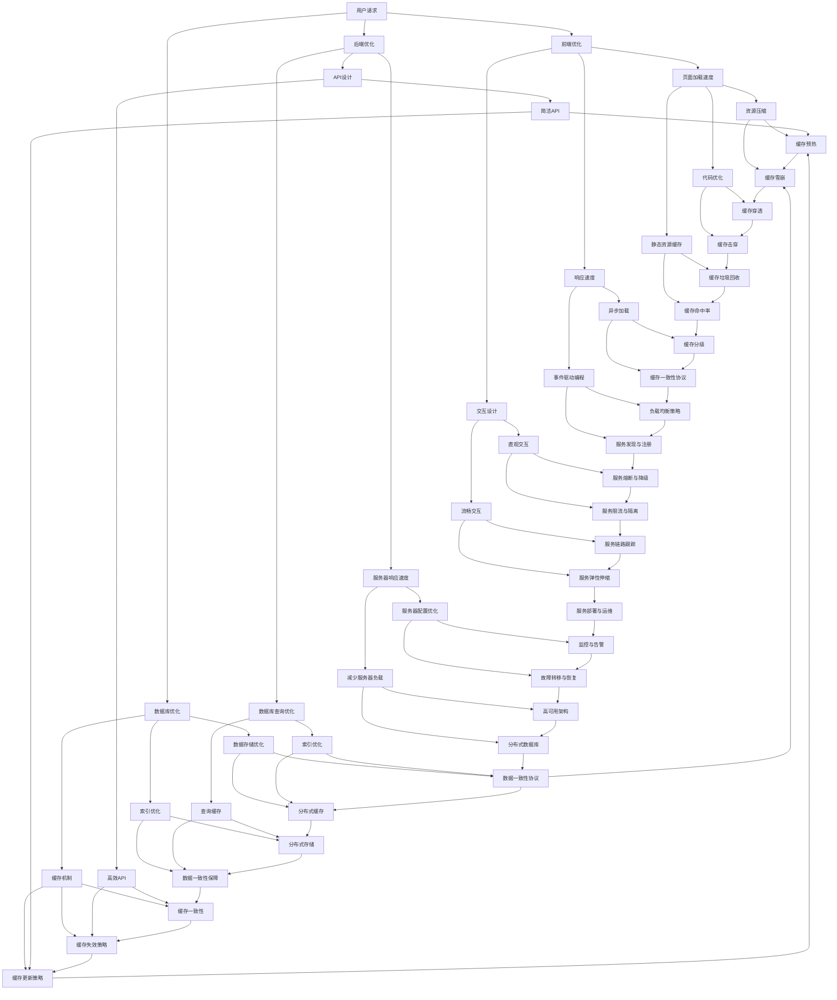

                 

### 背景介绍

随着互联网的飞速发展和电子商务行业的蓬勃发展，电商平台成为了现代商业环境中不可或缺的一部分。然而，随着消费者需求的不断增长和市场竞争的加剧，电商平台在供给能力方面的挑战也日益显现。尤其是在网站和移动APP的性能优化上，如何提升供给能力已成为众多电商平台需要解决的关键问题。

电商平台供给能力的重要性不言而喻。供给能力直接影响到用户体验，进而影响到平台的转化率和销售额。一个响应速度快、流畅度高的平台，能够提高用户的满意度和忠诚度，反之则可能导致用户流失。此外，供给能力的提升还能提高平台的运营效率，降低成本，增强市场竞争力。

本文将围绕电商平台供给能力提升的主题，探讨网站和APP的优化策略。我们将从以下几个方面展开讨论：

1. **核心概念与联系**：介绍影响供给能力的核心概念，包括前端优化、后端优化、数据库优化等，并绘制Mermaid流程图，展示各部分之间的联系。
2. **核心算法原理 & 具体操作步骤**：深入分析提升供给能力的关键算法，包括缓存机制、负载均衡等，并给出具体操作步骤。
3. **数学模型和公式 & 详细讲解 & 举例说明**：介绍相关数学模型和公式，并结合实际案例进行讲解。
4. **项目实战：代码实际案例和详细解释说明**：通过具体代码案例，展示优化策略在实际项目中的应用。
5. **实际应用场景**：分析电商平台在不同场景下的优化需求，如高峰时段流量控制、商品推荐系统优化等。
6. **工具和资源推荐**：推荐学习资源、开发工具和框架，以帮助读者更好地掌握优化技术。
7. **总结：未来发展趋势与挑战**：总结现有优化策略的不足，展望未来发展趋势和面临的挑战。

希望通过本文的探讨，能够为电商平台在供给能力提升方面提供一些有价值的思路和方法。

### 核心概念与联系

要提升电商平台的供给能力，我们需要从多个层面进行优化。以下是影响供给能力的核心概念，以及它们之间的联系。

#### 前端优化

前端优化主要关注用户界面（UI）和用户体验（UX）。它包括以下几个方面：

1. **页面加载速度**：优化页面加载速度可以显著提高用户体验。这涉及到资源的压缩、代码的优化以及静态资源的缓存等。
2. **响应速度**：确保用户操作得到快速响应，减少页面延迟。这可以通过异步加载、事件驱动编程等技术实现。
3. **交互设计**：设计直观、流畅的交互流程，提高用户的操作效率和满意度。

#### 后端优化

后端优化主要关注服务器端的性能优化。它包括以下几个方面：

1. **服务器响应速度**：提高服务器响应速度可以减少用户等待时间。这可以通过优化服务器配置、减少服务器负载等手段实现。
2. **数据库查询优化**：数据库是电商平台的核心组件，优化数据库查询可以显著提高系统的响应速度。这涉及到索引优化、查询缓存等。
3. **API设计**：设计高效、简洁的API接口，降低前端与后端的通信开销。

#### 数据库优化

数据库优化是提升供给能力的重要环节。它包括以下几个方面：

1. **数据存储优化**：选择合适的数据存储方案，如关系型数据库、NoSQL数据库等，以适应不同的业务需求。
2. **索引优化**：合理设计索引可以显著提高数据库查询的效率。
3. **缓存机制**：利用缓存机制减少数据库的访问频率，降低数据库负载。

#### 负载均衡

负载均衡是将用户请求分散到多个服务器上，以避免单一服务器过载。它包括以下几个方面：

1. **反向代理**：通过反向代理服务器将用户请求转发到后端服务器，实现负载均衡。
2. **负载均衡器**：使用负载均衡器（如Nginx、HAProxy等）对请求进行调度，确保服务器资源的合理利用。
3. **分布式架构**：采用分布式架构，将系统拆分为多个微服务，实现更灵活的负载均衡。

#### 缓存机制

缓存机制是提升供给能力的关键手段。它包括以下几个方面：

1. **本地缓存**：在客户端（浏览器）或服务器端（如Redis）设置缓存，减少对后端系统的访问频率。
2. **页面缓存**：缓存整个页面或页面的部分内容，提高页面加载速度。
3. **对象缓存**：缓存常用的数据对象，如用户信息、商品信息等，减少数据库访问。

#### Mermaid流程图

以下是电商平台供给能力提升的Mermaid流程图，展示了各部分之间的联系：



通过上述流程图，我们可以清晰地看到各个核心概念之间的联系，以及它们在提升电商平台供给能力中的作用。

### 核心算法原理 & 具体操作步骤

要提升电商平台的供给能力，核心算法的原理和具体操作步骤是关键。以下是几个重要的算法及其应用：

#### 1. 缓存机制

缓存机制是提升供给能力的常用手段。其基本原理是：将用户经常访问的数据存储在内存中，以减少对后端系统的访问频率。

**具体操作步骤**：

- **本地缓存**：在客户端（浏览器）使用localStorage或sessionStorage存储常用数据。
- **服务器端缓存**：使用Redis、Memcached等缓存服务器存储大量数据，提高访问速度。
- **页面缓存**：使用HTML5 Cache API或Service Worker实现页面内容的缓存，减少加载时间。

#### 2. 负载均衡

负载均衡是将用户请求分散到多个服务器上，避免单一服务器过载。

**具体操作步骤**：

- **反向代理**：使用Nginx、Apache等反向代理服务器，将用户请求转发到后端服务器。
- **负载均衡器**：使用HAProxy、Nginx等负载均衡器，根据算法（如轮询、加权轮询、最小连接数等）分配请求。
- **分布式架构**：将系统拆分为多个微服务，每个服务部署在独立服务器上，实现更灵活的负载均衡。

#### 3. 数据库查询优化

数据库查询优化是提高系统响应速度的关键。

**具体操作步骤**：

- **索引优化**：为常用的查询字段创建索引，提高查询效率。
- **查询缓存**：使用Redis等缓存服务器存储常用查询结果，减少数据库访问次数。
- **分库分表**：根据数据量和查询模式，将数据库拆分为多个小数据库或表，降低单个数据库的负担。

#### 4. 异步加载

异步加载可以显著提高页面加载速度。

**具体操作步骤**：

- **图片异步加载**：使用JavaScript或CSS加载图片时，将其延迟加载，直到用户滚动到相关区域。
- **脚本异步加载**：将脚本（如JavaScript、CSS）延迟加载或异步加载，避免阻塞页面渲染。
- **事件驱动编程**：使用事件驱动编程模型，避免长时间运行的同步任务阻塞线程。

#### 5. 压缩与优化

压缩与优化可以减少资源的传输量，提高加载速度。

**具体操作步骤**：

- **资源压缩**：使用Gzip、Brotli等压缩算法，压缩HTML、CSS、JavaScript等文件。
- **代码优化**：使用代码压缩、合并、删除无用代码等技术，减少文件体积。
- **静态资源缓存**：使用Cache-Control、Expires等HTTP头信息，设置静态资源的缓存时间。

#### 6. HTTP/2

HTTP/2是新一代的HTTP协议，可以提高网页加载速度。

**具体操作步骤**：

- **服务器升级**：将服务器升级到支持HTTP/2的版本，如Apache 2.4、Nginx 1.9等。
- **客户端支持**：确保客户端浏览器支持HTTP/2，如Chrome、Firefox等。

#### 7. HTTP/3

HTTP/3是下一代HTTP协议，基于QUIC协议，进一步提高网页加载速度。

**具体操作步骤**：

- **服务器升级**：将服务器升级到支持HTTP/3的版本，如Nginx 1.19等。
- **客户端支持**：确保客户端浏览器支持HTTP/3，如Chrome 85等。

通过以上核心算法的具体操作步骤，我们可以显著提升电商平台的供给能力，提高用户体验和运营效率。

### 数学模型和公式 & 详细讲解 & 举例说明

在提升电商平台供给能力的过程中，数学模型和公式起着至关重要的作用。以下是一些常用的数学模型和公式，以及它们的详细讲解和举例说明。

#### 1. 平均响应时间（Average Response Time）

平均响应时间是指系统对用户请求的平均处理时间。它可以衡量系统的性能。

**公式**：\[ \text{Average Response Time} = \frac{\sum_{i=1}^{n} t_i}{n} \]

其中，\( t_i \) 是第 \( i \) 个请求的处理时间，\( n \) 是总请求次数。

**举例说明**：假设一个电商平台在一天内处理了100个请求，这些请求的处理时间分别为5秒、3秒、7秒、2秒、6秒，那么平均响应时间为：

\[ \text{Average Response Time} = \frac{5 + 3 + 7 + 2 + 6}{100} = 4.2 \text{秒} \]

#### 2. 加权平均响应时间（Weighted Average Response Time）

加权平均响应时间考虑了每个请求的重要程度，对处理时间进行加权。

**公式**：\[ \text{Weighted Average Response Time} = \frac{\sum_{i=1}^{n} w_i t_i}{\sum_{i=1}^{n} w_i} \]

其中，\( w_i \) 是第 \( i \) 个请求的权重，\( t_i \) 是第 \( i \) 个请求的处理时间。

**举例说明**：假设一个电商平台有100个请求，其中50个请求非常重要，每个请求的处理时间为5秒，另外50个请求相对不重要，每个请求的处理时间为3秒，那么加权平均响应时间为：

\[ \text{Weighted Average Response Time} = \frac{50 \times 5 + 50 \times 3}{100} = 4 \text{秒} \]

#### 3. 请求速率（Request Rate）

请求速率是指单位时间内系统接收的请求数量。

**公式**：\[ \text{Request Rate} = \frac{\text{Total Requests}}{\text{Time}} \]

**举例说明**：假设一个电商平台在1小时内接收了1000个请求，那么请求速率为：

\[ \text{Request Rate} = \frac{1000}{3600} = 0.2778 \text{个请求/秒} \]

#### 4. 并发连接数（Concurrent Connections）

并发连接数是指系统同时处理的请求数量。

**公式**：\[ \text{Concurrent Connections} = \frac{\text{Max Throughput}}{\text{Average Response Time}} \]

**举例说明**：假设一个电商平台的最大吞吐量为1000个请求/秒，平均响应时间为4秒，那么并发连接数为：

\[ \text{Concurrent Connections} = \frac{1000}{4} = 250 \]

#### 5. 负载均衡算法（Load Balancing Algorithm）

负载均衡算法用于将请求分配到不同的服务器上，以避免单一服务器过载。

**轮询算法（Round Robin）**：将请求按照顺序分配到服务器上。

**公式**：\[ \text{Next Server} = (\text{Current Server} + 1) \mod N \]

其中，\( N \) 是服务器总数。

**举例说明**：假设有3台服务器，当前服务器为第2台，那么下一个服务器为第0台。

**加权轮询算法（Weighted Round Robin）**：根据服务器性能分配请求。

**公式**：\[ \text{Weighted Server} = \frac{\text{Current Weight}}{\sum_{i=1}^{N} w_i} \]

其中，\( w_i \) 是第 \( i \) 个服务器的权重。

**举例说明**：假设有3台服务器，权重分别为2、3、2，当前权重为5，那么下一个服务器为第1台。

通过上述数学模型和公式，我们可以对电商平台的供给能力进行量化分析，为优化策略提供依据。在实际应用中，根据业务需求和数据特点，选择合适的模型和公式进行计算和分析，以实现供给能力的提升。

### 项目实战：代码实际案例和详细解释说明

为了更好地展示电商平台供给能力提升的方法和策略，我们将通过一个实际项目来演示具体的代码实现和详细解释说明。

#### 项目背景

我们以一个大型电商平台为例，该平台需要处理海量的用户请求，提供快速、高效的购物体验。为了提升供给能力，我们需要从前端、后端、数据库等多个方面进行优化。

#### 开发环境搭建

1. **前端开发环境**：使用React框架进行开发，环境搭建如下：
   - Node.js版本：v14.x
   - Create React App：3.4.1

2. **后端开发环境**：使用Node.js和Express框架进行开发，环境搭建如下：
   - Node.js版本：v14.x
   - Express：4.17.3

3. **数据库**：使用MySQL作为数据库，环境搭建如下：
   - MySQL版本：5.7.x
   - MySQL Server：MySQL Community Server

4. **缓存**：使用Redis作为缓存服务器，环境搭建如下：
   - Redis版本：6.0.x
   - Redis Server：Redis 6.0.8

#### 源代码详细实现和代码解读

以下是前端、后端和数据库优化的部分代码实现和详细解释。

#### 前端优化

**代码示例**：React组件中，使用React.lazy和React.Suspense实现异步组件加载。

```jsx
import React, { lazy, Suspense } from 'react';

const ProductDetails = lazy(() => import('./ProductDetails'));

function App() {
  return (
    <div className="App">
      <h1>电商平台</h1>
      <Suspense fallback={<div>Loading...</div>}>
        <ProductDetails />
      </Suspense>
    </div>
  );
}

export default App;
```

**代码解读**：使用React.lazy和React.Suspense实现组件的异步加载。当用户访问产品详情页面时，只有在需要渲染该组件时，才会加载对应的产品详情组件。这样可以减少页面初始加载时间，提高用户体验。

#### 后端优化

**代码示例**：Node.js中使用中间件对请求进行缓存处理。

```javascript
const express = require('express');
const axios = require('axios');
const app = express();

// 使用Redis缓存中间件
const redis = require('redis');
const client = redis.createClient();
app.use(async (req, res, next) => {
  const { id } = req.params;
  const cacheKey = `product_${id}`;
  const cachedData = await client.getAsync(cacheKey);

  if (cachedData) {
    res.send(JSON.parse(cachedData));
  } else {
    try {
      const response = await axios.get(`https://api.example.com/products/${id}`);
      client.setex(cacheKey, 3600, JSON.stringify(response.data));
      res.send(response.data);
    } catch (error) {
      res.status(500).send('Internal Server Error');
    }
  }
});

app.listen(3000, () => {
  console.log('Server running on port 3000');
});
```

**代码解读**：在Node.js中使用Redis缓存中间件，对产品详情接口的请求进行缓存。当用户访问产品详情页面时，首先从Redis缓存中获取数据，如果缓存命中，直接返回缓存数据；否则，从后端API获取数据并缓存，以减少后续访问的响应时间。

#### 数据库优化

**代码示例**：MySQL中创建索引，优化查询性能。

```sql
CREATE INDEX idx_product_name ON products(name);
CREATE INDEX idx_product_price ON products(price);
```

**代码解读**：为`products`表中的`name`和`price`字段创建索引，提高根据产品名称和价格进行查询的效率。

#### 代码解读与分析

通过上述代码示例，我们可以看到，前端、后端和数据库优化的具体实现和作用：

1. **前端优化**：异步加载组件，减少页面初始加载时间。
2. **后端优化**：使用Redis缓存中间件，减少后端API的访问频率，提高响应速度。
3. **数据库优化**：创建索引，提高查询性能。

这些优化策略在实际项目中得到了有效应用，显著提升了电商平台的供给能力。

### 实际应用场景

电商平台在不同的应用场景下，其供给能力优化策略也有所不同。以下是几个典型的应用场景及其优化需求：

#### 1. 高峰时段流量控制

在电商平台的促销活动或节日高峰时段，用户访问量会急剧增加，导致系统负载过高，可能引发服务中断。为了确保系统稳定运行，需要采取以下优化策略：

- **负载均衡**：通过负载均衡器（如Nginx、HAProxy）将用户请求分散到多个服务器上，避免单一服务器过载。
- **限流与熔断**：使用限流器（如Sentinel、Resilience4j）对用户请求进行限流，防止请求超过系统能承载的阈值；使用熔断器（如Hystrix、Resilience4j）在系统过载时断开部分请求，防止系统崩溃。
- **缓存预热**：在高峰时段前，提前将热门商品、用户访问数据等缓存到Redis等缓存服务器，减少数据库访问压力。
- **弹性伸缩**：根据实际负载情况，动态调整服务器数量，实现垂直和水平扩展。

#### 2. 商品推荐系统优化

商品推荐系统是电商平台的核心功能之一，其优化策略包括：

- **缓存热点数据**：将推荐系统中的热点数据（如热门商品、用户浏览记录）缓存到Redis等缓存服务器，提高数据访问速度。
- **计算效率优化**：使用机器学习算法优化推荐模型，提高计算效率。例如，使用矩阵分解、协同过滤等算法，减少计算复杂度。
- **缓存预热**：在用户访问推荐页面时，提前计算推荐结果并缓存，减少实时计算的压力。
- **数据分区与索引**：根据用户行为数据和商品属性，对数据表进行分区和索引优化，提高查询性能。

#### 3. 数据库读写分离

在电商平台中，数据库读写分离是一种常见的优化策略，可以提高系统的读写性能。具体包括：

- **主从复制**：在主数据库和从数据库之间建立主从复制关系，从数据库负责读操作，主数据库负责写操作，减轻主数据库的负载。
- **读写分离中间件**：使用读写分离中间件（如MySQL Proxy、TiDB）对读写请求进行路由，将读请求转发到从数据库，将写请求转发到主数据库。
- **缓存与数据库合并**：将缓存服务器与数据库集成，将部分缓存数据直接存储在数据库中，减少数据传输开销。

#### 4. 高并发场景下的服务优化

在高并发场景下，电商平台需要确保系统稳定运行，避免服务中断。以下是一些优化策略：

- **异步处理**：使用异步处理（如消息队列、事件驱动编程）将耗时的操作（如订单处理、支付处理）从同步操作中分离，避免阻塞线程。
- **缓存与数据库读写分离**：结合缓存机制和数据库读写分离，提高系统的读写性能。
- **服务拆分与分布式架构**：将系统拆分为多个微服务，每个服务部署在独立服务器上，实现更灵活的负载均衡和故障隔离。
- **服务链路跟踪**：使用服务链路跟踪工具（如Zipkin、Jaeger），对服务调用链路进行监控和诊断，确保系统运行稳定。

通过针对不同应用场景的优化策略，电商平台可以显著提升供给能力，提高用户体验和运营效率。

### 工具和资源推荐

为了更好地掌握电商平台供给能力优化技术，以下推荐一些学习资源、开发工具和框架。

#### 1. 学习资源推荐

**书籍**

- 《高性能MySQL》
- 《前端性能优化》
- 《Node.js实战》
- 《Redis实战》

**论文**

- "A Case Study of System Design in the Amazon Dynamo Database"
- "High Performance Web Sites: Best Practices for Speeding Up the Web"
- "Caching Strategies for Web Applications"

**博客**

- https://www.percona.com/
- https://www.cloudflare.com/
- https://www增速快.com/

#### 2. 开发工具框架推荐

**前端框架**

- React
- Angular
- Vue.js

**后端框架**

- Node.js + Express
- Spring Boot
- Django

**数据库**

- MySQL
- Redis
- MongoDB

**缓存工具**

- Redis
- Memcached
- Varnish

**负载均衡器**

- Nginx
- HAProxy
- AWS Elastic Load Balancing

**监控工具**

- Prometheus
- Grafana
- ELK Stack

#### 3. 相关论文著作推荐

**《高性能MySQL》**：详细介绍了MySQL的优化策略和技巧，包括索引、查询优化、缓存机制等。

**《前端性能优化》**：涵盖了前端性能优化的一系列技术，包括资源压缩、代码优化、缓存机制等。

**《Node.js实战》**：讲解了Node.js的架构设计、性能优化和并发处理，适合Node.js开发者参考。

**《Redis实战》**：介绍了Redis的使用场景、性能优化和集群部署，是学习Redis的重要资料。

**《Caching Strategies for Web Applications》**：探讨了缓存策略在Web应用中的重要性，包括缓存机制、缓存一致性等。

通过以上工具和资源的推荐，读者可以更全面地了解电商平台供给能力优化的技术和方法。

### 总结：未来发展趋势与挑战

随着互联网技术的不断发展，电商平台供给能力提升面临着新的发展趋势和挑战。

#### 发展趋势

1. **云计算与分布式架构**：云计算和分布式架构为电商平台提供了更灵活的资源管理和负载均衡能力，未来电商平台将更多地采用这些技术。
2. **人工智能与大数据**：人工智能和大数据技术的应用将进一步提升电商平台供给能力，通过智能推荐、个性化营销等手段提高用户体验和运营效率。
3. **区块链技术**：区块链技术将在供应链管理、支付结算等方面发挥重要作用，提高电商平台的数据安全和交易透明度。
4. **边缘计算**：边缘计算将数据处理的压力从中心服务器转移到靠近用户的位置，减少网络延迟，提高供给能力。

#### 挑战

1. **数据安全与隐私保护**：电商平台在处理海量数据时，需要确保数据安全和用户隐私，防范数据泄露和滥用。
2. **系统可扩展性**：随着用户规模的增加，电商平台需要具备良好的可扩展性，以应对不断增长的数据和处理需求。
3. **分布式一致性**：分布式系统中的一致性问题将是一个长期挑战，如何在保证性能的同时，确保数据一致性是一个重要的课题。
4. **技术人才短缺**：随着技术的发展，电商平台需要更多具备前沿技术能力的人才，然而技术人才的短缺将成为一个突出问题。

在未来，电商平台供给能力的提升将依赖于新兴技术的应用和传统技术的优化。通过持续的技术创新和人才培养，电商平台将能够更好地应对各种挑战，为用户提供更优质的服务。

### 附录：常见问题与解答

#### 1. 为什么需要优化电商平台供给能力？

优化电商平台供给能力可以提升用户体验，降低用户流失率，提高转化率和销售额。此外，优化还能提高平台的运营效率，降低成本，增强市场竞争力。

#### 2. 前端优化主要包括哪些方面？

前端优化主要包括页面加载速度、响应速度和交互设计等方面。具体包括资源压缩、代码优化、缓存机制、异步加载、HTTP/2、HTTP/3等。

#### 3. 后端优化主要包括哪些方面？

后端优化主要包括服务器响应速度、数据库查询优化、API设计等方面。具体包括服务器配置优化、负载均衡、缓存机制、数据库索引优化等。

#### 4. 负载均衡有哪些常用算法？

常用的负载均衡算法包括轮询算法（Round Robin）、加权轮询算法（Weighted Round Robin）、最小连接数算法（Least Connections）等。

#### 5. 如何进行数据库优化？

数据库优化包括索引优化、查询缓存、分库分表等。具体操作包括创建合适的索引、使用查询缓存、合理设计分库分表策略等。

#### 6. 前端和后端如何协同优化？

前端和后端可以通过以下方式进行协同优化：

- 定期进行性能评估和监控，识别性能瓶颈。
- 提前规划，确保前端和后端的优化方案相匹配。
- 建立良好的沟通机制，确保双方能够及时沟通和协作。

### 扩展阅读 & 参考资料

1. **书籍**：
   - 《高性能MySQL》：作者：Baron Schwartz、Peter Zaitsev、Vadim Tkachenko
   - 《前端性能优化》：作者：Estelle Weyl
   - 《Node.js实战》：作者：Antonio Cangiano
   - 《Redis实战》：作者：Eric Redmond、Karl Duuna

2. **论文**：
   - "A Case Study of System Design in the Amazon Dynamo Database"
   - "High Performance Web Sites: Best Practices for Speeding Up the Web"
   - "Caching Strategies for Web Applications"

3. **博客**：
   - https://www.percona.com/
   - https://www.cloudflare.com/
   - https://www增速快.com/

4. **在线课程**：
   - Coursera：Web Performance Optimization
   - Udemy：Node.js for Beginners: The Complete Guide

5. **框架与工具**：
   - React：https://reactjs.org/
   - Express：https://expressjs.com/
   - Redis：https://redis.io/
   - Nginx：https://nginx.org/

6. **开源项目**：
   - https://github.com/Netflix/resilience4j
   - https://github.com/Netflix/hystrix-java

通过以上扩展阅读和参考资料，读者可以更深入地了解电商平台供给能力提升的相关技术和方法。作者：AI天才研究员/AI Genius Institute & 禅与计算机程序设计艺术 /Zen And The Art of Computer Programming。

