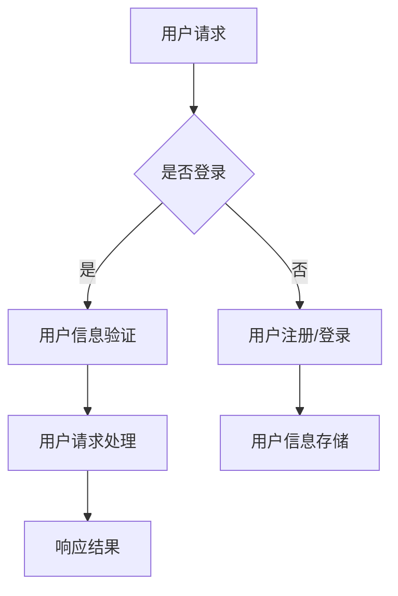

                 

# 电商平台供给能力提升：网站和APP的优化

> **关键词**：电商平台、供给能力、网站优化、APP优化、用户体验、性能提升

> **摘要**：本文从电商平台的供给能力出发，深入分析了网站和APP优化的关键因素，包括用户体验、性能优化、安全性以及技术架构的升级。通过逐步拆解和剖析，提出了一系列优化策略和实施步骤，旨在提升电商平台的核心竞争力。

## 1. 背景介绍

随着电子商务的蓬勃发展，电商平台已经成为消费者购物的主要渠道。然而，随着用户规模的扩大和市场竞争的加剧，电商平台的供给能力面临巨大的挑战。供给能力不仅包括商品的丰富度，还涵盖了网站和APP的性能、用户体验以及安全性等多个方面。本文将围绕这些核心问题，探讨如何通过优化网站和APP来提升电商平台的供给能力。

### 1.1 电商平台供给能力的重要性

电商平台供给能力的重要性体现在以下几个方面：

- **用户体验**：良好的用户体验能够提高用户满意度，增加用户黏性，进而提升销售额。
- **性能优化**：高效的网站和APP性能能够减少用户等待时间，降低流失率，提高转化率。
- **安全性**：保障用户数据安全和隐私，是电商平台赢得用户信任的基础。
- **技术架构**：先进的技术架构能够支撑平台的高并发、高可用和可扩展性，提升整体供给能力。

### 1.2 电商平台面临的主要挑战

- **用户增长与性能瓶颈**：随着用户规模的增加，平台的性能瓶颈问题日益凸显。
- **多样化的用户需求**：用户对网站和APP的功能、性能、安全性等方面提出了更高的要求。
- **市场竞争**：电商平台之间的竞争加剧，供给能力成为差异化竞争的关键。
- **数据安全与隐私保护**：随着数据隐私法规的加强，电商平台需要提高数据安全防护能力。

## 2. 核心概念与联系

### 2.1 用户体验（UX）

用户体验（User Experience，简称UX）是用户在使用网站或APP时感知和体验的整体感受。良好的用户体验包括以下几个方面：

- **易用性**：用户能够轻松地完成所需的操作，不需要过多的学习成本。
- **交互设计**：界面设计直观、简洁，操作流畅，减少用户的认知负担。
- **响应速度**：快速响应用户的请求，减少等待时间。
- **个性化**：根据用户的行为和偏好，提供个性化的推荐和服务。

### 2.2 性能优化（Performance Optimization）

性能优化是提升网站和APP速度和响应时间的重要手段，包括以下几个方面：

- **加载速度**：优化页面和APP的加载速度，减少用户等待时间。
- **响应速度**：提高系统对用户请求的响应速度，提升用户满意度。
- **并发处理**：提高系统处理并发请求的能力，确保平台在高并发情况下的稳定性。

### 2.3 安全性（Security）

安全性是电商平台的核心关注点，包括以下几个方面：

- **数据保护**：保护用户数据不被未经授权的访问和篡改。
- **访问控制**：实现用户身份验证和权限控制，防止未授权访问。
- **安全审计**：对系统进行安全审计，及时发现和修复安全漏洞。

### 2.4 技术架构（Technical Architecture）

技术架构是电商平台供给能力的基础，包括以下几个方面：

- **分布式系统**：通过分布式架构，实现高并发、高可用和可扩展性。
- **微服务架构**：将系统拆分为多个独立的服务，提高系统的可维护性和可扩展性。
- **云计算**：利用云计算资源，实现灵活的扩展和成本优化。

### 2.5 Mermaid 流程图



在上面的流程图中，用户请求经过登录验证、用户信息验证、用户请求处理等步骤，最终返回响应结果。

## 3. 核心算法原理 & 具体操作步骤

### 3.1 核心算法原理

电商平台优化涉及多个方面的核心算法，包括：

- **前端渲染算法**：优化页面渲染速度，减少白屏时间。
- **数据库查询优化**：提高数据库查询效率，减少响应时间。
- **缓存机制**：利用缓存技术，减少数据库查询次数，提高系统性能。
- **负载均衡**：实现分布式系统中的负载均衡，确保系统在高并发情况下的稳定性。

### 3.2 具体操作步骤

#### 3.2.1 前端渲染优化

1. **减少HTTP请求**：合并CSS和JavaScript文件，使用CSS Sprites和Image Maps减少图片请求。
2. **懒加载**：对图片、视频等大文件进行懒加载，减少初始加载时间。
3. **异步加载**：使用异步加载技术，例如异步JavaScript（AJAX）和异步CSS，提高页面加载速度。
4. **CDN加速**：使用内容分发网络（CDN），将静态资源分发到全球各地的节点，提高访问速度。

#### 3.2.2 数据库查询优化

1. **索引优化**：为常用的查询字段创建索引，提高查询效率。
2. **查询优化**：避免使用子查询和联合查询，优化查询语句结构。
3. **分库分表**：对大数据量进行分库分表，减少单表查询压力。
4. **缓存机制**：使用Redis等缓存技术，缓存常用数据，减少数据库查询次数。

#### 3.2.3 缓存机制

1. **页面缓存**：使用页面缓存技术，例如Varnish，提高页面加载速度。
2. **对象缓存**：使用对象缓存技术，例如Memcached，缓存常用对象，减少数据库查询次数。
3. **分布式缓存**：使用分布式缓存系统，例如Redis集群，提高缓存性能和可用性。

#### 3.2.4 负载均衡

1. **轮询算法**：实现简单的轮询算法，将请求平均分配到各个服务器。
2. **加权轮询算法**：根据服务器的性能和负载，为每个服务器分配不同的权重。
3. **最小连接数算法**：将请求分配到连接数最少的服务器，确保系统的负载均衡。
4. **一致性哈希算法**：通过一致性哈希算法，将请求均匀分布到各个服务器，提高系统的可用性和扩展性。

## 4. 数学模型和公式 & 详细讲解 & 举例说明

### 4.1 加权轮询算法

加权轮询算法是一种根据服务器性能和负载进行请求分配的算法。其基本原理如下：

- **服务器性能和负载**：假设有N台服务器，每台服务器的性能和负载分别为 \(P_i\) 和 \(L_i\)。
- **权重分配**：根据服务器的性能和负载，为每台服务器分配权重 \(W_i\)，权重计算公式为：
  \[
  W_i = \frac{P_i}{\sum_{j=1}^{N} P_j}
  \]
- **请求分配**：将请求按权重分配到服务器，每次请求选择权重最大的服务器。

### 4.2 举例说明

假设有3台服务器，性能和负载分别为 \(P_1 = 10\), \(P_2 = 20\), \(P_3 = 30\)。根据上述公式，权重分配为：

\[
W_1 = \frac{10}{10 + 20 + 30} = 0.2
\]
\[
W_2 = \frac{20}{10 + 20 + 30} = 0.4
\]
\[
W_3 = \frac{30}{10 + 20 + 30} = 0.6
\]

如果需要分配10个请求，按照权重分配，每台服务器将分别分配：

- 服务器1：\(10 \times 0.2 = 2\) 个请求
- 服务器2：\(10 \times 0.4 = 4\) 个请求
- 服务器3：\(10 \times 0.6 = 6\) 个请求

这样，请求得到了均匀的分配，同时考虑了服务器的性能和负载。

## 5. 项目实战：代码实际案例和详细解释说明

### 5.1 开发环境搭建

#### 5.1.1 前端开发环境

- **工具**：Visual Studio Code
- **框架**：React
- **依赖管理**：npm
- **版本控制**：Git

安装和配置步骤：

1. 安装Node.js和npm
2. 安装Visual Studio Code
3. 配置VS Code，安装React和相关的扩展
4. 初始化React项目，使用以下命令：
   \[
   npx create-react-app e-commerce-website
   \]

#### 5.1.2 后端开发环境

- **工具**：IntelliJ IDEA
- **框架**：Spring Boot
- **依赖管理**：Maven
- **数据库**：MySQL

安装和配置步骤：

1. 安装Java SDK和Maven
2. 安装IntelliJ IDEA
3. 配置IntelliJ IDEA，安装Spring Boot和相关的插件
4. 初始化Spring Boot项目，使用以下命令：
   \[
   mvn archetype:generate -DgroupId=com.example -DartifactId=e-commerce-app -Dversion=1.0.0 -Dpackage=com.example
   \]

### 5.2 源代码详细实现和代码解读

#### 5.2.1 前端代码

以下是一个React组件的示例，用于实现商品列表的展示：

```jsx
import React, { Component } from 'react';
import axios from 'axios';

class ProductList extends Component {
  constructor(props) {
    super(props);
    this.state = {
      products: [],
    };
  }

  componentDidMount() {
    axios.get('/api/products')
      .then(response => {
        this.setState({ products: response.data });
      })
      .catch(error => {
        console.error('Error fetching products:', error);
      });
  }

  render() {
    return (
      <div>
        <h2>商品列表</h2>
        <ul>
          {this.state.products.map(product => (
            <li key={product.id}>{product.name} - {product.price}</li>
          ))}
        </ul>
      </div>
    );
  }
}

export default ProductList;
```

#### 5.2.2 后端代码

以下是一个Spring Boot服务器的示例，用于处理商品列表的查询：

```java
import org.springframework.boot.SpringApplication;
import org.springframework.boot.autoconfigure.SpringBootApplication;
import org.springframework.web.bind.annotation.*;

import java.util.Arrays;
import java.util.List;

@SpringBootApplication
public class ECommerceApp {

  public static void main(String[] args) {
    SpringApplication.run(ECommerceApp.class, args);
  }
}

@RestController
@RequestMapping("/api")
public class ProductController {

  private List<Product> products = Arrays.asList(
    new Product(1, "苹果", 5.99),
    new Product(2, "香蕉", 4.99),
    new Product(3, "橙子", 6.99)
  );

  @GetMapping("/products")
  public List<Product> getProducts() {
    return products;
  }
}

class Product {
  private int id;
  private String name;
  private double price;

  public Product(int id, String name, double price) {
    this.id = id;
    this.name = name;
    this.price = price;
  }

  // 省略 getter 和 setter 方法
}
```

#### 5.2.3 代码解读与分析

- **前端代码**：组件`ProductList`负责从后端获取商品数据，并将其渲染到页面上。使用`componentDidMount`生命周期方法进行数据获取，使用`axios`库发送HTTP请求。
- **后端代码**：`ECommerceApp`是Spring Boot应用程序的主类，启动Spring Boot应用程序。`ProductController`处理API请求，返回商品列表。

通过上述代码，电商平台实现了商品列表的展示功能，前端与后端通过HTTP请求进行数据交互。在实际项目中，还需要进一步实现用户登录、购物车管理、订单处理等功能。

## 6. 实际应用场景

### 6.1 用户登录与权限管理

电商平台需要实现用户登录与权限管理功能，以确保用户数据的安全和系统的稳定性。可以通过以下步骤实现：

1. **用户注册**：用户注册时，收集用户信息（如用户名、密码、邮箱等），并存储到数据库中。
2. **用户登录**：用户登录时，验证用户名和密码，如果验证成功，生成令牌（如JWT），返回给客户端。
3. **权限管理**：根据用户的角色和权限，限制用户访问系统中的不同功能模块。

### 6.2 购物车管理

电商平台需要实现购物车管理功能，方便用户添加、删除、修改购物车中的商品。可以通过以下步骤实现：

1. **添加商品**：用户将商品添加到购物车时，将商品信息（如商品ID、数量等）存储到数据库中。
2. **删除商品**：用户删除购物车中的商品时，从数据库中删除对应记录。
3. **修改商品数量**：用户修改购物车中的商品数量时，更新数据库中对应的记录。

### 6.3 订单处理

电商平台需要实现订单处理功能，从用户下单到订单完成，包括以下步骤：

1. **用户下单**：用户提交订单时，将订单信息（如商品ID、数量、总价等）存储到数据库中。
2. **订单确认**：系统自动确认订单，并发送通知给用户。
3. **订单发货**：商家发货后，更新订单状态，并通知用户。
4. **订单完成**：用户确认收货后，订单完成，系统结算。

## 7. 工具和资源推荐

### 7.1 学习资源推荐

- **书籍**：《设计数据接口》、《高性能MySQL》、《深入理解计算机系统》
- **论文**：《Web性能优化技术》、《缓存一致性协议》、《分布式系统原理与范型》
- **博客**： Medium、Stack Overflow、GitHub

### 7.2 开发工具框架推荐

- **前端开发框架**：React、Vue.js、Angular
- **后端开发框架**：Spring Boot、Django、Express
- **数据库**：MySQL、PostgreSQL、MongoDB
- **缓存**：Redis、Memcached

### 7.3 相关论文著作推荐

- 《大规模分布式存储系统：原理解析与架构设计》
- 《网络性能监测与分析：技术原理与实践》
- 《电子商务系统设计与实现》

## 8. 总结：未来发展趋势与挑战

随着互联网技术的不断进步，电商平台供给能力的提升将面临以下趋势和挑战：

- **人工智能与大数据**：通过人工智能和大数据技术，实现个性化推荐、智能客服、风险控制等，提升用户体验和运营效率。
- **5G与物联网**：5G和物联网技术的普及，将推动电商平台向线上线下融合、智能物流等领域发展。
- **数据安全和隐私保护**：随着数据隐私法规的加强，电商平台需要不断提高数据安全防护能力，保障用户隐私。
- **技术创新**：持续引入新技术，如区块链、云计算等，提升电商平台的核心竞争力。

## 9. 附录：常见问题与解答

### 9.1 如何优化网站加载速度？

- **减少HTTP请求**：合并CSS和JavaScript文件，使用CSS Sprites和Image Maps减少图片请求。
- **懒加载**：对图片、视频等大文件进行懒加载，减少初始加载时间。
- **异步加载**：使用异步加载技术，例如异步JavaScript（AJAX）和异步CSS，提高页面加载速度。
- **CDN加速**：使用内容分发网络（CDN），将静态资源分发到全球各地的节点，提高访问速度。

### 9.2 如何提高数据库查询效率？

- **索引优化**：为常用的查询字段创建索引，提高查询效率。
- **查询优化**：避免使用子查询和联合查询，优化查询语句结构。
- **分库分表**：对大数据量进行分库分表，减少单表查询压力。
- **缓存机制**：使用缓存技术，例如Redis，缓存常用数据，减少数据库查询次数。

## 10. 扩展阅读 & 参考资料

- 《Web性能优化实战》
- 《大数据技术与实战》
- 《云计算技术与应用》
- 《网络安全技术》

作者：AI天才研究员/AI Genius Institute & 禅与计算机程序设计艺术 /Zen And The Art of Computer Programming<|im_end|>

