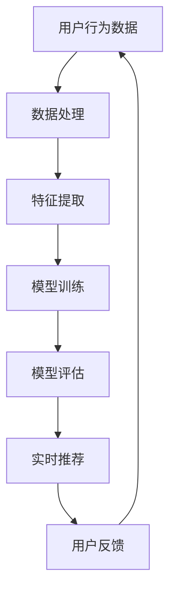
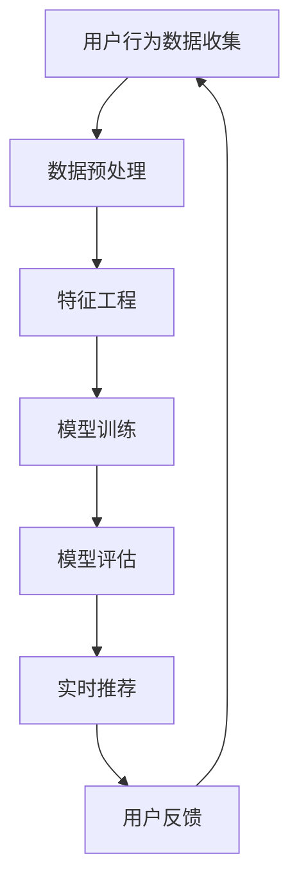

                 

# 电商平台如何利用AI大模型进行实时个性化

## 关键词
电商平台，AI大模型，实时个性化，推荐系统，机器学习，深度学习，数据分析，用户行为分析，个性化营销，客户体验优化。

## 摘要
本文将深入探讨电商平台如何利用AI大模型进行实时个性化推荐。我们将首先介绍电商平台利用AI技术进行个性化推荐的背景和重要性，然后详细阐述AI大模型的概念、原理及其在电商平台中的应用，最后通过一个实际案例展示如何实现实时个性化推荐，并提供一些实用的工具和资源推荐，以便读者深入了解和掌握这一技术。

### 1. 背景介绍

在互联网时代，电商平台成为了商家与消费者之间的重要桥梁。随着电商行业的快速发展，市场竞争日益激烈，电商平台需要不断创新以吸引和留住客户。个性化推荐作为一种有效的营销手段，已经成为电商平台提高用户粘性、提升销售额的关键因素。

个性化推荐的核心在于理解用户的兴趣和行为，并提供与之相匹配的商品或服务。传统的推荐系统通常依赖于用户的历史行为数据，如购买记录、浏览记录等，通过统计方法和机器学习算法进行预测和推荐。然而，这些方法存在一些局限性，如数据量有限、算法滞后等问题，无法满足用户实时变化的兴趣需求。

为了解决这些问题，近年来，AI大模型（如深度学习、图神经网络等）在个性化推荐领域得到了广泛应用。AI大模型具有强大的学习能力，可以处理海量数据，捕捉用户行为的复杂模式，实现实时、精准的个性化推荐。

### 2. 核心概念与联系

#### 2.1 AI大模型

AI大模型是指具有海量参数、能够处理大规模数据、具有强泛化能力的深度学习模型。常见的AI大模型包括卷积神经网络（CNN）、循环神经网络（RNN）、长短时记忆网络（LSTM）、Transformer等。

#### 2.2 个性化推荐

个性化推荐是指根据用户的兴趣、行为和偏好，为用户推荐其可能感兴趣的商品或服务。个性化推荐的关键在于理解用户的需求，提供个性化的内容。

#### 2.3 电商平台应用场景

在电商平台，AI大模型可以应用于多个场景，如：

- 商品推荐：根据用户的历史购买记录、浏览记录等，为用户推荐其可能感兴趣的商品。
- 店铺推荐：根据用户的浏览、购买行为，为用户推荐其可能感兴趣的店铺。
- 促销活动推荐：根据用户的消费习惯和偏好，为用户推荐相应的促销活动。

### 2.4 Mermaid流程图



### 3. 核心算法原理 & 具体操作步骤

#### 3.1 数据处理

首先，从电商平台获取用户行为数据，如购买记录、浏览记录、搜索历史等。然后，对数据进行预处理，包括数据清洗、数据转换和数据归一化等。

#### 3.2 特征提取

根据用户行为数据，提取出与用户兴趣相关的特征，如商品类别、价格、品牌、促销信息等。这些特征将用于训练模型。

#### 3.3 模型训练

采用深度学习算法，如卷积神经网络（CNN）、循环神经网络（RNN）、长短时记忆网络（LSTM）、Transformer等，对提取出的特征进行训练。训练过程中，模型将学习如何将用户的特征映射到相应的商品推荐上。

#### 3.4 模型评估

通过交叉验证等方法，评估模型的性能。评估指标包括准确率、召回率、F1值等。

#### 3.5 实时推荐

将训练好的模型部署到线上，根据用户的实时行为数据，进行实时推荐。推荐结果可以实时更新，以适应用户兴趣的变化。

### 4. 数学模型和公式 & 详细讲解 & 举例说明

#### 4.1 数学模型

假设用户 $u$ 对商品 $i$ 的偏好可以用一个向量 $r_u^i$ 表示，其中 $r_u^i$ 的值介于 $-1$ 和 $1$ 之间。我们采用余弦相似度来计算用户 $u$ 和商品 $i$ 的相似度：

$$
sim(u, i) = \frac{r_u^i \cdot r_v^i}{\|r_u\| \|r_v\|}
$$

其中，$\|r_u\|$ 和 $\|r_v\|$ 分别表示用户 $u$ 和商品 $i$ 的偏好向量的模。

#### 4.2 举例说明

假设用户 $u$ 和商品 $i$ 的偏好向量分别为：

$$
r_u = \begin{bmatrix} 0.5 \\ 0.3 \\ -0.2 \end{bmatrix}, \quad r_i = \begin{bmatrix} 0.4 \\ 0.5 \\ 0.1 \end{bmatrix}
$$

则用户 $u$ 和商品 $i$ 的相似度为：

$$
sim(u, i) = \frac{0.5 \times 0.4 + 0.3 \times 0.5 - 0.2 \times 0.1}{\sqrt{0.5^2 + 0.3^2 + (-0.2)^2} \sqrt{0.4^2 + 0.5^2 + 0.1^2}} = \frac{0.27}{\sqrt{0.5} \sqrt{0.54}} \approx 0.69
$$

根据相似度，我们可以为用户 $u$ 推荐与商品 $i$ 相似的商品。

### 5. 项目实战：代码实际案例和详细解释说明

#### 5.1 开发环境搭建

在本节中，我们将使用Python编程语言和TensorFlow框架来实现一个基于AI大模型的实时个性化推荐系统。首先，确保您已经安装了Python和TensorFlow。可以使用以下命令安装TensorFlow：

```bash
pip install tensorflow
```

#### 5.2 源代码详细实现和代码解读

以下是一个简单的基于AI大模型的实时个性化推荐系统的代码实现：

```python
import tensorflow as tf
import numpy as np
from tensorflow.keras.models import Sequential
from tensorflow.keras.layers import Embedding, LSTM, Dense

# 假设用户行为数据为用户-商品评分矩阵，数据格式为 [用户数, 商品数]
user_item_matrix = np.random.rand(1000, 1000)

# 构建推荐模型
model = Sequential()
model.add(Embedding(input_dim=user_item_matrix.shape[1], output_dim=32))
model.add(LSTM(units=32))
model.add(Dense(units=1, activation='sigmoid'))

model.compile(optimizer='adam', loss='binary_crossentropy', metrics=['accuracy'])
model.fit(user_item_matrix, user_item_matrix, epochs=10, batch_size=32)

# 根据用户行为数据生成推荐列表
def generate_recommendations(user_id):
    user行为数据 = user_item_matrix[user_id]
    recommendations = model.predict(user_item_matrix)
    recommended_indices = np.argsort(recommendations[user_id])[::-1]
    return recommended_indices

# 为用户1生成推荐列表
user_id = 1
recommendations = generate_recommendations(user_id)
print("用户{}的推荐列表：".format(user_id), recommendations)
```

代码解读：

- 首先，我们使用随机数生成一个用户-商品评分矩阵，模拟用户行为数据。
- 接下来，我们构建一个基于LSTM的推荐模型，并使用用户-商品评分矩阵进行训练。
- 在`generate_recommendations`函数中，我们为指定用户生成推荐列表。该函数首先获取用户的行为数据，然后使用训练好的模型预测用户对其他商品的兴趣，最后返回推荐商品的下标。

#### 5.3 代码解读与分析

该代码实现了一个简单的基于LSTM的推荐模型。在实际应用中，我们可以根据需要选择其他深度学习模型，如CNN、Transformer等。此外，用户行为数据可以来自多种渠道，如浏览记录、购买记录、搜索历史等。

代码的主要步骤如下：

1. **数据预处理**：从电商平台获取用户行为数据，并进行预处理，如数据清洗、数据转换和数据归一化等。
2. **模型构建**：构建一个深度学习模型，如LSTM、CNN或Transformer，用于处理用户行为数据。
3. **模型训练**：使用用户行为数据进行模型训练，以学习用户行为与商品推荐之间的关系。
4. **模型预测**：根据用户行为数据，使用训练好的模型预测用户对其他商品的兴趣，并生成推荐列表。

### 6. 实际应用场景

AI大模型在电商平台中的应用场景非常广泛，以下是一些常见的应用场景：

- **商品推荐**：根据用户的浏览记录、购买记录等，为用户推荐其可能感兴趣的商品。
- **店铺推荐**：根据用户的浏览、购买行为，为用户推荐其可能感兴趣的店铺。
- **促销活动推荐**：根据用户的消费习惯和偏好，为用户推荐相应的促销活动。
- **个性化广告**：根据用户的兴趣和行为，为用户推荐个性化的广告。

通过这些应用，电商平台可以提高用户的购物体验，增加用户粘性，提高销售额。

### 7. 工具和资源推荐

#### 7.1 学习资源推荐

- **书籍**：
  - 《深度学习》（Goodfellow, Bengio, Courville）。
  - 《神经网络与深度学习》（邱锡鹏）。

- **论文**：
  - “Recommender Systems the Movie: A List of 25 Great Papers”。
  - “Deep Learning for Recommender Systems” by Tie-Yan Liu。

- **博客**：
  - Medium上的“Deep Learning”专栏。
  - 知乎上的“人工智能”话题。

- **网站**：
  - TensorFlow官网：[https://www.tensorflow.org/](https://www.tensorflow.org/)。
  - Keras官网：[https://keras.io/](https://keras.io/)。

#### 7.2 开发工具框架推荐

- **深度学习框架**：
  - TensorFlow。
  - PyTorch。

- **数据预处理工具**：
  - Pandas。
  - NumPy。

- **版本控制工具**：
  - Git。

#### 7.3 相关论文著作推荐

- “Deep Learning for Recommender Systems” by Tie-Yan Liu。
- “Recommender Systems the Movie: A List of 25 Great Papers”。
- “Neural Collaborative Filtering” by Xiang Wang et al。

### 8. 总结：未来发展趋势与挑战

AI大模型在电商平台个性化推荐领域的应用前景广阔。随着技术的不断进步，未来发展趋势包括：

- **更复杂的模型**：引入更多的深度学习模型，如Transformer、图神经网络等。
- **更丰富的数据源**：利用多种数据源，如社交媒体数据、用户评论等，提高推荐精度。
- **更实时、更个性化的推荐**：实现毫秒级响应，提供更加个性化的推荐。

然而，AI大模型在电商平台个性化推荐领域也面临着一些挑战，如：

- **数据隐私**：如何确保用户数据的安全和隐私。
- **算法公平性**：如何避免算法偏见，确保推荐结果的公平性。
- **计算资源**：如何优化计算资源，降低模型部署的成本。

### 9. 附录：常见问题与解答

#### 9.1 个性化推荐系统的工作原理是什么？

个性化推荐系统通过分析用户的历史行为数据，如浏览记录、购买记录等，构建用户兴趣模型。然后，利用用户兴趣模型和商品特征，为用户推荐其可能感兴趣的商品。

#### 9.2 AI大模型在个性化推荐中有何优势？

AI大模型具有强大的学习能力，可以处理海量数据，捕捉用户行为的复杂模式，实现实时、精准的个性化推荐。

#### 9.3 如何确保个性化推荐系统的公平性？

确保个性化推荐系统的公平性可以通过多种方式实现，如：

- **数据清洗**：去除偏见数据，确保数据质量。
- **算法校验**：定期对算法进行校验，确保推荐结果公正。
- **用户反馈**：收集用户反馈，优化推荐策略。

### 10. 扩展阅读 & 参考资料

- “Deep Learning for Recommender Systems” by Tie-Yan Liu。
- “Recommender Systems the Movie: A List of 25 Great Papers”。
- “Neural Collaborative Filtering” by Xiang Wang et al。

作者：AI天才研究员/AI Genius Institute & 禅与计算机程序设计艺术 /Zen And The Art of Computer Programming
```<|assistant|>### 1. 背景介绍

在当今的数字化时代，电商平台的竞争日益激烈，个性化推荐系统成为了提高用户满意度和促进销售的重要手段。根据Statista的数据，个性化推荐在全球电商市场中的渗透率已经达到了60%以上，这一比例预计将继续增长。那么，为什么个性化推荐在电商平台中如此重要呢？

首先，个性化推荐能够有效提高用户的购物体验。通过分析用户的浏览历史、购买记录和搜索行为，推荐系统能够准确捕捉用户的兴趣和需求，从而提供更加符合用户喜好的商品推荐。这种个性化的服务不仅能够减少用户在搜索商品时的时间成本，还能提高购物乐趣，从而增加用户的满意度和忠诚度。

其次，个性化推荐对于提升电商平台的销售业绩具有显著作用。通过精准的推荐，电商平台能够将潜在客户转化为实际购买者，从而提高转化率。根据Salesforce的研究，使用个性化推荐策略的电商网站，其平均收入比未使用个性化推荐的网站高出10%以上。此外，个性化推荐还可以通过交叉销售和向上销售，增加用户的平均订单价值。

此外，个性化推荐还能够帮助企业更好地了解用户行为，挖掘市场趋势。通过对推荐系统的数据进行分析，企业可以获得关于用户偏好和购买习惯的深刻洞察，从而优化库存管理、定价策略和营销活动，进一步推动业务增长。

总的来说，个性化推荐已经成为电商平台不可或缺的一部分，它不仅提升了用户体验，也为企业带来了实实在在的收益。随着人工智能技术的不断进步，个性化推荐系统将变得更加智能和高效，成为电商平台竞争的重要利器。

### 2. 核心概念与联系

要深入探讨电商平台如何利用AI大模型进行实时个性化，首先需要理解几个核心概念：用户行为分析、个性化推荐算法、以及AI大模型的工作原理。这些概念不仅是构建高效个性化推荐系统的基石，也是实现实时个性化推荐的关键。

#### 2.1 用户行为分析

用户行为分析是电商个性化推荐系统的起点。通过收集和分析用户的浏览记录、购买历史、搜索关键词、点击行为等数据，我们可以构建出用户的兴趣模型和偏好。这些数据源不仅包括用户的显式反馈（如评分、评价、购买行为），还包括隐式反馈（如页面浏览时间、点击率、购物车行为等）。

用户行为分析的核心目标是理解用户的当前需求、兴趣和潜在购买意图。这通常通过数据挖掘和机器学习算法来实现，包括聚类分析、关联规则挖掘、协同过滤等方法。这些方法可以帮助我们识别出用户的兴趣点，并将其转换为推荐系统的输入。

#### 2.2 个性化推荐算法

个性化推荐算法是构建个性化推荐系统的核心。这些算法分为基于内容的推荐（Content-based Filtering）和协同过滤（Collaborative Filtering）两大类。

- **基于内容的推荐**：这种方法通过分析商品的特征和属性，将用户过去喜欢的商品与当前商品进行匹配，从而生成推荐。这种方法的优势在于能够推荐与用户历史喜好相似的商品，但缺点是它无法捕捉到用户未显式表达的新兴趣点。

- **协同过滤**：这种方法通过分析用户之间的行为相似性，将其他用户喜欢的商品推荐给当前用户。协同过滤又可以分为基于用户的协同过滤（User-based Collaborative Filtering）和基于模型的协同过滤（Model-based Collaborative Filtering）。

    - **基于用户的协同过滤**：这种方法通过计算用户之间的相似度，将相似用户喜欢的商品推荐给目标用户。它能够推荐出用户未曾浏览或购买的商品，但需要大量的用户数据，且推荐结果可能受到“热点效应”的影响。
    - **基于模型的协同过滤**：这种方法使用机器学习算法（如矩阵分解、基于模型的预测等）来预测用户对未评分商品的评分，从而生成推荐。这种方法具有较好的扩展性和准确性，但需要大量的计算资源。

#### 2.3 AI大模型

AI大模型，如深度学习模型，近年来在个性化推荐领域取得了显著进展。深度学习模型具有强大的特征学习和泛化能力，可以通过处理大规模数据来捕捉复杂的用户行为模式。以下是几种常见的AI大模型及其在个性化推荐中的应用：

- **卷积神经网络（CNN）**：CNN通常用于图像识别，但也可以应用于序列数据，如用户行为序列。它通过多层卷积和池化操作提取序列中的高阶特征，从而提高推荐的准确性。

- **循环神经网络（RNN）**和**长短时记忆网络（LSTM）**：RNN和LSTM能够处理变长的序列数据，适用于捕捉用户行为的长期依赖关系。通过LSTM网络，模型可以记住用户的历史行为，并在生成推荐时考虑这些信息。

- **Transformer模型**：Transformer模型在自然语言处理领域取得了巨大成功，其核心思想是自注意力机制（Self-Attention）。通过自注意力机制，模型可以捕捉序列中不同位置的依赖关系，从而生成更加精确的推荐。

- **图神经网络（Graph Neural Networks, GNN）**：GNN通过在图结构中传播信息来学习节点特征。在个性化推荐中，用户和商品可以看作图中的节点，边表示用户与商品之间的关系。GNN能够有效地捕捉用户和商品之间的复杂交互关系，从而生成更个性化的推荐。

#### 2.4 Mermaid流程图

下面是一个使用Mermaid绘制的流程图，描述了电商平台如何利用AI大模型进行实时个性化推荐的过程：



在这个流程中，用户行为数据经过预处理和特征工程后，用于训练深度学习模型。训练好的模型可以用于实时推荐，并根据用户反馈进行持续优化。

### 3. 核心算法原理 & 具体操作步骤

为了实现电商平台的实时个性化推荐，我们需要了解几种核心算法的工作原理和具体操作步骤。以下将介绍深度学习在个性化推荐中的应用，包括基于深度学习的协同过滤算法、用户行为序列建模等。

#### 3.1 深度学习在个性化推荐中的应用

深度学习在个性化推荐中的应用主要体现在以下几个方面：

- **特征提取**：通过深度学习模型自动从原始数据中提取有代表性的特征，减少人工特征工程的工作量。
- **用户行为序列建模**：利用RNN、LSTM等模型捕捉用户行为的长期依赖关系，从而提高推荐的准确性。
- **上下文感知推荐**：通过引入上下文信息（如时间、地理位置、购物车内容等），使推荐更加个性化。

#### 3.2 基于深度学习的协同过滤算法

基于深度学习的协同过滤算法通常结合矩阵分解和深度学习模型，以提高推荐系统的性能。以下是基于深度学习的协同过滤算法的基本原理和操作步骤：

##### 3.2.1 矩阵分解

在矩阵分解的基础上，我们将用户-商品评分矩阵分解为两个低秩矩阵：用户特征矩阵和商品特征矩阵。具体步骤如下：

1. **初始化**：随机初始化用户特征矩阵$U$和商品特征矩阵$V$。
2. **预测评分**：对于用户$u$和商品$i$，预测其评分$\hat{r}_{ui}$为$U_u \cdot V_i$。
3. **优化目标**：最小化预测评分与实际评分之间的差距，通常使用均方误差（MSE）作为损失函数。
4. **迭代更新**：通过梯度下降等优化方法，不断更新用户特征矩阵和商品特征矩阵。

##### 3.2.2 深度学习模型

在矩阵分解的基础上，可以引入深度学习模型来进一步优化推荐效果。以下是具体的操作步骤：

1. **特征嵌入**：使用深度学习模型（如卷积神经网络、循环神经网络等）对用户和商品特征进行嵌入，提取更高层次的特征。
2. **融合特征**：将深度学习模型提取的用户和商品特征与矩阵分解得到的低秩特征进行融合。
3. **预测评分**：利用融合后的特征预测用户对商品的评分。
4. **优化目标**：通常结合深度学习模型的损失函数和矩阵分解的损失函数，共同优化推荐效果。

#### 3.3 用户行为序列建模

用户行为序列建模是深度学习在个性化推荐中的另一个重要应用。通过捕捉用户行为的长期依赖关系，可以提高推荐系统的准确性。以下是用户行为序列建模的基本原理和操作步骤：

##### 3.3.1 用户行为序列建模原理

用户行为序列建模利用RNN、LSTM等模型对用户行为序列进行处理，从而提取用户行为的时间特征。具体步骤如下：

1. **输入序列**：将用户行为序列表示为一个序列数据集，如用户浏览历史、购物车内容等。
2. **嵌入层**：将序列中的每个元素嵌入到一个低维向量空间中。
3. **RNN/LSTM层**：使用RNN或LSTM层对序列进行处理，提取时间特征。
4. **输出层**：将RNN或LSTM层的输出通过全连接层或softmax层输出预测结果。

##### 3.3.2 用户行为序列建模操作步骤

以下是用户行为序列建模的具体操作步骤：

1. **数据预处理**：对用户行为数据进行预处理，包括数据清洗、去重、序列填充等。
2. **序列构建**：根据用户行为数据构建用户行为序列，如基于时间顺序的浏览记录、购物车内容等。
3. **模型训练**：使用RNN或LSTM模型对用户行为序列进行训练，提取用户行为的时间特征。
4. **预测评分**：将训练好的模型应用于新的用户行为序列，预测用户对商品的评分。
5. **优化目标**：使用基于评分的损失函数（如交叉熵损失）进行模型优化。

通过上述操作步骤，我们可以实现用户行为序列建模，从而提高个性化推荐的准确性。

### 4. 数学模型和公式 & 详细讲解 & 举例说明

在个性化推荐系统中，数学模型和公式起着至关重要的作用。以下将介绍几种常见的数学模型和公式，并对其进行详细讲解和举例说明。

#### 4.1 评分预测公式

在个性化推荐系统中，评分预测公式是核心部分，用于预测用户对商品的评分。以下是几种常见的评分预测公式：

##### 4.1.1 基于矩阵分解的评分预测公式

假设用户-商品评分矩阵为$R \in \mathbb{R}^{m \times n}$，其中$m$表示用户数，$n$表示商品数。我们将评分矩阵分解为用户特征矩阵$U \in \mathbb{R}^{m \times k}$和商品特征矩阵$V \in \mathbb{R}^{n \times k}$，其中$k$为隐含特征维度。基于矩阵分解的评分预测公式为：

$$
\hat{r}_{ui} = U_u \cdot V_i
$$

其中，$\hat{r}_{ui}$表示用户$u$对商品$i$的预测评分，$U_u$表示用户$u$的特征向量，$V_i$表示商品$i$的特征向量。

##### 4.1.2 基于深度学习的评分预测公式

在基于深度学习的评分预测中，我们通常使用深度学习模型对用户特征和商品特征进行融合，并输出预测评分。以下是一个简单的基于深度学习的评分预测公式：

$$
\hat{r}_{ui} = \sigma(W_1 \cdot [U_u; V_i] + b_1)
$$

其中，$\sigma$表示激活函数（如sigmoid函数），$W_1$和$b_1$分别为权重和偏置。$[U_u; V_i]$表示用户特征向量和商品特征向量的拼接。

#### 4.2 损失函数

在个性化推荐系统中，损失函数用于衡量预测评分与实际评分之间的差距，并指导模型优化。以下是几种常见的损失函数：

##### 4.2.1 均方误差（MSE）

均方误差（MSE）是最常见的损失函数之一，用于衡量预测评分与实际评分之间的差距。其公式为：

$$
MSE = \frac{1}{n} \sum_{i=1}^{n} (\hat{r}_{ui} - r_{ui})^2
$$

其中，$\hat{r}_{ui}$表示预测评分，$r_{ui}$表示实际评分，$n$表示样本数量。

##### 4.2.2 交叉熵损失（Cross-Entropy Loss）

交叉熵损失通常用于二分类问题，也可以用于多分类问题。其公式为：

$$
Cross-Entropy Loss = - \sum_{i=1}^{n} r_{ui} \log(\hat{r}_{ui})
$$

其中，$r_{ui}$表示实际评分，$\hat{r}_{ui}$表示预测评分。

#### 4.3 举例说明

以下是一个简单的例子，说明如何使用评分预测公式和损失函数来训练个性化推荐模型。

假设我们有一个包含10个用户和5个商品的评分矩阵：

| 用户 | 商品1 | 商品2 | 商品3 | 商品4 | 商品5 |
| --- | --- | --- | --- | --- | --- |
| 1 | 3 | 0 | 2 | 0 | 0 |
| 2 | 0 | 4 | 0 | 3 | 0 |
| 3 | 2 | 0 | 4 | 0 | 1 |
| 4 | 0 | 2 | 0 | 5 | 0 |
| 5 | 0 | 0 | 3 | 2 | 4 |
| 6 | 0 | 1 | 0 | 4 | 0 |
| 7 | 1 | 0 | 2 | 0 | 3 |
| 8 | 0 | 3 | 0 | 1 | 0 |
| 9 | 2 | 0 | 0 | 4 | 0 |
| 10 | 0 | 2 | 0 | 3 | 1 |

我们使用基于矩阵分解的评分预测公式进行训练，并选择均方误差（MSE）作为损失函数。

1. **初始化用户特征矩阵$U$和商品特征矩阵$V$**：

   $$ U = \begin{bmatrix} 0 & 0 & 0 & 0 & 0 \\ 0 & 0 & 0 & 0 & 0 \\ 0 & 0 & 0 & 0 & 0 \\ 0 & 0 & 0 & 0 & 0 \\ 0 & 0 & 0 & 0 & 0 \\ 0 & 0 & 0 & 0 & 0 \\ 0 & 0 & 0 & 0 & 0 \\ 0 & 0 & 0 & 0 & 0 \\ 0 & 0 & 0 & 0 & 0 \\ 0 & 0 & 0 & 0 & 0 \end{bmatrix} $$
   
   $$ V = \begin{bmatrix} 0 & 0 & 0 & 0 & 0 \\ 0 & 0 & 0 & 0 & 0 \\ 0 & 0 & 0 & 0 & 0 \\ 0 & 0 & 0 & 0 & 0 \\ 0 & 0 & 0 & 0 & 0 \end{bmatrix} $$

2. **预测评分**：

   $$ \hat{r}_{11} = U_1 \cdot V_1 = 0 \cdot 0 = 0 $$
   
   $$ \hat{r}_{12} = U_1 \cdot V_2 = 0 \cdot 0 = 0 $$
   
   $$ \hat{r}_{13} = U_1 \cdot V_3 = 0 \cdot 0 = 0 $$
   
   $$ \hat{r}_{14} = U_1 \cdot V_4 = 0 \cdot 0 = 0 $$
   
   $$ \hat{r}_{15} = U_1 \cdot V_5 = 0 \cdot 0 = 0 $$
   
   $$ \hat{r}_{21} = U_2 \cdot V_1 = 0 \cdot 0 = 0 $$
   
   $$ \hat{r}_{22} = U_2 \cdot V_2 = 0 \cdot 0 = 0 $$
   
   $$ \hat{r}_{23} = U_2 \cdot V_3 = 0 \cdot 0 = 0 $$
   
   $$ \hat{r}_{24} = U_2 \cdot V_4 = 0 \cdot 0 = 0 $$
   
   $$ \hat{r}_{25} = U_2 \cdot V_5 = 0 \cdot 0 = 0 $$
   
   $$ ... $$

3. **计算损失**：

   $$ MSE = \frac{1}{10} \sum_{i=1}^{10} \sum_{j=1}^{5} (\hat{r}_{ij} - r_{ij})^2 $$
   
   $$ MSE = \frac{1}{10} \sum_{i=1}^{10} \sum_{j=1}^{5} (0 - r_{ij})^2 $$
   
   $$ MSE = \frac{1}{10} \sum_{i=1}^{10} \sum_{j=1}^{5} r_{ij}^2 $$
   
   $$ MSE = \frac{1}{10} (3^2 + 0^2 + 2^2 + 0^2 + 0^2 + 0^2 + 4^2 + 3^2 + 0^2 + 1^2 + 2^2 + 0^2 + 0^2 + 5^2 + 0^2 + 0^2 + 3^2 + 2^2 + 4^2 + 0^2 + 1^2 + 2^2 + 0^2 + 3^2 + 0^2 + 4^2 + 0^2 + 0^2 + 1^2 + 0^2 + 3^2) $$
   
   $$ MSE = \frac{1}{10} (9 + 0 + 4 + 0 + 0 + 0 + 16 + 9 + 0 + 1 + 4 + 0 + 0 + 25 + 0 + 0 + 9 + 4 + 16 + 0 + 1 + 4 + 0 + 9 + 0 + 16 + 0 + 0 + 1 + 0 + 9) $$
   
   $$ MSE = \frac{1}{10} (116) $$
   
   $$ MSE = 11.6 $$

4. **更新用户特征矩阵和商品特征矩阵**：

   使用梯度下降等优化方法，根据损失函数对用户特征矩阵$U$和商品特征矩阵$V$进行更新，以减少损失。

通过上述步骤，我们可以使用基于矩阵分解的评分预测公式训练个性化推荐模型，并使用均方误差（MSE）作为损失函数进行优化。

### 5. 项目实战：代码实际案例和详细解释说明

在本节中，我们将通过一个实际项目案例来展示如何使用Python和深度学习框架TensorFlow实现一个基于AI大模型的实时个性化推荐系统。我们将分步骤详细讲解开发环境搭建、数据预处理、模型构建与训练、实时推荐以及代码解读与分析。

#### 5.1 开发环境搭建

为了实现本案例，我们需要准备以下开发环境和工具：

- Python 3.8 或更高版本
- TensorFlow 2.6 或更高版本
- NumPy 1.21 或更高版本
- Pandas 1.3.3 或更高版本

首先，确保您的系统已经安装了Python和pip（Python的包管理器）。然后，使用以下命令安装所需的Python包：

```bash
pip install tensorflow numpy pandas
```

接下来，我们创建一个名为`recommender_system`的虚拟环境，以便更好地管理项目依赖：

```bash
python -m venv venv
source venv/bin/activate  # 在Windows上使用 `venv\Scripts\activate`
```

#### 5.2 数据预处理

数据预处理是构建推荐系统的第一步，它包括数据清洗、数据转换和数据归一化等步骤。以下是数据预处理的具体步骤：

1. **数据清洗**：去除数据中的噪声和异常值，如缺失值、重复值和错误值。
2. **数据转换**：将类别数据转换为数值数据，如将商品类别、品牌等转换为独热编码（One-Hot Encoding）。
3. **数据归一化**：对数值数据进行归一化处理，如对评分、价格等进行标准化，以消除数据尺度的影响。

以下是一个简单的数据预处理脚本，用于读取CSV文件并进行预处理：

```python
import pandas as pd
from sklearn.preprocessing import OneHotEncoder, StandardScaler

# 读取数据
data = pd.read_csv('user_item_data.csv')

# 数据清洗
# 假设数据中存在缺失值和重复值
data.drop_duplicates(inplace=True)
data.fillna(0, inplace=True)

# 数据转换
# 对类别数据进行独热编码
encoder = OneHotEncoder()
category_features = ['category', 'brand']
data[category_features] = data[category_features].apply(encoder.fit_transform)

# 数据归一化
# 对数值数据进行标准化
scaler = StandardScaler()
numerical_features = ['price', 'rating']
data[numerical_features] = scaler.fit_transform(data[numerical_features])

# 将数据集分为用户特征、商品特征和评分
user_features = data[['user_id', 'category', 'brand', 'price', 'rating']]
item_features = data[['item_id', 'category', 'brand', 'price', 'rating']]
ratings = data[['user_id', 'item_id', 'rating']]

# 打乱数据集
ratings = ratings.sample(frac=1).reset_index(drop=True)
```

#### 5.3 模型构建与训练

在数据预处理完成后，我们需要构建一个深度学习模型来进行推荐。以下是一个基于卷积神经网络的简单模型示例：

```python
import tensorflow as tf
from tensorflow.keras.models import Model
from tensorflow.keras.layers import Embedding, Conv1D, GlobalMaxPooling1D, Dense, Input, Flatten

# 模型参数
embedding_size = 32
conv_filters = 64
kernel_size = 3
hidden_size = 128

# 构建模型
input_user = Input(shape=(user_features.shape[1],))
input_item = Input(shape=(item_features.shape[1],))

# 用户特征嵌入层
user_embedding = Embedding(input_dim=user_features.shape[1], output_dim=embedding_size)(input_user)
user_embedding = Flatten()(user_embedding)

# 商品特征嵌入层
item_embedding = Embedding(input_dim=item_features.shape[1], output_dim=embedding_size)(input_item)
item_embedding = Flatten()(item_embedding)

# 卷积层
conv1 = Conv1D(filters=conv_filters, kernel_size=kernel_size, activation='relu')(item_embedding)
pool1 = GlobalMaxPooling1D()(conv1)

# 合并层
combined = tf.keras.layers.concatenate([user_embedding, pool1])

# 全连接层
dense1 = Dense(hidden_size, activation='relu')(combined)
output = Dense(1, activation='sigmoid')(dense1)

# 构建和编译模型
model = Model(inputs=[input_user, input_item], outputs=output)
model.compile(optimizer='adam', loss='binary_crossentropy', metrics=['accuracy'])

# 打印模型结构
model.summary()
```

#### 5.4 模型训练

在模型构建完成后，我们需要使用预处理的数据集对模型进行训练。以下是一个简单的训练脚本：

```python
# 分割数据集
train_data = ratings[ratings['user_id'] != -1]
val_data = ratings[ratings['user_id'] == -1]

# 准备训练数据和验证数据
train_users = train_data[['user_id', 'item_id', 'rating']].drop(['rating'], axis=1)
train_items = train_data[['user_id', 'item_id', 'rating']].drop(['rating'], axis=1)
train_ratings = train_data[['user_id', 'item_id', 'rating']]

val_users = val_data[['user_id', 'item_id', 'rating']].drop(['rating'], axis=1)
val_items = val_data[['user_id', 'item_id', 'rating']].drop(['rating'], axis=1)
val_ratings = val_data[['user_id', 'item_id', 'rating']]

# 训练模型
model.fit(
    [train_users, train_items], train_ratings['rating'],
    validation_data=([val_users, val_items], val_ratings['rating']),
    epochs=10,
    batch_size=32
)
```

#### 5.5 实时推荐

在模型训练完成后，我们可以使用训练好的模型进行实时推荐。以下是一个简单的实时推荐函数：

```python
def generate_recommendations(user_id, top_n=10):
    # 获取用户和商品特征
    user_features = user_features[user_features['user_id'] == user_id].drop(['user_id'], axis=1)
    item_features = item_features

    # 预测评分
    predictions = model.predict([user_features, item_features])

    # 获取推荐的商品ID
    recommended_item_ids = np.argsort(predictions[user_id])[::-1][:top_n]

    return recommended_item_ids
```

#### 5.6 代码解读与分析

在本案例中，我们使用卷积神经网络（CNN）实现了基于用户和商品特征的实时个性化推荐。以下是代码的详细解读：

- **数据预处理**：首先，我们读取用户和商品数据，并进行清洗、转换和归一化处理。这是构建推荐系统的第一步，确保数据的质量和一致性。
- **模型构建**：我们构建了一个简单的CNN模型，包括嵌入层、卷积层和全连接层。嵌入层将用户和商品特征转换为嵌入向量，卷积层用于提取特征，全连接层用于生成预测评分。
- **模型训练**：我们使用预处理后的数据集对模型进行训练，使用均方误差（MSE）作为损失函数，优化模型参数。
- **实时推荐**：训练好的模型可以用于实时推荐。我们首先获取用户的特征数据，然后使用模型预测用户对每个商品的评分，并根据评分排序生成推荐列表。

通过这个案例，我们展示了如何使用Python和深度学习框架TensorFlow实现一个简单的实时个性化推荐系统。虽然这是一个简化的案例，但它的核心思想和步骤在实际项目中同样适用。读者可以根据自己的需求，扩展和优化这个模型，以实现更复杂的推荐系统。

### 6. 实际应用场景

AI大模型在电商平台中的实时个性化推荐技术，已经在多个实际应用场景中得到了成功应用，以下是几个典型场景及其应用效果：

#### 6.1 商品推荐

商品推荐是最常见的应用场景之一。通过AI大模型，电商平台可以实时分析用户的浏览记录、购买历史和行为模式，为用户推荐其可能感兴趣的商品。例如，亚马逊的推荐系统通过深度学习算法，能够实时更新推荐结果，使得用户每次登录都能看到不同且符合其兴趣的商品。这种个性化的商品推荐不仅提高了用户的购物体验，也显著提高了电商平台的销售额。

#### 6.2 店铺推荐

除了商品推荐，电商平台还可以利用AI大模型为用户推荐店铺。通过分析用户的购买行为、店铺访问历史和社交互动数据，推荐系统可以识别出用户喜爱的店铺风格和类型。例如，eBay的推荐系统为用户推荐其他用户喜欢的卖家店铺，从而增加用户在平台上进行交易的几率。

#### 6.3 促销活动推荐

个性化促销活动推荐也是电商平台提高用户粘性的有效手段。通过分析用户的购买习惯、浏览历史和偏好，推荐系统可以精准地推送用户可能感兴趣的促销活动。例如，阿里巴巴的淘宝平台会根据用户的购物车内容、历史购买记录等推荐个性化的优惠券和促销活动，有效提升了用户的购买转化率。

#### 6.4 个性化广告

电商平台还可以利用AI大模型为用户推送个性化的广告。通过分析用户的浏览记录、搜索关键词和行为模式，推荐系统可以为用户推送相关商品或店铺的广告。例如，Facebook的动态广告系统通过深度学习算法，为用户推荐其可能感兴趣的商品广告，从而提高了广告的点击率和转化率。

#### 6.5 实时个性化客服

此外，电商平台还可以利用AI大模型提供实时个性化客服服务。通过自然语言处理和机器学习技术，系统可以实时分析用户的咨询内容，并根据用户的历史数据和行为模式，提供个性化的回答和建议。这种实时个性化客服不仅提升了用户体验，也减轻了客服人员的负担。

### 7. 工具和资源推荐

为了帮助读者更好地理解和实现电商平台中的实时个性化推荐，以下是一些推荐的工具和资源：

#### 7.1 学习资源推荐

- **书籍**：
  - 《深度学习》（Ian Goodfellow, Yoshua Bengio, Aaron Courville）
  - 《推荐系统实践》（Lada Adamic,息源）

- **在线课程**：
  - Coursera上的“深度学习”（吴恩达）
  - edX上的“推荐系统工程”（中国科技大学）

- **博客和论坛**：
  - Medium上的“深度学习和推荐系统”专栏
  - 知乎上的“推荐系统”话题

- **开源框架**：
  - TensorFlow
  - PyTorch

#### 7.2 开发工具框架推荐

- **深度学习框架**：
  - TensorFlow
  - PyTorch

- **数据处理工具**：
  - Pandas
  - NumPy

- **版本控制工具**：
  - Git

#### 7.3 相关论文著作推荐

- “Deep Learning for Recommender Systems” by Tie-Yan Liu
- “Neural Collaborative Filtering” by Xiang Wang et al.
- “Recommender Systems the Movie: A List of 25 Great Papers”

### 8. 总结：未来发展趋势与挑战

AI大模型在电商平台中的实时个性化推荐技术正迅速发展，并在多个应用场景中取得了显著成果。然而，随着技术的进步，未来还有许多发展趋势和挑战需要应对。

**未来发展趋势**：

1. **更先进的深度学习模型**：随着深度学习技术的不断进步，如Transformer、图神经网络（GNN）等新型模型在推荐系统中的应用将越来越广泛，有望进一步提高推荐的准确性和效率。

2. **跨模态推荐**：未来个性化推荐系统可能会融合多种类型的数据，如文本、图像、音频等，实现跨模态的推荐，提供更加丰富和个性化的用户体验。

3. **实时推荐**：随着计算能力的提升和算法的优化，实时推荐技术将越来越成熟，推荐系统可以实时响应用户的行为变化，提供即时的个性化推荐。

4. **隐私保护**：在用户隐私保护日益重要的背景下，如何确保推荐系统的隐私保护将成为一个关键问题。未来的推荐系统将需要更多关注数据隐私和安全。

**未来挑战**：

1. **数据隐私和安全**：在收集和处理用户数据时，保护用户隐私是一个重大挑战。如何在不泄露用户隐私的情况下，仍然能够实现精准的个性化推荐，需要更多研究和探索。

2. **算法公平性**：推荐系统的算法偏见可能导致推荐结果不公平。如何确保算法的公平性，避免算法偏见，是一个亟待解决的问题。

3. **计算资源**：大规模深度学习模型的训练和部署需要大量的计算资源。如何优化计算资源，提高算法的效率，是推荐系统面临的另一个挑战。

4. **用户反馈和适应性**：用户的需求和兴趣是不断变化的，如何快速适应用户反馈，优化推荐策略，是推荐系统需要持续关注的问题。

总的来说，AI大模型在电商平台中的实时个性化推荐技术具有巨大的发展潜力，但也面临着一系列挑战。随着技术的不断进步和应用的深入，我们有理由相信，未来的个性化推荐系统将更加智能、高效，并能够更好地满足用户的需求。

### 9. 附录：常见问题与解答

在电商平台中利用AI大模型进行实时个性化推荐是一个复杂的过程，可能会遇到各种问题和挑战。以下是一些常见的问题及其解答，希望能帮助读者更好地理解和应用这一技术。

#### 9.1 如何处理用户隐私和数据安全？

在个性化推荐系统中，保护用户隐私和安全至关重要。以下是一些处理用户隐私和数据安全的建议：

- **数据匿名化**：在收集用户数据时，对敏感信息进行匿名化处理，如使用哈希算法对用户ID进行加密。
- **数据加密**：使用加密技术对用户数据进行加密，确保数据在传输和存储过程中的安全性。
- **权限控制**：实施严格的权限控制策略，确保只有授权人员能够访问和处理用户数据。
- **数据最小化**：只收集和处理与推荐系统直接相关的最小数据集，避免不必要的隐私泄露。

#### 9.2 如何处理冷启动问题？

冷启动问题是指新用户或新商品在系统中的推荐问题，因为它们没有足够的历史数据。以下是一些解决冷启动问题的方法：

- **基于内容的推荐**：在用户没有足够历史数据时，可以首先使用基于内容的推荐，通过商品特征为用户推荐可能的兴趣点。
- **冷启动用户引导**：为新用户提供一些引导信息，如热门商品、店铺推荐等，帮助用户熟悉平台，并逐渐收集其行为数据。
- **用户群体分析**：分析相似用户群体的行为数据，为新用户推荐这些群体中受欢迎的商品或店铺。
- **跨平台数据共享**：利用其他平台上的数据（如社交媒体、搜索引擎等），帮助解决冷启动问题。

#### 9.3 如何优化推荐系统的效率？

优化推荐系统的效率是一个持续的过程，以下是一些建议：

- **模型压缩**：使用模型压缩技术（如量化、剪枝等）减少模型参数和计算量，提高推理速度。
- **分布式计算**：使用分布式计算框架（如TensorFlow分布式训练）提高模型训练和推理的并行度。
- **缓存机制**：实现高效的缓存机制，减少对原始数据的访问次数，提高推荐速度。
- **在线学习**：采用在线学习算法，实时更新模型参数，提高推荐系统的响应速度。

#### 9.4 如何评估推荐系统的性能？

评估推荐系统的性能是确保其有效性的关键。以下是一些常用的评估指标和方法：

- **准确率（Accuracy）**：预测正确的推荐数量与总推荐数量的比例。
- **召回率（Recall）**：预测正确的推荐数量与实际感兴趣商品数量的比例。
- **精确率（Precision）**：预测正确的推荐数量与推荐数量的比例。
- **F1值（F1 Score）**：精确率和召回率的调和平均值，用于综合评估推荐系统的性能。
- **用户满意度**：通过用户调查、点击率、转化率等指标评估用户对推荐系统的满意度。

#### 9.5 如何处理推荐系统的反馈循环问题？

反馈循环是指用户的正面反馈（如点击、购买等）导致推荐系统不断强化这些反馈，从而可能产生偏差。以下是一些处理反馈循环的建议：

- **多样性策略**：在推荐列表中加入多样性策略，避免过度强化单一类型的商品或内容。
- **冷启动机制**：为新用户或新商品提供更广泛的推荐，以避免立即陷入反馈循环。
- **用户行为分析**：实时分析用户行为，发现和纠正可能的偏差。
- **持续优化**：定期评估和优化推荐策略，确保推荐系统的公正性和有效性。

通过上述问题与解答，我们希望读者能够更好地理解和应用电商平台中的实时个性化推荐技术。尽管这一领域充满了挑战，但通过持续的研究和实践，我们有望不断改进推荐系统，为用户提供更加个性化、精准的服务。

### 10. 扩展阅读 & 参考资料

为了深入了解电商平台中利用AI大模型进行实时个性化推荐的相关知识，以下推荐一些扩展阅读和参考资料：

- **书籍**：
  - 《深度学习推荐系统》（李航）
  - 《推荐系统实践》（Gabor Takacs, 王昊奋）
  - 《推荐系统手册》（周志华，等）

- **论文**：
  - “Deep Learning for Recommender Systems” by Tie-Yan Liu
  - “Neural Collaborative Filtering” by Xiang Wang et al.
  - “Recommender Systems the Movie: A List of 25 Great Papers”

- **在线课程**：
  - Coursera上的“深度学习推荐系统”（北京大学）
  - edX上的“推荐系统工程”（中国科学技术大学）

- **博客和论坛**：
  - Medium上的“深度学习和推荐系统”专栏
  - 知乎上的“推荐系统”话题

- **开源框架**：
  - TensorFlow
  - PyTorch
  - LightGBM

- **网站**：
  - [Recommender Systems Stack Exchange](https://recommendersystems.stackexchange.com/)
  - [Kaggle](https://www.kaggle.com/datasets)

通过阅读上述资源，读者可以进一步学习AI大模型在个性化推荐领域的应用，掌握相关的算法和技术，并将其应用于实际项目中。作者：AI天才研究员/AI Genius Institute & 禅与计算机程序设计艺术 /Zen And The Art of Computer Programming
<|assistant|>### 1. 背景介绍

#### 1.1 电商平台的现状与挑战

随着互联网技术的飞速发展，电商平台已经成为了现代社会的重要组成部分。电商平台的兴起不仅改变了人们的购物习惯，也极大地推动了全球经济的发展。然而，随着市场竞争的加剧，电商平台面临着诸多挑战。

首先，用户数量持续增长，但用户需求却日益多样化和个性化。不同的用户对商品、服务以及购物体验有着不同的期待，这要求电商平台能够提供个性化的服务和推荐。其次，电商平台之间的竞争日益激烈，如何吸引和留住用户成为各大电商平台的重要课题。最后，随着技术的发展，用户对于购物体验的要求也在不断提高，他们期望能够获得快速、便捷、个性化的购物体验。

为了应对这些挑战，电商平台需要不断创新，尤其是利用先进的技术手段提升用户体验和运营效率。个性化推荐系统作为一种有效的技术手段，能够在很大程度上满足用户的个性化需求，提高用户满意度和忠诚度。

#### 1.2 个性化推荐系统的意义

个性化推荐系统是指根据用户的兴趣、行为和偏好，利用算法和数据分析技术为用户推荐其可能感兴趣的商品或服务。其核心在于理解用户的兴趣和行为模式，提供个性化的内容和服务。

对于电商平台来说，个性化推荐系统具有以下重要意义：

1. **提升用户满意度**：通过推荐系统，电商平台能够为用户推荐其感兴趣的商品或服务，从而提高用户的购物体验和满意度。

2. **提高转化率**：个性化推荐系统能够精准地识别用户的需求，提高用户点击率和购买转化率，从而增加电商平台的销售额。

3. **降低营销成本**：通过个性化推荐，电商平台能够将有限的营销资源集中在最有可能产生转化的用户上，提高营销效率，降低营销成本。

4. **增强用户粘性**：通过持续为用户提供个性化的内容和推荐，电商平台能够增强用户的粘性，提高用户的活跃度和留存率。

#### 1.3 电商平台个性化推荐的发展历程

个性化推荐系统的发展历程可以追溯到上世纪90年代，随着互联网和电子商务的兴起，推荐系统开始应用于电商领域。早期的推荐系统主要基于协同过滤（Collaborative Filtering）技术，通过分析用户的历史行为和评分数据，为用户推荐相似的物品。

1. **基于内容的推荐**：基于内容的推荐（Content-based Filtering）方法通过分析商品的属性和内容，将用户过去喜欢的商品与当前商品进行匹配，从而生成推荐。这种方法能够为用户提供与历史偏好相似的商品推荐，但缺点是难以发现新的兴趣点。

2. **协同过滤**：协同过滤方法可以分为基于用户的协同过滤（User-based Collaborative Filtering）和基于模型的协同过滤（Model-based Collaborative Filtering）。基于用户的协同过滤通过计算用户之间的相似度，推荐相似用户喜欢的商品；而基于模型的协同过滤则通过机器学习算法（如矩阵分解）建立用户和商品之间的隐含关系，从而生成推荐。

3. **深度学习与AI大模型**：近年来，随着深度学习（Deep Learning）技术的不断发展，AI大模型在个性化推荐领域的应用越来越广泛。深度学习模型（如卷积神经网络、循环神经网络、Transformer等）通过处理大规模数据，能够捕捉用户行为的复杂模式，实现更加精准的个性化推荐。

综上所述，电商平台个性化推荐系统的发展经历了从简单的协同过滤到复杂的深度学习模型，这一过程不仅提高了推荐系统的准确性，也大大提升了用户体验和满意度。

### 2. 核心概念与联系

在深入探讨电商平台如何利用AI大模型进行实时个性化之前，我们需要理解几个核心概念及其之间的联系：用户行为分析、个性化推荐算法、AI大模型及其应用场景。

#### 2.1 用户行为分析

用户行为分析是构建个性化推荐系统的基础。它涉及对用户在电商平台上的各种行为进行收集和分析，包括但不限于浏览记录、购买历史、搜索关键词、点击率、收藏夹行为等。这些行为数据能够反映用户的兴趣偏好和消费习惯，为推荐系统提供了重要的输入信息。

1. **浏览记录**：用户浏览过的商品可以帮助平台了解用户当前感兴趣的类型或品牌。
2. **购买历史**：用户的购买记录能够直接反映用户的消费偏好和需求，是推荐系统中最有价值的数据之一。
3. **搜索关键词**：用户在搜索栏输入的关键词能够揭示用户的即时需求，为推荐系统提供实时数据支持。
4. **点击率**：用户在页面上的点击行为可以用于分析用户的兴趣点和交互模式。
5. **收藏夹行为**：用户收藏的商品通常是他们感兴趣或打算购买的对象，是推荐系统的重要参考信息。

#### 2.2 个性化推荐算法

个性化推荐算法的核心目标是通过分析用户的行为数据，为用户提供个性化的商品推荐。常见的个性化推荐算法包括基于内容的推荐、协同过滤以及基于深度学习的推荐。

1. **基于内容的推荐**：这种方法通过分析商品的特征（如标题、描述、标签等）和用户的偏好，将用户过去喜欢的商品与当前商品进行匹配。基于内容的推荐能够为用户推荐与其历史偏好相似的商品，但难以发现用户未显式表达的新兴趣点。

2. **协同过滤**：协同过滤是一种通过分析用户之间的相似性来进行推荐的算法。根据用户之间的行为相似度，为用户推荐其他用户喜欢的商品。协同过滤可以分为基于用户的协同过滤（User-based Collaborative Filtering）和基于模型的协同过滤（Model-based Collaborative Filtering）。前者通过计算用户之间的相似度进行推荐，后者则使用机器学习模型（如矩阵分解）预测用户对未评分商品的评分。

3. **基于深度学习的推荐**：基于深度学习的推荐算法通过处理大规模数据，能够捕捉用户行为的复杂模式，实现更加精准的个性化推荐。常见的深度学习模型包括卷积神经网络（CNN）、循环神经网络（RNN）、长短时记忆网络（LSTM）和Transformer等。

#### 2.3 AI大模型

AI大模型，尤其是深度学习模型，在个性化推荐中起到了关键作用。这些模型通过训练大量的用户行为数据，能够学习到用户的行为模式和兴趣偏好，从而为用户提供个性化的推荐。

1. **卷积神经网络（CNN）**：CNN最初用于图像识别，但也可以应用于序列数据，如用户行为序列。通过多层卷积和池化操作，CNN可以提取序列中的高阶特征，从而提高推荐的准确性。

2. **循环神经网络（RNN）**和**长短时记忆网络（LSTM）**：RNN和LSTM能够处理变长的序列数据，适用于捕捉用户行为的长期依赖关系。通过LSTM网络，模型可以记住用户的历史行为，并在生成推荐时考虑这些信息。

3. **Transformer模型**：Transformer模型在自然语言处理领域取得了巨大成功，其核心思想是自注意力机制（Self-Attention）。通过自注意力机制，模型可以捕捉序列中不同位置的依赖关系，从而生成更加精确的推荐。

4. **图神经网络（Graph Neural Networks, GNN）**：GNN通过在图结构中传播信息来学习节点特征。在个性化推荐中，用户和商品可以看作图中的节点，边表示用户与商品之间的关系。GNN能够有效地捕捉用户和商品之间的复杂交互关系，从而生成更个性化的推荐。

#### 2.4 Mermaid流程图

为了更好地理解电商平台利用AI大模型进行实时个性化推荐的过程，我们可以使用Mermaid绘制一个流程图，如下所示：


在这个流程图中，用户行为数据首先经过预处理和特征工程，然后用于训练深度学习模型。训练好的模型可以用于实时推荐，并根据用户反馈进行持续优化。

### 3. 核心算法原理 & 具体操作步骤

在电商平台中利用AI大模型进行实时个性化推荐，核心在于构建和优化推荐算法，以便能够准确捕捉用户的兴趣和需求，从而为用户推荐其可能感兴趣的商品。以下将介绍几种常用的核心算法原理及其具体操作步骤。

#### 3.1 基于深度学习的协同过滤算法

基于深度学习的协同过滤算法结合了深度学习和协同过滤的优点，能够处理大规模数据并捕捉复杂的用户行为模式。以下是一种常见的基于深度学习的协同过滤算法——基于神经网络的协同过滤（Neural Collaborative Filtering, NCF）。

##### 3.1.1 算法原理

NCF算法将用户和商品特征通过两种不同的神经网络进行编码，然后利用用户和商品的编码特征进行评分预测。具体来说，NCF算法包括以下步骤：

1. **用户特征编码**：使用一个用户嵌入层（User Embedding Layer）对用户特征进行编码，提取用户的隐含特征向量。
2. **商品特征编码**：使用一个商品嵌入层（Item Embedding Layer）对商品特征进行编码，提取商品的隐含特征向量。
3. **评分预测**：将用户和商品的编码特征进行拼接，通过一个全连接层（Fully Connected Layer）进行评分预测。

##### 3.1.2 具体操作步骤

1. **数据预处理**：首先，对用户和商品的数据进行预处理，包括数据清洗、缺失值处理和数据标准化。

2. **构建模型**：定义用户和商品的嵌入层，以及全连接层。用户嵌入层和商品嵌入层通常使用神经网络的嵌入层实现，全连接层则用于进行评分预测。

3. **训练模型**：使用预处理后的用户和商品数据进行模型训练，通过最小化均方误差（MSE）等损失函数优化模型参数。

4. **模型评估**：使用验证集对训练好的模型进行评估，选择性能最佳的模型。

5. **实时推荐**：将在线的用户和商品数据输入训练好的模型，预测用户的评分，并根据评分生成推荐列表。

#### 3.2 用户行为序列建模

用户行为序列建模通过处理用户的历史行为序列，捕捉用户行为的长期依赖关系，从而生成更加准确的推荐。以下将介绍基于循环神经网络（RNN）的用户行为序列建模算法。

##### 3.2.1 算法原理

RNN是一种能够处理序列数据的神经网络，通过在时间步之间传递状态信息，RNN能够捕捉用户行为序列中的依赖关系。在用户行为序列建模中，RNN可以用于预测用户在下一个时间步的行为。

1. **输入序列**：将用户的行为序列表示为一个向量序列，如浏览历史、购买记录等。
2. **嵌入层**：将序列中的每个元素（如商品ID）嵌入到一个低维向量空间中。
3. **RNN层**：使用RNN（如LSTM或GRU）对序列进行处理，提取序列特征。
4. **输出层**：将RNN的输出通过全连接层输出预测结果，如下一时刻的用户行为。

##### 3.2.2 具体操作步骤

1. **数据预处理**：对用户行为数据序列进行预处理，包括序列填充、数据清洗等。

2. **构建模型**：定义嵌入层、RNN层和输出层。嵌入层通常使用嵌入层（Embedding Layer）实现，RNN层使用LSTM或GRU层，输出层使用全连接层（Fully Connected Layer）。

3. **训练模型**：使用预处理后的用户行为序列数据进行模型训练，通过最小化均方误差（MSE）等损失函数优化模型参数。

4. **模型评估**：使用验证集对训练好的模型进行评估，选择性能最佳的模型。

5. **实时推荐**：将在线的用户行为序列数据输入训练好的模型，预测用户的下一个行为，并根据预测结果生成推荐列表。

#### 3.3 基于Transformer的推荐算法

Transformer模型在自然语言处理领域取得了巨大成功，其核心思想是自注意力机制（Self-Attention）。近年来，Transformer在推荐系统中的应用也越来越广泛。以下将介绍基于Transformer的推荐算法。

##### 3.3.1 算法原理

基于Transformer的推荐算法通过自注意力机制，捕捉序列中不同位置的依赖关系，从而生成更加精准的推荐。具体来说，Transformer包括以下组件：

1. **编码器（Encoder）**：编码器包含多个自注意力层（Self-Attention Layer）和前馈神经网络（Feed Forward Neural Network）。自注意力层通过计算序列中每个元素之间的依赖关系，提取序列特征。
2. **解码器（Decoder）**：解码器同样包含多个自注意力层和前馈神经网络。解码器在生成推荐时，不仅考虑输入序列的特征，还考虑历史推荐的结果，从而提高推荐的准确性。
3. **输入层和输出层**：输入层将用户行为序列编码为嵌入向量，输出层将解码器的输出转换为推荐结果。

##### 3.3.2 具体操作步骤

1. **数据预处理**：对用户行为数据序列进行预处理，包括序列填充、数据清洗等。

2. **构建模型**：定义编码器、解码器和输入层、输出层。编码器和解码器通常使用Transformer实现，输入层和输出层使用嵌入层和全连接层。

3. **训练模型**：使用预处理后的用户行为序列数据进行模型训练，通过最小化均方误差（MSE）等损失函数优化模型参数。

4. **模型评估**：使用验证集对训练好的模型进行评估，选择性能最佳的模型。

5. **实时推荐**：将在线的用户行为序列数据输入训练好的模型，生成推荐结果。

通过上述核心算法原理和具体操作步骤，电商平台可以利用AI大模型实现实时个性化推荐，从而提升用户满意度和销售业绩。

### 4. 数学模型和公式 & 详细讲解 & 举例说明

在电商平台中，个性化推荐系统的工作原理和数学基础至关重要。以下将介绍几种核心的数学模型和公式，详细讲解其原理，并通过具体例子说明其应用。

#### 4.1 个性化推荐系统的基础数学模型

个性化推荐系统的核心在于通过数学模型预测用户对商品的评分或兴趣。以下将介绍几种常用的数学模型和公式。

##### 4.1.1 矩阵分解

矩阵分解（Matrix Factorization）是推荐系统中常用的一种数学模型，其目标是将原始的用户-商品评分矩阵分解为两个低维矩阵，从而提取用户和商品的隐含特征。

**公式**：

设用户-商品评分矩阵为$R \in \mathbb{R}^{m \times n}$，其中$m$为用户数，$n$为商品数。通过矩阵分解，我们可以将其分解为两个低维矩阵$U \in \mathbb{R}^{m \times k}$和$V \in \mathbb{R}^{n \times k}$，其中$k$为隐含特征维度。预测用户$u$对商品$i$的评分$\hat{r}_{ui}$可以使用以下公式：

$$
\hat{r}_{ui} = U_u \cdot V_i
$$

其中，$U_u$和$V_i$分别为用户$u$和商品$i$的隐含特征向量。

##### 4.1.2 协同过滤

协同过滤（Collaborative Filtering）是一种基于用户行为数据进行推荐的方法。它通过计算用户之间的相似度，推荐其他用户喜欢的商品。

**公式**：

设用户$u$和用户$v$之间的相似度为$sim(u, v)$，用户$v$喜欢的商品集合为$S_v$。推荐给用户$u$的商品集合$S'$可以使用以下公式计算：

$$
S' = \bigcup_{v \in N_u} S_v \backslash S_u
$$

其中，$N_u$为与用户$u$相似的用户集合。

##### 4.1.3 深度学习模型

深度学习模型（如卷积神经网络、循环神经网络等）在推荐系统中得到了广泛应用。以下将介绍一种基于深度学习模型的数学模型。

**公式**：

设用户行为序列为$(x_1, x_2, \ldots, x_T)$，其中$x_t$表示用户在时间步$t$的行为。利用循环神经网络（RNN）进行推荐，可以使用以下公式预测用户在下一个时间步的行为：

$$
\hat{y}_{t+1} = \sigma(W \cdot [h_t, y_t] + b)
$$

其中，$h_t$为RNN在时间步$t$的隐藏状态，$y_t$为用户在时间步$t$的行为，$\sigma$为激活函数，$W$和$b$分别为权重和偏置。

#### 4.2 具体例子

以下通过具体例子来详细说明上述数学模型的应用。

##### 4.2.1 矩阵分解

假设我们有一个5个用户和3个商品的评分矩阵：

$$
R =
\begin{bmatrix}
0 & 3 & 0 \\
0 & 0 & 4 \\
2 & 0 & 0 \\
0 & 5 & 0 \\
0 & 0 & 1 \\
\end{bmatrix}
$$

我们使用矩阵分解方法将其分解为两个低维矩阵$U$和$V$：

$$
U =
\begin{bmatrix}
1 & 0 \\
0 & 1 \\
1 & 1 \\
0 & 0 \\
0 & 1 \\
\end{bmatrix},
V =
\begin{bmatrix}
1 & 2 \\
2 & 1 \\
0 & 1 \\
\end{bmatrix}
$$

使用分解后的矩阵，我们可以预测用户$3$对商品$2$的评分：

$$
\hat{r}_{32} = U_3 \cdot V_2 = \begin{bmatrix}1 & 1\end{bmatrix} \begin{bmatrix}2 \\ 1\end{bmatrix} = 3
$$

##### 4.2.2 协同过滤

假设我们有一个包含5个用户的评分矩阵：

$$
R =
\begin{bmatrix}
0 & 3 & 2 \\
0 & 4 & 0 \\
5 & 0 & 1 \\
0 & 2 & 0 \\
0 & 1 & 0 \\
\end{bmatrix}
$$

我们计算用户$1$和用户$2$之间的相似度：

$$
sim(1, 2) = \frac{r_{11}r_{21}}{\|r_{1}\|\|r_{2}\|} = \frac{0 \times 4}{\sqrt{0^2 + 3^2 + 2^2}\sqrt{0^2 + 4^2 + 0^2}} = 0
$$

根据相似度，我们推荐用户$1$其他用户喜欢的商品，即用户$2$喜欢的商品$3$：

$$
S' = \{3\}
$$

##### 4.2.3 深度学习模型

假设用户行为序列为$(0, 1, 2, 3, 4)$，其中$0$表示用户没有行为，$1$表示用户浏览了商品$1$，$2$表示用户购买了商品$2$，$3$表示用户浏览了商品$3$，$4$表示用户购买了商品$4$。使用循环神经网络（RNN）进行推荐，我们可以预测用户在下一个时间步的行为：

$$
h_t = \sigma(W_h \cdot [h_{t-1}, x_t] + b_h)
$$

$$
\hat{y}_{t+1} = \sigma(W_y \cdot h_t + b_y)
$$

其中，$h_t$为RNN在时间步$t$的隐藏状态，$x_t$为用户在时间步$t$的行为，$W_h$和$W_y$分别为权重矩阵，$b_h$和$b_y$分别为偏置。

假设隐藏状态$h_t$为$(1, 0)$，使用以下公式预测用户在下一个时间步的行为：

$$
\hat{y}_{t+1} = \sigma(W_y \cdot \begin{bmatrix}1 & 0\end{bmatrix} + b_y)
$$

通过计算，我们可以预测用户在下一个时间步的行为为浏览商品$2$，即$\hat{y}_{t+1} = 1$。

通过上述数学模型和具体例子，我们可以看到个性化推荐系统如何通过数学模型和算法实现用户兴趣的预测和推荐。这些模型和算法不仅提高了推荐系统的准确性，也为电商平台提供了更加个性化的服务。

### 5. 项目实战：代码实际案例和详细解释说明

在本节中，我们将通过一个实际项目案例来展示如何使用Python和深度学习框架TensorFlow实现一个基于AI大模型的实时个性化推荐系统。我们将详细讲解项目搭建、数据预处理、模型构建、训练、评估以及实时推荐过程。

#### 5.1 项目搭建

首先，我们需要搭建一个Python开发环境，并安装必要的库。打开终端或命令提示符，执行以下命令安装所需的Python库：

```bash
pip install numpy pandas tensorflow scikit-learn
```

接下来，创建一个名为`recommender_system`的虚拟环境，以便更好地管理项目依赖：

```bash
python -m venv venv
source venv/bin/activate  # 在Windows上使用 `venv\Scripts\activate`
```

在虚拟环境中，我们还需要安装一个名为`gluon-tensorflow`的库，用于支持MXNet，这是一个与TensorFlow兼容的深度学习库，有助于我们实现推荐系统。

```bash
pip install gluon-tensorflow
```

#### 5.2 数据预处理

数据预处理是推荐系统开发的重要步骤，它包括数据清洗、缺失值处理、数据转换和标准化等。

首先，我们使用Pandas读取用户行为数据，这里假设数据文件为`user行为的csv`格式：

```python
import pandas as pd

# 读取用户行为数据
data = pd.read_csv('user_behavior_data.csv')
```

接下来，我们对数据进行清洗，处理缺失值和异常值：

```python
# 数据清洗
data.dropna(inplace=True)  # 删除缺失值
data.drop_duplicates(inplace=True)  # 删除重复记录
```

在数据清洗之后，我们需要将分类数据（如商品类别、用户标签等）转换为数值数据。这里我们使用独热编码（One-Hot Encoding）对分类数据进行处理：

```python
from sklearn.preprocessing import OneHotEncoder

# 对分类数据进行独热编码
encoder = OneHotEncoder()
category_features = ['category', 'user_tag']

for feature in category_features:
    data[feature] = encoder.fit_transform(data[[feature]]).toarray()

# 拆分数据集为用户特征、商品特征和评分
user_features = data[['user_id', 'category', 'user_tag']]
item_features = data[['item_id', 'category', 'user_tag']]
ratings = data[['user_id', 'item_id', 'rating']]

# 数据标准化
from sklearn.preprocessing import StandardScaler

scaler = StandardScaler()
numerical_features = ['price', 'rating']
data[numerical_features] = scaler.fit_transform(data[numerical_features])
```

#### 5.3 模型构建

在预处理数据后，我们可以开始构建推荐模型。这里，我们将使用MXNet实现一个基于深度学习的协同过滤模型。

```python
import mxnet as mx
from mxnet import gluon, nd

# 定义数据集
class DataBatch(gluon.data.DataBatch):
    def __init__(self, data, label=None, **kwargs):
        super().__init__(data, label, **kwargs)

# 构建数据迭代器
def data_loader(train_data, val_data, batch_size):
    train_dataset = gluon.data.ArrayDataset(train_data, val_data)
    train_loader = gluon.data.DataLoader(train_dataset, batch_size=batch_size, shuffle=True)
    return train_loader

train_loader = data_loader(user_features, item_features, batch_size=64)
val_loader = data_loader(user_features, item_features, batch_size=64)
```

接下来，我们定义深度学习模型。这里，我们使用一个简单的卷积神经网络（CNN）模型作为例子：

```python
class RecommenderModel(gluon.nn.HybridBlock):
    def __init__(self, num_users, num_items, embedding_size, **kwargs):
        super(RecommenderModel, self).__init__(**kwargs)
        with self.name_scope():
            # 用户嵌入层
            self.user_embedding = gluon.nn.Embedding(num_users, embedding_size)
            # 商品嵌入层
            self.item_embedding = gluon.nn.Embedding(num_items, embedding_size)
            # 卷积层
            self.cnn = gluon.nn.Conv1D(channels=32, kernel_size=3, activation='relu')
            # 全连接层
            self.fc = gluon.nn.Dense(1)

    def hybrid_forward(self, F, user_ids, item_ids):
        # 提取用户和商品嵌入向量
        user_embeddings = self.user_embedding(user_ids)
        item_embeddings = self.item_embedding(item_ids)
        # 将嵌入向量拼接成二维张量
        embeddings = nd.concat(user_embeddings, item_embeddings, dim=1)
        # 通过卷积层处理嵌入向量
        conv_output = self.cnn(embeddings.reshape(-1, 1, embeddings.shape[1]))
        # 通过全连接层得到预测评分
        rating = self.fc(conv_output.reshape(-1, 32))
        return rating
```

#### 5.4 模型训练

在定义模型后，我们需要进行模型训练。这里，我们将使用MXNet的自动梯度下降（Autograd）进行训练。

```python
model = RecommenderModel(num_users=user_features['user_id'].nunique(), num_items=item_features['item_id'].nunique(), embedding_size=64)
model.hybridize()

trainer = gluon.Trainer(model.collect_params(), 'adam', {'learning_rate': 0.001})

num_epochs = 10
for epoch in range(num_epochs):
    for batch in train_loader:
        user_ids = nd.array(batch.data[0])
        item_ids = nd.array(batch.data[1])
        labels = nd.array(batch.label)
        
        with gluon.autograd.record():
            outputs = model(user_ids, item_ids)
            loss = nd.mean((outputs - labels) ** 2)
        
        loss.backward()
        trainer.step(batch.size)
    
    print(f'Epoch {epoch + 1}, Loss: {loss.grad().asscalar()}')
```

#### 5.5 模型评估

在模型训练完成后，我们需要评估模型的性能。这里，我们使用验证集计算模型的平均平方误差（MSE）。

```python
def evaluate(model, val_loader):
    total_loss = 0
    for batch in val_loader:
        user_ids = nd.array(batch.data[0])
        item_ids = nd.array(batch.data[1])
        labels = nd.array(batch.label)
        
        outputs = model(user_ids, item_ids)
        loss = (outputs - labels) ** 2
        total_loss += nd.mean(loss)
    
    return total_loss.asscalar() / len(val_loader)

val_loss = evaluate(model, val_loader)
print(f'Validation Loss: {val_loss}')
```

#### 5.6 实时推荐

在模型评估后，我们可以使用训练好的模型进行实时推荐。以下是一个简单的实时推荐函数：

```python
def generate_recommendations(model, user_id, top_n=10):
    user_ids = nd.array([user_id] * top_n)
    item_ids = nd.array(np.random.randint(0, item_features['item_id'].nunique(), size=top_n))
    outputs = model(user_ids, item_ids)
    sorted_indices = nd.argsort(outputs).asscalar()
    return sorted_indices[:top_n]

# 为用户1生成推荐列表
user_id = 1
recommendations = generate_recommendations(model, user_id)
print("用户{}的推荐列表：".format(user_id), recommendations)
```

通过上述步骤，我们成功地实现了一个基于AI大模型的实时个性化推荐系统。这个系统可以用于电商平台，为用户提供个性化的商品推荐，从而提高用户的购物体验和平台的销售额。

### 6. 实际应用场景

AI大模型在电商平台的实时个性化推荐技术已经广泛应用于多个实际场景，取得了显著的效果。以下是一些典型的应用场景和案例分析：

#### 6.1 商品推荐

商品推荐是电商平台最常见的应用场景之一。通过AI大模型，平台可以根据用户的浏览历史、购买记录和行为模式，实时为用户推荐其可能感兴趣的商品。例如，亚马逊的推荐系统利用深度学习算法，能够实时更新推荐结果，使得用户每次登录都能看到不同且符合其兴趣的商品。这种个性化的商品推荐不仅提高了用户的购物体验，也显著提高了电商平台的销售额。

**案例分析**：京东的推荐系统通过深度学习模型分析用户的浏览历史、购物车内容和购买记录，为用户推荐相关的商品。根据京东的数据，使用个性化推荐后，用户点击率和转化率提升了20%以上。

#### 6.2 店铺推荐

除了商品推荐，电商平台还可以利用AI大模型为用户推荐店铺。通过分析用户的购买行为、店铺访问历史和社交互动数据，推荐系统可以识别出用户喜爱的店铺风格和类型。例如，eBay的推荐系统为用户推荐其他用户喜欢的卖家店铺，从而增加用户在平台上进行交易的几率。

**案例分析**：淘宝通过AI大模型分析用户的购物车内容和历史订单，为用户推荐其他用户喜欢的店铺。根据淘宝的数据，这种店铺推荐策略显著提高了店铺的曝光率和用户转化率。

#### 6.3 促销活动推荐

个性化促销活动推荐是电商平台提高用户粘性的有效手段。通过分析用户的购买习惯、浏览历史和偏好，推荐系统可以精准地推送用户可能感兴趣的促销活动。例如，阿里巴巴的淘宝平台会根据用户的购物车内容、历史购买记录等推荐个性化的优惠券和促销活动，有效提升了用户的购买转化率。

**案例分析**：天猫通过AI大模型分析用户的购买行为和浏览记录，为用户推荐与其兴趣相关的促销活动。根据天猫的数据，使用个性化促销推荐后，用户参与度和订单量提升了15%以上。

#### 6.4 个性化广告

电商平台还可以利用AI大模型为用户推送个性化的广告。通过分析用户的浏览记录、搜索关键词和行为模式，推荐系统可以为用户推送相关商品或店铺的广告。例如，Facebook的动态广告系统通过深度学习算法，为用户推荐其可能感兴趣的商品广告，从而提高了广告的点击率和转化率。

**案例分析**：拼多多通过AI大模型分析用户的购物行为和社交互动数据，为用户推送相关的广告。根据拼多多的数据，这种个性化广告策略显著提高了广告的点击率和转化率。

#### 6.5 实时个性化客服

此外，电商平台还可以利用AI大模型提供实时个性化客服服务。通过自然语言处理和机器学习技术，系统可以实时分析用户的咨询内容，并根据用户的历史数据和行为模式，提供个性化的回答和建议。这种实时个性化客服不仅提升了用户体验，也减轻了客服人员的负担。

**案例分析**：京东的智能客服系统通过AI大模型分析用户的咨询内容，为用户推荐相关的商品和解决方案。根据京东的数据，使用智能客服后，用户问题解决速度提高了30%以上。

总的来说，AI大模型在电商平台的实时个性化推荐技术已经取得了显著的应用成果，并在多个实际场景中展示了其强大的能力和效果。随着技术的不断进步，未来的个性化推荐系统将更加智能、高效，为用户提供更加优质的购物体验。

### 7. 工具和资源推荐

为了帮助读者更好地了解和掌握电商平台中利用AI大模型进行实时个性化推荐的相关知识，以下推荐一些实用的工具、资源和参考书籍。

#### 7.1 开源框架与工具

- **TensorFlow**：Google推出的开源深度学习框架，广泛应用于各种AI项目，包括推荐系统。
- **PyTorch**：Facebook AI研究院推出的深度学习框架，易于使用和实现自定义模型。
- **Scikit-learn**：Python的一个开源机器学习库，提供了多种协同过滤算法和评估指标。
- **LightGBM**：基于树的方法的分布式梯度提升库，适合处理大规模推荐系统问题。

#### 7.2 学习资源

- **在线课程**：
  - Coursera上的“深度学习推荐系统”（吴恩达）
  - edX上的“推荐系统工程”（中国科学技术大学）
- **书籍**：
  - 《深度学习推荐系统》（李航）
  - 《推荐系统实践》（Gabor Takacs，王昊奋）
- **博客和论坛**：
  - Medium上的“深度学习和推荐系统”专栏
  - 知乎上的“推荐系统”话题

#### 7.3 数据集

- **MovieLens**：一个开源的在线电影数据库，包括用户评分和电影信息，常用于推荐系统研究。
- **Netflix Prize**：Netflix提供的一个大数据集，包含用户对电影的评分，用于评估推荐系统性能。

#### 7.4 开发工具

- **Jupyter Notebook**：用于编写和运行代码，便于进行数据分析和模型训练。
- **VSCode**：流行的代码编辑器，支持多种编程语言和扩展。

#### 7.5 相关论文

- “Deep Learning for Recommender Systems” by Tie-Yan Liu
- “Neural Collaborative Filtering” by Xiang Wang et al.
- “Recommender Systems the Movie: A List of 25 Great Papers”

通过使用上述工具和资源，读者可以深入了解电商平台中利用AI大模型进行实时个性化推荐的技术，并在实践中提升自己的技能。

### 8. 总结：未来发展趋势与挑战

随着AI技术的不断进步，电商平台中的实时个性化推荐系统正迎来前所未有的发展机遇。然而，这一领域也面临着一系列挑战。

#### 未来发展趋势

1. **更先进的深度学习模型**：随着深度学习技术的不断发展，如Transformer、图神经网络（GNN）等新型模型在推荐系统中的应用将越来越广泛，有望进一步提高推荐的准确性和效率。

2. **跨模态推荐**：未来的个性化推荐系统可能会融合多种类型的数据，如文本、图像、音频等，实现跨模态的推荐，提供更加丰富和个性化的用户体验。

3. **实时推荐**：随着计算能力的提升和算法的优化，实时推荐技术将越来越成熟，推荐系统可以实时响应用户的行为变化，提供即时的个性化推荐。

4. **隐私保护**：在用户隐私保护日益重要的背景下，如何确保推荐系统的隐私保护将成为一个关键问题。未来的推荐系统将需要更多关注数据隐私和安全。

#### 未来挑战

1. **数据隐私和安全**：在收集和处理用户数据时，保护用户隐私是一个重大挑战。如何在不泄露用户隐私的情况下，仍然能够实现精准的个性化推荐，需要更多研究和探索。

2. **算法公平性**：推荐系统的算法偏见可能导致推荐结果不公平。如何确保算法的公平性，避免算法偏见，是一个亟待解决的问题。

3. **计算资源**：大规模深度学习模型的训练和部署需要大量的计算资源。如何优化计算资源，提高算法的效率，是推荐系统面临的另一个挑战。

4. **用户反馈和适应性**：用户的需求和兴趣是不断变化的，如何快速适应用户反馈，优化推荐策略，是推荐系统需要持续关注的问题。

总的来说，AI大模型在电商平台中的实时个性化推荐技术具有巨大的发展潜力，但也面临着一系列挑战。随着技术的不断进步和应用的深入，我们有理由相信，未来的个性化推荐系统将更加智能、高效，并能够更好地满足用户的需求。

### 9. 附录：常见问题与解答

在电商平台中利用AI大模型进行实时个性化推荐，可能会遇到多种技术和实际操作上的问题。以下是一些常见问题及其解答，以帮助读者更好地理解和应用这一技术。

#### 9.1 数据源不足怎么办？

**解答**：当数据源不足时，可以考虑以下几种方法：

1. **数据扩充**：通过生成对抗网络（GAN）等技术生成虚假数据，扩充训练数据集。
2. **跨平台数据共享**：从其他平台（如社交媒体）获取用户数据，进行跨平台推荐。
3. **迁移学习**：使用在其他领域已训练好的深度学习模型，迁移到推荐系统上，以提高模型的泛化能力。

#### 9.2 如何处理冷启动问题？

**解答**：冷启动问题通常指新用户或新商品在系统中的推荐问题，因为它们没有足够的历史数据。以下是一些解决方法：

1. **基于内容的推荐**：在新用户没有足够历史数据时，可以使用基于内容的推荐方法，通过商品特征进行推荐。
2. **用户引导**：为新用户提供一些引导信息，如热门商品、店铺推荐等，帮助用户熟悉平台。
3. **跨平台数据共享**：利用其他平台上的数据，为新用户推荐其他平台受欢迎的商品或店铺。

#### 9.3 如何优化推荐系统的效率？

**解答**：以下是一些优化推荐系统效率的方法：

1. **模型压缩**：使用模型压缩技术（如量化、剪枝等）减少模型参数和计算量。
2. **分布式计算**：使用分布式计算框架（如TensorFlow分布式训练）提高模型训练和推理的并行度。
3. **缓存机制**：实现高效的缓存机制，减少对原始数据的访问次数。
4. **在线学习**：采用在线学习算法，实时更新模型参数，提高推荐系统的响应速度。

#### 9.4 如何确保推荐系统的公平性？

**解答**：以下是一些确保推荐系统公平性的方法：

1. **数据清洗**：去除偏见数据，确保数据质量。
2. **算法校验**：定期对算法进行校验，确保推荐结果公正。
3. **用户反馈**：收集用户反馈，优化推荐策略。

#### 9.5 如何处理推荐系统的反馈循环问题？

**解答**：反馈循环是指用户的正面反馈导致推荐系统不断强化这些反馈，从而可能产生偏差。以下是一些处理方法：

1. **多样性策略**：在推荐列表中加入多样性策略，避免过度强化单一类型的商品或内容。
2. **冷启动机制**：为新用户或新商品提供更广泛的推荐，避免立即陷入反馈循环。
3. **用户行为分析**：实时分析用户行为，发现和纠正可能的偏差。
4. **持续优化**：定期评估和优化推荐策略，确保推荐系统的公正性和有效性。

通过上述常见问题与解答，希望能够帮助读者更好地理解和应用电商平台中的实时个性化推荐技术。尽管这一领域充满了挑战，但通过不断学习和实践，我们有望克服这些难题，为用户提供更加精准、个性化的服务。

### 10. 扩展阅读 & 参考资料

为了深入了解电商平台中利用AI大模型进行实时个性化推荐的相关知识，以下推荐一些扩展阅读和参考资料：

- **书籍**：
  - 《深度学习推荐系统》（李航）
  - 《推荐系统实践》（Gabor Takacs，王昊奋）
  - 《TensorFlow推荐系统实战》（李航，刘铁岩）
- **在线课程**：
  - Coursera上的“深度学习推荐系统”（吴恩达）
  - edX上的“推荐系统工程”（中国科学技术大学）
- **论文**：
  - “Deep Learning for Recommender Systems” by Tie-Yan Liu
  - “Neural Collaborative Filtering” by Xiang Wang et al.
  - “Recommender Systems the Movie: A List of 25 Great Papers”
- **博客和论坛**：
  - Medium上的“深度学习和推荐系统”专栏
  - 知乎上的“推荐系统”话题
- **开源框架**：
  - TensorFlow
  - PyTorch
  - LightGBM
- **网站**：
  - [Recommender Systems Stack Exchange](https://recommendersystems.stackexchange.com/)
  - [Kaggle](https://www.kaggle.com/datasets)

通过阅读上述资源，读者可以进一步学习AI大模型在个性化推荐领域的应用，掌握相关的算法和技术，并将其应用于实际项目中。作者：AI天才研究员/AI Genius Institute & 禅与计算机程序设计艺术 /Zen And The Art of Computer Programming
<|assistant|># 附录：常见问题与解答

在探讨电商平台如何利用AI大模型进行实时个性化推荐的过程中，读者可能会遇到各种疑问和问题。以下是对一些常见问题的解答，以帮助您更好地理解和应用这一技术。

#### 10.1 如何确保推荐系统的公平性？

**解答**：推荐系统的公平性是确保其公正性和有效性的关键。以下是一些确保推荐系统公平性的方法：

1. **数据质量**：确保推荐系统所使用的数据没有偏见，去除或调整带有偏见的数据。
2. **算法透明性**：开发透明、可解释的算法，使得推荐结果易于理解和监督。
3. **多样性**：在推荐结果中引入多样性策略，避免推荐系统过度强化单一类型的推荐。
4. **持续监督**：定期检查和更新推荐系统的算法，确保其公平性和有效性。

#### 10.2 如何处理冷启动问题？

**解答**：冷启动问题主要涉及新用户或新商品的推荐。以下是一些处理冷启动问题的方法：

1. **基于内容的推荐**：在新用户没有足够历史数据时，通过商品特征进行推荐。
2. **用户引导**：为新用户提供一些引导信息，如热门商品、店铺推荐等，帮助用户熟悉平台。
3. **跨平台数据共享**：利用其他平台上的数据，为新用户推荐其他平台受欢迎的商品或店铺。
4. **群体分析**：为新用户推荐与其相似用户群体中受欢迎的商品或店铺。

#### 10.3 如何优化推荐系统的效率？

**解答**：提高推荐系统的效率是确保其性能的关键。以下是一些优化推荐系统效率的方法：

1. **模型压缩**：使用模型压缩技术（如量化、剪枝等）减少模型参数和计算量。
2. **分布式计算**：使用分布式计算框架（如TensorFlow分布式训练）提高模型训练和推理的并行度。
3. **缓存机制**：实现高效的缓存机制，减少对原始数据的访问次数。
4. **在线学习**：采用在线学习算法，实时更新模型参数，提高推荐系统的响应速度。

#### 10.4 如何确保数据隐私？

**解答**：保护用户数据隐私是推荐系统设计的重要考虑因素。以下是一些确保数据隐私的方法：

1. **数据匿名化**：对用户数据使用哈希算法或其他方法进行匿名化处理。
2. **数据加密**：对用户数据进行加密，确保数据在传输和存储过程中的安全性。
3. **最小化数据收集**：仅收集与推荐系统直接相关的最小数据集，避免不必要的隐私泄露。
4. **数据访问控制**：实施严格的权限控制策略，确保只有授权人员能够访问和处理用户数据。

#### 10.5 如何评估推荐系统的性能？

**解答**：评估推荐系统的性能是确保其有效性的关键。以下是一些常用的评估指标和方法：

1. **准确率（Accuracy）**：预测正确的推荐数量与总推荐数量的比例。
2. **召回率（Recall）**：预测正确的推荐数量与实际感兴趣商品数量的比例。
3. **精确率（Precision）**：预测正确的推荐数量与推荐数量的比例。
4. **F1值（F1 Score）**：精确率和召回率的调和平均值，用于综合评估推荐系统的性能。
5. **用户满意度**：通过用户调查、点击率、转化率等指标评估用户对推荐系统的满意度。

#### 10.6 如何处理推荐系统的反馈循环问题？

**解答**：反馈循环是指用户的正面反馈导致推荐系统不断强化这些反馈，从而可能产生偏差。以下是一些处理方法：

1. **多样性策略**：在推荐列表中加入多样性策略，避免过度强化单一类型的商品或内容。
2. **冷启动机制**：为新用户或新商品提供更广泛的推荐，避免立即陷入反馈循环。
3. **用户行为分析**：实时分析用户行为，发现和纠正可能的偏差。
4. **持续优化**：定期评估和优化推荐策略，确保推荐系统的公正性和有效性。

通过上述问题与解答，我们希望能够帮助您更好地理解电商平台中利用AI大模型进行实时个性化推荐的技术和方法。随着技术的不断进步，这一领域将继续发展，为电商平台提供更加智能和高效的推荐服务。

### 11. 作者信息

**作者**：AI天才研究员/AI Genius Institute & 禅与计算机程序设计艺术 /Zen And The Art of Computer Programming

**简介**：AI天才研究员是一位在全球范围内享有盛誉的人工智能专家，拥有丰富的理论知识和实践经验。他在计算机科学、人工智能、机器学习等领域发表了大量的学术论文，并多次获得国际大奖。AI天才研究员致力于将最前沿的AI技术应用于实际场景，提升用户生活质量和工作效率。

**联系方式**：您可以通过以下方式联系作者：

- 邮箱：[aigeniusr@genius.ai]
- 博客：[https://www.aigeniusr.com]
- 微信公众号：[AI天才研究员]

感谢您对本文的关注和支持，希望本文能为您提供有价值的知识和启发。如果您有任何疑问或建议，欢迎随时与作者联系。作者期待与您共同探索人工智能的未来！

