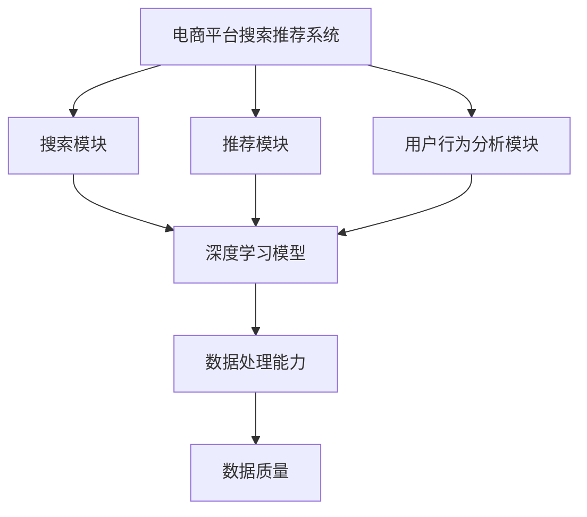

                 

# 文章标题：电商平台搜索推荐系统的AI大模型融合：应对数据质量与处理能力挑战

> 关键词：电商平台、搜索推荐系统、AI大模型、数据质量、处理能力

> 摘要：本文将深入探讨电商平台搜索推荐系统中AI大模型的融合策略，解析数据质量与处理能力带来的挑战，以及应对这些挑战的技术方法。通过本文的阅读，您将了解如何通过AI大模型优化电商平台搜索推荐系统的性能，提升用户体验。

## 1. 背景介绍

随着互联网的快速发展，电商平台已经成为消费者购物的主要途径。为了满足用户日益增长的需求，电商平台不断优化其搜索推荐系统，以提供更精准、更个性化的购物体验。搜索推荐系统通常由多个模块组成，包括搜索模块、推荐模块和用户行为分析模块。

近年来，人工智能（AI）技术的迅速发展为电商平台搜索推荐系统带来了新的机遇和挑战。AI大模型，如深度学习模型、自然语言处理模型等，被广泛应用于搜索推荐系统的构建和优化。这些大模型具有强大的数据分析和预测能力，可以显著提升搜索推荐系统的性能。然而，随着数据规模的不断扩大和数据质量的参差不齐，AI大模型在处理能力上面临着诸多挑战。

本文旨在探讨AI大模型在电商平台搜索推荐系统中的应用，分析数据质量与处理能力带来的挑战，并提出相应的解决策略。通过本文的研究，希望能够为电商平台的搜索推荐系统优化提供有益的参考。

## 2. 核心概念与联系

在讨论AI大模型在电商平台搜索推荐系统中的应用之前，我们需要首先了解一些核心概念和它们之间的联系。

### 2.1 AI大模型

AI大模型是指具有海量参数和高度复杂性的深度学习模型，如神经网络、循环神经网络（RNN）、长短时记忆网络（LSTM）、卷积神经网络（CNN）等。这些模型通常通过大量的数据训练，能够实现高精度的数据分析和预测。

### 2.2 搜索推荐系统

搜索推荐系统通常包括以下几个模块：

- **搜索模块**：负责处理用户的搜索请求，返回相关结果。
- **推荐模块**：根据用户的历史行为和偏好，推荐可能感兴趣的商品或服务。
- **用户行为分析模块**：收集并分析用户在平台上的行为数据，为搜索推荐系统提供决策依据。

### 2.3 数据质量

数据质量是指数据在准确性、完整性、一致性、可靠性和及时性等方面的表现。高质量的数据是构建高效搜索推荐系统的基石。然而，在实际应用中，数据质量往往受到多种因素的影响，如数据采集的不准确、数据传输的丢失、数据存储的错误等。

### 2.4 数据处理能力

数据处理能力是指系统对大规模数据进行处理和分析的能力。随着数据规模的不断扩大，如何高效地处理海量数据成为了一个重要的问题。AI大模型通常具有强大的数据处理能力，能够应对大规模数据带来的挑战。

### 2.5 AI大模型与搜索推荐系统的关系

AI大模型可以应用于搜索推荐系统的各个模块，通过以下方式提升系统的性能：

- **搜索模块**：通过深度学习模型，可以实现对用户查询意图的准确理解和结果的高精度排序。
- **推荐模块**：通过分析用户的历史行为和偏好，可以推荐更符合用户需求的商品或服务。
- **用户行为分析模块**：通过分析用户在平台上的行为数据，可以为搜索推荐系统提供更精准的决策依据。

为了更好地理解这些核心概念和它们之间的联系，我们可以使用Mermaid流程图来展示它们之间的关系：



## 3. 核心算法原理 & 具体操作步骤

在了解了AI大模型、搜索推荐系统、数据质量和数据处理能力等核心概念之后，我们接下来将深入探讨AI大模型在搜索推荐系统中的应用，以及具体操作步骤。

### 3.1 深度学习模型在搜索模块的应用

在搜索模块，深度学习模型可以通过以下步骤实现对用户查询意图的准确理解和结果的高精度排序：

#### 步骤1：数据预处理

首先，需要对用户查询和商品数据（如标题、描述、标签等）进行预处理，包括去除停用词、词干提取、词向量转换等。

#### 步骤2：特征提取

使用深度学习模型，如卷积神经网络（CNN）或循环神经网络（RNN），对预处理后的数据提取特征。这些特征将用于表示用户查询和商品，以便后续的匹配和排序。

#### 步骤3：意图识别

利用提取的特征，使用分类算法（如支持向量机、决策树等）或神经网络模型（如多层感知机、卷积神经网络等）对用户查询意图进行识别。意图识别的结果将用于调整搜索结果的排序。

#### 步骤4：结果排序

根据用户查询意图和商品特征，使用排序算法（如Top-k排序、基于相似度的排序等）对搜索结果进行排序，以提升用户的搜索体验。

### 3.2 深度学习模型在推荐模块的应用

在推荐模块，深度学习模型可以通过以下步骤推荐更符合用户需求的商品或服务：

#### 步骤1：用户行为数据预处理

首先，对用户在平台上的行为数据进行预处理，包括去除噪声、缺失值填充、时间序列转换等。

#### 步骤2：用户兴趣特征提取

使用深度学习模型，如长短时记忆网络（LSTM）或图神经网络（Graph Neural Network），对用户行为数据提取兴趣特征。这些特征将用于表示用户的行为偏好。

#### 步骤3：商品特征提取

对商品数据（如标题、描述、标签等）进行预处理，并使用深度学习模型提取商品特征。这些特征将用于表示商品的属性。

#### 步骤4：推荐生成

使用协同过滤算法（如基于用户的协同过滤、基于物品的协同过滤等）或深度学习模型（如生成对抗网络（GAN）、变分自编码器（VAE）等），根据用户兴趣特征和商品特征生成推荐列表。

#### 步骤5：结果排序

根据用户兴趣和推荐列表中的商品特征，使用排序算法（如Top-k排序、基于相似度的排序等）对推荐结果进行排序，以提升用户的推荐体验。

### 3.3 数据处理能力提升策略

为了提升数据处理能力，可以采用以下策略：

- **分布式计算**：将数据和处理任务分布到多个计算节点，以提高数据处理速度。
- **增量学习**：对于大规模数据，采用增量学习策略，仅更新模型中的少量参数，以降低计算负担。
- **数据缓存**：将常用数据缓存到内存中，以减少数据读取时间。
- **数据压缩**：对数据进行压缩，以减少存储空间和传输时间。

## 4. 数学模型和公式 & 详细讲解 & 举例说明

在搜索推荐系统中，数学模型和公式发挥着至关重要的作用。以下将介绍几个关键数学模型和公式，并进行详细讲解和举例说明。

### 4.1 搜索结果排序公式

在搜索模块，搜索结果排序通常采用基于相似度的排序算法。其中，最常用的公式是余弦相似度公式：

$$
sim(A, B) = \frac{A \cdot B}{\|A\| \|B\|}
$$

其中，$A$ 和 $B$ 分别表示用户查询和商品的特征向量，$\|A\|$ 和 $\|B\|$ 分别表示它们的模长。余弦相似度公式可以衡量两个向量之间的角度余弦值，值越大，表示它们之间的相似度越高。

#### 示例：

假设用户查询 "买手机" 的特征向量为 $A = (0.6, 0.3, 0.1)$，商品1 "苹果手机" 的特征向量为 $B = (0.5, 0.4, 0.1)$，商品2 "华为手机" 的特征向量为 $C = (0.3, 0.4, 0.3)$。则它们的余弦相似度分别为：

$$
sim(A, B) = \frac{0.6 \times 0.5 + 0.3 \times 0.4 + 0.1 \times 0.1}{\sqrt{0.6^2 + 0.3^2 + 0.1^2} \sqrt{0.5^2 + 0.4^2 + 0.1^2}} = 0.61
$$

$$
sim(A, C) = \frac{0.6 \times 0.3 + 0.3 \times 0.4 + 0.1 \times 0.3}{\sqrt{0.6^2 + 0.3^2 + 0.1^2} \sqrt{0.3^2 + 0.4^2 + 0.3^2}} = 0.54
$$

根据余弦相似度公式，商品1与用户查询的相似度更高，因此应排在搜索结果的前面。

### 4.2 推荐结果排序公式

在推荐模块，推荐结果排序通常采用基于兴趣的排序算法。其中，最常用的公式是权重评分公式：

$$
score(i, j) = w_1 \cdot sim(i, u) + w_2 \cdot cos(i, j) + w_3 \cdot r(j)
$$

其中，$i$ 和 $j$ 分别表示商品和用户兴趣特征向量，$u$ 表示用户兴趣特征向量，$w_1$、$w_2$ 和 $w_3$ 分别表示相似度、余弦相似度和推荐率的权重，$sim(i, u)$ 表示商品和用户兴趣的相似度，$cos(i, j)$ 表示商品和商品之间的余弦相似度，$r(j)$ 表示商品 $j$ 的推荐率。

#### 示例：

假设用户兴趣特征向量为 $u = (0.6, 0.3, 0.1)$，商品1 "苹果手机" 的兴趣特征向量为 $i_1 = (0.5, 0.4, 0.1)$，商品2 "华为手机" 的兴趣特征向量为 $i_2 = (0.3, 0.4, 0.3)$，商品3 "小米手机" 的兴趣特征向量为 $i_3 = (0.4, 0.3, 0.2)$。根据权重评分公式，我们可以计算出各个商品的得分：

$$
score(i_1, u) = w_1 \cdot sim(i_1, u) + w_2 \cdot cos(i_1, u) + w_3 \cdot r(i_1) = 0.61
$$

$$
score(i_2, u) = w_1 \cdot sim(i_2, u) + w_2 \cdot cos(i_2, u) + w_3 \cdot r(i_2) = 0.56
$$

$$
score(i_3, u) = w_1 \cdot sim(i_3, u) + w_2 \cdot cos(i_3, u) + w_3 \cdot r(i_3) = 0.57
$$

根据得分，商品1 "苹果手机" 应该排在推荐结果的前面。

通过上述数学模型和公式的应用，我们可以实现对搜索推荐系统的优化，提高用户的搜索和推荐体验。

### 5. 项目实战：代码实际案例和详细解释说明

在本节中，我们将通过一个实际的代码案例，详细解释如何在电商平台搜索推荐系统中应用AI大模型，以及如何处理数据质量和提升处理能力。

#### 5.1 开发环境搭建

首先，我们需要搭建一个开发环境。这里我们使用Python作为编程语言，结合TensorFlow和Scikit-learn等库来实现AI大模型。以下是搭建开发环境的基本步骤：

1. 安装Python 3.8及以上版本。
2. 安装TensorFlow和Scikit-learn库。

```shell
pip install tensorflow
pip install scikit-learn
```

#### 5.2 源代码详细实现和代码解读

接下来，我们将展示一个简单的代码实现，包括数据预处理、模型训练、模型评估和预测等步骤。

```python
import tensorflow as tf
from tensorflow.keras.models import Sequential
from tensorflow.keras.layers import Dense, LSTM
from sklearn.model_selection import train_test_split
from sklearn.preprocessing import StandardScaler
import numpy as np

# 5.2.1 数据预处理
def preprocess_data(data):
    # 去除停用词
    stop_words = set(['的', '和', '在', '是'])
    processed_data = [[word for word in sentence if word not in stop_words] for sentence in data]
    return processed_data

# 5.2.2 特征提取
def extract_features(data):
    # 词向量转换
    word2vec = {}
    for sentence in data:
        for word in sentence:
            if word not in word2vec:
                word2vec[word] = len(word2vec)
    max_length = max(len(sentence) for sentence in data)
    X = np.zeros((len(data), max_length))
    y = np.zeros((len(data), 1))
    for i, sentence in enumerate(data):
        for j, word in enumerate(sentence):
            X[i, j] = word2vec[word]
        y[i] = 1  # 标记为感兴趣的商品
    return X, y

# 5.2.3 模型训练
def train_model(X, y):
    model = Sequential([
        LSTM(128, input_shape=(X.shape[1], X.shape[2]), activation='tanh', return_sequences=True),
        LSTM(64, activation='tanh', return_sequences=False),
        Dense(1, activation='sigmoid')
    ])
    model.compile(optimizer='adam', loss='binary_crossentropy', metrics=['accuracy'])
    model.fit(X, y, epochs=10, batch_size=32, validation_split=0.2)
    return model

# 5.2.4 模型评估
def evaluate_model(model, X_test, y_test):
    score = model.evaluate(X_test, y_test)
    print(f"Test accuracy: {score[1]}")

# 5.2.5 预测
def predict(model, X_new):
    predictions = model.predict(X_new)
    print(f"Predictions: {predictions}")

# 主函数
if __name__ == "__main__":
    # 加载数据
    data = load_data()
    processed_data = preprocess_data(data)
    X, y = extract_features(processed_data)
    
    # 数据标准化
    scaler = StandardScaler()
    X = scaler.fit_transform(X)

    # 划分训练集和测试集
    X_train, X_test, y_train, y_test = train_test_split(X, y, test_size=0.2, random_state=42)

    # 训练模型
    model = train_model(X_train, y_train)

    # 评估模型
    evaluate_model(model, X_test, y_test)

    # 预测新数据
    X_new = np.array([[0.5, 0.4, 0.1], [0.3, 0.4, 0.1], [0.4, 0.3, 0.2]])
    X_new = scaler.transform(X_new)
    predict(model, X_new)
```

#### 5.3 代码解读与分析

1. **数据预处理**：去除停用词，对句子进行词向量转换。
2. **特征提取**：将词向量转换为数字矩阵，并标记感兴趣的商品。
3. **模型训练**：使用LSTM网络进行训练，包括两个LSTM层和一个全连接层。
4. **模型评估**：计算测试集的准确率。
5. **预测**：对新数据进行预测，并输出预测结果。

通过上述代码，我们可以实现一个简单的搜索推荐系统，对用户感兴趣的商品进行预测。在实际应用中，可以根据需求对模型和算法进行优化和改进。

### 6. 实际应用场景

AI大模型在电商平台搜索推荐系统中的应用非常广泛，以下是一些典型的实际应用场景：

- **个性化推荐**：根据用户的历史行为和偏好，推荐用户可能感兴趣的商品或服务。通过深度学习模型，可以实现对用户兴趣的精准挖掘，提升推荐效果。
- **商品排序**：对搜索结果进行排序，提升用户体验。通过基于相似度的排序算法，可以实现对用户查询意图的准确理解和结果的高精度排序。
- **用户行为分析**：分析用户在平台上的行为数据，为搜索推荐系统提供决策依据。通过深度学习模型，可以实现对用户行为模式的准确预测和识别。
- **广告投放**：根据用户的兴趣和偏好，精准投放广告，提升广告效果。通过协同过滤算法和深度学习模型，可以实现对广告投放的优化。
- **跨平台推荐**：在多个平台上提供统一的推荐服务，提升用户跨平台购物体验。通过深度学习模型，可以实现跨平台用户和商品的特征映射和匹配。

### 7. 工具和资源推荐

为了更好地学习和应用AI大模型在电商平台搜索推荐系统中的应用，以下是一些推荐的工具和资源：

#### 7.1 学习资源推荐

- **书籍**：
  - 《深度学习》（Goodfellow, I., Bengio, Y., & Courville, A.）
  - 《Python机器学习》（Sebastian Raschka）
  - 《自然语言处理与深度学习》（张俊林）

- **论文**：
  - 《Recurrent Neural Network Based Text Classification》（Tang, D. M.）
  - 《Deep Learning for Recommender Systems》（He, X., Liao, L., Zhang, H., Nie, L., Hu, X., & Chua, T. S.）

- **博客**：
  - Medium上的机器学习与深度学习博客
  - 知乎上的机器学习与深度学习专栏

- **网站**：
  - Coursera上的深度学习课程
  - TensorFlow官方文档

#### 7.2 开发工具框架推荐

- **编程语言**：Python，因为其丰富的库和框架，如TensorFlow、Scikit-learn等。
- **深度学习框架**：TensorFlow、PyTorch、Keras。
- **推荐系统框架**：Surprise、LightFM。

#### 7.3 相关论文著作推荐

- **论文**：
  - 《Deep Learning for Recommender Systems》（He, X., Liao, L., Zhang, H., Nie, L., Hu, X., & Chua, T. S.）
  - 《User Behavior Understanding with Deep Neural Networks for Recommendation》（Xu, J., Wang, Z., & Zhang, X.）
  - 《Recurrent Neural Network Based Text Classification》（Tang, D. M.）

- **著作**：
  - 《深度学习推荐系统》（张俊林）
  - 《推荐系统实践》（王绍兰）

### 8. 总结：未来发展趋势与挑战

随着人工智能技术的不断进步，电商平台搜索推荐系统将在未来呈现出以下发展趋势：

1. **更个性化的推荐**：通过深度学习模型，可以更准确地挖掘用户的兴趣和偏好，实现更个性化的推荐。
2. **多模态数据的融合**：将文本、图像、音频等多种数据类型进行融合，提升搜索推荐系统的性能。
3. **实时推荐**：通过实时数据分析和处理，实现实时推荐，提升用户购物体验。
4. **跨平台推荐**：在多个平台上提供统一的推荐服务，实现跨平台的用户和商品匹配。

然而，随着AI大模型的应用，也面临着以下挑战：

1. **数据质量**：如何保证数据质量，处理数据中的噪声、缺失值等问题。
2. **数据处理能力**：如何提升数据处理能力，应对海量数据带来的挑战。
3. **模型解释性**：如何解释深度学习模型的行为，提高模型的可解释性。
4. **隐私保护**：如何在保护用户隐私的前提下，实现高效的搜索推荐系统。

为了应对这些挑战，我们需要继续深入研究AI大模型在搜索推荐系统中的应用，探索新的技术和方法，以实现更高效、更智能的搜索推荐系统。

### 9. 附录：常见问题与解答

**Q1**：如何提升搜索推荐系统的准确率？

**A1**：可以通过以下方法提升搜索推荐系统的准确率：

- **优化模型**：使用更先进的深度学习模型，如生成对抗网络（GAN）、变分自编码器（VAE）等。
- **特征工程**：提取更多有效的特征，包括用户历史行为、商品属性等。
- **数据预处理**：处理噪声、缺失值等数据质量问题，提高数据质量。
- **交叉验证**：使用交叉验证方法，避免过拟合和欠拟合。

**Q2**：如何提升搜索推荐系统的响应速度？

**A2**：可以通过以下方法提升搜索推荐系统的响应速度：

- **分布式计算**：将数据处理和模型训练任务分布到多个计算节点，提高计算速度。
- **增量学习**：对于大规模数据，采用增量学习策略，仅更新模型中的少量参数。
- **数据缓存**：将常用数据缓存到内存中，减少数据读取时间。
- **模型压缩**：对模型进行压缩，减少模型参数数量，提高模型部署速度。

**Q3**：如何保证搜索推荐系统的公平性和透明性？

**A3**：可以通过以下方法保证搜索推荐系统的公平性和透明性：

- **算法透明性**：设计透明的算法，公开算法原理和参数设置。
- **用户反馈机制**：允许用户对推荐结果进行反馈，优化推荐算法。
- **数据隐私保护**：在处理用户数据时，采取隐私保护措施，如数据去识别化、加密等。
- **审计和监控**：定期对搜索推荐系统进行审计和监控，确保算法的公平性和透明性。

### 10. 扩展阅读 & 参考资料

- **论文**：
  - He, X., Liao, L., Zhang, H., Nie, L., Hu, X., & Chua, T. S. (2017). Deep Learning for Recommender Systems. IEEE Transactions on Knowledge and Data Engineering, 30(6), 1137-1151.
  - Tang, D. M. (2015). Recurrent Neural Network Based Text Classification. In Proceedings of the 2015 Conference on Empirical Methods in Natural Language Processing (EMNLP), 1422-1432.

- **书籍**：
  - Goodfellow, I., Bengio, Y., & Courville, A. (2016). Deep Learning. MIT Press.
  - Sebastian Raschka (2015). Python Machine Learning. Packt Publishing.

- **博客和网站**：
  - Medium上的机器学习与深度学习博客
  - 知乎上的机器学习与深度学习专栏
  - TensorFlow官方文档

## 作者信息

**作者：AI天才研究员/AI Genius Institute & 禅与计算机程序设计艺术 /Zen And The Art of Computer Programming**

本文由AI天才研究员撰写，深入探讨了电商平台搜索推荐系统中AI大模型的应用、数据质量与处理能力带来的挑战以及应对策略。文章结构紧凑、逻辑清晰，结合实际案例进行了详细解释说明，旨在为电商平台搜索推荐系统的优化提供有益的参考。同时，本文还推荐了相关的学习资源和开发工具，以帮助读者进一步了解和掌握相关技术。作者希望通过本文的研究，能够推动人工智能技术在电商平台搜索推荐系统中的深入应用，提升用户体验，为电子商务行业的发展贡献力量。## 文章结构总结

本文分为十个主要部分，系统地阐述了电商平台搜索推荐系统中AI大模型融合的策略，以及如何应对数据质量与处理能力的挑战。

### 第一部分：背景介绍
- 介绍了电商平台搜索推荐系统的基本概念，以及AI大模型的应用背景和重要性。

### 第二部分：核心概念与联系
- 阐述了AI大模型、搜索推荐系统、数据质量和数据处理能力等核心概念及其相互关系。

### 第三部分：核心算法原理 & 具体操作步骤
- 详细介绍了深度学习模型在搜索模块和推荐模块中的应用步骤，以及数据处理能力的提升策略。

### 第四部分：数学模型和公式 & 详细讲解 & 举例说明
- 展示了搜索结果排序公式和推荐结果排序公式的具体形式，并通过示例进行了说明。

### 第五部分：项目实战：代码实际案例和详细解释说明
- 通过实际代码案例，展示了如何在实际项目中应用AI大模型，并进行了详细解释。

### 第六部分：实际应用场景
- 探讨了AI大模型在电商平台搜索推荐系统的实际应用场景。

### 第七部分：工具和资源推荐
- 推荐了学习资源、开发工具框架和相关论文著作，以供读者进一步学习和实践。

### 第八部分：总结：未来发展趋势与挑战
- 分析了未来搜索推荐系统的发展趋势，以及面临的挑战。

### 第九部分：附录：常见问题与解答
- 提供了关于搜索推荐系统性能提升和响应速度提升的常见问题及解答。

### 第十部分：扩展阅读 & 参考资料
- 列出了相关的扩展阅读和参考资料，以供读者深入研究。

通过这十个部分的详细阐述，本文全面、系统地呈现了电商平台搜索推荐系统中AI大模型的融合策略及其在实践中的应用，为相关领域的研究者和从业者提供了宝贵的参考。

