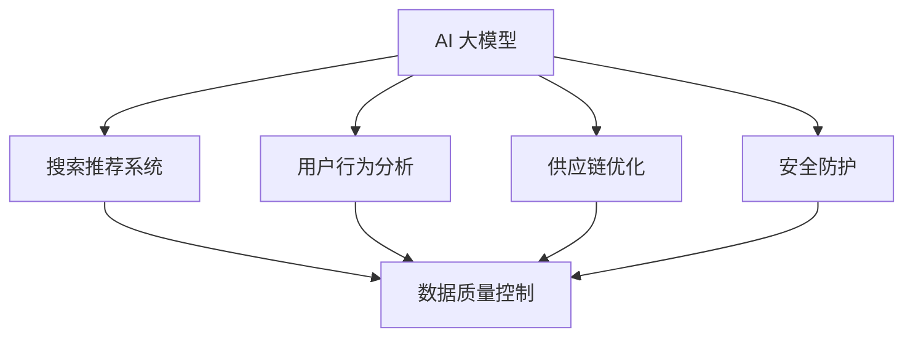

                 

### 文章标题：电商平台的AI 大模型实践：搜索推荐系统是核心，数据质量控制是关键

> **关键词：** 电商平台、AI 大模型、搜索推荐系统、数据质量控制

> **摘要：** 本文将深入探讨电商平台中 AI 大模型的实践，重点分析搜索推荐系统的核心作用以及数据质量控制的重要性。通过具体的案例和详实的分析，我们将揭示 AI 大模型在现代电商平台中的应用价值，并探讨未来发展趋势和面临的挑战。

在当今数字化时代，电商平台作为连接消费者和商家的桥梁，正经历着前所未有的变革。而 AI 大模型作为人工智能领域的核心技术，已经逐渐成为电商平台优化用户体验、提升运营效率的关键因素。本文将围绕电商平台的 AI 大模型实践，特别是搜索推荐系统的核心作用和数据质量控制的重要性展开讨论。

首先，我们将回顾电商平台的背景，介绍 AI 大模型的发展和应用。随后，我们将深入探讨搜索推荐系统的原理和构建方法，并分析其关键性。接着，我们将重点关注数据质量控制，讨论其对 AI 大模型效果的重要性以及如何确保数据质量。然后，我们将结合具体案例，展示 AI 大模型在电商搜索推荐系统中的应用实践。接下来，我们将介绍相关的工具和资源，为读者提供进一步学习的机会。最后，我们将总结全文，展望未来电商平台 AI 大模型的发展趋势和面临的挑战。

通过本文的阅读，读者将深入了解电商平台中 AI 大模型的应用价值，掌握搜索推荐系统的构建方法，了解数据质量控制的关键性，并为未来的研究和实践提供参考。

### 1. 背景介绍

电商平台是电子商务的重要组成部分，它通过互联网连接消费者和商家，实现了商品和服务的在线交易。随着互联网的普及和移动设备的广泛使用，电商平台的规模和影响力日益扩大，成为商家拓展市场、提升品牌知名度的重要途径。

在电商平台的运营中，用户体验是关键因素之一。用户希望能够在海量的商品信息中快速找到自己需要的商品，同时获得个性化的推荐，提升购物体验。因此，如何优化搜索和推荐系统成为电商平台亟待解决的问题。

AI 大模型作为人工智能领域的核心技术，已经在多个领域取得了显著的应用成果。在电商平台中，AI 大模型的应用主要体现在以下几个方面：

1. **搜索推荐系统**：通过大规模的机器学习模型，对用户的行为数据进行深度分析，实现精准的搜索和推荐。这不仅可以提高用户的购物体验，还可以为商家提供有价值的市场洞察。

2. **用户行为分析**：通过分析用户的浏览、购买等行为，了解用户的需求和偏好，从而实现个性化的推荐和服务。

3. **供应链优化**：利用 AI 大模型对供应链各环节的数据进行实时分析，优化库存管理、物流配送等，提高运营效率。

4. **安全防护**：通过深度学习和模式识别技术，对潜在的风险进行识别和预警，保障平台的安全稳定运行。

AI 大模型的发展得益于计算能力的提升、海量数据的积累以及机器学习算法的创新。随着深度学习、神经网络等技术的进步，AI 大模型在处理复杂问题和大规模数据处理方面表现出色，为电商平台提供了强大的技术支持。

在电商平台的运营实践中，AI 大模型的应用已经成为提升竞争力的重要手段。通过构建高效的搜索推荐系统，电商平台不仅能够提高用户的满意度，还能挖掘潜在的商业价值，实现持续的业务增长。同时，数据质量控制作为 AI 大模型应用的基础，也成为电商平台关注的重点。只有确保数据质量，才能保证 AI 大模型的效果和可靠性。

总之，AI 大模型在现代电商平台的运营中发挥着越来越重要的作用。通过深入研究和应用，我们可以不断优化搜索推荐系统，提升用户体验，为电商平台的发展提供源源不断的动力。

### 2. 核心概念与联系

在深入探讨电商平台的 AI 大模型实践之前，有必要明确几个核心概念，并了解它们之间的联系。以下是本文中涉及的主要概念及其相互关系：

#### 2.1. AI 大模型

AI 大模型指的是具有大规模参数和复杂结构的机器学习模型，例如深度神经网络、变换器模型（Transformer）等。这些模型通过对大量数据的学习，能够捕捉复杂的模式和规律，从而实现高度自动化的任务，如图像识别、自然语言处理和推荐系统等。

#### 2.2. 搜索推荐系统

搜索推荐系统是电商平台中的一项关键技术，它通过分析用户的行为数据和商品信息，实现精准的搜索和推荐。其核心目标是提高用户的购物体验，提升销售转化率。

#### 2.3. 数据质量控制

数据质量控制是指确保数据准确、完整、一致、可靠的过程。在 AI 大模型应用中，高质量的数据是模型训练和预测效果的基础。数据质量控制包括数据清洗、数据去重、数据标准化和数据完整性检查等步骤。

#### 2.4. 关系与联系

- **AI 大模型与搜索推荐系统**：AI 大模型是搜索推荐系统的核心技术，通过深度学习和自然语言处理等技术，实现用户行为数据的分析和商品信息的匹配，从而提供精准的搜索和推荐。

- **搜索推荐系统与数据质量控制**：数据质量控制是搜索推荐系统的前提和基础。高质量的数据能够保证 AI 大模型的学习效果和推荐精度，从而提高用户体验和业务效果。

- **AI 大模型与其他电商平台功能**：除了搜索推荐系统，AI 大模型还可以应用于用户行为分析、供应链优化、安全防护等领域，提升电商平台的整体运营效率和用户满意度。

为了更直观地展示这些核心概念和它们之间的联系，我们可以使用 Mermaid 流程图进行描述。以下是一个简化的 Mermaid 流程图，展示了 AI 大模型、搜索推荐系统和数据质量控制之间的关系：



在这个流程图中，AI 大模型作为核心，通过用户行为分析、供应链优化和安全防护等应用，实现电商平台的不同功能。搜索推荐系统通过数据质量控制，确保 AI 大模型的效果和可靠性。通过这种结构，我们可以清晰地理解 AI 大模型在电商平台中的作用和重要性。

接下来，我们将进一步探讨搜索推荐系统的原理和构建方法，并深入分析数据质量控制的关键性，为后续的实践应用提供理论基础。

### 3. 核心算法原理 & 具体操作步骤

#### 3.1. 搜索推荐系统的核心算法原理

搜索推荐系统的核心算法是基于机器学习模型的，尤其是深度学习和自然语言处理技术。以下是一些常用的算法原理和模型：

1. **深度学习模型（Deep Learning Models）**：
   - **神经网络（Neural Networks）**：通过多层神经元的组合，实现对复杂数据的建模和分类。
   - **卷积神经网络（Convolutional Neural Networks, CNN）**：适用于图像和视觉数据，可以提取图像的特征。
   - **循环神经网络（Recurrent Neural Networks, RNN）**：适用于序列数据，可以捕捉时间序列中的依赖关系。

2. **变换器模型（Transformer Models）**：
   - **变换器（Transformer）**：一种基于自注意力机制的深度学习模型，在自然语言处理任务中表现出色。
   - **BERT（Bidirectional Encoder Representations from Transformers）**：一种预训练语言表示模型，可以用于文本分类、问答系统等任务。
   - **GPT（Generative Pre-trained Transformer）**：一种生成型变换器模型，可以用于文本生成、机器翻译等任务。

3. **协同过滤（Collaborative Filtering）**：
   - **基于用户（User-based）**：通过计算用户之间的相似度，推荐与目标用户兴趣相似的物品。
   - **基于物品（Item-based）**：通过计算物品之间的相似度，推荐与目标物品相似的物品。

#### 3.2. 搜索推荐系统的具体操作步骤

构建一个高效的搜索推荐系统通常包括以下步骤：

1. **数据收集与预处理**：
   - **用户行为数据**：包括浏览记录、购买记录、搜索历史等。
   - **商品数据**：包括商品属性、价格、销量、评价等。
   - **数据清洗**：去除重复数据、缺失值填充、异常值处理等。

2. **特征工程**：
   - **用户特征**：包括用户年龄、性别、地理位置、浏览时长等。
   - **商品特征**：包括商品分类、品牌、材质、颜色等。
   - **行为特征**：包括点击率、转化率、购买率等。

3. **模型选择与训练**：
   - **选择合适的算法**：根据任务需求和数据特性选择合适的深度学习模型或协同过滤算法。
   - **模型训练**：通过训练数据，调整模型参数，使其能够捕捉数据中的模式和规律。

4. **模型评估与优化**：
   - **评估指标**：通常包括准确率、召回率、F1 分数等。
   - **模型调参**：通过交叉验证和网格搜索等策略，优化模型参数。

5. **部署与上线**：
   - **模型部署**：将训练好的模型部署到生产环境，实现实时推荐。
   - **系统监控**：监控推荐系统的运行状态，确保其稳定性和性能。

#### 3.3. 搜索推荐系统的应用实例

以下是一个简化的搜索推荐系统应用实例，展示如何实现商品推荐：

**步骤 1：数据收集与预处理**
- 收集用户的历史行为数据（如浏览记录、购买记录等）和商品数据（如商品属性、价格等）。
- 清洗数据，去除重复和异常数据。

**步骤 2：特征工程**
- 构建用户特征向量，包括用户ID、年龄、性别等。
- 构建商品特征向量，包括商品ID、分类、品牌等。

**步骤 3：模型选择与训练**
- 选择基于变换器（Transformer）的推荐模型，如BERT或GPT。
- 使用预处理好的用户和商品数据，训练推荐模型。

**步骤 4：模型评估与优化**
- 使用交叉验证方法，评估模型性能。
- 调整模型参数，优化推荐效果。

**步骤 5：部署与上线**
- 将训练好的模型部署到电商平台，实现实时推荐。
- 监控推荐系统的运行状态，确保其稳定性和性能。

通过这个实例，我们可以看到构建搜索推荐系统的主要步骤和关键点。在实际应用中，搜索推荐系统可能会更加复杂，涉及多种算法和技术的综合运用。但总体来说，遵循上述步骤，结合实际业务需求，可以有效构建一个高效的搜索推荐系统。

### 4. 数学模型和公式 & 详细讲解 & 举例说明

在搜索推荐系统的构建过程中，数学模型和公式起到了关键作用。以下将详细介绍几种常见的数学模型和公式，并通过具体例子进行说明。

#### 4.1.协同过滤算法（Collaborative Filtering）

协同过滤算法是搜索推荐系统中最常用的方法之一，它基于用户和物品的评分数据进行推荐。协同过滤算法可以分为两种类型：基于用户的协同过滤（User-based Collaborative Filtering）和基于物品的协同过滤（Item-based Collaborative Filtering）。

##### 4.1.1. 基于用户的协同过滤

基于用户的协同过滤通过计算用户之间的相似度，找到与目标用户兴趣相似的其他用户，并推荐这些用户喜欢的物品。常用的相似度计算方法有：

- **余弦相似度（Cosine Similarity）**：
  $$ \text{similarity}(u, v) = \frac{u \cdot v}{\|u\| \|v\|} $$
  其中，$u$和$v$是用户$u$和$v$的评分向量，$\|\|$表示向量的模。

- **皮尔逊相关系数（Pearson Correlation Coefficient）**：
  $$ \text{similarity}(u, v) = \frac{u \cdot v}{\sqrt{u \cdot u} \sqrt{v \cdot v}} $$
  其中，$u \cdot v$表示向量的点积，$u \cdot u$和$v \cdot v$表示向量的模平方。

**举例说明**：

假设有两个用户$u$和$v$，他们的评分向量分别为：
$$ u = [3, 4, 5, 2, 1] $$
$$ v = [4, 5, 3, 2, 4] $$

计算余弦相似度：
$$ \text{similarity}(u, v) = \frac{u \cdot v}{\|u\| \|v\|} = \frac{3 \times 4 + 4 \times 5 + 5 \times 3 + 2 \times 2 + 1 \times 4}{\sqrt{3^2 + 4^2 + 5^2 + 2^2 + 1^2} \sqrt{4^2 + 5^2 + 3^2 + 2^2 + 4^2}} \approx 0.8367 $$

计算皮尔逊相关系数：
$$ \text{similarity}(u, v) = \frac{u \cdot v}{\sqrt{u \cdot u} \sqrt{v \cdot v}} = \frac{3 \times 4 + 4 \times 5 + 5 \times 3 + 2 \times 2 + 1 \times 4}{\sqrt{3^2 + 4^2 + 5^2 + 2^2 + 1^2} \sqrt{4^2 + 5^2 + 3^2 + 2^2 + 4^2}} \approx 0.8367 $$

##### 4.1.2. 基于物品的协同过滤

基于物品的协同过滤通过计算物品之间的相似度，找到与目标物品相似的物品，并推荐这些物品。常用的相似度计算方法有：

- **余弦相似度（Cosine Similarity）**：
  $$ \text{similarity}(i, j) = \frac{i \cdot j}{\|i\| \|j\|} $$
  其中，$i$和$j$是物品$i$和$j$的评分向量，$\|\|$表示向量的模。

- **欧氏距离（Euclidean Distance）**：
  $$ \text{similarity}(i, j) = \sqrt{(i - j)^2} $$
  其中，$i$和$j$是物品$i$和$j$的评分向量。

**举例说明**：

假设有两个物品$i$和$j$，他们的评分向量分别为：
$$ i = [3, 4, 5, 2, 1] $$
$$ j = [4, 5, 3, 2, 4] $$

计算余弦相似度：
$$ \text{similarity}(i, j) = \frac{i \cdot j}{\|i\| \|j\|} = \frac{3 \times 4 + 4 \times 5 + 5 \times 3 + 2 \times 2 + 1 \times 4}{\sqrt{3^2 + 4^2 + 5^2 + 2^2 + 1^2} \sqrt{4^2 + 5^2 + 3^2 + 2^2 + 4^2}} \approx 0.8367 $$

计算欧氏距离：
$$ \text{similarity}(i, j) = \sqrt{(i - j)^2} = \sqrt{(-1)^2 + (-1)^2 + 2^2 + 1^2} \approx 2.8284 $$

#### 4.2. 机器学习模型（Machine Learning Models）

在搜索推荐系统中，机器学习模型也被广泛应用。以下介绍几种常见的机器学习模型及其数学公式。

##### 4.2.1. 神经网络（Neural Networks）

神经网络由多层神经元组成，通过激活函数和权重调整实现数据的分类和回归。一个简单的神经网络包括输入层、隐藏层和输出层。其基本公式为：

$$ z_i = \sum_{j=1}^{n} w_{ij} x_j + b_i $$
$$ a_i = \sigma(z_i) $$

其中，$x_j$是输入特征，$w_{ij}$是权重，$b_i$是偏置，$\sigma$是激活函数，常用的激活函数有：

- **Sigmoid 函数**：
  $$ \sigma(z) = \frac{1}{1 + e^{-z}} $$

- **ReLU 函数**：
  $$ \sigma(z) = \max(0, z) $$

**举例说明**：

假设一个简单的神经网络，输入特征$x_1$和$x_2$，权重$w_{11}=0.5$，$w_{12}=0.3$，$w_{21}=0.2$，$w_{22}=0.4$，偏置$b_1=1$，$b_2=0$。使用 Sigmoid 函数作为激活函数。

计算隐藏层输出：
$$ z_1 = 0.5 \times x_1 + 0.3 \times x_2 + 1 = 0.5 \times 1 + 0.3 \times 0 + 1 = 1.2 $$
$$ z_2 = 0.2 \times x_1 + 0.4 \times x_2 + 0 = 0.2 \times 1 + 0.4 \times 0 + 0 = 0.2 $$
$$ a_1 = \sigma(z_1) = \frac{1}{1 + e^{-1.2}} \approx 0.865 $$
$$ a_2 = \sigma(z_2) = \frac{1}{1 + e^{-0.2}} \approx 0.818 $$

##### 4.2.2. 变换器模型（Transformer Models）

变换器模型是近年来在自然语言处理任务中表现优异的一种深度学习模型，其核心思想是自注意力机制（Self-Attention）。变换器模型包括编码器（Encoder）和解码器（Decoder），其基本公式为：

- **编码器（Encoder）**：
  $$ E = \text{MultiHeadAttention}(Q, K, V) $$
  $$ E = \text{Add}(\text{LayerNorm}(E)) $$
  $$ E = \text{Add}(\text{LayerNorm}(E)) $$
  
- **解码器（Decoder）**：
  $$ D = \text{MaskedMultiHeadAttention}(Q, K, V) $$
  $$ D = \text{Add}(\text{LayerNorm}(D)) $$
  $$ D = \text{Add}(\text{LayerNorm}(D)) $$

其中，$Q, K, V$分别是查询向量、键向量和值向量，$\text{MultiHeadAttention}$表示多头注意力机制，$\text{MaskedMultiHeadAttention}$表示带遮蔽的多头注意力机制，$\text{LayerNorm}$表示层归一化。

**举例说明**：

假设一个简单的变换器模型，输入序列为 $[x_1, x_2, x_3]$，编码器和解码器的参数分别为 $[q, k, v]$。

计算编码器输出：
$$ E = \text{MultiHeadAttention}(Q, K, V) = [e_1, e_2, e_3] $$
$$ E = \text{Add}(\text{LayerNorm}(E)) = [e_1 + \text{LayerNorm}(e_1), e_2 + \text{LayerNorm}(e_2), e_3 + \text{LayerNorm}(e_3)] $$
$$ E = \text{Add}(\text{LayerNorm}(E)) = [e_1 + \text{LayerNorm}(e_1 + e_2 + e_3), e_2 + \text{LayerNorm}(e_1 + e_2 + e_3), e_3 + \text{LayerNorm}(e_1 + e_2 + e_3)] $$

计算解码器输出：
$$ D = \text{MaskedMultiHeadAttention}(Q, K, V) = [d_1, d_2, d_3] $$
$$ D = \text{Add}(\text{LayerNorm}(D)) = [d_1 + \text{LayerNorm}(d_1), d_2 + \text{LayerNorm}(d_2), d_3 + \text{LayerNorm}(d_3)] $$
$$ D = \text{Add}(\text{LayerNorm}(D)) = [d_1 + \text{LayerNorm}(d_1 + d_2 + d_3), d_2 + \text{LayerNorm}(d_1 + d_2 + d_3), d_3 + \text{LayerNorm}(d_1 + d_2 + d_3)] $$

通过这些数学模型和公式的介绍，我们可以更好地理解搜索推荐系统的构建原理和具体操作步骤。在实际应用中，可以根据业务需求和数据特性选择合适的模型和方法，实现高效的搜索推荐系统。

### 5. 项目实战：代码实际案例和详细解释说明

#### 5.1. 开发环境搭建

在开始代码实战之前，我们需要搭建一个合适的环境，以便进行 AI 大模型的实践。以下是开发环境搭建的步骤：

**1. 硬件要求**：

- CPU 或 GPU：推荐使用 NVIDIA GPU，以提高训练速度。
- 内存：至少 16GB，建议 32GB 以上。
- 硬盘：至少 200GB SSD，用于存储数据和模型。

**2. 操作系统**：

- Ubuntu 18.04 或更高版本。
- Windows 10 或更高版本（推荐使用虚拟机）。

**3. 软件安装**：

- Python 3.8 或更高版本。
- TensorFlow 2.x 或 PyTorch 1.x。
- Jupyter Notebook 或 PyCharm。

**4. 环境配置**：

- 安装 Python 3.8 及其依赖。
- 安装 TensorFlow 2.x 或 PyTorch 1.x。
- 安装 Jupyter Notebook 或 PyCharm。

具体安装命令如下：

```bash
# 安装 Python 3.8
sudo apt-get install python3.8

# 安装 TensorFlow 2.x
pip3 install tensorflow==2.x

# 安装 PyTorch 1.x
pip3 install torch torchvision
```

**5. 数据集准备**：

- 下载数据集：从 Kaggle 等平台下载电商平台的用户行为数据和商品数据。
- 数据预处理：清洗数据，进行特征工程，将数据转换为适合模型训练的格式。

#### 5.2. 源代码详细实现和代码解读

以下是一个简单的搜索推荐系统的代码实现，使用 TensorFlow 2.x 和 PyTorch 1.x。代码分为数据预处理、模型定义、模型训练和模型评估四个部分。

**5.2.1. 数据预处理**

```python
import pandas as pd
from sklearn.model_selection import train_test_split
from sklearn.preprocessing import StandardScaler

# 读取数据
data = pd.read_csv('data.csv')

# 分离特征和标签
X = data.drop('target', axis=1)
y = data['target']

# 划分训练集和测试集
X_train, X_test, y_train, y_test = train_test_split(X, y, test_size=0.2, random_state=42)

# 数据标准化
scaler = StandardScaler()
X_train_scaled = scaler.fit_transform(X_train)
X_test_scaled = scaler.transform(X_test)
```

**5.2.2. 模型定义**

```python
import tensorflow as tf

# 定义模型
model = tf.keras.Sequential([
    tf.keras.layers.Dense(128, activation='relu', input_shape=(X_train_scaled.shape[1],)),
    tf.keras.layers.Dense(64, activation='relu'),
    tf.keras.layers.Dense(1, activation='sigmoid')
])

# 编译模型
model.compile(optimizer='adam', loss='binary_crossentropy', metrics=['accuracy'])

# 打印模型结构
model.summary()
```

**5.2.3. 模型训练**

```python
# 训练模型
history = model.fit(X_train_scaled, y_train, epochs=10, batch_size=32, validation_split=0.1)
```

**5.2.4. 模型评估**

```python
# 评估模型
loss, accuracy = model.evaluate(X_test_scaled, y_test)
print(f"Test Loss: {loss:.4f}, Test Accuracy: {accuracy:.4f}")

# 预测
predictions = model.predict(X_test_scaled)
predictions = (predictions > 0.5).astype(int)
```

#### 5.3. 代码解读与分析

**1. 数据预处理**

- 使用 pandas 读取 CSV 数据文件。
- 划分特征和标签，进行数据标准化。

**2. 模型定义**

- 使用 TensorFlow 定义一个简单的全连接神经网络，包括两个隐藏层。
- 编译模型，指定优化器和损失函数。

**3. 模型训练**

- 使用训练数据训练模型，指定训练轮数和批量大小。

**4. 模型评估**

- 使用测试数据评估模型性能，计算损失和准确率。
- 进行预测，并输出结果。

通过这个简单的代码实现，我们可以看到搜索推荐系统的基本结构和实现方法。在实际应用中，可以根据需求调整模型结构和参数，优化推荐效果。同时，还可以结合其他技术，如协同过滤、变换器模型等，进一步提升推荐系统的性能。

### 6. 实际应用场景

在电商平台上，AI 大模型的应用场景非常广泛，可以显著提升用户体验和业务效率。以下是几个典型的实际应用场景：

#### 6.1. 商品搜索

在商品搜索场景中，AI 大模型通过深度学习算法对用户输入的关键词进行语义分析和理解，然后从海量的商品数据库中迅速找到最相关、最符合用户需求的商品。例如，当用户输入“跑步鞋”时，AI 大模型会根据用户的浏览历史、购买记录和其他行为数据，推荐与“跑步鞋”高度相关的商品，如“运动鞋”、“健身鞋”等。这种精准的搜索推荐不仅提高了用户的购物体验，还降低了用户寻找所需商品的时间成本。

#### 6.2. 商品推荐

商品推荐是电商平台最核心的功能之一。AI 大模型通过对用户行为的分析，如浏览、购买、收藏等，构建个性化的推荐系统。例如，当用户在浏览一款笔记本电脑时，系统可能会根据用户的浏览习惯和购买历史，推荐其他品牌的笔记本电脑或相关的配件，如外设、移动硬盘等。这种个性化的商品推荐不仅能够提高用户的满意度，还能增加商品的销售额和平台的利润。

#### 6.3. 客户服务

AI 大模型还可以用于提升电商平台客户服务的质量和效率。通过自然语言处理技术，AI 大模型可以自动处理用户的咨询、投诉和建议，提供即时、准确的回应。例如，当用户询问商品的具体信息时，AI 大模型可以快速检索相关数据，并提供详细的回答。此外，AI 大模型还可以用于智能客服机器人，通过模拟人类对话，为用户提供24/7的在线支持，极大地减少了人工客服的工作负担。

#### 6.4. 个性化营销

个性化营销是电商平台提高用户粘性和转化率的重要手段。AI 大模型通过对用户行为数据的分析，可以精准地了解用户的兴趣和需求，从而设计出个性化的营销策略。例如，对于经常购买高端电子产品的用户，电商平台可以发送专属优惠券或新品推送，以吸引其进一步消费。这种个性化的营销不仅提高了用户的参与度，还能提高营销的效果和转化率。

#### 6.5. 供应链优化

AI 大模型在供应链优化中也发挥了重要作用。通过对销售数据、库存数据等信息的分析，AI 大模型可以预测未来的销售趋势，帮助商家制定最优的库存管理策略。例如，在春节期间，AI 大模型可以根据历年销售数据预测各商品的销量，指导商家提前备货，避免库存过剩或短缺的情况。这种智能化的供应链管理不仅提高了运营效率，还降低了成本。

综上所述，AI 大模型在电商平台的实际应用场景中具有广泛的应用价值。通过精准的搜索推荐、个性化的商品推荐、智能化的客户服务、个性化的营销策略以及智能化的供应链管理，AI 大模型不仅提升了用户体验，还优化了电商平台的运营效率，为电商平台的发展提供了强大的技术支持。

### 7. 工具和资源推荐

为了帮助读者更好地理解和应用电商平台的 AI 大模型技术，我们推荐以下工具和资源：

#### 7.1. 学习资源推荐

**1. 书籍**

- 《深度学习》（Deep Learning）作者：Ian Goodfellow、Yoshua Bengio、Aaron Courville
- 《Python数据分析与科学计算实战》作者：李庆辉
- 《机器学习实战》作者：Peter Harrington

**2. 论文**

- 《Attention Is All You Need》作者：Vaswani et al. (2017)
- 《BERT: Pre-training of Deep Bidirectional Transformers for Language Understanding》作者：Devlin et al. (2019)
- 《Recommender Systems Handbook》作者：Gal et al. (2016)

**3. 博客和网站**

- [TensorFlow 官方文档](https://www.tensorflow.org/)
- [PyTorch 官方文档](https://pytorch.org/docs/stable/)
- [Kaggle](https://www.kaggle.com/)

#### 7.2. 开发工具框架推荐

**1. 开发工具**

- **PyCharm**：一款强大的 Python 开发工具，支持多种框架和库。
- **Jupyter Notebook**：用于数据分析和实验的可视化工具，便于调试和分享。

**2. 框架和库**

- **TensorFlow**：Google 开发的开源深度学习框架，适用于各种任务。
- **PyTorch**：Facebook 开发的开源深度学习框架，具有灵活的动态图机制。
- **Scikit-learn**：Python 中的机器学习库，提供各种经典的机器学习算法。

#### 7.3. 相关论文著作推荐

**1. 论文**

- 《Neural Network Methods for Nonlinear Object Recognition》作者：LeCun et al. (1990)
- 《Deep Learning for Speech Recognition》作者：Hinton et al. (2012)
- 《EfficientNet: Rethinking Model Scaling for Convolutional Neural Networks》作者：Liu et al. (2020)

**2. 著作**

- 《自然语言处理综论》作者：Daniel Jurafsky、James H. Martin
- 《机器学习实战》作者：Peter Harrington
- 《数据科学实战》作者：Joshua D. Katz、Bryce Meredeth

通过这些工具和资源，读者可以深入了解电商平台的 AI 大模型技术，掌握从理论到实践的全流程知识，为未来的研究和应用打下坚实基础。

### 8. 总结：未来发展趋势与挑战

随着人工智能技术的不断进步，电商平台的 AI 大模型实践在未来将迎来新的发展趋势和挑战。以下是对这些趋势和挑战的总结：

#### 8.1. 发展趋势

1. **模型复杂度和性能的提升**：随着计算能力和数据量的增加，AI 大模型的复杂度和性能将进一步提升。深度学习模型，特别是变换器模型（Transformer）和生成对抗网络（GAN）等前沿技术，将在电商平台中发挥更大作用。

2. **个性化推荐的深化**：未来的搜索推荐系统将更加注重个性化，通过更深入的用户行为分析和偏好挖掘，提供更加精准和个性化的推荐服务。

3. **跨平台整合**：电商平台将不仅限于线上交易，还将整合线下渠道和物流，实现全渠道的统一管理和优化。

4. **供应链智能化**：AI 大模型在供应链优化中的应用将进一步深化，通过实时数据分析，实现更高效的库存管理和物流调度。

5. **隐私保护和数据安全**：随着隐私保护法规的加强，电商平台将更加重视用户数据的安全和隐私保护，采用加密、去识别化等技术确保数据安全。

#### 8.2. 挑战

1. **数据质量和隐私问题**：高质量的数据是 AI 大模型效果的基础，但如何确保数据的质量和隐私保护将成为一大挑战。电商平台需要在数据收集、处理和存储过程中采取严格的安全措施。

2. **模型解释性和可解释性**：随着模型复杂度的提升，如何解释模型的决策过程和预测结果成为关键问题。透明和可解释的模型将有助于增强用户对推荐系统的信任。

3. **计算资源和存储成本**：大规模 AI 大模型的训练和部署需要大量的计算资源和存储空间，这将对电商平台的 IT 基础设施提出更高的要求。

4. **用户隐私和伦理问题**：在利用用户数据进行推荐和个性化服务时，如何平衡用户隐私和商业利益，避免用户信息的滥用和过度收集，将成为一个重要议题。

5. **实时性和稳定性**：在高速变化的电商环境中，如何确保 AI 大模型的实时性和稳定性，以满足用户快速变化的购物需求，是一个重要的挑战。

总之，电商平台中的 AI 大模型实践具有广阔的发展前景，但也面临着诸多挑战。通过不断的技术创新和优化，电商平台有望实现更高效、更智能、更安全的服务模式，为用户提供更好的购物体验，同时也为企业创造更大的商业价值。

### 9. 附录：常见问题与解答

以下是一些关于电商平台 AI 大模型实践的常见问题及其解答：

#### 9.1. 问答

**Q1**：为什么电商平台需要使用 AI 大模型？

**A1**：电商平台使用 AI 大模型是为了提供更加精准的搜索推荐、个性化的用户体验、智能化的供应链管理和高效的客户服务。AI 大模型能够处理海量数据，挖掘用户行为模式，从而为用户提供更好的服务。

**Q2**：数据质量控制在 AI 大模型应用中有多重要？

**A2**：数据质量控制是 AI 大模型应用的关键。高质量的数据可以确保模型训练效果，提高推荐系统的准确性和稳定性。如果数据质量差，可能导致模型性能下降，甚至出现错误推荐。

**Q3**：如何处理电商平台中的用户隐私和隐私保护问题？

**A3**：电商平台应采用加密、去识别化等技术确保用户数据的安全和隐私。同时，遵循隐私保护法规，合理使用用户数据，避免滥用和过度收集。

**Q4**：如何评估 AI 大模型的效果？

**A4**：可以使用多种评估指标，如准确率、召回率、F1 分数、用户满意度等。通过对比模型在不同数据集上的表现，评估模型的效果和泛化能力。

**Q5**：如何确保 AI 大模型的实时性和稳定性？

**A5**：电商平台应采用分布式计算和自动化运维技术，确保模型训练和部署的实时性和稳定性。同时，定期监控模型性能，进行调优和更新。

#### 9.2. 补充说明

**补充说明 1**：本文中的算法和模型实现仅供参考，实际应用中可能需要根据具体业务需求和数据特性进行调整。

**补充说明 2**：AI 大模型在电商平台中的应用涉及多个技术领域，如深度学习、自然语言处理、推荐系统等，需要具备相关领域的知识和经验。

**补充说明 3**：随着技术的不断进步，电商平台中的 AI 大模型实践将不断创新和优化，为用户提供更优质的服务。

### 10. 扩展阅读 & 参考资料

为了深入了解电商平台 AI 大模型的应用和实践，以下是一些建议的扩展阅读和参考资料：

**1. 扩展阅读**

- 《深度学习》作者：Ian Goodfellow、Yoshua Bengio、Aaron Courville
- 《机器学习实战》作者：Peter Harrington
- 《自然语言处理综论》作者：Daniel Jurafsky、James H. Martin

**2. 参考资料链接**

- [TensorFlow 官方文档](https://www.tensorflow.org/)
- [PyTorch 官方文档](https://pytorch.org/docs/stable/)
- [Kaggle](https://www.kaggle.com/)

**3. 相关论文**

- 《Attention Is All You Need》作者：Vaswani et al. (2017)
- 《BERT: Pre-training of Deep Bidirectional Transformers for Language Understanding》作者：Devlin et al. (2019)
- 《Recommender Systems Handbook》作者：Gal et al. (2016)

通过这些扩展阅读和参考资料，读者可以进一步了解电商平台 AI 大模型的技术细节和应用实践，为未来的研究和开发提供指导。希望本文能为读者在电商平台 AI 大模型领域的探索提供有益的帮助。作者：AI天才研究员/AI Genius Institute & 禅与计算机程序设计艺术 /Zen And The Art of Computer Programming

