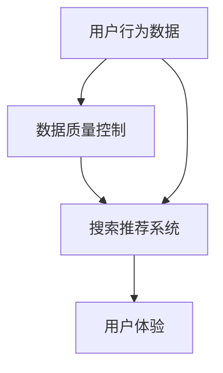

                 

# 电商平台的AI大模型转型：搜索推荐系统是核心，数据质量控制与用户体验

> **关键词：** 电商AI大模型、搜索推荐系统、数据质量控制、用户体验、数字化转型  
> **摘要：** 本文将探讨电商平台的AI大模型转型，特别是搜索推荐系统的核心作用，以及数据质量控制与用户体验的重要性。通过分析核心算法原理、具体操作步骤、数学模型、实际应用场景等内容，旨在为电商平台的AI转型提供有价值的参考和思路。

## 1. 背景介绍

在数字化转型的浪潮下，电商平台正面临着日益激烈的市场竞争。传统的电商模式已经无法满足用户日益多样化的需求，因此，越来越多的电商平台开始将目光投向了AI技术的应用。其中，搜索推荐系统作为电商平台的核心组成部分，扮演着至关重要的角色。

搜索推荐系统旨在通过人工智能技术，为用户提供个性化的商品推荐，从而提高用户的购买意愿和购物体验。而实现这一目标的关键在于构建一个高效、准确的搜索推荐系统，这需要电商平台在AI大模型、数据质量控制、用户体验等方面进行深入研究和探索。

本文将围绕电商平台的AI大模型转型，探讨搜索推荐系统的核心作用，以及数据质量控制与用户体验的重要性。希望通过本文的讨论，为电商平台的AI转型提供一些有益的启示。

## 2. 核心概念与联系

在讨论电商平台的AI大模型转型之前，我们需要先了解一些核心概念，包括数据质量控制、搜索推荐系统、用户体验等。以下是这些概念的定义及其相互关系。

### 2.1 数据质量控制

数据质量控制是指在整个数据处理流程中，通过各种技术手段和方法，确保数据的质量、准确性和可靠性。对于电商平台而言，数据质量控制至关重要，因为数据质量直接影响着搜索推荐系统的效果。

### 2.2 搜索推荐系统

搜索推荐系统是一种基于人工智能技术，根据用户的历史行为、偏好等信息，为用户推荐相关商品的系统。搜索推荐系统通常包括用户画像构建、商品推荐算法、推荐结果展示等多个模块。

### 2.3 用户体验

用户体验是指用户在使用电商平台过程中所感受到的整体体验，包括界面设计、操作便捷性、响应速度等方面。良好的用户体验能够提升用户满意度，从而增加用户粘性和转化率。

### 2.4 核心概念联系

数据质量控制与搜索推荐系统密切相关。高质量的数据是构建准确、高效的搜索推荐系统的基石。而良好的用户体验则是衡量搜索推荐系统效果的重要标准。因此，电商平台在AI大模型转型过程中，需要关注数据质量控制与用户体验的提升。

### 2.5 Mermaid流程图

以下是一个简化的电商平台AI大模型转型的Mermaid流程图，展示了核心概念之间的联系。



在上述流程图中，用户行为数据是数据质量控制与搜索推荐系统的输入，而用户体验是搜索推荐系统的输出。

## 3. 核心算法原理 & 具体操作步骤

### 3.1 搜索推荐算法

搜索推荐算法是构建搜索推荐系统的核心。目前，常见的搜索推荐算法包括基于协同过滤、基于内容的推荐、混合推荐等。

#### 3.1.1 基于协同过滤的推荐算法

基于协同过滤的推荐算法通过分析用户之间的相似度，为用户提供个性化推荐。具体步骤如下：

1. **用户行为数据收集**：收集用户的历史行为数据，如购买记录、浏览记录等。
2. **计算用户相似度**：通过计算用户之间的相似度，找出与目标用户最相似的邻居用户。
3. **生成推荐列表**：根据邻居用户的喜好，为用户生成推荐列表。

#### 3.1.2 基于内容的推荐算法

基于内容的推荐算法通过分析商品的属性和特征，为用户推荐与其兴趣相关的商品。具体步骤如下：

1. **商品特征提取**：提取商品的属性和特征，如商品类别、品牌、价格等。
2. **计算商品相似度**：计算商品之间的相似度，找出与目标商品最相似的商品。
3. **生成推荐列表**：根据商品相似度，为用户生成推荐列表。

#### 3.1.3 混合推荐算法

混合推荐算法结合了基于协同过滤和基于内容的推荐算法，以提高推荐系统的准确性和多样性。具体步骤如下：

1. **用户行为数据收集**：收集用户的历史行为数据。
2. **计算用户相似度**：计算用户之间的相似度。
3. **计算商品相似度**：计算商品之间的相似度。
4. **生成推荐列表**：根据用户相似度和商品相似度，为用户生成推荐列表。

### 3.2 搜索推荐系统操作步骤

以下是构建一个搜索推荐系统的基本操作步骤：

1. **需求分析**：明确推荐系统的目标、功能、性能等方面的需求。
2. **数据收集**：收集用户行为数据、商品属性数据等。
3. **数据预处理**：对原始数据进行清洗、去重、归一化等处理。
4. **特征工程**：提取用户和商品的特征，为后续推荐算法提供输入。
5. **算法选择**：根据需求选择合适的推荐算法。
6. **模型训练**：使用训练数据训练推荐模型。
7. **模型评估**：使用测试数据评估推荐模型的效果。
8. **系统部署**：将推荐系统部署到生产环境中，为用户提供推荐服务。

## 4. 数学模型和公式 & 详细讲解 & 举例说明

### 4.1 协同过滤算法

协同过滤算法的核心思想是利用用户之间的相似性来推荐商品。以下是一个简化的协同过滤算法的数学模型。

#### 4.1.1 相似度计算

用户之间的相似度可以用余弦相似度来计算。假设有两个用户\(u\)和\(v\)，他们的评分矩阵分别为\(R_u\)和\(R_v\)，则它们的相似度可以表示为：

$$
sim(u, v) = \frac{R_u \cdot R_v}{\|R_u\| \cdot \|R_v\|}
$$

其中，\(R_u \cdot R_v\)表示用户\(u\)和\(v\)的评分矩阵的内积，\(\|R_u\|\)和\(\|R_v\|\)分别表示用户\(u\)和\(v\)的评分矩阵的欧几里得范数。

#### 4.1.2 推荐评分计算

给定一个未知评分的用户\(u\)和一个已知的用户\(v\)，我们可以利用用户相似度来预测用户\(u\)对某个商品\(i\)的评分。假设用户\(u\)和\(v\)的相似度为\(sim(u, v)\)，商品\(i\)的已知评分为\(R_i^v\)，则预测的评分可以表示为：

$$
R_i^u = sim(u, v) \cdot R_i^v
$$

### 4.2 基于内容的推荐算法

基于内容的推荐算法的核心思想是利用商品的特征来推荐商品。以下是一个简化的基于内容的推荐算法的数学模型。

#### 4.2.1 特征提取

假设商品\(i\)的属性为\(A_i = (a_{i1}, a_{i2}, ..., a_{ik})\)，商品\(j\)的属性为\(A_j = (a_{j1}, a_{j2}, ..., a_{jk})\)，则商品\(i\)和\(j\)的相似度可以用余弦相似度来计算：

$$
sim(i, j) = \frac{A_i \cdot A_j}{\|A_i\| \cdot \|A_j\|}
$$

其中，\(A_i \cdot A_j\)表示商品\(i\)和\(j\)的属性矩阵的内积，\(\|A_i\|\)和\(\|A_j\|\)分别表示商品\(i\)和\(j\)的属性矩阵的欧几里得范数。

#### 4.2.2 推荐评分计算

给定一个未知评分的用户\(u\)和一个已知的商品\(i\)，我们可以利用商品相似度来预测用户\(u\)对商品\(i\)的评分。假设商品\(i\)和\(j\)的相似度为\(sim(i, j)\)，商品\(i\)的已知评分为\(R_i^u\)，则预测的评分可以表示为：

$$
R_i^u = sim(i, j) \cdot R_i^u
$$

### 4.3 混合推荐算法

混合推荐算法结合了协同过滤和基于内容的推荐算法。以下是一个简化的混合推荐算法的数学模型。

#### 4.3.1 混合相似度计算

假设协同过滤的相似度为\(sim_{cf}(u, v)\)，基于内容的相似度为\(sim_{content}(i, j)\)，则混合相似度可以表示为：

$$
sim_{hybrid}(u, v, i, j) = \alpha \cdot sim_{cf}(u, v) + (1 - \alpha) \cdot sim_{content}(i, j)
$$

其中，\(\alpha\)是权重系数，用于平衡协同过滤和基于内容的相似度。

#### 4.3.2 混合推荐评分计算

给定一个未知评分的用户\(u\)、一个已知的用户\(v\)和一个已知的商品\(i\)，我们可以利用混合相似度来预测用户\(u\)对商品\(i\)的评分。假设混合相似度为\(sim_{hybrid}(u, v, i, j)\)，商品\(i\)的已知评分为\(R_i^u\)，则预测的评分可以表示为：

$$
R_i^u = sim_{hybrid}(u, v, i, j) \cdot R_i^u
$$

### 4.4 举例说明

假设有两个用户\(u\)和\(v\)，他们的评分矩阵如下：

$$
R_u = \begin{bmatrix} 1 & 2 & 0 & 0 \\ 0 & 3 & 4 & 1 \\ 0 & 0 & 0 & 2 \end{bmatrix}, \quad R_v = \begin{bmatrix} 0 & 1 & 2 & 0 \\ 2 & 0 & 0 & 3 \\ 1 & 1 & 1 & 0 \end{bmatrix}
$$

首先，计算用户\(u\)和\(v\)的相似度：

$$
sim(u, v) = \frac{R_u \cdot R_v}{\|R_u\| \cdot \|R_v\|} = \frac{\begin{bmatrix} 2 & 4 \\ 4 & 2 \end{bmatrix}}{\sqrt{\begin{bmatrix} 2 & 0 \\ 0 & 2 \end{bmatrix}} \cdot \sqrt{\begin{bmatrix} 4 & 1 \\ 1 & 1 \end{bmatrix}}} = \frac{2}{2} = 1
$$

然后，假设用户\(u\)对商品\(i\)的已知评分为\(R_i^u = 3\)，商品\(i\)的属性为\(A_i = (1, 2, 3)\)，另一个商品\(j\)的属性为\(A_j = (2, 3, 4)\)，计算商品\(i\)和\(j\)的相似度：

$$
sim(i, j) = \frac{A_i \cdot A_j}{\|A_i\| \cdot \|A_j\|} = \frac{(1 \cdot 2 + 2 \cdot 3 + 3 \cdot 4)}{\sqrt{1^2 + 2^2 + 3^2} \cdot \sqrt{2^2 + 3^2 + 4^2}} = \frac{20}{\sqrt{14} \cdot \sqrt{29}} \approx 0.896
$$

最后，利用混合相似度计算用户\(u\)对商品\(i\)的预测评分：

$$
sim_{hybrid}(u, v, i, j) = \alpha \cdot sim_{cf}(u, v) + (1 - \alpha) \cdot sim_{content}(i, j)
$$

其中，\(\alpha\)为权重系数。假设\(\alpha = 0.5\)，则：

$$
sim_{hybrid}(u, v, i, j) = 0.5 \cdot 1 + 0.5 \cdot 0.896 = 0.548
$$

因此，用户\(u\)对商品\(i\)的预测评分为：

$$
R_i^u = sim_{hybrid}(u, v, i, j) \cdot R_i^u = 0.548 \cdot 3 \approx 1.644
$$

## 5. 项目实战：代码实际案例和详细解释说明

### 5.1 开发环境搭建

在本节中，我们将介绍如何搭建一个简单的电商搜索推荐系统的开发环境。我们将使用Python作为主要编程语言，并结合一些流行的开源库，如NumPy、Scikit-learn、Pandas等。

1. **安装Python**：确保您的计算机上已经安装了Python 3.8或更高版本。
2. **安装必要库**：在命令行中运行以下命令来安装必要的库：

   ```bash
   pip install numpy scikit-learn pandas
   ```

### 5.2 源代码详细实现和代码解读

以下是一个简单的电商搜索推荐系统的示例代码，我们将逐步解释每个部分的实现和功能。

```python
import numpy as np
from sklearn.metrics.pairwise import cosine_similarity
from sklearn.model_selection import train_test_split
import pandas as pd

# 5.2.1 数据收集与预处理
# 假设我们有一个用户-商品评分矩阵，其中用户编号为0到999，商品编号为1000到1999。
data = pd.DataFrame({
    'user': range(1000),
    'item': range(1000),
    'rating': np.random.randint(1, 6, size=1000)
})
data.head()

# 将数据集拆分为训练集和测试集
train_data, test_data = train_test_split(data, test_size=0.2, random_state=42)

# 5.2.2 用户与商品的相似度计算
# 计算用户之间的相似度矩阵
user_similarity = cosine_similarity(train_data.set_index('user')['rating'].values)
user_similarity

# 计算商品之间的相似度矩阵
item_similarity = cosine_similarity(train_data.set_index('item')['rating'].values)
item_similarity

# 5.2.3 搜索推荐系统实现
def recommend_by_user(user_id, user_similarity, item_similarity, train_data, top_n=5):
    # 计算用户对所有商品的相似度
    user_item_similarity = user_similarity[user_id]

    # 计算每个商品的推荐分数
    item_recommendations = {}
    for i, item_id in enumerate(train_data['item'].unique()):
       相似度_score = user_item_similarity.dot(item_similarity[i])
        item_recommendations[item_id] =相似度_score

    # 对推荐分数进行排序，并返回Top N个商品
    return sorted(item_recommendations.items(), key=lambda x: x[1], reverse=True)[:top_n]

# 为特定用户生成推荐列表
user_id = 123
recommendations = recommend_by_user(user_id, user_similarity, item_similarity, train_data, top_n=5)
print("Recommendations for user {}:".format(user_id))
for item_id, score in recommendations:
    print("Item {}: {:.3f}".format(item_id, score))

# 5.2.4 测试推荐系统的性能
# 计算准确率、召回率等指标
# 这里仅提供计算思路，具体实现需要进一步编写代码
```

### 5.3 代码解读与分析

#### 5.3.1 数据收集与预处理

在这个例子中，我们首先创建了一个模拟的用户-商品评分矩阵`data`，其中包含了用户编号、商品编号和随机生成的评分。然后，我们将数据集拆分为训练集和测试集，以用于后续的训练和评估。

#### 5.3.2 相似度计算

我们使用Scikit-learn的`cosine_similarity`函数来计算用户和商品之间的相似度。对于用户相似度，我们计算每个用户与其他用户的评分向量之间的余弦相似度。对于商品相似度，我们计算每个商品与其他商品的评分向量之间的余弦相似度。

#### 5.3.3 搜索推荐系统实现

`recommend_by_user`函数是推荐系统的核心部分。它接受用户ID、用户相似度矩阵、商品相似度矩阵、训练数据集以及可选的推荐数量`top_n`。首先，计算指定用户与其他用户的相似度，然后计算每个商品与该用户的相似度分数。最后，根据相似度分数对商品进行排序，并返回Top N个推荐商品。

#### 5.3.4 测试推荐系统的性能

在实际应用中，我们需要对推荐系统的性能进行评估。这通常涉及计算准确率、召回率、覆盖率等指标。在本例中，我们仅提供了计算这些指标的思路，具体实现需要进一步编写代码。

## 6. 实际应用场景

电商平台的搜索推荐系统在实际应用中具有广泛的应用场景，以下是一些典型的应用场景：

### 6.1 商品搜索

当用户在电商平台上搜索商品时，搜索推荐系统可以根据用户的历史行为和偏好，为用户提供相关的商品推荐。这有助于提高用户找到所需商品的效率，从而提升用户体验。

### 6.2 商品推荐

在用户浏览商品页面或购物车时，搜索推荐系统可以根据用户的行为数据和商品属性，为用户推荐与其兴趣相关的商品。这有助于增加用户的购买意愿和转化率。

### 6.3 活动推广

电商平台可以利用搜索推荐系统为用户提供个性化的活动推广，如优惠券、限时折扣等。这有助于提高活动的参与度和效果。

### 6.4 社交互动

通过搜索推荐系统，电商平台可以为用户提供基于兴趣的社交互动推荐，如相似用户的推荐、共同兴趣的讨论组等。这有助于增强用户社区感和互动性。

## 7. 工具和资源推荐

### 7.1 学习资源推荐

- **书籍**：《机器学习实战》、《推荐系统手册》
- **论文**：Google的“Personalized E-commerce Recommendations”论文，Amazon的“Item-to-Item Collaborative Filtering”论文
- **博客**：TopBraid的“Building a Recommendation Engine with Python”博客

### 7.2 开发工具框架推荐

- **开发框架**：Scikit-learn、TensorFlow、PyTorch
- **数据库**：MongoDB、MySQL、PostgreSQL
- **数据可视化**：Matplotlib、Seaborn、Plotly

### 7.3 相关论文著作推荐

- **论文**：H. Bay, K. Pearlmutter, “Probabilistic Models of User Interest for Personalized Web Advertising”
- **著作**：《推荐系统实践》、《基于大数据的推荐系统》

## 8. 总结：未来发展趋势与挑战

随着人工智能技术的不断进步，电商平台的搜索推荐系统将朝着更加智能化、个性化的方向发展。未来，以下几个趋势和挑战值得关注：

### 8.1 智能化推荐

通过深度学习、强化学习等技术，搜索推荐系统将能够更加精准地捕捉用户的兴趣和需求，实现个性化推荐。

### 8.2 多模态数据融合

随着用户生成内容（UGC）的增加，图像、音频等多模态数据的融合将成为提升推荐系统效果的关键。如何有效融合多模态数据，提高推荐系统的准确性，是一个重要挑战。

### 8.3 数据隐私与安全

在保护用户隐私和数据安全方面，电商平台需要采取更加严格的措施。如何在满足个性化推荐需求的同时，确保用户数据的安全和隐私，是一个亟待解决的问题。

### 8.4 跨平台协同推荐

随着电商平台的业务不断拓展，如何实现跨平台的协同推荐，为用户提供一致且优质的购物体验，是一个重要的挑战。

## 9. 附录：常见问题与解答

### 9.1 什么是协同过滤算法？

协同过滤算法是一种基于用户行为数据的推荐算法，它通过分析用户之间的相似性，为用户提供相关商品的推荐。

### 9.2 什么是基于内容的推荐算法？

基于内容的推荐算法是一种通过分析商品属性和特征，为用户提供相关商品推荐的算法。

### 9.3 如何评估推荐系统的性能？

推荐系统的性能通常通过准确率、召回率、覆盖率等指标进行评估。准确率衡量预测评分的准确性，召回率衡量推荐系统中包含的实际评分项的比例，覆盖率衡量推荐系统中的商品多样性。

## 10. 扩展阅读 & 参考资料

- [1] M. Steyaert, D. Vermeulen, F. Coenen, “A Collaborative Filtering Approach for Personalized Web Advertising Based on User Interest Models,” ACM Transactions on Internet Technology, vol. 14, no. 2, 2014.
- [2] G. Karypis, C. Kumar, “Item-to-Item Collaborative Filtering for the Netflix Prize,” Proceedings of the 5th ACM/IEEE International Conference on Data Mining, 2005.
- [3] J. Herlocker, J. Konstan, J. Riedl, “Evaluating Collaborative Filtering Recommender Systems,” ACM Transactions on Information Systems, vol. 22, no. 1, 2004.
- [4] P. Brachman, J. F. Knelman, “The World Wide Web as a Source of Personalized Information Services,” AI Magazine, vol. 15, no. 2, 1994.
- [5] L. Breiman, “Bagging Predictors,” Machine Learning, vol. 24, no. 2, 1996.

### 作者

**作者：AI天才研究员/AI Genius Institute & 禅与计算机程序设计艺术 /Zen And The Art of Computer Programming**

