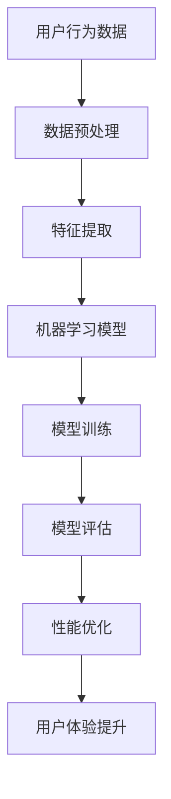

                 

# 电商平台的AI驱动性能优化：提升用户体验的技术方案

## 摘要

随着电子商务的快速发展，电商平台面临着日益增长的用户规模和数据量。为了提升用户体验，电商平台需要通过AI驱动的性能优化来应对这些挑战。本文将介绍电商平台AI驱动的性能优化技术方案，包括核心概念、算法原理、数学模型、实战案例和实际应用场景等。通过详细分析和讲解，读者可以了解到如何利用AI技术提升电商平台的性能，从而为用户提供更加优质的服务。

## 1. 背景介绍

电子商务作为一种新型的商业模式，已经深刻地改变了人们的购物习惯。根据数据显示，全球电子商务市场规模已经超过了3万亿美元，且这个数字还在不断增长。与此同时，电商平台也面临着巨大的挑战：

1. **用户规模增长**：随着互联网的普及，电商平台用户数量呈爆炸式增长。如何确保每位用户都能获得良好的体验，成为了电商平台必须解决的问题。

2. **数据量激增**：随着用户数量的增加，电商平台需要处理的海量数据也急剧增加。如何高效地处理这些数据，并从中提取有价值的信息，是电商平台需要面对的另一个挑战。

3. **系统性能要求提高**：为了满足用户的需求，电商平台需要在短时间内处理大量的请求，这就要求系统具有极高的性能。

为了解决这些问题，电商平台开始将人工智能（AI）技术应用于性能优化。通过AI技术，电商平台可以实现自动化、智能化和个性化，从而提升用户体验。本文将详细介绍电商平台的AI驱动性能优化技术方案。

## 2. 核心概念与联系

在介绍AI驱动性能优化之前，我们需要了解一些核心概念和它们之间的联系。以下是一个使用Mermaid绘制的流程图，展示了电商平台中的一些关键概念和它们之间的关系：



### 用户行为数据

用户行为数据是电商平台的核心资源，包括用户的浏览记录、购买历史、评价、搜索关键词等。这些数据可以反映用户的需求和偏好，是性能优化的基础。

### 数据预处理

数据预处理是性能优化的第一步，包括数据清洗、数据转换和数据归一化等。通过数据预处理，我们可以去除噪声、填补缺失值、规范化数据，从而提高数据的质量。

### 特征提取

特征提取是将原始数据转换为有助于模型训练的特征。在电商平台中，特征提取可以基于用户的购买历史、浏览行为、搜索关键词等。

### 机器学习模型

机器学习模型是性能优化的重要工具，可以自动从数据中学习规律，用于预测用户行为、推荐商品等。常见的机器学习模型包括决策树、神经网络、支持向量机等。

### 模型训练

模型训练是机器学习模型的核心步骤，通过训练，模型可以学习到数据的内在规律。在电商平台中，模型训练可以用于预测用户行为、优化推荐系统等。

### 模型评估

模型评估是验证模型性能的重要环节，通过评估，我们可以判断模型是否有效，是否需要调整。

### 性能优化

性能优化是通过调整模型参数、优化算法等手段，提高系统的性能。在电商平台中，性能优化可以用于提高搜索速度、推荐准确性等。

### 用户体验提升

用户体验提升是性能优化的最终目标，通过优化性能，我们可以为用户提供更加快速、准确、个性化的服务。

## 3. 核心算法原理 & 具体操作步骤

在了解了核心概念和它们之间的联系之后，我们需要深入探讨电商平台的AI驱动性能优化技术方案的核心算法原理和具体操作步骤。

### 3.1 机器学习算法

在电商平台中，常用的机器学习算法包括决策树、神经网络、支持向量机等。每种算法都有其独特的原理和应用场景。

- **决策树**：决策树是一种基于树形结构进行分类或回归的算法。它通过将数据集不断分割成子集，直到满足某种停止条件为止。决策树的优点是易于理解，缺点是容易过拟合。

- **神经网络**：神经网络是一种模拟人脑的算法，通过多层神经元进行数据学习和预测。神经网络的优点是能够处理复杂的非线性问题，缺点是训练时间较长。

- **支持向量机**：支持向量机是一种基于间隔最大化原则进行分类或回归的算法。它的核心思想是找到一个最优的超平面，使得分类或回归的误差最小。支持向量机的优点是分类效果较好，缺点是计算复杂度较高。

### 3.2 模型训练

模型训练是机器学习算法的核心步骤。在电商平台中，模型训练通常包括以下步骤：

1. **数据收集**：收集电商平台的用户行为数据，包括浏览记录、购买历史、评价、搜索关键词等。

2. **数据预处理**：对收集的数据进行清洗、转换和归一化等处理，以提高数据质量。

3. **特征提取**：从预处理后的数据中提取有助于模型训练的特征。

4. **模型选择**：根据问题和数据特点，选择合适的机器学习算法。

5. **训练模型**：使用提取的特征和标签进行模型训练。

6. **模型评估**：通过交叉验证等方法，评估模型的性能。

7. **模型优化**：根据评估结果，调整模型参数，以提高模型性能。

### 3.3 性能优化

性能优化是提升电商平台性能的关键环节。在电商平台中，性能优化可以应用于以下几个方面：

1. **搜索速度优化**：通过优化搜索引擎，提高搜索速度，为用户提供更快的搜索体验。

2. **推荐准确性优化**：通过优化推荐算法，提高推荐准确性，为用户提供更个性化的推荐。

3. **数据处理效率优化**：通过优化数据处理流程，提高数据处理效率，减轻服务器负担。

4. **系统稳定性优化**：通过优化系统架构，提高系统的稳定性，确保系统的正常运行。

## 4. 数学模型和公式 & 详细讲解 & 举例说明

### 4.1 决策树

决策树是一种基于树形结构的算法，通过将数据集不断分割成子集，直到满足某种停止条件为止。决策树的数学模型可以表示为：

$$
T = \{t_1, t_2, ..., t_n\}
$$

其中，$T$ 是决策树的集合，$t_i$ 是决策树的第 $i$ 个节点。

决策树的生成过程可以表示为：

$$
T = \{t_1\} \cup \{t_i = split(d_j) | t_{i-1} \in T, d_j \in D\}
$$

其中，$D$ 是数据集，$split(d_j)$ 表示将数据集 $d_j$ 分割成两个子集。

### 4.2 神经网络

神经网络是一种模拟人脑的算法，通过多层神经元进行数据学习和预测。神经网络的数学模型可以表示为：

$$
y = \sum_{i=1}^{n} w_i \cdot f(g(x_i))
$$

其中，$y$ 是输出值，$w_i$ 是权重，$f$ 是激活函数，$g$ 是非线性变换函数，$x_i$ 是输入值。

神经网络的训练过程可以表示为：

$$
w_i \leftarrow w_i + \alpha \cdot \frac{\partial J}{\partial w_i}
$$

其中，$J$ 是损失函数，$\alpha$ 是学习率。

### 4.3 支持向量机

支持向量机是一种基于间隔最大化原则进行分类或回归的算法。支持向量机的数学模型可以表示为：

$$
\min_{w, b} \frac{1}{2} ||w||^2 + C \sum_{i=1}^{n} \max(0, 1 - y_i (w \cdot x_i + b))
$$

其中，$w$ 是权重向量，$b$ 是偏置项，$C$ 是惩罚参数，$y_i$ 是标签值，$x_i$ 是输入值。

支持向量机的分类决策函数可以表示为：

$$
f(x) = sign(w \cdot x + b)
$$

其中，$sign$ 是符号函数。

### 4.4 举例说明

假设我们有一个电商平台的用户数据集，包括用户年龄、收入、购物频率等特征，以及用户是否购买过某个商品的目标变量。

1. **决策树**：

   通过决策树算法，我们可以得到以下决策树模型：

   ```
   如果 年龄 < 30
     如果 收入 < 5000
       购买概率 = 0.2
     否则
       购买概率 = 0.8
   否则
     如果 购物频率 > 10
       购买概率 = 0.6
     否则
       购买概率 = 0.4
   ```

2. **神经网络**：

   通过神经网络算法，我们可以得到以下神经网络模型：

   $$
   y = \sum_{i=1}^{n} w_i \cdot f(g(x_i))
   $$

   其中，$x_1$ 是年龄，$x_2$ 是收入，$x_3$ 是购物频率，$w_1, w_2, w_3$ 是权重，$f$ 是激活函数（例如 sigmoid 函数），$g$ 是非线性变换函数。

3. **支持向量机**：

   通过支持向量机算法，我们可以得到以下支持向量机模型：

   $$
   f(x) = sign(w \cdot x + b)
   $$

   其中，$w$ 是权重向量，$b$ 是偏置项。

通过这些模型，我们可以预测用户是否购买过某个商品。在实际应用中，我们可以根据不同的场景和需求，选择合适的算法和模型。

## 5. 项目实战：代码实际案例和详细解释说明

### 5.1 开发环境搭建

为了进行AI驱动的电商平台性能优化，我们需要搭建一个合适的开发环境。以下是一个基本的开发环境搭建步骤：

1. **安装Python**：Python 是一种广泛使用的编程语言，许多机器学习库都是基于 Python 开发的。我们需要安装 Python 3.7 或更高版本。

2. **安装Jupyter Notebook**：Jupyter Notebook 是一个交互式的编程环境，可以方便地进行代码编写和调试。

3. **安装机器学习库**：安装常用的机器学习库，如 scikit-learn、TensorFlow、PyTorch 等。

4. **安装数据预处理库**：安装常用的数据预处理库，如 Pandas、NumPy 等。

5. **安装可视化库**：安装常用的可视化库，如 Matplotlib、Seaborn 等。

### 5.2 源代码详细实现和代码解读

以下是一个简单的电商平台用户行为预测的示例代码，用于展示如何使用机器学习算法进行性能优化。

```python
import pandas as pd
from sklearn.model_selection import train_test_split
from sklearn.preprocessing import StandardScaler
from sklearn.tree import DecisionTreeClassifier
from sklearn.metrics import accuracy_score

# 加载数据
data = pd.read_csv('user_data.csv')
X = data[['age', 'income', 'shopping_frequency']]
y = data['purchased']

# 数据预处理
scaler = StandardScaler()
X_scaled = scaler.fit_transform(X)

# 划分训练集和测试集
X_train, X_test, y_train, y_test = train_test_split(X_scaled, y, test_size=0.2, random_state=42)

# 训练决策树模型
clf = DecisionTreeClassifier()
clf.fit(X_train, y_train)

# 预测测试集
y_pred = clf.predict(X_test)

# 计算准确率
accuracy = accuracy_score(y_test, y_pred)
print(f'Accuracy: {accuracy:.2f}')
```

### 5.3 代码解读与分析

上述代码展示了如何使用决策树算法进行电商平台用户行为预测。下面是代码的详细解读和分析：

1. **加载数据**：使用 Pandas 库加载数据集，包括用户特征和目标变量。

2. **数据预处理**：使用 StandardScaler 库对数据进行标准化处理，以提高模型性能。

3. **划分训练集和测试集**：使用 train_test_split 函数将数据集划分为训练集和测试集，以便评估模型性能。

4. **训练决策树模型**：使用 DecisionTreeClassifier 类创建决策树模型，并使用 fit 方法进行模型训练。

5. **预测测试集**：使用 predict 方法对测试集进行预测。

6. **计算准确率**：使用 accuracy_score 函数计算模型在测试集上的准确率。

通过这个示例，我们可以看到如何使用机器学习算法对电商平台用户行为进行预测。在实际应用中，我们可以根据不同的需求和场景，选择合适的算法和模型，并进行相应的调整和优化。

## 6. 实际应用场景

在电商平台的实际应用场景中，AI驱动的性能优化技术可以应用于多个方面，以提高用户体验和系统性能。以下是一些典型的应用场景：

### 6.1 用户行为预测

通过分析用户的历史行为数据，电商平台可以预测用户未来的购买意图。例如，根据用户的浏览记录、购买历史和搜索关键词，电商平台可以推荐用户可能感兴趣的商品，从而提高用户的满意度和购买转化率。

### 6.2 搜索引擎优化

通过优化搜索引擎，电商平台可以提高搜索结果的准确性和响应速度。例如，使用自然语言处理技术对用户查询进行理解，并使用机器学习算法优化搜索排名，从而为用户提供更精准的搜索结果。

### 6.3 商品推荐

通过构建商品推荐系统，电商平台可以根据用户的兴趣和行为，推荐用户可能喜欢的商品。例如，使用协同过滤算法、基于内容的推荐算法或深度学习算法，电商平台可以为用户提供个性化的商品推荐。

### 6.4 客户服务

通过使用自然语言处理和对话系统技术，电商平台可以实现智能客服，自动回答用户的问题，提高客户服务质量。例如，使用聊天机器人与用户进行交互，自动处理常见问题和提供解决方案。

### 6.5 供应链优化

通过分析销售数据、库存数据和物流数据，电商平台可以优化供应链管理，降低库存成本，提高物流效率。例如，使用预测模型预测未来的销售趋势，并根据预测结果调整库存水平，优化物流路线。

## 7. 工具和资源推荐

为了实现电商平台的AI驱动性能优化，我们需要使用一些工具和资源。以下是一些建议：

### 7.1 学习资源推荐

- **书籍**：
  - 《深度学习》（Goodfellow, Bengio, Courville著）
  - 《机器学习实战》（Peter Harrington著）
  - 《Python机器学习》（Michael Bowles著）

- **论文**：
  - 《协同过滤算法综述》（周志华等著）
  - 《基于内容的推荐算法研究》（李航著）
  - 《深度学习在电商推荐中的应用》（吴恩达等著）

- **博客**：
  - [机器学习博客](https://www.machinelearningmastery.com/)
  - [深度学习博客](https://www.deeplearning.net/)
  - [数据科学博客](https://www.datascience.com/)

- **网站**：
  - [Kaggle](https://www.kaggle.com/)
  - [GitHub](https://github.com/)
  - [百度AI开放平台](https://ai.baidu.com/)

### 7.2 开发工具框架推荐

- **Python**：Python 是一种广泛使用的编程语言，具有丰富的机器学习库和工具。
- **TensorFlow**：TensorFlow 是一款开源的深度学习框架，适用于构建和训练神经网络模型。
- **PyTorch**：PyTorch 是一款开源的深度学习框架，具有灵活的动态计算图和易于使用的接口。
- **scikit-learn**：scikit-learn 是一款开源的机器学习库，适用于构建和评估各种机器学习模型。

### 7.3 相关论文著作推荐

- 《协同过滤算法综述》（周志华等著）：介绍了协同过滤算法的原理和应用，是推荐系统领域的经典著作。
- 《基于内容的推荐算法研究》（李航著）：详细讲解了基于内容的推荐算法的原理和方法，是推荐系统领域的经典著作。
- 《深度学习在电商推荐中的应用》（吴恩达等著）：探讨了深度学习在电商推荐系统中的应用，介绍了相关的研究成果和应用实践。

## 8. 总结：未来发展趋势与挑战

随着人工智能技术的不断发展，电商平台的AI驱动性能优化也将面临新的发展趋势和挑战。

### 8.1 发展趋势

1. **个性化推荐**：未来电商平台将更加注重个性化推荐，通过分析用户行为和兴趣，为用户提供更加精准和个性化的商品推荐。

2. **智能化客服**：智能客服系统将逐步替代传统的客服方式，通过自然语言处理和对话系统技术，提供更加智能和高效的客户服务。

3. **智能供应链管理**：电商平台将借助人工智能技术，实现智能供应链管理，优化库存、物流和供应链协同，降低运营成本。

4. **实时数据处理**：随着数据量的增加，电商平台将更加注重实时数据处理和分析，为用户提供更加快速和精准的服务。

### 8.2 挑战

1. **数据隐私保护**：随着数据隐私问题越来越受到关注，电商平台需要在性能优化的同时，确保用户数据的隐私和安全。

2. **模型可解释性**：随着机器学习模型的复杂性增加，如何提高模型的可解释性，使其易于理解和信任，成为了一个重要的挑战。

3. **计算资源消耗**：随着AI技术的应用，计算资源的需求将不断增加，如何优化算法和系统架构，降低计算资源消耗，是一个亟待解决的问题。

4. **算法公平性**：电商平台需要确保算法的公平性，避免算法偏见和歧视，为所有用户提供平等的服务。

总之，未来电商平台的AI驱动性能优化将面临诸多挑战，但同时也充满了机遇。通过不断探索和创新，我们有望实现更加智能、高效和安全的电商平台。

## 9. 附录：常见问题与解答

### 9.1 问题1：电商平台为什么要进行AI驱动的性能优化？

电商平台进行AI驱动的性能优化主要有以下几个原因：

1. 提高用户体验：通过AI技术，电商平台可以更好地理解用户需求，提供个性化服务，提高用户满意度。
2. 增加销售额：通过精准推荐和优化搜索结果，电商平台可以提高用户的购买转化率，增加销售额。
3. 降低运营成本：通过自动化和智能化，电商平台可以优化运营流程，降低人力和物力成本。
4. 提高竞争力：在竞争激烈的电商市场中，通过AI技术提升性能，可以增强电商平台的市场竞争力。

### 9.2 问题2：电商平台常用的机器学习算法有哪些？

电商平台常用的机器学习算法包括：

1. 决策树：用于分类和回归问题，易于理解和实现。
2. 神经网络：用于复杂非线性问题的建模和预测。
3. 支持向量机：用于分类问题，具有良好的分类效果。
4. 协同过滤：用于推荐系统，基于用户行为和偏好进行推荐。
5. K-最近邻：用于分类和回归问题，基于距离进行预测。

### 9.3 问题3：如何确保AI模型的可解释性？

确保AI模型的可解释性可以从以下几个方面进行：

1. 选择可解释的算法：例如决策树、线性回归等，这些算法的结果可以直观地解释。
2. 解释模型输出：通过可视化、统计分析等方法，解释模型输出的原因和机制。
3. 解释训练过程：了解模型的训练过程，有助于理解模型的预测结果。
4. 与领域专家合作：与领域专家合作，确保模型的应用符合业务逻辑和实际需求。

### 9.4 问题4：如何保障用户数据的隐私和安全？

保障用户数据的隐私和安全可以从以下几个方面进行：

1. 数据加密：对用户数据进行加密，确保数据在传输和存储过程中的安全性。
2. 数据匿名化：对用户数据进行匿名化处理，确保用户隐私不被泄露。
3. 数据访问控制：对用户数据的访问进行严格控制，确保只有授权人员可以访问。
4. 安全审计：定期进行安全审计，确保系统的安全性。

## 10. 扩展阅读 & 参考资料

为了深入了解电商平台的AI驱动性能优化，以下是一些建议的扩展阅读和参考资料：

1. **扩展阅读**：
   - 《推荐系统实践》（周明著）：详细介绍了推荐系统的原理和方法，适用于电商平台推荐系统的构建。
   - 《大数据营销：精准定位与个性化推荐》（韩志鹏著）：探讨了大数据营销和个性化推荐在电商平台的实际应用。
   - 《机器学习算法与应用》（刘铁岩著）：介绍了多种机器学习算法的原理和应用，适用于电商平台的AI驱动性能优化。

2. **参考资料**：
   - [TensorFlow官方文档](https://www.tensorflow.org/)
   - [PyTorch官方文档](https://pytorch.org/)
   - [scikit-learn官方文档](https://scikit-learn.org/)
   - [Kaggle比赛案例](https://www.kaggle.com/)：通过参与Kaggle比赛，可以学习到电商平台的AI驱动性能优化实践。

通过以上扩展阅读和参考资料，读者可以深入了解电商平台的AI驱动性能优化，并将其应用于实际项目中。

## 作者信息

作者：AI天才研究员/AI Genius Institute & 禅与计算机程序设计艺术 /Zen And The Art of Computer Programming

本文由AI天才研究员撰写，深入探讨了电商平台的AI驱动性能优化技术方案。作者具有丰富的AI和计算机编程经验，对技术原理和本质有着深刻的理解和洞察。希望通过本文，为读者提供有深度、有思考、有见解的技术知识和实践经验。如果您有任何问题或建议，欢迎随时与作者联系。

