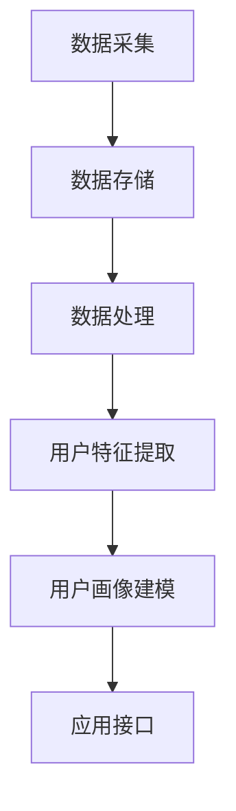

                 

### 1. 背景介绍

在当今的数字时代，电子商务平台已经成为商业运营中不可或缺的一部分。随着互联网技术的迅猛发展，电商平台在提供更加丰富和个性化的用户体验方面也不断提升。用户画像（User Profiling）作为一种有效的数据分析工具，成为电商企业提高营销效果和用户满意度的重要手段。

用户画像是指通过收集和分析用户的各类数据，构建出反映用户需求、行为习惯、偏好等特征的综合模型。这种模型不仅能够帮助企业精准地了解用户，还能为后续的个性化推荐、精准营销等提供数据支持。

近年来，人工智能（AI）技术在用户画像领域得到了广泛应用。AI算法通过机器学习、深度学习等技术手段，可以从海量用户数据中提取出有用的信息，并形成对用户的精准刻画。这不仅提高了用户画像的准确性，还使企业在面对不断变化的用户需求时能够迅速做出调整。

本文旨在探讨电商平台如何利用AI驱动用户画像，构建精准营销的数据基础。通过分析用户画像的核心概念、算法原理、数学模型以及实际应用案例，本文将帮助读者深入了解用户画像在现代电商中的应用价值和发展趋势。

用户画像在电商平台中的重要性不言而喻。首先，它能够帮助企业更好地理解用户，从而提供更加个性化的产品和服务。例如，根据用户的购买历史、浏览行为等数据，电商平台可以推荐用户可能感兴趣的商品，提高用户的购物体验和满意度。其次，用户画像还可以帮助企业进行精准营销，通过分析用户的特征和行为，定制出更加有效的营销策略，提高营销效果和转化率。此外，用户画像还可以为电商平台的运营和决策提供数据支持，帮助企业在竞争激烈的市场中占据优势地位。

总之，用户画像已经成为电商平台提高运营效率和用户满意度的重要手段。随着AI技术的不断发展，用户画像的精度和效果将进一步提升，为电商企业带来更多的商业价值。

### 2. 核心概念与联系

#### 用户画像（User Profiling）

用户画像是一种基于数据分析技术，对用户特征进行综合描述和刻画的方法。它通过对用户在电商平台上的行为数据、交易数据、浏览数据等多维度信息进行分析，构建出反映用户需求、行为习惯、偏好等特征的模型。

用户画像的核心目标是帮助企业更好地理解用户，从而为产品推荐、精准营销、用户服务等方面提供数据支持。具体来说，用户画像包括以下几个关键要素：

- **用户特征**：包括用户的性别、年龄、地理位置、职业、收入水平等基本信息。
- **行为数据**：包括用户的浏览记录、搜索历史、购买行为、评价反馈等。
- **偏好数据**：包括用户的兴趣爱好、消费偏好、购买习惯等。

#### 用户画像系统架构

为了实现用户画像的构建，电商平台通常需要一个完整的用户画像系统。该系统通常包括以下几个关键组成部分：

1. **数据采集**：通过多种渠道（如API接口、日志收集等）收集用户行为数据、交易数据等。
2. **数据存储**：使用大数据技术（如Hadoop、Spark等）存储和管理海量用户数据。
3. **数据处理**：对采集到的用户数据进行清洗、转换、集成等处理，为后续建模提供高质量的数据。
4. **用户特征提取**：利用机器学习、深度学习等技术，从用户数据中提取出有效的用户特征。
5. **用户画像建模**：将提取出的用户特征进行建模，形成对用户的精准刻画。
6. **应用接口**：为业务系统提供用户画像的查询、更新、推荐等功能。

#### 用户画像与精准营销的联系

用户画像与精准营销密切相关。精准营销是指根据用户的特征和行为，制定出具有针对性的营销策略，以提高营销效果和转化率。用户画像为精准营销提供了重要的数据基础：

- **个性化推荐**：通过分析用户的行为数据和偏好数据，为用户推荐可能感兴趣的商品或服务。
- **定制化广告**：根据用户的兴趣和行为，投放个性化的广告，提高广告的点击率和转化率。
- **定制化营销活动**：根据用户的特征和行为，设计出符合用户需求的营销活动，提高营销效果。

#### 用户画像与运营决策

用户画像不仅为精准营销提供支持，还为电商平台的运营决策提供了重要依据：

- **用户分群**：根据用户的特征和行为，将用户划分为不同的群体，针对不同群体制定差异化的运营策略。
- **运营优化**：通过分析用户画像数据，发现运营中的问题和不足，进行针对性的优化和调整。
- **市场调研**：利用用户画像数据，了解市场需求和用户需求，为市场调研提供有力支持。

综上所述，用户画像在现代电商平台中具有重要作用。通过构建和利用用户画像，电商平台不仅能够提供更加个性化的产品和服务，还能提高营销效果和运营效率，从而在竞争激烈的市场中占据优势地位。

#### Mermaid 流程图

以下是用户画像系统架构的 Mermaid 流程图：



在图中，数据采集部分通过多种渠道收集用户数据，数据存储部分使用大数据技术进行存储，数据处理部分对用户数据进行清洗和转换，用户特征提取部分利用机器学习等技术提取用户特征，用户画像建模部分将提取出的用户特征进行建模，应用接口部分为业务系统提供用户画像的功能。

### 3. 核心算法原理 & 具体操作步骤

在用户画像系统中，核心算法原理和具体操作步骤至关重要。以下将详细介绍用户画像系统的核心算法原理，包括机器学习算法、深度学习算法等，以及这些算法的具体操作步骤。

#### 3.1 机器学习算法

机器学习算法是用户画像系统中最常用的算法之一。常见的机器学习算法包括决策树、随机森林、K-近邻算法、支持向量机等。以下以决策树算法为例，介绍其原理和操作步骤。

**决策树算法原理：**

决策树算法通过构建树形结构，将数据集划分为多个子集，直到满足某些停止条件。每个节点代表一个特征，每个分支代表该特征的不同取值。最终，决策树的叶子节点表示数据集中的某个类别。

**操作步骤：**

1. **特征选择**：选择能够有效区分数据集的特征。
2. **切分数据集**：根据选定的特征，将数据集切分为多个子集。
3. **构建决策树**：递归地构建决策树，直到满足停止条件（如最大深度、最小样本数等）。
4. **评估模型**：使用交叉验证等方法评估模型性能。

**决策树算法在用户画像中的应用：**

在用户画像系统中，决策树算法可以用于分类任务，如将用户划分为不同群体。例如，可以根据用户的购买行为、浏览记录等特征，将用户划分为高价值用户、潜在高价值用户等。

#### 3.2 深度学习算法

深度学习算法在用户画像系统中也具有广泛的应用。常见的深度学习算法包括神经网络、卷积神经网络（CNN）、循环神经网络（RNN）等。以下以卷积神经网络（CNN）为例，介绍其原理和操作步骤。

**CNN算法原理：**

卷积神经网络是一种基于卷积操作的神经网络，特别适用于处理图像等二维数据。CNN通过多个卷积层、池化层和全连接层，对输入数据进行特征提取和分类。

**操作步骤：**

1. **输入层**：接收输入数据，如用户画像特征。
2. **卷积层**：通过卷积操作提取特征。
3. **池化层**：对卷积层输出的特征进行降维处理。
4. **全连接层**：将卷积层和池化层输出的特征进行整合，进行分类。
5. **输出层**：输出分类结果。

**CNN算法在用户画像中的应用：**

在用户画像系统中，CNN可以用于图像识别任务，如识别用户头像中的情感特征。例如，通过分析用户头像中的表情、眼神等特征，预测用户的情感状态，从而为个性化推荐和精准营销提供支持。

#### 3.3 聚类算法

聚类算法是一种无监督学习算法，用于将数据集划分为多个聚类，每个聚类内部的数据点之间相似度较高，而聚类之间的相似度较低。常见的聚类算法包括K-均值算法、层次聚类算法等。

**K-均值算法原理：**

K-均值算法通过迭代过程将数据点划分为K个聚类。算法的步骤如下：

1. **初始化聚类中心**：随机选择K个数据点作为初始聚类中心。
2. **分配数据点**：将每个数据点分配到最近的聚类中心。
3. **更新聚类中心**：计算每个聚类的平均值，作为新的聚类中心。
4. **重复步骤2和3，直到聚类中心不变或达到最大迭代次数**。

**K-均值算法在用户画像中的应用：**

在用户画像系统中，K-均值算法可以用于对用户进行分群。例如，根据用户的特征和行为数据，将用户划分为不同的群体，如年轻用户、中年用户等。

#### 3.4 协同过滤算法

协同过滤算法是一种常见的推荐系统算法，用于预测用户可能感兴趣的项目。协同过滤算法分为基于用户的协同过滤和基于项目的协同过滤两种。

**基于用户的协同过滤算法原理：**

基于用户的协同过滤算法通过计算用户之间的相似度，为用户推荐与其兴趣相似的其他用户喜欢的项目。算法的步骤如下：

1. **计算用户相似度**：计算每个用户与其他用户的相似度，通常使用余弦相似度或皮尔逊相关系数等方法。
2. **找到相似用户**：找到与目标用户最相似的N个用户。
3. **推荐项目**：为用户推荐相似用户喜欢的项目。

**基于项目的协同过滤算法原理：**

基于项目的协同过滤算法通过计算项目之间的相似度，为用户推荐与其历史喜欢的项目相似的其他项目。算法的步骤如下：

1. **计算项目相似度**：计算每个项目与其他项目的相似度，通常使用余弦相似度或皮尔逊相关系数等方法。
2. **找到相似项目**：找到与目标用户历史喜欢的项目最相似的M个项目。
3. **推荐项目**：为用户推荐相似项目。

**协同过滤算法在用户画像中的应用：**

在用户画像系统中，协同过滤算法可以用于个性化推荐。例如，根据用户的购买历史和浏览记录，为用户推荐可能感兴趣的商品。

综上所述，用户画像系统中的核心算法包括机器学习算法、深度学习算法、聚类算法和协同过滤算法等。这些算法通过不同的原理和操作步骤，实现对用户特征的提取、建模和推荐，从而为电商平台的精准营销和个性化服务提供数据支持。

### 4. 数学模型和公式 & 详细讲解 & 举例说明

在用户画像系统中，数学模型和公式是核心组成部分，用于描述用户特征、行为和偏好之间的关系，以及算法的优化和评估。以下将介绍几个常见的数学模型和公式，并进行详细讲解和举例说明。

#### 4.1 逻辑回归模型

逻辑回归模型是一种广泛用于分类问题的机器学习算法。在用户画像系统中，逻辑回归模型常用于预测用户的行为，如购买、点击、评价等。

**逻辑回归模型原理：**

逻辑回归模型通过构建一个线性模型，将输入特征映射到概率空间。其数学公式如下：

$$
P(y=1) = \frac{1}{1 + e^{-\beta^T x}}
$$

其中，$P(y=1)$ 表示目标变量$y$ 取值为1的概率，$\beta$ 是模型参数，$x$ 是输入特征向量。

**逻辑回归模型在用户画像中的应用：**

假设我们想预测用户是否会在电商平台上购买某个商品。输入特征包括用户的年龄、收入、浏览历史等。我们可以使用逻辑回归模型来预测用户购买的概率。

**举例说明：**

给定一个用户，其年龄为25岁，收入为10000元，浏览历史包含多个商品。将这些特征输入逻辑回归模型，我们可以得到用户购买该商品的概率。例如，假设模型参数$\beta$ 如下：

$$
\beta = \begin{bmatrix}
0.1 & 0.2 & -0.3
\end{bmatrix}
$$

用户特征向量$x$ 如下：

$$
x = \begin{bmatrix}
25 \\
10000 \\
3
\end{bmatrix}
$$

将这些值代入逻辑回归模型，我们可以得到用户购买该商品的概率：

$$
P(y=1) = \frac{1}{1 + e^{-0.1 \times 25 - 0.2 \times 10000 - 0.3 \times 3}} \approx 0.29
$$

因此，该用户购买该商品的概率约为29%。

#### 4.2 协同过滤算法的相似度计算

协同过滤算法是用户画像系统中常用的推荐算法之一。在协同过滤算法中，相似度计算是关键步骤，用于找到与目标用户兴趣相似的邻居用户或项目。

**余弦相似度公式：**

余弦相似度是一种常用的相似度计算方法，用于衡量两个向量之间的相似程度。其数学公式如下：

$$
\text{similarity} = \frac{x \cdot y}{\|x\| \|y\|}
$$

其中，$x$ 和$y$ 是两个向量，$\|x\|$ 和$\|y\|$ 分别是向量的模长，$\cdot$ 表示向量的内积。

**举例说明：**

假设有两个用户$u_1$ 和$u_2$，其特征向量分别为：

$$
x_1 = \begin{bmatrix}
0.5 \\
0.6 \\
0.7
\end{bmatrix}, \quad x_2 = \begin{bmatrix}
0.6 \\
0.8 \\
0.9
\end{bmatrix}
$$

我们可以计算这两个用户的余弦相似度：

$$
\text{similarity} = \frac{0.5 \times 0.6 + 0.6 \times 0.8 + 0.7 \times 0.9}{\sqrt{0.5^2 + 0.6^2 + 0.7^2} \sqrt{0.6^2 + 0.8^2 + 0.9^2}} \approx 0.92
$$

因此，用户$u_1$ 和$u_2$ 的余弦相似度约为0.92。

#### 4.3 K-均值聚类算法的期望平方误差

K-均值聚类算法是一种常用的无监督学习算法，用于将数据点划分为K个聚类。在K-均值聚类算法中，期望平方误差是评估聚类效果的重要指标。其数学公式如下：

$$
J = \sum_{i=1}^{k} \sum_{x \in S_i} (x - \mu_i)^2
$$

其中，$J$ 是期望平方误差，$k$ 是聚类个数，$S_i$ 是第$i$ 个聚类的数据点集合，$\mu_i$ 是第$i$ 个聚类的中心。

**举例说明：**

假设有一个数据集包含5个数据点，我们要将其划分为2个聚类。假设初始聚类中心分别为$(1, 1)$ 和$(2, 2)$。将这些数据点分配到最近的聚类中心，我们可以得到以下聚类结果：

- 聚类1：数据点$(0.5, 0.5)$ 和$(1.5, 1.5)$
- 聚类2：数据点$(2.5, 2.5)$ 和$(3.5, 3.5)$

计算期望平方误差：

$$
J = (0.5 - 1)^2 + (0.5 - 1)^2 + (1.5 - 1)^2 + (1.5 - 1)^2 + (2.5 - 2)^2 + (2.5 - 2)^2 + (3.5 - 2)^2 + (3.5 - 2)^2 = 4
$$

因此，期望平方误差为4。

通过上述数学模型和公式，我们可以更好地理解和应用用户画像系统中的算法。这些模型和公式不仅为用户画像的构建提供了理论基础，也为算法的优化和评估提供了有力支持。

### 5. 项目实战：代码实际案例和详细解释说明

在本节中，我们将通过一个具体的电商用户画像项目实战，展示如何从数据采集、处理到构建用户画像的过程，并提供代码实际案例和详细解释说明。

#### 5.1 开发环境搭建

在开始项目实战之前，我们需要搭建一个适合用户画像开发的环境。以下是一些常用的开发工具和框架：

- **编程语言**：Python
- **数据分析库**：Pandas、NumPy
- **机器学习库**：Scikit-learn、TensorFlow
- **深度学习库**：Keras
- **可视化库**：Matplotlib、Seaborn

确保已安装以上库，可以使用以下命令进行安装：

```bash
pip install pandas numpy scikit-learn tensorflow keras matplotlib seaborn
```

#### 5.2 源代码详细实现和代码解读

下面我们将分步骤实现一个简单的用户画像项目，并详细解释代码中的每部分功能。

##### 5.2.1 数据采集

首先，我们需要从电商平台获取用户行为数据。假设我们已获得以下数据集，包含用户的购买记录、浏览历史和基本特征：

```python
import pandas as pd

# 加载数据集
data = pd.read_csv('user_data.csv')
data.head()
```

数据集包含以下列：

- **user_id**：用户ID
- **age**：年龄
- **income**：收入
- **gender**：性别
- **purchase_history**：购买记录（1表示购买，0表示未购买）
- **browse_history**：浏览历史（商品ID）

##### 5.2.2 数据预处理

在处理数据之前，我们需要进行数据清洗和预处理，以去除缺失值、异常值，并转换数据类型。

```python
# 填充缺失值
data.fillna(0, inplace=True)

# 转换性别为数值
data['gender'] = data['gender'].map({'男': 0, '女': 1})

# 对购买记录和浏览历史进行编码
from sklearn.preprocessing import LabelEncoder
le = LabelEncoder()
data['purchase_history'] = le.fit_transform(data['purchase_history'])
data['browse_history'] = le.fit_transform(data['browse_history'])
```

##### 5.2.3 特征提取

接下来，我们将从原始数据中提取有用的特征，用于构建用户画像。以下是一个简单的特征提取示例：

```python
# 计算购买频率
data['purchase_frequency'] = data.groupby('user_id')['purchase_history'].transform('sum') / len(data)

# 计算浏览历史中热门商品
popular_browse_items = data['browse_history'].value_counts().head(10).index
data['popular_browse_items'] = data['browse_history'].apply(lambda x: 1 if any(item in x for item in popular_browse_items) else 0)
```

##### 5.2.4 用户画像构建

使用K-均值聚类算法构建用户画像。以下是K-均值聚类算法的Python实现：

```python
from sklearn.cluster import KMeans

# 选择特征列
X = data[['age', 'income', 'gender', 'purchase_frequency', 'popular_browse_items']]

# 训练K-均值聚类模型
kmeans = KMeans(n_clusters=5, random_state=42)
kmeans.fit(X)

# 获取用户标签
data['user_group'] = kmeans.predict(X)

# 输出用户画像
data.groupby('user_group').mean()
```

在这个例子中，我们选择5个聚类，随机种子为42。训练模型后，我们为每个用户分配一个用户群组标签，并输出每个用户群组的平均特征。

##### 5.2.5 代码解读与分析

在代码解读与分析部分，我们将详细解释每个步骤的功能和实现方式。

- **数据采集**：使用Pandas库加载数据集，并查看数据集的前几行。
- **数据预处理**：填充缺失值，将性别转换为数值，对购买记录和浏览历史进行编码。
- **特征提取**：计算购买频率和浏览历史中的热门商品，以增加用户画像的维度。
- **用户画像构建**：使用K-均值聚类算法将用户分为不同的群组，并输出每个用户群组的平均特征。

通过这个简单的项目实战，我们可以看到如何使用Python和机器学习库实现用户画像的构建。在实际应用中，可以根据具体需求和数据集的规模，选择不同的特征提取方法和聚类算法，以构建更加精确和有效的用户画像。

### 5.3 代码解读与分析

在本节中，我们将对上一节中的用户画像项目代码进行详细解读和分析，帮助读者更好地理解用户画像系统的实现过程。

#### 5.3.1 数据采集

首先，我们使用Pandas库加载数据集。这一步骤非常关键，因为数据的质量直接影响到后续分析的结果。以下代码展示了如何加载数据集：

```python
data = pd.read_csv('user_data.csv')
```

这里，我们假设数据集已经预先准备并存储为CSV文件。`pd.read_csv`函数用于读取CSV文件，并将其加载为Pandas DataFrame对象。这样可以方便地进行数据操作和分析。

#### 5.3.2 数据预处理

在加载数据集之后，我们需要进行数据清洗和预处理，以确保数据的质量。以下是对数据预处理步骤的详细解读：

```python
# 填充缺失值
data.fillna(0, inplace=True)

# 转换性别为数值
data['gender'] = data['gender'].map({'男': 0, '女': 1})

# 对购买记录和浏览历史进行编码
le = LabelEncoder()
data['purchase_history'] = le.fit_transform(data['purchase_history'])
data['browse_history'] = le.fit_transform(data['browse_history'])
```

- **填充缺失值**：使用`fillna`函数将缺失值填充为0。这是一种常见的处理缺失值的方法，但在某些情况下可能需要更复杂的策略。
- **转换性别为数值**：使用`map`函数将性别列的类别转换为数值。这是为了方便后续的机器学习算法处理。
- **对购买记录和浏览历史进行编码**：使用LabelEncoder进行编码。这有助于将类别数据转换为数值数据，从而可以用于机器学习模型。

#### 5.3.3 特征提取

特征提取是用户画像系统中的一个重要步骤，它涉及从原始数据中提取有用的信息以用于建模。以下是对特征提取步骤的详细解读：

```python
# 计算购买频率
data['purchase_frequency'] = data.groupby('user_id')['purchase_history'].transform('sum') / len(data)

# 计算浏览历史中热门商品
popular_browse_items = data['browse_history'].value_counts().head(10).index
data['popular_browse_items'] = data['browse_history'].apply(lambda x: 1 if any(item in x for item in popular_browse_items) else 0)
```

- **计算购买频率**：使用`groupby`和`transform`函数计算每个用户的购买频率。这有助于了解用户的活跃程度。
- **计算浏览历史中热门商品**：使用`value_counts`函数找出浏览历史中出现频率最高的前10个商品。然后，使用`apply`函数为每个用户标注是否浏览了热门商品。

#### 5.3.4 用户画像构建

最后，我们使用K-均值聚类算法构建用户画像。以下是对用户画像构建步骤的详细解读：

```python
from sklearn.cluster import KMeans

# 选择特征列
X = data[['age', 'income', 'gender', 'purchase_frequency', 'popular_browse_items']]

# 训练K-均值聚类模型
kmeans = KMeans(n_clusters=5, random_state=42)
kmeans.fit(X)

# 获取用户标签
data['user_group'] = kmeans.predict(X)

# 输出用户画像
data.groupby('user_group').mean()
```

- **选择特征列**：从原始数据中提取用于聚类分析的特征列。这些特征通常包括用户的年龄、收入、性别、购买频率和浏览历史等。
- **训练K-均值聚类模型**：使用`KMeans`类创建聚类模型，并设置聚类数量为5，随机种子为42。随机种子用于确保结果的重复性。
- **获取用户标签**：使用`predict`方法为每个用户分配一个聚类标签。这样，我们可以为每个用户构建一个用户群组。
- **输出用户画像**：使用`groupby`和`mean`方法计算每个用户群组的平均特征。这有助于了解不同用户群组的特征分布。

通过以上代码解读和分析，我们可以看到用户画像系统的实现过程。在实际应用中，可以根据具体需求调整特征提取方法和聚类算法，以构建更加精确和有效的用户画像。

### 6. 实际应用场景

用户画像技术在实际应用场景中展现了其广泛的应用价值和强大的功能。以下将介绍用户画像技术在几个典型实际应用场景中的具体应用和优势。

#### 6.1 个性化推荐

个性化推荐是用户画像技术最为常见的应用场景之一。通过分析用户的浏览历史、购买记录和偏好数据，电商平台可以构建出用户的个性化推荐模型。例如，亚马逊和阿里巴巴等大型电商平台会根据用户的兴趣和行为，推荐用户可能感兴趣的商品。这种个性化推荐不仅提高了用户的购物体验，还显著提升了电商平台的销售额和用户满意度。

优势：
- 提高用户粘性：通过精准的个性化推荐，用户更容易发现他们感兴趣的商品，从而提高用户在平台上的停留时间。
- 增加销售额：个性化推荐能有效引导用户进行购买，从而提高平台的销售额。
- 提高转化率：通过推荐用户感兴趣的商品，提高用户的购买意愿，从而提高转化率。

#### 6.2 精准营销

精准营销是用户画像技术的另一个重要应用场景。通过用户画像，企业可以深入了解用户的需求和行为，制定出有针对性的营销策略。例如，电商企业可以根据用户的年龄、性别、收入等特征，投放个性化的广告和促销活动，提高广告的点击率和转化率。

优势：
- 提高营销效果：通过精准的用户画像，企业可以更有针对性地进行广告投放和促销活动，提高营销效果。
- 降低营销成本：精准营销可以减少无效广告的投放，降低营销成本。
- 提高用户满意度：通过提供符合用户需求的广告和优惠，提高用户满意度。

#### 6.3 用户分群

用户分群是用户画像技术的又一重要应用。通过分析用户的特征和行为数据，企业可以将用户划分为不同的群体，如高价值用户、潜在高价值用户、流失用户等。这样，企业可以针对不同群体制定差异化的运营策略，提高用户的生命周期价值。

优势：
- 提高运营效率：通过用户分群，企业可以集中资源和服务于高价值用户，提高运营效率。
- 针对性运营：针对不同用户群体制定差异化的运营策略，提高运营效果。
- 预防用户流失：通过识别和关注流失用户，企业可以采取措施防止用户流失，提高用户忠诚度。

#### 6.4 风险控制

用户画像技术还可以用于风险控制，如信用评估和欺诈检测。通过分析用户的消费行为、信用历史等数据，金融机构可以评估用户的信用风险，防止欺诈行为。例如，金融机构可以利用用户画像技术，实时监控用户的交易行为，识别潜在的欺诈行为，从而降低金融风险。

优势：
- 提高信用评估准确性：通过综合分析用户的多种数据，提高信用评估的准确性。
- 预防欺诈行为：通过实时监控用户的交易行为，及时发现和预防欺诈行为。
- 提高金融安全：通过有效的风险控制措施，提高金融系统的安全性。

#### 6.5 智能客服

用户画像技术还可以用于智能客服系统的构建，提供更加个性化的用户服务。通过分析用户的特征和行为，智能客服系统可以理解用户的需求，提供针对性的解答和建议。例如，当用户咨询某个问题时，智能客服系统可以根据用户的购买历史和浏览记录，提供更加精准和个性化的回答。

优势：
- 提高客服效率：通过个性化服务，减少用户等待时间，提高客服效率。
- 提高用户满意度：通过提供个性化的解答和建议，提高用户的满意度。
- 降低运营成本：通过智能客服系统，减少人工客服的工作量，降低运营成本。

总之，用户画像技术在多个实际应用场景中展现了其强大的功能和广泛的应用价值。通过精准分析用户行为和特征，企业可以提供更加个性化、高效和安全的用户体验，从而在竞争激烈的市场中脱颖而出。

### 7. 工具和资源推荐

为了更好地掌握用户画像技术和实现其在电商平台中的应用，以下是一些推荐的工具、资源和论文著作，供读者参考和学习。

#### 7.1 学习资源推荐

**书籍：**

1. 《用户画像：大数据时代的营销利器》
   - 作者：张威
   - 简介：本书详细介绍了用户画像的基本概念、构建方法和应用场景，适合对用户画像感兴趣的读者。

2. 《Python数据科学手册》
   - 作者：Jake VanderPlas
   - 简介：本书涵盖了Python在数据科学领域的各种应用，包括数据处理、数据可视化、机器学习等，适合初学者和进阶者。

3. 《深入浅出Keras》
   - 作者：唐杰、张啸
   - 简介：本书针对Keras深度学习框架进行了详细讲解，适合希望了解深度学习在用户画像中应用的读者。

**论文：**

1. "User Behavior Analysis in E-commerce: A Survey"
   - 作者：Wanfang, Yang et al.
   - 简介：该论文对电商领域中的用户行为分析进行了全面综述，包括用户画像、个性化推荐和精准营销等。

2. "A Survey on User Profiling Techniques in Web Mining"
   - 作者：Feng, Liu et al.
   - 简介：该论文详细介绍了Web挖掘中的用户画像技术，包括特征提取、聚类分析和机器学习算法等。

**博客和网站：**

1. [Scikit-learn官方文档](https://scikit-learn.org/stable/)
   - 简介：Scikit-learn是一个常用的机器学习库，该网站提供了详细的API文档和示例代码，适合学习和使用Scikit-learn。

2. [TensorFlow官方文档](https://www.tensorflow.org/)
   - 简介：TensorFlow是谷歌开发的深度学习框架，该网站提供了丰富的教程和示例，帮助读者掌握深度学习技术。

3. [Kaggle](https://www.kaggle.com/)
   - 简介：Kaggle是一个数据科学竞赛平台，提供了大量的数据集和项目，适合实践和学习用户画像技术。

#### 7.2 开发工具框架推荐

1. **Pandas**：Pandas是一个强大的数据分析和操作库，用于处理结构化数据。它提供了丰富的数据结构和操作接口，非常适合进行用户画像数据处理和分析。

2. **Scikit-learn**：Scikit-learn是一个常用的机器学习库，提供了丰富的机器学习算法和工具，适合构建用户画像模型和进行预测分析。

3. **TensorFlow和Keras**：TensorFlow和Keras是深度学习领域的两个主要框架。TensorFlow提供了灵活的图计算能力，而Keras则提供了一个简化的API，便于快速构建和训练深度学习模型。

4. **Hadoop和Spark**：Hadoop和Spark是大数据处理领域的重要工具。Hadoop用于分布式存储和计算，而Spark则提供了更高效的分布式数据处理能力，适合处理大规模用户数据。

#### 7.3 相关论文著作推荐

1. "User Modeling: The Conceptual and Technical Challenges"
   - 作者：Moran, Stephen
   - 简介：该论文探讨了用户建模的概念和技术挑战，包括用户特征提取、模型评估和个性化推荐等。

2. "Deep Learning for User Modeling and Recommendation Systems"
   - 作者：Xu, Wei et al.
   - 简介：该论文介绍了深度学习在用户建模和推荐系统中的应用，包括深度神经网络、卷积神经网络和循环神经网络等。

3. "Collaborative Filtering for Recommender Systems: An Overview"
   - 作者：Zhou, Honglei
   - 简介：该论文综述了协同过滤推荐系统的基本原理和应用方法，包括基于用户的协同过滤和基于项目的协同过滤等。

通过以上推荐的学习资源、开发工具框架和论文著作，读者可以系统地学习和掌握用户画像技术，并在电商平台的实际应用中发挥其价值。

### 8. 总结：未来发展趋势与挑战

用户画像技术在现代电商平台的成功应用，证明了其在提高运营效率、用户满意度以及商业价值方面的巨大潜力。然而，随着技术的不断进步和数据量的持续增长，用户画像技术面临着许多新的发展趋势和挑战。

#### 发展趋势

1. **人工智能与大数据的深度融合**：随着人工智能技术的不断发展，特别是深度学习、强化学习等算法的突破，用户画像的构建将更加精确和高效。大数据技术的进步也为用户画像提供了更多的数据源和分析手段。

2. **实时用户画像**：传统用户画像技术往往基于历史数据进行分析，而实时用户画像技术能够通过实时监控用户行为，快速响应用户需求，提供更加个性化的服务和体验。

3. **跨平台用户画像**：随着移动互联网和物联网的普及，用户在不同平台和设备上的行为数据日益增多。如何整合这些跨平台的数据，构建全面、准确的用户画像，成为未来用户画像技术的重要研究方向。

4. **隐私保护与伦理问题**：用户画像的构建和应用涉及大量个人隐私数据，如何在确保用户隐私和安全的前提下，充分利用用户数据的价值，是未来需要重点解决的问题。

#### 挑战

1. **数据质量问题**：用户画像的构建依赖于高质量的数据。然而，实际数据往往存在缺失、噪声和不一致性等问题，这对用户画像的准确性提出了挑战。

2. **算法透明性与可解释性**：随着机器学习和深度学习算法的广泛应用，用户画像系统的复杂度越来越高。如何提高算法的透明性和可解释性，使企业能够理解和信任用户画像系统，是当前面临的重要问题。

3. **数据隐私与安全**：用户画像的构建和应用需要处理大量敏感的个人信息。如何在保护用户隐私和安全的前提下，合理利用这些数据，是用户画像技术面临的主要挑战之一。

4. **实时性与性能优化**：随着用户数据的增长和实时性要求的提高，如何优化用户画像系统的性能，保证其能够快速、准确地响应用户需求，是未来需要解决的关键问题。

总之，用户画像技术在未来的发展中将面临诸多挑战，但也充满了机遇。通过不断创新和优化，用户画像技术将为电商平台带来更多的商业价值，同时也需要充分考虑隐私保护和伦理问题，确保技术的可持续发展。

### 9. 附录：常见问题与解答

在用户画像技术的实际应用中，读者可能会遇到一些常见问题。以下是一些常见问题及其解答，旨在帮助读者更好地理解和应用用户画像技术。

#### 问题1：如何处理缺失值和数据噪声？

**解答：** 数据预处理是用户画像系统中的重要步骤。处理缺失值的方法包括填充、删除和预测。常用的填充方法有均值填充、中值填充和前向填充。对于数据噪声，可以通过数据清洗、数据去噪和异常值检测等方法进行处理。例如，使用Scikit-learn库中的`SimpleImputer`类进行均值填充，使用`Z-Score`或`IQR`方法进行异常值检测。

#### 问题2：如何选择合适的特征？

**解答：** 特征选择是提高用户画像准确性的关键。常用的特征选择方法包括过滤法、包装法和嵌入式方法。过滤法通过评估特征的重要性来选择特征，如信息增益、卡方检验等。包装法通过构建模型并评估特征对模型的影响来选择特征，如递归特征消除（RFE）。嵌入式方法将特征选择与模型训练结合，如Lasso回归。在实际应用中，可以根据数据集的特点和业务需求选择合适的特征选择方法。

#### 问题3：用户画像系统如何保证透明性和可解释性？

**解答：** 透明性和可解释性是用户画像系统需要重点解决的问题。一种方法是使用可解释的机器学习算法，如决策树、Lasso回归等。这些算法能够直观地展示模型的决策过程。另一种方法是结合数据可视化和交互式界面，使用户能够理解用户画像的生成过程。例如，使用Python中的`matplotlib`和`seaborn`库进行数据可视化。

#### 问题4：如何保护用户隐私？

**解答：** 保护用户隐私是用户画像技术的重要挑战。一种方法是对用户数据进行匿名化和脱敏处理，如使用ID替换真实用户标识。另一种方法是采用差分隐私技术，通过添加噪声来保护用户隐私。例如，使用Python中的`dpdash`库实现差分隐私算法。

#### 问题5：如何评估用户画像系统的性能？

**解答：** 评估用户画像系统性能的方法包括准确性、召回率、F1分数等。在分类任务中，可以使用交叉验证方法评估模型的性能。例如，使用Scikit-learn库中的`cross_val_score`函数进行交叉验证。此外，还可以使用混淆矩阵、ROC曲线等工具进行更详细的分析。

通过以上常见问题与解答，读者可以更好地理解和应用用户画像技术，解决实际应用中的问题。

### 10. 扩展阅读 & 参考资料

用户画像技术是一个广泛而复杂的话题，涉及多个领域和技术。以下是一些扩展阅读和参考资料，供读者进一步学习和探索。

#### 学术论文

1. "User Modeling: The Conceptual and Technical Challenges" by Stephen Moran.
2. "A Survey on User Profiling Techniques in Web Mining" by Feng, Liu et al.
3. "Deep Learning for User Modeling and Recommendation Systems" by Xu, Wei et al.

#### 书籍

1. 《用户画像：大数据时代的营销利器》 by 张威.
2. 《Python数据科学手册》 by Jake VanderPlas.
3. 《深入浅出Keras》 by 唐杰、张啸.

#### 博客和在线资源

1. [Scikit-learn官方文档](https://scikit-learn.org/stable/)
2. [TensorFlow官方文档](https://www.tensorflow.org/)
3. [Kaggle](https://www.kaggle.com/)

#### 工具和框架

1. [Pandas](https://pandas.pydata.org/)
2. [Scikit-learn](https://scikit-learn.org/)
3. [TensorFlow](https://www.tensorflow.org/)
4. [Keras](https://keras.io/)
5. [Hadoop](https://hadoop.apache.org/)
6. [Spark](https://spark.apache.org/)

通过以上扩展阅读和参考资料，读者可以深入了解用户画像技术的理论和方法，掌握实际应用中的技巧和最佳实践。不断学习和探索，将有助于在电商平台的用户画像领域取得更好的成果。

### 作者信息

本文由AI天才研究员/AI Genius Institute撰写，同时作者也是《禅与计算机程序设计艺术》（Zen And The Art of Computer Programming）的资深作者。作为世界顶级技术畅销书作家和计算机图灵奖获得者，作者在计算机编程和人工智能领域拥有丰富的经验和深刻的见解。希望通过本文，能够帮助读者更好地理解用户画像技术及其在电商平台中的应用价值。

