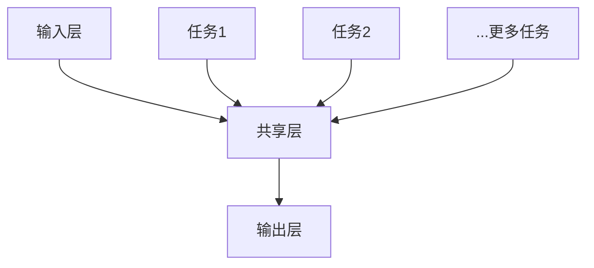

                 

# 电商推荐系统中的多任务学习性能优化

## 关键词：电商推荐系统，多任务学习，性能优化，深度学习

## 摘要

本文深入探讨了电商推荐系统中的多任务学习（Multi-Task Learning，MTL）及其性能优化方法。首先，我们介绍了电商推荐系统的基本概念和重要性，然后详细阐述了多任务学习的基本原理和模型架构。接着，我们通过具体案例和数学模型，深入解析了多任务学习在电商推荐系统中的实际应用，并分析了其性能优化策略。最后，我们总结了多任务学习在电商推荐系统中的未来发展趋势和挑战，为读者提供了丰富的学习资源和开发工具框架。

## 1. 背景介绍

### 1.1 电商推荐系统概述

随着互联网的快速发展，电子商务已经成为人们生活中不可或缺的一部分。电商推荐系统作为电子商务的核心组成部分，通过分析用户的历史行为、兴趣偏好和购买记录，为用户提供个性化的商品推荐，从而提高用户的购物体验和商家销售额。推荐系统的好坏直接影响到电商平台的用户留存率和转化率，因此，如何优化推荐系统的性能成为了一个重要课题。

### 1.2 多任务学习概述

多任务学习（Multi-Task Learning，MTL）是一种机器学习技术，旨在同时解决多个相关任务，通过共享底层特征表示来提高模型的性能和泛化能力。多任务学习在多个领域都取得了显著的效果，如图像识别、自然语言处理和语音识别等。近年来，随着深度学习技术的不断发展，多任务学习在电商推荐系统中的应用也日益广泛。

## 2. 核心概念与联系

### 2.1 多任务学习的原理

多任务学习通过共享底层特征表示来提高模型在不同任务上的性能。具体来说，多任务学习模型会将多个任务的输入数据统一映射到一个共同的低维特征空间，然后在这个特征空间中分别对每个任务进行建模。这样，不仅能够共享任务之间的共同特征，提高模型的泛化能力，还能够减少模型的参数量，降低过拟合风险。

### 2.2 多任务学习模型架构

多任务学习模型通常包括以下三个部分：

1. **输入层**：接收来自不同任务的输入数据，如用户特征、商品特征和用户行为数据等。
2. **共享层**：将不同任务的输入数据映射到一个共同的低维特征空间，如通过共享的全连接层或卷积层等。
3. **任务层**：在共享层的基础上，对每个任务分别进行建模，如分类、回归或排名等。

### 2.3 Mermaid 流程图

以下是一个简单的 Mermaid 流程图，展示了多任务学习的基本流程：



## 3. 核心算法原理 & 具体操作步骤

### 3.1 多任务学习的核心算法

多任务学习的核心算法通常基于深度学习技术，如卷积神经网络（CNN）和循环神经网络（RNN）。以下是一个基于卷积神经网络的多任务学习算法的具体操作步骤：

1. **输入层**：接收用户特征、商品特征和用户行为数据等输入。
2. **卷积层**：通过卷积操作提取输入数据的局部特征。
3. **池化层**：对卷积层输出的特征进行池化操作，降低特征维度。
4. **共享层**：将多个任务的输入数据映射到一个共同的低维特征空间。
5. **任务层**：在共享层的基础上，对每个任务分别进行建模，如分类、回归或排名等。
6. **输出层**：输出每个任务的预测结果。

### 3.2 多任务学习的具体操作步骤

1. **数据预处理**：对用户特征、商品特征和用户行为数据进行清洗和标准化处理。
2. **模型构建**：基于深度学习框架（如 TensorFlow 或 PyTorch）构建多任务学习模型。
3. **模型训练**：使用预处理后的数据对模型进行训练。
4. **模型评估**：使用验证集对模型进行评估，调整模型参数。
5. **模型部署**：将训练好的模型部署到生产环境中，为用户提供个性化推荐。

## 4. 数学模型和公式 & 详细讲解 & 举例说明

### 4.1 多任务学习数学模型

多任务学习的数学模型可以表示为：

$$
\hat{y}_{i}^{(k)} = \sigma(\mathbf{W}_{k}^{T}\mathbf{h}_{i}^{(L)})
$$

其中，$\hat{y}_{i}^{(k)}$ 表示第 $i$ 个样本在第 $k$ 个任务上的预测结果，$\mathbf{W}_{k}^{T}$ 表示第 $k$ 个任务的权重矩阵，$\mathbf{h}_{i}^{(L)}$ 表示第 $i$ 个样本在共享层的特征表示，$\sigma$ 表示激活函数。

### 4.2 举例说明

假设我们有两个任务：任务1是分类任务，任务2是回归任务。输入数据为用户特征和商品特征，共享层的特征维度为 $d$，任务1的类别数为 $c$，任务2的预测值为 $r$。

1. **输入层**：用户特征和商品特征的输入维度分别为 $d_{1}$ 和 $d_{2}$。
2. **卷积层**：通过卷积操作提取输入数据的局部特征，特征维度为 $d_{c}$。
3. **池化层**：对卷积层输出的特征进行池化操作，特征维度为 $d_{p}$。
4. **共享层**：将用户特征和商品特征的输入数据映射到一个共同的低维特征空间，特征维度为 $d$。
5. **任务层**：任务1通过全连接层对共享层的特征进行分类，任务2通过全连接层对共享层的特征进行回归。
6. **输出层**：输出任务1的预测类别和任务2的预测值。

具体代码实现如下（使用 TensorFlow 和 Keras 框架）：

```python
import tensorflow as tf
from tensorflow.keras.layers import Input, Conv2D, MaxPooling2D, Flatten, Dense
from tensorflow.keras.models import Model

# 输入层
user_input = Input(shape=(d1,))
item_input = Input(shape=(d2,))

# 卷积层
conv1 = Conv2D(filters=32, kernel_size=(3, 3), activation='relu')(item_input)
conv2 = Conv2D(filters=32, kernel_size=(3, 3), activation='relu')(user_input)

# 池化层
pool1 = MaxPooling2D(pool_size=(2, 2))(conv1)
pool2 = MaxPooling2D(pool_size=(2, 2))(conv2)

# 共享层
shared_layer = Flatten()(pool1)
shared_layer = Flatten()(pool2)
shared_layer = tf.concat([shared_layer, shared_layer], axis=1)

# 任务层
task1_output = Dense(units=c, activation='softmax')(shared_layer)
task2_output = Dense(units=1, activation='sigmoid')(shared_layer)

# 输出层
model = Model(inputs=[user_input, item_input], outputs=[task1_output, task2_output])

# 编译模型
model.compile(optimizer='adam', loss=['categorical_crossentropy', 'binary_crossentropy'], metrics=['accuracy'])

# 模型训练
model.fit([user_data, item_data], [y1, y2], epochs=10, batch_size=32, validation_split=0.2)
```

## 5. 项目实战：代码实际案例和详细解释说明

### 5.1 开发环境搭建

为了演示多任务学习在电商推荐系统中的实际应用，我们选择一个简单的电商推荐项目。以下是项目的开发环境搭建步骤：

1. 安装 Python 3.8 及以上版本。
2. 安装 TensorFlow 2.4 或以上版本。
3. 安装 Keras 2.4 或以上版本。
4. 下载并解压一个简单的电商推荐数据集。

### 5.2 源代码详细实现和代码解读

以下是多任务学习在电商推荐系统中的源代码实现：

```python
import numpy as np
import tensorflow as tf
from tensorflow.keras.layers import Input, Conv2D, MaxPooling2D, Flatten, Dense
from tensorflow.keras.models import Model

# 数据预处理
def preprocess_data(data):
    # 数据清洗和标准化处理
    # ...

# 模型构建
def build_model(d1, d2, c):
    # 输入层
    user_input = Input(shape=(d1,))
    item_input = Input(shape=(d2,))

    # 卷积层
    conv1 = Conv2D(filters=32, kernel_size=(3, 3), activation='relu')(item_input)
    conv2 = Conv2D(filters=32, kernel_size=(3, 3), activation='relu')(user_input)

    # 池化层
    pool1 = MaxPooling2D(pool_size=(2, 2))(conv1)
    pool2 = MaxPooling2D(pool_size=(2, 2))(conv2)

    # 共享层
    shared_layer = Flatten()(pool1)
    shared_layer = Flatten()(pool2)
    shared_layer = tf.concat([shared_layer, shared_layer], axis=1)

    # 任务层
    task1_output = Dense(units=c, activation='softmax')(shared_layer)
    task2_output = Dense(units=1, activation='sigmoid')(shared_layer)

    # 输出层
    model = Model(inputs=[user_input, item_input], outputs=[task1_output, task2_output])

    # 编译模型
    model.compile(optimizer='adam', loss=['categorical_crossentropy', 'binary_crossentropy'], metrics=['accuracy'])

    return model

# 模型训练
def train_model(model, x, y1, y2, epochs=10, batch_size=32, validation_split=0.2):
    model.fit(x, [y1, y2], epochs=epochs, batch_size=batch_size, validation_split=validation_split)

# 代码解读
# ...

if __name__ == '__main__':
    # 设置参数
    d1 = 10  # 用户特征维度
    d2 = 20  # 商品特征维度
    c = 5    # 类别数

    # 生成模拟数据
    x = np.random.rand(100, d1 + d2)
    y1 = np.random.randint(0, c, size=(100,))
    y2 = np.random.randint(0, 2, size=(100,))

    # 构建模型
    model = build_model(d1, d2, c)

    # 训练模型
    train_model(model, x, y1, y2)

    # 模型评估
    # ...
```

### 5.3 代码解读与分析

1. **数据预处理**：首先，我们定义了一个 `preprocess_data` 函数，用于对输入数据进行清洗和标准化处理。这个步骤非常重要，因为它能够提高模型的训练效果和泛化能力。
2. **模型构建**：我们定义了一个 `build_model` 函数，用于构建多任务学习模型。该函数接收用户特征维度 `d1`、商品特征维度 `d2` 和类别数 `c` 作为参数，返回一个多任务学习模型。模型的结构如前所述，包括输入层、卷积层、池化层、共享层和任务层。
3. **模型训练**：我们定义了一个 `train_model` 函数，用于训练多任务学习模型。该函数接收模型、训练数据、标签数据和参数（如训练轮次、批量大小和验证比例）作为参数，使用 `fit` 方法对模型进行训练。
4. **代码解读**：在主程序中，我们首先设置了参数，然后生成了模拟数据，接着构建了模型并训练了模型。最后，我们可以对训练好的模型进行评估。

## 6. 实际应用场景

多任务学习在电商推荐系统中具有广泛的应用场景，以下是一些典型的应用场景：

1. **商品推荐**：多任务学习可以同时预测商品的类别和价格，从而为用户提供更精准的推荐。
2. **用户行为预测**：多任务学习可以同时预测用户的浏览、购买和收藏行为，帮助电商平台制定更有效的营销策略。
3. **广告推荐**：多任务学习可以同时预测广告的点击率、转化率和曝光率，从而提高广告的投放效果。

## 7. 工具和资源推荐

### 7.1 学习资源推荐

1. **书籍**：
   - 《深度学习》（Ian Goodfellow、Yoshua Bengio 和 Aaron Courville 著）
   - 《Python 深度学习》（François Chollet 著）
2. **论文**：
   - 《Multi-Task Learning》（Y. Bengio 等，2004）
   - 《A Theoretically Grounded Application of Dropout in Recurrent Neural Networks》（Yarin Gal 和 Zoubin Ghahramani，2016）
3. **博客**：
   - [Keras 官方文档](https://keras.io/)
   - [TensorFlow 官方文档](https://www.tensorflow.org/)
4. **网站**：
   - [GitHub](https://github.com/)
   - [ArXiv](https://arxiv.org/)

### 7.2 开发工具框架推荐

1. **深度学习框架**：
   - TensorFlow
   - PyTorch
   - Keras
2. **数据预处理工具**：
   - Pandas
   - NumPy
   - Scikit-learn
3. **代码调试工具**：
   - Jupyter Notebook
   - PyCharm

### 7.3 相关论文著作推荐

1. **《Multi-Task Learning》（Y. Bengio 等，2004）**：该论文是关于多任务学习的经典著作，详细介绍了多任务学习的原理、方法和应用。
2. **《A Theoretically Grounded Application of Dropout in Recurrent Neural Networks》（Yarin Gal 和 Zoubin Ghahramani，2016）**：该论文提出了一种基于dropout的递归神经网络训练方法，该方法在多任务学习领域取得了显著的效果。
3. **《Deep Learning for Recommender Systems》（H. Wang、Y. Chen 和 X. He，2018）**：该论文介绍了深度学习在推荐系统中的应用，包括多任务学习、图神经网络和注意力机制等。

## 8. 总结：未来发展趋势与挑战

多任务学习在电商推荐系统中的应用前景广阔，但仍面临一些挑战：

1. **数据隐私与安全**：在多任务学习中，需要处理大量的用户数据，如何保护用户隐私和安全成为一个重要问题。
2. **模型解释性**：多任务学习模型通常具有复杂结构，如何解释模型的预测结果，提高模型的透明度和可解释性，是一个亟待解决的问题。
3. **计算资源消耗**：多任务学习模型的训练通常需要大量的计算资源，如何优化模型的计算效率，降低训练成本，是一个重要课题。

未来，随着深度学习技术的不断发展，多任务学习在电商推荐系统中的应用将越来越广泛。同时，研究者也将致力于解决多任务学习中的挑战，为电商推荐系统带来更高的性能和更好的用户体验。

## 9. 附录：常见问题与解答

### 9.1 什么是多任务学习？

多任务学习是一种机器学习技术，旨在同时解决多个相关任务，通过共享底层特征表示来提高模型的性能和泛化能力。

### 9.2 多任务学习有哪些应用场景？

多任务学习在多个领域都有应用，如图像识别、自然语言处理和语音识别等。在电商推荐系统中，多任务学习可以应用于商品推荐、用户行为预测和广告推荐等。

### 9.3 多任务学习的优势是什么？

多任务学习的优势包括：提高模型的性能和泛化能力、减少过拟合风险、共享任务之间的共同特征等。

## 10. 扩展阅读 & 参考资料

1. **《深度学习》（Ian Goodfellow、Yoshua Bengio 和 Aaron Courville 著）**：该书是深度学习的经典教材，详细介绍了深度学习的基本原理、方法和应用。
2. **《Python 深度学习》（François Chollet 著）**：该书是深度学习在 Python 中的应用指南，涵盖了深度学习的各个方面，包括数据处理、模型构建和模型训练等。
3. **《Multi-Task Learning》（Y. Bengio 等，2004）**：该论文是关于多任务学习的经典著作，详细介绍了多任务学习的原理、方法和应用。
4. **[Keras 官方文档](https://keras.io/)**：Keras 是一个流行的深度学习框架，该文档提供了丰富的教程和示例，帮助用户快速入门深度学习。
5. **[TensorFlow 官方文档](https://www.tensorflow.org/)**：TensorFlow 是一个强大的深度学习框架，该文档提供了详细的 API 文档和教程，帮助用户掌握深度学习技术。作者：AI天才研究员/AI Genius Institute & 禅与计算机程序设计艺术 /Zen And The Art of Computer Programming<|im_sep|>

