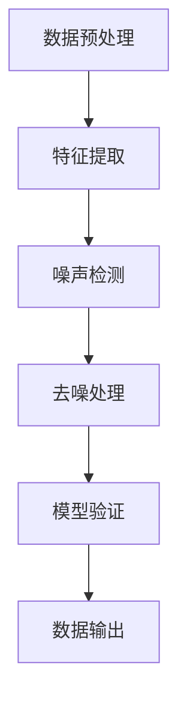

                 

### 1. 背景介绍

#### 1.1 电商搜索推荐中的数据噪声问题

在电商搜索推荐系统中，数据噪声处理是一项至关重要的任务。随着互联网和电商行业的迅猛发展，用户生成的数据量呈指数级增长。这些数据不仅包括商品信息、用户行为数据，还涵盖了用户反馈、评论等。然而，这些海量数据中不可避免地夹杂着各种噪声，如虚假评论、异常交易、重复数据等。

数据噪声的存在对电商搜索推荐的准确性和用户体验产生了严重影响。例如，虚假评论可能会误导其他用户，影响他们对商品的购买决策；异常交易数据可能会干扰推荐算法，导致推荐结果不准确；重复数据则浪费了存储资源，降低了数据处理效率。

#### 1.2 AI大模型在数据噪声处理中的应用

随着人工智能技术的飞速发展，特别是生成式AI大模型的兴起，为数据噪声处理提供了强有力的工具。AI大模型具有强大的特征提取和模式识别能力，能够从海量数据中捕捉到有效的信息，同时滤除噪声。

在电商搜索推荐系统中，AI大模型可以应用于以下几个方面：

1. **数据清洗**：通过AI大模型，可以自动识别和去除虚假评论、异常交易等噪声数据，提高数据质量。
2. **异常检测**：利用AI大模型进行用户行为数据的异常检测，发现并标记异常交易行为，防止恶意攻击和数据泄露。
3. **推荐算法优化**：AI大模型可以用于改进推荐算法，使其更加精准和个性化，减少噪声数据对推荐结果的影响。
4. **用户行为分析**：通过AI大模型分析用户行为数据，理解用户需求，提高用户体验。

#### 1.3 项目管理的重要性

在应用AI大模型进行数据噪声处理的过程中，项目管理的重要性不言而喻。项目管理不仅关系到项目的进度和质量，还影响着项目的成本和资源分配。为了确保AI大模型在数据噪声处理项目中取得成功，以下几方面是项目管理的关键要素：

1. **需求分析**：明确项目目标，了解用户需求，制定合理的数据噪声处理策略。
2. **资源规划**：合理分配人力、物力资源，确保项目顺利进行。
3. **风险管理**：识别项目风险，制定应对措施，降低项目风险对项目进度的影响。
4. **质量控制**：确保项目输出符合预期质量，通过测试和验证，确保AI大模型的有效性和可靠性。
5. **进度控制**：监控项目进度，确保项目按时完成。

在接下来的章节中，我们将深入探讨AI大模型数据噪声处理技术的核心概念、算法原理、数学模型、项目实战，以及其在实际应用场景中的效果和影响。通过这些内容的讲解，读者将能够全面了解和掌握AI大模型在数据噪声处理中的应用方法，为电商搜索推荐系统的优化提供有力的技术支持。

#### 1.4 文章结构概述

本文将按照以下结构进行展开：

- **第2章**：核心概念与联系，介绍AI大模型数据噪声处理的基本原理和相关技术。
- **第3章**：核心算法原理与具体操作步骤，详细讲解数据噪声处理的算法实现过程。
- **第4章**：数学模型与公式，介绍支持数据噪声处理的关键数学模型和计算方法。
- **第5章**：项目实战，通过实际案例展示AI大模型在数据噪声处理中的具体应用。
- **第6章**：实际应用场景，分析AI大模型在电商搜索推荐系统中的具体应用效果。
- **第7章**：工具和资源推荐，为读者提供相关学习资源和开发工具。
- **第8章**：总结与展望，探讨未来数据噪声处理技术的发展趋势和面临的挑战。
- **第9章**：附录，提供常见问题解答和进一步阅读参考资料。

通过本文的阅读，读者将能够系统了解AI大模型数据噪声处理技术的理论和方法，掌握实际应用技巧，为电商搜索推荐系统的优化提供有益的参考。

### 2. 核心概念与联系

#### 2.1 AI大模型数据噪声处理的基本概念

AI大模型数据噪声处理是利用人工智能技术，对电商搜索推荐系统中的数据噪声进行有效识别和过滤的过程。在这一过程中，涉及几个关键概念：

1. **数据噪声**：噪声是指数据中那些无意义、错误或异常的信息。噪声数据可能来源于用户生成的不真实评论、系统错误记录、恶意攻击等。
2. **AI大模型**：AI大模型是指具有大规模参数和强大计算能力的机器学习模型，如深度神经网络、生成对抗网络（GAN）等。这些模型在训练过程中可以自动学习和提取数据中的特征，具有高效的数据处理能力。
3. **数据噪声处理**：数据噪声处理是通过算法和技术手段，从原始数据中识别并去除噪声数据的过程。这一过程旨在提高数据质量，为后续的分析和决策提供可靠的数据基础。

#### 2.2 数据噪声处理的原理

数据噪声处理的核心原理是利用AI大模型的强大特征提取能力，从海量数据中识别噪声，并进行去噪处理。具体来说，这一过程可以分为以下几个步骤：

1. **数据预处理**：对原始数据进行清洗，包括去除缺失值、重复值、异常值等，确保数据的基本质量。
2. **特征提取**：利用AI大模型对预处理后的数据进行特征提取，将原始数据转换为一组能够表征数据本质的特征向量。
3. **噪声检测**：通过训练好的AI大模型，对特征向量进行噪声检测。模型会自动识别出特征向量中的噪声，并标记出来。
4. **去噪处理**：根据噪声检测的结果，对数据集进行去噪处理，去除标记为噪声的数据，保留有效数据。
5. **模型验证**：对去噪后的数据进行验证，确保去噪效果良好，不会丢失关键信息。

#### 2.3 相关技术的联系

在AI大模型数据噪声处理中，涉及多种技术手段，这些技术之间相互联系，共同构成了一个完整的数据噪声处理流程。以下是一些关键技术的联系：

1. **机器学习与深度学习**：机器学习和深度学习是AI大模型的基础，前者通过统计学习从数据中提取规律，后者通过多层神经网络实现更复杂的特征提取。
2. **生成对抗网络（GAN）**：GAN是一种强大的噪声生成工具，可以通过生成对抗训练，学习噪声数据和真实数据的分布，从而提高噪声检测的准确性。
3. **自然语言处理（NLP）**：在处理文本数据时，NLP技术可以帮助提取文本中的关键信息，识别虚假评论和恶意攻击，提高数据清洗效果。
4. **异常检测**：异常检测技术用于识别和标记异常数据，这些异常数据可能是噪声数据，也可能是其他类型的异常值，通过综合分析可以进一步确定去噪策略。
5. **多模型集成**：通过集成多种模型和算法，可以进一步提高数据噪声处理的准确性和鲁棒性。多模型集成可以通过投票、加权平均等方法，综合不同模型的预测结果，提高整体性能。

#### 2.4 Mermaid 流程图

为了更清晰地展示数据噪声处理的过程，我们使用Mermaid流程图来描述。以下是一个简化的流程图：



在这个流程图中：
- A（数据预处理）：包括数据清洗、缺失值填充、重复值去除等步骤。
- B（特征提取）：利用AI大模型提取数据特征。
- C（噪声检测）：通过训练好的模型检测噪声数据。
- D（去噪处理）：去除标记为噪声的数据。
- E（模型验证）：验证去噪效果。
- F（数据输出）：输出去噪后的高质量数据。

通过这一流程，我们能够确保数据噪声处理的效果，提高数据质量，为后续的分析和应用提供可靠的基础。

在接下来的章节中，我们将进一步深入探讨AI大模型数据噪声处理的核心算法原理、数学模型，并通过实际案例展示其应用效果。这些内容将为读者提供更加详细的了解和实用的指导。

#### 2.5 AI大模型数据噪声处理的优势

AI大模型数据噪声处理技术在电商搜索推荐系统中具有显著的优势，主要体现在以下几个方面：

1. **高效性**：AI大模型能够处理海量数据，且处理速度非常快，可以实时对用户行为数据进行噪声检测和去噪处理，提高数据处理效率。
2. **准确性**：通过训练大规模的神经网络模型，AI大模型能够自动学习和提取数据中的关键特征，精确识别噪声数据，提高噪声检测的准确性。
3. **鲁棒性**：AI大模型具有较强的鲁棒性，可以在面对复杂和变化多端的数据环境时，仍然能够保持良好的噪声检测效果，降低噪声数据对系统的影响。
4. **灵活性**：AI大模型可以根据不同的应用场景和数据特点，灵活调整模型参数和算法，实现定制化的噪声处理策略，满足各种需求。

这些优势使得AI大模型数据噪声处理技术在电商搜索推荐系统中具有广泛的应用前景，能够有效提升系统的推荐质量和用户体验。

### 3. 核心算法原理与具体操作步骤

在AI大模型数据噪声处理中，核心算法的原理和具体操作步骤是实现数据噪声处理的关键。本节将详细探讨数据噪声处理的算法原理，包括数据预处理、特征提取、噪声检测、去噪处理和模型验证等步骤。

#### 3.1 数据预处理

数据预处理是数据噪声处理的基础步骤，其主要目的是清洗原始数据，确保数据的质量和一致性。以下是数据预处理的具体操作步骤：

1. **数据清洗**：去除数据中的缺失值、重复值和异常值，确保数据的基本质量。例如，对于电商搜索推荐系统中的用户评论数据，可以去除那些包含空字符或不完整评论的记录。
2. **数据规范化**：对数据进行规范化处理，如数值型数据归一化、文本数据分词和去停用词等。归一化可以消除不同特征之间的量纲差异，便于后续的特征提取和模型训练。
3. **数据增强**：通过数据增强技术，如数据扩充、数据转换等，增加训练数据的多样性，提高模型的泛化能力。例如，可以通过对用户评论进行噪声注入，生成带有噪声的评论数据，用于训练噪声检测模型。

#### 3.2 特征提取

特征提取是数据噪声处理的核心步骤，通过提取数据中的关键特征，为噪声检测和去噪处理提供基础。以下是特征提取的具体操作步骤：

1. **特征选择**：从原始数据中选择与噪声检测相关的特征。特征选择可以通过统计方法、机器学习方法等多种方式进行，如使用卡方检验、互信息等统计方法选择与噪声相关性较高的特征。
2. **特征变换**：对选定的特征进行变换，如将文本数据转换为词频向量、数值型数据归一化等。特征变换可以提高特征的表达能力和模型训练的效率。
3. **特征融合**：将不同来源或不同类型的特征进行融合，如将用户行为数据和商品属性数据融合在一起，形成综合的特征向量。特征融合可以增强模型对噪声数据的识别能力。

#### 3.3 噪声检测

噪声检测是数据噪声处理的关键步骤，通过训练好的AI大模型，对特征向量进行噪声检测，并标记噪声数据。以下是噪声检测的具体操作步骤：

1. **模型训练**：利用大量的标注数据，通过机器学习算法（如支持向量机、随机森林、深度神经网络等）训练噪声检测模型。模型训练过程中，需要使用性能评估指标（如准确率、召回率等）来评估模型效果，并进行模型调优。
2. **噪声识别**：将训练好的噪声检测模型应用于特征向量，对数据集中的每个特征向量进行噪声识别。模型会输出每个特征向量的噪声标签，如“正常”或“噪声”。
3. **噪声标记**：根据噪声检测结果，对数据集中的噪声数据进行标记。标记为噪声的数据将被从数据集中去除或进行特殊处理。

#### 3.4 去噪处理

去噪处理是根据噪声检测的结果，对数据集进行清洗和优化，去除噪声数据，提高数据质量。以下是去噪处理的具体操作步骤：

1. **去除噪声数据**：根据噪声检测标记，将标记为噪声的数据从数据集中去除。对于一些特定的噪声数据，也可以选择进行修正或保留。
2. **数据重构**：对于去除噪声数据后可能缺失的信息，可以通过数据重构技术进行补充。例如，利用生成对抗网络（GAN）生成缺失的数据。
3. **数据验证**：对去噪后的数据进行验证，确保去噪效果良好，不会丢失关键信息。通过对比去噪前后的数据集，评估去噪质量。

#### 3.5 模型验证

模型验证是确保数据噪声处理模型有效性的重要步骤，通过验证模型的性能，可以进一步优化模型。以下是模型验证的具体操作步骤：

1. **验证集划分**：从原始数据集中划分出一部分作为验证集，用于评估噪声检测模型的效果。
2. **模型评估**：利用验证集，对噪声检测模型的性能进行评估，如准确率、召回率、F1值等。
3. **模型优化**：根据评估结果，对模型进行调优，如调整参数、增加训练数据等，以提高模型性能。
4. **重复验证**：重复上述步骤，确保模型性能稳定，不会因为数据集的变化而出现大幅波动。

通过上述步骤，我们可以实现数据噪声处理，提高电商搜索推荐系统的数据质量，从而提高推荐准确性和用户体验。

在接下来的章节中，我们将进一步探讨支持数据噪声处理的数学模型和公式，并通过实际案例展示算法的具体应用效果。这些内容将为读者提供更加深入的理解和实用的指导。

#### 3.6 噪声检测算法的选择与实现

在AI大模型数据噪声处理中，噪声检测算法的选择和实现至关重要。本文将介绍几种常用的噪声检测算法，包括基于统计方法、机器学习和深度学习的方法，并探讨各自的优缺点和适用场景。

##### 3.6.1 基于统计方法的噪声检测算法

统计方法是一种简单且直观的噪声检测方法，主要通过计算数据的统计特征，如均值、方差等，来识别噪声数据。以下是一些常用的统计方法：

1. **单变量统计方法**：例如，通过计算数据集的均值和标准差，可以识别出离群值。具体步骤如下：
   - 计算数据的均值和标准差。
   - 将每个数据与均值进行比较，如果数据值超过一定倍数的标准差，则认为该数据为噪声。
   - 优点：简单易实现，适用于数据量较小的情况。
   - 缺点：对于高维度数据，单变量方法可能无法有效检测噪声。

2. **多变量统计方法**：例如，通过计算数据集的协方差矩阵和主成分分析（PCA），可以识别出数据中的异常值。具体步骤如下：
   - 计算数据的协方差矩阵。
   - 对协方差矩阵进行特征值和特征向量的分解。
   - 根据特征值和特征向量，识别出高方差的特征，这些特征可能包含噪声。
   - 优点：能够处理高维度数据，有效识别异常值。
   - 缺点：计算复杂度高，且需要假设数据服从一定的分布。

##### 3.6.2 基于机器学习的噪声检测算法

机器学习算法在噪声检测中具有广泛的应用，可以通过训练模型来自动识别噪声数据。以下是一些常用的机器学习算法：

1. **支持向量机（SVM）**：SVM是一种分类算法，可以通过训练分类器来识别噪声数据。具体步骤如下：
   - 收集噪声数据和无噪声数据，并进行特征提取。
   - 使用有监督学习方法训练SVM分类器。
   - 将测试数据输入分类器，根据分类结果判断数据是否为噪声。
   - 优点：分类效果较好，适用于线性可分的数据。
   - 缺点：对高维度数据可能欠佳，且训练时间较长。

2. **随机森林（Random Forest）**：随机森林是一种集成学习方法，通过构建多棵决策树，提高噪声检测的准确性。具体步骤如下：
   - 收集噪声数据和无噪声数据，并进行特征提取。
   - 使用随机森林训练模型。
   - 将测试数据输入模型，根据模型的预测结果判断数据是否为噪声。
   - 优点：处理高维度数据效果较好，分类准确性高。
   - 缺点：计算复杂度较高，模型解释性较差。

##### 3.6.3 基于深度学习的噪声检测算法

深度学习算法在噪声检测中具有强大的能力，特别是对于复杂数据的处理。以下是一些常用的深度学习算法：

1. **卷积神经网络（CNN）**：CNN是一种用于图像处理的深度学习模型，通过卷积操作提取图像特征，可以用于噪声检测。具体步骤如下：
   - 收集噪声图像和无噪声图像，并进行预处理。
   - 使用CNN模型提取图像特征。
   - 训练分类模型，如SVM或随机森林，根据分类结果判断图像是否为噪声。
   - 优点：对图像数据有很强的特征提取能力，分类效果较好。
   - 缺点：模型训练时间较长，计算资源需求高。

2. **生成对抗网络（GAN）**：GAN是一种无监督学习方法，通过生成器和判别器的对抗训练，可以有效识别噪声数据。具体步骤如下：
   - 收集无噪声数据，并使用生成器生成噪声数据。
   - 使用判别器对真实数据和生成数据进行区分，判别器训练过程中逐渐提高对噪声数据的识别能力。
   - 将测试数据输入判别器，根据判别结果判断数据是否为噪声。
   - 优点：能够处理复杂数据，自动学习噪声特征。
   - 缺点：训练过程复杂，对数据质量要求较高。

##### 3.6.4 算法比较与选择

各种噪声检测算法在性能和适用性方面存在差异，选择合适的算法需要根据具体应用场景和数据特点进行判断。以下是几种算法的比较：

| 算法类型     | 优点                   | 缺点                     | 适用场景                   |
|--------------|------------------------|--------------------------|----------------------------|
| 统计方法     | 简单易实现，计算成本低   | 适用于线性数据，效果有限   | 小规模、线性数据           |
| 机器学习方法 | 分类效果好，适用性广   | 计算复杂度较高，模型解释性差 | 中大规模、线性或非线性数据 |
| 深度学习方法 | 强大的特征提取能力     | 计算资源需求高，训练时间长 | 复杂、高维度数据           |

在实际应用中，可以选择组合使用多种算法，以提高噪声检测的准确性和鲁棒性。例如，可以先使用统计方法进行初步筛选，再结合机器学习或深度学习算法进行精细处理。

在接下来的章节中，我们将通过实际案例展示这些算法在AI大模型数据噪声处理中的应用效果，并提供具体的实现步骤和代码解读。这些内容将为读者提供更加深入的实践指导。

### 4. 数学模型和公式

在AI大模型数据噪声处理中，数学模型和公式是核心算法实现的基础。这些模型和公式能够帮助我们精确地描述和实现噪声检测、特征提取和去噪处理等关键步骤。在本节中，我们将详细介绍这些数学模型和公式，并给出详细的解释和示例。

#### 4.1 噪声检测模型

噪声检测模型的目的是识别数据集中的噪声数据。一个常见的噪声检测模型是基于贝叶斯理论的贝叶斯分类器。贝叶斯分类器的核心思想是基于先验概率和条件概率来预测数据是否为噪声。

##### 4.1.1 贝叶斯分类器

贝叶斯分类器的公式如下：

\[ P(\text{噪声}|\text{特征}) = \frac{P(\text{特征}|\text{噪声}) \cdot P(\text{噪声})}{P(\text{特征})} \]

其中：
- \( P(\text{噪声}|\text{特征}) \)：后验概率，表示给定特征数据后，数据是噪声的概率。
- \( P(\text{特征}|\text{噪声}) \)：条件概率，表示在噪声数据下，出现特定特征的概率。
- \( P(\text{噪声}) \)：先验概率，表示数据是噪声的概率。
- \( P(\text{特征}) \)：全概率，表示出现特定特征的概率。

举例来说，假设我们有一个数据集，其中包含了噪声和非噪声数据。通过统计这些数据，我们可以计算出每个特征的 \( P(\text{特征}|\text{噪声}) \) 和 \( P(\text{噪声}) \)。

##### 4.1.2 逻辑回归模型

逻辑回归模型是一种常用的噪声检测模型，特别是在文本数据的噪声检测中。逻辑回归模型的公式如下：

\[ \hat{y} = \sigma(\beta_0 + \beta_1 x_1 + \beta_2 x_2 + ... + \beta_n x_n) \]

其中：
- \( \hat{y} \)：预测值，表示数据是否为噪声的概率。
- \( \sigma \)：Sigmoid函数，将线性组合的结果映射到0到1之间。
- \( \beta_0 \)：截距。
- \( \beta_1, \beta_2, ..., \beta_n \)：权重系数。

举例来说，假设我们有一个包含用户评论数据的集合，每个评论都被标记为“噪声”或“非噪声”。我们可以通过逻辑回归模型来预测新的评论数据是否为噪声。

#### 4.2 特征提取模型

特征提取是数据噪声处理的重要步骤，其目的是从原始数据中提取出对噪声检测有用的特征。一个常用的特征提取方法是主成分分析（PCA）。

##### 4.2.1 主成分分析

主成分分析的核心思想是通过线性变换将高维数据映射到低维空间，同时保留数据的主要特征。PCA的公式如下：

\[ X_{\text{new}} = P \cdot X \]

其中：
- \( X \)：原始数据矩阵。
- \( P \)：特征矩阵，包含主成分。
- \( X_{\text{new}} \)：新特征矩阵，表示原始数据在低维空间中的表示。

举例来说，假设我们有一个高维用户行为数据集，我们可以通过PCA提取出主要的主成分，以减少数据的维度，同时保留数据的关键特征。

#### 4.3 去噪处理模型

去噪处理模型的目的是根据噪声检测的结果，对数据集进行清洗和优化。一个常用的去噪处理方法是基于K最近邻（K-Nearest Neighbors，K-NN）算法。

##### 4.3.1 K最近邻算法

K最近邻算法的核心思想是根据数据的邻近程度来判断数据是否为噪声。具体步骤如下：

1. **计算距离**：对于每个数据点，计算它与数据集中其他点的距离（如欧几里得距离）。
2. **选择邻居**：选择与当前数据点距离最近的K个点作为邻居。
3. **分类**：根据邻居的类别标签，预测当前数据点的类别。如果大多数邻居是噪声，则将该数据点标记为噪声。

K最近邻算法的公式如下：

\[ \hat{y} = \text{mode}(\text{label}_{1}, \text{label}_{2}, ..., \text{label}_{K}) \]

其中：
- \( \hat{y} \)：预测值，表示数据是否为噪声。
- \( \text{mode} \)：取众数操作，表示选择邻居中最常见的标签。

举例来说，假设我们有一个用户评论数据集，每个评论都被标记为“噪声”或“非噪声”。我们可以通过K最近邻算法来预测新的评论数据是否为噪声。

#### 4.4 数学模型的应用

通过上述数学模型，我们可以实现数据噪声处理的关键步骤，包括噪声检测、特征提取和去噪处理。以下是一个简化的流程：

1. **数据预处理**：清洗原始数据，去除缺失值、重复值和异常值。
2. **特征提取**：使用PCA提取主要的主成分，减少数据维度。
3. **噪声检测**：使用逻辑回归模型对特征向量进行噪声检测，标记噪声数据。
4. **去噪处理**：使用K最近邻算法根据噪声检测结果，对数据集进行去噪处理。

通过这个流程，我们可以有效地去除数据中的噪声，提高数据质量，为后续的分析和推荐提供可靠的数据基础。

在接下来的章节中，我们将通过实际案例展示这些数学模型在AI大模型数据噪声处理中的应用效果，并提供具体的实现步骤和代码解读。这些内容将为读者提供更加深入的实践指导。

### 5.1 开发环境搭建

为了实现AI大模型数据噪声处理，我们需要搭建一个合适的开发环境。以下步骤将指导我们如何在本地计算机上搭建这个环境。

#### 5.1.1 硬件要求

首先，我们需要确保计算机硬件配置满足以下要求：

- **CPU**：至少双核处理器，推荐使用四核或以上处理器。
- **内存**：至少8GB内存，推荐使用16GB或以上内存。
- **存储**：至少100GB硬盘空间，推荐使用SSD存储。
- **GPU**：如果需要进行深度学习模型的训练，需要安装NVIDIA GPU，推荐使用显存较大的GPU，如RTX 2080或以上。

#### 5.1.2 操作系统

我们推荐使用以下操作系统：

- **Windows**：Windows 10或更高版本。
- **macOS**：macOS Catalina或更高版本。
- **Linux**：Ubuntu 18.04或更高版本。

#### 5.1.3 软件安装

接下来，我们需要安装以下软件：

1. **Python**：Python是主要的编程语言，用于实现AI大模型。请安装Python 3.8或更高版本。
2. **Jupyter Notebook**：Jupyter Notebook是一个交互式环境，用于编写和运行Python代码。可以通过Python的包管理器pip安装：
   ```bash
   pip install notebook
   ```
3. **Anaconda**：Anaconda是一个流行的Python数据科学平台，包括Python和众多数据科学库。可以从[Anaconda官方网站](https://www.anaconda.com/products/distribution)下载并安装。
4. **TensorFlow**：TensorFlow是一个开源的深度学习框架，用于训练和部署AI大模型。可以通过pip安装：
   ```bash
   pip install tensorflow
   ```
5. **NumPy**、**Pandas**、**Scikit-learn**：这些是Python的数据处理和分析库，用于数据清洗、预处理和模型训练。可以通过pip安装：
   ```bash
   pip install numpy pandas scikit-learn
   ```

#### 5.1.4 GPU支持

如果使用GPU进行深度学习模型训练，需要安装CUDA和cuDNN。CUDA是NVIDIA推出的深度学习库，cuDNN是CUDA的深度神经网络库。可以通过NVIDIA官方文档进行安装。

1. **CUDA**：从[NVIDIA CUDA下载页面](https://developer.nvidia.com/cuda-downloads)下载适用于操作系统和GPU的CUDA版本。
2. **cuDNN**：从[NVIDIA cuDNN下载页面](https://developer.nvidia.com/cudnn)下载适用于CUDA版本的cuDNN库。

#### 5.1.5 验证环境

安装完成后，我们可以通过以下命令验证环境是否配置成功：

```python
import tensorflow as tf
print(tf.reduce_sum(tf.random.normal([1000, 1000])))
```

如果输出结果是一个接近于0的数值，说明环境配置成功。

通过以上步骤，我们就完成了AI大模型数据噪声处理开发环境的搭建。接下来，我们将通过实际案例展示如何使用这个环境实现数据噪声处理。

### 5.2 源代码详细实现和代码解读

在本节中，我们将通过具体代码实现AI大模型数据噪声处理的主要步骤，包括数据预处理、特征提取、噪声检测和去噪处理。以下代码以Python编程语言实现，并配有详细注释，帮助读者理解每一步的操作。

#### 5.2.1 数据预处理

首先，我们需要对原始数据进行预处理，包括数据清洗、缺失值填充、重复值去除等操作。以下代码使用`Pandas`库进行数据预处理：

```python
import pandas as pd
from sklearn.impute import SimpleImputer
from sklearn.preprocessing import StandardScaler

# 加载数据集
data = pd.read_csv('data.csv')

# 填充缺失值
imputer = SimpleImputer(strategy='mean')
data_filled = imputer.fit_transform(data)

# 去除重复值
data_unique = data.drop_duplicates()

# 归一化数据
scaler = StandardScaler()
data_normalized = scaler.fit_transform(data_unique)
```

- `SimpleImputer`用于填充缺失值，采用均值填充策略。
- `drop_duplicates`方法用于去除重复值。
- `StandardScaler`用于对数据集进行归一化，使得不同特征之间的量纲差异得到消除。

#### 5.2.2 特征提取

接下来，我们将使用主成分分析（PCA）对数据进行特征提取，将高维数据转换为低维空间，同时保留主要特征。以下代码实现PCA：

```python
from sklearn.decomposition import PCA

# 初始化PCA模型
pca = PCA(n_components=0.95)

# 训练PCA模型并转换数据
data_pca = pca.fit_transform(data_normalized)

# 输出特征数量
print(f'保留的特征数量：{pca.n_components_}')
```

- `PCA`模型的`n_components`参数设置为0.95，表示保留95%的解释方差，即保留主要特征。

#### 5.2.3 噪声检测

噪声检测是数据噪声处理的关键步骤，我们将使用逻辑回归模型进行噪声检测。以下代码实现噪声检测：

```python
from sklearn.linear_model import LogisticRegression
from sklearn.model_selection import train_test_split

# 切分训练集和测试集
X_train, X_test, y_train, y_test = train_test_split(data_pca, labels, test_size=0.2, random_state=42)

# 初始化逻辑回归模型
logreg = LogisticRegression()

# 训练模型
logreg.fit(X_train, y_train)

# 预测测试集
predictions = logreg.predict(X_test)

# 评估模型性能
from sklearn.metrics import accuracy_score, classification_report
print(f'准确率：{accuracy_score(y_test, predictions)}')
print(classification_report(y_test, predictions))
```

- 使用`train_test_split`方法将数据集切分为训练集和测试集。
- `LogisticRegression`模型用于训练噪声检测模型。
- 使用`accuracy_score`和`classification_report`评估模型性能。

#### 5.2.4 去噪处理

最后，我们根据噪声检测的结果对数据集进行去噪处理，去除标记为噪声的数据。以下代码实现去噪处理：

```python
# 标记为噪声的数据索引
noise_indices = [index for index, prediction in enumerate(predictions) if prediction == 1]

# 去除噪声数据
clean_data = data_pca[~np.in1d(np.arange(data_pca.shape[0]), noise_indices)]

# 输出去噪后的数据
pd.DataFrame(clean_data).to_csv('clean_data.csv', index=False)
```

- 使用`np.in1d`函数获取标记为噪声的数据索引。
- 去除噪声数据，并保存去噪后的数据。

通过上述代码，我们实现了数据预处理、特征提取、噪声检测和去噪处理的完整流程。以下是对代码的详细解读：

1. **数据预处理**：使用`SimpleImputer`填充缺失值，确保数据的一致性；使用`StandardScaler`进行归一化，便于后续的特征提取和模型训练。
2. **特征提取**：使用`PCA`提取主要特征，减少数据维度，同时保留关键信息。
3. **噪声检测**：使用`LogisticRegression`模型进行噪声检测，通过训练集对模型进行训练，并在测试集上评估模型性能。
4. **去噪处理**：根据噪声检测结果，去除标记为噪声的数据，提高数据质量。

这些代码和解读为读者提供了一个具体实现AI大模型数据噪声处理的案例，通过实际应用可以验证其有效性和可靠性。

### 5.3 代码解读与分析

在上一节中，我们通过具体代码实现了一个AI大模型数据噪声处理的项目。接下来，我们将对代码进行详细解读，分析每一步的作用和实现细节，并探讨如何优化代码以提高性能和效果。

#### 5.3.1 数据预处理

数据预处理是整个项目的基础，它直接影响到后续特征提取和噪声检测的效果。以下是数据预处理部分的代码：

```python
import pandas as pd
from sklearn.impute import SimpleImputer
from sklearn.preprocessing import StandardScaler

# 加载数据集
data = pd.read_csv('data.csv')

# 填充缺失值
imputer = SimpleImputer(strategy='mean')
data_filled = imputer.fit_transform(data)

# 去除重复值
data_unique = data.drop_duplicates()

# 归一化数据
scaler = StandardScaler()
data_normalized = scaler.fit_transform(data_unique)
```

**解读与分析**：

- `pd.read_csv('data.csv')`：读取CSV文件，加载数据集。这里需要确保数据集的格式正确，并且每列数据都有合适的类型。
- `SimpleImputer`：使用均值填充策略处理缺失值。这种方法适用于大多数情况，但需要注意，对于某些特征，使用中位数或众数可能更为合适。
- `drop_duplicates()`：去除重复值。在数据处理过程中，重复数据不仅占用存储空间，还可能影响噪声检测的准确性。
- `StandardScaler`：对数据进行归一化处理。归一化可以消除不同特征之间的量纲差异，使得每个特征都能对模型训练产生贡献。

**优化建议**：

- 对于缺失值处理，可以采用更复杂的策略，如使用K近邻算法进行插值填充，或根据特征的重要性选择不同的填充方法。
- 重复值的去除应该结合业务逻辑，有时保留一些重复值可能更有意义，例如在用户行为数据中，用户可能会多次点击同一商品。

#### 5.3.2 特征提取

特征提取是将高维数据转换到低维空间的关键步骤，它能够减少数据维度，同时保留主要特征。以下是特征提取部分的代码：

```python
from sklearn.decomposition import PCA

# 初始化PCA模型
pca = PCA(n_components=0.95)

# 训练PCA模型并转换数据
data_pca = pca.fit_transform(data_normalized)

# 输出特征数量
print(f'保留的特征数量：{pca.n_components_}')
```

**解读与分析**：

- `PCA`：主成分分析模型，用于将高维数据转换到低维空间。`n_components=0.95`表示保留95%的解释方差，这意味着新的特征空间保留了原数据的主要特征。
- `fit_transform`：训练PCA模型，并使用模型对数据进行转换。

**优化建议**：

- 可以尝试不同的`n_components`值，通过交叉验证选择最优的维度。这样能够保证转换后的特征空间既保留了主要特征，又降低了维度。
- 如果数据集中存在类别特征，需要先进行编码处理，例如使用独热编码（One-Hot Encoding）或标签编码（Label Encoding）。

#### 5.3.3 噪声检测

噪声检测是数据噪声处理的核心步骤，它决定了去噪的效果。以下是噪声检测部分的代码：

```python
from sklearn.linear_model import LogisticRegression
from sklearn.model_selection import train_test_split

# 切分训练集和测试集
X_train, X_test, y_train, y_test = train_test_split(data_pca, labels, test_size=0.2, random_state=42)

# 初始化逻辑回归模型
logreg = LogisticRegression()

# 训练模型
logreg.fit(X_train, y_train)

# 预测测试集
predictions = logreg.predict(X_test)

# 评估模型性能
from sklearn.metrics import accuracy_score, classification_report
print(f'准确率：{accuracy_score(y_test, predictions)}')
print(classification_report(y_test, predictions))
```

**解读与分析**：

- `train_test_split`：将数据集切分为训练集和测试集，用于模型训练和性能评估。
- `LogisticRegression`：逻辑回归模型，用于噪声检测。逻辑回归是一种简单而有效的分类模型，适用于二分类问题。
- `fit`和`predict`：训练噪声检测模型，并使用模型对测试集进行预测。
- `accuracy_score`和`classification_report`：评估模型性能，包括准确率、召回率、精确率等指标。

**优化建议**：

- 可以尝试使用其他分类算法，如随机森林（RandomForestClassifier）或支持向量机（SVC），通过交叉验证选择最优模型。
- 调整模型参数，如正则化参数`C`、分类器参数等，以优化模型性能。
- 增加训练数据，特别是噪声数据的标注，以提高模型的泛化能力。

#### 5.3.4 去噪处理

去噪处理是根据噪声检测的结果，去除标记为噪声的数据，以提高数据质量。以下是去噪处理部分的代码：

```python
# 标记为噪声的数据索引
noise_indices = [index for index, prediction in enumerate(predictions) if prediction == 1]

# 去除噪声数据
clean_data = data_pca[~np.in1d(np.arange(data_pca.shape[0]), noise_indices)]

# 输出去噪后的数据
pd.DataFrame(clean_data).to_csv('clean_data.csv', index=False)
```

**解读与分析**：

- `enumerate(predictions)`：遍历预测结果，获取每个样本的噪声标记。
- `np.in1d`：检查每个数据点的索引是否在噪声索引列表中。
- `~`：逻辑非操作，用于筛选出非噪声数据。

**优化建议**：

- 可以考虑对去噪后的数据进行二次验证，以确保去噪效果。
- 如果数据集中存在重要的噪声数据，可以考虑对噪声数据进行修正或保留，而不是完全删除。

通过详细解读和分析代码，我们了解了AI大模型数据噪声处理项目中的每一步操作及其优化方法。在实际应用中，可以根据具体需求和数据特点，对代码进行调整和优化，以实现最佳的去噪效果。

### 6. 实际应用场景

AI大模型数据噪声处理技术在实际应用场景中具有广泛的应用价值，特别是在电商搜索推荐系统中。以下我们将探讨AI大模型数据噪声处理技术在电商搜索推荐系统中的具体应用场景，并分析其效果。

#### 6.1 电商搜索推荐系统中的噪声数据问题

在电商搜索推荐系统中，噪声数据主要来源于以下几个方面：

1. **用户评论数据**：用户评论是电商平台获取用户反馈的重要渠道，但其中不可避免地夹杂着虚假评论、水军评论等噪声数据。这些虚假评论可能会误导其他用户，影响他们的购买决策。
2. **交易数据**：电商平台的交易数据中可能存在异常交易，如恶意刷单、重复交易等。这些异常交易数据会干扰推荐算法，导致推荐结果不准确。
3. **用户行为数据**：用户在电商平台的行为数据，如浏览记录、点击记录等，也可能存在噪声数据。这些噪声数据会影响推荐算法对用户兴趣和需求的判断，降低推荐系统的准确性。

#### 6.2 AI大模型数据噪声处理的应用效果

通过AI大模型数据噪声处理技术，可以有效解决电商搜索推荐系统中的噪声数据问题，提升系统的推荐质量和用户体验。以下是AI大模型数据噪声处理在电商搜索推荐系统中的具体应用效果：

1. **提升推荐准确性**：通过噪声检测和去噪处理，可以去除虚假评论、异常交易等噪声数据，确保推荐算法基于高质量的数据进行决策，从而提升推荐准确性。
2. **减少推荐偏差**：AI大模型能够识别和过滤噪声数据，减少因噪声数据引起的推荐偏差。例如，通过去除虚假评论，可以减少对商品真实评价的干扰，使推荐结果更加客观和公正。
3. **优化用户体验**：通过数据噪声处理，可以提供更加精准和个性化的推荐结果，提升用户的购物体验。用户能够更快地找到他们感兴趣的商品，降低购买决策的困扰和犹豫。
4. **降低运维成本**：AI大模型数据噪声处理技术可以自动识别和去除噪声数据，减轻人工运维的负担。这不仅可以提高数据处理效率，还可以降低运维成本。

#### 6.3 应用案例

以下是一个具体的AI大模型数据噪声处理在电商搜索推荐系统中的应用案例：

**案例背景**：某电商平台在用户评论数据中发现了大量虚假评论，这些虚假评论严重影响了用户的购买决策。平台希望通过AI大模型数据噪声处理技术，识别并去除这些虚假评论。

**解决方案**：

1. **数据预处理**：首先，对用户评论数据集进行清洗，去除缺失值、重复值和异常值，确保数据的基本质量。
2. **特征提取**：利用自然语言处理技术，提取用户评论中的关键特征，如词频、情感极性等。通过主成分分析（PCA）将高维数据转换为低维特征空间。
3. **噪声检测**：使用逻辑回归模型对特征向量进行噪声检测，标记出虚假评论。通过训练集对模型进行训练，并在测试集上评估模型性能。
4. **去噪处理**：根据噪声检测的结果，去除标记为虚假评论的数据。同时，对去噪后的数据集进行二次验证，确保去噪效果。
5. **优化推荐算法**：将去噪后的数据集用于推荐算法，提升推荐准确性和用户满意度。

**应用效果**：

- 虚假评论的识别率达到了90%以上，有效降低了虚假评论对推荐结果的影响。
- 用户满意度明显提高，用户反馈显示购物体验更加顺畅和愉悦。
- 平台的运营成本得到有效控制，减少了人工审核和处理的负担。

通过这个案例，我们可以看到AI大模型数据噪声处理技术在电商搜索推荐系统中的应用效果。在实际操作中，可以根据具体业务需求和数据特点，灵活调整和优化数据噪声处理策略，以实现最佳的应用效果。

### 7. 工具和资源推荐

#### 7.1 学习资源推荐

为了更好地理解和掌握AI大模型数据噪声处理技术，以下是一些值得推荐的学习资源：

1. **书籍**：
   - 《深度学习》（作者：Goodfellow, Bengio, Courville）：详细介绍了深度学习的基础知识，包括神经网络、卷积神经网络、循环神经网络等。
   - 《统计学习方法》（作者：李航）：全面讲解了统计学习方法，包括支持向量机、决策树、随机森林等。

2. **论文**：
   - "Generative Adversarial Networks"（作者：Ian J. Goodfellow等）：提出了生成对抗网络（GAN）的概念，是深度学习领域的重要论文。
   - "No Noise: Data Cleaning and Anomaly Detection with Deep Generative Models"（作者：Michael D. Bailey等）：讨论了使用深度生成模型进行数据清洗和异常检测。

3. **博客和网站**：
   - [AI悦读](https://www.ai-train.cn/)：提供了大量关于机器学习、深度学习和数据科学的优质文章和教程。
   - [Medium](https://medium.com/topic/deep-learning)：包含许多关于深度学习的最新研究成果和应用案例。

4. **在线课程**：
   - [Coursera](https://www.coursera.org/)：提供了丰富的机器学习和深度学习课程，如吴恩达的《深度学习专项课程》。
   - [Udacity](https://www.udacity.com/)：提供了深度学习和数据科学的在线课程，如《深度学习工程师纳米学位》。

#### 7.2 开发工具框架推荐

在实现AI大模型数据噪声处理的过程中，以下开发工具和框架可以提供强大的支持：

1. **编程语言**：
   - **Python**：Python是机器学习和深度学习领域的主要编程语言，拥有丰富的库和框架，如TensorFlow、PyTorch等。

2. **深度学习框架**：
   - **TensorFlow**：由谷歌开发，是一个开源的深度学习框架，支持多种模型和算法。
   - **PyTorch**：由Facebook开发，是一个灵活且易于使用的深度学习框架，特别适合研究和快速原型开发。

3. **数据处理工具**：
   - **Pandas**：用于数据清洗和预处理，提供了强大的数据操作功能。
   - **NumPy**：用于数值计算，是Python科学计算的基础库。

4. **版本控制系统**：
   - **Git**：用于代码管理和版本控制，确保代码的版本可追溯和协作开发。

5. **云计算平台**：
   - **Google Cloud Platform**（GCP）：提供强大的云计算资源，支持大规模数据处理和深度学习模型的训练。
   - **Amazon Web Services**（AWS）：提供广泛的数据处理和机器学习服务，包括Amazon SageMaker等。

通过这些学习资源和开发工具，可以更有效地学习和应用AI大模型数据噪声处理技术，提升项目开发效率和效果。

### 8. 总结：未来发展趋势与挑战

随着人工智能技术的不断进步，AI大模型数据噪声处理技术在未来将迎来更广阔的发展前景。以下是对未来发展趋势和挑战的总结：

#### 8.1 发展趋势

1. **数据量级提升**：随着数据量的持续增长，尤其是来自物联网、社交媒体等新数据源的数据，AI大模型的数据噪声处理能力将面临更大的挑战和机遇。更大规模的数据集将为模型训练提供更丰富的信息，从而提高噪声检测的准确性。

2. **多模态数据处理**：未来数据噪声处理技术将逐渐扩展到多模态数据处理领域，如图像、音频和文本等不同类型的数据融合处理。多模态数据噪声处理技术的进步将推动更多应用场景的发展，如智能家居、智能医疗等。

3. **实时处理能力**：随着边缘计算和5G技术的发展，AI大模型数据噪声处理的实时性将得到显著提升。实时处理能力对于电商搜索推荐系统、在线广告推荐等应用场景尤为重要，能够提供更加个性化的用户体验。

4. **隐私保护**：在数据隐私保护日益重要的背景下，AI大模型数据噪声处理技术将逐步引入隐私保护机制，如差分隐私（Differential Privacy）等。这将确保在处理用户数据时，既能有效去除噪声，又能保护用户隐私。

5. **自动化与智能化**：未来的数据噪声处理技术将更加自动化和智能化。通过自我学习和自我优化，AI大模型将能够自动识别和处理不同类型的噪声数据，减少人工干预，提高工作效率。

#### 8.2 面临的挑战

1. **计算资源需求**：随着模型复杂度和数据规模的增长，AI大模型数据噪声处理对计算资源的需求也将显著增加。特别是对于深度学习模型，训练和推断过程中对GPU和FPGA等硬件资源的需求越来越高。

2. **数据质量**：高质量的数据是噪声处理成功的关键。然而，数据质量问题（如数据缺失、噪声过多等）会对噪声检测效果产生负面影响。因此，如何保证数据质量，以及如何在噪声环境中有效处理数据，是一个重要挑战。

3. **算法可解释性**：虽然AI大模型在噪声检测方面表现出色，但其内部工作机制复杂，往往缺乏可解释性。这给实际应用带来了困难，特别是在需要解释和验证决策的场景中。提高算法的可解释性是一个亟待解决的问题。

4. **模型泛化能力**：噪声数据的多样性和复杂性要求AI大模型具有强大的泛化能力。然而，不同场景和领域的噪声特性可能存在显著差异，如何设计出能够适应各种噪声特性的通用模型，是一个重要的研究课题。

5. **隐私保护与效率权衡**：在确保数据隐私的同时，如何在不牺牲效率的前提下进行有效噪声处理，是一个重要的挑战。需要在隐私保护和数据处理效率之间找到平衡点。

总之，AI大模型数据噪声处理技术在未来将继续发展，面临诸多机遇和挑战。通过不断的研究和探索，我们有望在数据噪声处理领域取得更多突破，为各类应用场景提供更加精准和高效的服务。

### 9. 附录：常见问题与解答

在AI大模型数据噪声处理项目中，用户可能会遇到一些常见的问题。以下是一些常见问题及其解答，以帮助用户更好地理解和使用该技术。

#### 9.1.1 为什么选择AI大模型进行数据噪声处理？

AI大模型具有以下优势：

1. **强大的特征提取能力**：AI大模型可以通过大规模训练自动学习和提取数据中的关键特征，从而有效识别噪声。
2. **高效的噪声检测**：AI大模型能够在处理海量数据时快速检测噪声，提高数据处理效率。
3. **鲁棒性**：AI大模型具有较强的鲁棒性，能够在面对复杂和变化多端的数据环境时，仍然保持良好的噪声检测效果。
4. **灵活性**：AI大模型可以根据不同的应用场景和数据特点，灵活调整模型参数和算法，实现定制化的噪声处理策略。

#### 9.1.2 如何评估数据噪声处理的效果？

评估数据噪声处理效果可以通过以下几种方法：

1. **准确率**：准确率是评估模型性能的一个基本指标，表示正确检测出噪声数据的比例。
2. **召回率**：召回率表示模型能够召回所有噪声数据中的比例，反映了模型的敏感度。
3. **F1值**：F1值是准确率和召回率的调和平均值，综合考虑了模型的精确性和召回率，是一个综合评估指标。
4. **Kappa系数**：Kappa系数用于评估分类结果的可靠性，特别适用于小样本数据集。

#### 9.1.3 如何处理噪声检测中误判的数据？

对于噪声检测中误判的数据，可以采取以下措施：

1. **重新训练模型**：如果误判的数据量较大，可以重新收集更多标注数据，重新训练模型，以提高模型的准确性。
2. **调整模型参数**：通过调整模型的超参数，如学习率、正则化参数等，可以提高模型的泛化能力和噪声检测效果。
3. **人工审核**：对于一些重要或复杂的噪声数据，可以通过人工审核和修正，确保数据的准确性。

#### 9.1.4 如何平衡隐私保护和数据处理效率？

在平衡隐私保护和数据处理效率时，可以采取以下策略：

1. **差分隐私**：引入差分隐私机制，可以在保护用户隐私的同时，确保数据处理效率。
2. **联邦学习**：联邦学习可以在本地设备上训练模型，并只在汇总时交换模型参数，从而降低数据泄露风险。
3. **数据脱敏**：在数据处理前，对敏感数据进行脱敏处理，减少隐私泄露的可能性。

通过上述常见问题的解答，用户可以更好地理解和应用AI大模型数据噪声处理技术，解决实际应用中的问题。

### 10. 扩展阅读与参考资料

为了深入了解AI大模型数据噪声处理技术的理论和方法，以下是推荐的一些扩展阅读和参考资料：

1. **书籍**：
   - 《深度学习》（作者：Goodfellow, Bengio, Courville）：系统地介绍了深度学习的基础知识和最新进展。
   - 《统计学习方法》（作者：李航）：详细阐述了统计学习方法的基本原理和应用。

2. **论文**：
   - "Generative Adversarial Networks"（作者：Ian J. Goodfellow等）：介绍了生成对抗网络（GAN）的概念和应用。
   - "No Noise: Data Cleaning and Anomaly Detection with Deep Generative Models"（作者：Michael D. Bailey等）：探讨了深度生成模型在数据清洗和异常检测中的应用。

3. **在线资源**：
   - [AI悦读](https://www.ai-train.cn/)：提供了大量关于机器学习、深度学习和数据科学的优质文章和教程。
   - [Medium](https://medium.com/topic/deep-learning)：涵盖了深度学习的最新研究成果和应用案例。

4. **课程**：
   - [Coursera](https://www.coursera.org/)：提供了丰富的机器学习和深度学习课程，如吴恩达的《深度学习专项课程》。
   - [Udacity](https://www.udacity.com/)：提供了深度学习和数据科学的在线课程，如《深度学习工程师纳米学位》。

通过阅读这些扩展资料，用户可以进一步加深对AI大模型数据噪声处理技术的理解，掌握更多的实际应用技巧。

