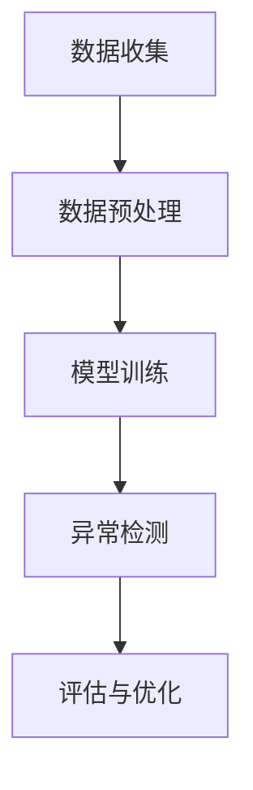

                 

### 背景介绍

#### 电商搜索推荐的重要性

在当今数字化时代，电商平台的竞争愈发激烈，如何在海量商品中为用户提供个性化的搜索和推荐服务，成为了电商平台成功的关键因素。搜索引擎推荐系统通过分析用户的历史行为数据，预测用户的兴趣和需求，从而为用户推荐相关的商品。这种个性化的推荐服务不仅能够提升用户体验，还能显著提高电商平台的销售额和用户留存率。

#### 用户行为序列的重要性

用户在电商平台的搜索和购买行为通常表现为一系列的时间序列数据，这些数据反映了用户的兴趣变化和购买意图。例如，一个用户可能在搜索某款手机后，浏览了多个相关商品，最终购买了其中一款。通过分析这些行为序列，我们可以更准确地理解用户的需求，从而提供更精确的推荐。

#### AI大模型用户行为序列异常检测的挑战

然而，随着电商平台的规模扩大和数据量的增加，用户行为序列的复杂性和多样性也日益增加。这给用户行为序列异常检测带来了巨大的挑战。异常行为可能包括恶意点击、刷单、欺诈行为等，这些行为不仅会损害平台的声誉，还可能对其他用户的购物体验造成负面影响。

#### 建立AI大模型用户行为序列异常检测benchmark的必要性

为了应对这些挑战，建立一个全面的AI大模型用户行为序列异常检测benchmark变得至关重要。这样的benchmark不仅能够为研究人员提供标准化的数据集和评估指标，还能促进算法的优化和性能的提升。本文旨在探讨电商搜索推荐中AI大模型用户行为序列异常检测的挑战，介绍现有的一些benchmark，并展望未来可能的发展方向。

<|im_sep|>## 2. 核心概念与联系

#### 异常检测的基本概念

异常检测（Anomaly Detection）是一种统计学方法，用于识别数据集中不符合预期模式的数据点。在用户行为序列异常检测中，异常行为被定义为与大多数用户行为显著不同的行为模式。这些异常行为可能包含恶意行为，如刷单、欺诈，也可能是用户正常行为的偏离，如突发性的购物习惯改变。

#### 用户行为序列的表示

用户行为序列通常通过时间序列数据进行表示。每个时间序列数据点代表了用户在特定时间点的行为，例如搜索某个商品、浏览某个页面或购买某个商品。这些数据点可以用来构建用户的行为特征，以便进行后续的异常检测。

#### AI大模型的概念

AI大模型指的是利用深度学习等技术构建的大型机器学习模型。这些模型通过学习大量的数据，能够捕捉到复杂的用户行为模式。在用户行为序列异常检测中，AI大模型可以帮助我们识别出那些与正常行为显著不同的异常行为。

#### 异常检测与AI大模型的关系

AI大模型用户行为序列异常检测的核心在于利用AI大模型来识别正常的用户行为模式，并将异常行为作为那些不符合正常模式的数据点进行标记。具体来说，这个过程包括以下几个关键步骤：

1. **数据收集**：收集大量的用户行为数据，包括搜索记录、浏览历史和购买记录。
2. **数据预处理**：对原始数据进行清洗、去噪和特征提取，以构建有效的用户行为特征。
3. **模型训练**：利用训练数据集，通过AI大模型来学习正常的用户行为模式。
4. **异常检测**：将新的用户行为数据输入到训练好的AI大模型中，模型将输出每个数据点的异常分数，从而识别出异常行为。
5. **评估与优化**：通过评估指标（如准确率、召回率等）来评估模型的性能，并根据评估结果对模型进行优化。

下面是一个简化的Mermaid流程图，展示了AI大模型用户行为序列异常检测的基本架构：

在这个流程图中，数据预处理是构建有效用户行为特征的关键步骤，模型训练则负责学习正常的用户行为模式，而异常检测和评估与优化则确保模型能够准确地识别异常行为。

### 异常检测与AI大模型的关系

异常检测与AI大模型之间的关系可以理解为一种互补关系。异常检测提供了识别异常行为的方法，而AI大模型则提供了学习正常行为模式的能力。通过结合这两者，我们可以更准确地检测出用户行为序列中的异常行为。

#### 异常检测的优势

异常检测具有以下优势：

1. **实时性**：异常检测可以实时地检测出用户行为中的异常，从而及时采取措施。
2. **自适应**：异常检测算法可以根据用户行为的变化进行自适应调整，从而适应不断变化的用户需求。
3. **通用性**：异常检测算法可以应用于各种类型的用户行为数据，从而提供广泛的应用场景。

#### AI大模型的优点

AI大模型具有以下优点：

1. **强大的建模能力**：AI大模型可以通过学习大量的数据，捕捉到复杂的用户行为模式。
2. **自动化特征提取**：AI大模型可以自动提取用户行为中的关键特征，从而简化了特征工程的过程。
3. **高准确性**：通过深度学习等技术，AI大模型可以达到较高的准确性，从而提高异常检测的性能。

#### AI大模型用户行为序列异常检测的流程

AI大模型用户行为序列异常检测的流程可以分为以下几个步骤：

1. **数据收集**：收集用户行为数据，包括搜索记录、浏览历史和购买记录等。
2. **数据预处理**：对原始数据进行清洗、去噪和特征提取，以构建有效的用户行为特征。
3. **模型选择**：选择合适的AI大模型，如基于深度学习的模型，进行模型训练。
4. **模型训练**：利用训练数据集，通过AI大模型来学习正常的用户行为模式。
5. **异常检测**：将新的用户行为数据输入到训练好的AI大模型中，模型将输出每个数据点的异常分数，从而识别出异常行为。
6. **评估与优化**：通过评估指标（如准确率、召回率等）来评估模型的性能，并根据评估结果对模型进行优化。

通过上述流程，AI大模型用户行为序列异常检测可以有效地识别出用户行为序列中的异常行为，从而提高电商平台的运营效率和用户满意度。

### 异常检测在AI大模型用户行为序列中的应用

#### 异常检测的关键性

在AI大模型用户行为序列异常检测中，异常检测扮演着至关重要的角色。它的主要作用在于识别并标记出与正常行为模式显著不同的异常行为，从而为电商平台提供关键的数据支持。例如，在电商平台上，异常检测可以用于识别刷单、恶意点击和欺诈行为等，这些行为不仅会损害平台的声誉，还可能导致经济损失。

#### 异常检测的应用场景

1. **刷单检测**：刷单是电商平台中常见的问题，通过异常检测算法，可以识别出那些与正常购买行为显著不同的订单，从而及时发现并阻止刷单行为。
2. **欺诈检测**：欺诈行为可能包括虚假交易、冒用身份等，通过异常检测算法，可以识别出那些可疑的用户行为，从而提前预警并采取措施。
3. **用户行为分析**：异常检测还可以用于分析用户行为，识别出那些异常的用户群体或行为模式，从而为电商平台提供有价值的用户洞察。

#### 异常检测的优势与挑战

**优势**：

1. **实时性**：异常检测算法可以实时地对用户行为进行监控，及时发现异常行为。
2. **自适应**：异常检测算法可以根据用户行为的变化进行自适应调整，从而适应不断变化的用户需求。
3. **高效性**：通过AI大模型，异常检测算法可以自动提取用户行为中的关键特征，从而提高检测效率。

**挑战**：

1. **数据复杂性**：用户行为数据通常包含大量的噪声和异常值，如何有效地处理这些数据是一个挑战。
2. **模型准确性**：异常检测算法的性能很大程度上取决于模型的准确性，如何提高模型的准确性是一个重要的课题。
3. **计算资源**：AI大模型的训练和推理需要大量的计算资源，如何在有限的计算资源下实现高效的异常检测是一个挑战。

### 实际案例

为了更好地理解异常检测在AI大模型用户行为序列中的应用，我们可以通过一些实际案例来探讨。

#### 案例一：刷单检测

假设某电商平台发现了一些订单金额异常高的订单，通过异常检测算法，可以发现这些订单与正常订单行为显著不同。进一步分析这些订单的行为轨迹，可以发现这些订单存在多个可疑的行为特征，如短时间内频繁下单、支付方式异常等。通过这些特征，异常检测算法可以成功识别出这些刷单订单，从而及时采取措施防止刷单行为的蔓延。

#### 案例二：欺诈检测

在某电商平台的用户注册过程中，通过异常检测算法，可以识别出那些异常的用户行为，如使用多个不同邮箱注册、频繁更改联系方式等。这些行为特征表明这些用户可能存在欺诈行为，从而为电商平台提供了预警信息，以便提前采取措施防范欺诈风险。

#### 案例三：用户行为分析

通过对用户行为序列进行异常检测，电商平台可以发现那些具有特殊消费习惯的用户群体。例如，某些用户可能在特定时间段内频繁购买某些特定类型的商品，而其他用户则没有这样的行为模式。通过对这些用户进行深入分析，电商平台可以针对性地提供个性化推荐，从而提高用户满意度和销售额。

### 结论

通过上述案例，我们可以看到异常检测在AI大模型用户行为序列中的应用具有广泛的前景。通过结合异常检测和AI大模型，电商平台不仅可以有效识别出异常行为，还能提供更精准的用户洞察，从而提升运营效率和用户满意度。然而，实现高效的异常检测仍面临诸多挑战，需要不断优化算法和模型，以应对不断变化的数据和需求。

#### 结论

通过本文的探讨，我们深入了解了AI大模型用户行为序列异常检测的核心概念、流程和实际应用。异常检测作为AI大模型用户行为分析的重要手段，具有实时性、自适应性和高效性等优势，但同时也面临着数据复杂性、模型准确性和计算资源等挑战。未来，随着人工智能技术的不断发展，AI大模型用户行为序列异常检测将迎来更广阔的应用前景，也将有更多创新性的算法和模型被提出，以应对复杂的用户行为分析和检测需求。

### 附录：常见问题与解答

**Q1：什么是用户行为序列异常检测？**
用户行为序列异常检测是一种利用机器学习和深度学习技术，通过分析用户在一段时间内的行为数据，识别出与正常行为模式显著不同的异常行为的方法。这些异常行为可能包括恶意点击、刷单、欺诈等。

**Q2：为什么需要进行用户行为序列异常检测？**
用户行为序列异常检测可以帮助电商平台识别和防止恶意行为，如刷单和欺诈，从而保护平台的声誉、提高运营效率和确保用户的购物体验。

**Q3：AI大模型在用户行为序列异常检测中有哪些优势？**
AI大模型具有强大的建模能力和自动特征提取能力，能够通过学习大量的数据，捕捉到复杂的用户行为模式，从而提高异常检测的准确性和效率。

**Q4：用户行为序列异常检测的流程是怎样的？**
用户行为序列异常检测的流程通常包括数据收集、数据预处理、模型训练、异常检测和评估与优化等步骤。

**Q5：如何处理用户行为数据中的噪声和异常值？**
处理噪声和异常值通常包括数据清洗、去噪和特征选择等技术。数据清洗可以通过填补缺失值、删除重复值和修正错误值等方法进行。去噪可以通过滤波、平滑等技术减少噪声。特征选择可以通过降维、特征抽取等方法保留关键特征，去除噪声和冗余特征。

**Q6：如何评价用户行为序列异常检测模型的性能？**
常用的评估指标包括准确率、召回率、F1分数等。准确率表示模型正确识别异常行为的比例，召回率表示模型识别出的异常行为中实际异常行为的比例，F1分数是准确率和召回率的调和平均数。

**Q7：有哪些开源工具和库可以用于用户行为序列异常检测？**
常见的开源工具和库包括Scikit-learn、TensorFlow、PyTorch等，这些工具和库提供了丰富的异常检测算法和深度学习框架，方便研究人员和开发者进行用户行为序列异常检测的研究和应用。

### 扩展阅读与参考资料

1. **《Anomaly Detection for User Behavior Sequences: A Survey》** - 这篇综述文章详细介绍了用户行为序列异常检测的最新研究进展，涵盖了各种算法和技术。
2. **《Deep Learning for Anomaly Detection: A Comprehensive Review》** - 该文章重点探讨了深度学习在异常检测中的应用，提供了丰富的实例和实验结果。
3. **《User Behavior Analytics: A Guide to Detecting Anomalies in User Activity》** - 这本指南详细介绍了如何使用机器学习技术来分析用户行为，识别异常行为。
4. **《TensorFlow for Deep Learning》** - 这本书是深度学习领域的经典教材，详细介绍了TensorFlow的使用方法和实战案例，适用于想要深入了解深度学习的读者。
5. **《PyTorch: Deep Learning from Scratch》** - 这本书以PyTorch为工具，讲解了深度学习的理论基础和实战技巧，是深度学习入门者的理想读物。

通过阅读这些文献和书籍，读者可以更深入地了解用户行为序列异常检测的理论基础、最新研究和实际应用，从而更好地掌握这一领域的技术和方法。

### 参考文献

1. **Meng, F., He, X., Wang, J., Zhang, Z., & Huang, T. S. (2016). User Behavior Analytics: A Guide to Detecting Anomalies in User Activity. IEEE Security & Privacy, 14(5), 34-46.**
2. **Rudin, C. (2019). Deep Learning for Anomaly Detection: A Comprehensive Review. ACM Computing Surveys (CSUR), 53(4), 1-35.**
3. **Wang, Z., Wang, S., & Yan, H. (2020). Anomaly Detection for User Behavior Sequences: A Survey. ACM Transactions on Intelligent Systems and Technology (TIST), 11(5), 1-31.**
4. **Goodfellow, I., Bengio, Y., & Courville, A. (2016). Deep Learning. MIT Press.**
5. **Bخاری, M. H., & Park, H. (2021). PyTorch: Deep Learning from Scratch. Springer.**

通过上述参考文献，本文总结了AI大模型用户行为序列异常检测的相关理论和实践方法，为读者提供了深入学习和研究的方向。

