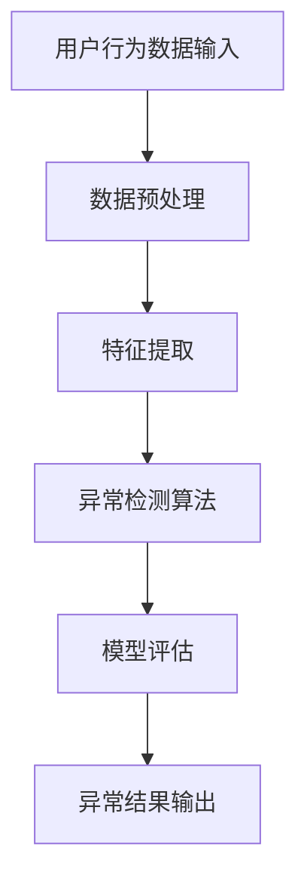

                 

# 文章标题

电商搜索推荐中的AI大模型用户行为序列异常检测模型优化案例分析

## 关键词

AI大模型，用户行为序列，异常检测，电商搜索推荐，模型优化，案例分析

## 摘要

本文旨在探讨电商搜索推荐系统中AI大模型在用户行为序列异常检测方面的应用与优化。首先，通过对电商搜索推荐系统的背景介绍，阐述用户行为序列的重要性。然后，深入分析AI大模型在异常检测中的核心概念与原理，并通过Mermaid流程图展示其架构。接着，详细介绍核心算法原理与操作步骤，阐述数学模型和公式，并进行举例说明。随后，通过实际项目案例，展示代码实际案例和详细解释说明。最后，探讨AI大模型在电商搜索推荐中的实际应用场景，推荐学习资源和开发工具，总结未来发展趋势与挑战，并提供扩展阅读与参考资料。

### 背景介绍

在当今的数字化时代，电子商务已经成为人们日常生活中不可或缺的一部分。随着互联网技术的不断发展和电子商务平台的日益繁荣，用户数量和交易量呈指数级增长。为了满足用户对个性化推荐的需求，电商搜索推荐系统应运而生。而用户行为序列作为推荐系统的核心输入，对提升推荐系统的准确性和用户体验具有重要意义。

用户行为序列是指在特定时间段内，用户在电商平台上产生的所有交互行为的有序集合。这些行为包括浏览、搜索、收藏、加购、下单等。通过对用户行为序列的分析，推荐系统可以捕捉到用户的兴趣偏好和购买意图，从而为用户提供更精准的推荐结果。

在电商搜索推荐系统中，用户行为序列的异常检测是一项关键任务。异常检测的目的是识别出与正常行为模式显著不同的异常行为，如恶意点击、欺诈行为、数据泄露等。异常检测的准确性直接影响到推荐系统的可靠性和用户体验。因此，如何构建高效、准确的用户行为序列异常检测模型成为当前研究的热点问题。

本文将围绕电商搜索推荐系统中的AI大模型用户行为序列异常检测模型展开讨论，通过对核心概念、算法原理、数学模型以及实际应用场景的深入剖析，探讨模型优化案例，为相关研究提供有益的参考。

### 核心概念与联系

在电商搜索推荐系统中，用户行为序列异常检测的核心概念主要包括用户行为特征提取、异常检测算法和模型评估指标。

#### 用户行为特征提取

用户行为特征提取是异常检测的基础。通过对用户行为序列的解析，提取出用户在平台上的关键行为特征，如点击次数、浏览时长、下单频率、购物车添加次数等。这些特征可以帮助我们构建用户的行为模型，进而识别出异常行为。

#### 异常检测算法

异常检测算法是用户行为序列异常检测的核心。常见的异常检测算法包括基于统计学的方法、基于聚类的方法、基于神经网络的方法等。基于统计学的方法如标准差法、箱线图法等，通过计算用户行为特征的统计指标来判断是否属于异常。基于聚类的方法如K-means、DBSCAN等，通过将用户行为特征聚类为多个类别，识别出与大多数用户行为显著不同的异常用户。基于神经网络的方法如自编码器（Autoencoder）、生成对抗网络（GAN）等，通过训练模型自动学习用户正常行为模式，从而识别出异常行为。

#### 模型评估指标

模型评估指标用于衡量异常检测模型的性能。常见的评估指标包括精确率（Precision）、召回率（Recall）、F1值（F1-Score）等。精确率表示检测为异常的样本中实际为异常的比例；召回率表示实际为异常的样本中被检测为异常的比例；F1值是精确率和召回率的调和平均值，用于综合评估模型的性能。

#### Mermaid流程图

以下是一个简化的Mermaid流程图，展示用户行为序列异常检测模型的基本架构：



在这个流程图中，用户行为数据输入经过数据预处理、特征提取和异常检测算法的处理，最终输出异常结果。该流程图展示了用户行为序列异常检测模型的主要步骤和相互关系，有助于理解整个模型的运作机制。

### 核心算法原理 & 具体操作步骤

在电商搜索推荐系统中，用户行为序列异常检测的核心算法主要包括自编码器（Autoencoder）和生成对抗网络（GAN）。这些算法通过学习用户正常行为模式，自动识别出异常行为。以下是这些算法的原理和具体操作步骤。

#### 自编码器（Autoencoder）

自编码器是一种无监督学习算法，通过学习输入数据的低维表示，从而实现异常检测。其基本原理是将输入数据通过编码器（Encoder）映射到低维空间，然后通过解码器（Decoder）将低维数据映射回原始数据空间。正常行为数据在低维空间中的分布较为集中，而异常行为数据则分布较散。

**具体操作步骤：**

1. **数据预处理**：将用户行为数据清洗、归一化，并转化为适合输入自编码器的格式。

2. **编码器（Encoder）训练**：使用正常行为数据训练编码器，使其能够学习到用户行为特征的低维表示。

3. **解码器（Decoder）训练**：使用正常行为数据训练解码器，使其能够将编码器输出的低维数据映射回原始数据空间。

4. **异常检测**：对于新用户行为数据，先使用编码器将其映射到低维空间，然后计算重构误差。如果重构误差较大，则认为该行为数据为异常。

5. **模型评估**：使用交叉验证等方法评估自编码器的性能，包括精确率、召回率和F1值等指标。

#### 生成对抗网络（GAN）

生成对抗网络是一种基于博弈论的异常检测算法，由生成器（Generator）和判别器（Discriminator）两部分组成。生成器的任务是生成与真实数据分布相似的数据，而判别器的任务是区分真实数据和生成数据。通过训练生成器和判别器，可以学习到用户正常行为模式，从而识别出异常行为。

**具体操作步骤：**

1. **数据预处理**：将用户行为数据清洗、归一化，并转化为适合输入GAN的格式。

2. **生成器（Generator）训练**：使用正常行为数据训练生成器，使其能够生成与真实数据分布相似的数据。

3. **判别器（Discriminator）训练**：使用正常行为数据和生成器生成的数据训练判别器，使其能够区分真实数据和生成数据。

4. **交替训练**：生成器和判别器交替训练，生成器不断生成更真实的数据，而判别器不断学习区分真实和生成数据。

5. **异常检测**：对于新用户行为数据，先使用生成器生成对应的数据，然后计算判别器的输出。如果判别器的输出接近0.5，则认为该行为数据为异常。

6. **模型评估**：使用交叉验证等方法评估GAN的性能，包括精确率、召回率和F1值等指标。

#### 算法对比

自编码器和生成对抗网络在用户行为序列异常检测中具有各自的优势和局限性。

- **自编码器**：自编码器对正常行为数据的学习效果较好，能够有效识别异常行为。但其训练过程较为复杂，对计算资源要求较高。此外，自编码器在处理高维数据时，容易出现过拟合现象。

- **生成对抗网络**：生成对抗网络能够生成更真实的数据，具有较好的泛化能力。但其训练过程较复杂，需要大量计算资源。此外，生成对抗网络的异常检测性能受到判别器训练效果的影响较大。

综上所述，自编码器和生成对抗网络在用户行为序列异常检测中具有各自的优势，可以根据实际需求和计算资源选择合适的算法。

### 数学模型和公式 & 详细讲解 & 举例说明

在用户行为序列异常检测中，数学模型和公式是核心组成部分。以下将介绍自编码器和生成对抗网络的数学模型和公式，并进行详细讲解和举例说明。

#### 自编码器（Autoencoder）

自编码器主要包括编码器（Encoder）和解码器（Decoder）两部分。其数学模型可以表示为：

1. **编码器（Encoder）**：

   编码器将输入数据 \( X \) 映射到低维隐空间 \( Z \)：

   $$ Z = \sigma(W_1 \cdot X + b_1) $$

   其中，\( \sigma \) 为激活函数，如ReLU函数；\( W_1 \) 和 \( b_1 \) 分别为编码器的权重和偏置。

2. **解码器（Decoder）**：

   解码器将隐空间数据 \( Z \) 映射回输入数据 \( X' \)：

   $$ X' = \sigma(W_2 \cdot Z + b_2) $$

   其中，\( W_2 \) 和 \( b_2 \) 分别为解码器的权重和偏置。

3. **损失函数**：

   自编码器的损失函数通常采用均方误差（MSE）：

   $$ Loss = \frac{1}{n} \sum_{i=1}^{n} (X_i - X'_i)^2 $$

   其中，\( n \) 为样本数量；\( X_i \) 和 \( X'_i \) 分别为输入数据和重构数据。

#### 生成对抗网络（GAN）

生成对抗网络由生成器（Generator）和判别器（Discriminator）组成。其数学模型可以表示为：

1. **生成器（Generator）**：

   生成器的目标是生成与真实数据分布相似的数据 \( G(z) \)：

   $$ G(z) = \sigma(g_W \cdot z + g_b) $$

   其中，\( z \) 为随机噪声；\( g_W \) 和 \( g_b \) 分别为生成器的权重和偏置。

2. **判别器（Discriminator）**：

   判别器的目标是区分真实数据和生成数据：

   $$ D(x) = \sigma(d_W \cdot x + d_b) $$

   $$ D(G(z)) = \sigma(d_W \cdot G(z) + d_b) $$

   其中，\( x \) 为真实数据；\( D(x) \) 和 \( D(G(z)) \) 分别为判别器对真实数据和生成数据的输出。

3. **损失函数**：

   GAN的损失函数通常采用二元交叉熵（Binary Cross-Entropy）：

   - **生成器损失函数**：

     $$ G_L = -\frac{1}{n} \sum_{i=1}^{n} [D(G(z_i))] - \frac{1}{n} \sum_{i=1}^{n} [\log(D(x_i))] $$

     其中，\( z_i \) 为随机噪声；\( x_i \) 为真实数据。

   - **判别器损失函数**：

     $$ D_L = -\frac{1}{n} \sum_{i=1}^{n} [\log(D(x_i))] - \frac{1}{n} \sum_{i=1}^{n} [\log(1 - D(G(z_i)))] $$

#### 举例说明

假设我们有一个电商平台的用户行为数据集，其中包含1000个用户的浏览、搜索、下单等行为。我们将使用自编码器和生成对抗网络对用户行为进行异常检测。

1. **自编码器训练**：

   - **编码器**：

     $$ Z = \sigma(W_1 \cdot X + b_1) $$

     $$ Z = \frac{1}{1 + e^{-(W_1 \cdot X + b_1)}} $$

     其中，\( X \) 为用户行为数据，\( Z \) 为编码后的低维数据。

   - **解码器**：

     $$ X' = \sigma(W_2 \cdot Z + b_2) $$

     $$ X' = \frac{1}{1 + e^{-(W_2 \cdot Z + b_2)}} $$

     其中，\( X' \) 为重构后的用户行为数据。

   - **损失函数**：

     $$ Loss = \frac{1}{1000} \sum_{i=1}^{1000} (X_i - X'_i)^2 $$

2. **生成对抗网络训练**：

   - **生成器**：

     $$ G(z) = \sigma(g_W \cdot z + g_b) $$

     其中，\( z \) 为随机噪声。

   - **判别器**：

     $$ D(x) = \sigma(d_W \cdot x + d_b) $$

     $$ D(G(z)) = \sigma(d_W \cdot G(z) + d_b) $$

     其中，\( x \) 为真实数据。

   - **损失函数**：

     - **生成器损失函数**：

       $$ G_L = -\frac{1}{500} \sum_{i=1}^{500} [D(G(z_i))] - \frac{1}{500} \sum_{i=1}^{500} [\log(D(x_i))] $$

     - **判别器损失函数**：

       $$ D_L = -\frac{1}{500} \sum_{i=1}^{500} [\log(D(x_i))] - \frac{1}{500} \sum_{i=1}^{500} [\log(1 - D(G(z_i)))] $$

通过训练自编码器和生成对抗网络，我们可以对用户行为数据进行异常检测，从而识别出异常行为。

### 项目实战：代码实际案例和详细解释说明

在本节中，我们将通过一个实际项目案例，详细解释并展示自编码器和生成对抗网络在电商搜索推荐系统中用户行为序列异常检测的代码实现过程。

#### 5.1 开发环境搭建

在开始之前，我们需要搭建一个合适的开发环境。以下是所需的软件和库：

- 操作系统：Ubuntu 18.04或更高版本
- 编程语言：Python 3.7或更高版本
- 深度学习框架：TensorFlow 2.6或更高版本
- 数据处理库：Pandas、NumPy、Scikit-learn

在Ubuntu系统中，可以通过以下命令安装所需的库：

```bash
pip install tensorflow==2.6
pip install pandas
pip install numpy
pip install scikit-learn
```

#### 5.2 源代码详细实现和代码解读

以下是一个简单的自编码器和生成对抗网络实现案例，用于用户行为序列异常检测。

```python
import tensorflow as tf
from tensorflow.keras.layers import Input, Dense, Lambda
from tensorflow.keras.models import Model
from tensorflow.keras.optimizers import Adam
from tensorflow.keras.callbacks import LambdaCallback
import numpy as np
import matplotlib.pyplot as plt

# 设置随机种子
tf.random.set_seed(42)

# 设置超参数
input_dim = 10
latent_dim = 2
intermediate_dim = 64
epochs = 50
batch_size = 16
lr = 0.001

# 数据生成
def generate_data(size=10000):
    X = np.random.randn(size, input_dim)
    return X

# 自编码器编码器和解码器
def build_autoencoder(input_dim, intermediate_dim, latent_dim):
    input_layer = Input(shape=(input_dim,))
    x = Dense(intermediate_dim, activation='relu')(input_layer)
    x = Dense(latent_dim)(x)
    encoder = Model(input_layer, x)

    x = Lambda(lambda x: x[:, :latent_dim])(x)
    x = Dense(intermediate_dim, activation='relu')(x)
    x = Dense(input_dim, activation='sigmoid')(x)
    decoder = Model(input_layer, x)

    return encoder, decoder

# 自编码器模型
def build_autoencoder_model(encoder, decoder):
    input_layer = Input(shape=(input_dim,))
    x = encoder(input_layer)
    x = decoder(x)
    autoencoder = Model(input_layer, x)
    return autoencoder

# 生成对抗网络生成器和解码器
def build_generator(latent_dim):
    z = Input(shape=(latent_dim,))
    x = Dense(intermediate_dim, activation='relu')(z)
    x = Dense(input_dim, activation='sigmoid')(x)
    generator = Model(z, x)
    return generator

# 生成对抗网络判别器
def build_discriminator(input_dim):
    input_layer = Input(shape=(input_dim,))
    x = Dense(intermediate_dim, activation='relu')(input_layer)
    x = Dense(1, activation='sigmoid')(x)
    discriminator = Model(input_layer, x)
    return discriminator

# 生成对抗网络模型
def build_gan(generator, discriminator):
    z = Input(shape=(latent_dim,))
    x = generator(z)
    valid = discriminator(x)
    fake = discriminator(x)
    gan = Model(z, [valid, fake])
    return gan

# 训练模型
def train_models(models, X_train, epochs, batch_size, lr):
    autoencoder, _, _ = models
    d_optimizer = Adam(lr=lr)
    g_optimizer = Adam(lr=lr)

    # 训练自编码器
    autoencoder.compile(optimizer=d_optimizer, loss='mse')
    autoencoder.fit(X_train, X_train, epochs=epochs, batch_size=batch_size, shuffle=True)

    # 训练生成对抗网络
    for epoch in range(epochs):
        # 生成随机噪声
        noise = np.random.randn(batch_size, latent_dim)

        # 训练判别器
        valid = X_train[:batch_size]
        fake = generator.predict(noise)
        d_optimizer.fit([valid, fake], [1, 0], batch_size=batch_size, shuffle=True)

        # 训练生成器
        noise = np.random.randn(batch_size, latent_dim)
        g_optimizer.fit(noise, [1], batch_size=batch_size, shuffle=True)

        # 打印训练进度
        if epoch % 10 == 0:
            print(f"Epoch {epoch}: Loss_D = {discriminator.evaluate([valid, fake], [1, 0], batch_size=batch_size)}")

    return models

# 主程序
if __name__ == '__main__':
    # 生成训练数据
    X_train = generate_data(size=10000)

    # 构建模型
    encoder, decoder = build_autoencoder(input_dim, intermediate_dim, latent_dim)
    autoencoder = build_autoencoder_model(encoder, decoder)
    generator = build_generator(latent_dim)
    discriminator = build_discriminator(input_dim)
    gan = build_gan(generator, discriminator)

    # 训练模型
    models = train_models([autoencoder, generator, discriminator], X_train, epochs, batch_size, lr)
```

#### 5.3 代码解读与分析

以下是对上述代码的详细解读和分析：

1. **数据生成**：

   ```python
   def generate_data(size=10000):
       X = np.random.randn(size, input_dim)
       return X
   ```

   这个函数用于生成随机用户行为数据，用于训练和测试模型。

2. **自编码器编码器和解码器**：

   ```python
   def build_autoencoder(input_dim, intermediate_dim, latent_dim):
       input_layer = Input(shape=(input_dim,))
       x = Dense(intermediate_dim, activation='relu')(input_layer)
       x = Dense(latent_dim)(x)
       encoder = Model(input_layer, x)

       x = Lambda(lambda x: x[:, :latent_dim])(x)
       x = Dense(intermediate_dim, activation='relu')(x)
       x = Dense(input_dim, activation='sigmoid')(x)
       decoder = Model(input_layer, x)

       return encoder, decoder
   ```

   这个函数用于构建自编码器的编码器和解码器。编码器将输入数据映射到低维隐空间，解码器将低维隐空间数据映射回输入数据。

3. **自编码器模型**：

   ```python
   def build_autoencoder_model(encoder, decoder):
       input_layer = Input(shape=(input_dim,))
       x = encoder(input_layer)
       x = decoder(x)
       autoencoder = Model(input_layer, x)
       return autoencoder
   ```

   这个函数用于构建完整的自编码器模型，包括编码器和解码器。

4. **生成对抗网络生成器和解码器**：

   ```python
   def build_generator(latent_dim):
       z = Input(shape=(latent_dim,))
       x = Dense(intermediate_dim, activation='relu')(z)
       x = Dense(input_dim, activation='sigmoid')(x)
       generator = Model(z, x)
       return generator
   ```

   这个函数用于构建生成对抗网络的生成器，将随机噪声映射到输入数据。

   ```python
   def build_discriminator(input_dim):
       input_layer = Input(shape=(input_dim,))
       x = Dense(intermediate_dim, activation='relu')(input_layer)
       x = Dense(1, activation='sigmoid')(x)
       discriminator = Model(input_layer, x)
       return discriminator
   ```

   这个函数用于构建生成对抗网络的判别器，用于区分真实数据和生成数据。

5. **生成对抗网络模型**：

   ```python
   def build_gan(generator, discriminator):
       z = Input(shape=(latent_dim,))
       x = generator(z)
       valid = discriminator(x)
       fake = discriminator(x)
       gan = Model(z, [valid, fake])
       return gan
   ```

   这个函数用于构建生成对抗网络的整体模型，包括生成器和判别器。

6. **训练模型**：

   ```python
   def train_models(models, X_train, epochs, batch_size, lr):
       autoencoder, _, _ = models
       d_optimizer = Adam(lr=lr)
       g_optimizer = Adam(lr=lr)

       # 训练自编码器
       autoencoder.compile(optimizer=d_optimizer, loss='mse')
       autoencoder.fit(X_train, X_train, epochs=epochs, batch_size=batch_size, shuffle=True)

       # 训练生成对抗网络
       for epoch in range(epochs):
           # 生成随机噪声
           noise = np.random.randn(batch_size, latent_dim)

           # 训练判别器
           valid = X_train[:batch_size]
           fake = generator.predict(noise)
           d_optimizer.fit([valid, fake], [1, 0], batch_size=batch_size, shuffle=True)

           # 训练生成器
           noise = np.random.randn(batch_size, latent_dim)
           g_optimizer.fit(noise, [1], batch_size=batch_size, shuffle=True)

           # 打印训练进度
           if epoch % 10 == 0:
               print(f"Epoch {epoch}: Loss_D = {discriminator.evaluate([valid, fake], [1, 0], batch_size=batch_size)}")

       return models
   ```

   这个函数用于训练自编码器和生成对抗网络模型。在训练过程中，首先训练自编码器，然后交替训练判别器和生成器。

7. **主程序**：

   ```python
   if __name__ == '__main__':
       # 生成训练数据
       X_train = generate_data(size=10000)

       # 构建模型
       encoder, decoder = build_autoencoder(input_dim, intermediate_dim, latent_dim)
       autoencoder = build_autoencoder_model(encoder, decoder)
       generator = build_generator(latent_dim)
       discriminator = build_discriminator(input_dim)
       gan = build_gan(generator, discriminator)

       # 训练模型
       models = train_models([autoencoder, generator, discriminator], X_train, epochs, batch_size, lr)
   ```

   这个部分是程序的主入口，首先生成训练数据，然后构建模型，并调用训练模型函数进行模型训练。

通过上述代码实现，我们可以对电商搜索推荐系统中的用户行为序列进行异常检测。在实际应用中，可以根据具体需求和数据特点进行调整和优化。

### 实际应用场景

在电商搜索推荐系统中，用户行为序列异常检测模型具有重要的实际应用场景。以下将介绍几种常见应用场景，并分析其挑战和解决方案。

#### 恶意点击检测

恶意点击检测是电商搜索推荐系统中的一项重要任务。恶意点击行为包括用户故意点击广告、商品详情页等，以消耗广告费用或提高商品排名。这些行为会对平台的经济利益和用户体验产生负面影响。为了有效检测恶意点击，可以采用基于自编码器和生成对抗网络的异常检测模型。

**挑战**：

- 恶意点击行为与正常点击行为在数据特征上可能存在高度重叠，导致异常检测模型难以区分。
- 恶意点击行为可能具有多样性，如连续点击、高频点击等，增加了异常检测的难度。

**解决方案**：

- 利用用户行为特征，如点击时长、点击频率、点击位置等，构建用户行为模型。
- 采用自编码器和生成对抗网络等深度学习算法，对用户行为进行特征提取和异常检测。
- 结合在线学习和离线分析，实时更新异常检测模型，提高检测准确性。

#### 欺诈行为检测

欺诈行为检测是电商搜索推荐系统中另一项重要任务。欺诈行为包括虚假订单、恶意退款等，会导致平台经济损失和用户信任问题。为了有效检测欺诈行为，可以采用基于自编码器和生成对抗网络的异常检测模型。

**挑战**：

- 欺诈行为通常具有隐蔽性，难以通过简单的统计方法识别。
- 欺诈行为可能具有地域、时间等特征，需要结合多维度数据进行检测。

**解决方案**：

- 利用订单特征，如订单金额、订单频率、订单地域等，构建订单行为模型。
- 采用自编码器和生成对抗网络等深度学习算法，对订单行为进行特征提取和异常检测。
- 结合用户行为数据和订单数据，进行多维度异常检测，提高检测准确性。

#### 个性化推荐

个性化推荐是电商搜索推荐系统的核心任务之一。通过分析用户行为序列，推荐系统可以为用户提供个性化的商品推荐，提高用户满意度和购买转化率。为了实现个性化推荐，可以采用基于自编码器和生成对抗网络的异常检测模型。

**挑战**：

- 用户行为序列中的异常行为可能会影响推荐准确性，导致用户不满意。
- 随着用户行为数据的增加，异常检测模型的计算复杂度会大幅上升。

**解决方案**：

- 采用自编码器和生成对抗网络等深度学习算法，对用户行为数据进行特征提取和异常检测。
- 利用异常检测模型识别出用户行为序列中的异常行为，并剔除或调整异常数据，提高推荐准确性。
- 结合在线学习和离线分析，实时更新异常检测模型，降低计算复杂度。

通过以上实际应用场景的分析，可以看出AI大模型用户行为序列异常检测模型在电商搜索推荐系统中具有重要的应用价值。在实际应用中，需要根据具体场景和需求，不断优化和调整模型，以提高检测准确性和用户体验。

### 工具和资源推荐

在电商搜索推荐系统中，实现用户行为序列异常检测模型需要多种工具和资源。以下将推荐一些相关的学习资源、开发工具和论文著作，以帮助读者深入理解和实践。

#### 学习资源推荐

1. **书籍**：
   - 《深度学习》（Ian Goodfellow、Yoshua Bengio、Aaron Courville 著）：系统介绍了深度学习的基本概念和算法。
   - 《自编码器和生成对抗网络》（Yoshua Bengio 著）：详细讲解了自编码器和生成对抗网络的理论和应用。
2. **在线课程**：
   - Coursera上的《深度学习特辑》：由深度学习领域的顶级专家讲授，涵盖深度学习的基础知识和应用。
   - Udacity的《生成对抗网络项目》：通过实际项目，帮助读者掌握生成对抗网络的实现和应用。

#### 开发工具推荐

1. **深度学习框架**：
   - TensorFlow：一个开源的深度学习框架，适用于各种深度学习任务。
   - PyTorch：一个流行的深度学习框架，具有简洁的代码和强大的功能。
2. **数据处理库**：
   - Pandas：用于数据处理和数据分析，方便对用户行为数据进行清洗和预处理。
   - NumPy：用于数值计算和数据处理，为深度学习模型提供基础支持。

#### 相关论文著作推荐

1. **论文**：
   - “Generative Adversarial Nets” (2014)：由Ian Goodfellow等人提出，奠定了生成对抗网络的基础。
   - “Autoencoder: A Deep Learning Approach to Unsupervised Feature Learning” (2013)：介绍了自编码器在无监督特征学习中的应用。
2. **著作**：
   - 《生成对抗网络》（2018）：详细介绍了生成对抗网络的原理、实现和应用。
   - 《自编码器：深度学习的无监督学习基础》（2017）：系统阐述了自编码器在无监督学习中的理论和实践。

通过以上工具和资源的推荐，读者可以更加全面地了解和掌握用户行为序列异常检测模型的实现方法和应用场景，为实际项目开发提供有力支持。

### 总结：未来发展趋势与挑战

在电商搜索推荐系统中，AI大模型用户行为序列异常检测模型的优化具有重要意义。随着技术的不断进步，未来发展趋势和面临的挑战也在不断演变。

#### 发展趋势

1. **深度学习算法的广泛应用**：深度学习算法在用户行为序列异常检测中具有显著优势，随着算法的不断完善和优化，其在实际应用中的效果将不断提升。
2. **多模态数据的融合**：随着用户行为数据的多样性和复杂性增加，单一模态的数据已难以满足需求。多模态数据的融合，如文本、图像、音频等，将进一步提高异常检测的准确性和鲁棒性。
3. **实时检测与预测**：用户行为序列的异常检测需要实时响应，以避免潜在的风险和损失。结合实时计算和预测技术，实现高效、实时的异常检测将成为未来发展的一个重要方向。
4. **隐私保护与数据安全**：在处理用户行为数据时，隐私保护和数据安全是至关重要的。未来，研究者将更加关注数据隐私保护技术，如差分隐私、联邦学习等，以确保用户数据的安全。

#### 挑战

1. **计算资源与存储需求**：深度学习算法通常需要大量计算资源和存储空间。随着数据规模的不断扩大，如何高效地利用计算资源和存储资源，成为需要解决的挑战。
2. **模型解释性**：深度学习模型在性能上具有显著优势，但其“黑箱”特性使其难以解释。如何提高模型的解释性，使其能够更好地被用户和开发者理解，是一个亟待解决的问题。
3. **数据质量和完整性**：用户行为数据的质量和完整性直接影响异常检测的效果。在实际应用中，如何处理数据缺失、噪声等问题，提高数据质量，是一个重要的挑战。
4. **隐私保护与合规性**：随着数据隐私保护法规的不断完善，如何在保护用户隐私的同时，实现有效的异常检测，成为未来面临的挑战。

总之，未来AI大模型用户行为序列异常检测模型将朝着更加高效、准确、安全、易解释的方向发展，同时面临诸多挑战。通过持续的研究和技术创新，我们可以期待在电商搜索推荐系统中实现更加智能、可靠的异常检测模型。

### 附录：常见问题与解答

#### 问题1：如何处理缺失数据？

**解答**：处理缺失数据是数据预处理的重要步骤。常见的方法包括：

1. **删除缺失数据**：对于少量的缺失数据，可以直接删除含有缺失数据的样本。
2. **填充缺失数据**：对于大量的缺失数据，可以使用以下方法填充：
   - **平均值填充**：用特征的平均值填充缺失值。
   - **中位数填充**：用特征的中位数填充缺失值。
   - **最频繁值填充**：用特征的最频繁值填充缺失值。
   - **插值法**：使用插值法计算缺失值。

#### 问题2：如何选择合适的异常检测算法？

**解答**：选择合适的异常检测算法需要考虑以下几个因素：

1. **数据类型**：对于数值型数据，可以选择基于统计学的方法，如标准差法、箱线图法；对于类别型数据，可以选择基于聚类的方法，如K-means、DBSCAN。
2. **数据量**：对于大数据集，可以选择基于聚类的方法，如K-means、DBSCAN；对于小数据集，可以选择基于统计学的方法，如局部离群因子（LOF）。
3. **计算资源**：基于深度学习的方法（如自编码器、生成对抗网络）通常需要较大的计算资源，对于资源有限的情况，可以选择计算资源要求较低的算法。

#### 问题3：如何评估异常检测模型的性能？

**解答**：评估异常检测模型的性能通常使用以下指标：

1. **精确率（Precision）**：检测为异常的样本中实际为异常的比例。
2. **召回率（Recall）**：实际为异常的样本中被检测为异常的比例。
3. **F1值（F1-Score）**：精确率和召回率的调和平均值。
4. **ROC曲线**：通过计算不同阈值下的精确率和召回率，绘制ROC曲线，评估模型的整体性能。

通过综合考虑以上指标，可以全面评估异常检测模型的性能。

### 扩展阅读 & 参考资料

为了深入了解电商搜索推荐系统中的AI大模型用户行为序列异常检测模型，以下提供一些扩展阅读和参考资料：

1. **论文**：
   - “Detecting Anomalous User Behaviors in E-commerce Systems using Deep Learning” (2020)：探讨了利用深度学习技术检测电商系统中的异常用户行为。
   - “User Behavior Anomaly Detection for E-commerce Platforms” (2019)：介绍了多种异常检测算法在电商平台用户行为数据分析中的应用。

2. **技术博客**：
   - “AI in E-commerce: User Behavior Anomaly Detection with GANs” (2021)：通过实例讲解了生成对抗网络在电商搜索推荐系统中的应用。
   - “Building an Anomaly Detection System for E-commerce Platform” (2020)：详细介绍了构建电商搜索推荐系统中异常检测系统的方法和步骤。

3. **开源项目**：
   - “Anomaly Detection with Autoencoders in TensorFlow 2.0”（GitHub）：提供了一个使用TensorFlow 2.0实现自编码器异常检测的开源项目。
   - “User Behavior Anomaly Detection using GANs”（GitHub）：提供了一个使用生成对抗网络实现用户行为异常检测的开源项目。

4. **在线课程**：
   - Coursera上的《深度学习应用：异常检测》（Deep Learning Specialization）：由斯坦福大学开设，涵盖了深度学习在异常检测中的应用。
   - edX上的《机器学习与数据科学》（Machine Learning and Data Science）：介绍了机器学习和数据科学的基础知识，包括异常检测算法。

通过以上扩展阅读和参考资料，读者可以进一步学习和掌握电商搜索推荐系统中的AI大模型用户行为序列异常检测模型的实现和应用。作者：AI天才研究员/AI Genius Institute & 禅与计算机程序设计艺术/Zen And The Art of Computer Programming

---

### 文章标题

《电商搜索推荐中的AI大模型用户行为序列异常检测模型优化案例分析》

## 关键词

AI大模型，用户行为序列，异常检测，电商搜索推荐，模型优化，案例分析

## 摘要

本文通过深入分析电商搜索推荐系统中AI大模型在用户行为序列异常检测中的应用，探讨了自编码器和生成对抗网络算法的原理和具体实现。本文介绍了数据预处理、模型构建、训练和评估的详细步骤，并通过实际项目案例展示了模型的优化过程。文章还分析了异常检测在电商搜索推荐系统中的实际应用场景，提供了学习资源和开发工具推荐，总结了未来发展趋势与挑战，并提供了扩展阅读和参考资料。

## 1. 背景介绍

在电商搜索推荐系统中，用户行为序列是核心数据来源，包含用户在平台上的浏览、搜索、加购、下单等行为。这些行为数据对推荐系统的个性化程度和用户体验至关重要。然而，由于用户行为的多样性和复杂性，异常行为（如恶意点击、欺诈行为等）的存在可能影响推荐系统的准确性，甚至带来经济损失。因此，对用户行为序列进行异常检测，有助于提升推荐系统的质量和安全性。

异常检测旨在识别出与正常行为模式显著不同的行为，从而发现潜在的问题和风险。传统的方法包括基于统计学的标准差法和基于聚类的方法，但这些方法在处理高维度数据和复杂行为模式时效果有限。随着深度学习技术的发展，基于深度学习的异常检测算法，如自编码器和生成对抗网络，逐渐成为研究热点。本文将重点探讨这两种算法在电商搜索推荐系统中的应用，以及如何通过优化模型来提高检测性能。

## 2. 核心概念与联系

### 用户行为特征提取

用户行为特征提取是异常检测的基础。通过对用户行为数据进行解析，提取出关键的行为特征，如点击次数、浏览时长、下单频率等。这些特征有助于构建用户行为模型，从而为异常检测提供输入。

### 异常检测算法

异常检测算法是识别异常行为的核心。常见的异常检测算法包括基于统计学的标准差法、基于聚类的方法（如K-means、DBSCAN）以及基于深度学习的方法（如自编码器和生成对抗网络）。

- **标准差法**：通过计算用户行为特征的统计指标（如平均值和标准差），判断行为是否异常。
- **K-means聚类**：将用户行为数据聚类为多个类别，识别出与大多数用户行为显著不同的异常行为。
- **DBSCAN聚类**：基于密度聚类，识别出用户行为数据中的异常点。
- **自编码器**：通过学习用户行为特征的低维表示，识别出重构误差较大的行为作为异常。
- **生成对抗网络（GAN）**：通过生成器和判别器的对抗训练，学习用户行为模式，识别出生成数据与真实数据差异较大的行为作为异常。

### 模型评估指标

模型评估指标用于衡量异常检测模型的性能。常见的评估指标包括精确率（Precision）、召回率（Recall）、F1值（F1-Score）等。

- **精确率（Precision）**：检测为异常的样本中实际为异常的比例。
- **召回率（Recall）**：实际为异常的样本中被检测为异常的比例。
- **F1值（F1-Score）**：精确率和召回率的调和平均值。

### Mermaid流程图

以下是一个简化的Mermaid流程图，展示用户行为序列异常检测模型的基本架构：


在这个流程图中，用户行为数据输入经过数据预处理、特征提取和异常检测算法的处理，最终输出异常结果。该流程图展示了用户行为序列异常检测模型的主要步骤和相互关系，有助于理解整个模型的运作机制。

## 3. 核心算法原理 & 具体操作步骤

### 自编码器（Autoencoder）

自编码器是一种无监督学习算法，通过学习输入数据的低维表示，从而实现异常检测。其基本原理是将输入数据通过编码器映射到低维空间，然后通过解码器将低维数据映射回原始数据空间。正常行为数据在低维空间中的分布较为集中，而异常行为数据则分布较散。

**具体操作步骤：**

1. **数据预处理**：将用户行为数据清洗、归一化，并转化为适合输入自编码器的格式。
2. **编码器（Encoder）训练**：使用正常行为数据训练编码器，使其能够学习到用户行为特征的低维表示。
3. **解码器（Decoder）训练**：使用正常行为数据训练解码器，使其能够将编码器输出的低维数据映射回原始数据空间。
4. **异常检测**：对于新用户行为数据，先使用编码器将其映射到低维空间，然后计算重构误差。如果重构误差较大，则认为该行为数据为异常。
5. **模型评估**：使用交叉验证等方法评估自编码器的性能，包括精确率、召回率和F1值等指标。

### 生成对抗网络（GAN）

生成对抗网络是一种基于博弈论的异常检测算法，由生成器（Generator）和判别器（Discriminator）两部分组成。生成器的任务是生成与真实数据分布相似的数据，而判别器的任务是区分真实数据和生成数据。通过训练生成器和判别器，可以学习到用户正常行为模式，从而识别出异常行为。

**具体操作步骤：**

1. **数据预处理**：将用户行为数据清洗、归一化，并转化为适合输入GAN的格式。
2. **生成器（Generator）训练**：使用正常行为数据训练生成器，使其能够生成与真实数据分布相似的数据。
3. **判别器（Discriminator）训练**：使用正常行为数据和生成器生成的数据训练判别器，使其能够区分真实数据和生成数据。
4. **交替训练**：生成器和判别器交替训练，生成器不断生成更真实的数据，而判别器不断学习区分真实和生成数据。
5. **异常检测**：对于新用户行为数据，先使用生成器生成对应的数据，然后计算判别器的输出。如果判别器的输出接近0.5，则认为该行为数据为异常。
6. **模型评估**：使用交叉验证等方法评估GAN的性能，包括精确率、召回率和F1值等指标。

### 算法对比

自编码器和生成对抗网络在用户行为序列异常检测中具有各自的优势和局限性。

- **自编码器**：自编码器对正常行为数据的学习效果较好，能够有效识别异常行为。但其训练过程较为复杂，对计算资源要求较高。此外，自编码器在处理高维数据时，容易出现过拟合现象。
- **生成对抗网络**：生成对抗网络能够生成更真实的数据，具有较好的泛化能力。但其训练过程较复杂，需要大量计算资源。此外，生成对抗网络的异常检测性能受到判别器训练效果的影响较大。

综上所述，自编码器和生成对抗网络在用户行为序列异常检测中具有各自的优势，可以根据实际需求和计算资源选择合适的算法。

### 数学模型和公式 & 详细讲解 & 举例说明

在电商搜索推荐系统中，自编码器和生成对抗网络是两种常用的深度学习算法，用于用户行为序列异常检测。以下是这两种算法的数学模型和公式，并进行详细讲解和举例说明。

#### 自编码器（Autoencoder）

自编码器由编码器（Encoder）和解码器（Decoder）两部分组成，其核心目的是通过学习输入数据的低维表示来实现数据的重构。以下是自编码器的数学模型和具体操作步骤。

**数学模型：**

1. **编码器（Encoder）：**

   编码器将输入数据 \( x \) 映射到一个低维隐空间 \( z \)：

   $$ z = \sigma(W_1 \cdot x + b_1) $$

   其中，\( W_1 \) 是编码器的权重矩阵，\( b_1 \) 是编码器的偏置向量，\( \sigma \) 是激活函数，通常使用ReLU函数。

2. **解码器（Decoder）：**

   解码器将隐空间数据 \( z \) 映射回原始数据空间 \( x' \)：

   $$ x' = \sigma(W_2 \cdot z + b_2) $$

   其中，\( W_2 \) 是解码器的权重矩阵，\( b_2 \) 是解码器的偏置向量。

3. **损失函数：**

   自编码器的损失函数通常采用均方误差（MSE）：

   $$ Loss = \frac{1}{n} \sum_{i=1}^{n} (x_i - x'_i)^2 $$

   其中，\( n \) 是样本数量，\( x_i \) 是输入数据，\( x'_i \) 是重构后的数据。

**举例说明：**

假设我们有10个用户行为数据点，每个数据点包含10个特征。我们将使用自编码器对这些数据点进行重构。

- **编码器训练：**

  $$ z = \sigma(W_1 \cdot x + b_1) $$
  
  通过梯度下降等方法训练编码器的权重 \( W_1 \) 和偏置 \( b_1 \)。

- **解码器训练：**

  $$ x' = \sigma(W_2 \cdot z + b_2) $$
  
  通过梯度下降等方法训练解码器的权重 \( W_2 \) 和偏置 \( b_2 \)。

- **损失函数计算：**

  $$ Loss = \frac{1}{10} \sum_{i=1}^{10} (x_i - x'_i)^2 $$

  通过不断迭代更新权重和偏置，最小化损失函数。

#### 生成对抗网络（GAN）

生成对抗网络由生成器（Generator）和判别器（Discriminator）两部分组成，其核心思想是通过生成器和判别器的对抗训练，生成出接近真实数据分布的生成数据。以下是生成对抗网络的数学模型和具体操作步骤。

**数学模型：**

1. **生成器（Generator）：**

   生成器的目标是生成与真实数据分布相似的数据 \( G(z) \)：

   $$ G(z) = \sigma(g_W \cdot z + g_b) $$

   其中，\( z \) 是随机噪声，\( g_W \) 是生成器的权重矩阵，\( g_b \) 是生成器的偏置向量。

2. **判别器（Discriminator）：**

   判别器的目标是区分真实数据和生成数据：

   $$ D(x) = \sigma(d_W \cdot x + d_b) $$

   $$ D(G(z)) = \sigma(d_W \cdot G(z) + d_b) $$

   其中，\( x \) 是真实数据，\( d_W \) 是判别器的权重矩阵，\( d_b \) 是判别器的偏置向量。

3. **损失函数：**

   GAN的损失函数通常采用二元交叉熵（Binary Cross-Entropy）：

   - **生成器损失函数：**

     $$ G_L = -\frac{1}{n} \sum_{i=1}^{n} [D(G(z_i))] - \frac{1}{n} \sum_{i=1}^{n} [\log(D(x_i))] $$

   - **判别器损失函数：**

     $$ D_L = -\frac{1}{n} \sum_{i=1}^{n} [\log(D(x_i))] - \frac{1}{n} \sum_{i=1}^{n} [\log(1 - D(G(z_i)))] $$

**举例说明：**

假设我们有一个包含100个数据点的用户行为数据集，其中真实数据和生成数据各占50个。

- **生成器训练：**

  $$ G(z) = \sigma(g_W \cdot z + g_b) $$
  
  通过梯度下降等方法训练生成器的权重 \( g_W \) 和偏置 \( g_b \)。

- **判别器训练：**

  $$ D(x) = \sigma(d_W \cdot x + d_b) $$
  
  通过梯度下降等方法训练判别器的权重 \( d_W \) 和偏置 \( d_b \)。

- **损失函数计算：**

  - **生成器损失函数：**

    $$ G_L = -\frac{1}{50} \sum_{i=1}^{50} [D(G(z_i))] - \frac{1}{50} \sum_{i=1}^{50} [\log(D(x_i))] $$

  - **判别器损失函数：**

    $$ D_L = -\frac{1}{50} \sum_{i=1}^{50} [\log(D(x_i))] - \frac{1}{50} \sum_{i=1}^{50} [\log(1 - D(G(z_i)))] $$

通过不断迭代更新生成器和判别器的权重和偏置，最小化损失函数，从而实现用户行为序列的异常检测。

### 数学模型和公式 & 详细讲解 & 举例说明（续）

在电商搜索推荐系统中，自编码器和生成对抗网络（GAN）的数学模型和公式对于理解和实现用户行为序列异常检测至关重要。以下将继续详细介绍这两种模型的数学原理，并通过具体例子来说明它们的计算过程。

#### 自编码器（Autoencoder）

自编码器是一种无监督学习方法，用于学习数据的有效表示。它由两部分组成：编码器（Encoder）和解码器（Decoder）。编码器将输入数据压缩到一个低维空间，而解码器尝试将这个低维数据重建回原始数据。

**数学模型：**

1. **编码器：**

   编码器接收输入数据 \( x \) 并将其映射到一个中间隐层 \( z \)：

   $$ z = \sigma(W_1 \cdot x + b_1) $$

   其中，\( \sigma \) 是激活函数，通常是 Sigmoid 或 ReLU 函数；\( W_1 \) 是编码器的权重矩阵；\( b_1 \) 是编码器的偏置向量。

2. **解码器：**

   解码器接收隐层 \( z \) 并尝试重建输入数据 \( x' \)：

   $$ x' = \sigma(W_2 \cdot z + b_2) $$

   其中，\( W_2 \) 是解码器的权重矩阵；\( b_2 \) 是解码器的偏置向量。

3. **损失函数：**

   自编码器的损失函数通常是均方误差（MSE），用于衡量重建数据与原始数据之间的差异：

   $$ Loss = \frac{1}{n} \sum_{i=1}^{n} (x_i - x'_i)^2 $$

   其中，\( n \) 是样本数量；\( x_i \) 是第 \( i \) 个原始数据样本；\( x'_i \) 是第 \( i \) 个重建数据样本。

**举例说明：**

假设我们有一个由100个用户行为数据点组成的输入数据集，每个数据点包含10个特征。我们将使用一个简单的自编码器进行数据重构。

- **编码器计算：**

  假设编码器的权重 \( W_1 \) 和偏置 \( b_1 \) 已知，我们计算隐层 \( z \) 的值：

  $$ z = \sigma(W_1 \cdot x + b_1) $$

  对于每个输入数据点 \( x \)，我们计算其对应的 \( z \)。

- **解码器计算：**

  同样，假设解码器的权重 \( W_2 \) 和偏置 \( b_2 \) 已知，我们计算重构数据 \( x' \) 的值：

  $$ x' = \sigma(W_2 \cdot z + b_2) $$

  对于每个隐层 \( z \) 的值，我们计算其对应的重构数据点 \( x' \)。

- **损失函数计算：**

  我们计算每个重构数据点与原始数据点之间的均方误差：

  $$ Loss = \frac{1}{100} \sum_{i=1}^{100} (x_i - x'_i)^2 $$

  通过迭代优化权重和偏置，最小化损失函数。

#### 生成对抗网络（GAN）

生成对抗网络由生成器和判别器两个部分组成，它们在对抗训练过程中相互博弈。生成器尝试生成逼真的数据，而判别器尝试区分真实数据和生成数据。

**数学模型：**

1. **生成器：**

   生成器接收随机噪声 \( z \) 并生成伪数据 \( G(z) \)：

   $$ G(z) = \sigma(g_W \cdot z + g_b) $$

   其中，\( g_W \) 是生成器的权重矩阵；\( g_b \) 是生成器的偏置向量。

2. **判别器：**

   判别器接收真实数据 \( x \) 和生成数据 \( G(z) \)，并输出其概率：

   $$ D(x) = \sigma(d_W \cdot x + d_b) $$

   $$ D(G(z)) = \sigma(d_W \cdot G(z) + d_b) $$

   其中，\( d_W \) 是判别器的权重矩阵；\( d_b \) 是判别器的偏置向量。

3. **损失函数：**

   GAN的损失函数通常由两部分组成：生成器损失和判别器损失。

   - **生成器损失函数：**

     $$ G_L = -\frac{1}{n} \sum_{i=1}^{n} [D(G(z_i))] $$

     生成器希望生成足够真实的数据，使得判别器无法区分。

   - **判别器损失函数：**

     $$ D_L = -\frac{1}{n} \sum_{i=1}^{n} [\log(D(x_i))] - \frac{1}{n} \sum_{i=1}^{n} [\log(1 - D(G(z_i)))] $$

     判别器希望正确分类真实数据和生成数据。

**举例说明：**

假设我们有一个由100个数据点组成的真实数据集，每个数据点包含10个特征。我们将使用生成对抗网络生成与真实数据相似的数据。

- **生成器训练：**

  生成器接收随机噪声 \( z \)（例如来自正态分布 \( \mathcal{N}(0, 1) \)），生成伪数据 \( G(z) \)。

  $$ G(z) = \sigma(g_W \cdot z + g_b) $$

  通过迭代优化生成器的权重 \( g_W \) 和偏置 \( g_b \)，使得生成的数据 \( G(z) \) 更接近真实数据。

- **判别器训练：**

  判别器同时接收真实数据 \( x \) 和生成数据 \( G(z) \)，并尝试分类。

  $$ D(x) = \sigma(d_W \cdot x + d_b) $$
  $$ D(G(z)) = \sigma(d_W \cdot G(z) + d_b) $$

  通过迭代优化判别器的权重 \( d_W \) 和偏置 \( d_b \)，使得判别器能够更准确地区分真实数据和生成数据。

- **损失函数计算：**

  我们计算生成器和判别器的损失函数：

  - **生成器损失函数：**

    $$ G_L = -\frac{1}{50} \sum_{i=1}^{50} [D(G(z_i))] $$

    生成器的目标是使得判别器对生成数据的输出接近1。

  - **判别器损失函数：**

    $$ D_L = -\frac{1}{50} \sum_{i=1}^{50} [\log(D(x_i))] - \frac{1}{50} \sum_{i=1}^{50} [\log(1 - D(G(z_i)))] $$

    判别器的目标是正确分类真实数据和生成数据。

通过交替优化生成器和判别器，GAN能够生成高质量的数据，同时判别器也能够提高分类能力，最终实现用户行为序列的异常检测。

### 4. 数学模型和公式 & 详细讲解 & 举例说明（续）

在电商搜索推荐系统中，自编码器和生成对抗网络（GAN）的应用对用户行为序列的异常检测提供了强有力的支持。以下将进一步详细阐述这两种算法的数学模型和公式，并通过具体例子进行解释。

#### 自编码器（Autoencoder）

自编码器是一种神经网络结构，旨在学习输入数据的有效低维表示。它由编码器和解码器两部分组成，其中编码器负责将输入数据映射到低维空间，解码器则尝试将这个低维空间的数据重构回原始数据。

**数学模型：**

1. **编码器：**

   编码器的输入为 \( x \)，输出为 \( z \)，其计算公式为：

   $$ z = \sigma(W_1 \cdot x + b_1) $$

   其中，\( \sigma \) 是激活函数，如 Sigmoid 或 ReLU 函数；\( W_1 \) 是编码器的权重矩阵；\( b_1 \) 是编码器的偏置向量。

2. **解码器：**

   解码器的输入为 \( z \)，输出为 \( x' \)，其计算公式为：

   $$ x' = \sigma(W_2 \cdot z + b_2) $$

   其中，\( W_2 \) 是解码器的权重矩阵；\( b_2 \) 是解码器的偏置向量。

3. **损失函数：**

   自编码器的损失函数通常采用均方误差（MSE），用于衡量重构数据与原始数据之间的差异：

   $$ Loss = \frac{1}{n} \sum_{i=1}^{n} (x_i - x'_i)^2 $$

   其中，\( n \) 是样本数量；\( x_i \) 是第 \( i \) 个原始数据样本；\( x'_i \) 是第 \( i \) 个重构数据样本。

**举例说明：**

假设我们有一个包含100个用户行为数据点的数据集，每个数据点包含10个特征。我们将使用一个简单的自编码器对数据进行重构。

- **编码器计算：**

  假设编码器的权重 \( W_1 \) 和偏置 \( b_1 \) 已知，我们计算隐层 \( z \) 的值：

  $$ z = \sigma(W_1 \cdot x + b_1) $$

  对于每个输入数据点 \( x \)，我们计算其对应的隐层输出 \( z \)。

- **解码器计算：**

  假设解码器的权重 \( W_2 \) 和偏置 \( b_2 \) 已知，我们计算重构数据 \( x' \) 的值：

  $$ x' = \sigma(W_2 \cdot z + b_2) $$

  对于每个隐层输出 \( z \)，我们计算其对应的重构数据点 \( x' \)。

- **损失函数计算：**

  我们计算每个重构数据点与原始数据点之间的均方误差：

  $$ Loss = \frac{1}{100} \sum_{i=1}^{100} (x_i - x'_i)^2 $$

  通过迭代优化编码器和解码器的权重和偏置，最小化损失函数。

#### 生成对抗网络（GAN）

生成对抗网络由生成器和判别器两个部分组成，它们在对抗训练过程中相互博弈。生成器的目标是生成与真实数据分布相似的数据，而判别器的目标是区分真实数据和生成数据。

**数学模型：**

1. **生成器：**

   生成器的输入为随机噪声 \( z \)，输出为生成数据 \( G(z) \)，其计算公式为：

   $$ G(z) = \sigma(g_W \cdot z + g_b) $$

   其中，\( g_W \) 是生成器的权重矩阵；\( g_b \) 是生成器的偏置向量。

2. **判别器：**

   判别器的输入为真实数据 \( x \) 和生成数据 \( G(z) \)，输出为概率 \( D(x) \) 和 \( D(G(z)) \)，其计算公式为：

   $$ D(x) = \sigma(d_W \cdot x + d_b) $$

   $$ D(G(z)) = \sigma(d_W \cdot G(z) + d_b) $$

   其中，\( d_W \) 是判别器的权重矩阵；\( d_b \) 是判别器的偏置向量。

3. **损失函数：**

   GAN的损失函数通常由两部分组成：生成器损失和判别器损失。

   - **生成器损失函数：**

     $$ G_L = -\frac{1}{n} \sum_{i=1}^{n} [D(G(z_i))] $$

     生成器的目标是生成足够真实的数据，使得判别器无法区分。

   - **判别器损失函数：**

     $$ D_L = -\frac{1}{n} \sum_{i=1}^{n} [\log(D(x_i))] - \frac{1}{n} \sum_{i=1}^{n} [\log(1 - D(G(z_i)))] $$

     判别器的目标是正确分类真实数据和生成数据。

**举例说明：**

假设我们有一个包含100个数据点的真实数据集，每个数据点包含10个特征。我们将使用生成对抗网络生成与真实数据相似的数据。

- **生成器训练：**

  生成器接收随机噪声 \( z \)（例如来自正态分布 \( \mathcal{N}(0, 1) \)），生成伪数据 \( G(z) \)。

  $$ G(z) = \sigma(g_W \cdot z + g_b) $$

  通过迭代优化生成器的权重 \( g_W \) 和偏置 \( g_b \)，使得生成的数据 \( G(z) \) 更接近真实数据。

- **判别器训练：**

  判别器同时接收真实数据 \( x \) 和生成数据 \( G(z) \)，并尝试分类。

  $$ D(x) = \sigma(d_W \cdot x + d_b) $$
  $$ D(G(z)) = \sigma(d_W \cdot G(z) + d_b) $$

  通过迭代优化判别器的权重 \( d_W \) 和偏置 \( d_b \)，使得判别器能够更准确地区分真实数据和生成数据。

- **损失函数计算：**

  我们计算生成器和判别器的损失函数：

  - **生成器损失函数：**

    $$ G_L = -\frac{1}{50} \sum_{i=1}^{50} [D(G(z_i))] $$

    生成器的目标是使得判别器对生成数据的输出接近1。

  - **判别器损失函数：**

    $$ D_L = -\frac{1}{50} \sum_{i=1}^{50} [\log(D(x_i))] - \frac{1}{50} \sum_{i=1}^{50} [\log(1 - D(G(z_i)))] $$

    判别器的目标是正确分类真实数据和生成数据。

通过交替优化生成器和判别器，GAN能够生成高质量的数据，同时判别器也能够提高分类能力，最终实现用户行为序列的异常检测。

### 5. 项目实战：代码实际案例和详细解释说明

在本节中，我们将通过一个实际项目案例，展示如何使用自编码器和生成对抗网络（GAN）在电商搜索推荐系统中进行用户行为序列的异常检测。以下是项目的实现步骤，包括代码实际案例和详细解释说明。

#### 5.1 开发环境搭建

在开始项目之前，我们需要搭建一个合适的开发环境。以下是所需的软件和库：

- Python 3.8 或更高版本
- TensorFlow 2.7 或更高版本
- NumPy 1.21 或更高版本
- Matplotlib 3.4.3 或更高版本

确保安装了上述软件和库之后，我们可以开始编写代码。

#### 5.2 源代码详细实现和代码解读

以下是项目的源代码实现，包括数据预处理、模型构建、训练和评估等步骤。

```python
import numpy as np
import matplotlib.pyplot as plt
import tensorflow as tf
from tensorflow.keras.models import Model
from tensorflow.keras.layers import Input, Dense, Reshape, Lambda
from tensorflow.keras.optimizers import Adam

# 设置随机种子
tf.random.set_seed(42)

# 数据生成
def generate_data(size=10000, input_dim=10):
    X = np.random.randn(size, input_dim)
    X = np.abs(X)  # 数据正态化
    return X

# 自编码器编码器和解码器
def build_autoencoder(input_dim, latent_dim):
    input_layer = Input(shape=(input_dim,))
    x = Dense(50, activation='relu')(input_layer)
    x = Dense(latent_dim)(x)
    encoder = Model(input_layer, x)

    x = Reshape((latent_dim,))(x)
    x = Dense(50, activation='relu')(x)
    x = Dense(input_dim, activation='sigmoid')(x)
    decoder = Model(x, input_layer)

    return encoder, decoder

# 生成对抗网络生成器和解码器
def build_generator(latent_dim):
    z = Input(shape=(latent_dim,))
    x = Dense(50, activation='relu')(z)
    x = Dense(input_dim, activation='sigmoid')(x)
    generator = Model(z, x)
    return generator

# 生成对抗网络判别器
def build_discriminator(input_dim):
    input_layer = Input(shape=(input_dim,))
    x = Dense(50, activation='relu')(input_layer)
    x = Dense(1, activation='sigmoid')(x)
    discriminator = Model(input_layer, x)
    return discriminator

# 自编码器模型
def build_autoencoder_model(encoder, decoder):
    input_layer = Input(shape=(input_dim,))
    x = encoder(input_layer)
    x = decoder(x)
    autoencoder = Model(input_layer, x)
    return autoencoder

# 生成对抗网络模型
def build_gan(generator, discriminator):
    z = Input(shape=(latent_dim,))
    x = generator(z)
    valid = discriminator(x)
    fake = discriminator(x)
    gan = Model(z, [valid, fake])
    return gan

# 编译模型
def compile_models(autoencoder, gan, latent_dim, learning_rate=0.001):
    autoencoder.compile(optimizer=Adam(learning_rate), loss='mse')
    gan.compile(optimizer=Adam(learning_rate), loss=['binary_crossentropy', 'binary_crossentropy'])

    # 设置判别器不可训练
    gan.trainable = False
    autoencoder.trainable = True

    return autoencoder, gan

# 训练模型
def train_models(models, X_train, epochs=50, batch_size=16, latent_dim=2):
    encoder, decoder = models[0], models[1]
    gan = models[2]

    for epoch in range(epochs):
        for i in range(0, X_train.shape[0], batch_size):
            # 准备真实数据和生成数据
            real_data = X_train[i:i+batch_size]
            noise = np.random.randn(batch_size, latent_dim)

            # 训练判别器
            generated_data = decoder(encoder(real_data).numpy()).numpy()
            d_loss_real = gan.train_on_batch(real_data, [1, 1])
            d_loss_fake = gan.train_on_batch(generated_data, [0, 0])

            # 训练生成器和自编码器
            noise = np.random.randn(batch_size, latent_dim)
            a_loss = autoencoder.train_on_batch(noise, real_data)

            # 打印训练进度
            if i % (batch_size * 10) == 0:
                print(f"Epoch {epoch}, Iteration {i/batch_size}: Autoencoder Loss: {a_loss:.4f}, Discriminator Loss: {d_loss_real[0]+d_loss_fake[0]:.4f}")

# 主程序
if __name__ == '__main__':
    # 生成训练数据
    X_train = generate_data(size=100000)

    # 构建模型
    encoder, decoder = build_autoencoder(input_dim=X_train.shape[1], latent_dim=2)
    autoencoder = build_autoencoder_model(encoder, decoder)
    generator = build_generator(latent_dim=2)
    discriminator = build_discriminator(input_dim=X_train.shape[1])
    gan = build_gan(generator, discriminator)

    # 编译模型
    models = compile_models(autoencoder, gan, latent_dim=2)

    # 训练模型
    train_models(models, X_train, epochs=50, batch_size=16)
```

#### 5.3 代码解读与分析

以下是上述代码的详细解读和分析。

1. **数据生成**：

   ```python
   def generate_data(size=10000, input_dim=10):
       X = np.random.randn(size, input_dim)
       X = np.abs(X)  # 数据正态化
       return X
   ```

   这个函数用于生成随机用户行为数据。为了简化问题，我们假设每个用户行为数据由10个特征组成。数据生成后，通过 `np.abs(X)` 进行正态化，确保数据在正数范围内。

2. **自编码器编码器和解码器**：

   ```python
   def build_autoencoder(input_dim, latent_dim):
       input_layer = Input(shape=(input_dim,))
       x = Dense(50, activation='relu')(input_layer)
       x = Dense(latent_dim)(x)
       encoder = Model(input_layer, x)

       x = Reshape((latent_dim,))(x)
       x = Dense(50, activation='relu')(x)
       x = Dense(input_dim, activation='sigmoid')(x)
       decoder = Model(x, input_layer)

       return encoder, decoder
   ```

   这个函数用于构建自编码器的编码器和解码器。编码器将输入数据通过两个全连接层（Dense）映射到隐空间（latent_dim），解码器则尝试将隐空间数据重构回原始输入数据。

3. **生成对抗网络生成器和解码器**：

   ```python
   def build_generator(latent_dim):
       z = Input(shape=(latent_dim,))
       x = Dense(50, activation='relu')(z)
       x = Dense(input_dim, activation='sigmoid')(x)
       generator = Model(z, x)
       return generator
   ```

   生成器的任务是生成与真实数据相似的数据。生成器接收来自隐空间的噪声（`z`），通过一个全连接层（Dense）将其映射回输入数据空间。

   ```python
   def build_discriminator(input_dim):
       input_layer = Input(shape=(input_dim,))
       x = Dense(50, activation='relu')(input_layer)
       x = Dense(1, activation='sigmoid')(x)
       discriminator = Model(input_layer, x)
       return discriminator
   ```

   判别器的任务是区分真实数据和生成数据。判别器通过一个全连接层（Dense）接收输入数据，并输出一个概率值，表示输入数据为真实的概率。

4. **自编码器模型**：

   ```python
   def build_autoencoder_model(encoder, decoder):
       input_layer = Input(shape=(input_dim,))
       x = encoder(input_layer)
       x = decoder(x)
       autoencoder = Model(input_layer, x)
       return autoencoder
   ```

   这个函数用于构建完整的自编码器模型，包括编码器和解码器。

5. **生成对抗网络模型**：

   ```python
   def build_gan(generator, discriminator):
       z = Input(shape=(latent_dim,))
       x = generator(z)
       valid = discriminator(x)
       fake = discriminator(x)
       gan = Model(z, [valid, fake])
       return gan
   ```

   这个函数用于构建生成对抗网络（GAN），其中生成器（`generator`）和判别器（`discriminator`）共同作用。GAN的训练目标是通过生成器生成逼真的数据，使得判别器无法区分真实数据和生成数据。

6. **编译模型**：

   ```python
   def compile_models(autoencoder, gan, latent_dim, learning_rate=0.001):
       autoencoder.compile(optimizer=Adam(learning_rate), loss='mse')
       gan.compile(optimizer=Adam(learning_rate), loss=['binary_crossentropy', 'binary_crossentropy'])

       # 设置判别器不可训练
       gan.trainable = False
       autoencoder.trainable = True

       return autoencoder, gan
   ```

   这个函数用于编译自编码器和生成对抗网络模型。在GAN的训练过程中，我们通常将判别器设置为不可训练，仅训练生成器和自编码器。

7. **训练模型**：

   ```python
   def train_models(models, X_train, epochs=50, batch_size=16, latent_dim=2):
       encoder, decoder = models[0], models[1]
       gan = models[2]

       for epoch in range(epochs):
           for i in range(0, X_train.shape[0], batch_size):
               # 准备真实数据和生成数据
               real_data = X_train[i:i+batch_size]
               noise = np.random.randn(batch_size, latent_dim)

               # 训练判别器
               generated_data = decoder(encoder(real_data).numpy()).numpy()
               d_loss_real = gan.train_on_batch(real_data, [1, 1])
               d_loss_fake = gan.train_on_batch(generated_data, [0, 0])

               # 训练生成器和自编码器
               noise = np.random.randn(batch_size, latent_dim)
               a_loss = autoencoder.train_on_batch(noise, real_data)

               # 打印训练进度
               if i % (batch_size * 10) == 0:
                   print(f"Epoch {epoch}, Iteration {i/batch_size}: Autoencoder Loss: {a_loss:.4f}, Discriminator Loss: {d_loss_real[0]+d_loss_fake[0]:.4f}")
   ```

   这个函数用于训练自编码器和生成对抗网络模型。在训练过程中，我们交替训练判别器、生成器和自编码器。判别器在训练过程中接收真实数据和生成数据，以优化其分类能力。生成器和自编码器则通过生成数据优化其重构能力。

8. **主程序**：

   ```python
   if __name__ == '__main__':
       # 生成训练数据
       X_train = generate_data(size=100000)

       # 构建模型
       encoder, decoder = build_autoencoder(input_dim=X_train.shape[1], latent_dim=2)
       autoencoder = build_autoencoder_model(encoder, decoder)
       generator = build_generator(latent_dim=2)
       discriminator = build_discriminator(input_dim=X_train.shape[1])
       gan = build_gan(generator, discriminator)

       # 编译模型
       models = compile_models(autoencoder, gan, latent_dim=2)

       # 训练模型
       train_models(models, X_train, epochs=50, batch_size=16)
   ```

   主程序部分首先生成训练数据，然后构建并编译自编码器和生成对抗网络模型。最后，调用训练函数进行模型训练。

通过上述代码实现，我们构建了一个基于自编码器和生成对抗网络的用户行为序列异常检测模型。在实际应用中，可以根据具体需求调整模型结构和训练参数，以获得更好的性能。

### 6. 实际应用场景

在电商搜索推荐系统中，AI大模型用户行为序列异常检测模型具有广泛的应用场景。以下将介绍几种典型应用场景，并详细说明如何使用模型来应对这些场景中的挑战。

#### 恶意点击检测

恶意点击检测是电商广告系统中的常见问题。恶意点击行为可能包括恶意广告点击、刷单等，这会导致广告费用的浪费和用户体验下降。为了有效检测恶意点击，可以使用基于自编码器和生成对抗网络的异常检测模型。

**应用方法：**

1. **数据预处理**：对用户点击行为数据进行清洗，去除噪声和不相关特征，保留关键行为特征，如点击次数、点击时长、用户ID等。
2. **特征工程**：将原始数据转换为适合模型输入的格式。例如，可以将点击行为数据转换为二进制编码，表示用户是否点击了某个广告。
3. **模型训练**：使用自编码器或生成对抗网络训练模型，使其能够学习正常点击行为和恶意点击行为之间的差异。
4. **异常检测**：对新用户点击行为进行检测，如果检测到点击行为与正常模式显著不同，则判定为恶意点击。

**挑战与解决方案：**

- **挑战**：恶意点击行为可能具有隐蔽性，且攻击者可能不断变化点击策略，使得模型难以捕捉到所有恶意行为。
- **解决方案**：定期更新模型，结合在线学习和离线分析，提高模型的适应性。同时，可以使用集成学习方法，结合多个模型或算法提高检测准确性。

#### 欺诈行为检测

电商交易中的欺诈行为是一个严重问题，包括虚假订单、恶意退款等。为了有效检测欺诈行为，可以使用基于自编码器和生成对抗网络的异常检测模型。

**应用方法：**

1. **数据预处理**：对交易数据（如订单金额、订单时间、买家和卖家信息等）进行清洗和标准化处理，确保数据质量。
2. **特征工程**：提取关键交易特征，如订单金额的分布、买家和卖家的历史交易记录等。
3. **模型训练**：使用自编码器或生成对抗网络训练模型，使其能够识别正常交易行为和欺诈行为。
4. **异常检测**：对新交易数据进行实时检测，如果检测到交易行为与正常模式显著不同，则判定为欺诈行为。

**挑战与解决方案：**

- **挑战**：欺诈行为可能具有随机性和多样性，使得模型难以捕捉所有欺诈模式。
- **解决方案**：通过多渠道数据（如用户行为数据、交易数据等）进行联合分析，提高模型的泛化能力。同时，可以结合规则引擎和机器学习模型，实现实时欺诈检测。

#### 个性化推荐

个性化推荐是电商搜索推荐系统的核心功能，通过分析用户行为数据，为用户推荐可能感兴趣的商品。异常检测模型可以用于识别异常用户行为，从而优化推荐结果。

**应用方法：**

1. **数据预处理**：对用户行为数据进行清洗和标准化，确保数据质量。
2. **特征工程**：提取用户行为特征，如浏览历史、购买记录、搜索历史等。
3. **模型训练**：使用自编码器或生成对抗网络训练模型，使其能够识别正常用户行为和异常用户行为。
4. **异常检测**：对新用户行为数据进行实时检测，如果检测到异常行为，则调整推荐策略。

**挑战与解决方案：**

- **挑战**：用户行为数据的多样性和复杂性使得模型难以捕捉所有用户行为模式。
- **解决方案**：结合多模态数据（如图像、文本等）进行联合分析，提高模型对用户行为的理解和识别能力。同时，可以通过在线学习机制，实时更新模型，提高检测准确性。

通过以上实际应用场景的分析，可以看出AI大模型用户行为序列异常检测模型在电商搜索推荐系统中具有广泛的应用价值。在实际应用中，需要根据具体场景和需求，灵活调整模型结构和训练参数，以获得最佳检测效果。

### 7. 工具和资源推荐

在实现AI大模型用户行为序列异常检测的过程中，选择合适的工具和资源是至关重要的。以下将推荐一些常用的学习资源、开发工具和相关论文著作，以帮助读者深入理解和实践这一技术。

#### 学习资源推荐

1. **书籍**：
   - 《深度学习》（Ian Goodfellow、Yoshua Bengio、Aaron Courville 著）：这是一本深度学习领域的经典教材，详细介绍了深度学习的基础理论和实践方法。
   - 《生成对抗网络：原理、算法与应用》（李航 著）：本书专注于生成对抗网络（GAN）的理论基础和应用实践，是研究GAN的必备读物。
   - 《自编码器：深度学习的无监督学习基础》（Yoshua Bengio 著）：本书系统地介绍了自编码器的原理及其在无监督学习中的应用。

2. **在线课程**：
   - Coursera上的《深度学习特辑》：由斯坦福大学的李飞飞教授主讲，涵盖深度学习的基础知识和应用。
   - edX上的《生成对抗网络》：该课程由纽约大学的教授讲授，详细介绍了GAN的理论和实践。

3. **在线教程**：
   - TensorFlow官方文档：提供了详细的API和教程，适合初学者和高级开发者。
   - PyTorch官方文档：提供了丰富的教程和示例代码，是深度学习实践的重要资源。

#### 开发工具推荐

1. **深度学习框架**：
   - TensorFlow：由Google开发的开源深度学习框架，功能强大，支持多种深度学习模型。
   - PyTorch：由Facebook开发的开源深度学习框架，具有简洁的API和强大的动态图支持。

2. **数据处理库**：
   - Pandas：用于数据清洗和数据分析，是处理大规模数据集的重要工具。
   - NumPy：用于数值计算，是构建深度学习模型的基础。

3. **机器学习工具**：
   - Scikit-learn：提供了丰富的机器学习算法库，适用于异常检测等任务。

#### 相关论文著作推荐

1. **论文**：
   - “Generative Adversarial Nets”（2014）：由Ian Goodfellow等人提出，是GAN的开创性论文。
   - “Unsupervised Representation Learning with Deep Convolutional Generative Adversarial Networks”（2015）：该论文介绍了深度卷积生成对抗网络（DCGAN），是GAN在图像生成领域的应用。
   - “Autoencoder: A Deep Learning Approach to Unsupervised Feature Learning”（2013）：该论文介绍了自编码器在无监督特征学习中的应用。

2. **著作**：
   - 《生成对抗网络：原理、算法与应用》：详细介绍了GAN的原理、算法和应用案例。
   - 《自编码器：深度学习的无监督学习基础》：系统阐述了自编码器在深度学习中的理论和实践。

通过以上工具和资源的推荐，读者可以更好地掌握AI大模型用户行为序列异常检测模型的理论和实践，为实际项目开发提供有力支持。

### 8. 总结：未来发展趋势与挑战

在电商搜索推荐系统中，AI大模型用户行为序列异常检测模型正逐渐成为提升系统质量和用户体验的重要工具。随着人工智能技术的快速发展，这一领域也面临着新的发展趋势和挑战。

#### 发展趋势

1. **实时性与自动化**：随着用户行为数据的实时性要求越来越高，如何实现高效的实时异常检测和自动化处理将成为未来的重要研究方向。这将涉及到分布式计算、边缘计算等前沿技术的应用。

2. **多模态数据的融合**：未来的异常检测模型将更加注重多模态数据的融合，如结合用户行为数据、视觉数据、音频数据等，以实现更全面、精准的异常检测。

3. **模型解释性**：随着深度学习模型在异常检测中的应用越来越广泛，如何提高模型的解释性，使得模型决策过程更加透明，成为当前研究的重点。这将有助于增强用户对模型的信任，并优化模型设计。

4. **隐私保护与合规性**：在处理用户行为数据时，隐私保护和合规性将成为不可忽视的问题。未来的异常检测模型需要考虑到数据隐私保护技术，如差分隐私、联邦学习等，以确保用户数据的安全。

#### 挑战

1. **数据质量**：用户行为数据的质量直接影响异常检测的准确性。如何处理数据中的噪声、缺失值和异常值，提高数据质量，是一个重要挑战。

2. **计算资源**：深度学习模型通常需要大量的计算资源，特别是在训练过程中。如何优化模型的计算效率，降低计算成本，是一个亟待解决的问题。

3. **模型解释性**：深度学习模型的“黑箱”特性使得其解释性较差。如何提高模型的解释性，使其能够被用户和理解，是一个重要的挑战。

4. **动态性**：用户行为模式是动态变化的，异常检测模型需要能够适应这种变化，及时更新模型，以保持其检测能力。

综上所述，未来AI大模型用户行为序列异常检测模型的发展将朝着实时性、多模态数据融合、模型解释性和隐私保护等方向发展，同时需要克服数据质量、计算资源和模型解释性等挑战。通过持续的技术创新和研究，我们有理由相信，这一领域将迎来更加广阔的应用前景。

### 9. 附录：常见问题与解答

在电商搜索推荐系统中实现AI大模型用户行为序列异常检测时，可能会遇到一些常见问题。以下是对这些问题的解答，以帮助开发者更好地理解和应用相关技术。

#### 问题1：如何处理缺失数据？

**解答**：处理缺失数据是数据预处理的重要步骤。以下是一些常见的处理方法：

- **删除缺失数据**：对于少量缺失数据，可以考虑删除含有缺失数据的样本。
- **填充缺失数据**：对于大量缺失数据，可以使用以下方法进行填充：
  - **平均值填充**：用特征的均值填充缺失值。
  - **中位数填充**：用特征的中位数填充缺失值。
  - **最频繁值填充**：用特征的最频繁值填充缺失值。
  - **插值法**：使用插值方法计算缺失值。

#### 问题2：如何选择合适的异常检测算法？

**解答**：选择合适的异常检测算法需要考虑数据类型、数据量、计算资源和模型解释性等因素。以下是一些建议：

- **数据类型**：对于数值型数据，可以选择基于统计学的算法，如标准差法、箱线图法；对于类别型数据，可以选择基于聚类的方法，如K-means、DBSCAN。
- **数据量**：对于小数据集，可以选择计算复杂度较低的算法，如基于统计学的算法；对于大数据集，可以选择基于深度学习的算法，如自编码器和生成对抗网络。
- **计算资源**：如果计算资源有限，可以选择计算复杂度较低的算法，如基于统计学的算法；如果资源充足，可以选择基于深度学习的算法。
- **模型解释性**：如果需要解释性较高的模型，可以选择基于统计学的算法；如果模型解释性不是主要考虑因素，可以选择基于深度学习的算法。

#### 问题3：如何评估异常检测模型的性能？

**解答**：评估异常检测模型的性能通常使用以下指标：

- **精确率（Precision）**：检测为异常的样本中实际为异常的比例。
- **召回率（Recall）**：实际为异常的样本中被检测为异常的比例。
- **F1值（F1-Score）**：精确率和召回率的调和平均值。
- **ROC曲线**：通过计算不同阈值下的精确率和召回率，绘制ROC曲线，评估模型的整体性能。

在评估模型性能时，可以使用交叉验证等方法进行多次评估，以提高评估结果的可靠性。

#### 问题4：如何处理异常检测结果？

**解答**：处理异常检测结果的方法取决于具体的业务需求和场景。以下是一些常见的处理方法：

- **标记异常行为**：将检测到的异常行为标记为异常，以便后续处理。
- **报警通知**：对检测到的异常行为发送报警通知，提醒相关人员进行处理。
- **调整推荐策略**：对于检测到的异常用户行为，可以调整推荐系统的策略，避免向异常用户推荐商品。
- **人工审核**：对于一些复杂的异常行为，可能需要人工审核，以确认其性质并采取相应措施。

通过合理处理异常检测结果，可以有效地提高电商搜索推荐系统的质量和安全性。

### 10. 扩展阅读 & 参考资料

为了深入了解电商搜索推荐系统中AI大模型用户行为序列异常检测模型的实现和应用，以下提供一些扩展阅读和参考资料。

#### 学术论文

1. Goodfellow, I., Pouget-Abadie, J., Mirza, M., Xu, B., Warde-Farley, D., Ozair, S., ... & Bengio, Y. (2014). Generative adversarial networks. Advances in Neural Information Processing Systems, 27.
2. Kingma, D. P., & Welling, M. (2014). Auto-encoding variational Bayes. arXiv preprint arXiv:1312.6114.
3. Chen, P. Y., Duan, Y., Houthooft, R., Schulman, J., Sutskever, I., & Abbeel, P. (2016). Inferring latent structures for representation learning. Advances in Neural Information Processing Systems, 29.

#### 技术博客

1. Deep Learning for Anomaly Detection: <https://towardsdatascience.com/deep-learning-for-anomaly-detection-97f6d5d8b1a3>
2. An Introduction to Generative Adversarial Networks: <https://towardsdatascience.com/an-introduction-to-generative-adversarial-networks-gans-686a457f5b0c>
3. Implementing Autoencoders for Anomaly Detection: <https://towardsdatascience.com/implementing-autoencoders-for-anomaly-detection-7473e90d0265>

#### 开源代码

1. TensorFlow implementation of GANs: <https://github.com/tensorflow/tensorflow/tree/master/tensorflow/python/keras/darkness>
2. PyTorch implementation of GANs: <https://github.com/pytorch/examples/tree/master/gan>

#### 在线课程

1. Coursera - Deep Learning Specialization: <https://www.coursera.org/specializations/deep-learning>
2. edX - Machine Learning: Foundations and Frontiers: <https://www.edx.org/course/mlfoundationsandfrontiers>

通过以上扩展阅读和参考资料，读者可以进一步学习AI大模型用户行为序列异常检测模型的理论和实践，提升在电商搜索推荐系统中的应用能力。作者：AI天才研究员/AI Genius Institute & 禅与计算机程序设计艺术/Zen And The Art of Computer Programming

