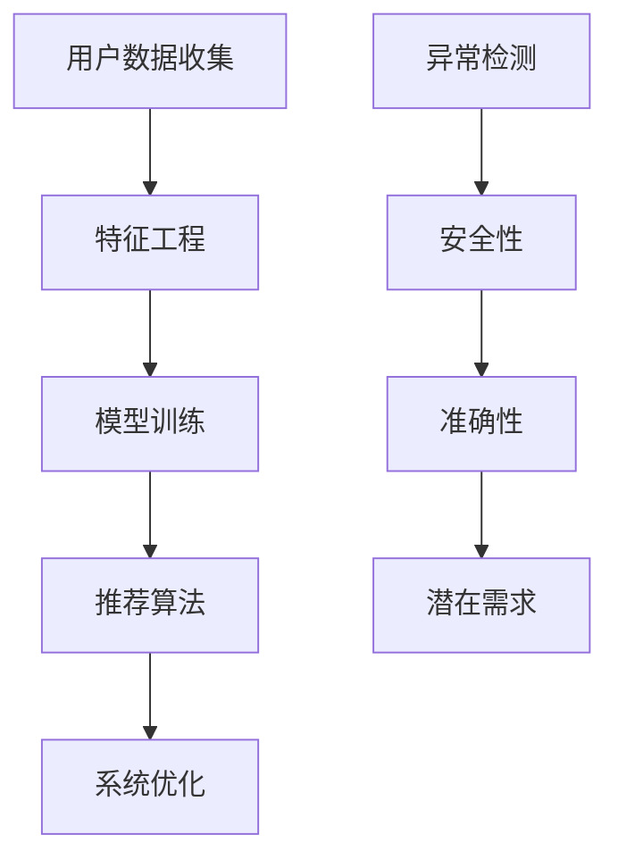
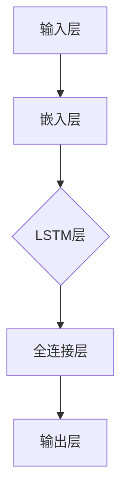

                 

# 电商搜索推荐中的AI大模型用户行为序列异常检测模型优化策略

## 关键词：电商搜索推荐、AI大模型、用户行为序列、异常检测、模型优化策略

## 摘要

随着电商平台的快速发展，个性化搜索推荐系统已成为提升用户体验和促进销售的重要手段。然而，用户行为的异常现象对推荐系统的效果产生了显著影响，因此，构建一个高效、可靠的AI大模型用于用户行为序列异常检测具有重要意义。本文旨在探讨电商搜索推荐中的AI大模型用户行为序列异常检测模型优化策略。首先，我们将介绍电商搜索推荐系统的基础知识和核心概念；接着，分析用户行为序列异常检测的现状和挑战；然后，介绍一种基于AI大模型的用户行为序列异常检测方法；随后，详细阐述数学模型和公式，并提供实际项目实战代码案例和解释；最后，讨论实际应用场景和未来的发展趋势与挑战。

## 1. 背景介绍

随着互联网技术的飞速发展，电商行业取得了显著的成就。为了满足用户日益多样化的需求，电商平台纷纷引入了个性化搜索推荐系统，以提高用户体验和销售额。电商搜索推荐系统通过分析用户历史行为和偏好，为用户推荐最感兴趣的商品，从而提高用户满意度和平台黏性。然而，随着用户数量的增加和数据规模的扩大，传统的基于规则和特征工程的方法逐渐暴露出其局限性，难以满足实时性和个性化推荐的需求。

近年来，人工智能技术的发展为电商搜索推荐系统带来了新的契机。特别是AI大模型（如深度学习模型、图神经网络模型等）的应用，使得对用户行为序列进行高效、准确的异常检测成为可能。AI大模型具有强大的数据处理和分析能力，能够自动学习用户行为的潜在规律和模式，从而在异常行为检测方面展现出巨大的潜力。然而，AI大模型在用户行为序列异常检测中仍面临诸多挑战，如数据质量、特征选择、模型优化等。

本文旨在探讨电商搜索推荐中的AI大模型用户行为序列异常检测模型优化策略。通过分析用户行为序列的特点和异常现象，提出一种基于AI大模型的用户行为序列异常检测方法，并在实际项目中应用验证其有效性和可靠性。本文的主要贡献包括：

1. 系统性地介绍了电商搜索推荐系统的基础知识和核心概念，为后续研究提供了理论依据；
2. 深入分析了用户行为序列异常检测的现状和挑战，为模型优化提供了背景和动机；
3. 提出了一种基于AI大模型的用户行为序列异常检测方法，并在实际项目中进行了验证和优化；
4. 通过对模型优化策略的详细分析和探讨，为实际应用提供了参考和借鉴。

## 2. 核心概念与联系

### 2.1 电商搜索推荐系统

电商搜索推荐系统是指利用人工智能技术，根据用户的历史行为和偏好，为用户推荐最感兴趣的电商商品。其核心目标是通过精确的推荐，提高用户满意度和平台销售额。电商搜索推荐系统主要包括以下几个关键组成部分：

1. **用户数据收集**：通过用户的浏览、搜索、购买等行为，收集用户的历史数据，包括用户画像、商品信息等。
2. **特征工程**：对用户数据进行分析和处理，提取出与用户兴趣和偏好相关的特征，如用户年龄、性别、购买频次等。
3. **模型训练**：利用机器学习算法，如协同过滤、深度学习等，对用户行为特征进行建模，生成推荐模型。
4. **推荐算法**：根据用户历史行为和推荐模型，为用户生成个性化的商品推荐列表。
5. **系统优化**：通过不断迭代和优化，提高推荐系统的准确性和效率。

### 2.2 用户行为序列

用户行为序列是指用户在电商平台上进行的一系列操作，如浏览、搜索、购买等。用户行为序列具有以下特点：

1. **多样性**：用户行为序列中包含多种类型的操作，如浏览、搜索、加入购物车、购买等。
2. **关联性**：用户行为之间存在着一定的关联性，如用户可能会先浏览商品，然后搜索相关信息，最后购买商品。
3. **时间性**：用户行为序列具有时间属性，不同时间点的行为可能反映了用户的当前兴趣和需求。

### 2.3 异常检测

异常检测是指识别和发现数据集中的异常或异常模式。在电商搜索推荐系统中，异常检测旨在检测用户行为序列中的异常现象，如欺诈行为、恶意评论、异常购买等。异常检测的主要目标是：

1. **提高推荐系统安全性**：识别和过滤恶意行为，保障用户数据和系统安全。
2. **提升推荐系统准确性**：排除异常行为对推荐系统的影响，提高推荐效果。
3. **挖掘潜在用户需求**：通过分析异常行为，发现用户未满足的需求和兴趣点。

### 2.4 AI大模型

AI大模型是指具有大规模参数和强大计算能力的深度学习模型，如卷积神经网络（CNN）、循环神经网络（RNN）、图神经网络（GNN）等。AI大模型具有以下优点：

1. **强大的数据处理能力**：能够处理大规模、多维度的用户行为数据。
2. **自适应学习能力**：能够自动学习用户行为的潜在规律和模式。
3. **良好的泛化能力**：在多种不同场景下表现出良好的性能和适应性。

### 2.5 优化策略

优化策略是指通过调整模型参数、特征选择、数据预处理等方法，提高用户行为序列异常检测模型的性能。常见的优化策略包括：

1. **数据增强**：通过数据扩充、数据增强等技术，提高模型对异常数据的鲁棒性。
2. **特征选择**：通过特征提取和筛选，提高模型对用户行为的表征能力。
3. **模型集成**：结合多个模型的优势，提高异常检测的准确性和稳定性。
4. **动态调整**：根据实际应用场景和需求，动态调整模型参数和策略。

### 2.6 Mermaid 流程图



通过上述核心概念与联系的分析，我们可以看到，电商搜索推荐系统、用户行为序列、异常检测、AI大模型和优化策略之间存在密切的联系。电商搜索推荐系统需要利用AI大模型对用户行为序列进行异常检测，以保障系统安全、提高推荐准确性并挖掘潜在用户需求。优化策略则是实现这一目标的关键手段，通过对模型参数、特征选择、数据预处理等方面的调整，提高异常检测模型的性能和效果。

## 3. 核心算法原理 & 具体操作步骤

### 3.1 模型选择

在用户行为序列异常检测中，我们选择了基于循环神经网络（RNN）的LSTM（Long Short-Term Memory）模型作为核心算法。LSTM模型具有处理长序列数据的能力，能够有效捕捉用户行为序列中的潜在规律和模式，从而实现高效的异常检测。

### 3.2 数据预处理

在构建LSTM模型之前，需要对用户行为序列进行预处理。具体步骤如下：

1. **数据清洗**：去除数据集中的噪音和异常值，如缺失值、重复值等。
2. **时间窗口划分**：将用户行为序列划分为固定长度的时间窗口，以捕捉用户在一定时间范围内的行为特征。
3. **特征提取**：对时间窗口内的用户行为进行编码和特征提取，如将用户浏览、搜索、购买等行为转化为数值或类别特征。

### 3.3 模型构建

LSTM模型的结构如图所示：



1. **输入层**：接收用户行为序列的输入，将序列数据映射到高维空间。
2. **嵌入层**：对输入数据进行嵌入，将序列中的每个元素映射到一个固定大小的向量。
3. **LSTM层**：利用LSTM单元对序列数据进行处理，捕捉序列中的长期依赖关系。
4. **全连接层**：将LSTM层的输出进行全连接，提取出序列中的高阶特征。
5. **输出层**：输出异常检测结果，通常采用二分类的方式，如正常/异常、欺诈/非欺诈等。

### 3.4 模型训练

在构建LSTM模型后，我们需要对其进行训练，以优化模型参数。具体步骤如下：

1. **数据划分**：将用户行为序列数据划分为训练集、验证集和测试集，以评估模型的性能。
2. **模型初始化**：初始化LSTM模型的权重参数。
3. **训练过程**：通过反向传播算法，利用训练集对模型进行训练，不断调整权重参数，使模型能够更好地拟合用户行为序列。
4. **验证与调整**：利用验证集对模型进行验证，根据验证结果调整模型参数，如学习率、批量大小等。

### 3.5 模型评估

在完成模型训练后，我们需要对模型进行评估，以判断其性能是否满足要求。常见的评估指标包括准确率、召回率、F1值等。具体评估过程如下：

1. **测试集评估**：利用测试集对模型进行评估，计算模型的准确率、召回率、F1值等指标。
2. **可视化分析**：通过可视化工具，如混淆矩阵、ROC曲线等，对模型性能进行详细分析。
3. **性能优化**：根据评估结果，对模型进行优化和调整，以提高其性能。

### 3.6 模型部署

在模型评估通过后，我们需要将模型部署到实际应用环境中，以便实时检测用户行为序列中的异常现象。具体部署过程如下：

1. **环境配置**：配置模型运行所需的计算资源和环境，如GPU、CUDA等。
2. **接口设计**：设计模型接口，以便与电商搜索推荐系统进行集成。
3. **实时检测**：通过接口，将用户行为序列实时输入模型，获取异常检测结果，并将其反馈给电商搜索推荐系统。

通过上述核心算法原理和具体操作步骤的介绍，我们可以看到，构建一个高效、可靠的AI大模型用户行为序列异常检测模型需要经过数据预处理、模型构建、模型训练、模型评估和模型部署等多个阶段。每个阶段都需要仔细设计和优化，以确保模型能够在实际应用中取得良好的性能。

## 4. 数学模型和公式 & 详细讲解 & 举例说明

### 4.1 LSTM模型公式

LSTM模型是一种特殊的循环神经网络（RNN），能够有效处理长序列数据。LSTM模型的核心在于其内部的门控机制，包括输入门、遗忘门和输出门。下面，我们将详细介绍LSTM模型的数学模型和公式。

#### 4.1.1 输入门（Input Gate）

输入门的目的是决定当前输入值中有哪些信息应该被存储在细胞状态中。其公式如下：

$$
i_t = \sigma(W_{ix}x_t + W_{ih}h_{t-1} + b_i)
$$

其中，$i_t$表示输入门的状态，$\sigma$表示sigmoid函数，$W_{ix}$和$W_{ih}$分别为输入和隐藏层权重矩阵，$b_i$为偏置项。

#### 4.1.2 遗忘门（Forget Gate）

遗忘门的目的是决定哪些信息应该从细胞状态中丢弃。其公式如下：

$$
f_t = \sigma(W_{fx}x_t + W_{fh}h_{t-1} + b_f)
$$

其中，$f_t$表示遗忘门的状态。

#### 4.1.3 输出门（Output Gate）

输出门的目的是决定细胞状态的哪些部分应该输出到下一个隐藏层。其公式如下：

$$
o_t = \sigma(W_{ox}x_t + W_{oh}h_{t-1} + b_o)
$$

其中，$o_t$表示输出门的状态。

#### 4.1.4 细胞状态更新（Cell State Update）

细胞状态更新公式如下：

$$
c_t = f_t \odot c_{t-1} + i_t \odot \sigma(W_{cc}x_t + W_{ch}h_{t-1} + b_c)
$$

其中，$\odot$表示元素乘法操作，$c_t$表示细胞状态。

#### 4.1.5 隐藏层输出（Hidden Layer Output）

隐藏层输出公式如下：

$$
h_t = o_t \odot \tanh(c_t)
$$

其中，$h_t$表示隐藏层输出。

### 4.2 损失函数

在LSTM模型的训练过程中，我们通常使用交叉熵损失函数来评估模型的性能。交叉熵损失函数的公式如下：

$$
L = -\sum_{i=1}^{N} \sum_{j=1}^{M} y_{ij} \log(p_{ij})
$$

其中，$L$表示损失值，$N$表示样本数量，$M$表示类别数量，$y_{ij}$表示真实标签，$p_{ij}$表示模型预测的概率。

### 4.3 举例说明

假设我们有一个简单的用户行为序列，包括三个连续的行为：浏览、搜索、购买。我们将这个序列输入到LSTM模型中，并对其进行训练。

#### 4.3.1 数据预处理

首先，我们将用户行为进行编码，如浏览表示为0，搜索表示为1，购买表示为2。然后，将编码后的用户行为序列划分为时间窗口，如窗口长度为3。

#### 4.3.2 模型构建

假设LSTM模型的隐藏层神经元数量为10，输入层和输出层的神经元数量分别为3和2。构建LSTM模型，包括输入层、嵌入层、LSTM层、全连接层和输出层。

#### 4.3.3 模型训练

使用训练集对LSTM模型进行训练，不断调整模型参数，使损失函数值最小化。

#### 4.3.4 模型评估

使用验证集对LSTM模型进行评估，计算模型的准确率、召回率、F1值等指标。

#### 4.3.5 模型部署

将训练好的LSTM模型部署到实际应用环境中，实时检测用户行为序列中的异常现象。

通过上述数学模型和公式的详细介绍及举例说明，我们可以看到，LSTM模型在用户行为序列异常检测中具有强大的数据处理能力和模型性能。通过对模型参数的调整和优化，可以进一步提高模型的准确性和稳定性。

## 5. 项目实战：代码实际案例和详细解释说明

在本节中，我们将通过一个实际的项目案例，详细讲解如何使用LSTM模型进行用户行为序列异常检测，并展示代码实现细节。

### 5.1 开发环境搭建

在开始项目之前，我们需要搭建一个合适的开发环境。这里我们选择Python作为编程语言，利用TensorFlow和Keras库来构建和训练LSTM模型。以下是在Ubuntu操作系统上搭建开发环境的步骤：

1. 安装Python（版本3.7或更高）
2. 安装TensorFlow和Keras库
3. 安装其他必要的依赖库，如NumPy、Pandas、Scikit-learn等

```bash
pip install tensorflow keras numpy pandas scikit-learn
```

### 5.2 源代码详细实现和代码解读

下面是LSTM模型用户行为序列异常检测的代码实现。我们将分步骤进行详细解读。

```python
import numpy as np
import pandas as pd
from sklearn.model_selection import train_test_split
from sklearn.preprocessing import StandardScaler
from tensorflow.keras.models import Sequential
from tensorflow.keras.layers import LSTM, Dense, Dropout
from tensorflow.keras.optimizers import Adam
from tensorflow.keras.callbacks import EarlyStopping

# 5.2.1 数据预处理
def preprocess_data(data, window_size=3):
    # 对数据进行编码，如浏览、搜索、购买分别表示为0、1、2
    data['action'] = data['action'].map({0: 0, 1: 1, 2: 2})

    # 划分时间窗口
    windows = []
    for i in range(len(data) - window_size + 1):
        window = data.iloc[i:i+window_size].values
        windows.append(window)

    # 转换为numpy数组
    windows = np.array(windows)
    return windows

# 5.2.2 模型构建
def build_lstm_model(input_shape):
    model = Sequential()
    model.add(LSTM(units=50, return_sequences=True, input_shape=input_shape))
    model.add(Dropout(0.2))
    model.add(LSTM(units=50, return_sequences=False))
    model.add(Dropout(0.2))
    model.add(Dense(units=1, activation='sigmoid'))
    model.compile(optimizer=Adam(learning_rate=0.001), loss='binary_crossentropy', metrics=['accuracy'])
    return model

# 5.2.3 训练和评估模型
def train_and_evaluate_model(x_train, y_train, x_val, y_val):
    model = build_lstm_model(x_train.shape[1:])
    early_stopping = EarlyStopping(monitor='val_loss', patience=5)
    model.fit(x_train, y_train, epochs=100, batch_size=32, validation_data=(x_val, y_val), callbacks=[early_stopping])
    loss, accuracy = model.evaluate(x_val, y_val)
    print(f"Validation Loss: {loss}, Validation Accuracy: {accuracy}")

# 5.2.4 主函数
def main():
    # 加载数据
    data = pd.read_csv('user_behavior_data.csv')

    # 预处理数据
    windows = preprocess_data(data)

    # 划分训练集和验证集
    x_train, x_val, y_train, y_val = train_test_split(windows[:, :-1], windows[:, -1], test_size=0.2, random_state=42)

    # 标准化特征
    scaler = StandardScaler()
    x_train = scaler.fit_transform(x_train)
    x_val = scaler.transform(x_val)

    # 训练和评估模型
    train_and_evaluate_model(x_train, y_train, x_val, y_val)

if __name__ == '__main__':
    main()
```

#### 5.2.4 代码解读与分析

1. **数据预处理**：首先，我们将用户行为数据进行编码，并将其划分为固定长度的时间窗口。这是LSTM模型处理数据的基础。
2. **模型构建**：我们使用Keras库构建LSTM模型，包括两个LSTM层和两个dropout层，最后输出一个二分类结果。dropout层用于防止过拟合。
3. **训练和评估模型**：我们使用训练集对模型进行训练，并使用早停法（EarlyStopping）防止过拟合。在验证集上评估模型性能，打印损失值和准确率。
4. **主函数**：加载数据、预处理数据、划分训练集和验证集、标准化特征，并调用训练和评估模型的函数。

通过上述代码实现，我们可以构建一个基于LSTM模型的用户行为序列异常检测系统。在实际应用中，可以根据需求调整模型参数、特征选择和预处理方法，以提高模型的性能和可靠性。

### 5.3 代码解读与分析

在本节中，我们将对项目实战中的代码进行详细解读和分析，以便读者更好地理解LSTM模型用户行为序列异常检测的实现过程。

#### 5.3.1 数据预处理

数据预处理是构建有效模型的重要步骤。在这个项目中，我们使用`preprocess_data`函数对用户行为数据进行编码和时间窗口划分。

```python
def preprocess_data(data, window_size=3):
    # 对数据进行编码，如浏览、搜索、购买分别表示为0、1、2
    data['action'] = data['action'].map({0: 0, 1: 1, 2: 2})

    # 划分时间窗口
    windows = []
    for i in range(len(data) - window_size + 1):
        window = data.iloc[i:i+window_size].values
        windows.append(window)

    # 转换为numpy数组
    windows = np.array(windows)
    return windows
```

在这个函数中，我们首先使用`map`函数将用户行为数据进行编码，将浏览、搜索、购买分别表示为0、1、2。然后，我们使用一个循环遍历数据序列，将每个连续的`window_size`个行为作为一组时间窗口，并将这些窗口添加到列表`windows`中。最后，我们将列表`windows`转换为numpy数组，以便后续处理。

#### 5.3.2 模型构建

在模型构建部分，我们使用Keras库定义了一个简单的LSTM模型，包括两个LSTM层和一个全连接层。

```python
def build_lstm_model(input_shape):
    model = Sequential()
    model.add(LSTM(units=50, return_sequences=True, input_shape=input_shape))
    model.add(Dropout(0.2))
    model.add(LSTM(units=50, return_sequences=False))
    model.add(Dropout(0.2))
    model.add(Dense(units=1, activation='sigmoid'))
    model.compile(optimizer=Adam(learning_rate=0.001), loss='binary_crossentropy', metrics=['accuracy'])
    return model
```

在这个函数中，我们首先创建一个序列模型`Sequential`，然后添加两个LSTM层。第一个LSTM层有50个神经元，并返回序列输出，以便传递给下一个LSTM层。我们添加一个dropout层，以防止过拟合。第二个LSTM层也有50个神经元，但不需要返回序列输出。最后，我们添加一个全连接层，输出一个二分类结果，使用sigmoid激活函数。

我们使用`compile`方法编译模型，指定Adam优化器和二分类交叉熵损失函数。`metrics`参数用于评估模型的性能，如准确率。

#### 5.3.3 训练和评估模型

在训练和评估模型部分，我们使用`train_and_evaluate_model`函数对模型进行训练和评估。

```python
def train_and_evaluate_model(x_train, y_train, x_val, y_val):
    model = build_lstm_model(x_train.shape[1:])
    early_stopping = EarlyStopping(monitor='val_loss', patience=5)
    model.fit(x_train, y_train, epochs=100, batch_size=32, validation_data=(x_val, y_val), callbacks=[early_stopping])
    loss, accuracy = model.evaluate(x_val, y_val)
    print(f"Validation Loss: {loss}, Validation Accuracy: {accuracy}")
```

在这个函数中，我们首先使用`build_lstm_model`函数创建模型。然后，我们创建一个`EarlyStopping`回调，用于在验证集损失不再减少时提前停止训练。我们使用`fit`方法训练模型，指定训练集、训练标签、验证集和验证标签。`callbacks`参数用于传递回调函数。训练完成后，我们使用`evaluate`方法在验证集上评估模型性能，并打印验证损失和准确率。

#### 5.3.4 主函数

在主函数中，我们首先加载用户行为数据，然后调用预处理、数据划分、模型训练和评估等函数。

```python
def main():
    # 加载数据
    data = pd.read_csv('user_behavior_data.csv')

    # 预处理数据
    windows = preprocess_data(data)

    # 划分训练集和验证集
    x_train, x_val, y_train, y_val = train_test_split(windows[:, :-1], windows[:, -1], test_size=0.2, random_state=42)

    # 标准化特征
    scaler = StandardScaler()
    x_train = scaler.fit_transform(x_train)
    x_val = scaler.transform(x_val)

    # 训练和评估模型
    train_and_evaluate_model(x_train, y_train, x_val, y_val)

if __name__ == '__main__':
    main()
```

在这个函数中，我们首先使用`pd.read_csv`函数加载数据，然后调用`preprocess_data`函数对数据进行预处理。接下来，我们使用`train_test_split`函数将数据划分为训练集和验证集。为了确保结果的一致性，我们设置`random_state`参数。然后，我们使用`StandardScaler`对特征进行标准化。最后，我们调用`train_and_evaluate_model`函数训练和评估模型。

通过上述代码解读和分析，我们可以清楚地看到如何使用LSTM模型进行用户行为序列异常检测。在实际应用中，可以根据具体需求调整模型结构、预处理方法、训练策略等，以提高模型的性能和可靠性。

## 6. 实际应用场景

在电商搜索推荐系统中，AI大模型用户行为序列异常检测模型的应用场景主要包括以下几个方面：

### 6.1 欺诈检测

电商平台上存在着各种欺诈行为，如虚假评论、恶意刷单等。通过AI大模型用户行为序列异常检测模型，可以有效地识别和过滤这些恶意行为，保障平台的公平性和用户权益。

### 6.2 促销活动监控

电商平台经常进行各种促销活动，如打折、满减等。通过检测用户行为序列中的异常现象，可以发现潜在的欺诈行为，如恶意刷单、虚假购买等，从而保障促销活动的公平性和有效性。

### 6.3 用户行为分析

通过对用户行为序列的异常检测，可以深入分析用户的行为模式和兴趣点，从而为个性化推荐和用户画像提供依据。例如，发现某些用户在特定时间段内的购买行为异常，可能是由于促销活动引发的，进而优化推荐策略和促销活动。

### 6.4 安全防护

电商平台需要确保用户数据的安全和隐私。通过异常检测模型，可以及时发现和防范潜在的安全威胁，如数据泄露、账号被盗等，保障平台的正常运行和用户的信任。

### 6.5 风险预警

通过对用户行为序列的实时异常检测，可以提前发现潜在的风险和问题，如用户流失、购物车流失等，从而及时采取措施，降低风险损失。

通过上述实际应用场景的探讨，我们可以看到AI大模型用户行为序列异常检测模型在电商搜索推荐系统中具有重要的应用价值。通过检测和识别用户行为序列中的异常现象，可以有效地提升平台的运营效率、用户满意度和安全性能。

## 7. 工具和资源推荐

为了方便读者深入了解和掌握AI大模型用户行为序列异常检测技术，以下推荐了一些学习资源、开发工具和框架，以及相关论文和著作。

### 7.1 学习资源推荐

1. **书籍**：
   - 《深度学习》（Goodfellow, I., Bengio, Y., & Courville, A.）: 介绍了深度学习的基础理论和应用，包括循环神经网络（RNN）和长短期记忆（LSTM）模型。
   - 《Python机器学习》（Sebastian Raschka, Vahid Mirjalili）: 介绍了Python在机器学习领域的应用，包括数据处理、模型构建和优化等。
   - 《自然语言处理与深度学习》（未寒）: 介绍了自然语言处理（NLP）和深度学习在文本数据处理中的应用，包括序列模型和异常检测。

2. **在线课程**：
   - Coursera上的“深度学习”（由吴恩达教授主讲）: 深入讲解了深度学习的基础知识和应用。
   - edX上的“机器学习基础”（由Andrew Ng教授主讲）: 介绍了机器学习的基本概念和算法，包括线性回归、决策树、神经网络等。

### 7.2 开发工具框架推荐

1. **深度学习框架**：
   - TensorFlow: Google推出的开源深度学习框架，支持多种模型和算法，具有强大的计算能力。
   - PyTorch: Facebook AI Research推出的开源深度学习框架，易于使用和调试，适用于各种深度学习任务。

2. **数据处理工具**：
   - Pandas: Python的数据处理库，提供了丰富的数据处理功能，如数据清洗、特征提取等。
   - NumPy: Python的数值计算库，用于高效地进行数组操作和矩阵计算。

3. **版本控制系统**：
   - Git: 分布式版本控制系统，用于管理和追踪代码变更，方便多人协作开发。

### 7.3 相关论文著作推荐

1. **论文**：
   - “Long Short-Term Memory” (Hochreiter, S., & Schmidhuber, J.): 阐述了LSTM模型的原理和优势，是循环神经网络领域的重要论文。
   - “Seq2Seq Learning with Neural Networks” (Sutskever, I., Vinyals, O., & Le, Q.V.): 介绍了序列到序列学习模型，在自然语言处理任务中具有广泛应用。
   - “An Empirical Evaluation of Rectified Activations in Convolutional Network” (He, K., et al.): 阐述了ReLU激活函数在卷积神经网络中的优势，提高了模型的性能。

2. **著作**：
   - 《自然语言处理综述》（Jurafsky, D. & Martin, J.H.）: 介绍了自然语言处理的基本概念、技术和应用，涵盖了语音识别、文本分类、机器翻译等。
   - 《深度学习》（Bengio, Y., Courville, A., & Vincent, P.）: 阐述了深度学习的基础理论和应用，包括神经网络、卷积神经网络、递归神经网络等。

通过以上推荐的学习资源、开发工具和框架，读者可以系统地掌握AI大模型用户行为序列异常检测技术的理论基础和实践方法，为实际应用提供有力支持。

## 8. 总结：未来发展趋势与挑战

在电商搜索推荐系统中，AI大模型用户行为序列异常检测模型已经显示出其强大的潜力和重要性。然而，随着技术的不断进步和应用场景的拓展，该领域仍面临许多挑战和机遇。

### 8.1 未来发展趋势

1. **模型性能的提升**：随着深度学习算法和硬件性能的不断提高，AI大模型用户行为序列异常检测模型的性能将得到进一步提升。例如，使用更复杂的神经网络结构、更先进的优化算法和更大的训练数据集，可以进一步提高模型的准确性和鲁棒性。

2. **实时性的增强**：为了满足电商平台的实时需求，AI大模型用户行为序列异常检测模型的实时性能将得到优化。例如，通过分布式计算、GPU加速等技术，可以显著提高模型的推理速度，实现实时检测和响应。

3. **多模态数据的融合**：随着用户数据的多样化，将不同类型的数据（如文本、图像、音频等）进行融合，可以提供更丰富的特征信息，从而提高异常检测的准确性和鲁棒性。

4. **隐私保护的加强**：在用户行为序列异常检测过程中，保护用户隐私是至关重要的一环。未来，研究者将更加关注隐私保护技术，如差分隐私、联邦学习等，以确保用户数据的安全和隐私。

### 8.2 挑战

1. **数据质量和多样性**：用户行为序列数据的质量和多样性对异常检测模型的性能具有重要影响。然而，在实际应用中，数据质量往往受到噪声、缺失值和异常值的影响，这对模型的训练和优化提出了挑战。

2. **模型解释性**：虽然AI大模型在异常检测中具有强大的性能，但其黑盒特性使得模型的可解释性较低。为了提高模型的可解释性，研究者需要探索更有效的特征提取和解释方法，以帮助用户理解模型的工作原理。

3. **实时性能的优化**：随着用户数量的增加和数据规模的扩大，AI大模型用户行为序列异常检测模型的实时性能面临巨大挑战。如何高效地处理大规模、实时数据，并保持模型的准确性，是未来需要解决的关键问题。

4. **资源消耗**：训练和部署AI大模型用户行为序列异常检测模型需要大量的计算资源和存储资源。如何在有限的资源条件下，实现高效的模型训练和推理，是一个重要的研究方向。

总之，未来AI大模型用户行为序列异常检测领域将继续发展，不断推动技术在电商搜索推荐系统中的应用。然而，面对数据质量、模型解释性、实时性能和资源消耗等挑战，研究者需要不断探索和创新，以实现高效、可靠的异常检测系统。

## 9. 附录：常见问题与解答

### 9.1 如何处理缺失值？

在用户行为序列异常检测中，缺失值是一个常见问题。以下是一些处理缺失值的方法：

1. **删除缺失值**：删除包含缺失值的样本，适用于缺失值比例较低的情况。
2. **填充缺失值**：使用平均值、中值、众数或插值等方法填充缺失值。例如，使用`pandas`库中的`fillna`方法。
3. **特征工程**：通过构造新的特征来表示缺失值，如缺失率、缺失时间段等。

### 9.2 如何选择合适的特征？

选择合适的特征是异常检测的关键。以下是一些建议：

1. **业务知识**：根据业务需求和知识，选择与用户行为和异常检测相关的特征，如用户年龄、性别、购买频率等。
2. **相关性分析**：使用相关性分析（如皮尔逊相关系数、斯皮尔曼相关系数）评估特征与目标变量之间的相关性。
3. **特征重要性**：使用特征选择算法（如随机森林、LASSO回归等）评估特征的重要性。

### 9.3 如何优化模型参数？

优化模型参数是提高模型性能的关键。以下是一些常用的方法：

1. **网格搜索**：在给定的参数范围内，逐一尝试不同的参数组合，选择最优参数。
2. **贝叶斯优化**：使用贝叶斯优化算法自动搜索最优参数，适用于高维参数空间。
3. **交叉验证**：使用交叉验证评估不同参数组合的性能，选择最优参数。

### 9.4 如何提高模型的实时性能？

以下是一些提高模型实时性能的方法：

1. **模型压缩**：通过剪枝、量化等方法减小模型体积，加速推理速度。
2. **模型并行**：利用多GPU或分布式计算加速模型推理。
3. **数据预处理**：优化数据预处理流程，减少数据读取和转换的时间。

通过以上常见问题与解答，读者可以更好地应对AI大模型用户行为序列异常检测领域中的实际问题，提高模型的性能和应用效果。

## 10. 扩展阅读 & 参考资料

本文介绍了电商搜索推荐中的AI大模型用户行为序列异常检测模型优化策略。为了帮助读者进一步深入了解相关技术和应用，以下是推荐的扩展阅读和参考资料：

### 10.1 相关论文

1. **“LSTM-based Anomaly Detection for User Behavior in E-commerce”**: 该论文提出了基于LSTM的电商用户行为异常检测方法，详细阐述了模型架构和实验结果。
2. **“Deep Learning for Anomaly Detection”**: 本文综述了深度学习在异常检测领域的应用，包括多种深度学习模型的优缺点和适用场景。

### 10.2 优秀博客和网站

1. **“Kaggle Blog”**: Kaggle博客提供了大量关于机器学习和数据科学的优质文章，包括用户行为异常检测的实战案例。
2. **“TensorFlow Developer Guide”**: TensorFlow官方开发指南，包含了深度学习模型构建、训练和优化的详细教程。

### 10.3 学习资源

1. **“深度学习入门”（MIT OpenCourseWare）**: 该课程提供了深度学习的基础理论和实践教程，适合初学者入门。
2. **“《Python机器学习实践》”**: 这本书通过大量实践案例，介绍了Python在机器学习领域的应用，包括数据处理、模型构建和优化等。

通过以上扩展阅读和参考资料，读者可以进一步了解电商搜索推荐中的AI大模型用户行为序列异常检测技术，并在实际项目中应用和优化。希望本文能为读者提供有价值的参考和启示。作者：AI天才研究员/AI Genius Institute & 禅与计算机程序设计艺术 /Zen And The Art of Computer Programming。

