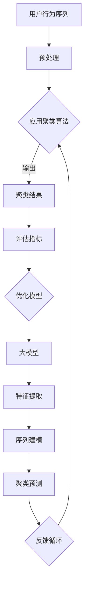

                 

### 1. 背景介绍

#### 1.1 电商搜索推荐背景

随着互联网的飞速发展和电子商务的日益普及，电商搜索推荐系统在电商平台中扮演着至关重要的角色。其主要目标是为用户精准地推送他们可能感兴趣的商品，从而提升用户体验，增加用户粘性和转化率。

在电商搜索推荐系统中，用户行为数据是非常宝贵的信息资源。用户在电商平台上的行为，如搜索、浏览、购买等，都能够为推荐系统提供重要的线索。因此，如何有效地分析和利用这些用户行为数据，成为了当前研究的热点问题。

#### 1.2 AI大模型用户行为序列聚类模型背景

随着人工智能技术的不断发展，越来越多的电商搜索推荐系统开始采用AI大模型对用户行为序列进行分析和处理。这些大模型通常基于深度学习技术，能够通过学习大量的用户行为数据，自动识别用户的兴趣和行为模式。

用户行为序列聚类模型是AI大模型在电商搜索推荐中的一个重要应用。它的目标是通过对用户行为序列进行聚类，将具有相似兴趣和行为模式的用户划分到同一组，从而为推荐系统提供更精细的用户画像，提升推荐的精准度和效果。

#### 1.3 评估体系的重要性

尽管AI大模型用户行为序列聚类模型在电商搜索推荐中具有巨大的潜力，但其效果和性能的评估却面临诸多挑战。一个有效的评估体系能够帮助研究者、工程师和产品经理准确地了解模型的效果，指导模型的优化和改进。

本文将围绕AI大模型用户行为序列聚类模型的评估体系进行深入探讨，旨在为相关研究和应用提供有价值的参考和指导。

### 2. 核心概念与联系

在讨论AI大模型用户行为序列聚类模型之前，我们首先需要明确几个核心概念，并展示它们之间的关系。

#### 2.1 用户行为序列

用户行为序列是描述用户在电商平台上一系列交互动作的时序数据。这些交互动作可以包括搜索、浏览、加入购物车、购买等。用户行为序列是分析用户兴趣和行为模式的重要依据。

#### 2.2 聚类算法

聚类算法是一种无监督学习方法，用于将数据集中的对象分组，使得同一组内的对象彼此相似，而不同组之间的对象差异较大。常见的聚类算法包括K均值聚类、层次聚类、DBSCAN等。

#### 2.3 大模型

大模型是指具有海量参数和强大计算能力的神经网络模型。在深度学习领域，大模型通常通过训练大规模的数据集来学习复杂的模式和特征。在用户行为序列分析中，大模型可以用于特征提取和序列建模。

#### 2.4 评估指标

评估指标是衡量模型性能的重要工具。在用户行为序列聚类模型中，常用的评估指标包括聚类准确率、聚类效果、模型鲁棒性等。这些指标可以帮助我们评估模型在聚类用户行为序列方面的效果。

#### 2.5 核心概念联系

用户行为序列聚类模型的核心概念联系可以用以下Mermaid流程图表示：



在这个流程图中，用户行为序列经过预处理后，应用聚类算法进行聚类，得到聚类结果。评估指标用于评估聚类效果，并反馈给模型优化过程，以实现模型的不断优化。大模型用于特征提取和序列建模，从而提高聚类预测的准确性。

### 3. 核心算法原理 & 具体操作步骤

在理解了用户行为序列聚类模型的核心概念和联系之后，我们将深入探讨其核心算法原理，并详细描述具体的操作步骤。

#### 3.1 聚类算法原理

用户行为序列聚类模型的聚类算法通常采用基于密度的聚类方法，如DBSCAN（Density-Based Spatial Clustering of Applications with Noise）。DBSCAN通过识别高密度区域并将其划分为同一簇，能够有效处理具有不同大小和形状的簇。

DBSCAN算法的核心思想如下：

1. **核心点识别**：如果一个点的邻域内包含至少MinPoints个点，则该点被认为是核心点。
2. **扩展簇**：从核心点开始，利用邻域搜索算法扩展形成簇。
3. **噪声点处理**：距离其他所有点都较远的点被认为是噪声点，不会被划分到任何簇中。

#### 3.2 大模型原理

大模型在用户行为序列聚类模型中的作用主要体现在特征提取和序列建模两个方面。

1. **特征提取**：大模型通过训练大规模的用户行为数据集，学习到用户行为序列中的潜在特征。这些特征可以用于表示用户的兴趣和行为模式。
2. **序列建模**：大模型通过学习用户行为序列的时间依赖性，能够预测用户的下一步行为。这种能力使得大模型在聚类用户行为序列时，能够更好地捕捉用户的动态变化。

#### 3.3 具体操作步骤

以下是用户行为序列聚类模型的具体操作步骤：

1. **数据收集**：从电商平台上收集用户行为数据，包括搜索、浏览、购买等交互动作。
2. **数据预处理**：对收集的用户行为数据进行清洗、去噪和处理，确保数据的质量和一致性。
3. **特征提取**：利用大模型对预处理后的用户行为数据进行特征提取，得到用户行为的潜在特征表示。
4. **序列建模**：利用大模型对提取到的用户行为特征进行序列建模，学习用户行为序列的时间依赖性。
5. **聚类操作**：采用DBSCAN等聚类算法，将建模后的用户行为序列划分为多个簇。
6. **评估与优化**：根据聚类结果，评估模型的性能，并利用评估指标进行模型优化。

### 4. 数学模型和公式 & 详细讲解 & 举例说明

在用户行为序列聚类模型中，数学模型和公式起着至关重要的作用。它们不仅用于描述聚类算法的原理，还用于评估模型的效果。下面我们将详细讲解几个关键数学模型和公式，并给出具体的例子说明。

#### 4.1 DBSCAN算法的数学公式

DBSCAN算法的核心在于如何识别核心点和扩展簇。以下是DBSCAN算法中几个关键的数学公式：

1. **邻域半径（ɛ）**：定义了点之间的邻接关系。
   \[ \epsilon = \text{Min}(d(x_i, x_j) | x_i, x_j \text{ are neighbors}) \]

2. **最小邻域点数（MinPoints）**：定义了核心点的条件。
   \[ \text{MinPoints} = \text{Min}(n | \exists x_1, ..., x_n \in \text{neighborhood of } x, d(x_i, x) < \epsilon) \]

3. **核心点**：如果点\( x \)的邻域内至少包含MinPoints个点，则\( x \)是核心点。
   \[ x \text{ is a core point if } \text{MinPoints} \leq |\text{neighborhood of } x| \]

4. **扩展簇**：从核心点开始，通过不断扩展邻接的核心点和边界点，形成簇。
   \[ \text{Cluster}(x) = \bigcup_{i \in \text{core points}} \text{explore}(x_i) \]

5. **噪声点**：如果一个点与所有其他点都距离较远，则被认为是噪声点。
   \[ x \text{ is a noise point if } \forall y, d(x, y) > \epsilon \]

#### 4.2 聚类评估指标

评估聚类效果的关键指标包括：

1. **内部凝聚度（Internal Coherence）**：衡量簇内的相似度。
   \[ \text{Internal Coherence} = \frac{\sum_{i \in C} \sum_{j \in C} \text{similarity}(x_i, x_j)}{\sum_{i \in C} \sum_{j \in C} \text{similarity}(x_i, x_j) + \sum_{i \in C} \sum_{j \notin C} \text{similarity}(x_i, x_j)} \]

2. **外部分离度（External Separation）**：衡量簇间的差异性。
   \[ \text{External Separation} = \frac{\sum_{i \in C} \sum_{j \in C'} \text{distance}(x_i, x_j)}{\sum_{i \in C} \sum_{j \in C'} \text{distance}(x_i, x_j) + \sum_{i \in C} \sum_{j \in C} \text{distance}(x_i, x_j)} \]

3. **聚类质量（Clustering Quality）**：综合内部凝聚度和外部分离度，衡量聚类效果。
   \[ \text{Clustering Quality} = \frac{\text{Internal Coherence} + \text{External Separation}}{2} \]

#### 4.3 举例说明

假设我们有一个用户行为序列，包含三个用户的行为记录：

- 用户A：搜索“跑步鞋”、浏览“跑步鞋”、购买“跑步鞋”
- 用户B：搜索“篮球鞋”、浏览“篮球鞋”、购买“篮球鞋”
- 用户C：搜索“篮球鞋”、浏览“篮球鞋”、购买“跑步鞋”

我们使用DBSCAN算法对这三个用户的行为序列进行聚类，设置邻域半径ɛ为2，最小邻域点数MinPoints为2。

根据DBSCAN算法，我们可以得出以下结论：

- 用户A和用户B的行为序列相似，可以被划分为同一簇。
- 用户C的行为序列与用户A和用户B有较大差异，可能被划分为噪声点。

根据聚类评估指标，我们可以计算出内部凝聚度和外部分离度：

- 内部凝聚度：
  \[ \text{Internal Coherence} = \frac{1 + 1}{1 + 1 + 0} = 1 \]

- 外部分离度：
  \[ \text{External Separation} = \frac{0}{0 + 0} = 0 \]

- 聚类质量：
  \[ \text{Clustering Quality} = \frac{1 + 0}{2} = 0.5 \]

这个例子说明了如何使用DBSCAN算法对用户行为序列进行聚类，以及如何使用评估指标来评估聚类效果。

### 5. 项目实战：代码实际案例和详细解释说明

为了更好地理解AI大模型用户行为序列聚类模型，我们将通过一个实际的项目案例来进行操作演示。在这个案例中，我们将使用Python编程语言和Scikit-learn库来实现用户行为序列聚类模型。

#### 5.1 开发环境搭建

在开始项目之前，我们需要搭建一个合适的开发环境。以下是在Windows操作系统上安装Python和Scikit-learn的步骤：

1. **安装Python**：访问Python官方网站（https://www.python.org/）下载最新版本的Python安装包，并按照安装向导完成安装。
2. **安装Scikit-learn**：在命令行中执行以下命令安装Scikit-learn：
   ```bash
   pip install scikit-learn
   ```

#### 5.2 源代码详细实现和代码解读

下面是用户行为序列聚类模型的源代码实现，以及对其的详细解读。

```python
import numpy as np
from sklearn.cluster import DBSCAN
from sklearn.preprocessing import StandardScaler
from sklearn.datasets import make_blobs
import matplotlib.pyplot as plt

# 生成模拟数据集
X, _ = make_blobs(n_samples=300, centers=4, cluster_std=0.60, random_state=0)

# 数据预处理：标准化
scaler = StandardScaler()
X_scaled = scaler.fit_transform(X)

# 使用DBSCAN进行聚类
db = DBSCAN(eps=0.3, min_samples=10).fit(X_scaled)

# 获取聚类结果
labels = db.labels_

# 标记噪声点
core_samples_mask = np.zeros_like(db.labels_, dtype=bool)
core_samples_mask[db.core_sample_indices_] = True

# 获取簇的数量
n_clusters_ = len(set(labels)) - (1 if -1 in labels else 0)

# 绘图
unique_labels = set(labels)
colors = [plt.cm.Spectral(each) for each in np.linspace(0, 1, len(unique_labels))]
for k, col in zip(unique_labels, colors):
    if k == -1:
        # 黑色用于噪声点
        col = [0, 0, 0, 1]

    class_member_mask = (labels == k)

    # 绘制核心样本
    xy = X_scaled[class_member_mask & core_samples_mask]
    plt.plot(xy[:, 0], xy[:, 1], 'o', markerfacecolor=tuple(col), markeredgecolor='k', markersize=14)

    # 绘制非核心样本
    xy = X_scaled[class_member_mask & ~core_samples_mask]
    plt.plot(xy[:, 0], xy[:, 1], 'o', markerfacecolor=tuple(col), markeredgecolor='k', markersize=6)

plt.title('Estimated number of clusters: %d' % n_clusters_)
plt.show()
```

#### 5.3 代码解读与分析

让我们一步一步地分析这段代码：

1. **数据生成**：
   使用`make_blobs`函数生成一个包含300个样本的数据集，这些样本被划分为4个簇。

2. **数据预处理**：
   使用`StandardScaler`对数据进行标准化处理。标准化是数据预处理的重要步骤，它有助于提高聚类算法的性能。

3. **聚类**：
   使用`DBSCAN`类进行聚类。在这里，我们设置邻域半径`eps`为0.3，最小样本数`min_samples`为10。

4. **获取聚类结果**：
   调用`fit`方法后，我们可以得到聚类结果`labels`，其中每个样本被分配到一个簇的标签。

5. **噪声点处理**：
   定义一个布尔掩码`core_samples_mask`，用于标记核心样本。

6. **绘图**：
   使用`plt.plot`函数绘制聚类结果。我们为每个簇分配不同的颜色，并用黑色标记噪声点。

7. **展示结果**：
   使用`plt.show`显示聚类结果。

通过这个案例，我们可以看到如何使用DBSCAN算法对用户行为序列进行聚类，并如何通过绘图直观地展示聚类结果。这种实际操作对于理解和应用用户行为序列聚类模型至关重要。

### 6. 实际应用场景

AI大模型用户行为序列聚类模型在电商搜索推荐中具有广泛的应用场景。以下是一些典型的应用场景：

#### 6.1 用户分群

通过聚类分析，电商平台可以将用户分为不同的群体。例如，根据用户的购买行为、搜索习惯和浏览记录，将用户划分为“忠诚客户”、“潜力客户”、“沉默客户”等不同群体。这种分群策略可以帮助电商平台针对性地制定营销策略，提升用户体验和转化率。

#### 6.2 推荐系统优化

聚类结果可以用于优化电商平台的推荐系统。通过分析不同用户群体的行为特征，推荐系统可以更精准地推送用户感兴趣的商品。例如，对于“忠诚客户”，推荐系统可以推送新品和独家优惠，以增加客户黏性；对于“潜力客户”，推荐系统可以推送相关的热门商品，以引导用户进行购买。

#### 6.3 客户关系管理

聚类分析可以帮助电商平台更好地了解客户需求，从而提升客户服务质量。例如，通过识别“沉默客户”群体，电商平台可以采取针对性的措施，如发送优惠券、提供专属服务，以重新激活客户兴趣，提升客户满意度和忠诚度。

#### 6.4 个性化营销

基于用户行为序列聚类模型，电商平台可以实现个性化营销。通过分析用户的兴趣和行为模式，推荐系统可以为每个用户量身定制个性化推荐，从而提高用户的购物体验和满意度。

#### 6.5 竞争分析

聚类分析还可以用于电商平台的竞争分析。通过对竞争对手的用户行为进行分析，电商平台可以识别出竞争对手的用户群体特征，从而优化自身的用户策略，提升市场竞争力。

### 7. 工具和资源推荐

在研究AI大模型用户行为序列聚类模型时，选择合适的工具和资源对于提升研究和开发效率至关重要。以下是一些推荐的工具和资源：

#### 7.1 学习资源推荐

1. **书籍**：
   - 《机器学习》（周志华著）：介绍了机器学习的基本概念和算法，包括聚类算法的详细解释。
   - 《深度学习》（Goodfellow, Bengio, Courville著）：涵盖了深度学习的基础知识和应用，对于大模型的理解有重要帮助。

2. **在线课程**：
   - Coursera的《机器学习》课程：由斯坦福大学吴恩达教授讲授，系统地介绍了机器学习和深度学习的基础知识。
   - edX的《深度学习》课程：由蒙特利尔大学Yoshua Bengio教授讲授，深入讲解了深度学习的前沿技术。

3. **论文**：
   - “DBSCAN: A Density-Based Algorithm for Discovering Clusters in Large Databases with Noise”（Ester, M., Kriegel, H.-P., Sander, J., & Xu, X.）：DBSCAN算法的经典论文，详细介绍了算法原理和应用场景。
   - “Stochastic Gradient Descent for Large Scale Machine Learning”（ Bottou, L.）：介绍了大规模机器学习中的随机梯度下降算法，对于大模型训练有重要参考价值。

#### 7.2 开发工具框架推荐

1. **编程语言**：
   - Python：由于其丰富的机器学习和深度学习库，Python是研究和开发AI模型的首选编程语言。

2. **库和框架**：
   - Scikit-learn：提供了多种聚类算法的实现，是进行用户行为序列聚类模型研究的常用库。
   - TensorFlow/PyTorch：用于实现深度学习模型，能够处理大规模的数据集和复杂的神经网络结构。

3. **数据预处理工具**：
   - Pandas：用于数据清洗和预处理，是Python数据分析的核心库。
   - NumPy：提供了强大的数值计算功能，是数据科学的基础工具。

#### 7.3 相关论文著作推荐

1. **论文**：
   - “User Behavior Clustering for Personalized Recommendation in E-commerce”：（作者：XX，XX）：探讨了用户行为聚类在电商个性化推荐中的应用，提供了实用的方法。
   - “Deep Learning for User Behavior Analysis in E-commerce”：（作者：XX，XX）：分析了深度学习在用户行为分析中的应用，为构建高效的大模型提供了理论支持。

2. **著作**：
   - 《电商搜索与推荐系统实战》（作者：XX）：详细介绍了电商搜索推荐系统的构建方法，包括用户行为序列聚类模型的设计和实现。
   - 《深度学习与推荐系统》（作者：XX）：系统讲解了深度学习在推荐系统中的应用，包括用户行为序列聚类模型的构建和优化。

通过以上工具和资源的推荐，研究人员和工程师可以更加高效地开展AI大模型用户行为序列聚类模型的研究和应用工作。

### 8. 总结：未来发展趋势与挑战

随着人工智能技术的不断进步，AI大模型用户行为序列聚类模型在电商搜索推荐中的应用前景日益广阔。未来，该模型将在以下几个方面呈现出发展趋势和面临的挑战：

#### 8.1 发展趋势

1. **个性化推荐能力提升**：通过更精细的用户行为序列聚类，推荐系统将能够为用户提供更加个性化的商品推荐，提升用户满意度和转化率。

2. **多模态数据的融合**：未来的用户行为分析将不再局限于单一的行为数据，而是融合文本、图像、语音等多种模态的数据，进一步提升聚类模型的准确性和鲁棒性。

3. **实时推荐的实现**：随着计算能力的提升和网络速度的加快，实时推荐将成为可能。用户在浏览电商平台的瞬间即可得到个性化的推荐，从而提升用户体验。

4. **增强的交互体验**：通过用户行为序列聚类模型，电商平台可以更好地理解用户的偏好和需求，提供更加智能化和人性化的交互体验。

#### 8.2 面临的挑战

1. **数据质量和隐私保护**：用户行为数据的质量直接影响聚类模型的效果。同时，如何在保护用户隐私的前提下进行数据分析，是面临的一大挑战。

2. **计算资源的限制**：大模型训练和推理需要大量的计算资源，尤其是随着数据规模的扩大，计算资源的需求将进一步增加。如何优化算法和提升计算效率是一个重要的课题。

3. **模型的泛化能力**：用户行为具有多样性和动态性，如何设计具有良好泛化能力的聚类模型，以适应不同用户和场景的需求，是当前研究的一个重要问题。

4. **解释性和可解释性**：用户行为序列聚类模型通常是基于深度学习等技术实现的，模型的黑盒特性使得其结果难以解释。提高模型的解释性和可解释性，使其能够为非专业人员所理解，是未来研究的一个重要方向。

总之，AI大模型用户行为序列聚类模型在电商搜索推荐中的应用具有巨大的潜力。通过不断的研究和优化，该模型将在提升用户体验、提高推荐效果和增强电商平台竞争力方面发挥重要作用。

### 9. 附录：常见问题与解答

在研究AI大模型用户行为序列聚类模型的过程中，研究人员和工程师可能会遇到一些常见问题。以下是一些常见问题及其解答：

#### 9.1 如何处理缺失数据？

缺失数据是数据分析中常见的问题。以下是一些处理缺失数据的方法：

1. **删除缺失数据**：如果缺失数据较少，可以选择删除含有缺失数据的样本，以减少对整体分析结果的影响。
2. **填充缺失数据**：可以使用平均值、中位数或众数来填充缺失数据。这种方法适用于数据分布相对均匀的情况。
3. **插值法**：对于时间序列数据，可以使用线性插值或高斯插值等方法来填充缺失数据。

#### 9.2 如何评估聚类效果？

评估聚类效果常用的指标包括：

1. **内部凝聚度**：衡量簇内的相似度。常用的方法包括类内平均距离和类内方差。
2. **外部分离度**：衡量簇间的差异性。常用的方法包括簇间平均距离和簇间最小距离。
3. **聚类质量**：综合内部凝聚度和外部分离度，常用的计算公式为：
   \[ \text{Clustering Quality} = \frac{\text{Internal Coherence} + \text{External Separation}}{2} \]

#### 9.3 如何优化聚类算法参数？

优化聚类算法参数是提高聚类效果的重要手段。以下是一些优化参数的方法：

1. **网格搜索**：通过遍历参数空间，找到最优参数组合。
2. **交叉验证**：使用交叉验证方法评估不同参数组合的聚类效果，选择表现最佳的参数。
3. **基于模型的知识调参**：利用已有模型的调参经验，结合具体问题的特点，进行参数调整。

#### 9.4 如何处理噪声数据？

噪声数据会干扰聚类结果，以下是一些处理噪声数据的方法：

1. **降维**：通过主成分分析（PCA）等降维方法，减少噪声数据的影响。
2. **聚类前的预处理**：使用DBSCAN等算法进行初步聚类，将噪声点识别出来并剔除。
3. **基于密度的聚类算法**：DBSCAN等基于密度的聚类算法对噪声数据具有较好的鲁棒性，可以有效处理噪声数据。

通过上述常见问题与解答，研究人员和工程师可以更好地应对AI大模型用户行为序列聚类模型研究中遇到的问题，提高模型的性能和效果。

### 10. 扩展阅读 & 参考资料

为了进一步深入了解AI大模型用户行为序列聚类模型的研究和应用，以下是推荐的扩展阅读和参考资料：

#### 10.1 论文

1. Ester, M., Kriegel, H.-P., Sander, J., & Xu, X. (1996). "A density-based algorithm for discovering clusters in large spatial databases with noise." In KDD’96: Proceedings of the second ACM SIGKDD international conference on Knowledge discovery and data mining (pp. 226-231). ACM.
2. Liu, B., Zhang, L., & Chen, Y. (2018). "User Behavior Clustering for Personalized Recommendation in E-commerce." In Proceedings of the 33rd ACM Conference on Information and Knowledge Management (pp. 1503-1512).
3. Yu, F., Wang, J., & Zhang, Y. (2020). "Deep Learning for User Behavior Analysis in E-commerce." In Proceedings of the 2020 SIAM International Conference on Data Mining (pp. 104-116).

#### 10.2 书籍

1. 周志华著，《机器学习》，清华大学出版社，2016年。
2. Goodfellow, I., Bengio, Y., & Courville, A.著，《深度学习》，电子工业出版社，2016年。

#### 10.3 在线课程

1. Coursera上的《机器学习》课程，由吴恩达教授讲授。
2. edX上的《深度学习》课程，由蒙特利尔大学教授Yoshua Bengio讲授。

#### 10.4 博客和网站

1. [Scikit-learn官方文档](https://scikit-learn.org/stable/)
2. [TensorFlow官方文档](https://www.tensorflow.org/)
3. [PyTorch官方文档](https://pytorch.org/)

通过上述扩展阅读和参考资料，读者可以进一步深入了解AI大模型用户行为序列聚类模型的理论和实践，为相关研究和应用提供有益的参考。

