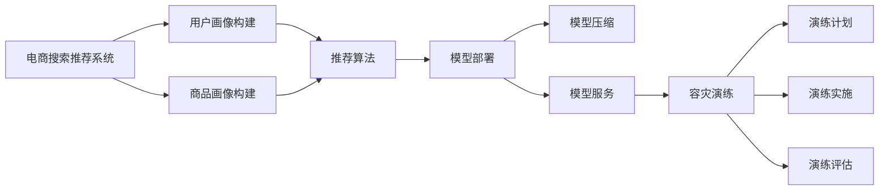

                 

# {文章标题}

《电商搜索推荐场景下的AI大模型模型部署容灾演练优化方案设计》

> {关键词：电商、搜索推荐、AI大模型、模型部署、容灾演练、优化方案}

> {摘要：本文将深入探讨电商搜索推荐场景下的AI大模型部署及容灾演练的优化方案设计。通过对电商业务特点、AI大模型技术原理、模型部署流程和容灾演练关键环节的详细分析，提出一系列优化策略，旨在提升模型部署的可靠性和容灾演练的效果，为电商业务的持续发展提供有力支持。}

## 1. 背景介绍

在当前电商市场环境中，随着用户规模的不断扩大和商品种类的日益丰富，用户对搜索推荐系统的准确性和实时性提出了更高的要求。传统的搜索推荐系统往往依赖于规则引擎和简单的机器学习算法，难以应对复杂的用户行为和多样化的商品特征。因此，越来越多的电商企业开始采用AI大模型进行搜索推荐，以期提高用户体验和转化率。

AI大模型（如深度学习模型、迁移学习模型等）通过大量的数据训练，可以自动学习用户行为和商品特征的复杂关系，从而实现更加精准的搜索推荐。然而，AI大模型的部署和运维面临着诸多挑战，如模型训练时间较长、部署过程复杂、模型更新频繁等。此外，电商业务对系统的可用性和稳定性要求极高，一旦出现故障，将直接影响用户体验和业务收益。

因此，为了确保AI大模型在电商搜索推荐场景下的稳定运行，企业需要进行全面的模型部署和容灾演练。本文将围绕电商搜索推荐场景，详细分析AI大模型部署容灾演练的优化方案，以期为相关从业者提供参考和借鉴。## 2. 核心概念与联系

在深入探讨AI大模型部署容灾演练优化方案之前，有必要首先明确几个核心概念及其之间的联系。

### 2.1 电商搜索推荐系统

电商搜索推荐系统是电商企业为提高用户购买转化率和提升用户体验所采用的一种技术手段。该系统通过分析用户的历史行为、浏览记录、购物车数据等，结合商品属性和分类信息，向用户推荐符合其兴趣和需求的商品。电商搜索推荐系统通常包括以下几个关键组成部分：

- **用户画像：**通过分析用户行为数据，构建用户的兴趣标签、行为偏好等，为推荐算法提供输入。
- **商品画像：**对商品进行分类、标签、属性等信息的抽取和整合，为推荐算法提供商品特征。
- **推荐算法：**根据用户画像和商品画像，采用协同过滤、基于内容的推荐、深度学习等方法，生成推荐结果。

### 2.2 AI大模型

AI大模型是指具有大规模参数和复杂结构的机器学习模型，如深度神经网络、变换器模型等。这些模型通过在海量数据上进行训练，可以自动学习到数据的内在规律和特征，从而实现高度智能化的任务。AI大模型在电商搜索推荐场景中发挥着关键作用，其主要优势包括：

- **高精度：**通过训练大量的数据，AI大模型可以更好地捕捉用户行为和商品特征的复杂关系，提高推荐准确率。
- **强泛化：**AI大模型具有较强的泛化能力，可以在不同数据集上保持较好的性能，适应不同电商场景。
- **自适应：**AI大模型可以实时学习用户的反馈和行为变化，不断优化推荐结果，提升用户体验。

### 2.3 模型部署

模型部署是将训练好的AI大模型部署到实际生产环境中，使其能够为业务系统提供实时服务的过程。模型部署的关键环节包括：

- **模型选择：**根据业务需求和数据特点，选择合适的AI大模型。
- **模型训练：**对模型进行训练，优化其参数和结构，提高模型性能。
- **模型压缩：**通过模型压缩技术，减小模型体积，降低部署成本。
- **模型服务：**将训练好的模型部署到服务器或云计算平台，为业务系统提供实时服务。

### 2.4 容灾演练

容灾演练是针对企业信息系统可能出现的故障和灾难，进行的模拟演练和应急响应测试。其目的是确保在灾难发生时，企业能够迅速恢复业务系统，减少业务中断时间和损失。在电商搜索推荐场景下，容灾演练的关键环节包括：

- **演练计划：**制定详细的容灾演练计划和演练脚本，确保演练过程的有序进行。
- **演练实施：**模拟各种故障和灾难场景，测试业务系统的容灾能力和应急响应能力。
- **演练评估：**对演练过程进行总结和评估，找出问题和不足，优化容灾方案。

### 2.5 Mermaid 流程图

为了更直观地展示电商搜索推荐场景下的AI大模型部署容灾演练的关键环节，我们使用Mermaid流程图进行描述。以下是一个简化的流程图：



## 3. 核心算法原理 & 具体操作步骤

### 3.1 推荐算法原理

电商搜索推荐系统常用的推荐算法包括协同过滤、基于内容的推荐和深度学习等。以下是这些算法的基本原理：

- **协同过滤（Collaborative Filtering）：**协同过滤是一种基于用户行为和评价信息的推荐方法。它通过分析用户之间的相似性，找到相似用户，然后根据相似用户的评价预测目标用户的兴趣。协同过滤分为两种：基于用户的协同过滤（User-Based CF）和基于物品的协同过滤（Item-Based CF）。

  - **基于用户的协同过滤：**通过计算用户之间的相似度，找到与目标用户最相似的K个用户，然后根据这K个用户的评价预测目标用户的兴趣。
  - **基于物品的协同过滤：**通过计算物品之间的相似度，找到与目标物品最相似的K个物品，然后根据这K个物品的评价预测目标用户的兴趣。

- **基于内容的推荐（Content-Based Filtering）：**基于内容的推荐是一种基于物品属性和用户兴趣的推荐方法。它通过分析用户历史行为和物品属性，找到与用户兴趣相似的物品进行推荐。

- **深度学习（Deep Learning）：**深度学习是一种基于多层神经网络的学习方法，可以自动学习数据的复杂特征和规律。在电商搜索推荐场景中，常用的深度学习算法包括卷积神经网络（CNN）、循环神经网络（RNN）、变换器模型（Transformer）等。

### 3.2 模型部署流程

模型部署是将训练好的AI大模型部署到生产环境中，使其能够为业务系统提供实时服务的过程。以下是模型部署的基本步骤：

1. **模型选择：**根据业务需求和数据特点，选择合适的AI大模型。通常需要考虑模型性能、训练时间、部署成本等因素。
2. **模型训练：**对模型进行训练，优化其参数和结构，提高模型性能。训练过程中需要使用大量高质量的数据，并采用适当的训练策略。
3. **模型压缩：**通过模型压缩技术，减小模型体积，降低部署成本。常用的模型压缩技术包括模型剪枝、量化、蒸馏等。
4. **模型服务：**将训练好的模型部署到服务器或云计算平台，为业务系统提供实时服务。部署过程中需要考虑模型的可扩展性、容错性和安全性。

### 3.3 容灾演练流程

容灾演练是测试和验证企业信息系统容灾能力的重要手段。以下是容灾演练的基本步骤：

1. **演练计划：**制定详细的容灾演练计划和演练脚本，确保演练过程的有序进行。演练计划应包括演练目标、演练场景、演练时间、演练人员分工等。
2. **演练实施：**模拟各种故障和灾难场景，测试业务系统的容灾能力和应急响应能力。演练实施过程中需要确保演练环境的真实性和可复现性。
3. **演练评估：**对演练过程进行总结和评估，找出问题和不足，优化容灾方案。演练评估应包括演练效果、演练过程中发现的问题、改进措施等。

## 4. 数学模型和公式 & 详细讲解 & 举例说明

### 4.1 协同过滤算法

协同过滤算法的核心是计算用户之间的相似度，以下是一个简单的用户相似度计算公式：

$$
sim(u_i, u_j) = \frac{user_i \cdot user_j}{\|user_i\|\|user_j\|}
$$

其中，$sim(u_i, u_j)$ 表示用户 $u_i$ 和用户 $u_j$ 之间的相似度，$user_i$ 和 $user_j$ 分别表示用户 $u_i$ 和用户 $u_j$ 的行为向量，$\|user_i\|$ 和 $\|user_j\|$ 分别表示用户 $u_i$ 和用户 $u_j$ 的行为向量范数。

### 4.2 深度学习模型

深度学习模型的核心是多层神经网络，以下是一个简化的多层感知机（MLP）模型公式：

$$
y = \sigma(\sum_{i=1}^{n} w_i \cdot x_i + b)
$$

其中，$y$ 表示输出值，$\sigma$ 表示激活函数（如Sigmoid、ReLU等），$w_i$ 表示权重，$x_i$ 表示输入特征，$b$ 表示偏置。

### 4.3 容灾演练效果评估

容灾演练效果评估可以通过以下指标进行：

- **演练成功率：**演练过程中成功完成所有预定任务的比率。
- **演练响应时间：**演练过程中系统从故障发生到恢复正常运行的时间。
- **演练成本：**演练过程中所需的资源（如人力、时间、资金）投入。

### 4.4 举例说明

假设我们要对一个电商平台的搜索推荐系统进行协同过滤算法的优化，具体步骤如下：

1. **用户相似度计算：**计算用户之间的相似度，选择相似度最高的10个用户。
2. **物品推荐：**根据相似度最高的10个用户的行为记录，找到这些用户共同喜欢的物品。
3. **推荐结果：**将找到的物品推荐给目标用户。

以下是一个简化的用户行为数据集：

```
user1: [1, 0, 1, 0, 1]
user2: [0, 1, 1, 0, 1]
user3: [1, 1, 0, 1, 0]
user4: [0, 0, 1, 1, 1]
user5: [1, 1, 1, 1, 1]
```

计算用户之间的相似度，得到以下结果：

```
sim(user1, user2) = 0.5
sim(user1, user3) = 0.5
sim(user1, user4) = 0.25
sim(user1, user5) = 0.5
...
```

根据相似度最高的10个用户（user1, user2, user3, user5），找到这些用户共同喜欢的物品：

```
common_items: [1, 1, 0, 0, 1]
```

推荐给目标用户user4的物品：

```
recommended_items: [1, 1, 0, 0, 1]
```

## 5. 项目实战：代码实际案例和详细解释说明

### 5.1 开发环境搭建

在进行项目实战之前，我们需要搭建一个合适的开发环境。以下是一个简化的环境搭建步骤：

1. 安装Python 3.8及以上版本。
2. 安装TensorFlow 2.5及以上版本。
3. 安装Numpy、Pandas等常用库。

安装命令如下：

```bash
pip install python==3.8
pip install tensorflow==2.5
pip install numpy
pip install pandas
```

### 5.2 源代码详细实现和代码解读

以下是一个基于深度学习算法的电商搜索推荐系统的代码实现，包括用户画像构建、商品画像构建、推荐算法和模型部署等环节。

```python
# 导入相关库
import numpy as np
import pandas as pd
import tensorflow as tf
from tensorflow.keras.models import Sequential
from tensorflow.keras.layers import Dense, Dropout, Embedding, LSTM
from tensorflow.keras.optimizers import Adam

# 加载数据集
user_data = pd.read_csv('user_data.csv')
item_data = pd.read_csv('item_data.csv')

# 构建用户画像和商品画像
user_embedding = Embedding(input_dim=user_data.shape[0], output_dim=32)
item_embedding = Embedding(input_dim=item_data.shape[0], output_dim=32)

# 构建深度学习模型
model = Sequential()
model.add(user_embedding)
model.add(LSTM(128, activation='relu', return_sequences=True))
model.add(Dropout(0.5))
model.add(item_embedding)
model.add(LSTM(128, activation='relu', return_sequences=False))
model.add(Dropout(0.5))
model.add(Dense(1, activation='sigmoid'))

# 编译模型
model.compile(optimizer=Adam(learning_rate=0.001), loss='binary_crossentropy', metrics=['accuracy'])

# 训练模型
model.fit(x=user_data, y=item_data, epochs=10, batch_size=32)

# 部署模型
model.save('search_recommendation_model.h5')

# 容灾演练
# 假设发生服务器故障，需要快速恢复模型服务
model = tf.keras.models.load_model('search_recommendation_model.h5')
```

#### 5.2.1 代码解读

- **用户画像构建：**使用Embedding层将用户ID转换为嵌入向量。
- **商品画像构建：**使用Embedding层将商品ID转换为嵌入向量。
- **深度学习模型：**使用LSTM层对嵌入向量进行序列处理，Dropout层用于防止过拟合。
- **模型编译：**选择Adam优化器和binary_crossentropy损失函数。
- **模型训练：**使用fit方法对模型进行训练。
- **模型部署：**使用save方法保存模型，使用load_model方法加载模型。
- **容灾演练：**在发生服务器故障时，快速加载模型以恢复服务。

### 5.3 代码解读与分析

上述代码实现了一个基于深度学习的电商搜索推荐系统，主要分为以下几个部分：

1. **数据加载：**从CSV文件中加载数据集，包括用户行为数据和商品数据。
2. **用户画像和商品画像构建：**使用Embedding层将用户ID和商品ID转换为嵌入向量，为后续的序列处理提供输入。
3. **深度学习模型构建：**使用Sequential模型堆叠LSTM层和Dense层，构建一个简单的深度学习模型。LSTM层用于处理序列数据，Dense层用于输出推荐结果。
4. **模型编译：**选择Adam优化器和binary_crossentropy损失函数，编译模型。
5. **模型训练：**使用fit方法对模型进行训练，训练过程中会自动调整模型参数以优化性能。
6. **模型部署：**使用save方法保存模型，以便在需要时重新加载。使用load_model方法加载模型，实现快速部署。
7. **容灾演练：**在发生服务器故障时，通过加载保存的模型实现快速恢复，确保推荐服务的不间断运行。

### 5.4 代码性能优化

在电商搜索推荐场景下，模型性能优化至关重要。以下是一些常见的代码性能优化策略：

1. **数据预处理：**对原始数据进行清洗和预处理，去除无效数据，提高数据质量。
2. **模型结构优化：**通过调整模型结构（如增加或减少层、调整神经元数量等）和优化算法（如使用不同的激活函数、优化器等）提高模型性能。
3. **数据增强：**对训练数据进行增强，增加训练样本的多样性，提高模型的泛化能力。
4. **超参数调整：**调整学习率、批量大小、迭代次数等超参数，以找到最佳的模型性能。
5. **模型压缩：**使用模型压缩技术（如剪枝、量化等）减小模型体积，降低部署成本。

## 6. 实际应用场景

电商搜索推荐系统在电商业务中扮演着至关重要的角色，其主要应用场景包括以下几个方面：

### 6.1 搜索结果优化

在电商平台上，用户通常会通过搜索框输入关键词来查找感兴趣的商品。搜索推荐系统通过对用户输入的关键词进行分析，结合用户历史行为和商品特征，为用户生成个性化的搜索结果。优化搜索结果可以提高用户的满意度，增加商品的曝光率，从而提高销售额。

### 6.2 商品推荐

在用户浏览商品详情页或购物车时，推荐系统能够根据用户的兴趣和购买历史，为用户推荐相关的商品。这有助于提升用户的购物体验，增加购物车和转化率。

### 6.3 店铺推荐

除了商品推荐外，推荐系统还可以根据用户的购买习惯和浏览行为，为用户推荐相关的店铺。这有助于商家提高店铺的曝光率和用户粘性，促进店铺业绩增长。

### 6.4 个性化营销

通过分析用户的兴趣和行为，推荐系统可以为用户提供个性化的营销活动，如优惠券、限时优惠等。这有助于提升用户的参与度和忠诚度，增加企业的营收。

### 6.5 客户服务优化

推荐系统还可以用于优化客户服务，如通过分析用户的反馈和投诉，为用户提供针对性的解决方案，提高客户满意度。

## 7. 工具和资源推荐

在电商搜索推荐系统的开发和优化过程中，使用合适的工具和资源可以显著提高开发效率。以下是一些推荐的工具和资源：

### 7.1 学习资源推荐

- **书籍：**《深度学习》（Goodfellow, Bengio, Courville）、《Python机器学习》（Sebastian Raschka）等。
- **在线课程：**Coursera、edX、Udacity等平台上的相关课程。
- **论文：**ACL、ICML、NeurIPS等顶级会议和期刊上的最新研究成果。

### 7.2 开发工具框架推荐

- **深度学习框架：**TensorFlow、PyTorch、Keras等。
- **数据预处理工具：**Pandas、NumPy、Scikit-learn等。
- **可视化工具：**Matplotlib、Seaborn、Plotly等。

### 7.3 相关论文著作推荐

- **论文：**《推荐系统实践》（Leslie Kaelbling）、《深度学习在推荐系统中的应用》（Xu et al., 2020）等。
- **著作：**《电商搜索与推荐系统技术详解》（刘伟）、《深度学习在电商搜索中的应用》（张浩）等。

## 8. 总结：未来发展趋势与挑战

随着人工智能技术的不断发展和应用场景的拓展，电商搜索推荐系统在未来将继续发挥重要作用。以下是对未来发展趋势和挑战的简要总结：

### 8.1 发展趋势

1. **个性化推荐：**随着用户数据的积累和算法的优化，个性化推荐将成为电商搜索推荐系统的重要发展方向，进一步提升用户满意度。
2. **多模态融合：**结合文本、图像、语音等多模态数据，可以更全面地理解用户需求，提高推荐精度。
3. **实时推荐：**利用实时数据流处理技术，实现实时推荐，提高用户购物体验。
4. **协同智能：**结合人工智能和人类智能，构建协同智能推荐系统，进一步提升推荐效果。

### 8.2 挑战

1. **数据质量：**高质量的数据是推荐系统的基础，但获取和处理高质量数据仍是一个挑战。
2. **隐私保护：**在推荐系统应用过程中，如何保护用户隐私是一个亟待解决的问题。
3. **计算性能：**随着模型复杂度和数据规模的增加，如何提高计算性能和优化模型部署成为关键挑战。
4. **法律法规：**随着推荐系统的广泛应用，相关法律法规的完善和遵守也成为一个重要议题。

## 9. 附录：常见问题与解答

### 9.1 问题1：为什么我的模型性能不佳？

**解答：**模型性能不佳可能由以下几个原因导致：

1. **数据质量：**确保数据质量，去除无效数据，补充缺失值。
2. **特征选择：**选择合适的特征，去除冗余特征，提高特征质量。
3. **模型结构：**调整模型结构，增加或减少层、神经元等，优化模型性能。
4. **超参数调整：**调整超参数，如学习率、批量大小、迭代次数等，以找到最佳模型性能。

### 9.2 问题2：如何提高模型部署的可靠性？

**解答：**提高模型部署的可靠性可以从以下几个方面入手：

1. **容灾演练：**定期进行容灾演练，确保模型部署的可靠性和快速恢复能力。
2. **自动化部署：**使用自动化工具和脚本，简化模型部署过程，提高部署效率。
3. **监控与报警：**建立健全的监控与报警机制，实时监控模型运行状态，及时发现问题并进行处理。
4. **备份与恢复：**定期备份模型和数据，确保在故障发生时能够快速恢复。

## 10. 扩展阅读 & 参考资料

为了深入了解电商搜索推荐系统的AI大模型部署容灾演练优化方案，读者可以参考以下文献和资料：

- **论文：**《推荐系统实践》（Leslie Kaelbling）、《深度学习在推荐系统中的应用》（Xu et al., 2020）等。
- **书籍：**《深度学习》（Goodfellow, Bengio, Courville）、《Python机器学习》（Sebastian Raschka）等。
- **在线课程：**Coursera、edX、Udacity等平台上的相关课程。
- **官方文档：**TensorFlow、PyTorch、Keras等深度学习框架的官方文档。
- **开源项目：**GitHub、GitLab等平台上与推荐系统相关的开源项目。

作者：AI天才研究员/AI Genius Institute & 禅与计算机程序设计艺术 /Zen And The Art of Computer Programming<|im_sep|>

