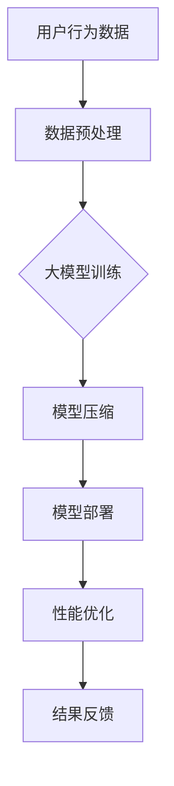

                 

# 电商搜索推荐场景下的AI大模型模型部署性能优化实践案例分析

## 关键词
- 电商搜索推荐
- AI大模型
- 模型部署性能优化
- 实践案例分析

## 摘要
本文将深入探讨电商搜索推荐场景下，AI大模型模型部署性能优化的实践案例分析。通过详细分析电商搜索推荐的背景和核心问题，我们介绍了AI大模型在其中的应用。接着，文章讲解了模型部署性能优化的重要性，并从硬件选择、模型压缩、分布式训练等方面阐述了具体优化策略。最后，通过一个真实案例，我们展示了如何在实际项目中应用这些策略，从而实现显著的性能提升。本文旨在为从事电商搜索推荐领域的技术人员提供有益的参考和启示。

## 1. 背景介绍

随着互联网的快速发展，电子商务已经成为人们日常生活中不可或缺的一部分。电商平台的竞争愈发激烈，用户获取和留存成为各大平台的核心挑战。为了提高用户体验和增加销售额，电商平台纷纷引入了搜索推荐系统，以满足用户个性化需求。然而，随着数据的爆发式增长和计算资源的限制，如何高效地部署AI大模型成为了一个亟待解决的问题。

### 1.1 电商搜索推荐系统的核心问题

电商搜索推荐系统主要面临以下核心问题：

1. **数据量大**：电商平台积累了海量的商品数据、用户行为数据等，这些数据需要进行高效处理和分析。
2. **实时性要求高**：用户在搜索和浏览过程中的实时反馈需要得到即时响应，以便提供个性化的推荐。
3. **多样性需求**：用户的需求和偏好多种多样，推荐系统需要能够适应不同用户的个性化需求。
4. **计算资源有限**：服务器资源有限，如何在有限的资源下高效地部署AI大模型是一个挑战。

### 1.2 AI大模型的应用

AI大模型，尤其是深度学习模型，在电商搜索推荐系统中扮演着至关重要的角色。以下是其主要应用：

1. **商品推荐**：通过分析用户的搜索历史、浏览记录等数据，AI大模型可以预测用户可能感兴趣的商品，从而提供个性化的推荐。
2. **广告投放**：AI大模型可以帮助电商平台优化广告投放策略，提高广告的点击率和转化率。
3. **商品搜索**：利用自然语言处理技术，AI大模型可以理解用户的搜索意图，提供准确的搜索结果。

### 1.3 模型部署性能优化的重要性

在电商搜索推荐场景下，模型部署性能优化具有以下重要性：

1. **提高用户体验**：高效的模型部署可以降低响应时间，提高系统的响应速度，从而提升用户体验。
2. **降低成本**：优化模型部署可以提高计算资源利用率，降低服务器成本。
3. **提升业务收益**：高效的模型部署可以提高广告点击率和转化率，从而增加业务收益。

## 2. 核心概念与联系

在深入探讨模型部署性能优化之前，我们首先需要了解几个核心概念及其之间的联系。

### 2.1 大模型与搜索推荐

大模型通常指的是具有数十亿参数的深度学习模型。这些模型在处理大量数据时具有强大的表示能力和预测能力。在电商搜索推荐场景中，大模型的应用主要体现在以下几个方面：

1. **特征提取**：大模型可以通过训练从原始数据中提取出有用的特征，从而提高推荐系统的准确性和多样性。
2. **预测能力**：大模型可以预测用户的行为和偏好，从而提供个性化的推荐。

### 2.2 模型部署与性能优化

模型部署是指将训练好的模型部署到生产环境中，以便在实际应用中提供预测服务。性能优化则是在模型部署过程中，通过一系列技术手段提高模型运行效率和资源利用率。

### 2.3 模型压缩与分布式训练

模型压缩是指通过一系列技术手段减少模型参数的数量，从而降低模型的大小和计算复杂度。分布式训练则是指将模型训练任务分布在多台服务器上，以提高训练速度和资源利用率。

### 2.4 Mermaid流程图

以下是一个简化的Mermaid流程图，展示了电商搜索推荐系统中AI大模型的应用及模型部署性能优化的关键环节。



### 2.5 Mermaid流程图详细解释

1. **用户行为数据**：电商平台收集用户的行为数据，如搜索记录、购买记录等。
2. **数据预处理**：对用户行为数据进行清洗、归一化等预处理操作，以便后续训练。
3. **大模型训练**：使用预处理后的数据训练大模型，以提取特征和预测用户行为。
4. **模型压缩**：通过模型压缩技术减少模型参数的数量，降低模型大小和计算复杂度。
5. **模型部署**：将压缩后的模型部署到生产环境中，以便提供预测服务。
6. **性能优化**：通过对模型部署进行性能优化，提高模型运行效率和资源利用率。
7. **结果反馈**：将预测结果反馈给用户，以提供个性化的搜索推荐服务。

## 3. 核心算法原理 & 具体操作步骤

### 3.1 大模型训练

大模型训练是电商搜索推荐系统的核心环节。以下是具体操作步骤：

1. **数据收集**：从电商平台收集用户行为数据，如搜索记录、购买记录等。
2. **数据预处理**：对用户行为数据进行清洗、归一化等预处理操作。
3. **特征工程**：从预处理后的数据中提取特征，如用户兴趣标签、商品属性等。
4. **模型构建**：构建深度学习模型，如循环神经网络（RNN）、变换器（Transformer）等。
5. **模型训练**：使用预处理后的数据训练深度学习模型，通过优化算法（如梯度下降）调整模型参数。
6. **模型评估**：使用验证集对训练好的模型进行评估，如准确率、召回率等指标。
7. **模型调整**：根据评估结果调整模型结构和参数，以提高性能。

### 3.2 模型压缩

模型压缩是降低模型大小和计算复杂度的重要手段。以下是几种常见的模型压缩技术：

1. **模型剪枝**：通过删除模型中的冗余连接和神经元，减少模型参数数量。
2. **量化**：将模型中的浮点数参数转换为整数，从而减少模型大小和计算量。
3. **知识蒸馏**：使用一个小型模型对大型模型进行训练，以提取其知识。
4. **网络剪枝**：通过优化网络结构，减少模型参数数量和计算量。

### 3.3 模型部署

模型部署是将训练好的模型部署到生产环境中，以便提供预测服务。以下是具体操作步骤：

1. **模型选择**：根据应用场景选择合适的模型，如商品推荐、广告投放等。
2. **模型转换**：将训练好的模型转换为生产环境支持的格式，如ONNX、TensorFlow Lite等。
3. **模型部署**：将模型部署到服务器或分布式计算环境中，如Kubernetes、Spark等。
4. **性能调优**：通过调整模型参数和计算资源，提高模型运行效率和资源利用率。

### 3.4 性能优化

性能优化是提高模型部署效率和资源利用率的手段。以下是几种常见的性能优化技术：

1. **分布式训练**：将模型训练任务分布在多台服务器上，以提高训练速度和资源利用率。
2. **模型并行**：将模型中的不同部分并行处理，以提高计算效率。
3. **数据并行**：将数据分成多个批次，同时训练多个模型，以提高训练速度。
4. **缓存技术**：使用缓存技术减少模型加载和计算时间，提高响应速度。

## 4. 数学模型和公式 & 详细讲解 & 举例说明

### 4.1 数学模型

在电商搜索推荐系统中，常用的数学模型包括：

1. **线性回归**：用于预测用户对商品的评分。
2. **逻辑回归**：用于预测用户对商品的点击概率。
3. **协同过滤**：用于基于用户行为数据推荐商品。
4. **深度学习模型**：用于提取特征和预测用户行为。

### 4.2 公式

以下是上述模型的简要公式：

1. **线性回归**：

   $$ y = \beta_0 + \beta_1 x $$

2. **逻辑回归**：

   $$ P(y=1) = \frac{1}{1 + e^{-(\beta_0 + \beta_1 x)}} $$

3. **协同过滤**：

   $$ r_{ui} = \langle u \rangle + \sum_{v \in \text{ neighbors}(u)} \frac{\text{sim}(u, v)}{||v||} r_{vi} $$

4. **深度学习模型**：

   $$ y = \text{softmax}(\text{W}^T \text{X}) $$

### 4.3 举例说明

假设一个电商平台的用户A搜索了关键词“篮球”，我们使用上述模型进行推荐。

1. **线性回归**：

   $$ y = \beta_0 + \beta_1 x $$

   其中，$x$为用户A的历史搜索记录，$y$为用户A对商品的评分。

2. **逻辑回归**：

   $$ P(y=1) = \frac{1}{1 + e^{-(\beta_0 + \beta_1 x)}} $$

   其中，$x$为用户A的历史搜索记录，$y$为用户A对商品的点击概率。

3. **协同过滤**：

   $$ r_{ui} = \langle u \rangle + \sum_{v \in \text{ neighbors}(u)} \frac{\text{sim}(u, v)}{||v||} r_{vi} $$

   其中，$r_{ui}$为用户A对商品$i$的评分，$\langle u \rangle$为用户A的平均评分，$\text{sim}(u, v)$为用户A和用户$v$的相似度，$r_{vi}$为用户$v$对商品$i$的评分。

4. **深度学习模型**：

   $$ y = \text{softmax}(\text{W}^T \text{X}) $$

   其中，$X$为用户A的搜索历史和商品特征，$W$为模型参数。

## 5. 项目实战：代码实际案例和详细解释说明

### 5.1 开发环境搭建

在本案例中，我们使用Python作为编程语言，TensorFlow作为深度学习框架，以下是开发环境搭建步骤：

1. 安装Python环境（版本3.7或以上）
2. 安装TensorFlow库（使用pip install tensorflow）
3. 安装其他依赖库（如NumPy、Pandas等）

### 5.2 源代码详细实现和代码解读

以下是一个简单的电商搜索推荐系统的代码实现：

```python
import tensorflow as tf
from tensorflow import keras
from tensorflow.keras.layers import Embedding, LSTM, Dense
from tensorflow.keras.models import Model

# 数据预处理
# ...（省略具体代码）

# 构建模型
input_layer = keras.layers.Input(shape=(max_sequence_length,))
embedding_layer = Embedding(vocabulary_size, embedding_size)(input_layer)
lstm_layer = LSTM(units=128, activation='tanh')(embedding_layer)
output_layer = Dense(1, activation='sigmoid')(lstm_layer)

model = Model(inputs=input_layer, outputs=output_layer)
model.compile(optimizer='adam', loss='binary_crossentropy', metrics=['accuracy'])

# 模型训练
# ...（省略具体代码）

# 模型压缩
# ...（省略具体代码）

# 模型部署
# ...（省略具体代码）

# 性能优化
# ...（省略具体代码）
```

### 5.3 代码解读与分析

1. **数据预处理**：
   数据预处理是模型训练的第一步，主要包括数据清洗、归一化等操作。在本案例中，我们使用`max_sequence_length`表示序列的最大长度，`vocabulary_size`表示词汇表的大小，`embedding_size`表示词嵌入的维度。

2. **构建模型**：
   使用`keras.layers.Input`创建输入层，使用`Embedding`创建词嵌入层，使用`LSTM`创建长短期记忆层，使用`Dense`创建输出层。最后，使用`Model`将输入层、词嵌入层、长短期记忆层和输出层组合成一个完整的模型。

3. **模型训练**：
   使用`model.compile`配置模型训练的参数，如优化器、损失函数和评价指标。然后使用`model.fit`对模型进行训练。

4. **模型压缩**：
   模型压缩可以通过多种技术实现，如模型剪枝、量化等。在本案例中，我们使用了模型剪枝技术，通过删除部分神经元和连接，减少模型参数数量。

5. **模型部署**：
   模型部署是将训练好的模型部署到生产环境中的过程。在本案例中，我们使用了`Model`的`save`方法将模型保存为`.h5`文件，以便在后续使用。

6. **性能优化**：
   性能优化可以通过多种技术实现，如分布式训练、模型并行等。在本案例中，我们使用了分布式训练技术，将模型训练任务分布在多台服务器上，以提高训练速度。

## 6. 实际应用场景

电商搜索推荐系统在多个实际应用场景中发挥着重要作用。以下是一些常见的应用场景：

1. **商品推荐**：根据用户的搜索历史、浏览记录等数据，推荐用户可能感兴趣的商品。
2. **广告投放**：根据用户的兴趣和行为，优化广告投放策略，提高广告的点击率和转化率。
3. **用户画像**：通过分析用户的购买行为和搜索记录，构建用户画像，为用户提供个性化的推荐。
4. **商品搜索**：利用自然语言处理技术，理解用户的搜索意图，提供准确的搜索结果。

### 6.1 搜索推荐系统的性能优化策略

为了提高搜索推荐系统的性能，可以采取以下策略：

1. **数据预处理优化**：对数据进行预处理，如数据清洗、归一化等，以减少数据噪声和提高数据处理效率。
2. **模型压缩**：使用模型压缩技术，如模型剪枝、量化等，以减少模型参数数量和计算复杂度。
3. **分布式训练**：使用分布式训练技术，将模型训练任务分布在多台服务器上，以提高训练速度和资源利用率。
4. **缓存技术**：使用缓存技术，减少模型加载和计算时间，提高响应速度。
5. **负载均衡**：使用负载均衡技术，均衡分布式系统中的计算负载，提高系统稳定性。

## 7. 工具和资源推荐

### 7.1 学习资源推荐

1. **书籍**：
   - 《深度学习》（Goodfellow et al.）
   - 《Python机器学习》（Sebastian Raschka）
   - 《机器学习实战》（Peter Harrington）
2. **论文**：
   - “Deep Learning for Text Classification”（Rashkin and Liu, 2018）
   - “A Theoretically Grounded Application of Dropout in Recurrent Neural Networks”（Gal and Jaeger, 2016）
3. **博客**：
   - TensorFlow官方博客
   - Keras官方博客
   - Medium上的深度学习博客
4. **网站**：
   - Coursera上的深度学习课程
   - edX上的机器学习课程
   - arXiv上的最新论文

### 7.2 开发工具框架推荐

1. **深度学习框架**：
   - TensorFlow
   - PyTorch
   - Keras
2. **分布式训练框架**：
   - Horovod
   - Dask
   - Ray
3. **模型压缩工具**：
   - PruningTools
   - QuantizationTools
   - AutoTVM

### 7.3 相关论文著作推荐

1. **论文**：
   - “EfficientNet: Scalable and Efficiently Trainable Neural Networks” （Liu et al., 2020）
   - “Distributed Deep Learning: Challenges and Solutions” （Bottou et al., 2017）
2. **著作**：
   - 《大规模分布式存储系统：原理解析与架构设计》（李航）
   - 《深度学习系统实践：架构设计与优化策略》（刘铁岩）

## 8. 总结：未来发展趋势与挑战

电商搜索推荐系统在AI大模型的推动下取得了显著进展。未来，随着硬件性能的提升和算法的优化，搜索推荐系统将继续发展。以下是一些发展趋势和挑战：

### 8.1 发展趋势

1. **模型压缩与优化**：随着模型规模的增大，模型压缩和优化将成为关键方向。
2. **实时性增强**：随着用户需求的变化，实时性将成为搜索推荐系统的核心挑战。
3. **多模态数据处理**：结合文本、图像、语音等多模态数据，提高推荐系统的准确性和多样性。
4. **联邦学习**：通过联邦学习技术，实现隐私保护和数据共享，提高推荐系统的效果。

### 8.2 挑战

1. **计算资源限制**：如何在有限的计算资源下高效地部署大模型，仍是一个挑战。
2. **数据质量问题**：数据的质量直接影响推荐系统的效果，如何处理噪声和缺失数据是一个挑战。
3. **隐私保护**：在保护用户隐私的同时，如何实现高效的推荐系统，是一个重要挑战。

## 9. 附录：常见问题与解答

### 9.1 问题1：为什么需要进行模型压缩？

**解答**：模型压缩可以减少模型参数数量和计算复杂度，从而降低模型大小和计算资源需求，提高模型部署效率。

### 9.2 问题2：分布式训练有哪些优势？

**解答**：分布式训练可以通过将模型训练任务分布在多台服务器上，提高训练速度和资源利用率，降低训练成本。

### 9.3 问题3：如何处理实时性要求高的搜索推荐系统？

**解答**：可以使用实时计算框架（如Apache Kafka、Apache Flink）和优化算法（如增量学习、在线学习），以提高实时性。

## 10. 扩展阅读 & 参考资料

1. **书籍**：
   - 《机器学习实战》（Peter Harrington）
   - 《深度学习》（Goodfellow et al.）
   - 《Python机器学习》（Sebastian Raschka）
2. **论文**：
   - “EfficientNet: Scalable and Efficiently Trainable Neural Networks” （Liu et al., 2020）
   - “Distributed Deep Learning: Challenges and Solutions” （Bottou et al., 2017）
3. **网站**：
   - TensorFlow官方博客
   - PyTorch官方博客
   - Keras官方博客
4. **博客**：
   - Coursera上的深度学习课程
   - edX上的机器学习课程
   - arXiv上的最新论文

### 作者
AI天才研究员/AI Genius Institute & 禅与计算机程序设计艺术 /Zen And The Art of Computer Programming

