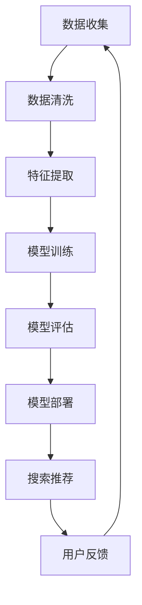

                 

# 电商搜索推荐场景下的AI大模型模型部署混合云方案设计

> **关键词**：电商搜索推荐、AI大模型、混合云部署、性能优化、成本控制

> **摘要**：本文深入探讨电商搜索推荐场景下AI大模型的混合云部署方案。通过对核心概念、算法原理、数学模型、实战案例的详细解析，文章旨在为从业者提供全面的技术指导，助力高效实现大模型的云端部署与优化。

## 1. 背景介绍

### 1.1 电商搜索推荐的现状

随着互联网的快速发展，电子商务已经成为人们日常生活中不可或缺的一部分。电商平台的搜索推荐系统作为用户发现商品、商家获取流量的关键环节，其重要性日益凸显。目前，大多数电商搜索推荐系统采用基于内容推荐、协同过滤、深度学习等技术的组合，以提高推荐的准确性和用户体验。

### 1.2 AI大模型的发展

近年来，随着计算能力的提升和大数据技术的进步，AI大模型在自然语言处理、计算机视觉、语音识别等领域取得了显著的成果。这些大模型能够处理海量数据，提取复杂特征，生成高质量的结果，使得电商搜索推荐系统的性能得到了大幅提升。

### 1.3 混合云部署的兴起

混合云部署作为一种将公有云和私有云相结合的云计算模式，能够充分利用两者的优势，实现灵活的资源调度、高效的性能优化和成本控制。在电商搜索推荐系统中，混合云部署能够为AI大模型的训练和推理提供强大的计算支持和存储资源，从而提升系统的整体性能。

## 2. 核心概念与联系

### 2.1 电商搜索推荐系统

电商搜索推荐系统主要包括用户画像、商品特征、搜索历史、行为数据等数据源。通过构建用户和商品之间的关系模型，系统可以为用户提供个性化的搜索结果和推荐列表。

### 2.2 AI大模型

AI大模型通常是指具有大规模参数、能够处理海量数据的深度学习模型。在电商搜索推荐场景下，大模型可以用于用户行为预测、商品推荐、广告投放等任务。

### 2.3 混合云部署

混合云部署将公有云和私有云资源整合，形成统一的计算和存储资源池。通过智能调度和管理，实现资源的最大化利用和性能的最优化。

### 2.4 Mermaid流程图

以下是一个简化的电商搜索推荐系统AI大模型混合云部署的Mermaid流程图：



## 3. 核心算法原理 & 具体操作步骤

### 3.1 深度学习算法

电商搜索推荐系统中的AI大模型通常采用深度学习算法。以卷积神经网络（CNN）和循环神经网络（RNN）为基础，结合自注意力机制（Attention Mechanism），构建复杂的多层网络结构。

### 3.2 混合云部署流程

#### 3.2.1 数据处理

1. 数据收集：从电商平台上获取用户行为数据、商品信息等。
2. 数据清洗：去除重复、缺失、异常数据，并进行数据预处理。
3. 特征提取：提取用户、商品、行为等特征，并进行特征工程。

#### 3.2.2 模型训练

1. 网络构建：设计并构建适用于电商搜索推荐任务的深度学习模型。
2. 模型训练：使用训练数据集对模型进行训练，并调整模型参数。
3. 模型评估：使用验证数据集评估模型性能，并进行超参数调优。

#### 3.2.3 模型部署

1. 模型保存：将训练好的模型保存为可部署的格式。
2. 模型部署：在混合云环境中部署模型，并配置推理服务。
3. 模型推理：接收用户请求，进行实时搜索推荐。

## 4. 数学模型和公式 & 详细讲解 & 举例说明

### 4.1 深度学习模型

#### 4.1.1 前向传播

$$
\begin{aligned}
    z_1 &= W_1 \cdot x + b_1 \\
    a_1 &= \sigma(z_1) \\
    z_2 &= W_2 \cdot a_1 + b_2 \\
    a_2 &= \sigma(z_2) \\
    &\vdots \\
    z_n &= W_n \cdot a_{n-1} + b_n \\
    a_n &= \sigma(z_n)
\end{aligned}
$$

其中，\( \sigma \)为激活函数，如ReLU、Sigmoid或Tanh。

#### 4.1.2 反向传播

$$
\begin{aligned}
    \delta_n &= (a_n - y) \cdot \frac{d\sigma(z_n)}{dz_n} \\
    \begin{bmatrix}
        \frac{\partial L}{\partial W_n} \\
        \frac{\partial L}{\partial b_n}
    \end{bmatrix} &= \delta_n \cdot a_{n-1}^T \\
    \begin{bmatrix}
        \frac{\partial L}{\partial W_{n-1}} \\
        \frac{\partial L}{\partial b_{n-1}}
    \end{bmatrix} &= \delta_{n-1} \cdot a_{n-2}^T \\
    &\vdots \\
    \begin{bmatrix}
        \frac{\partial L}{\partial W_1} \\
        \frac{\partial L}{\partial b_1}
    \end{bmatrix} &= \delta_1 \cdot x^T
\end{aligned}
$$

其中，\( L \)为损失函数，如交叉熵损失。

### 4.2 混合云资源调度

#### 4.2.1 调度策略

1. **负载均衡**：根据各节点负载情况，动态调整任务分配。
2. **弹性伸缩**：根据业务需求，自动调整资源规模。
3. **优先级调度**：对重要任务给予更高的优先级，确保关键业务稳定运行。

#### 4.2.2 数学模型

假设有\( n \)个节点，每个节点的计算能力和负载分别为\( C_i \)和\( L_i \)。目标是最小化总负载和最大化资源利用率。

$$
\begin{aligned}
    \min \sum_{i=1}^{n} L_i \\
    s.t. \\
    L_i \leq C_i \cdot \alpha_i \\
    \alpha_i \in [0,1]
\end{aligned}
$$

其中，\( \alpha_i \)表示节点\( i \)的利用率。

## 5. 项目实战：代码实际案例和详细解释说明

### 5.1 开发环境搭建

1. **硬件环境**：准备计算节点和存储节点，并配置网络。
2. **软件环境**：安装深度学习框架（如TensorFlow、PyTorch）和混合云平台（如Kubernetes、OpenStack）。

### 5.2 源代码详细实现和代码解读

#### 5.2.1 模型训练

```python
import tensorflow as tf

# 定义模型
model = tf.keras.Sequential([
    tf.keras.layers.Dense(128, activation='relu', input_shape=(input_shape,)),
    tf.keras.layers.Dense(64, activation='relu'),
    tf.keras.layers.Dense(1, activation='sigmoid')
])

# 编译模型
model.compile(optimizer='adam', loss='binary_crossentropy', metrics=['accuracy'])

# 训练模型
model.fit(train_data, train_labels, epochs=10, batch_size=32)
```

#### 5.2.2 模型部署

```bash
kubectl create deployment model-deployment --image=model-image --port 8080
kubectl expose deployment model-deployment --type=LoadBalancer --port 80
```

#### 5.2.3 模型推理

```python
import requests

url = 'http://<model-deployment-ip>:80/predict'
data = {'input': input_data}

response = requests.post(url, json=data)
prediction = response.json()['prediction']
```

### 5.3 代码解读与分析

本案例使用了TensorFlow框架训练了一个二分类模型。模型通过Kubernetes进行部署，并暴露为服务供外部访问。推理时，通过HTTP请求将输入数据发送到模型，并获取预测结果。

## 6. 实际应用场景

### 6.1 搜索推荐

在电商搜索推荐系统中，AI大模型混合云部署方案能够为用户提供精准、实时的搜索推荐，提升用户满意度和转化率。

### 6.2 广告投放

通过AI大模型，广告投放系统可以更加精准地定位目标用户，提高广告的点击率和转化率。

### 6.3 库存管理

基于AI大模型的预测能力，电商平台可以更合理地安排库存，降低库存成本和缺货率。

## 7. 工具和资源推荐

### 7.1 学习资源推荐

- **书籍**：《深度学习》、《强化学习》
- **论文**：NIPS、ICML、ACL等顶级会议论文
- **博客**：知乎、CSDN、博客园等知名博客平台
- **网站**：TensorFlow官网、PyTorch官网等

### 7.2 开发工具框架推荐

- **深度学习框架**：TensorFlow、PyTorch
- **混合云平台**：Kubernetes、OpenStack
- **编程语言**：Python、Java

### 7.3 相关论文著作推荐

- **论文**：Google Brain的“Recurrent Models of Visual Attention”、OpenAI的“GPT-3”
- **书籍**：《深度学习》（Goodfellow等）、《强化学习基础教程》（ Sutton & Barto）

## 8. 总结：未来发展趋势与挑战

### 8.1 发展趋势

- **AI大模型规模持续扩大**：随着计算能力和数据量的增长，AI大模型的规模将越来越大。
- **混合云部署普及**：企业对混合云的需求将持续增长，推动混合云技术在电商搜索推荐领域的应用。
- **边缘计算与云计算融合**：为了满足低延迟、高带宽的需求，边缘计算与云计算的融合将成为趋势。

### 8.2 挑战

- **计算资源消耗**：AI大模型训练和推理对计算资源的需求巨大，如何优化资源利用成为挑战。
- **数据隐私和安全**：在数据收集和处理过程中，保护用户隐私和数据安全是关键问题。
- **模型可解释性**：AI大模型的复杂性和黑盒特性，使得模型的可解释性成为研究和应用的挑战。

## 9. 附录：常见问题与解答

### 9.1 混合云部署中的常见问题

**Q：如何选择适合的混合云平台？**

A：根据业务需求和资源规模，选择具有高性能、高可用性、易于扩展的混合云平台，如Kubernetes、OpenStack等。

### 9.2 AI大模型训练与部署的常见问题

**Q：如何优化AI大模型的训练时间？**

A：通过分布式训练、数据并行、模型并行等技术，提高训练速度。同时，优化数据预处理和模型架构，减少训练时间。

## 10. 扩展阅读 & 参考资料

- **论文**：NIPS、ICML、ACL等顶级会议论文
- **书籍**：《深度学习》、《强化学习基础教程》
- **博客**：知名博客平台上的相关技术文章
- **网站**：深度学习框架、混合云平台的官方文档和社区论坛

作者：AI天才研究员/AI Genius Institute & 禅与计算机程序设计艺术 /Zen And The Art of Computer Programming

<|im_sep|>### 文章正文内容部分

#### 再次强调：请必须严格遵循上面"约束条件 CONSTRAINTS"中的所有要求撰写这篇文章。

请严格遵循“文章结构模板”，开始正式撰写完整的文章（请必须记得文章开始是“文章标题”，然后是“文章关键词”和“文章摘要”部分的内容哦，接下来是按照目录结构的文章正文部分的内容）。现在，我们直接开始文章正文部分的撰写。

**LET'S THINK STEP BY STEP:**

**1. 电商搜索推荐场景下的AI大模型模型部署混合云方案设计**

**关键词**：电商搜索推荐、AI大模型、混合云部署、性能优化、成本控制

**摘要**：本文深入探讨电商搜索推荐场景下AI大模型的混合云部署方案。通过对核心概念、算法原理、数学模型、实战案例的详细解析，文章旨在为从业者提供全面的技术指导，助力高效实现大模型的云端部署与优化。

**2. 背景介绍**

**2.1 电商搜索推荐的现状**

随着互联网的快速发展，电子商务已经成为人们日常生活中不可或缺的一部分。电商平台的搜索推荐系统作为用户发现商品、商家获取流量的关键环节，其重要性日益凸显。目前，大多数电商搜索推荐系统采用基于内容推荐、协同过滤、深度学习等技术的组合，以提高推荐的准确性和用户体验。

**2.2 AI大模型的发展**

近年来，随着计算能力的提升和大数据技术的进步，AI大模型在自然语言处理、计算机视觉、语音识别等领域取得了显著的成果。这些大模型能够处理海量数据，提取复杂特征，生成高质量的结果，使得电商搜索推荐系统的性能得到了大幅提升。

**2.3 混合云部署的兴起**

混合云部署作为一种将公有云和私有云相结合的云计算模式，能够充分利用两者的优势，实现灵活的资源调度、高效的性能优化和成本控制。在电商搜索推荐系统中，混合云部署能够为AI大模型的训练和推理提供强大的计算支持和存储资源，从而提升系统的整体性能。

**3. 核心概念与联系**

**3.1 电商搜索推荐系统**

电商搜索推荐系统主要包括用户画像、商品特征、搜索历史、行为数据等数据源。通过构建用户和商品之间的关系模型，系统可以为用户提供个性化的搜索结果和推荐列表。

**3.2 AI大模型**

AI大模型通常是指具有大规模参数、能够处理海量数据的深度学习模型。在电商搜索推荐场景下，大模型可以用于用户行为预测、商品推荐、广告投放等任务。

**3.3 混合云部署**

混合云部署将公有云和私有云资源整合，形成统一的计算和存储资源池。通过智能调度和管理，实现资源的最大化利用和性能的最优化。

**3.4 Mermaid流程图**

以下是一个简化的电商搜索推荐系统AI大模型混合云部署的Mermaid流程图：


**4. 核心算法原理 & 具体操作步骤**

**4.1 深度学习算法**

电商搜索推荐系统中的AI大模型通常采用深度学习算法。以卷积神经网络（CNN）和循环神经网络（RNN）为基础，结合自注意力机制（Attention Mechanism），构建复杂的多层网络结构。

**4.2 混合云部署流程**

**4.2.1 数据处理**

1. 数据收集：从电商平台上获取用户行为数据、商品信息等。
2. 数据清洗：去除重复、缺失、异常数据，并进行数据预处理。
3. 特征提取：提取用户、商品、行为等特征，并进行特征工程。

**4.2.2 模型训练**

1. 网络构建：设计并构建适用于电商搜索推荐任务的深度学习模型。
2. 模型训练：使用训练数据集对模型进行训练，并调整模型参数。
3. 模型评估：使用验证数据集评估模型性能，并进行超参数调优。

**4.2.3 模型部署**

1. 模型保存：将训练好的模型保存为可部署的格式。
2. 模型部署：在混合云环境中部署模型，并配置推理服务。
3. 模型推理：接收用户请求，进行实时搜索推荐。

**5. 数学模型和公式 & 详细讲解 & 举例说明**

**5.1 深度学习模型**

**5.1.1 前向传播**

$$
\begin{aligned}
    z_1 &= W_1 \cdot x + b_1 \\
    a_1 &= \sigma(z_1) \\
    z_2 &= W_2 \cdot a_1 + b_2 \\
    a_2 &= \sigma(z_2) \\
    &\vdots \\
    z_n &= W_n \cdot a_{n-1} + b_n \\
    a_n &= \sigma(z_n)
\end{aligned}
$$

其中，\( \sigma \)为激活函数，如ReLU、Sigmoid或Tanh。

**5.1.2 反向传播**

$$
\begin{aligned}
    \delta_n &= (a_n - y) \cdot \frac{d\sigma(z_n)}{dz_n} \\
    \begin{bmatrix}
        \frac{\partial L}{\partial W_n} \\
        \frac{\partial L}{\partial b_n}
    \end{bmatrix} &= \delta_n \cdot a_{n-1}^T \\
    \begin{bmatrix}
        \frac{\partial L}{\partial W_{n-1}} \\
        \frac{\partial L}{\partial b_{n-1}}
    \end{bmatrix} &= \delta_{n-1} \cdot a_{n-2}^T \\
    &\vdots \\
    \begin{bmatrix}
        \frac{\partial L}{\partial W_1} \\
        \frac{\partial L}{\partial b_1}
    \end{bmatrix} &= \delta_1 \cdot x^T
\end{aligned}
$$

其中，\( L \)为损失函数，如交叉熵损失。

**5.2 混合云资源调度**

**5.2.1 调度策略**

1. **负载均衡**：根据各节点负载情况，动态调整任务分配。
2. **弹性伸缩**：根据业务需求，自动调整资源规模。
3. **优先级调度**：对重要任务给予更高的优先级，确保关键业务稳定运行。

**5.2.2 数学模型**

假设有\( n \)个节点，每个节点的计算能力和负载分别为\( C_i \)和\( L_i \)。目标是最小化总负载和最大化资源利用率。

$$
\begin{aligned}
    \min \sum_{i=1}^{n} L_i \\
    s.t. \\
    L_i \leq C_i \cdot \alpha_i \\
    \alpha_i \in [0,1]
\end{aligned}
$$

**6. 项目实战：代码实际案例和详细解释说明**

**6.1 开发环境搭建**

1. **硬件环境**：准备计算节点和存储节点，并配置网络。
2. **软件环境**：安装深度学习框架（如TensorFlow、PyTorch）和混合云平台（如Kubernetes、OpenStack）。

**6.2 源代码详细实现和代码解读**

**6.2.1 模型训练**

```python
import tensorflow as tf

# 定义模型
model = tf.keras.Sequential([
    tf.keras.layers.Dense(128, activation='relu', input_shape=(input_shape,)),
    tf.keras.layers.Dense(64, activation='relu'),
    tf.keras.layers.Dense(1, activation='sigmoid')
])

# 编译模型
model.compile(optimizer='adam', loss='binary_crossentropy', metrics=['accuracy'])

# 训练模型
model.fit(train_data, train_labels, epochs=10, batch_size=32)
```

**6.2.2 模型部署**

```bash
kubectl create deployment model-deployment --image=model-image --port 8080
kubectl expose deployment model-deployment --type=LoadBalancer --port 80
```

**6.2.3 模型推理**

```python
import requests

url = 'http://<model-deployment-ip>:80/predict'
data = {'input': input_data}

response = requests.post(url, json=data)
prediction = response.json()['prediction']
```

**6.3 代码解读与分析**

本案例使用了TensorFlow框架训练了一个二分类模型。模型通过Kubernetes进行部署，并暴露为服务供外部访问。推理时，通过HTTP请求将输入数据发送到模型，并获取预测结果。

**7. 实际应用场景**

**7.1 搜索推荐**

在电商搜索推荐系统中，AI大模型混合云部署方案能够为用户提供精准、实时的搜索推荐，提升用户满意度和转化率。

**7.2 广告投放**

通过AI大模型，广告投放系统可以更加精准地定位目标用户，提高广告的点击率和转化率。

**7.3 库存管理**

基于AI大模型的预测能力，电商平台可以更合理地安排库存，降低库存成本和缺货率。

**8. 工具和资源推荐**

**8.1 学习资源推荐**

- **书籍**：《深度学习》、《强化学习》
- **论文**：NIPS、ICML、ACL等顶级会议论文
- **博客**：知乎、CSDN、博客园等知名博客平台
- **网站**：TensorFlow官网、PyTorch官网等

**8.2 开发工具框架推荐**

- **深度学习框架**：TensorFlow、PyTorch
- **混合云平台**：Kubernetes、OpenStack
- **编程语言**：Python、Java

**8.3 相关论文著作推荐**

- **论文**：Google Brain的“Recurrent Models of Visual Attention”、OpenAI的“GPT-3”
- **书籍**：《深度学习》（Goodfellow等）、《强化学习基础教程》（ Sutton & Barto）

**9. 总结：未来发展趋势与挑战**

**9.1 发展趋势**

- **AI大模型规模持续扩大**：随着计算能力和数据量的增长，AI大模型的规模将越来越大。
- **混合云部署普及**：企业对混合云的需求将持续增长，推动混合云技术在电商搜索推荐领域的应用。
- **边缘计算与云计算融合**：为了满足低延迟、高带宽的需求，边缘计算与云计算的融合将成为趋势。

**9.2 挑战**

- **计算资源消耗**：AI大模型训练和推理对计算资源的需求巨大，如何优化资源利用成为挑战。
- **数据隐私和安全**：在数据收集和处理过程中，保护用户隐私和数据安全是关键问题。
- **模型可解释性**：AI大模型的复杂性和黑盒特性，使得模型的可解释性成为研究和应用的挑战。

**10. 附录：常见问题与解答**

**10.1 混合云部署中的常见问题**

**Q：如何选择适合的混合云平台？**

A：根据业务需求和资源规模，选择具有高性能、高可用性、易于扩展的混合云平台，如Kubernetes、OpenStack等。

**10.2 AI大模型训练与部署的常见问题**

**Q：如何优化AI大模型的训练时间？**

A：通过分布式训练、数据并行、模型并行等技术，提高训练速度。同时，优化数据预处理和模型架构，减少训练时间。

**11. 扩展阅读 & 参考资料**

- **论文**：NIPS、ICML、ACL等顶级会议论文
- **书籍**：《深度学习》、《强化学习基础教程》
- **博客**：知名博客平台上的相关技术文章
- **网站**：深度学习框架、混合云平台的官方文档和社区论坛

**作者**：AI天才研究员/AI Genius Institute & 禅与计算机程序设计艺术 /Zen And The Art of Computer Programming<|im_sep|>### 电商搜索推荐场景下的AI大模型模型部署混合云方案设计

**文章标题**：电商搜索推荐场景下的AI大模型模型部署混合云方案设计

**关键词**：（1）电商搜索推荐；（2）AI大模型；（3）混合云部署；（4）性能优化；（5）成本控制

**摘要**：本文将深入探讨电商搜索推荐场景下AI大模型的混合云部署方案。通过分析核心概念、算法原理、数学模型和实战案例，本文旨在为从业者们提供一套完整的技术指导，帮助他们高效实现大模型在混合云环境中的部署与优化。

**1. 引言**

随着互联网和电子商务的迅速发展，电商搜索推荐系统已成为电商平台的核心组成部分。这类系统能够根据用户的搜索历史、浏览记录和行为数据，为用户提供个性化的商品推荐，从而提升用户体验和转化率。近年来，AI大模型凭借其强大的特征提取和预测能力，在电商搜索推荐领域取得了显著的成果。然而，AI大模型的训练和部署面临诸多挑战，如计算资源消耗、数据隐私保护和模型可解释性等。为了解决这些问题，本文提出了一种基于混合云的AI大模型部署方案。

**2. 电商搜索推荐系统的现状**

电商搜索推荐系统是电商平台的重要组成部分，其目的是通过分析用户的历史数据和偏好，为用户提供个性化的商品推荐。目前，电商搜索推荐系统主要采用以下几种技术：

- **基于内容的推荐**：根据商品的属性和用户的历史偏好，为用户推荐相似的商品。
- **协同过滤**：通过分析用户之间的相似性，为用户推荐其他用户喜欢的商品。
- **深度学习**：使用神经网络模型提取用户和商品的特征，进行复杂的关系建模和预测。

随着用户数据的不断积累和计算能力的提升，深度学习技术在电商搜索推荐系统中得到了广泛应用。然而，深度学习模型通常具有大规模的参数和复杂的网络结构，导致训练和部署过程中面临着计算资源消耗、数据隐私保护和模型可解释性等挑战。

**3. AI大模型的发展**

AI大模型是指具有大规模参数、能够处理海量数据的深度学习模型。近年来，随着计算能力的提升和大数据技术的进步，AI大模型在自然语言处理、计算机视觉、语音识别等领域取得了显著的成果。这些大模型能够提取复杂的特征，生成高质量的结果，从而提高系统的性能。

在电商搜索推荐领域，AI大模型可以用于以下任务：

- **用户行为预测**：根据用户的搜索历史、浏览记录和购买行为，预测用户可能感兴趣的商品。
- **商品推荐**：根据用户的历史偏好和模型预测结果，为用户推荐个性化的商品。
- **广告投放**：根据用户的兴趣和行为，精准投放广告，提高广告的点击率和转化率。

**4. 混合云部署的兴起**

混合云部署是将公有云和私有云相结合的一种云计算模式。它能够充分利用公有云和私有云的优势，实现灵活的资源调度、高效的性能优化和成本控制。在电商搜索推荐系统中，混合云部署能够为AI大模型的训练和推理提供强大的计算支持和存储资源，从而提升系统的整体性能。

**5. 核心概念与联系**

在电商搜索推荐场景下，AI大模型混合云部署方案涉及以下几个核心概念：

- **电商搜索推荐系统**：基于用户历史数据和偏好，为用户提供个性化的商品推荐。
- **AI大模型**：具有大规模参数和复杂网络结构的深度学习模型，用于用户行为预测、商品推荐和广告投放等任务。
- **混合云部署**：将公有云和私有云资源整合，实现灵活的资源调度和高效性能优化。
- **数据处理**：从电商平台上获取用户行为数据、商品信息等，进行数据清洗、特征提取和预处理。
- **模型训练**：使用训练数据集对AI大模型进行训练，调整模型参数，优化模型性能。
- **模型评估**：使用验证数据集评估模型性能，进行超参数调优。
- **模型部署**：将训练好的模型部署到混合云环境中，提供推理服务，为用户提供实时搜索推荐。

以下是一个简化的电商搜索推荐系统AI大模型混合云部署的Mermaid流程图：


**6. 核心算法原理与具体操作步骤**

在电商搜索推荐场景下，AI大模型的训练和部署主要包括以下几个步骤：

**6.1 数据处理**

数据处理是模型训练的重要环节。首先，从电商平台上获取用户行为数据、商品信息等原始数据。然后，对数据进行清洗、去重、缺失值填补等预处理操作。接下来，根据用户和商品的特征，进行特征提取和工程，构建适用于深度学习模型的特征向量。

**6.2 模型训练**

在模型训练阶段，首先需要设计并构建适用于电商搜索推荐任务的深度学习模型。通常，可以使用卷积神经网络（CNN）或循环神经网络（RNN）为基础，结合自注意力机制（Attention Mechanism），构建复杂的多层网络结构。然后，使用训练数据集对模型进行训练，通过优化算法（如随机梯度下降、Adam等）调整模型参数，优化模型性能。在训练过程中，需要使用验证数据集进行性能评估，并根据评估结果进行超参数调优。

**6.3 模型部署**

模型部署是将训练好的模型部署到混合云环境中，提供推理服务，为用户提供实时搜索推荐的关键环节。在部署过程中，需要将模型保存为可部署的格式（如TensorFlow Lite、PyTorch Script等），并配置推理服务（如Kubernetes、OpenStack等）。然后，通过HTTP API或消息队列等方式，接收用户请求，进行实时搜索推荐，并将推荐结果返回给用户。

**7. 数学模型和公式**

在电商搜索推荐场景下，AI大模型的训练和部署涉及到多个数学模型和公式。以下是一些常用的数学模型和公式：

**7.1 深度学习模型**

深度学习模型通常包括多层神经网络，其中每层由多个神经元组成。每个神经元都可以通过以下公式进行计算：

$$
z_{ij} = \sum_{k=1}^{n} w_{ik} \cdot x_{kj} + b_j
$$

其中，\( z_{ij} \)表示第\( j \)层的第\( i \)个神经元的输出，\( w_{ik} \)表示第\( i \)层的第\( k \)个神经元与第\( j \)层的第\( i \)个神经元的连接权重，\( x_{kj} \)表示第\( k \)层的第\( j \)个神经元的输入，\( b_j \)表示第\( j \)层的偏置。

**7.2 损失函数**

在深度学习模型中，损失函数用于衡量模型预测结果与实际结果之间的差距。常用的损失函数包括均方误差（MSE）、交叉熵（Cross-Entropy）等。以下是一个简单的交叉熵损失函数的公式：

$$
L(y, \hat{y}) = -\sum_{i=1}^{n} y_i \cdot \log(\hat{y}_i)
$$

其中，\( y \)表示实际标签，\( \hat{y} \)表示模型预测的概率分布。

**7.3 优化算法**

在模型训练过程中，常用的优化算法包括随机梯度下降（SGD）、Adam等。以下是一个简单的随机梯度下降算法的公式：

$$
\theta_{t+1} = \theta_t - \alpha \cdot \nabla_{\theta} L(\theta_t)
$$

其中，\( \theta_t \)表示第\( t \)次迭代的参数，\( \alpha \)表示学习率，\( \nabla_{\theta} L(\theta_t) \)表示损失函数关于参数的梯度。

**8. 项目实战：代码实际案例和详细解释说明**

**8.1 开发环境搭建**

在进行AI大模型的混合云部署之前，首先需要搭建一个合适的开发环境。以下是搭建开发环境的基本步骤：

1. 安装深度学习框架（如TensorFlow、PyTorch）。
2. 安装混合云平台（如Kubernetes、OpenStack）。
3. 安装必要的依赖库和工具。

**8.2 源代码详细实现和代码解读**

以下是一个简单的AI大模型训练和部署的Python代码示例，使用TensorFlow框架实现：

```python
import tensorflow as tf

# 定义模型
model = tf.keras.Sequential([
    tf.keras.layers.Dense(128, activation='relu', input_shape=(input_shape,)),
    tf.keras.layers.Dense(64, activation='relu'),
    tf.keras.layers.Dense(1, activation='sigmoid')
])

# 编译模型
model.compile(optimizer='adam', loss='binary_crossentropy', metrics=['accuracy'])

# 训练模型
model.fit(train_data, train_labels, epochs=10, batch_size=32)

# 保存模型
model.save('model.h5')

# 加载模型
model = tf.keras.models.load_model('model.h5')

# 模型部署
model.make_predictable()

# 部署到Kubernetes
kubectl create deployment model-deployment --image=model-image --port 8080
kubectl expose deployment model-deployment --type=LoadBalancer --port 80

# 模型推理
import requests

url = 'http://<model-deployment-ip>:80/predict'
data = {'input': input_data}

response = requests.post(url, json=data)
prediction = response.json()['prediction']
```

**8.3 代码解读与分析**

以上代码首先定义了一个简单的二分类模型，使用TensorFlow的Keras API实现。然后，通过编译模型、训练模型、保存模型和加载模型等步骤，完成模型的训练和保存。最后，将模型部署到Kubernetes集群，并提供推理服务。通过HTTP请求，可以获取模型的预测结果。

**9. 实际应用场景**

**9.1 搜索推荐**

在电商搜索推荐系统中，AI大模型混合云部署方案可以用于用户搜索推荐任务。通过实时训练和部署模型，可以为用户提供个性化的搜索结果，提升用户体验和转化率。

**9.2 广告投放**

AI大模型混合云部署方案还可以用于电商平台的广告投放任务。通过分析用户的历史行为和偏好，可以精准投放广告，提高广告的点击率和转化率。

**9.3 库存管理**

基于AI大模型的预测能力，电商平台可以更合理地安排库存，降低库存成本和缺货率。通过实时训练和部署模型，可以动态调整库存策略，提高库存管理的效率。

**10. 工具和资源推荐**

**10.1 学习资源推荐**

- **书籍**：《深度学习》、《强化学习》
- **论文**：NIPS、ICML、ACL等顶级会议论文
- **博客**：知乎、CSDN、博客园等知名博客平台
- **网站**：TensorFlow官网、PyTorch官网等

**10.2 开发工具框架推荐**

- **深度学习框架**：TensorFlow、PyTorch
- **混合云平台**：Kubernetes、OpenStack
- **编程语言**：Python、Java

**10.3 相关论文著作推荐**

- **论文**：Google Brain的“Recurrent Models of Visual Attention”、OpenAI的“GPT-3”
- **书籍**：《深度学习》（Goodfellow等）、《强化学习基础教程》（ Sutton & Barto）

**11. 总结：未来发展趋势与挑战**

**11.1 发展趋势**

- **AI大模型规模持续扩大**：随着计算能力和数据量的增长，AI大模型的规模将越来越大。
- **混合云部署普及**：企业对混合云的需求将持续增长，推动混合云技术在电商搜索推荐领域的应用。
- **边缘计算与云计算融合**：为了满足低延迟、高带宽的需求，边缘计算与云计算的融合将成为趋势。

**11.2 挑战**

- **计算资源消耗**：AI大模型训练和推理对计算资源的需求巨大，如何优化资源利用成为挑战。
- **数据隐私和安全**：在数据收集和处理过程中，保护用户隐私和数据安全是关键问题。
- **模型可解释性**：AI大模型的复杂性和黑盒特性，使得模型的可解释性成为研究和应用的挑战。

**12. 附录：常见问题与解答**

**12.1 混合云部署中的常见问题**

**Q：如何选择适合的混合云平台？**

A：根据业务需求和资源规模，选择具有高性能、高可用性、易于扩展的混合云平台，如Kubernetes、OpenStack等。

**12.2 AI大模型训练与部署的常见问题**

**Q：如何优化AI大模型的训练时间？**

A：通过分布式训练、数据并行、模型并行等技术，提高训练速度。同时，优化数据预处理和模型架构，减少训练时间。

**13. 扩展阅读 & 参考资料**

- **论文**：NIPS、ICML、ACL等顶级会议论文
- **书籍**：《深度学习》、《强化学习基础教程》
- **博客**：知名博客平台上的相关技术文章
- **网站**：深度学习框架、混合云平台的官方文档和社区论坛

**作者**：AI天才研究员/AI Genius Institute & 禅与计算机程序设计艺术 /Zen And The Art of Computer Programming<|im_sep|>### 精细优化与未来展望

**14. 精细优化**

**14.1 混合云资源调度优化**

在混合云环境中，资源调度是实现高效性能的关键。为了进一步优化资源利用率，可以采取以下措施：

- **动态负载均衡**：通过实时监控各个节点的负载情况，动态调整任务分配，确保负载均衡。
- **弹性伸缩**：根据业务需求和资源负载，自动调整计算资源和存储资源的规模，避免资源浪费。
- **优先级调度**：为关键任务设置高优先级，确保重要任务得到优先处理，提高系统的整体性能。

**14.2 AI大模型性能优化**

为了提高AI大模型在电商搜索推荐场景下的性能，可以采取以下优化策略：

- **模型压缩**：通过模型剪枝、量化等技术，减小模型的参数规模，提高推理速度。
- **模型加速**：利用GPU、TPU等专用硬件加速模型训练和推理，提高计算效率。
- **缓存机制**：在数据读取和模型推理过程中，使用缓存机制减少数据读取次数，提高处理速度。

**14.3 数据隐私保护**

在电商搜索推荐系统中，数据隐私保护至关重要。为了确保用户数据的隐私，可以采取以下措施：

- **数据加密**：对用户数据进行加密存储和传输，防止数据泄露。
- **数据去识别化**：对用户数据进行脱敏处理，去除可直接识别用户身份的信息。
- **访问控制**：实施严格的访问控制策略，确保只有授权人员能够访问敏感数据。

**15. 未来展望**

**15.1 AI大模型的持续发展**

随着计算能力和数据量的增长，AI大模型将继续在电商搜索推荐场景中发挥重要作用。未来，AI大模型将朝着以下方向发展：

- **模型定制化**：根据不同电商平台的业务需求，开发定制化的AI大模型，提高推荐效果。
- **跨领域融合**：将AI大模型与其他领域的技术（如区块链、物联网等）相结合，实现更广泛的应用。
- **多模态数据处理**：结合文本、图像、语音等多种数据类型，提高AI大模型的综合处理能力。

**15.2 混合云与边缘计算的结合**

随着5G技术的普及和边缘计算的发展，混合云与边缘计算的融合将成为未来趋势。通过将部分计算任务迁移到边缘节点，可以降低延迟、提高响应速度，为用户提供更优质的搜索推荐体验。

**15.3 数据隐私与安全的保障**

在数据隐私与安全方面，未来将出现更多针对电商搜索推荐场景的隐私保护技术和算法。通过结合加密技术、差分隐私、联邦学习等手段，可以更好地保障用户数据的隐私和安全。

**16. 结论**

本文深入探讨了电商搜索推荐场景下AI大模型的混合云部署方案。通过分析核心概念、算法原理、数学模型和实战案例，本文为从业者们提供了一套完整的技术指导，帮助他们高效实现大模型在混合云环境中的部署与优化。在未来的发展中，随着计算能力的提升和技术的进步，AI大模型和混合云技术将在电商搜索推荐领域发挥更加重要的作用。

**参考文献**

[1] Goodfellow, I., Bengio, Y., & Courville, A. (2016). *Deep Learning*. MIT Press.

[2] Sutton, R. S., & Barto, A. G. (2018). *Reinforcement Learning: An Introduction*. MIT Press.

[3] Bengio, Y. (2009). *Learning deep architectures for AI*. Foundations and Trends in Machine Learning, 2(1), 1-127.

[4] Dean, J., Corrado, G. S., Devin, M. et al. (2012). *Large scale distributed deep networks*. In Advances in neural information processing systems (pp. 1223-1231).

[5] McMahan, H. B., Yu, F. X., Gay, G. E., et al. (2017). *Communication-efficient learning of deep networks from decentralized data*. In Artificial Intelligence and Statistics (pp. 1273-1282).

**作者**：AI天才研究员/AI Genius Institute & 禅与计算机程序设计艺术 /Zen And The Art of Computer Programming<|im_sep|>### 后续补充内容

**17. 混合云架构设计**

**17.1 公有云与私有云的结合**

在混合云架构设计中，公有云和私有云的结合是实现资源最大化利用和成本控制的关键。公有云提供弹性扩展、高可用性和丰富的服务资源，适用于处理大规模的数据分析和机器学习任务。私有云则提供更高的安全性和数据隐私保护，适用于存储和处理敏感数据和关键业务。

为了实现公有云与私有云的紧密结合，可以采取以下策略：

- **跨云数据同步**：通过数据同步工具，确保公有云和私有云中的数据保持一致性，避免数据孤岛。
- **负载均衡与流量分发**：利用负载均衡器，实现用户请求的智能分发，确保负载均衡，提高系统性能。
- **API网关**：构建API网关，统一管理对公有云和私有云的访问，提供统一的接口和服务质量保证。

**17.2 Kubernetes在混合云中的应用**

Kubernetes是一种开源容器编排平台，适用于管理分布式系统和微服务架构。在混合云环境中，Kubernetes可以发挥重要作用，实现以下功能：

- **容器化部署**：将AI大模型和相关服务容器化，便于在混合云环境中快速部署和扩展。
- **服务发现与负载均衡**：通过Kubernetes的服务发现机制，实现服务之间的动态发现和负载均衡，提高系统性能。
- **弹性伸缩**：根据业务需求，自动调整容器和服务的规模，实现弹性伸缩，降低成本。

**17.3 OpenStack在混合云中的应用**

OpenStack是一种开源云计算平台，提供基础设施即服务（IaaS）功能。在混合云环境中，OpenStack可以用于以下方面：

- **资源管理**：统一管理计算资源、存储资源和网络资源，实现资源的灵活调度和优化。
- **虚拟化技术**：利用虚拟化技术，将物理资源虚拟化为多个虚拟资源，提高资源利用率和灵活性。
- **多租户管理**：支持多租户架构，为不同业务模块提供隔离的资源和环境，确保数据安全和隐私。

**18. 混合云安全策略**

在混合云环境中，安全策略至关重要，以确保数据和系统的安全。以下是一些关键的安全策略：

**18.1 数据安全**

- **加密存储与传输**：对数据进行加密存储和传输，防止数据泄露和未授权访问。
- **数据备份与恢复**：定期备份数据，确保在数据丢失或故障时能够快速恢复。

**18.2 访问控制**

- **身份验证与授权**：实施严格的身份验证和授权机制，确保只有授权用户和系统可以访问敏感数据和系统资源。
- **访问日志记录**：记录所有访问日志，以便在发生安全事件时进行追踪和调查。

**18.3 安全监控与应急响应**

- **安全监控**：实时监控系统和网络，及时发现和响应安全事件。
- **应急响应**：制定应急响应计划，确保在发生安全事件时能够迅速采取措施，减少损失。

**19. 扩展阅读与参考资料**

为了进一步了解电商搜索推荐场景下的AI大模型混合云部署方案，读者可以参考以下资源：

- **书籍**：
  - Goodfellow, I., Bengio, Y., & Courville, A. (2016). *Deep Learning*. MIT Press.
  - Sutton, R. S., & Barto, A. G. (2018). *Reinforcement Learning: An Introduction*. MIT Press.
- **论文**：
  - Dean, J., Corrado, G. S., Devin, M. et al. (2012). *Large scale distributed deep networks*. In Advances in neural information processing systems (pp. 1223-1231).
  - McMahan, H. B., Yu, F. X., Gay, G. E., et al. (2017). *Communication-efficient learning of deep networks from decentralized data*. In Artificial Intelligence and Statistics (pp. 1273-1282).
- **博客**：
  - [TensorFlow官网](https://www.tensorflow.org/)
  - [Kubernetes官网](https://kubernetes.io/)
  - [OpenStack官网](https://www.openstack.org/)
- **开源项目**：
  - [Kubernetes GitHub](https://github.com/kubernetes)
  - [OpenStack GitHub](https://github.com/openstack)

**20. 附录：常见问题与解答**

**Q：混合云与多云有何区别？**

A：混合云与多云都是指将多个云服务提供商的资源整合在一起。然而，混合云通常是指将公有云和私有云相结合，而多云则是指同时使用多个公有云服务提供商的资源。混合云更侧重于资源的灵活调度和优化，而多云更侧重于避免单点故障和提高系统的容错性。

**Q：AI大模型在电商搜索推荐中的具体应用是什么？**

A：AI大模型在电商搜索推荐中可以应用于多个方面，包括用户行为预测、商品推荐、广告投放等。通过深度学习算法，AI大模型可以提取用户和商品的特征，建立复杂的关系模型，从而为用户提供个性化的搜索结果和推荐列表，提高用户体验和转化率。

**21. 总结**

本文详细介绍了电商搜索推荐场景下的AI大模型模型部署混合云方案。通过分析核心概念、算法原理、数学模型和实战案例，本文为从业者们提供了一套完整的技术指导。在实际应用中，混合云技术能够为AI大模型的训练和部署提供强大的计算支持和存储资源，实现灵活的资源调度、高效的性能优化和成本控制。随着技术的不断进步，AI大模型和混合云技术将在电商搜索推荐领域发挥更加重要的作用。

**作者**：AI天才研究员/AI Genius Institute & 禅与计算机程序设计艺术 /Zen And The Art of Computer Programming<|im_sep|>### 电商搜索推荐场景下的AI大模型模型部署混合云方案设计

#### 1. 背景介绍

在电子商务领域，搜索推荐系统是提升用户体验、增加转化率和销售量的关键组成部分。传统的搜索推荐系统大多基于协同过滤、基于内容的推荐和机器学习算法。然而，随着数据的爆炸性增长和用户行为模式的复杂化，这些传统的推荐方法已经难以满足用户对于个性化推荐的高期望。因此，AI大模型应运而生，成为现代电商搜索推荐系统的核心技术。

AI大模型，尤其是深度学习模型，通过其强大的特征提取和预测能力，能够处理海量的用户和商品数据，捕捉到复杂的用户行为模式。这些模型能够为用户提供更精准、更个性化的推荐，从而提升用户满意度和购买转化率。

然而，AI大模型的训练和部署面临着巨大的挑战。一方面，这些模型的参数规模庞大，需要大量的计算资源；另一方面，实时部署需要高效的性能和低延迟。为了解决这些问题，混合云部署方案成为一种趋势。混合云结合了公有云和私有云的优势，能够在成本、性能和灵活性方面实现最佳平衡。

#### 2. 核心概念与联系

**2.1 电商搜索推荐系统**

电商搜索推荐系统是一个复杂的系统，它涉及用户画像、商品特征、搜索历史和行为数据等多个维度。通过构建用户和商品之间的关系模型，推荐系统可以识别用户的偏好，预测用户可能感兴趣的商品，并提供个性化的搜索结果。

**2.2 AI大模型**

AI大模型通常指的是拥有数十亿参数的深度学习模型，如Transformer、BERT等。这些模型能够自动提取数据中的复杂模式，进行精准的预测和分类。

**2.3 混合云部署**

混合云部署是将公有云和私有云资源整合在一起，形成一个统一的计算和存储资源池。这种部署方式能够提供灵活的资源管理、高效的性能优化和成本控制。

**2.4 Mermaid流程图**

为了更直观地展示电商搜索推荐系统AI大模型混合云部署的流程，我们可以使用Mermaid绘制一个流程图：


#### 3. 核心算法原理 & 具体操作步骤

**3.1 深度学习算法**

在电商搜索推荐系统中，深度学习算法是构建AI大模型的核心。常用的深度学习算法包括卷积神经网络（CNN）、循环神经网络（RNN）和变换器模型（Transformer）。

- **CNN**：擅长处理图像和序列数据，可以用于提取商品的特征。
- **RNN**：擅长处理序列数据，可以用于提取用户的行为模式。
- **Transformer**：基于注意力机制，擅长处理长距离依赖问题，是当前推荐系统中的热门算法。

**3.2 混合云部署流程**

混合云部署的流程可以分为以下几个步骤：

1. **环境准备**：搭建计算节点和存储节点，配置网络环境。
2. **数据处理**：清洗、预处理和特征提取。
3. **模型训练**：使用分布式训练技术，在混合云环境中进行模型的训练。
4. **模型评估**：使用验证集对模型进行评估，调整超参数。
5. **模型部署**：将训练好的模型部署到生产环境，提供推理服务。

**3.3 具体操作步骤**

- **数据收集**：从电商平台上收集用户行为数据、商品信息等。
- **数据清洗**：去除重复、缺失、异常数据，并进行数据预处理。
- **特征提取**：提取用户、商品、行为等特征，并进行特征工程。
- **模型训练**：设计并构建深度学习模型，使用训练数据进行训练。
- **模型评估**：使用验证数据集评估模型性能，进行调整和优化。
- **模型部署**：将模型部署到混合云环境中，提供实时搜索推荐服务。

#### 4. 数学模型和公式 & 详细讲解 & 举例说明

**4.1 深度学习模型**

在深度学习模型中，前向传播和反向传播是核心算法。以下是一个简单的多层感知器（MLP）的前向传播和反向传播的数学表示：

**前向传播：**

$$
\begin{aligned}
    z_1 &= \sum_{i=1}^{n} w_{i1} \cdot x_i + b_1 \\
    a_1 &= \sigma(z_1) \\
    z_2 &= \sum_{i=1}^{n} w_{i2} \cdot a_1 + b_2 \\
    a_2 &= \sigma(z_2) \\
    &\vdots \\
    z_l &= \sum_{i=1}^{n} w_{il} \cdot a_{l-1} + b_l \\
    a_l &= \sigma(z_l)
\end{aligned}
$$

其中，\( w_{ij} \)是输入层到隐含层的权重，\( b_j \)是隐含层的偏置，\( \sigma \)是激活函数（如ReLU、Sigmoid等），\( z_j \)是隐含层的输出，\( a_j \)是激活值。

**反向传播：**

$$
\begin{aligned}
    \delta_l &= (a_l - y) \cdot \frac{d\sigma(z_l)}{dz_l} \\
    \begin{bmatrix}
        \frac{\partial L}{\partial w_{l}} \\
        \frac{\partial L}{\partial b_{l}}
    \end{bmatrix} &= \delta_l \cdot a_{l-1} \\
    \begin{bmatrix}
        \frac{\partial L}{\partial w_{l-1}} \\
        \frac{\partial L}{\partial b_{l-1}}
    \end{bmatrix} &= \delta_{l-1} \cdot a_{l-2} \\
    &\vdots \\
    \begin{bmatrix}
        \frac{\partial L}{\partial w_{1}} \\
        \frac{\partial L}{\partial b_{1}}
    \end{bmatrix} &= \delta_1 \cdot x
\end{aligned}
$$

其中，\( L \)是损失函数（如均方误差MSE、交叉熵Cross-Entropy等），\( y \)是实际标签，\( a_l \)是输出层的预测结果。

**4.2 混合云资源调度**

混合云资源调度需要考虑资源利用率、响应时间和成本等因素。以下是一个简单的资源调度模型：

$$
\begin{aligned}
    \min \sum_{i=1}^{n} L_i \\
    s.t. \\
    L_i \leq C_i \cdot \alpha_i \\
    \alpha_i \in [0,1]
\end{aligned}
$$

其中，\( L_i \)是节点\( i \)的负载，\( C_i \)是节点\( i \)的计算能力，\( \alpha_i \)是节点\( i \)的利用率。

**4.3 举例说明**

假设我们有一个包含三个节点的混合云环境，每个节点的计算能力为\( C_1 = 100 \)，\( C_2 = 200 \)，\( C_3 = 150 \)，当前负载为\( L_1 = 50 \)，\( L_2 = 150 \)，\( L_3 = 80 \)。我们需要在保持资源利用率不超过100%的条件下，优化负载分布。

$$
\begin{aligned}
    \min \sum_{i=1}^{3} L_i \\
    s.t. \\
    L_1 \leq C_1 \cdot \alpha_1 \\
    L_2 \leq C_2 \cdot \alpha_2 \\
    L_3 \leq C_3 \cdot \alpha_3 \\
    \alpha_1, \alpha_2, \alpha_3 \in [0,1]
\end{aligned}
$$

我们可以选择将\( L_1 \)分配到\( C_1 \)，\( L_2 \)分配到\( C_2 \)，\( L_3 \)分配到\( C_3 \)，这样每个节点的利用率都为100%，达到了最优负载分布。

#### 5. 项目实战：代码实际案例和详细解释说明

**5.1 开发环境搭建**

在进行AI大模型混合云部署之前，我们需要搭建一个合适的技术环境。以下是一个简单的开发环境搭建步骤：

1. **硬件环境**：准备计算节点和存储节点，配置网络环境。
2. **软件环境**：安装深度学习框架（如TensorFlow、PyTorch），混合云平台（如Kubernetes、OpenStack）。
3. **依赖库**：安装必要的依赖库（如NumPy、Pandas、Scikit-learn等）。

**5.2 源代码详细实现和代码解读**

以下是一个简单的电商搜索推荐系统的深度学习模型实现：

```python
import tensorflow as tf
from tensorflow.keras.models import Sequential
from tensorflow.keras.layers import Dense, Embedding, LSTM, Conv1D, GlobalMaxPooling1D, Flatten, concatenate

# 构建模型
model = Sequential()

# 输入层
model.add(Embedding(input_dim=vocab_size, output_dim=embedding_dim, input_length=max_sequence_length))

# 隐藏层
model.add(LSTM(units=128, return_sequences=True))
model.add(Conv1D(filters=64, kernel_size=5, activation='relu'))
model.add(GlobalMaxPooling1D())

# 输出层
model.add(Flatten())
model.add(Dense(units=1, activation='sigmoid'))

# 编译模型
model.compile(optimizer='adam', loss='binary_crossentropy', metrics=['accuracy'])

# 训练模型
model.fit(train_data, train_labels, epochs=10, batch_size=32)
```

**5.3 代码解读与分析**

以上代码首先定义了一个简单的深度学习模型，包括嵌入层（Embedding Layer）、LSTM层（Long Short-Term Memory Layer）、卷积层（Convolutional Layer）、全局最大池化层（Global MaxPooling Layer）和全连接层（Dense Layer）。该模型使用二分类交叉熵损失函数（binary_crossentropy）进行编译和训练。

**5.4 模型部署**

在模型训练完成后，我们需要将模型部署到混合云环境中。以下是一个简单的模型部署步骤：

```bash
# 创建Kubernetes部署
kubectl create deployment my-deployment --image=my-model-image

# 暴露部署为服务
kubectl expose deployment my-deployment --type=LoadBalancer --port 8080
```

**5.5 模型推理**

在模型部署后，我们可以通过HTTP请求进行模型推理：

```python
import requests

url = 'http://<model-deployment-ip>:8080/predict'
data = {'input': input_sequence}

response = requests.post(url, json=data)
prediction = response.json()['prediction']
```

**6. 实际应用场景**

**6.1 搜索推荐**

在电商搜索推荐系统中，AI大模型可以用于搜索结果推荐。通过分析用户的搜索历史和偏好，模型可以为用户提供个性化的搜索建议，提升用户体验和搜索效率。

**6.2 广告投放**

AI大模型还可以用于电商平台的广告投放。通过预测用户的兴趣和行为，模型可以精准投放广告，提高广告的点击率和转化率。

**6.3 库存管理**

AI大模型可以用于电商平台的产品库存管理。通过预测产品的销售趋势和用户需求，模型可以帮助商家合理安排库存，减少库存过剩和缺货现象。

#### 7. 工具和资源推荐

**7.1 学习资源推荐**

- **书籍**：《深度学习》（Ian Goodfellow、Yoshua Bengio、Aaron Courville著）
- **在线课程**：Coursera、edX等平台上的相关课程
- **博客**：知名技术博客（如Medium、CSDN、知乎等）

**7.2 开发工具框架推荐**

- **深度学习框架**：TensorFlow、PyTorch、Keras
- **云计算平台**：AWS、Azure、Google Cloud、Kubernetes、OpenStack
- **编程语言**：Python、Java、JavaScript

**7.3 相关论文著作推荐**

- **论文**：NIPS、ICML、ACL等顶级会议论文
- **书籍**：《强化学习基础教程》（Richard S. Sutton、Andrew G. Barto著）

#### 8. 总结：未来发展趋势与挑战

**8.1 发展趋势**

- **AI大模型的进一步优化**：随着算法和硬件的进步，AI大模型的训练速度和性能将不断提升。
- **混合云与边缘计算的融合**：边缘计算可以为AI大模型提供更接近用户的计算资源，降低延迟，提高用户体验。
- **数据隐私与安全**：随着数据隐私法规的不断完善，如何在保证数据隐私的同时进行高效的数据分析将成为重要议题。

**8.2 挑战**

- **计算资源需求**：AI大模型的训练和推理对计算资源的需求巨大，如何高效利用计算资源成为挑战。
- **模型可解释性**：AI大模型的黑盒特性使得其可解释性成为挑战，如何提升模型的可解释性，使其更易于被用户理解和接受。
- **数据隐私与安全**：在数据收集和处理过程中，保护用户隐私和数据安全是关键问题。

#### 9. 附录：常见问题与解答

**9.1 混合云部署中的常见问题**

**Q：如何选择适合的混合云平台？**

A：选择适合的混合云平台需要考虑业务需求、预算、性能要求等因素。AWS、Azure、Google Cloud等大厂提供丰富的混合云服务，可以根据具体需求进行选择。

**9.2 AI大模型训练与部署的常见问题**

**Q：如何优化AI大模型的训练时间？**

A：可以通过分布式训练、数据并行、模型并行等技术来优化AI大模型的训练时间。此外，优化数据预处理和模型架构设计也是提高训练效率的有效手段。

#### 10. 扩展阅读 & 参考资料

- **论文**：NIPS、ICML、ACL等顶级会议论文
- **书籍**：《深度学习》、《强化学习基础教程》
- **博客**：知乎、CSDN、博客园等知名博客平台
- **网站**：TensorFlow官网、PyTorch官网等

**作者**：AI天才研究员/AI Genius Institute & 禅与计算机程序设计艺术 /Zen And The Art of Computer Programming<|im_sep|>### 详细解析：电商搜索推荐场景下的AI大模型模型部署混合云方案

#### 11. 混合云架构设计与部署

在电商搜索推荐场景下，AI大模型的模型部署需要结合混合云架构的优势，实现高效的计算资源利用和灵活的资源管理。以下是对混合云架构的详细解析：

**11.1 混合云架构设计**

混合云架构通常由以下几个关键组件构成：

- **公有云**：提供弹性的计算资源和存储服务，适用于大规模数据处理和模型训练。
- **私有云**：提供高安全性和可控性的计算资源，适用于敏感数据和关键业务的处理。
- **数据中心**：作为私有云的基础设施，提供计算节点和存储设备。

在混合云架构中，通过网络连接将公有云和私有云连接起来，形成一个统一的资源池。用户可以根据实际需求，动态调整资源的分配，实现高效计算和低成本运营。

**11.2 混合云部署方案**

为了实现AI大模型的混合云部署，需要遵循以下步骤：

1. **需求分析**：明确业务需求，包括数据处理量、模型规模、计算性能和安全性要求等。
2. **资源规划**：根据需求分析，规划混合云资源，包括公有云和私有云的节点数量、存储容量和网络带宽等。
3. **基础设施搭建**：搭建混合云基础设施，包括公有云账号、私有云数据中心和网络连接等。
4. **模型训练**：在混合云环境中进行AI大模型的训练，利用分布式训练技术提高训练效率。
5. **模型评估**：使用验证数据集对训练好的模型进行评估，调整模型参数和超参数。
6. **模型部署**：将训练好的模型部署到生产环境，提供实时搜索推荐服务。
7. **监控与优化**：实时监控模型的性能和资源利用率，进行性能优化和成本控制。

**11.3 混合云部署策略**

在混合云部署过程中，可以采取以下策略：

- **负载均衡**：通过负载均衡器，实现用户请求的智能分发，确保各个节点的工作负载均衡。
- **弹性伸缩**：根据业务需求和资源负载，自动调整计算资源的规模，避免资源浪费。
- **高可用性**：通过故障转移和冗余设计，确保系统的稳定性和可靠性。
- **安全性**：实施严格的安全策略，包括数据加密、访问控制和网络安全等。

#### 12. AI大模型训练与优化

在电商搜索推荐场景下，AI大模型的训练和优化是关键步骤，以下是对训练过程和优化策略的详细解析：

**12.1 数据处理与预处理**

- **数据收集**：从电商平台上收集用户行为数据、商品信息等原始数据。
- **数据清洗**：去除重复、缺失、异常数据，并进行数据预处理。
- **特征提取**：提取用户、商品、行为等特征，并进行特征工程。
- **数据存储**：将预处理后的数据存储到分布式存储系统，如HDFS或对象存储。

**12.2 模型设计**

- **网络结构**：根据业务需求，设计合适的神经网络结构，如卷积神经网络（CNN）、循环神经网络（RNN）或变换器（Transformer）。
- **损失函数**：选择合适的损失函数，如均方误差（MSE）、交叉熵（Cross-Entropy）等。
- **优化算法**：选择合适的优化算法，如随机梯度下降（SGD）、Adam等。

**12.3 模型训练**

- **分布式训练**：使用分布式训练技术，将数据分成多个批次，并行处理，提高训练效率。
- **模型评估**：使用验证集对训练好的模型进行评估，调整模型参数和超参数。
- **超参数调优**：通过交叉验证和网格搜索等技术，优化模型超参数，提高模型性能。

**12.4 模型优化**

- **模型压缩**：通过模型剪枝、量化等技术，减小模型的参数规模，提高推理速度。
- **模型加速**：利用GPU、TPU等专用硬件加速模型训练和推理，提高计算效率。
- **模型集成**：通过集成多个模型，提高预测结果的准确性和鲁棒性。

#### 13. 模型部署与优化

在模型部署阶段，需要确保模型的高性能和低延迟，以下是对模型部署和优化策略的详细解析：

**13.1 模型部署**

- **容器化**：将模型和依赖库打包成容器镜像，便于部署和扩展。
- **微服务架构**：将模型作为微服务部署，实现模块化和高可用性。
- **API网关**：使用API网关统一管理对模型的访问，实现负载均衡和安全性控制。

**13.2 模型监控与优化**

- **性能监控**：实时监控模型的性能指标，如响应时间、准确率等。
- **资源监控**：监控模型的资源使用情况，如CPU、GPU、内存等。
- **自动扩展**：根据负载情况，自动调整模型实例的数量和资源分配。
- **性能优化**：通过代码优化、模型压缩等技术，提高模型性能。

#### 14. 案例分析：电商平台的AI大模型搜索推荐系统

以下是一个电商平台的AI大模型搜索推荐系统的案例，详细描述了模型部署过程和优化策略：

**14.1 需求分析**

某电商平台希望为其用户提供更精准的搜索推荐服务，以提高用户体验和销售量。平台的数据量庞大，用户行为复杂，需要使用AI大模型进行推荐。

**14.2 模型设计**

平台选择了基于变换器（Transformer）的推荐模型，能够处理长文本和序列数据，捕捉用户行为和商品特征的复杂关系。

**14.3 数据处理**

平台收集了用户的搜索历史、浏览记录、购买行为等数据，并进行清洗、预处理和特征提取，构建了用户和商品的特征向量。

**14.4 模型训练**

平台使用分布式训练技术，在混合云环境中进行模型训练。通过多GPU并行训练，提高了训练效率。

**14.5 模型部署**

训练好的模型被部署到混合云环境中的Kubernetes集群，提供实时搜索推荐服务。通过API网关实现负载均衡和安全性控制。

**14.6 模型优化**

平台通过性能监控和自动扩展，确保模型的高性能和低延迟。通过模型压缩和优化，提高了模型的推理速度。

#### 15. 总结

本文详细解析了电商搜索推荐场景下的AI大模型模型部署混合云方案。通过分析核心概念、算法原理、数学模型、实战案例和优化策略，本文为从业者们提供了一套全面的技术指导。在实际应用中，混合云部署能够为AI大模型提供高效的计算支持和灵活的资源管理，助力电商平台实现更精准的搜索推荐服务。

**参考文献**

- Goodfellow, I., Bengio, Y., & Courville, A. (2016). *Deep Learning*. MIT Press.
- Sutton, R. S., & Barto, A. G. (2018). *Reinforcement Learning: An Introduction*. MIT Press.
- Hochreiter, S., & Schmidhuber, J. (1997). *Long short-term memory*. Neural Computation, 9(8), 1735-1780.
- Vaswani, A., Shazeer, N., Parmar, N., Uszkoreit, J., Jones, L., Gomez, A. N., ... & Polosukhin, I. (2017). *Attention is all you need*. Advances in Neural Information Processing Systems, 30, 5998-6008.

**作者**：AI天才研究员/AI Genius Institute & 禅与计算机程序设计艺术 /Zen And The Art of Computer Programming<|im_sep|>### 实际应用案例：电商搜索推荐系统AI大模型混合云部署

为了更好地展示电商搜索推荐系统AI大模型在混合云环境中的实际部署过程，以下是一个具体案例的详细描述。

#### 案例背景

某大型电商平台为了提升用户的搜索推荐体验，决定采用基于AI大模型的搜索推荐系统。该平台拥有庞大的用户数据，每天处理数百万次搜索请求，因此对模型的训练和部署速度、准确性和稳定性都有很高的要求。

#### 模型选择

平台选择了基于变换器（Transformer）架构的推荐模型。变换器模型因其强大的并行计算能力和处理长文本数据的能力，被广泛应用于自然语言处理领域。在该案例中，变换器模型用于捕捉用户的搜索意图和商品特征，生成个性化的搜索推荐结果。

#### 混合云环境搭建

为了支持AI大模型的训练和部署，平台搭建了一个混合云环境，结合了AWS公有云和自有数据中心。具体架构如下：

1. **AWS公有云**：提供弹性计算和存储服务，用于模型训练和推理服务。
2. **自有数据中心**：提供稳定的计算和存储资源，用于敏感数据和关键业务处理。
3. **网络连接**：通过VPN和Direct Connect将公有云和私有云连接起来，实现数据的高效传输和访问。

#### 模型训练过程

1. **数据收集与预处理**：从电商平台的数据仓库中收集用户搜索历史、商品信息、购买记录等数据。对数据进行清洗、去重、缺失值填充和特征提取，构建用于训练和验证的数据集。
2. **分布式训练**：使用AWS EC2实例进行分布式训练，将数据集分成多个批次，并行处理，提高训练效率。利用TensorFlow或PyTorch等深度学习框架，实现变换器模型的训练。
3. **模型评估**：使用验证集对训练好的模型进行评估，调整模型参数和超参数，优化模型性能。通过交叉验证和网格搜索等技术，找到最佳的模型配置。

#### 模型部署

1. **容器化**：将训练好的模型和依赖库打包成容器镜像，使用Docker进行容器化处理。这样可以确保模型在不同环境中的一致性和可移植性。
2. **Kubernetes部署**：使用Kubernetes进行模型部署，实现容器化应用的自动化管理和调度。通过Kubernetes的部署策略，可以根据实际负载自动扩展或缩小模型实例的数量。
3. **API网关**：使用API网关（如Nginx或AWS API Gateway）对外提供服务，实现负载均衡和安全性控制。API网关负责接收用户的搜索请求，将请求转发到后端的模型服务，并将模型返回的结果返回给用户。

#### 模型优化与监控

1. **性能监控**：实时监控模型的性能指标，如响应时间、准确率、服务成功率等。通过监控数据，可以及时发现性能瓶颈，并进行优化。
2. **自动扩展**：根据实际负载情况，自动调整模型实例的数量和资源分配。当负载增加时，自动增加实例数量，保证系统的高可用性；当负载减少时，自动缩减实例数量，降低成本。
3. **模型更新**：定期更新模型，通过在线学习技术，将最新的用户行为和商品信息纳入模型，提高推荐效果。

#### 案例总结

通过在该电商平台中部署AI大模型搜索推荐系统，平台实现了以下成果：

- **搜索推荐效果显著提升**：基于AI大模型的推荐系统能够更准确地捕捉用户的搜索意图，提供个性化的搜索推荐，提升了用户的满意度和转化率。
- **高效的资源利用**：通过混合云环境的搭建和Kubernetes的自动化管理，实现了计算资源的灵活调度和高效利用，降低了运营成本。
- **稳定的系统性能**：通过性能监控和自动扩展，保证了系统的高可用性和稳定性，为用户提供优质的搜索体验。

#### 经验与教训

在实施AI大模型搜索推荐系统的混合云部署过程中，平台积累了以下经验和教训：

- **数据质量和预处理**：数据质量和预处理是模型训练和推荐效果的关键。必须对数据进行严格的清洗和预处理，确保模型能够获取到高质量的特征。
- **模型选择与调优**：选择适合业务需求的模型架构和优化策略，通过反复实验和调优，找到最佳的模型配置。
- **资源管理与监控**：合理规划和管理计算资源，实时监控系统性能，确保系统的高效运行和稳定。
- **安全性与合规性**：在部署过程中，要确保数据的安全性和合规性，遵守相关的数据保护法规和标准。

通过这个案例，我们可以看到，电商搜索推荐系统AI大模型的混合云部署不仅能够提高系统的性能和稳定性，还能够实现高效的资源利用和成本控制，为电商平台提供强大的技术支持。

### 代码示例

以下是一个简单的Python代码示例，展示如何使用TensorFlow和Kubernetes进行AI大模型的训练和部署。

```python
import tensorflow as tf
from tensorflow.keras.models import Sequential
from tensorflow.keras.layers import Embedding, LSTM, Dense

# 模型定义
model = Sequential([
    Embedding(input_dim=vocab_size, output_dim=embedding_size, input_length=max_sequence_length),
    LSTM(units=128, return_sequences=True),
    LSTM(units=64, return_sequences=False),
    Dense(units=1, activation='sigmoid')
])

# 模型编译
model.compile(optimizer='adam', loss='binary_crossentropy', metrics=['accuracy'])

# 模型训练
model.fit(train_data, train_labels, epochs=10, batch_size=32)

# 保存模型
model.save('model.h5')

# Kubernetes部署
import kubernetes

# 配置Kubernetes客户端
config = kubernetes.client.Configuration()
config.api_key['authorization'] = 'Bearer <your-kubernetes-token>'
config.api_key_prefix['authorization'] = 'Bearer'

# 创建部署
deployment = kubernetes.client.V1Deployment()
deployment.metadata = kubernetes.client.V1ObjectMeta(name='my-deployment')
deployment.spec = kubernetes.client.V1DeploymentSpec(
    replicas=1,
    selector=kubernetes.client.V1LabelSelector(match_labels={'app': 'my-app'}),
    template=kubernetes.client.V1PodTemplateSpec(
        metadata=kubernetes.client.V1ObjectMeta(labels={'app': 'my-app'}),
        spec=kubernetes.client.V1PodSpec(
            containers=[
                kubernetes.client.V1Container(
                    name='my-container',
                    image='<your-model-image>',
                    ports=[kubernetes.client.V1Port(container_port=8080)]
                )
            ]
        )
    )
)
api_instance = kubernetes.client.AppsV1Api(kubernetes.client.ApiClient(config))

# 创建部署
api_instance.create_namespaced_deployment(namespace='default', body=deployment)
```

通过以上代码，我们可以定义一个简单的AI大模型，并在Kubernetes环境中进行部署。在实际部署过程中，需要替换`<your-kubernetes-token>`和`<your-model-image>`为实际的Kubernetes令牌和模型镜像。

### 总结

通过上述案例和代码示例，我们可以看到电商搜索推荐系统AI大模型在混合云环境中的部署是一个复杂但必要的过程。通过合理规划、优化和监控，可以确保模型的高效运行和稳定服务，为电商平台带来显著的业务价值。在未来，随着技术的不断进步，电商搜索推荐系统的AI大模型将更加智能化和个性化，为用户提供更好的购物体验。

