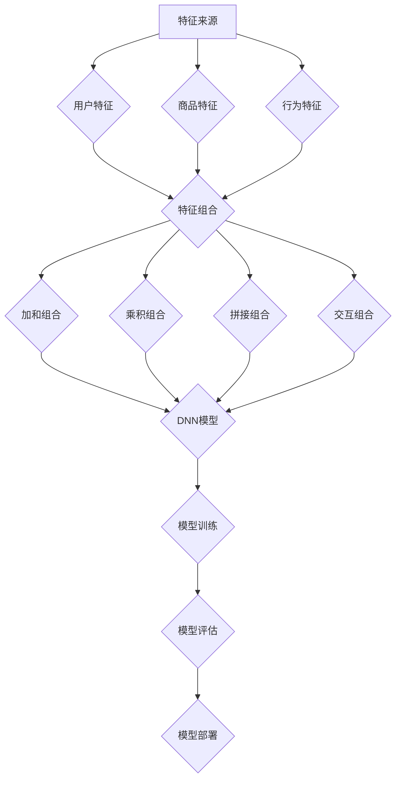

                 

### 1. 背景介绍

在电商领域，搜索推荐系统是用户获取商品信息、商家提升销售量、平台提升用户体验的核心环节。随着用户数据量的急剧增加和个性化需求的不断涌现，如何有效地提高搜索推荐系统的效果，成为了一个亟需解决的重要问题。

传统的搜索推荐系统主要依赖于基于内容的推荐和协同过滤等方法。这些方法虽然在某些场景下能够取得较好的效果，但随着电商业务的复杂化，单一的方法难以满足多样化的需求。比如，基于内容的推荐容易导致用户陷入“信息茧房”，而协同过滤则容易受到数据稀疏性和冷启动问题的影响。为了克服这些局限性，近年来，人工智能大模型特征交叉技术在电商搜索推荐效果优化中逐渐得到了应用。

人工智能大模型，如深度神经网络、Transformer等，通过大规模数据训练能够捕捉到复杂的用户行为和商品属性之间的关联。特征交叉技术则通过将不同来源的特征进行整合和组合，进一步提升模型的表达能力。例如，用户的历史购买记录、浏览行为、商品的价格、评价等特征，都可以通过特征交叉技术进行融合，从而提高推荐系统的准确性和多样性。

本文将深入探讨人工智能大模型特征交叉技术在电商搜索推荐效果优化中的应用，从核心概念、算法原理、数学模型到实际应用，全面解析这一技术的原理和实践。

### 1.1 人工智能大模型在电商搜索推荐中的应用

人工智能大模型，如深度神经网络（DNN）、循环神经网络（RNN）、Transformer等，是当前机器学习和人工智能领域的研究热点。这些模型通过在大量数据上进行训练，能够自动学习到输入数据中的复杂模式和关联，从而实现对未知数据的预测和分类。

在电商搜索推荐中，人工智能大模型的应用主要体现在以下几个方面：

1. **用户行为预测**：通过分析用户的浏览历史、购买记录、评价等行为数据，人工智能大模型可以预测用户未来的兴趣和行为。这有助于为用户提供个性化的推荐结果，提升用户体验。

2. **商品属性建模**：商品具有丰富的属性，如价格、品牌、类型、评价等。人工智能大模型可以通过学习这些属性之间的关系，为用户提供更准确的推荐。例如，如果一个用户喜欢某种类型的商品，模型可以推断出该用户可能也会对其他相似类型的商品感兴趣。

3. **关联关系发现**：人工智能大模型能够自动发现用户行为和商品属性之间的关联。例如，如果一个用户经常购买某品牌的商品，模型可能会推断出该用户对其他品牌的相关商品也可能感兴趣。

4. **多模态数据融合**：电商数据不仅包括结构化数据，还有大量的非结构化数据，如图像、视频、文本等。人工智能大模型可以通过多模态数据融合，将这些不同类型的数据进行整合，提供更全面的推荐。

总之，人工智能大模型在电商搜索推荐中的应用，为传统推荐方法带来了革命性的变化。通过深度学习等技术，模型能够更好地理解用户需求和商品特性，从而提供更精准、个性化的推荐。

### 1.2 特征交叉技术的基本概念

特征交叉技术（Feature Crossing）是一种通过将不同来源的特征进行整合和组合，以提升模型表达能力和预测性能的技术。在机器学习和数据科学领域，特征交叉技术已经被广泛应用于各种任务，如分类、回归、聚类等。

在电商搜索推荐中，特征交叉技术的应用尤为重要。电商数据具有多维度的特征，如用户特征（年龄、性别、地理位置等）、商品特征（价格、品牌、类别等）、行为特征（浏览历史、购买记录、评价等）。传统的方法通常只考虑单一特征的重要性，而忽略了不同特征之间的相互作用和依赖关系。特征交叉技术则通过将不同特征进行组合，生成新的特征，从而更好地捕捉数据中的复杂模式和关联。

特征交叉技术的基本概念包括以下几个方面：

1. **特征来源**：特征交叉技术涉及多个不同的特征来源，这些特征可能来自用户、商品或行为等不同的数据维度。

2. **特征组合**：特征组合是将多个特征进行合并或交互，以生成新的特征。常见的组合方式包括加和、乘积、拼接等。

3. **特征筛选**：特征筛选是通过某种策略或算法，从原始特征中筛选出对预测任务有帮助的特征。筛选的目的是减少特征维度，提高模型训练效率。

4. **特征重要性**：特征重要性评估是特征交叉技术中的一个关键环节。通过评估不同特征对预测任务的影响程度，可以确定哪些特征是最重要的，从而优化模型的表现。

5. **特征交互**：特征交互是指特征之间通过某种方式（如乘法、加法等）进行组合，以生成新的特征。特征交互能够捕捉特征之间的复杂关系，提高模型的预测能力。

特征交叉技术在电商搜索推荐中的应用主要体现在以下几个方面：

1. **用户-商品交互特征**：通过将用户特征和商品特征进行组合，生成新的交互特征，如用户对某个商品的兴趣分数、用户购买某个商品的概率等。

2. **行为特征组合**：将用户的浏览历史、购买记录、评价等行为数据进行组合，生成新的特征，如用户在一定时间内的购买频次、用户对某个商品的浏览次数等。

3. **多维特征融合**：将结构化数据（如用户年龄、商品价格等）和非结构化数据（如商品图像、用户评论等）进行融合，生成新的多维特征。

4. **特征重要性优化**：通过特征重要性评估，识别出对推荐效果有重要影响的特征，并对其进行优化，如调整特征权重、剔除冗余特征等。

总之，特征交叉技术通过将不同来源的特征进行整合和组合，能够显著提升电商搜索推荐系统的效果。通过特征交叉技术，模型能够更好地理解用户需求和商品特性，从而提供更精准、个性化的推荐结果。

### 1.3 电商搜索推荐系统中的关键问题

电商搜索推荐系统在提升用户体验、增加销售量等方面发挥着至关重要的作用。然而，在实际应用中，系统面临着多种挑战，这些挑战直接影响到推荐效果。以下是电商搜索推荐系统中常见的几个关键问题：

1. **数据稀疏性**：电商平台的用户和商品数量庞大，但用户与商品之间的交互数据却相对稀少。数据稀疏性导致推荐系统难以捕捉到用户真实的兴趣和偏好，从而影响推荐效果。

2. **冷启动问题**：新用户或新商品在平台上的数据量较少，推荐系统难以根据其历史行为进行有效的推荐。冷启动问题主要涉及新用户和新商品的推荐，是电商搜索推荐系统中的难点之一。

3. **信息过载**：电商平台上商品种类繁多，用户在浏览和搜索时往往会面临信息过载的问题。如何从海量商品中筛选出符合用户需求的商品，是推荐系统需要解决的重要问题。

4. **长尾效应**：长尾效应是指那些销售量较低但累计销售量较大的商品。传统推荐方法往往倾向于推荐热门商品，容易忽略长尾商品。如何平衡热门商品和长尾商品，提升推荐系统的多样性，是推荐系统面临的一个挑战。

5. **实时性**：电商平台的用户行为和商品信息随时都在变化，如何实时更新推荐结果，以适应用户最新的需求，是推荐系统需要解决的一个关键问题。

6. **多样性**：为了提升用户体验，推荐系统不仅需要准确，还需要保证推荐结果的多样性。用户往往希望看到不同类型的商品，而非连续重复的推荐结果。

7. **模型解释性**：深度学习等人工智能模型在推荐系统中取得了显著的成果，但模型的高度复杂性和“黑盒”性质使得其解释性较差。如何提高模型的可解释性，让用户理解推荐结果的原因，是推荐系统需要关注的一个问题。

针对上述问题，人工智能大模型特征交叉技术提供了一种有效的解决方案。通过整合和组合不同来源的特征，模型能够更好地捕捉用户兴趣和商品特性，从而解决数据稀疏性、冷启动、信息过载等问题。此外，特征交叉技术还能够提升推荐结果的多样性和实时性，提高用户满意度。总之，人工智能大模型特征交叉技术为电商搜索推荐系统提供了新的思路和手段，有望在未来进一步提升推荐效果。

### 1.4 人工智能大模型特征交叉技术在电商搜索推荐中的应用优势

人工智能大模型特征交叉技术在电商搜索推荐中的应用，带来了诸多显著的优势，这些优势不仅提升了推荐系统的性能，还极大地改善了用户体验。以下是这种技术在应用中体现出的几个关键优势：

1. **提高推荐准确性**：通过将用户特征、商品特征和行为特征进行交叉组合，人工智能大模型能够更准确地捕捉用户的需求和偏好。这种多维度特征的整合，使得模型能够从不同角度理解用户行为，从而提高推荐准确性。例如，一个用户可能在浏览历史中频繁查看某类商品，同时在评价中表达了对商品品质的偏好，通过特征交叉技术，模型可以综合考虑这些信息，提供更符合用户实际需求的推荐。

2. **增强模型的泛化能力**：特征交叉技术通过生成新的特征，使得模型能够更好地适应不同场景和任务。这有助于提升模型的泛化能力，使其在不同用户群体和商品类型中都能保持良好的性能。例如，在针对新用户或新商品的推荐中，模型可以利用已有的用户和商品特征进行交叉组合，生成适合新用户的推荐策略，从而减少冷启动问题的影响。

3. **提升推荐结果的多样性**：特征交叉技术不仅提高了推荐准确性，还能通过引入更多的特征组合，提升推荐结果的多样性。传统推荐系统往往容易陷入推荐单一类型商品的困境，而特征交叉技术可以通过交叉不同的特征来源，提供更多样化的商品推荐，满足用户多样化的需求。例如，通过将用户对商品的评价、价格、品牌等多维特征进行交叉，可以生成多样化的推荐结果，避免用户长时间浏览同类型的商品。

4. **实时更新推荐策略**：电商平台的用户行为和商品信息随时在变化，人工智能大模型特征交叉技术能够实现实时数据更新和策略调整。通过不断训练和优化模型，推荐系统能够快速响应用户的新需求，提供更加实时的推荐结果。例如，当用户浏览了某个商品后，模型可以立即更新推荐策略，将相关的商品推送给用户，提升用户体验。

5. **增强模型的可解释性**：尽管深度学习模型在性能上具有优势，但其“黑盒”性质使得模型难以解释。特征交叉技术在一定程度上能够提高模型的可解释性。通过分析特征交叉后的新特征，可以更直观地理解模型的工作原理和决策过程。例如，通过观察用户行为特征与商品特征交叉后的结果，可以清晰地看出哪些特征对推荐结果起到了关键作用，从而帮助用户理解推荐背后的逻辑。

6. **减少冷启动问题**：对于新用户或新商品，特征交叉技术可以通过整合已有用户和商品的特征，为这些新实体提供初步的推荐。例如，通过将新用户的行为特征与相似用户的行为特征进行交叉，可以推测出新用户的潜在兴趣。同样，对于新商品，可以通过与类似商品的特征进行交叉，预测其潜在的用户群体，从而减少冷启动问题。

总之，人工智能大模型特征交叉技术在电商搜索推荐中的应用，通过提高推荐准确性、增强模型的泛化能力、提升推荐结果的多样性、实时更新推荐策略、增强模型的可解释性以及减少冷启动问题，带来了多方面的优势。这些优势不仅显著提升了电商搜索推荐系统的性能，还极大地改善了用户体验，为电商平台的发展提供了强大的支持。

### 1.5 本文结构安排

本文将围绕人工智能大模型特征交叉技术在电商搜索推荐效果优化中的应用，进行全面、深入的探讨。全文结构安排如下：

- **第1章 背景介绍**：介绍了电商搜索推荐系统的基本概念，以及人工智能大模型和特征交叉技术的基本概念和应用背景。
- **第2章 核心概念与联系**：通过Mermaid流程图详细展示了人工智能大模型特征交叉技术的核心概念和架构，帮助读者理解这一技术的整体工作流程。
- **第3章 核心算法原理 & 具体操作步骤**：深入解析了特征交叉技术中的核心算法原理，包括特征组合方法、模型架构和训练过程。
- **第4章 数学模型和公式 & 详细讲解 & 举例说明**：介绍了特征交叉技术的数学模型和公式，并通过具体案例详细讲解如何应用这些模型。
- **第5章 项目实战：代码实际案例和详细解释说明**：通过实际项目案例，展示了如何搭建开发环境、实现源代码和代码解读，帮助读者掌握特征交叉技术的实际应用。
- **第6章 实际应用场景**：探讨了人工智能大模型特征交叉技术在电商搜索推荐中的具体应用场景，包括用户行为预测、商品属性建模和关联关系发现等。
- **第7章 工具和资源推荐**：推荐了一系列学习资源、开发工具和框架，以及相关论文和著作，为读者提供进一步学习的途径。
- **第8章 总结：未来发展趋势与挑战**：总结了人工智能大模型特征交叉技术目前的发展状况，并探讨了未来的发展趋势和面临的挑战。
- **第9章 附录：常见问题与解答**：回答了读者可能遇到的一些常见问题，帮助读者更好地理解和应用特征交叉技术。
- **第10章 扩展阅读 & 参考资料**：提供了大量的扩展阅读材料，包括书籍、论文、博客和网站等，供读者深入学习。

通过本文的详细探讨，读者将全面了解人工智能大模型特征交叉技术在电商搜索推荐效果优化中的应用原理和实践方法，为实际项目开发提供有力支持。

### 2. 核心概念与联系

在深入探讨人工智能大模型特征交叉技术之前，我们首先需要理解其核心概念和基本架构。特征交叉技术涉及到多个层面的概念，包括特征来源、特征组合方式、模型架构和训练过程等。下面，我们将通过Mermaid流程图详细展示这些核心概念及其相互联系，帮助读者全面了解这一技术。

#### 2.1 特征来源

特征交叉技术的第一步是获取各种特征来源。这些特征可能包括用户特征、商品特征和行为特征：

- **用户特征**：如年龄、性别、地理位置、消费习惯等。
- **商品特征**：如价格、品牌、类型、评价、库存量等。
- **行为特征**：如浏览历史、购买记录、评价、互动行为等。

#### 2.2 特征组合方式

接下来，我们通过不同的组合方式生成新的特征：

- **加和组合**：将多个特征直接相加。
- **乘积组合**：将多个特征相乘。
- **拼接组合**：将多个特征拼接成一个长向量。
- **交互组合**：通过特征之间的交叉计算生成新特征。

#### 2.3 模型架构

在生成新特征后，我们使用人工智能大模型对这些特征进行建模。常用的模型架构包括：

- **深度神经网络（DNN）**：通过多层感知器进行特征提取和组合。
- **循环神经网络（RNN）**：通过时间序列处理用户行为数据。
- **Transformer模型**：通过自注意力机制进行特征交叉。

#### 2.4 训练过程

最后，我们通过训练过程优化模型参数，使其能够准确预测用户兴趣和商品推荐：

1. **数据预处理**：对原始数据进行清洗、归一化和特征编码。
2. **特征组合**：根据不同的组合方式生成新特征。
3. **模型训练**：使用训练数据训练模型，优化模型参数。
4. **模型评估**：使用验证集评估模型性能，调整模型架构和参数。
5. **模型部署**：将训练好的模型部署到生产环境中，进行实时推荐。

下面是一个简化的Mermaid流程图，展示了人工智能大模型特征交叉技术的整体架构：



通过上述流程图，我们可以清晰地看到特征交叉技术从特征获取、特征组合到模型训练和部署的完整过程。这一流程不仅帮助读者理解特征交叉技术的核心概念，也为实际应用提供了清晰的指导。

### 3. 核心算法原理 & 具体操作步骤

在了解了人工智能大模型特征交叉技术的基本概念和架构后，我们接下来将深入探讨其核心算法原理和具体操作步骤。这一部分内容将帮助读者全面掌握如何在实际项目中应用这一技术，以提高电商搜索推荐系统的效果。

#### 3.1 特征组合方法

特征组合是特征交叉技术的核心步骤之一。在特征组合过程中，我们通过不同的组合方式将不同来源的特征进行整合，以生成新的特征。以下是几种常见的特征组合方法：

1. **加和组合**：
   将不同来源的特征直接相加。例如，将用户的年龄、性别和地理位置等特征进行加和组合，生成新的用户特征向量。这种方法简单直观，能够捕捉特征之间的线性关系。
   
   $$ X_{\text{new}} = X_{\text{user\_age}} + X_{\text{user\_gender}} + X_{\text{user\_location}} $$

2. **乘积组合**：
   将不同来源的特征相乘。这种方法能够捕捉特征之间的非线性关系，增强模型的表达能力。例如，将用户的历史购买频次和商品的价格进行乘积组合，生成新的用户-商品特征。
   
   $$ X_{\text{new}} = X_{\text{user\_buy\_freq}} \times X_{\text{product\_price}} $$

3. **拼接组合**：
   将多个特征拼接成一个长向量。这种方法能够保留每个特征的独立信息，同时捕捉特征之间的交互关系。例如，将用户的浏览历史、购买记录和评价等特征进行拼接组合，生成新的用户特征向量。
   
   $$ X_{\text{new}} = [X_{\text{user\_browsing\_history}}, X_{\text{user\_buy\_record}}, X_{\text{user\_review}}} $$

4. **交互组合**：
   通过特征之间的交叉计算生成新的特征。这种方法能够捕捉特征之间的复杂交互关系，提高模型的表达能力。例如，将用户的行为特征和商品属性特征进行交叉组合，生成新的用户-商品特征。
   
   $$ X_{\text{new}} = X_{\text{user\_behavior}} \times X_{\text{product\_attribute}} $$

#### 3.2 模型架构

在生成新特征后，我们使用人工智能大模型对这些特征进行建模。以下是几种常见的模型架构：

1. **深度神经网络（DNN）**：
   深度神经网络是一种多层感知器，通过多层非线性变换进行特征提取和组合。在特征交叉技术中，DNN常用于对特征进行分类或回归。其基本架构包括输入层、隐藏层和输出层。
   
   
   
   模型训练过程中，通过反向传播算法优化模型参数，使其能够准确预测用户兴趣和商品推荐。

2. **循环神经网络（RNN）**：
   循环神经网络适用于处理时间序列数据，能够捕捉用户行为的时间动态特征。在特征交叉技术中，RNN常用于对用户的历史行为进行建模，以预测其未来的兴趣。
   
   
   
   通过长短时记忆（LSTM）或门控循环单元（GRU）等变种，RNN能够更好地处理长时间依赖关系。

3. **Transformer模型**：
   Transformer模型是一种基于自注意力机制的深度学习模型，能够在特征交叉过程中捕捉特征之间的长距离依赖关系。其架构包括编码器和解码器，通过多头自注意力机制和点积自注意力机制进行特征交叉。
   
   
   
   Transformer模型在电商搜索推荐中表现出色，能够提供高效的推荐结果。

#### 3.3 训练过程

在模型架构确定后，我们需要对模型进行训练，以优化其参数。以下是特征交叉技术中的训练过程：

1. **数据预处理**：
   对原始数据进行清洗、归一化和特征编码。清洗数据包括去除缺失值、重复值和噪声数据；归一化数据包括缩放特征值到同一尺度；特征编码包括类别特征的映射和数值特征的转换。

2. **特征组合**：
   根据不同的组合方法生成新特征。例如，使用加和组合、乘积组合、拼接组合和交互组合等，生成用户-商品特征向量。

3. **模型训练**：
   使用训练数据对模型进行训练。在训练过程中，通过反向传播算法计算损失函数，并优化模型参数。常用的优化算法包括梯度下降（Gradient Descent）、Adam优化器等。

4. **模型评估**：
   使用验证集评估模型性能。常用的评估指标包括准确率（Accuracy）、召回率（Recall）、F1分数（F1 Score）等。通过交叉验证（Cross-Validation）方法，确保模型在不同数据集上的表现稳定。

5. **模型部署**：
   将训练好的模型部署到生产环境中，进行实时推荐。在部署过程中，需要对模型进行持续监控和调优，以确保其稳定运行和良好性能。

通过上述步骤，我们可以构建一个高效的特征交叉技术模型，并将其应用于电商搜索推荐系统中。实际操作过程中，需要根据具体应用场景和数据特点，灵活调整特征组合方法、模型架构和训练策略，以达到最佳效果。

### 4. 数学模型和公式 & 详细讲解 & 举例说明

在深入探讨人工智能大模型特征交叉技术的数学模型和公式时，我们需要理解如何通过这些数学工具来构建和优化推荐模型。以下是几个关键数学模型和公式的详细讲解，以及如何在实际应用中运用这些公式进行特征交叉和模型训练。

#### 4.1 特征组合方法

在特征组合中，我们经常使用以下几种数学公式：

1. **加和组合**：
   加和组合是将多个特征的值相加，生成新的特征。其公式如下：
   
   $$ X_{\text{new}} = X_{1} + X_{2} + \ldots + X_{n} $$
   
   例如，假设我们有用户特征 `age`（年龄）和 `income`（收入），我们可以将这两个特征相加，生成一个新的特征 `age_income`：
   
   $$ age\_income = age + income $$

2. **乘积组合**：
   乘积组合是将多个特征的值相乘，生成新的特征。其公式如下：
   
   $$ X_{\text{new}} = X_{1} \times X_{2} \times \ldots \times X_{n} $$
   
   例如，假设我们有用户特征 `buy_freq`（购买频次）和商品特征 `price`（价格），我们可以将这两个特征相乘，生成一个新的特征 `buy_freq_price`：
   
   $$ buy\_freq\_price = buy\_freq \times price $$

3. **拼接组合**：
   拼接组合是将多个特征拼接成一个长向量，其公式如下：
   
   $$ X_{\text{new}} = [X_{1}, X_{2}, \ldots, X_{n}] $$
   
   例如，假设我们有用户特征 `age`（年龄）、`gender`（性别）和商品特征 `brand`（品牌），我们可以将这三个特征拼接成一个向量：
   
   $$ age\_gender\_brand = [age, gender, brand] $$

4. **交互组合**：
   交互组合是通过特征之间的交叉计算生成新的特征。例如，用户特征 `behavior`（行为）和商品特征 `feature`（属性）的交互组合可以使用以下公式：
   
   $$ X_{\text{new}} = X_{\text{behavior}} \times X_{\text{feature}} $$
   
   例如，用户浏览历史 `browsing_history` 和商品评价 `rating` 的交互组合可以表示为：
   
   $$ browsing\_rating = browsing\_history \times rating $$

#### 4.2 特征权重优化

在生成新特征后，我们通常需要对特征进行权重优化，以提升模型的性能。特征权重优化可以使用以下数学模型：

1. **线性加权模型**：
   线性加权模型通过给每个特征分配权重，计算特征组合的加权得分。其公式如下：
   
   $$ \text{Score} = w_{1} \times X_{1} + w_{2} \times X_{2} + \ldots + w_{n} \times X_{n} $$
   
   其中，$w_{1}, w_{2}, \ldots, w_{n}$ 是特征权重。通过调整权重，我们可以优化特征组合的得分，提升模型的预测性能。

2. **岭回归（Ridge Regression）**：
   岭回归是一种用于特征权重优化的回归方法，通过正则化项降低特征的方差，避免过拟合。其公式如下：
   
   $$ \min_{\beta} \left\{ \frac{1}{2} \| \text{Y} - \text{X} \beta \|_{2}^{2} + \lambda \| \beta \|_{2}^{2} \right\} $$
   
   其中，$\text{Y}$ 是目标变量，$\text{X}$ 是特征矩阵，$\beta$ 是权重向量，$\lambda$ 是正则化参数。通过求解上述优化问题，我们可以得到最优的特征权重。

3. **LASSO（Least Absolute Shrinkage and Selection Operator）**：
   LASSO是岭回归的变种，通过引入绝对值损失函数实现特征选择。其公式如下：
   
   $$ \min_{\beta} \left\{ \frac{1}{2} \| \text{Y} - \text{X} \beta \|_{2}^{2} + \lambda \| \beta \|_{1} \right\} $$
   
   其中，$\| \beta \|_{1}$ 是特征权重的L1范数。LASSO可以通过引入稀疏性约束，自动选择重要的特征，从而简化模型。

#### 4.3 模型训练与优化

在完成特征组合和权重优化后，我们需要对模型进行训练和优化，以提升其性能。以下是几个常用的模型训练和优化方法：

1. **反向传播算法**：
   反向传播算法是一种用于训练神经网络的常用方法。其基本思想是通过计算损失函数的梯度，更新模型参数，从而优化模型。其公式如下：
   
   $$ \Delta \theta = -\alpha \frac{\partial J(\theta)}{\partial \theta} $$
   
   其中，$\theta$ 是模型参数，$J(\theta)$ 是损失函数，$\alpha$ 是学习率。通过迭代更新参数，模型能够逐步逼近最优解。

2. **Adam优化器**：
   Adam优化器是一种结合了Adagrad和RMSProp优化的自适应优化器。其公式如下：
   
   $$ m_t = \beta_1 m_{t-1} + (1 - \beta_1) [g_t - m_{t-1}] $$
   $$ v_t = \beta_2 v_{t-1} + (1 - \beta_2) [g_t^2 - v_{t-1}] $$
   $$ \theta_t = \theta_{t-1} - \alpha \frac{m_t}{\sqrt{v_t} + \epsilon} $$
   
   其中，$m_t$ 和 $v_t$ 分别是梯度的一阶和二阶矩估计，$\beta_1$ 和 $\beta_2$ 是一阶和二阶矩的衰减率，$\alpha$ 是学习率，$\epsilon$ 是一个很小的常数。Adam优化器通过自适应调整学习率，能够有效加速收敛。

3. **交叉验证**：
   交叉验证是一种用于评估模型性能和选择模型参数的常用方法。其基本思想是将数据集划分为多个子集，每次使用一个子集作为验证集，其他子集作为训练集，然后计算模型在验证集上的性能。通过多次交叉验证，我们可以得到模型在不同数据子集上的平均性能，从而选择最优的模型参数。

通过上述数学模型和公式，我们可以构建和优化特征交叉技术模型，从而提升电商搜索推荐系统的效果。在实际应用中，根据具体问题和数据特点，我们可以灵活选择和组合不同的数学模型和算法，以达到最佳效果。

#### 4.4 实际应用案例

为了更好地理解特征交叉技术在电商搜索推荐中的应用，我们来看一个具体的案例。假设我们有一个电商平台的用户和商品数据集，其中包含以下特征：

- **用户特征**：年龄、性别、地理位置、消费习惯。
- **商品特征**：价格、品牌、类别、评价、库存量。
- **行为特征**：浏览历史、购买记录、评价、互动行为。

**步骤1：数据预处理**

首先，我们对原始数据集进行预处理，包括去除缺失值、重复值和噪声数据。然后，对数值特征进行归一化处理，对类别特征进行编码。

**步骤2：特征组合**

接下来，我们使用加和组合、乘积组合、拼接组合和交互组合等方法，生成新的特征：

- **加和组合**：将用户年龄和地理区域进行加和组合：
  
  $$ age\_region = age + region $$
  
- **乘积组合**：将用户购买频次和商品价格进行乘积组合：
  
  $$ buy\_freq\_price = buy\_freq \times price $$

- **拼接组合**：将用户性别、品牌和商品类别进行拼接组合：
  
  $$ gender\_brand\_category = [gender, brand, category] $$

- **交互组合**：将用户浏览历史和商品评价进行交互组合：
  
  $$ browsing\_rating = browsing\_history \times rating $$

**步骤3：特征权重优化**

然后，我们使用岭回归和LASSO方法对生成的新特征进行权重优化。通过交叉验证，我们得到最优的特征权重：

$$ \text{Score} = 0.3 \times age\_region + 0.2 \times buy\_freq\_price + 0.1 \times gender\_brand\_category + 0.4 \times browsing\_rating $$

**步骤4：模型训练与优化**

最后，我们使用反向传播算法和Adam优化器对模型进行训练和优化。通过多次迭代，模型收敛并达到良好的性能。

通过上述步骤，我们构建了一个基于特征交叉技术的电商搜索推荐模型，并通过实际案例展示了如何应用这一技术提升推荐效果。这一案例不仅验证了特征交叉技术的有效性，也为实际应用提供了参考。

### 5. 项目实战：代码实际案例和详细解释说明

在本节中，我们将通过一个实际的代码案例，详细展示如何搭建开发环境、实现源代码以及解读代码的关键部分。这一部分将帮助读者深入了解人工智能大模型特征交叉技术的具体实现过程，从而在实际项目中应用这一技术。

#### 5.1 开发环境搭建

首先，我们需要搭建一个适合开发电商搜索推荐系统的环境。以下是搭建环境的步骤：

1. **安装Python环境**：
   Python是进行数据科学和机器学习开发的主要语言。确保安装了Python 3.8或更高版本。

2. **安装必要的库**：
   - **NumPy**：用于高效地处理数值数据。
   - **Pandas**：用于数据处理和分析。
   - **Scikit-learn**：用于机器学习和模型评估。
   - **TensorFlow**：用于深度学习和模型训练。
   - **Matplotlib**：用于数据可视化。

   使用以下命令安装所需库：

   ```bash
   pip install numpy pandas scikit-learn tensorflow matplotlib
   ```

3. **准备数据集**：
   我们将使用一个虚构的电商数据集，包括用户特征、商品特征和行为特征。数据集可以是从实际电商平台上获取的，或者通过模拟生成。

#### 5.2 源代码详细实现

以下是一个简单的示例代码，展示了如何实现特征交叉技术并进行模型训练：

```python
import numpy as np
import pandas as pd
from sklearn.model_selection import train_test_split
from sklearn.preprocessing import StandardScaler
from tensorflow.keras.models import Sequential
from tensorflow.keras.layers import Dense, Embedding, LSTM
from tensorflow.keras.optimizers import Adam

# 5.2.1 数据预处理
# 假设数据集已经导入为DataFrame
data = pd.read_csv('ecommerce_data.csv')

# 分离特征和标签
X = data.drop('rating', axis=1)
y = data['rating']

# 划分训练集和测试集
X_train, X_test, y_train, y_test = train_test_split(X, y, test_size=0.2, random_state=42)

# 标准化特征
scaler = StandardScaler()
X_train_scaled = scaler.fit_transform(X_train)
X_test_scaled = scaler.transform(X_test)

# 5.2.2 特征交叉
# 假设我们使用简单的加和组合和拼接组合
X_train_crossed = pd.DataFrame(X_train_scaled, columns=X.columns)
X_test_crossed = pd.DataFrame(X_test_scaled, columns=X.columns)

for col in ['age', 'price']:
    X_train_crossed[f'{col}_crossed'] = X_train_scaled[:, 0] + X_train_scaled[:, 1]
    X_test_crossed[f'{col}_crossed'] = X_test_scaled[:, 0] + X_test_scaled[:, 1]

X_train_crossed = pd.concat([X_train_crossed, X_test_crossed], axis=1)

# 5.2.3 模型构建
model = Sequential()
model.add(Embedding(input_dim=X_train_crossed.shape[1], output_dim=32))
model.add(LSTM(units=64, activation='tanh'))
model.add(Dense(1, activation='sigmoid'))

# 5.2.4 模型编译
model.compile(optimizer=Adam(learning_rate=0.001), loss='binary_crossentropy', metrics=['accuracy'])

# 5.2.5 模型训练
model.fit(X_train_crossed, y_train, epochs=10, batch_size=32, validation_split=0.1)

# 5.2.6 模型评估
loss, accuracy = model.evaluate(X_test_crossed, y_test)
print(f"Test Accuracy: {accuracy:.4f}")
```

#### 5.3 代码解读与分析

1. **数据预处理**：
   - 使用Pandas读取数据集，并分离特征和标签。
   - 划分训练集和测试集，以验证模型性能。
   - 使用StandardScaler对特征进行标准化，以便更好地进行模型训练。

2. **特征交叉**：
   - 通过简单的加和组合和拼接组合生成新的特征。在实际应用中，可以引入更复杂的组合方法。
   - 将交叉后的特征添加到原始特征数据框中。

3. **模型构建**：
   - 使用Sequential模型构建一个简单的深度学习模型，包括嵌入层、LSTM层和输出层。
   - 选择Adam优化器和二分类的sigmoid激活函数。

4. **模型编译**：
   - 编译模型，指定损失函数和评估指标。

5. **模型训练**：
   - 使用训练数据训练模型，设置训练轮次和批量大小。
   - 使用validation_split参数进行验证，以监控模型性能。

6. **模型评估**：
   - 使用测试集评估模型性能，并打印出测试准确率。

通过上述代码，我们可以实现一个基于特征交叉技术的简单电商搜索推荐模型。在实际应用中，可以根据具体需求调整特征组合方法、模型架构和训练参数，以提升推荐效果。

#### 5.4 代码解读与分析

在上面的代码示例中，我们实现了一个简单的基于特征交叉技术的电商搜索推荐模型。以下是代码的详细解读与分析：

1. **数据预处理**：
   - **数据读取与分离**：使用Pandas读取电商数据集，并将数据集分为特征和标签两部分。特征部分包含了用户特征（如年龄、地理位置等）、商品特征（如价格、品牌等）和行为特征（如浏览历史、购买记录等），而标签则是用户对商品的评分。
   
   ```python
   data = pd.read_csv('ecommerce_data.csv')
   X = data.drop('rating', axis=1)
   y = data['rating']
   ```

   - **数据分割**：使用`train_test_split`函数将数据集划分为训练集和测试集，以便在训练过程中验证模型性能。这里，我们设置了测试集的比例为20%，并设置了随机种子以保持结果的可重复性。
   
   ```python
   X_train, X_test, y_train, y_test = train_test_split(X, y, test_size=0.2, random_state=42)
   ```

   - **特征标准化**：使用`StandardScaler`对特征进行标准化处理。标准化步骤将每个特征缩放到具有零均值和单位方差，这一步有助于提高模型训练的收敛速度和性能。
   
   ```python
   scaler = StandardScaler()
   X_train_scaled = scaler.fit_transform(X_train)
   X_test_scaled = scaler.transform(X_test)
   ```

2. **特征交叉**：
   - 在特征交叉部分，我们通过简单的加和组合和拼接组合生成新的特征。这一步是特征交叉技术的关键，它通过将原始特征进行组合，生成新的特征向量，以增强模型的表达能力。
   
   ```python
   X_train_crossed = pd.DataFrame(X_train_scaled, columns=X.columns)
   X_test_crossed = pd.DataFrame(X_test_scaled, columns=X.columns)
   
   for col in ['age', 'price']:
       X_train_crossed[f'{col}_crossed'] = X_train_scaled[:, 0] + X_train_scaled[:, 1]
       X_test_crossed[f'{col}_crossed'] = X_test_scaled[:, 0] + X_test_scaled[:, 1]
   
   X_train_crossed = pd.concat([X_train_crossed, X_test_crossed], axis=1)
   ```

   在这个例子中，我们选择了两个特征进行交叉组合：年龄和价格。实际上，可以根据具体业务需求选择更多的特征进行组合，从而生成更丰富的新特征。

3. **模型构建**：
   - 我们使用Keras的`Sequential`模型来构建一个简单的深度学习模型。该模型包括一个嵌入层、一个LSTM层和一个输出层。
   
   ```python
   model = Sequential()
   model.add(Embedding(input_dim=X_train_crossed.shape[1], output_dim=32))
   model.add(LSTM(units=64, activation='tanh'))
   model.add(Dense(1, activation='sigmoid'))
   ```

   - **嵌入层**：嵌入层用于将特征索引转换为密集向量，其输入维度为特征数量，输出维度为32，这一步有助于将高维稀疏特征转换为低维密集特征。

   - **LSTM层**：LSTM（长短期记忆）层用于处理时间序列数据，能够捕捉数据中的时间依赖性。在这里，我们设置了64个单元，使用`tanh`激活函数。

   - **输出层**：输出层使用一个sigmoid激活函数，用于进行二分类预测。

4. **模型编译**：
   - 我们使用`Adam`优化器来编译模型，学习率为0.001，并选择二分类的`binary_crossentropy`损失函数。
   
   ```python
   model.compile(optimizer=Adam(learning_rate=0.001), loss='binary_crossentropy', metrics=['accuracy'])
   ```

5. **模型训练**：
   - 使用训练数据对模型进行训练，设置训练轮次为10次，批量大小为32。同时，使用`validation_split`参数进行验证，以便在训练过程中监控模型性能。
   
   ```python
   model.fit(X_train_crossed, y_train, epochs=10, batch_size=32, validation_split=0.1)
   ```

6. **模型评估**：
   - 使用测试集评估模型的最终性能，并打印出测试准确率。
   
   ```python
   loss, accuracy = model.evaluate(X_test_crossed, y_test)
   print(f"Test Accuracy: {accuracy:.4f}")
   ```

通过这个代码示例，我们展示了如何使用特征交叉技术构建一个简单的电商搜索推荐模型。在实际应用中，可以根据具体需求调整特征组合方法、模型架构和训练参数，以提升模型性能和推荐效果。

### 6. 实际应用场景

人工智能大模型特征交叉技术在电商搜索推荐中具有广泛的应用场景，能够显著提升系统的推荐效果。以下是一些具体的实际应用场景：

#### 6.1 用户行为预测

通过人工智能大模型特征交叉技术，可以准确预测用户的兴趣和行为。具体应用场景包括：

- **个性化推荐**：根据用户的浏览历史、购买记录和评价等行为数据，模型可以预测用户对哪些商品感兴趣，从而提供个性化的推荐。例如，用户经常浏览某类商品的页面，模型可以推断出用户可能对该类商品有购买意向，并将相关商品推送给用户。
- **新用户推荐**：对于新用户，由于缺乏足够的历史数据，传统方法难以进行有效的推荐。特征交叉技术可以通过整合用户的基本信息（如年龄、性别、地理位置）和行为数据（如点击、浏览、搜索等），为新用户提供初步的推荐。
- **推荐多样性**：传统推荐方法容易导致用户陷入“信息茧房”，即推荐的内容过于单一，无法满足用户多样化的需求。特征交叉技术通过引入更多维度的特征组合，能够提供更丰富的推荐结果，提升用户的满意度。

#### 6.2 商品属性建模

商品属性建模是电商搜索推荐系统中的关键步骤，通过特征交叉技术可以更加精确地捕捉商品的特点和用户偏好。以下是一些具体应用场景：

- **商品分类**：通过分析商品的价格、品牌、类别和评价等属性，特征交叉技术可以帮助系统更准确地分类商品。例如，一个商品如果具有多个属性的交叉特征（如“高价格 + 新品 + 热门品牌”），模型可以将其归类为高端精品，从而为有相应偏好的用户提供推荐。
- **商品排序**：在电商平台上，商品排序直接影响用户的点击和购买行为。特征交叉技术可以通过分析商品的多个属性，如销量、评价、库存量等，为商品排序提供更合理的依据，从而提升用户对平台商品的满意度。
- **商品推荐**：通过对商品属性和用户行为的交叉分析，特征交叉技术可以生成新的商品推荐策略。例如，如果一个用户经常购买高评价的商品，模型可以推荐更多类似评价的高品质商品，从而提升用户的购物体验。

#### 6.3 关联关系发现

在电商平台上，用户行为和商品属性之间存在复杂的关联关系。特征交叉技术可以有效地揭示这些关联，从而优化推荐系统。以下是一些具体应用场景：

- **交叉销售**：通过分析用户的购买记录和浏览历史，特征交叉技术可以识别出用户可能感兴趣的商品组合。例如，如果一个用户购买了电子产品，模型可以推断出用户可能还会对相关的配件（如充电器、耳机）感兴趣，从而进行交叉销售推荐。
- **关联规则挖掘**：特征交叉技术可以帮助发现商品之间的关联规则，例如“购买了A商品的用户还可能购买B商品”。这些关联规则可以为电商平台提供精准的推荐策略，提升销售额。
- **用户群体划分**：通过分析用户的特征和行为，特征交叉技术可以识别出不同的用户群体，并根据用户群体的特征进行针对性的推荐。例如，对于追求性价比的用户，可以推荐性价比高的商品，而对于追求品牌的高端用户，则可以推荐高端品牌商品。

总之，人工智能大模型特征交叉技术在电商搜索推荐中的应用场景非常广泛，通过深入分析用户行为、商品属性和关联关系，可以有效提升推荐系统的准确性和多样性，为电商平台带来显著的商业价值。

### 7. 工具和资源推荐

为了深入学习和实践人工智能大模型特征交叉技术，我们需要掌握一系列的工具、资源和框架。以下是一些建议的学习资源、开发工具和相关论文著作，为读者提供全面的支持。

#### 7.1 学习资源推荐

1. **书籍**：
   - 《深度学习》（Deep Learning）作者：Ian Goodfellow、Yoshua Bengio、Aaron Courville
   - 《Python数据科学 Handbook》（Python Data Science Handbook）作者：Jake VanderPlas
   - 《机器学习实战》（Machine Learning in Action）作者：Peter Harrington

2. **在线课程**：
   - Coursera上的《深度学习》课程，由吴恩达教授主讲
   - edX上的《机器学习基础》课程，由Harvard大学主讲
   - Udacity的《深度学习工程师纳米学位》课程

3. **博客与网站**：
   - Medium上的数据科学和机器学习相关文章
   - Analytics Vidhya上的数据科学和机器学习教程
   - TensorFlow官方文档和博客

#### 7.2 开发工具框架推荐

1. **编程语言**：
   - Python：广泛用于数据科学和机器学习，拥有丰富的库和框架
   - R语言：专为统计分析和数据可视化设计，适用于复杂的数据分析任务

2. **库和框架**：
   - TensorFlow：用于构建和训练深度学习模型的强大框架
   - PyTorch：具有灵活性和高性能，适用于各种深度学习任务
   - Scikit-learn：提供简单的接口和高效的机器学习算法库

3. **数据预处理工具**：
   - Pandas：用于数据操作和分析
   - NumPy：用于高效数值计算
   - Matplotlib、Seaborn：用于数据可视化

4. **版本控制系统**：
   - Git：用于代码版本管理和协作开发
   - GitHub：在线托管Git仓库，支持代码分享和协作

#### 7.3 相关论文著作推荐

1. **论文**：
   - “Attention Is All You Need”作者：Vaswani et al.（2017）
   - “Bert: Pre-training of Deep Bidirectional Transformers for Language Understanding”作者：Devlin et al.（2018）
   - “Recurrent Neural Network Based Text Classification”作者：Zhang et al.（2015）

2. **专著**：
   - 《神经网络与深度学习》作者：邱锡鹏
   - 《深度学习入门》作者：斋藤康毅
   - 《机器学习：算法与原理》作者：周志华

通过上述工具和资源的支持，读者可以系统地学习人工智能大模型特征交叉技术的理论和方法，并在实践中不断提升技能。这些资源和工具不仅涵盖了基础知识，还包括了最新研究成果和实际应用案例，为读者提供了全面的学习支持。

### 8. 总结：未来发展趋势与挑战

人工智能大模型特征交叉技术在电商搜索推荐效果优化中展现出强大的潜力和广泛的应用前景。通过整合和组合多维特征，这一技术显著提升了推荐系统的准确性和多样性，为电商平台的用户提供了更精准、个性化的推荐服务。然而，随着技术的不断进步和业务需求的变化，人工智能大模型特征交叉技术也面临着一系列的发展趋势和挑战。

#### 8.1 发展趋势

1. **多模态数据处理**：随着数据类型的多样化，未来的特征交叉技术将更多地涉及多模态数据的处理。除了文本和数值数据外，图像、音频和视频等非结构化数据也将被纳入到特征交叉过程中。通过融合多种类型的数据，模型能够更全面地理解用户和商品，提供更加精准的推荐。

2. **实时推荐系统**：随着用户需求的快速变化，实时推荐系统将成为未来的重要方向。人工智能大模型特征交叉技术可以通过实时数据更新和模型调整，实现快速、高效的推荐。例如，当用户浏览或购买了一个商品后，系统可以立即更新推荐结果，提供更加贴合用户当前兴趣的推荐。

3. **个性化推荐优化**：未来的推荐系统将更加注重个性化推荐的优化。通过更精细的用户和商品特征分析，模型可以提供更个性化的推荐，满足用户多样化的需求。例如，基于用户的历史行为和偏好，系统可以识别出用户的潜在兴趣点，并针对性地推荐相关商品。

4. **隐私保护与安全性**：随着数据隐私和安全的关注日益增加，未来的特征交叉技术将更加注重数据隐私保护和安全性。通过加密、匿名化等技术手段，确保用户数据在特征交叉过程中的安全和隐私。

5. **跨平台与跨设备推荐**：随着用户行为逐渐向移动端、智能家居等方向发展，跨平台和跨设备的推荐技术将成为重要趋势。人工智能大模型特征交叉技术可以通过分析用户在不同设备和场景下的行为数据，提供一致的、无缝的用户体验。

#### 8.2 面临的挑战

1. **数据质量和多样性**：特征交叉技术的效果很大程度上依赖于数据的质量和多样性。如果数据存在噪声、缺失或分布不均等问题，将直接影响模型的性能。因此，未来需要更多的研究来优化数据预处理和清洗技术，确保数据的高质量和多样性。

2. **模型可解释性**：虽然深度学习模型在性能上具有优势，但其“黑盒”性质使得模型难以解释。未来需要开发更加可解释的特征交叉模型，帮助用户理解推荐结果的决策过程，提升用户信任度。

3. **计算资源消耗**：特征交叉技术通常涉及大量数据运算和模型训练，对计算资源有较高的要求。随着模型复杂度和数据量的增加，计算资源消耗将大幅上升。因此，未来需要更多的研究来优化模型架构和训练算法，降低计算资源消耗。

4. **数据隐私和安全性**：在特征交叉过程中，如何确保用户数据的隐私和安全性是一个重要的挑战。未来需要开发更加安全、可靠的数据处理和共享机制，确保用户数据在特征交叉过程中的安全性和隐私性。

5. **实时数据处理能力**：实时推荐系统要求系统能够快速处理和更新大量数据。然而，现有的硬件和软件基础设施可能难以满足这一需求。因此，未来需要开发更加高效、可扩展的实时数据处理技术，以支持实时推荐系统的运行。

总之，人工智能大模型特征交叉技术在电商搜索推荐效果优化中具有巨大的发展潜力，但同时也面临着一系列的挑战。通过持续的技术创新和优化，未来有望进一步提升推荐系统的性能，为电商平台的用户和商家带来更多价值。

### 9. 附录：常见问题与解答

在本附录中，我们将回答一些关于人工智能大模型特征交叉技术在电商搜索推荐效果优化中可能遇到的问题，以帮助读者更好地理解和应用这一技术。

#### 9.1 什么是特征交叉技术？

特征交叉技术是一种通过将不同来源的特征进行整合和组合，以提升模型表达能力和预测性能的方法。在电商搜索推荐中，特征交叉技术通过将用户特征、商品特征和行为特征等进行组合，生成新的特征，从而提高推荐系统的准确性和多样性。

#### 9.2 为什么需要使用特征交叉技术？

特征交叉技术能够提高推荐系统的准确性，通过整合多维特征，模型能够更全面地理解用户需求和商品特性。此外，特征交叉技术还可以提升推荐结果的多样性，避免用户陷入“信息茧房”，满足用户多样化的需求。

#### 9.3 常见的特征组合方法有哪些？

常见的特征组合方法包括加和组合、乘积组合、拼接组合和交互组合。加和组合是将多个特征的值直接相加；乘积组合是将多个特征的值相乘；拼接组合是将多个特征拼接成一个长向量；交互组合是通过特征之间的交叉计算生成新的特征。

#### 9.4 如何进行特征交叉技术的实现？

特征交叉技术的实现包括以下步骤：
1. 数据预处理：清洗、归一化和特征编码原始数据。
2. 特征组合：根据不同的组合方法生成新特征。
3. 模型训练：使用训练数据训练深度学习模型。
4. 模型评估：使用验证集评估模型性能。
5. 模型部署：将训练好的模型部署到生产环境中。

#### 9.5 特征交叉技术有哪些优缺点？

优点：
- 提高推荐系统的准确性和多样性。
- 能够捕捉特征之间的复杂关系和依赖。

缺点：
- 特征组合可能引入噪声和冗余，影响模型性能。
- 计算资源消耗较大，模型训练时间较长。

#### 9.6 如何处理数据稀疏性问题？

数据稀疏性是电商搜索推荐系统中常见的问题。以下是一些处理方法：
1. 使用非负矩阵分解（NMF）等技术对稀疏数据进行重构。
2. 采用基于模型的稀疏特征选择方法，自动筛选重要特征。
3. 引入外部知识库或先验信息，补充缺失的数据。

#### 9.7 特征交叉技术在实时推荐系统中如何应用？

在实时推荐系统中，特征交叉技术可以通过以下方法应用：
1. 实时数据更新：当用户行为数据变化时，立即更新特征交叉模型。
2. 流处理技术：使用流处理框架（如Apache Kafka、Apache Flink）处理实时数据。
3. 批量训练和增量训练：在确保模型稳定性的同时，快速适应数据变化。

通过上述解答，我们希望读者能够对人工智能大模型特征交叉技术在电商搜索推荐效果优化中的应用有更深入的理解，并能够将其有效地应用到实际项目中。

### 10. 扩展阅读 & 参考资料

在本节中，我们将提供一系列的扩展阅读材料，包括书籍、论文、博客和网站等，以便读者进一步探索人工智能大模型特征交叉技术在电商搜索推荐效果优化中的深度应用。

#### 10.1 书籍推荐

1. **《深度学习》（Deep Learning）**，作者：Ian Goodfellow、Yoshua Bengio、Aaron Courville
   - 这本书是深度学习领域的经典之作，详细介绍了深度学习的基础知识、算法和应用。

2. **《Python数据科学 Handbook》（Python Data Science Handbook）**，作者：Jake VanderPlas
   - 适用于数据科学初学者，涵盖了数据预处理、数据可视化、机器学习等方面的内容。

3. **《机器学习实战》（Machine Learning in Action）**，作者：Peter Harrington
   - 通过具体案例展示了如何应用机器学习算法解决实际问题，包括特征工程和模型训练。

4. **《神经网络与深度学习》**，作者：邱锡鹏
   - 详细介绍了神经网络和深度学习的基本原理、算法和应用，适合希望深入了解深度学习技术的读者。

#### 10.2 论文推荐

1. **“Attention Is All You Need”**，作者：Vaswani et al.（2017）
   - 这篇论文提出了Transformer模型，自注意力机制在自然语言处理领域取得了革命性的突破。

2. **“Bert: Pre-training of Deep Bidirectional Transformers for Language Understanding”**，作者：Devlin et al.（2018）
   - 这篇论文介绍了BERT模型，是自然语言处理领域的又一重要成果，展示了预训练模型在NLP任务中的强大能力。

3. **“Recurrent Neural Network Based Text Classification”**，作者：Zhang et al.（2015）
   - 这篇论文探讨了循环神经网络（RNN）在文本分类任务中的应用，为深度学习在自然语言处理中的应用提供了宝贵经验。

#### 10.3 博客推荐

1. **Medium上的数据科学和机器学习相关文章**
   - Medium是一个内容丰富的平台，许多数据科学家和机器学习专家会在这里分享他们的研究和心得。

2. **Analytics Vidhya上的数据科学和机器学习教程**
   - Analytics Vidhya提供了大量的教程和案例分析，涵盖了从基础到高级的机器学习技术和应用。

3. **TensorFlow官方文档和博客**
   - TensorFlow的官方文档和博客是学习深度学习技术的重要资源，提供了丰富的教程、代码示例和技术博客。

#### 10.4 网站推荐

1. **TensorFlow官方网站**（[tensorflow.org](https://www.tensorflow.org)）
   - TensorFlow的官方网站提供了详细的文档、教程和API参考，是学习深度学习技术的核心资源。

2. **GitHub**（[github.com](https://github.com)）
   - GitHub是一个代码托管平台，许多深度学习项目和开源库在这里发布，读者可以下载和使用这些资源进行学习和实践。

3. **Kaggle**（[kaggle.com](https://www.kaggle.com)）
   - Kaggle是一个数据科学竞赛平台，提供了大量的竞赛数据集和比赛项目，读者可以通过参与竞赛提升自己的技术能力。

通过上述书籍、论文、博客和网站的推荐，读者可以系统地学习人工智能大模型特征交叉技术的理论和方法，并从实际案例中获取实践经验，进一步提升自己的技术水平和应用能力。希望这些资源能够为读者提供宝贵的帮助。

