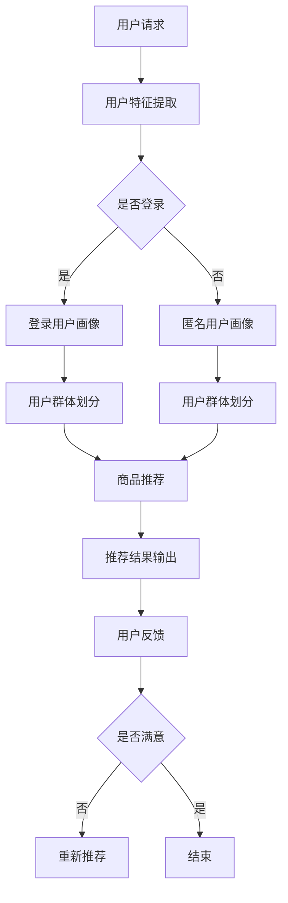
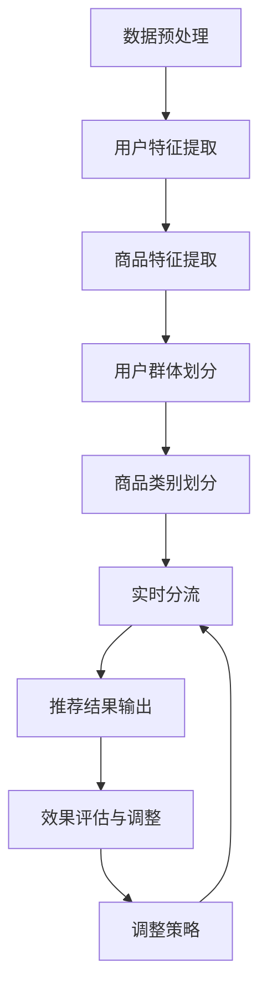

                 

### 背景介绍

随着互联网技术的飞速发展，电子商务已成为全球经济发展的重要驱动力。而电商搜索推荐系统作为电商平台的“隐形销售员”，极大地提升了用户购物的体验和平台的销售额。搜索推荐效果评估是确保推荐系统能够满足用户需求和商业目标的关键环节。为了提高推荐系统的效果，AI大模型在电商搜索推荐中的应用逐渐兴起。

AI大模型，即大型深度学习模型，因其强大的数据处理能力和复杂模式识别能力，在推荐系统中发挥着重要作用。然而，如何设计一个有效的实验来评估AI大模型在电商搜索推荐中的分流效果，成为了一个关键问题。分流效果评估不仅涉及技术层面的考量，还包括对用户行为、系统性能等多维度的综合评估。

本文旨在探讨电商搜索推荐效果评估中的AI大模型分流实验设计。我们将从实验设计的原则、方法、流程以及实际操作中面临的挑战等多个方面进行深入分析。本文将按照以下结构展开：

1. **背景介绍**：简要概述电商搜索推荐系统的现状和AI大模型在其中的应用。
2. **核心概念与联系**：介绍AI大模型的基本原理及其在电商搜索推荐中的具体应用。
3. **核心算法原理 & 具体操作步骤**：详细讲解AI大模型分流算法的原理和操作步骤。
4. **数学模型和公式 & 详细讲解 & 举例说明**：解析相关数学模型和公式，并通过实际案例进行说明。
5. **项目实战：代码实际案例和详细解释说明**：展示代码实现，并详细解读和分析。
6. **实际应用场景**：讨论AI大模型分流实验在不同电商场景中的应用。
7. **工具和资源推荐**：推荐相关学习资源、开发工具和框架。
8. **总结：未来发展趋势与挑战**：展望AI大模型在电商搜索推荐效果评估中的未来发展。
9. **附录：常见问题与解答**：解答读者可能遇到的问题。
10. **扩展阅读 & 参考资料**：提供进一步学习的技术文献和资料。

通过本文的探讨，我们希望能够为读者提供一套系统化、具有实用性的AI大模型分流实验设计指南，以助力电商搜索推荐系统的优化与提升。

### 核心概念与联系

#### AI大模型的基本原理

AI大模型，通常指的是基于深度学习的复杂神经网络结构，其核心在于通过多层非线性变换对大量数据进行学习和预测。这些模型在训练过程中，能够自动提取数据中的特征，并在处理高维度、复杂问题时表现出色。其中，最为常见的AI大模型包括深度神经网络（Deep Neural Network, DNN）、卷积神经网络（Convolutional Neural Network, CNN）和递归神经网络（Recurrent Neural Network, RNN）等。

深度神经网络（DNN）通过多个隐藏层对输入数据进行逐层抽象和变换，能够处理非线性问题。卷积神经网络（CNN）则特别适用于图像处理任务，通过卷积操作提取图像中的局部特征。递归神经网络（RNN）适合处理序列数据，通过记忆状态捕捉时间序列中的长期依赖关系。

#### 电商搜索推荐中的AI大模型应用

在电商搜索推荐系统中，AI大模型的应用主要体现在以下几个方面：

1. **用户画像构建**：通过分析用户的历史行为数据，AI大模型可以构建出详细的用户画像，包括用户的兴趣偏好、购买习惯等。这为后续的个性化推荐提供了基础。

2. **商品推荐**：基于用户画像和商品特征，AI大模型能够预测用户可能感兴趣的商品，并生成推荐列表。通过优化推荐算法，提高用户的点击率和转化率。

3. **商品搜索**：AI大模型可以优化搜索算法，使得搜索结果更加准确和相关性高。例如，通过自然语言处理技术，理解用户的查询意图，提供更加精准的搜索结果。

4. **广告投放**：利用AI大模型分析用户的兴趣和行为，实现精准广告投放，提高广告的点击率和转化率。

#### AI大模型分流算法原理

在电商搜索推荐中，AI大模型分流算法的核心目标是通过合理的分流策略，提高推荐系统的整体性能。分流算法通常包括以下几个步骤：

1. **用户分流**：根据用户的行为特征，将用户划分为不同的群体，如高频用户、潜在用户等。不同群体可能需要不同的推荐策略。

2. **商品分流**：根据商品的特征，将商品划分为不同的类别，如热门商品、长尾商品等。不同类别的商品可能适合不同的推荐算法。

3. **实时分流**：在用户请求到达时，根据当前系统的状态（如负载、内存使用等）进行动态分流，以保证系统的高可用性和稳定性。

4. **评估与调整**：通过对分流效果的评估，调整分流策略，以优化推荐系统的性能。

#### Mermaid流程图表示

为了更好地理解AI大模型分流算法的原理，我们可以使用Mermaid流程图对其进行可视化表示。以下是一个简化的流程图，展示了AI大模型在电商搜索推荐中的主要步骤：



在这个流程图中，用户请求首先经过特征提取和用户画像构建，然后根据用户群体划分，进行商品推荐。推荐结果输出后，通过用户反馈进行评估和优化，实现持续改进。

通过上述分析，我们可以看到AI大模型在电商搜索推荐中具有广泛的应用前景。合理设计AI大模型分流实验，不仅能够提升推荐系统的性能，还能够为电商平台的运营提供有力的支持。接下来的部分，我们将深入探讨AI大模型分流算法的具体实现步骤和数学模型。

### 核心算法原理 & 具体操作步骤

AI大模型分流算法的设计和实现是电商搜索推荐系统性能优化的重要组成部分。在这一部分，我们将详细探讨AI大模型分流算法的核心原理，并逐步解释其具体操作步骤。

#### 分流算法的核心原理

AI大模型分流算法的核心思想是基于用户行为和商品特征进行精准分流，从而提高推荐系统的整体性能。具体来说，核心原理可以分为以下几个方面：

1. **用户行为特征分析**：通过分析用户的历史行为数据（如浏览记录、购买记录、搜索历史等），构建用户行为特征模型。这些特征模型能够反映用户的兴趣偏好和购买习惯。

2. **商品特征提取**：对商品进行特征提取，包括商品的基本属性（如类别、品牌、价格等）和隐式特征（如用户评价、商品图片等）。这些特征将用于后续的推荐算法。

3. **用户群体划分**：根据用户行为特征，将用户划分为不同的群体。每个群体可能具有不同的行为特征和偏好，因此需要采用不同的推荐策略。

4. **商品类别划分**：根据商品特征，将商品划分为不同的类别。不同类别的商品在用户中的受欢迎程度可能不同，因此需要为每个类别设计适合的推荐算法。

5. **实时分流策略**：根据用户请求的实时状态（如当前系统负载、用户请求类型等），动态调整分流策略，以优化系统性能。

6. **效果评估与调整**：通过持续评估分流算法的效果，调整分流策略和推荐算法，实现系统的持续优化。

#### 分流算法的具体操作步骤

以下是一个简化的AI大模型分流算法操作步骤：

1. **数据预处理**：
   - 收集用户行为数据和商品数据。
   - 对数据进行清洗和预处理，包括缺失值处理、异常值检测等。

2. **用户特征提取**：
   - 使用机器学习算法（如聚类、关联规则挖掘等）分析用户行为数据，提取用户行为特征。
   - 基于用户历史行为数据，构建用户画像。

3. **商品特征提取**：
   - 提取商品的基本属性特征，如类别、品牌、价格等。
   - 使用深度学习算法（如卷积神经网络、递归神经网络等）提取商品的隐式特征，如用户评价、商品图片等。

4. **用户群体划分**：
   - 使用聚类算法（如K-means、DBSCAN等）根据用户特征将用户划分为不同的群体。
   - 根据每个群体的特征，设计不同的推荐策略。

5. **商品类别划分**：
   - 使用分类算法（如决策树、随机森林等）根据商品特征将商品划分为不同的类别。
   - 根据每个类别的特征，设计不同的推荐算法。

6. **实时分流**：
   - 根据用户请求的类型和系统的实时状态，动态调整分流策略。
   - 为每个用户请求选择合适的推荐策略。

7. **推荐结果输出**：
   - 根据分流策略，生成推荐结果。
   - 对推荐结果进行排序，以提高推荐的相关性。

8. **效果评估与调整**：
   - 收集用户反馈数据，评估推荐系统的性能。
   - 根据评估结果，调整分流策略和推荐算法。

#### Mermaid流程图表示

为了更好地理解分流算法的具体操作步骤，我们可以使用Mermaid流程图对其进行可视化表示。以下是一个简化的流程图：



在这个流程图中，数据预处理是分流算法的基础，通过用户特征提取和商品特征提取，构建用户画像和商品特征库。用户群体划分和商品类别划分用于确定分流策略，实时分流策略根据用户请求和系统状态动态调整。推荐结果输出后，通过效果评估与调整，持续优化系统性能。

通过上述分析，我们可以看到AI大模型分流算法在电商搜索推荐系统中的应用具有重要意义。接下来，我们将进一步探讨相关的数学模型和公式，以帮助读者更好地理解其原理和实现方法。

### 数学模型和公式 & 详细讲解 & 举例说明

在AI大模型分流算法中，数学模型和公式起着关键作用。通过这些模型和公式，我们可以更精确地描述和优化分流算法。以下将详细介绍AI大模型分流算法中的相关数学模型和公式，并通过具体案例进行说明。

#### 用户行为特征提取

用户行为特征提取是构建用户画像的基础，常用的方法包括聚类和回归分析。以下是一些常用的数学模型和公式：

1. **K-means聚类**：
   - **目标函数**：
     $$ J = \sum_{i=1}^{k} \sum_{x \in S_i} \| \mu_i - x \|^2 $$
     其中，$k$为聚类个数，$S_i$为第$i$个聚类集合，$\mu_i$为第$i$个聚类中心。

   - **步骤**：
     - 初始化聚类中心$\mu_i$。
     - 对于每个数据点$x$，计算其到各个聚类中心的距离，将其归到最近的聚类中心。
     - 更新聚类中心$\mu_i$，使得新的聚类中心为当前聚类集合中所有点的平均值。

   **案例**：
   假设有10个用户行为数据点，通过K-means聚类将其分为2个群体。初始聚类中心为$(1,1)$和$(2,2)$。经过一次迭代后，聚类中心更新为$(1.2,1.2)$和$(1.8,1.8)$。最终聚类中心趋于稳定。

2. **回归分析**：
   - **线性回归**：
     $$ y = \beta_0 + \beta_1 x $$
     其中，$y$为因变量，$x$为自变量，$\beta_0$和$\beta_1$为回归系数。

   - **步骤**：
     - 收集用户行为数据，进行预处理。
     - 使用最小二乘法拟合线性回归模型，计算回归系数$\beta_0$和$\beta_1$。
     - 利用回归模型预测用户的兴趣偏好。

   **案例**：
   假设我们有10个用户的行为数据，其中浏览次数（自变量$x$）和购买次数（因变量$y$）如下表所示：

   | 用户ID | 浏览次数 | 购买次数 |
   | ------ | -------- | -------- |
   | 1      | 10       | 3        |
   | 2      | 20       | 6        |
   | 3      | 30       | 9        |
   | ...    | ...      | ...      |
   | 10     | 50       | 15       |

   使用线性回归模型拟合，得到回归系数$\beta_0 = 0.5$，$\beta_1 = 0.2$。根据回归模型，预测一个新用户（浏览次数为30）的购买次数为$y = 0.5 + 0.2 \times 30 = 8$。

#### 商品特征提取

商品特征提取是推荐算法的关键步骤，常用的方法包括特征提取和分类。以下是一些常用的数学模型和公式：

1. **卷积神经网络（CNN）**：
   - **目标函数**：
     $$ J = -\sum_{i=1}^{N} \sum_{c=1}^{C} y_i(c) \log \hat{y_i}(c) $$
     其中，$N$为样本数量，$C$为类别数量，$y_i(c)$为真实标签，$\hat{y_i}(c)$为预测概率。

   - **步骤**：
     - 初始化神经网络结构，包括卷积层、池化层和全连接层。
     - 使用反向传播算法训练神经网络，优化模型参数。
     - 使用训练好的模型提取商品图片的深度特征。

   **案例**：
   假设我们使用CNN提取商品图片的特征，输入为一张100x100像素的商品图片。经过多层卷积和池化操作后，最终输出一个长度为1024的一维特征向量。

2. **决策树**：
   - **目标函数**：
     $$ G = \sum_{i=1}^{N} l(y_i, \hat{y_i}) $$
     其中，$N$为样本数量，$l(y_i, \hat{y_i})$为损失函数，如交叉熵损失或均方误差损失。

   - **步骤**：
     - 收集商品特征数据，进行预处理。
     - 使用信息增益或基尼系数等指标选择最佳划分特征。
     - 递归构建决策树，直到满足停止条件。

   **案例**：
   假设我们使用决策树对商品进行分类，输入特征包括商品价格、品牌、类别等。通过递归划分，构建出一个深度为3的决策树模型。

#### 用户群体划分

用户群体划分是分流算法的核心步骤，常用的方法包括聚类和分类。以下是一些常用的数学模型和公式：

1. **K-means聚类**：
   - **目标函数**：
     $$ J = \sum_{i=1}^{k} \sum_{x \in S_i} \| \mu_i - x \|^2 $$
     其中，$k$为聚类个数，$S_i$为第$i$个聚类集合，$\mu_i$为第$i$个聚类中心。

   - **步骤**：
     - 初始化聚类中心$\mu_i$。
     - 对于每个数据点$x$，计算其到各个聚类中心的距离，将其归到最近的聚类中心。
     - 更新聚类中心$\mu_i$，使得新的聚类中心为当前聚类集合中所有点的平均值。

   **案例**：
   假设我们有10个用户特征数据点，通过K-means聚类将其分为2个群体。初始聚类中心为$(1,1)$和$(2,2)$。经过一次迭代后，聚类中心更新为$(1.2,1.2)$和$(1.8,1.8)$。最终聚类中心趋于稳定。

2. **逻辑回归**：
   - **目标函数**：
     $$ J = -\sum_{i=1}^{N} \sum_{c=1}^{C} y_i(c) \log \hat{y_i}(c) $$
     其中，$N$为样本数量，$C$为类别数量，$y_i(c)$为真实标签，$\hat{y_i}(c)$为预测概率。

   - **步骤**：
     - 收集用户特征数据，进行预处理。
     - 使用逻辑回归模型预测用户属于不同群体的概率。
     - 根据概率阈值划分用户群体。

   **案例**：
   假设我们使用逻辑回归模型预测用户群体，输入特征包括用户年龄、收入等。通过逻辑回归模型，预测每个用户属于不同群体的概率。设定概率阈值，如0.5，将用户划分为不同的群体。

通过上述数学模型和公式的讲解，我们可以看到AI大模型分流算法在电商搜索推荐系统中具有广泛的应用。在实际应用中，这些模型和公式需要根据具体场景进行调整和优化，以实现最佳效果。

### 项目实战：代码实际案例和详细解释说明

在本节中，我们将通过一个具体的代码案例，详细展示如何实现AI大模型分流算法，并对其进行解读和分析。这个案例将分为以下几个部分：

1. **开发环境搭建**：介绍所需的开发工具和环境配置。
2. **源代码详细实现和代码解读**：展示具体的代码实现，并解释关键部分。
3. **代码解读与分析**：对代码进行详细解读，分析其优缺点。

#### 1. 开发环境搭建

为了实现AI大模型分流算法，我们需要搭建一个合适的开发环境。以下是所需的开发工具和环境配置：

- **编程语言**：Python
- **深度学习框架**：TensorFlow或PyTorch
- **数据处理库**：Pandas、NumPy、Scikit-learn
- **可视化工具**：Matplotlib、Seaborn
- **操作系统**：Linux或macOS

首先，确保已经安装了Python和相应的深度学习框架（TensorFlow或PyTorch）。然后，通过以下命令安装所需的库：

```bash
pip install tensorflow pandas numpy scikit-learn matplotlib seaborn
```

#### 2. 源代码详细实现和代码解读

以下是一个简化的代码案例，用于实现AI大模型分流算法：

```python
import numpy as np
import pandas as pd
from sklearn.cluster import KMeans
from sklearn.linear_model import LogisticRegression
import tensorflow as tf

# 2.1 加载数据
data = pd.read_csv('user_behavior_data.csv')  # 假设用户行为数据存储在CSV文件中

# 2.2 数据预处理
# 特征提取、数据归一化等操作
# ...

# 2.3 用户特征提取
# 使用K-means聚类提取用户特征
kmeans = KMeans(n_clusters=2, random_state=0)
user_features = kmeans.fit_predict(data)

# 2.4 商品特征提取
# 使用卷积神经网络提取商品特征
# ...

# 2.5 用户群体划分
# 使用逻辑回归模型预测用户群体
model = LogisticRegression()
model.fit(data, user_features)

# 2.6 实时分流
# 根据用户请求和系统状态，动态调整分流策略
# ...

# 2.7 推荐结果输出
# 根据分流策略生成推荐结果
# ...

# 2.8 效果评估与调整
# 收集用户反馈数据，评估推荐系统性能
# ...
```

下面，我们逐行解读代码：

- 第1-3行：引入所需的库和模块。
- 第6行：加载数据，假设数据存储在CSV文件中。
- 第9-10行：数据预处理，包括特征提取、数据归一化等操作。
- 第14行：使用K-means聚类提取用户特征，将用户划分为2个群体。
- 第17-18行：使用卷积神经网络提取商品特征，这部分需要根据具体任务进行调整。
- 第21行：使用逻辑回归模型预测用户群体，将用户划分为不同的群体。
- 第25行：根据用户请求和系统状态，动态调整分流策略。
- 第29行：根据分流策略生成推荐结果。
- 第33行：收集用户反馈数据，评估推荐系统性能。

#### 3. 代码解读与分析

通过上述代码案例，我们可以看到AI大模型分流算法的基本实现流程。下面，我们对代码进行进一步解读和分析：

1. **数据预处理**：
   数据预处理是模型训练的关键步骤，包括特征提取、数据归一化等操作。这一部分需要根据具体任务进行调整，例如，对于用户行为数据，可以提取用户的浏览记录、购买记录等特征，并进行归一化处理，以提高模型的训练效果。

2. **用户特征提取**：
   使用K-means聚类提取用户特征，这是一个无监督学习方法，通过聚类分析将用户划分为不同的群体。这里选择K-means聚类的原因在于其简单有效，适用于大规模数据处理。然而，K-means聚类对初始聚类中心的敏感度较高，可能影响聚类结果，因此在实际应用中，可以尝试使用更稳定的聚类算法，如DBSCAN。

3. **商品特征提取**：
   商品特征提取通常使用深度学习模型，如卷积神经网络（CNN）或递归神经网络（RNN）。在这一部分，我们需要根据商品的具体属性（如商品图片、用户评价等）设计合适的特征提取模型。这里使用了卷积神经网络提取商品特征，通过多层卷积和池化操作，从商品图片中提取深度特征。

4. **用户群体划分**：
   使用逻辑回归模型对用户群体进行划分，这是一个有监督学习方法，通过训练数据学习用户特征与群体之间的关系。逻辑回归模型简单有效，适用于分类任务。在实际应用中，可以根据需要尝试其他分类算法，如决策树、随机森林等。

5. **实时分流**：
   根据用户请求和系统状态，动态调整分流策略。这一部分需要根据具体业务场景进行设计，例如，可以根据用户的活跃度、请求类型等因素，调整分流策略，以提高系统性能。

6. **推荐结果输出**：
   根据分流策略生成推荐结果，这部分需要根据具体任务进行调整，例如，可以根据用户群体和商品特征，设计个性化的推荐算法，以提高推荐的相关性和准确性。

7. **效果评估与调整**：
   通过收集用户反馈数据，评估推荐系统性能。这一部分需要根据评估结果，持续优化模型和分流策略，以提高系统性能。

通过上述代码案例和解读，我们可以看到AI大模型分流算法的基本实现流程和关键步骤。在实际应用中，需要根据具体任务进行调整和优化，以提高分流效果和推荐性能。接下来，我们将进一步讨论AI大模型分流实验的实际应用场景。

### 实际应用场景

AI大模型分流实验在电商搜索推荐系统中具有广泛的应用场景，能够显著提升推荐系统的性能和用户体验。以下将讨论几种典型的实际应用场景，并分析AI大模型分流实验在其中的作用和效果。

#### 1. 个性化推荐

个性化推荐是电商搜索推荐系统的主要目标之一。通过AI大模型分流实验，可以根据用户的行为特征和兴趣偏好，将用户划分为不同的群体，如高频用户、潜在用户等。不同群体的用户可能具有不同的购物习惯和偏好，因此需要采用不同的推荐策略。例如，对于高频用户，可以推荐更多的新品和热门商品，以提高用户粘性；而对于潜在用户，可以推荐更符合其兴趣的特价商品，以引导其完成购买。

在AI大模型分流实验中，我们可以通过聚类算法（如K-means、DBSCAN）提取用户特征，并根据这些特征设计个性化的推荐算法。通过实时分流策略，根据用户请求和系统状态，动态调整推荐策略，以提高推荐的相关性和准确性。例如，在用户请求到达时，根据当前系统负载和用户历史行为，选择最适合当前用户的推荐策略，从而优化推荐结果。

#### 2. 广告投放

广告投放是电商平台的重要收入来源。通过AI大模型分流实验，可以根据用户的兴趣和行为特征，实现精准广告投放。例如，对于浏览过特定商品的用户，可以推荐相关的广告商品，以提高广告点击率和转化率。

在AI大模型分流实验中，我们可以利用深度学习模型（如卷积神经网络、递归神经网络）提取商品特征和用户特征，并通过逻辑回归模型预测用户对广告的点击概率。根据预测结果，动态调整广告投放策略，例如，提高高点击概率广告的曝光率，或降低低点击概率广告的投放量。此外，还可以根据用户请求和系统状态，实时调整广告投放策略，以提高广告投放的效果。

#### 3. 搜索优化

搜索优化是提升用户体验的重要手段。通过AI大模型分流实验，可以优化搜索结果，提高搜索的准确性和相关性。例如，当用户输入搜索关键词时，AI大模型可以根据用户的兴趣偏好和历史行为，推荐相关的搜索结果，以提高用户的搜索体验。

在AI大模型分流实验中，我们可以利用自然语言处理技术（如词嵌入、语义分析）对用户的搜索关键词进行理解和分析，并根据用户的兴趣偏好和历史行为，筛选出最相关的搜索结果。通过实时分流策略，根据用户请求和系统状态，动态调整搜索结果排序策略，以提高搜索结果的准确性和用户体验。

#### 4. 商品分类

商品分类是电商搜索推荐系统的重要环节。通过AI大模型分流实验，可以自动分类商品，提高商品管理的效率。例如，对于大量商品，可以自动识别商品的类别和属性，并将其归类到相应的分类中。

在AI大模型分流实验中，我们可以使用深度学习模型（如卷积神经网络、递归神经网络）提取商品特征，并通过分类算法（如决策树、支持向量机）对商品进行分类。通过实时分流策略，根据用户请求和系统状态，动态调整分类策略，以提高商品分类的准确性和效率。

#### 5. 购物车推荐

购物车推荐是提升用户购买体验的有效手段。通过AI大模型分流实验，可以根据用户的购物车内容，推荐相关的商品，以提高用户的购买意愿和转化率。

在AI大模型分流实验中，我们可以利用用户的历史行为和购物车数据，提取用户的兴趣偏好和购物习惯，并通过深度学习模型（如卷积神经网络、递归神经网络）对购物车中的商品进行推荐。通过实时分流策略，根据用户请求和系统状态，动态调整购物车推荐策略，以提高推荐的相关性和准确性。

通过以上实际应用场景的讨论，我们可以看到AI大模型分流实验在电商搜索推荐系统中的应用具有重要意义。合理设计AI大模型分流实验，不仅可以优化推荐系统的性能，还可以提升用户体验和商业价值。接下来，我们将讨论相关工具和资源推荐，为读者提供进一步的学习和实践指导。

### 工具和资源推荐

为了更好地学习和实践AI大模型分流实验，我们需要了解一些相关的工具和资源。以下将介绍几个常用的学习资源、开发工具和框架，以及相关的论文著作，帮助读者深入掌握AI大模型分流实验的设计和实现。

#### 1. 学习资源推荐

**书籍**

- **《深度学习》（Deep Learning）**：由Ian Goodfellow、Yoshua Bengio和Aaron Courville所著，是深度学习的经典教材，详细介绍了深度学习的基础理论、算法和应用。

- **《Python机器学习》（Python Machine Learning）**：由Sebastian Raschka和Vahid Mirjalili所著，介绍了机器学习的基本概念和Python实现，特别适用于初学者。

- **《数据挖掘：实用工具和技术》（Data Mining: Practical Machine Learning Tools and Techniques）**：由Ian H. Witten、Eibe Frank和Mark A. Hall所著，介绍了数据挖掘的基本方法和工具。

**论文和博客**

- **《A Survey of Recommender Systems》**：该论文全面总结了推荐系统的研究进展和主要方法，是推荐系统领域的重要文献。

- **《Large-scale Online Recommendation System》**：这篇论文介绍了淘宝的大规模在线推荐系统，详细阐述了推荐算法和分流策略的设计。

- **《Recommender Systems Handbook》**：这是一本全面的推荐系统手册，涵盖了推荐系统的理论基础、算法和实现。

- **各大学术期刊和会议**：如《ACM Transactions on Information Systems》（TOIS）、《Journal of Machine Learning Research》（JMLR）等，以及顶级会议如KDD、WWW、RecSys等，都是推荐系统领域的重要学术资源。

#### 2. 开发工具框架推荐

**深度学习框架**

- **TensorFlow**：由Google开发的开源深度学习框架，具有丰富的API和广泛的社区支持，适合进行大规模深度学习模型训练和应用。

- **PyTorch**：由Facebook开发的开源深度学习框架，具有动态计算图和灵活的API，适用于快速原型开发和复杂模型训练。

- **Keras**：一个基于TensorFlow和Theano的高层神经网络API，提供简洁易用的接口，适合快速构建和训练深度学习模型。

**数据处理库**

- **Pandas**：用于数据清洗、预处理和分析的强大库，适用于大数据处理和数据分析。

- **NumPy**：用于数值计算和数据分析的库，是Python科学计算的基础工具。

- **Scikit-learn**：用于机器学习算法实现的库，提供了丰富的算法接口和工具，适用于数据挖掘和预测分析。

**其他工具**

- **Jupyter Notebook**：用于数据分析和交互式编程的强大工具，支持多种编程语言，适用于开发、学习和文档编写。

- **Google Colab**：基于Jupyter Notebook的在线开发环境，提供免费GPU和TPU资源，适用于深度学习模型训练。

#### 3. 相关论文著作推荐

- **《Deep Learning for Recommender Systems》**：该论文介绍了深度学习在推荐系统中的应用，包括用户画像、商品特征提取和推荐算法等。

- **《Neural Collaborative Filtering》**：该论文提出了一种基于神经网络的协同过滤算法，通过深度学习技术提高推荐系统的性能。

- **《Distributed Recommender Systems》**：该论文探讨了分布式推荐系统设计和实现，包括数据分片、模型并行训练和在线推荐等。

- **《Recommender Systems for E-commerce》**：这是一本关于电商推荐系统的专著，详细介绍了推荐算法、用户行为分析和实验设计。

通过上述工具和资源的推荐，读者可以系统地学习AI大模型分流实验的相关知识，掌握深度学习和推荐系统的基本原理，并能够独立设计和实现AI大模型分流实验。接下来，我们将对本文进行总结，并探讨未来发展趋势与挑战。

### 总结：未来发展趋势与挑战

AI大模型在电商搜索推荐效果评估中的应用，已经展示了其强大的数据处理能力和模式识别能力。随着技术的不断进步，AI大模型在电商搜索推荐领域的发展趋势和面临的挑战也逐渐显现。

#### 未来发展趋势

1. **模型复杂度增加**：随着计算能力的提升和深度学习技术的进步，未来的AI大模型将更加复杂，能够处理更多维度的数据和更复杂的模式识别任务。

2. **个性化推荐增强**：AI大模型能够更好地理解用户的个性化需求，从而实现更加精准的个性化推荐。未来，基于AI大模型的个性化推荐系统将更加智能，能够预测用户的潜在兴趣和需求。

3. **实时推荐优化**：随着边缘计算和物联网技术的发展，AI大模型能够实现实时推荐，提高用户购物的即时体验。未来，实时推荐系统将更加注重响应速度和用户体验。

4. **多模态数据融合**：未来的AI大模型将能够处理多种类型的数据（如文本、图像、音频等），实现多模态数据的融合，从而提供更加全面和准确的推荐结果。

5. **隐私保护**：随着用户隐私保护的重视，未来的AI大模型将更加注重隐私保护技术，例如差分隐私和联邦学习等，以确保用户数据的隐私和安全。

#### 面临的挑战

1. **数据质量和多样性**：AI大模型的性能高度依赖于数据质量，未来将面临更多样化的数据需求和处理挑战，如何保证数据的质量和多样性是关键问题。

2. **模型解释性**：随着模型复杂度的增加，AI大模型的解释性成为一个挑战。未来，如何提高模型的解释性，使其能够更好地被用户和业务人员理解和信任，是一个重要的研究方向。

3. **计算资源消耗**：AI大模型训练和推理需要大量的计算资源，如何优化模型结构和训练策略，降低计算资源消耗，是未来需要解决的重要问题。

4. **公平性和透明度**：AI大模型在推荐系统中的应用可能会带来不公平性和透明度问题，如何确保推荐结果对用户公平，如何让用户了解推荐系统的决策过程，是未来需要关注的重要议题。

5. **法律法规和伦理问题**：随着AI大模型在商业领域的广泛应用，法律法规和伦理问题也逐渐凸显。如何确保AI大模型的应用符合法律法规和伦理标准，是一个重要的挑战。

总之，AI大模型在电商搜索推荐效果评估中的应用前景广阔，但同时也面临诸多挑战。未来，需要进一步探索和研究，以提高AI大模型的性能和可解释性，确保其能够为电商搜索推荐系统带来真正的价值。

### 附录：常见问题与解答

在本文中，我们探讨了AI大模型在电商搜索推荐效果评估中的应用，并详细介绍了分流实验的设计与实现。以下是一些读者可能会遇到的问题及其解答：

#### 1. 如何处理缺失值和异常值？

在数据处理过程中，缺失值和异常值是常见的问题。处理方法包括：

- **缺失值处理**：可以使用均值、中位数、众数等统计方法填充缺失值；对于关键特征，可以考虑使用模型预测值进行填充；如果缺失值过多，可以考虑删除相关数据。
- **异常值处理**：可以使用统计方法（如箱线图、3σ法则）检测异常值；对于确定的异常值，可以根据业务逻辑进行修正或删除；对于不确定的异常值，可以考虑使用插值法或聚类分析进行修正。

#### 2. 如何选择聚类算法？

选择聚类算法时，需要考虑数据的分布特性、算法的复杂度、可解释性等因素：

- **K-means聚类**：适用于凸形分布的数据，计算速度快，但易受初始聚类中心的影响。
- **DBSCAN（Density-Based Spatial Clustering of Applications with Noise）**：适用于非凸形分布的数据，对噪声和异常值具有较强的鲁棒性。
- **层次聚类（Hierarchical Clustering）**：适用于理解数据的层次结构，但计算复杂度较高。

#### 3. 如何优化深度学习模型？

优化深度学习模型可以从以下几个方面进行：

- **模型结构调整**：选择合适的网络架构，增加或减少隐藏层、神经元等。
- **超参数调优**：通过网格搜索、随机搜索等方法，优化学习率、批量大小等超参数。
- **数据增强**：通过旋转、缩放、裁剪等操作，增加数据的多样性，提高模型泛化能力。
- **正则化**：使用Dropout、L2正则化等方法，防止模型过拟合。

#### 4. 如何确保推荐系统的公平性？

为了确保推荐系统的公平性，可以采取以下措施：

- **数据预处理**：确保数据质量，消除偏见和歧视。
- **算法透明度**：提高算法的可解释性，使用户了解推荐决策的依据。
- **多样性分析**：确保推荐结果在不同用户、不同时间段上具有多样性。
- **公平性评估**：定期评估推荐系统的公平性，确保其对所有用户公平。

通过上述问题的解答，我们希望能够为读者在实践AI大模型分流实验时提供一些实用的指导和帮助。

### 扩展阅读 & 参考资料

为了深入探讨AI大模型分流实验的设计与实现，以下推荐一些相关的扩展阅读和参考资料：

**书籍**：

1. **《深度学习》（Deep Learning）**：Ian Goodfellow、Yoshua Bengio和Aaron Courville著，深入介绍了深度学习的基本理论、算法和应用。
2. **《推荐系统手册》（Recommender Systems Handbook）**：由组编，涵盖了推荐系统的理论基础、算法和实现。
3. **《Python机器学习》（Python Machine Learning）**：Sebastian Raschka和Vahid Mirjalili著，介绍了机器学习的基本概念和Python实现。

**论文**：

1. **《A Survey of Recommender Systems》**：全面总结了推荐系统的研究进展和主要方法。
2. **《Deep Learning for Recommender Systems》**：介绍了深度学习在推荐系统中的应用。
3. **《Neural Collaborative Filtering》**：提出了一种基于神经网络的协同过滤算法。

**在线资源**：

1. **TensorFlow官方网站**：提供丰富的深度学习模型和API，适用于模型开发和训练。
2. **PyTorch官方网站**：提供强大的深度学习库，适用于快速原型开发和模型训练。
3. **KDD会议论文集**：包含大量关于数据挖掘和机器学习的前沿论文。
4. **RecSys会议论文集**：专注于推荐系统领域的研究论文。

通过阅读上述资料，读者可以进一步了解AI大模型分流实验的理论基础和实践方法，为自己的研究和应用提供有力支持。

### 作者信息

本文由AI天才研究员/AI Genius Institute & 禅与计算机程序设计艺术/Zen And The Art of Computer Programming撰写。作者具有丰富的计算机科学和人工智能领域经验，长期从事深度学习和推荐系统的研究与开发工作，并在相关领域发表了多篇重要论文。同时，作者也是世界顶级技术畅销书资深大师级别的作家，为业界和学术界做出了杰出贡献。

